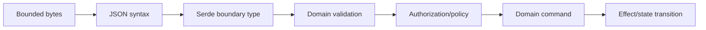
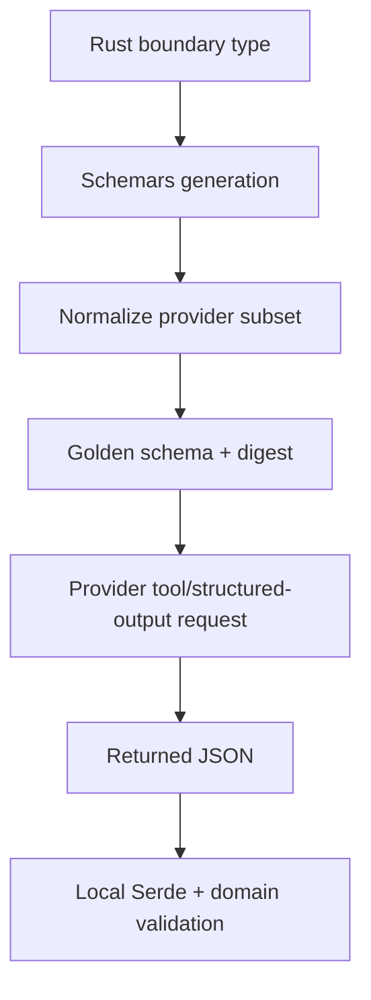

# Schemas, Serde, and Structured Output

> **Last researched:** 2026-08-31
> **Checked releases:** serde_json 1.0.151, Schemars 1.2.x
> **Related:** [Tool contracts](../../tools/tool-contracts.md) and [prompt injection and untrusted data](../../security/prompt-injection-and-untrusted-data.md)

Rust types make invalid internal states harder to represent. They do not prove that model output, MCP messages, provider events, HTTP bodies, queue messages, or stored checkpoints are valid. The boundary is only safe after size limits, syntax decoding, shape validation, domain validation, authorization, and compatibility checks.

## Use distinct boundary stages



Do not deserialize directly into a persistence entity or effect command. A useful type progression is:

```rust
#[derive(serde::Deserialize)]
#[serde(deny_unknown_fields)]
struct ToolArgsWire {
    repository_id: String,
    path: String,
    expected_version: u64,
}

struct ValidatedToolArgs {
    repository_id: RepositoryId,
    relative_path: SafeRelativePath,
    expected_version: Revision,
}
```

The conversion to `ValidatedToolArgs` performs length, syntax, path, cross-field, and tenant checks. Authorization then creates a capability-bearing command.

## Know Serde's defaults and conflicts

Serde ignores unknown fields in self-describing formats by default. Apply `#[serde(deny_unknown_fields)]` where closed input schemas are appropriate. Serde documents that this attribute is not supported in combination with `flatten`, either on the outer struct or flattened field. Do not assume both policies are active.

Prefer explicitly tagged enums:

```rust
#[derive(serde::Deserialize)]
#[serde(tag = "type", content = "data", rename_all = "snake_case")]
enum ToolResultWire {
    Text { value: String },
    Artifact { artifact_id: String, media_type: String },
    Error { code: String, message: String },
}
```

Untagged enums try variants and can produce poor diagnostics; Serde notes they can also be costly. Avoid them for hostile/high-volume boundaries unless ambiguity and worst-case behavior have been measured.

Define deliberately:

- absent versus `null`;
- default versus required;
- numeric range and precision;
- duplicate member policy in the parser/provider;
- string length and normalization;
- enum evolution and unknown variants;
- timestamps, units, identifiers, and decimal representation;
- whether a field is input-only, output-only, or durable.

## Bound JSON before and during parsing

Cap compressed bytes, decompressed bytes, and the parser input. A recursion limit is not a byte limit. `serde_json` has a recursion limit; enabling `unbounded_depth` removes that protection and its docs warn about stack overflow during parsing and later recursive `Debug`, `Display`, and `Drop`.

For streams:

- frame before deserialization;
- cap partial frame bytes;
- deserialize one event at a time;
- reject trailing data with `Deserializer::end` where one value is expected;
- avoid collecting unbounded `serde_json::Value` trees;
- use owned types when input buffers will be discarded.

Serde can borrow strings/bytes for zero-copy deserialization. This can reduce copies in a tight parser, but borrowed values tie domain lifetimes to input buffers. Prefer owned validated domain types unless profiling proves borrowing materially helps and the lifetime remains local.

## Treat JSON Schema as a generated artifact

Schemars can derive schema from Rust types, but generated schema is not automatically the provider's accepted structured-output dialect. Its current default targets JSON Schema 2020-12; providers and protocols often support a subset or another dialect.

Schemars explicitly states:

- its default dialect may change in a future version;
- the exact generated schema structure may change between versions without being considered a breaking change;
- schemas generated from example values are less precise, especially for enums;
- generation can describe serialization or deserialization contracts, which are not always identical.

Therefore:

1. pin Schemars;
2. choose the dialect/settings intentionally;
3. generate from types, not one example value;
4. transform to the provider subset in a reviewed step;
5. store a canonical/golden schema artifact;
6. validate it with the provider or protocol conformance suite;
7. diff it during dependency upgrades;
8. validate returned values again locally.



## Separate four contracts

| Contract | Owner | Compatibility concern |
|---|---|---|
| Rust type | Application code | Source and trait compatibility |
| JSON wire type | API/protocol | Field/variant evolution |
| Provider schema | Model vendor | Supported JSON Schema subset |
| Durable payload | Persistence/workflow | Replay and multi-version readers |

One derive can help produce several of these, but should not silently make them identical. Durable payloads need explicit versions and migration/upcaster tests. Provider schemas may need stricter subsets. Rust types may contain internal fields never sent on the wire.

## Structured output failure policy

Classify:

- syntax invalid;
- schema invalid;
- domain invalid;
- unauthorized;
- stale version/precondition;
- output too large/deep;
- provider refused schema;
- provider returned a new/unknown event.

Repair prompts or model retries are appropriate only inside a bounded attempt budget and only before effects. Do not “repair” an unauthorized or stale command. Never coerce invalid arguments into an effect silently.

## Verification checklist

- [ ] Raw bytes, decoded wire type, validated domain type, and authorized command are distinct.
- [ ] Every boundary has compressed/decompressed/frame/depth limits.
- [ ] Unknown-field policy is explicit and does not conflict with `flatten`.
- [ ] Untagged enums have an evidence-backed reason.
- [ ] Numeric, string, identifier, path, unit, and cross-field constraints are validated.
- [ ] Generated schemas are pinned, normalized, diffed, and tested against the exact provider.
- [ ] Tool results are validated as strictly as tool arguments.
- [ ] Durable payloads have explicit versions and compatibility fixtures.
- [ ] Error messages do not reflect secrets or enormous hostile values.

## Selected primary sources

- [Serde container attributes](https://serde.rs/container-attrs.html)
- [Serde deserializer lifetimes](https://serde.rs/lifetimes.html)
- [serde_json `Deserializer`](https://docs.rs/serde_json/latest/serde_json/struct.Deserializer.html)
- [Schemars generation settings](https://docs.rs/schemars/latest/schemars/generate/)
- [Schemars stability caveats](https://docs.rs/schemars/latest/schemars/)
