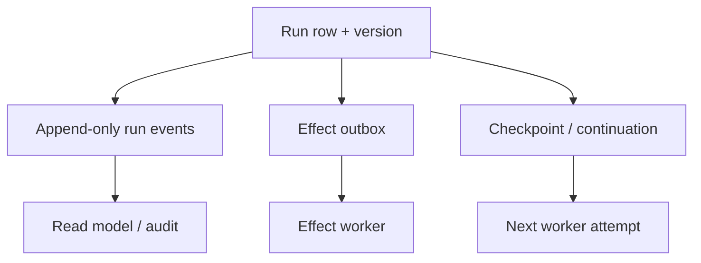
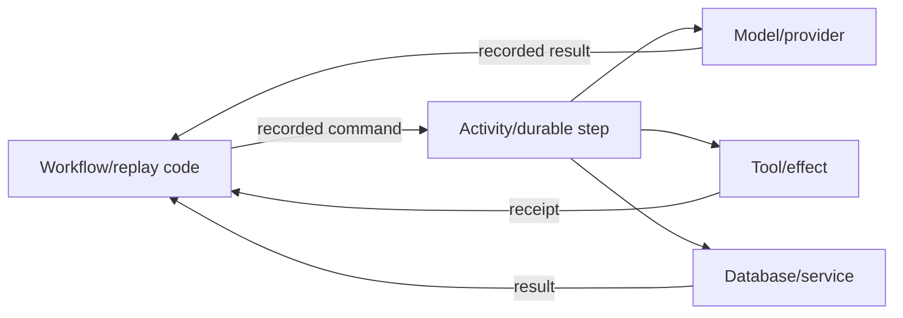

# State, Persistence, and Durable Workers

> **Last researched:** 2026-08-31
> **Checked surfaces:** SQLx 0.9.0, Temporal Rust public preview, Restate Rust active development
> **Related:** [Durable execution](../../runtime/durable-execution.md) and [idempotency and side effects](../../reliability/idempotency-and-side-effects.md)

Rust ownership protects process memory; it does not make a run survive process death. Durable agent design begins by deciding what must survive, how concurrent attempts are fenced, and which nondeterministic operations the durable engine records.

## Persist evidence, not opaque runtime objects

Persist stable domain records:

- run ID, tenant, input reference, policy/profile version;
- run state and monotonic version;
- attempt/lease owner and expiry;
- model request receipt, response/provider request IDs, usage;
- tool call, validated arguments digest, effect ID, receipt;
- event sequence and artifact handles;
- cancellation reason and terminal outcome;
- prompt/tool/schema/model versions required for replay or audit.

Avoid serializing Tokio task handles, trait objects, provider stream types, framework-private message objects, or raw secrets. They are not durable contracts.

Use snapshots/checkpoints to accelerate reads, but keep enough append-only evidence to diagnose and repair.

## Use database transactions for local atomicity

With SQLx:

- create one shared, bounded `Pool`; cloning it is cheap;
- configure maximum connections and acquire timeout;
- treat pool wait as part of admission/deadline;
- keep transactions short and never hold them across model calls or human waits;
- update run state and insert outbox intent in one transaction;
- use version/lease predicates to fence stale workers;
- call `Pool::close().await` during shutdown.

SQLx documents that a dropped in-progress `Transaction` rolls back. Because Rust has no async `Drop`, explicit `commit().await` or `rollback().await` still gives clearer outcome handling. A rollback request itself may fail or race with connection loss; do not report an external effect as undone merely because the local transaction rolled back.

SQLx's compile-time checked query macros can use a live schema or committed offline metadata. Run the documented prepare/check workflow in CI, and deploy migrations with locking/serialization. SQLx warns that disabling migration locking can cause errors or data loss when clients migrate concurrently.

## Apply the outbox/inbox pattern

For local state plus remote effect:

1. transactionally write run transition and outbox intent;
2. commit;
3. worker claims intent with a lease;
4. call remote target using stable effect ID;
5. persist receipt and mark intent complete;
6. on ambiguity, reconcile using target receipt/query API.

The outbox prevents “state committed but work was never scheduled.” It does not create exactly-once remote effects; target idempotency and reconciliation remain necessary.

For inbound queue/webhook events, store an inbox/deduplication key before applying the state transition. Define retention so old duplicates do not become new work after dedupe records expire.

## Keep durable code deterministic

Model calls, wall-clock time, random IDs, network requests, and ordinary database reads are nondeterministic. Put them in the engine's activity/step abstraction so results are recorded. Do not call them directly from deterministic workflow code unless the engine explicitly supports and journals that operation.

Version workflow code and payloads. Replaying an old history through a changed branch, changed schema, or changed tool name can break recovery even though the Rust code compiles.

## Evaluate Rust durable-engine maturity accurately

| Surface | Snapshot | Production interpretation |
|---|---|---|
| Temporal Rust SDK | Official repository calls `temporalio-sdk` a **Public Preview** SDK built on Core | Evaluate for controlled adoption; do not infer maturity from Temporal's mature server or other language SDKs |
| Temporal Core SDK | Rust core powers several official language SDKs | Internal/core maturity does not automatically make the public Rust workflow API GA |
| Restate Rust SDK | Project-supported SDK; README says active development and may break | Pin SDK/server compatibility and test upgrades/replay |
| Queue + SQL outbox | Application-owned pattern on stable database/queue clients | Simpler for short step graphs; team owns leases, timers, repair, visibility |

Restate's documentation describes journaled durable operations and workflows, while its Rust SDK repository provides service/workflow macros and version compatibility. The generic docs may not show Rust examples for every advanced feature. Verify the exact Rust crate, server version, and feature before claiming parity.

## Separate cancellation from abandonment

Persist:

- cancellation requested;
- cancellation acknowledged by the current worker;
- child activities cancelled/terminated;
- external effects known completed, known not completed, or ambiguous;
- final compensated/cancelled state.

A client disconnect is not necessarily durable cancellation. A lease expiry is not proof the previous worker stopped. Fence every commit with attempt/lease ownership so late work cannot overwrite a newer attempt.

## Retention and history are capacity controls

Long-running agents can accumulate model events, tool results, traces, and workflow history indefinitely. Define:

- maximum events/history per run;
- checkpoint/continue-as-new strategy where the engine supports it;
- artifact offloading for large values;
- PII/secret redaction and encryption;
- deletion/legal retention behavior;
- schema migration and crypto-key rotation;
- repair tooling for stuck, ambiguous, and incompatible runs.

## Durable verification checklist

- [ ] Run state, events, outbox, effect receipts, and checkpoints have explicit schemas/versions.
- [ ] Concurrent workers are fenced by version or lease token.
- [ ] State transition and outbox intent commit atomically.
- [ ] Remote effects use stable IDs and have an ambiguity state.
- [ ] Transactions never span model/tool/human waits.
- [ ] Pool sizes and acquire timeouts are aligned with admission.
- [ ] Workflow code contains no unrecorded nondeterminism.
- [ ] SDK/server/workflow versions are pinned and replay-tested.
- [ ] Cancellation survives process failure and records effect reconciliation.
- [ ] History/retention/artifact growth is bounded.
- [ ] Operators can inspect, retry, compensate, migrate, or terminate a stuck run.

## Selected primary sources

- [SQLx `Pool`](https://docs.rs/sqlx/latest/sqlx/struct.Pool.html)
- [SQLx `Transaction`](https://docs.rs/sqlx/latest/sqlx/struct.Transaction.html)
- [SQLx checked queries and offline mode](https://docs.rs/sqlx/latest/sqlx/macro.query.html)
- [SQLx migration locking](https://docs.rs/sqlx/latest/sqlx/migrate/struct.Migrator.html)
- [Temporal Rust SDK repository](https://github.com/temporalio/sdk-rust)
- [Restate Rust SDK repository](https://github.com/restatedev/sdk-rust)
- [Restate workflows](https://docs.restate.dev/tour/workflows)
