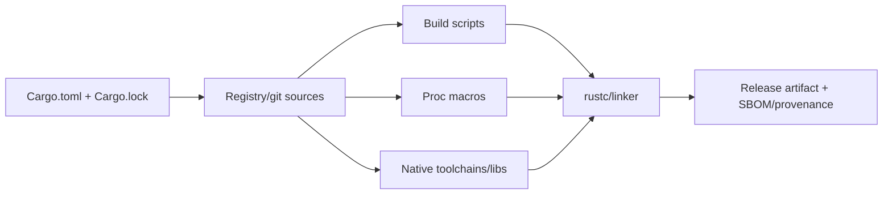

# Rust Supply Chain, Build, and Deployment

> **Last researched:** 2026-08-31
> **Security context:** Includes 2026 Cargo advisories and the 2026-08-20 crates.io incident
> **Related:** [Deployment, release, and incident response](../../operations/deployment-release-and-incident-response.md)

Rust's compile-time safety does not make its dependency supply chain safe. Cargo executes build scripts and procedural macros while building; native libraries and code generators extend the trust boundary. A compromised dependency can act before the final binary exists.

## Treat the build as privileged code execution



Cargo's documentation states that `build.rs` is compiled and run before the package and may perform arbitrary tasks. It can access the build environment and workspace unless CI isolation prevents it.

The Rust Security Response Team's 2026-08-20 report found malicious crates/build scripts downloading a payload, including a compromised republish of a popular dependency. This is concrete evidence that lockfiles and popularity alone are insufficient.

## Pin the toolchain and graph

Commit:

- `rust-toolchain.toml` with channel/version and required components/targets;
- `Cargo.toml`;
- application `Cargo.lock`;
- checked offline SQL/schema/codegen metadata where applicable;
- vendor configuration when offline/reproducible builds require it.

Set `package.rust-version`/MSRV policy. Cargo may use MSRV during resolution, but the Rust project ships fixes only on the latest version. Decide how quickly services absorb toolchain security releases.

Use `--locked` in CI/release so Cargo fails rather than changing the lockfile. `--frozen` also forbids network and is appropriate only after sources are available. `cargo vendor` copies crates.io and git dependencies into a controlled source tree; it does not audit them.

Inspect:

```text
cargo tree --workspace --target all --all-features --duplicates
cargo tree -e features
```

Cargo feature unification takes the union of features for a semver-compatible package. A transitive dependency can enable native TLS, codegen, or broad capabilities unexpectedly. Duplicate major versions can increase artifact size and create type incompatibilities.

## Layer complementary controls

| Control | What it adds | What it does not prove |
|---|---|---|
| `Cargo.lock` + `--locked` | Exact dependency resolution | Source is benign |
| RustSec/`cargo audit` | Known advisories against lockfile | Unknown/malicious code, reachability |
| `cargo deny` | Advisories, license/source/bans/duplicates policy | Code review |
| `cargo vet` | Trusted audits and review coverage | Behavior outside audit criteria |
| `cargo auditable`/SBOM | Dependency evidence in an artifact | Vulnerability absence |
| Vendoring | Controlled/offline source availability | Source authenticity by itself |
| Signed provenance | Build identity and inputs | Runtime safety |

Review dependencies with:

- owners/maintainers and release policy;
- source and build/proc-macro behavior;
- unsafe/FFI surface;
- default and optional features;
- transitive graph size;
- native dynamic/static dependencies;
- security history and response path;
- license and export constraints;
- reproducibility and target support.

Pay special attention to provider clients, parsers, TLS, compression, database drivers, Wasm/native inference, MCP, and telemetry because they process untrusted data or execute at high authority.

## Isolate CI and secrets

Build untrusted pull requests without production registry tokens, cloud credentials, signing keys, deployment credentials, or broad network access. Separate:

1. source/test build;
2. dependency/security policy;
3. reproducible release build;
4. artifact signing/attestation;
5. deployment promotion.

Build scripts/proc macros run on the build host, not in the final container. A minimal runtime image does not protect a privileged CI runner.

The 2026 Cargo advisories also showed that alternate/third-party registries can have distinct risks. Keep Cargo current, scope registry credentials, and review registry trust/configuration rather than treating every registry like crates.io.

## Build production artifacts deliberately

Decide and measure:

- target triple and libc (GNU versus musl);
- TLS backend/root store;
- static versus dynamic native libraries;
- debug symbols and symbol server retention;
- `strip`, codegen units, and LTO;
- panic strategy;
- CPU baseline/features;
- cross-compilation toolchain;
- FIPS/compliance requirements;
- reproducible timestamp/build metadata.

LTO can improve optimization at build-time cost; `panic = "abort"` changes incident and cleanup behavior. Do not cargo-cult size flags. Keep enough symbols/build IDs to diagnose crashes and profiles even if the deployed binary is stripped.

Use a non-root runtime image with:

- read-only root filesystem where possible;
- explicit writable working/artifact directories;
- no compiler/package manager/shell unless required;
- minimal CA/timezone data actually needed;
- seccomp/AppArmor/SELinux and dropped capabilities;
- egress and secret policy;
- CPU, memory, PID, and FD limits;
- health/readiness endpoints that test owned dependencies.

## Release as a compatibility event

Before promotion:

- run provider/MCP/schema contract tests against pinned versions;
- replay durable histories/checkpoints;
- test old/new wire payload compatibility;
- test graceful shutdown and drain under load;
- fault model streams, tools, database, telemetry, and subprocesses;
- compare RSS, task count, queue wait, and latency;
- generate SBOM/provenance and scan;
- canary with rollback plus durable-worker version policy.

Rollback may not be safe after a schema, workflow, protocol, or provider-contract migration. Define forward/backward compatibility first.

## Incident response for a compromised crate

1. freeze builds and preserve lockfiles, caches, CI logs, artifacts, and provenance;
2. identify affected versions/features/build hosts and published artifacts;
3. rotate credentials reachable from build jobs;
4. rebuild on clean infrastructure with a remediated graph;
5. compare SBOMs and artifact hashes;
6. redeploy/recall affected artifacts;
7. add deny/audit/vet policy and monitoring for the class;
8. document exposure, not merely that a malicious version was yanked.

Yanking/deleting prevents future resolution; it does not remove a crate from caches or binaries already built.

## Supply-chain and release checklist

- [ ] Toolchain, MSRV, lockfile, targets, and feature set are pinned.
- [ ] CI/release uses `--locked`; offline/vendor policy is tested.
- [ ] Build scripts, proc macros, unsafe/FFI, and native libraries are inventoried.
- [ ] RustSec plus license/source/duplicate policy runs in CI.
- [ ] High-risk dependencies have review/audit ownership.
- [ ] PR builds cannot reach production secrets or signing keys.
- [ ] SBOM, provenance, build ID, and symbols are retained.
- [ ] Container runtime authority and resources are minimal.
- [ ] Canary, rollback/roll-forward, workflow, and schema compatibility are rehearsed.
- [ ] Dependency incident response includes build-host and credential compromise.

## Selected primary sources

- [Cargo dependency resolver and lock behavior](https://doc.rust-lang.org/cargo/reference/resolver.html)
- [Cargo build scripts](https://doc.rust-lang.org/cargo/reference/build-scripts.html)
- [Cargo vendoring](https://doc.rust-lang.org/cargo/commands/cargo-vendor.html)
- [Cargo feature unification](https://doc.rust-lang.org/cargo/reference/features.html)
- [Cargo profiles](https://doc.rust-lang.org/cargo/reference/profiles.html)
- [RustSec and cargo-audit](https://rustsec.org/)
- [cargo-vet](https://github.com/mozilla/cargo-vet)
- [2026 arrayref supply-chain incident](https://blog.rust-lang.org/2026/08/20/supply-chain-attack-on-arrayref/)
- [Cargo CVE-2026-5223](https://blog.rust-lang.org/2026/05/25/cve-2026-5223/)
- [Cargo CVE-2026-5222](https://blog.rust-lang.org/2026/05/25/cve-2026-5222/)
