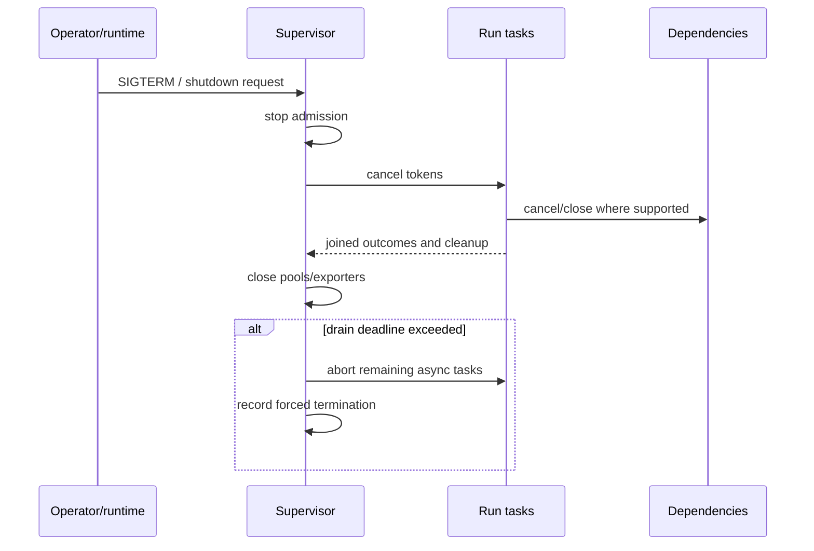

# Tokio Runtime, Cancellation, and Graceful Shutdown

> **Last researched:** 2026-08-31
> **Baseline:** Tokio 1.53.1
> **Related:** [Run controls](../../runtime/run-controls.md) and [queues, scheduling, and backpressure](../../operations/queues-scheduling-and-backpressure.md)

Tokio cancellation usually means a future is dropped at an `.await`. It is not an exception injected at any instruction, and it does not undo a remote side effect. A correct agent runtime must distinguish cooperative stop requests, future drop, task abort, blocking work, process termination, and durable cancellation.

## Use a two-phase stop



1. **Graceful phase:** stop admission, cancel run tokens, close producers, let tasks flush bounded cleanup, and join them.
2. **Forced phase:** after a deadline, abort remaining async tasks, terminate isolated processes/containers, record unfinished durable work, and exit.

Pair `CancellationToken` with `TaskTracker` or another join mechanism. A cancellation token sends intent; the tracker proves the owned tasks finished. `TaskTracker::close` plus an empty tracker completes `wait`. Unlike dropping a `JoinSet`, dropping a tracker does not abort its tasks.

## Understand each cancellation mechanism

| Mechanism | What happens | Production caveat |
|---|---|---|
| Drop a future | Its synchronous destructors run; async work inside it stops being polled | No async `Drop`; partial protocol/application state may remain |
| `CancellationToken::cancel` | Waiters become ready and may perform graceful cleanup | Cooperative; code must select/check it |
| `JoinHandle::abort` | Task is scheduled for cancellation at a yield point | Await the handle to observe completion; task may win race and finish normally |
| Runtime shutdown | Async tasks are dropped after yielding | No completion guarantee |
| `tokio::time::timeout` | On expiry the wrapped future is cancelled/dropped | A future that does not yield can run past the timeout |
| `spawn_blocking` abort | Usually no effect after the closure starts | Runtime shutdown may wait indefinitely |
| Process kill | OS-level termination request | Descendants, reaping, and platform behavior require explicit design |
| Durable cancel | Workflow/queue-specific persisted intent | Does not retract an already committed external effect |

Tokio documents that `abort` returns before cancellation finishes. Await the handle if cleanup/destructors must be complete before releasing a resource or declaring shutdown successful.

## Audit cancellation safety, not just cancellation propagation

`tokio::select!` drops losing branches. In a loop, restarting a non-cancellation-safe operation can lose data or fairness position.

| Tokio operation | Documented behavior in a `select!` loop |
|---|---|
| `mpsc::Receiver::recv`, `broadcast::Receiver::recv`, `watch::Receiver::changed` | Cancellation-safe |
| TCP/Unix `accept`, signal `recv`, stream `next` | Cancellation-safe |
| `AsyncReadExt::read` / `read_buf`, `AsyncWriteExt::write` / `write_buf` | Cancellation-safe |
| `read_exact`, `read_to_end`, `read_to_string`, `write_all` | Not cancellation-safe |
| `Mutex::lock`, `RwLock::read/write`, `Semaphore::acquire`, `Notify::notified` | Cancellation loses queue position |

Cancellation-unsafe does not always mean forbidden. During final shutdown, abandoning a partial read may be correct. During an ordinary loop that will retry, it may silently corrupt a frame or starve a waiter.

Review every custom future at its `.await` points:

- If dropped here, what owned data is discarded?
- Was any external effect already started or committed?
- Can the operation be restarted without duplication or data loss?
- Does drop release a permit, lock, file, or connection?
- Is cleanup synchronous and bounded?
- Must the operation instead run in an owned child task and be joined?

## Keep CPU and blocking work off core workers

Tokio switches tasks at yield points. A long parse, tokenization pass, compression, local inference step, or policy scan without `.await` can starve unrelated tasks and make timeouts appear broken.

Use:

- chunking or explicit yields for bounded CPU work that remains async;
- a measured semaphore around `spawn_blocking` for short, terminating blocking work;
- Rayon or a dedicated CPU executor for parallel compute;
- a dedicated thread for a long-lived synchronous loop;
- a process or external worker for untrusted or potentially non-terminating work.

`spawn_blocking` has a large default thread ceiling and queues after the ceiling. It is not an admission controller. Bound CPU-heavy submissions before spawning them. Never put a call that may hang forever into `spawn_blocking`; started closures cannot be aborted and can make runtime drop wait forever. `shutdown_timeout` stops waiting but leaks still-running work/threads until they return.

## Build fairness and backpressure intentionally

Tokio `select!` randomly chooses the first branch to check by default. `biased;` makes order deterministic but transfers fairness responsibility to the application. If a high-volume event stream is always ready, place shutdown/control branches where they cannot starve.

Tokio semaphores are fair. A large `acquire_many` request at the queue head can block smaller requests even when enough permits exist for those smaller requests. This is useful fairness but can create head-of-line blocking for weighted model budgets. Consider separate pools/classes rather than one semaphore mixing tiny embeddings and huge generations.

Bounded `mpsc::channel` supplies element-count backpressure. The element can still contain a multi-megabyte prompt or artifact; maintain a byte budget separately. An unbounded Tokio channel can buffer until process memory is exhausted and the process aborts.

## A practical supervisor skeleton

```rust
let cancel = CancellationToken::new();
let tracker = TaskTracker::new();

for accepted in listener {
    let child = cancel.child_token();
    tracker.spawn(async move {
        tokio::select! {
            _ = child.cancelled() => Ok(()),
            result = serve_run(accepted, child.clone()) => result,
        }
    });
}

// shutdown path
stop_admission();
cancel.cancel();
tracker.close();

if tokio::time::timeout(drain_budget, tracker.wait()).await.is_err() {
    record_forced_shutdown();
}
```

The skeleton omits error collection, process termination, database/pool closure, telemetry flush, and a forced abort registry. Add them according to the owned resources. A `TaskTracker` also frees completed task storage rather than retaining every completed result until joined, but application errors still need an explicit reporting channel.

## Test the ugly timing

- cancel before the first poll;
- cancel at every `.await` around model/tool I/O;
- race completion with `abort`;
- disconnect the stream while tools continue;
- fill the event channel, then cancel;
- exhaust a fair semaphore with mixed weights;
- block one core worker with an accidental CPU loop and observe latency;
- start a `spawn_blocking` task that exceeds shutdown budget;
- send two shutdown signals;
- close the database pool while runs hold connections;
- prove all task counts and permits return to baseline.

Use Tokio's paused time for timers and retry tests. It affects Tokio `Instant`, not `std::time::Instant`. Keep real process/network cleanup tests separate.

## Selected primary sources

- [Tokio graceful shutdown](https://tokio.rs/tokio/topics/shutdown)
- [Tokio task cancellation](https://docs.rs/tokio/latest/tokio/task/)
- [Tokio `select!` cancellation safety](https://docs.rs/tokio/latest/tokio/macro.select.html)
- [Tokio timeout](https://docs.rs/tokio/latest/tokio/time/fn.timeout.html)
- [Tokio `spawn_blocking`](https://docs.rs/tokio/latest/tokio/task/fn.spawn_blocking.html)
- [Tokio runtime shutdown](https://docs.rs/tokio/latest/tokio/runtime/struct.Runtime.html)
- [Tokio bounded channel](https://docs.rs/tokio/latest/tokio/sync/mpsc/fn.channel.html)
- [Tokio semaphore](https://docs.rs/tokio/latest/tokio/sync/struct.Semaphore.html)
