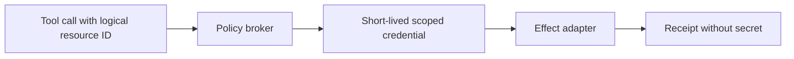

# Rust Tools, Processes, and Sandboxing

> **Last researched:** 2026-08-31
> **Related:** [Tool contracts](../../tools/tool-contracts.md), [execution boundaries](../../runtime/execution-boundaries.md), and [permissions, sandboxing, and secrets](../../security/permissions-sandboxing-and-secrets.md)

Rust memory safety does not make an in-process tool safe. A tool crate has the controller's address space, filesystem, environment, network, credentials, and process privileges unless the architecture removes them. Treat the tool boundary as a capability and effect boundary, not merely a trait.

## Pick the boundary by trust, not convenience

| Boundary | Isolation | Cancellation | Best fit |
|---|---|---|---|
| In-process function/trait | None from controller | Cooperative future drop | Fully trusted, bounded pure/read operations |
| Dedicated Tokio task | Fault/timing ownership only | Abort at yield; same process authority | Trusted async work needing independent lifecycle |
| OS process | Address-space separation | Signal/kill plus platform process-tree policy | Native tools and controlled CLIs |
| Wasmtime/WASI component | Wasm memory + explicit host imports | Fuel/epoch plus host cancellation | Portable plugins with narrow capabilities |
| Container/VM/remote worker | Stronger OS/network/resource boundary | Supervisor/runtime dependent | Hostile code, broad tools, native dependencies |

Do not put model-generated code, unreviewed plugins, or arbitrary shell execution in the controller process.

## Build tools as a narrow pipeline


The executor should receive an `AuthorizedToolCall`, not raw JSON. Authorization must be checked immediately before the effect because principals, policy, and resource versions may have changed since the model proposed the call.

Return:

- stable call and effect identifiers;
- outcome class and machine-readable error;
- bounded structured data;
- artifact handles rather than huge inline blobs;
- timing, resource, and executor identity;
- provenance needed for reconciliation and audit;
- a redacted model-facing summary distinct from operator evidence.

## Invoke processes without a shell

`std::process::Command` and `tokio::process::Command` pass arguments literally rather than through a shell. Preserve that property:

```rust
let mut cmd = tokio::process::Command::new(approved_program);
cmd.args(validated_args)
    .env_clear()
    .envs(minimal_environment)
    .current_dir(approved_workdir)
    .stdin(std::process::Stdio::null())
    .stdout(std::process::Stdio::piped())
    .stderr(std::process::Stdio::piped())
    .kill_on_drop(true);
```

Never interpolate model output into `sh -c`, `cmd.exe /C`, PowerShell, or a batch file. Rust's standard-library documentation specifically warns that `cmd.exe` and `.bat` argument decoding is non-standard and can turn malicious arguments into commands.

Additional process rules:

- resolve an allowlisted executable to an absolute path;
- do not rely on a mutable `PATH`;
- pass a minimal environment and no ambient cloud credentials;
- use a new empty/workspace directory with explicit mount policy;
- close/inherit only intended handles;
- bound stdin, stdout, stderr, wall time, CPU, memory, processes, and files;
- drain stdout and stderr concurrently;
- distinguish spawn failure, exit status, signal/termination, timeout, and output-limit failure;
- redact command arguments and environment before logging.

`kill_on_drop` is `false` by default in Tokio. If a `Child` handle is dropped, the process otherwise continues. On Unix, a child must also be reaped; Tokio only promises best-effort reaping for dropped children and recommends awaiting when strict cleanup is required.

Killing the immediate process is not a cross-platform process-tree guarantee. Use Unix process groups/session supervision, Windows Job Objects, or a container supervisor, and prove descendant termination on every supported OS.

## Bound output while draining both pipes

Waiting for a child before consuming full pipes can deadlock. Consume stdout and stderr concurrently, but cap them:

- stop retaining after the byte budget;
- decide whether to terminate the tool or continue with truncated evidence;
- preserve a truncation marker and original byte count when known;
- never decode arbitrary output with an unbounded `read_to_end`;
- validate UTF-8 policy or retain bytes/artifact separately;
- keep the model-facing excerpt smaller than the operator artifact.

Remember Tokio's `read_to_end` and `read_to_string` are not cancellation-safe inside a repeated `select!` loop. Prefer an owned drain task with bounded incremental reads, cancellation, and a join.

## Capability-scope filesystem access

`cap-std` models access as values: a `Dir` opens relative paths under an already-open directory, and a network `Pool` can represent allowed addresses. This is useful for keeping ambient authority localized.

It is defense in depth, not a complete hostile-code sandbox:

- unsafe code or other ambient APIs can bypass it in-process;
- symlink and platform behavior must be tested for the exact operation;
- the initial call to `ambient_authority` is the authority transition and should be centralized;
- child processes inherit broader OS authority unless separately sandboxed.

Use a typed capability object so tool implementations receive only the directory, network targets, secrets, and effect methods they need.

## Use Wasmtime with explicit limits

Wasmtime can be a strong plugin boundary when the host exposes a narrow WASI/component interface. Configure:

- memory/table/instance limits through a store resource limiter;
- fuel for deterministic instruction budgeting;
- epoch interruption for coarse wall-clock interruption;
- async yielding when executing Wasm on Tokio;
- maximum host-call bytes and counts;
- preopened directories rather than ambient filesystem;
- no network unless explicitly required;
- separate stores for bounded lifetimes.

Wasmtime documents that a `Store` is intended to be short-lived: instantiated objects are not reclaimed until the store drops. Do not accumulate an unbounded number of plugin instances in one store. Fuel and epochs also do not stop a Wasm guest that is blocked inside an unbounded host function; host calls need their own cancellation and resource limits.

Wasm isolation is only as strong as host imports. A host function like `run_shell(String)` recreates the original vulnerability inside a nicer container.

## Keep secrets and network authority outside model data

Do not serialize secrets into prompts, tool schemas, environment diagnostics, or tool results. Prefer a brokered operation:



The model chooses a logical operation. Trusted policy code maps it to a narrowly scoped credential. The executor never returns the credential.

## Sandbox verification checklist

- [ ] In-process tools are explicitly classified as fully trusted.
- [ ] Raw model arguments cannot select arbitrary executables, paths, URLs, or environments.
- [ ] No shell or batch interpreter receives untrusted strings.
- [ ] The whole process tree terminates on timeout and shutdown.
- [ ] stdout/stderr cannot deadlock or exceed byte budgets.
- [ ] Filesystem, network, secret, CPU, memory, file, and process limits are enforced outside the model.
- [ ] Wasm stores, fuel, epochs, host calls, and preopened capabilities are bounded.
- [ ] Tool receipts permit ambiguous-outcome reconciliation.
- [ ] Sandbox escape and denial-of-service tests run on every target OS/runtime.

## Selected primary sources

- [Rust `Command`](https://doc.rust-lang.org/std/process/struct.Command.html)
- [Tokio process `Command`](https://docs.rs/tokio/latest/tokio/process/struct.Command.html)
- [cap-std capability model](https://docs.rs/cap-std/latest/cap_std/)
- [Wasmtime `Store` and resource limits](https://docs.rs/wasmtime/latest/wasmtime/struct.Store.html)
- [Wasmtime interruption configuration](https://docs.rs/wasmtime/latest/src/wasmtime/config.rs.html)
