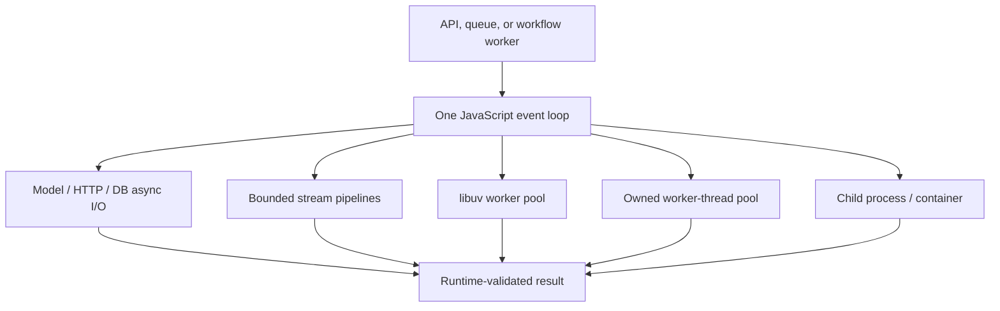
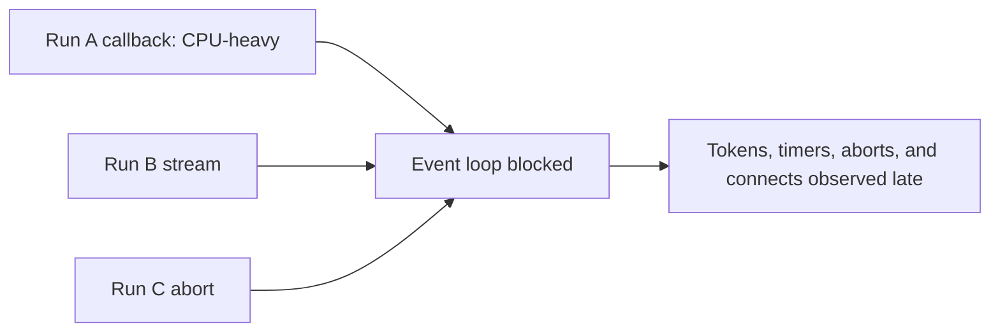
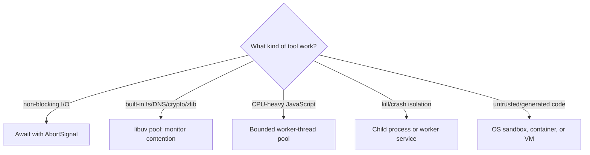
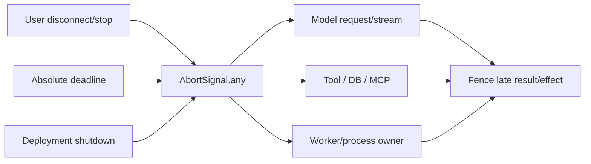
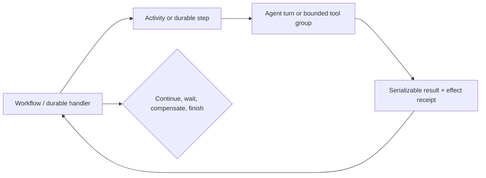

# TypeScript and Node.js Agent Runtimes in Production

> **Status:** Research-backed production guide  
> **Last researched:** 2026-08-31  
> **Current baseline:** Node.js 24.20.0 LTS; 26.8.1 Current  
> **Evidence:** [Python and TypeScript/Node.js runtime packet](../research/packets/python-and-typescript-agent-runtimes.md)  
> **Decision companion:** [Python vs TypeScript/Node.js](../comparisons/python-vs-typescript-node-agent-runtimes.md)

TypeScript/Node.js is a strong default for web-owned, streaming, I/O-heavy agent products. Its best production property is not “type safety”; it is a coherent event-driven ecosystem from server APIs through browser-facing streams. Its central risk is that one blocking callback, unbounded buffer, or ignored abort can affect many concurrent runs.

## Choose TypeScript/Node.js when the whole fit is strong

| Strong fit | Reconsider or isolate |
|---|---|
| One product team owns UI, API, and streaming contracts | Core work is sustained CPU-heavy computation in the serving process |
| Workload is mostly model, HTTP, database, queue, and stream I/O | Required data/ML or agent capability is materially stronger in Python |
| Required agent SDK/framework and durable adapter have current JS support | Deployment target is called “edge” but dependencies require full Node APIs |
| Runtime schema libraries define tool/UI/wire contracts | Team has no practice with event-loop lag, worker pools, or process supervision |
| Node LTS, npm supply chain, and on-call operations already exist | Untrusted code would run in the Node process or permission model |

Do not choose it solely to share TypeScript interfaces with the browser. Interfaces disappear at runtime and browser/server trust boundaries still require validation and authorization.

## The production mental model

The event loop orchestrates JavaScript callbacks and non-blocking I/O. The libuv pool separately handles selected filesystem, DNS, crypto, and compression operations. `worker_threads` are another pool for CPU-intensive JavaScript. Child processes/containers add stronger lifecycle or trust isolation. Conflating these mechanisms leads to surprising contention.

## Baseline and version policy

Node recommends production applications use Active or Maintenance LTS. At the research date, v24 is LTS and v26 is Current. Pin the exact LTS line, base image, package manager, and lockfile; test the future LTS line before promotion.

Node's schedule changes after v26: starting with v27, releases become annual and each major is intended to reach LTS after Current and Alpha phases. Keep support-policy assumptions dated.

Current features worth deliberate evaluation include:

- stable native TypeScript type stripping in recent Node 24/26 releases;
- stable permission model with filesystem, network, child, worker, addon, and related scopes;
- stable `AsyncLocalStorage.bind()` and `snapshot()`;
- event-loop utilization/delay and worker CPU telemetry;
- evolving edge-runtime Node compatibility that is not identical to Node itself.

## Protect the event loop

Node is efficient when every callback does a small amount of work. `async` does not guarantee that: code before an await, promise continuations, synchronous parsing, schema transforms, template rendering, compression wrappers, regexes, and logging can all monopolize the loop.

Operational rules:

- forbid synchronous filesystem/network/child-process APIs on request paths;
- bound input size before JSON parsing, regex, validation, and decompression;
- measure event-loop delay and utilization at p95/p99, not only CPU percentage;
- partition tiny CPU work only when latency tests support it;
- send sustained CPU work to a pooled worker or external service;
- keep libuv-pool saturation separate from JavaScript-loop saturation;
- apply concurrency limits before memory and downstream pools overload.

Event-loop starvation can distort timeout evidence. A reproduced Undici case emitted connect timeouts while CPU-intensive JavaScript prevented timely connection progress. Diagnose network errors alongside loop lag and pool saturation.

## Select the right execution boundary

### Worker threads

Workers run JavaScript in parallel and can transfer or share memory. Use them for CPU work, not routine network I/O. Create a bounded pool at service startup; creating a worker per tool call adds startup cost and can exhaust resources.

Define:

- maximum workers and queued jobs;
- message schema and transfer-size limits;
- per-job deadline and abort protocol;
- whether termination is safe at any point;
- late-message fencing by run/attempt ID;
- worker crash replacement and poison-job handling;
- event-loop and per-worker CPU/utilization telemetry.

Shared memory makes coordination faster and correctness harder. Prefer immutable/transferable messages unless a measured bottleneck justifies shared buffers and atomics.

### Child processes and containers

Use a child process or external worker for native crashes, memory containment, force termination, or different credentials. Use an OS sandbox/container/VM for hostile inputs or generated code. Node's `vm` API and permission model are not untrusted-code sandboxes.

## Compose and propagate cancellation

Use one signal tree for the run:

`AbortSignal.timeout()` and `AbortSignal.any()` are stable, but notification is cooperative. For every dependency, verify:

1. it accepts a signal;
2. abort closes sockets/streams and rejects promptly;
3. it reports abort distinctly from timeout and provider failure;
4. nested retries stop;
5. a worker/process is terminated or drains by policy;
6. late results cannot mutate the completed run;
7. an already committed effect is reconciled.

Do not use client disconnect as the only durability signal. Some serverless platforms terminate execution without a useful cleanup window. Checkpoint progress before the interruption and use the platform's supported background/durable mechanism.

### Deadline hierarchy

| Deadline | Purpose | Important distinction |
|---|---|---|
| Run total | User/business SLO | Includes queue, model, tools, retries, approvals as policy dictates |
| Model request | Provider attempt | Connect, headers, body, and stream-idle phases may differ |
| Tool attempt | One execution | Do not let a “stream idle” timer accidentally include a healthy long tool |
| Worker termination | CPU/process cleanup | Abort notification and hard termination are different events |
| Shutdown grace | Drain/checkpoint/flush | Must complete before supervisor/platform hard stop |

Derive all from one absolute deadline and record which source aborted the operation.

## Make streams memory-safe

Node streams provide backpressure, but application code must honor it. Use `pipeline()` or async iteration so errors, aborts, and closure propagate through the chain. Respect `write()` returning `false` and wait for recovery rather than appending indefinitely.

For token/event streaming:

| Boundary | Control |
|---|---|
| Provider → server | bounded parser/event queue; close provider body on abort |
| Server → UI | backpressure-aware stream with byte/event budget |
| Parallel tools → merger | bounded fan-in and deterministic terminal event |
| Reconnect | event IDs/checkpoint cursor, not replay from process memory |
| Slow consumer | coalesce token deltas, drop only documented low-value events, or disconnect |

Track buffered bytes and consumer lag per run. A high-water mark is a threshold, not a guarantee that upstream generation stops unless the producer observes it.

## TypeScript is not runtime validation

TypeScript erases types. Node's native TypeScript mode strips erasable syntax, does not type-check, ignores `tsconfig.json`, refuses TypeScript under `node_modules`, and does not support features requiring transformation without another tool. Continue running `tsc --noEmit` or an equivalent checker in CI even when Node executes `.ts` files directly.

At runtime, validate every external boundary with a schema library such as Zod or an equivalent JSON Schema validator.

### Schema rules

- Infer TypeScript types from the runtime schema where possible, not the reverse.
- Use `parse` when failure is exceptional and `safeParse` when it is part of control flow.
- Treat async refinements/transforms as I/O with deadlines and telemetry.
- Separate input and output types when transforms change representation.
- Review conversion to JSON Schema: dates, big integers, maps, sets, custom types, and transforms may be unrepresentable.
- Pin the provider's supported JSON Schema subset and output mode.
- Reject unknown effect fields by default; introduce fields through versioned compatibility tests.
- Validate tool results as well as model-proposed arguments.
- Add semantic validation and authorization after shape validation.

## Framework and runtime selection

| Need | Representative options | Verify before adoption |
|---|---|---|
| Provider/direct loop | Provider SDKs, OpenAI Agents SDK | exact tools, approvals, streaming, state, tracing |
| Product/UI-first model SDK | Vercel AI SDK | loop stopping, tool timers, abort propagation, telemetry maturity |
| Integrated agent platform | Mastra | storage, workflow snapshots, active-run versioning, shutdown |
| Graph/checkpoint runtime | LangGraph.js | JS parity, checkpoint/replay, interrupts, graph upgrades |
| Multi-agent framework | Google ADK, Strands | language feature matrix, session durability, cancellation |
| Durable workflow | Temporal, Restate, DBOS | deterministic/journal replay, effects, versions, retained state |

Do not infer parity because a framework has both Python and TypeScript packages. Compare the exact feature: provider adapter, structured output, MCP transport, approvals, durable integration, sandbox, tracing, and lifecycle hooks.

## Durable execution boundary

Keep deterministic or journaled workflow code separate from nondeterministic agent work according to the selected engine.

Use JSON-safe, versioned state. Avoid closures, sockets, class instances, `AbortSignal`, and framework objects in checkpoints. Pin workflow code/version strategy independently from the agent behavior release and tool schemas.

## Process failures and shutdown

Official Node guidance treats an uncaught exception as an undefined application state. Log/perform only synchronous emergency cleanup and exit; let an external supervisor restart the process. Do not resume normal work from `uncaughtException`.

An `exit` listener cannot complete asynchronous work. Graceful shutdown starts on `SIGTERM`/platform lifecycle notification:

1. mark unready and stop admission;
2. stop leasing queued work;
3. abort or hand off in-flight runs;
4. close HTTP listeners and stream admission;
5. drain/terminate owned workers and child processes;
6. checkpoint resumable state and reconcile effects;
7. close clients/dispatchers and flush telemetry;
8. exit before the hard grace deadline.

Use `uncaughtExceptionMonitor` or diagnostic reports to capture evidence without suppressing the crash behavior.

## Node, serverless, and edge are different targets

The default Node runtime exposes Node APIs. Edge runtimes commonly expose Web APIs plus a subset/polyfill layer. A module may import successfully while a stubbed method throws only in production.

Before deploying an agent to edge/serverless:

- test the bundled artifact in the exact runtime and compatibility date;
- inventory filesystem, network, TCP/TLS, worker, child-process, native-addon, stream, and async-context use;
- verify maximum duration, streaming duration, payload, memory, and background-work rules;
- prove client disconnect and platform termination behavior;
- externalize durable state and long-running work;
- pin compatibility flags/dates and include them in release evidence.

Prefer the full Node runtime when agent SDKs, native packages, long streams, subprocesses, or workflow workers need it. Choose edge for measured latency/placement value, not as a generic modernization step.

## Permission and containment model

Node's permission model is stable and can deny filesystem, network, child process, worker, addon, WASI, FFI, inspector, and related operations. It is useful defense in depth for trusted code and supports audit mode for discovering required grants.

It is explicitly not a malicious-code sandbox. The documentation calls out constraints and bypass surfaces including symlink behavior, existing file descriptors, OS-level process signaling, and APIs outside a scoped module. Therefore:

- use least-privilege OS identity and container policy beneath Node permissions;
- do not grant child-process/worker/native-addon access casually;
- place generated/untrusted code in a separate sandbox service;
- apply egress allowlists and short-lived credentials;
- test denied paths and permission-audit output in CI;
- treat package install scripts as build-time code execution.

## Modules and supply chain

Use an explicit `package.json` `type`. Prefer ESM for new services when dependency support fits, but choose one internal format consistently. Conditional dual CJS/ESM exports can create duplicate-instance and state hazards; test both entrypoints if publishing both.

Production dependency controls:

- commit and review the lockfile;
- use `npm ci` or equivalent frozen install with the same resolver flags used to create it;
- disable or allowlist install scripts where practical;
- run vulnerability and signature/attestation checks;
- verify provenance while remembering it proves origin/build linkage, not harmlessness;
- generate an SBOM and retain the deployed lock/artifact digest;
- pin Node, npm/package manager, base image, and native build chain;
- stage framework/provider updates with behavioral evals and failure tests.

## Context propagation and observability

Use `AsyncLocalStorage` for run-scoped context such as `run_id`, tenant, deadline, and trace state. `bind()` and `snapshot()` are stable, but custom callback resources, worker threads, child processes, queues, and durable steps still need explicit propagation. Never store authorization as ambient context without re-validating it at the effect boundary.

Instrument:

- event-loop delay and utilization;
- active handles, connections, streams, workers, and child processes;
- libuv and application worker-pool queue depth;
- outbound connection acquisition/reuse and error causes;
- abort source, reason, observed layer, and cleanup latency;
- stream buffered bytes, consumer lag, and terminal event;
- run/turn/tool/effect/checkpoint IDs and release versions;
- RSS, heap, garbage-collection pauses, CPU and worker CPU.

OpenTelemetry JavaScript traces and metrics are stable; logs are Development. AI framework telemetry may also be experimental and can capture sensitive prompts, tool arguments, and results by default. Apply explicit redaction and retention policy.

## Production test matrix

| Test | Pass condition |
|---|---|
| CPU stall | Event-loop alarm fires; unrelated runs are protected by offload/admission |
| libuv saturation | DNS/fs/crypto queueing is visible and isolated from CPU-worker policy |
| Abort during model stream | Provider body closes, retries stop, one terminal run state is emitted |
| Abort during tool | Cooperative tool stops or worker terminates; late result/effect is fenced |
| Slow stream consumer | Memory remains bounded; coalesce/drop/disconnect policy is observable |
| Keep-alive churn | Safe requests retry within budget; effects do not retry ambiguously |
| Worker crash | Job fails/requeues once according to policy; pool replaces worker |
| Uncaught exception | Diagnostic evidence is captured; process exits; supervisor restores capacity |
| Edge compatibility | Exact artifact/runtime/date passes API and dependency probes |
| Shutdown | Admission stops and owned runs/workers/checkpoints drain within grace |
| Schema drift | Golden/adversarial fixtures enforce compatibility and reject unsafe fields |
| Clean install | Frozen lock reproduces artifact; signatures/provenance/SBOM checks run |

## Common failure patterns

| Pattern | Consequence | Better design |
|---|---|---|
| CPU work inside an `async` callback | Every run, timer, and abort stalls | Bounded worker pool or external compute service |
| Creating a worker per request | Startup/resource exhaustion | Long-lived measured pool with queue limits |
| Passing `AbortSignal` only to the model | Tools/retries/processes keep running | One composed signal plus per-layer verification |
| Ignoring stream `write()` backpressure | Memory grows with slow clients | Pipeline/async iterator and buffer budget |
| Trusting TypeScript at runtime | Malformed model/tool payload reaches effects | Runtime schema and semantic/authorization checks |
| Resuming after `uncaughtException` | Undefined/corrupt process state | Capture evidence, exit, external restart |
| Treating permissions as a sandbox | Malicious code can escape assumptions | OS/container/VM isolation |
| Assuming edge equals Node | Production-only missing/stubbed API failures | Exact-runtime integration tests |
| Dual package formats without tests | Duplicate instances and interop drift | One format or explicit matrix tests |

## Release gate

- [ ] Production runs on a supported pinned Node LTS line.
- [ ] Event-loop delay/utilization and all worker queues are measured under load.
- [ ] No unbounded CPU, parser, validation, regex, or synchronous I/O path exists.
- [ ] Worker/process pools are bounded, supervised, cancellable, and observable.
- [ ] One composed abort reaches model, tools, streams, workers, retries, and shutdown.
- [ ] Late results and ambiguous external effects are fenced/reconciled.
- [ ] Streams honor backpressure and have per-run byte/event budgets.
- [ ] Runtime schemas validate every external boundary; CI still type-checks.
- [ ] Durable state is JSON-safe, versioned, and replay-compatible.
- [ ] Uncaught exceptions crash under supervision; graceful shutdown starts before `exit`.
- [ ] Exact Node/serverless/edge target and compatibility date pass integration tests.
- [ ] Permission model is defense in depth beneath OS isolation.
- [ ] Lockfile, frozen install, audit, provenance/signature, and SBOM policy pass.

## Related guides

- [Choosing an agent runtime language](choosing-an-agent-runtime-language.md)
- [Python vs TypeScript/Node.js](../comparisons/python-vs-typescript-node-agent-runtimes.md)
- [Run controls](../runtime/run-controls.md)
- [Queues, scheduling, and backpressure](../operations/queues-scheduling-and-backpressure.md)
- [Permissions, sandboxing, and secrets](../security/permissions-sandboxing-and-secrets.md)
- [Observability and tracing](../evaluation/observability-and-tracing.md)

## Selected sources

- [Node.js release status](https://nodejs.org/en/about/previous-releases)
- [Do not block the event loop or worker pool](https://nodejs.org/en/learn/asynchronous-work/dont-block-the-event-loop)
- [Worker threads](https://nodejs.org/api/worker_threads.html)
- [`AbortController` and `AbortSignal`](https://nodejs.org/api/globals.html)
- [Streams](https://nodejs.org/api/stream.html)
- [Process failure semantics](https://nodejs.org/api/process.html)
- [Node permission model](https://nodejs.org/api/permissions.html)
- [Native TypeScript support](https://nodejs.org/api/typescript.html)
- [TypeScript erased types](https://www.typescriptlang.org/docs/handbook/typescript-from-scratch.html)
- [Zod parsing](https://zod.dev/basics)
- [OpenTelemetry JavaScript status](https://opentelemetry.io/docs/languages/js/)

