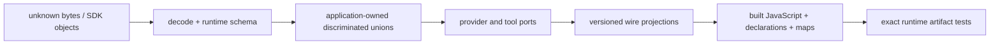
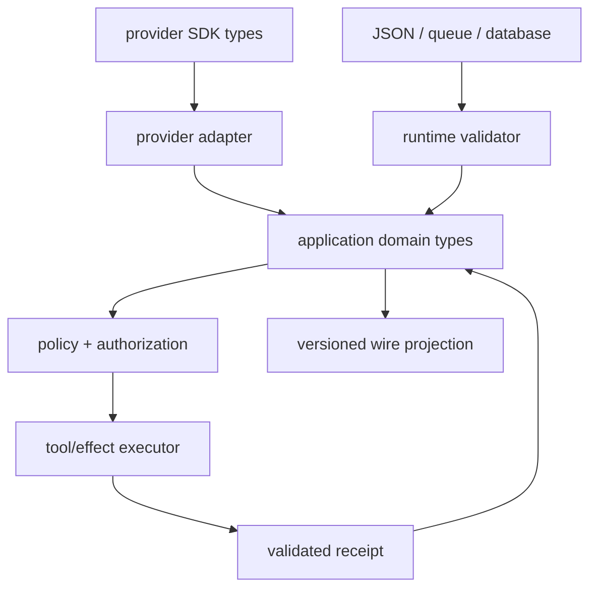

# TypeScript Agent Engineering

> **Status:** Research-backed production area  
> **Last researched:** 2026-08-31  
> **Compiler baseline:** TypeScript 7.0.2 for the stable CLI; TypeScript 6.0.3 only where a programmatic compiler API is still required (the official `@typescript/typescript6@6.0.2` wrapper currently resolves that compiler)  
> **Runtime boundary:** [Node.js agent runtime engineering](../nodejs/README.md) owns event-loop behavior, streams, workers, cancellation mechanics, process lifecycle, and Node deployment operations; the [concise overview](../typescript-node-agent-runtimes.md) remains the language-comparison entry point.

TypeScript is most valuable in an agent system when it makes invalid application states difficult to express **and** pairs those types with executable validation at every untrusted boundary. It is dangerous when a precise compile-time model is mistaken for proof about provider payloads, model output, stored checkpoints, tool arguments, or another package's JavaScript.

This area is the language and contract layer above the runtime:



The core rule is simple:

> A TypeScript type is a development-time claim. A validator, authorization decision, persisted version, and tested artifact are runtime evidence.

## Scope and boundary with Node.js

Read this area for:

- compiler strictness, emit assumptions, and module resolution;
- erased types, runtime validators, and JSON Schema generation;
- discriminated unions for runs, events, tools, effects, and errors;
- application-owned provider adapters and resilience to SDK type churn;
- public declarations, package exports, project references, and monorepos;
- build targets, source maps, deployment artifacts, and cross-runtime compatibility;
- compile-time tests, contract fixtures, dependency controls, and migrations.

Read the deep [Node.js runtime playbook](../nodejs/README.md) for:

- event-loop and libuv saturation;
- streams and backpressure;
- `AbortSignal` propagation behavior;
- worker threads, child processes, and containment;
- shutdown, uncaught exceptions, diagnostics, and runtime telemetry;
- Node permissions and runtime-specific operational controls.

Do not duplicate those mechanisms in a language abstraction. A `Promise<Result<T, E>>` can describe an outcome, but it does not make an operation cancellable, memory-bounded, durable, or idempotent.

## Recommended reading path

| Need | Guide | Outcome |
|---|---|---|
| Establish a trustworthy compiler contract | [Compiler configuration and module resolution](compiler-configuration-and-module-resolution.md) | Target-specific `tsconfig` profiles and module rules that match the real loader |
| Validate model/tool/wire values | [Runtime validation and JSON Schema](runtime-validation-and-json-schema.md) | One executable boundary schema with tested provider projections |
| Model the agent lifecycle | [Domain modeling and state machines](domain-modeling-and-state-machines.md) | Exhaustive, authority-aware unions rather than optional-property bags |
| Define interoperable contracts | [Tools, events, and versioned contracts](tools-events-and-versioned-contracts.md) | Versioned schemas for tool input/output, events, state, and effects |
| Isolate vendor churn | [Provider adapters and SDK churn](provider-adapters-and-sdk-churn.md) | Narrow domain ports, translation tests, and upgrade discipline |
| Make async failures explicit | [Async APIs, errors, and resource lifecycles](async-apis-errors-and-resource-lifecycles.md) | Honest `Promise` contracts, typed expected failures, and owned cleanup |
| Publish safe internal/external packages | [Packages, public APIs, and monorepos](packages-public-apis-and-monorepos.md) | Verifiable exports and declarations without accidental internals |
| Ship the right artifact | [Build artifacts, source maps, and cross-runtime targets](build-artifacts-source-maps-and-cross-runtime.md) | Target-specific output verified in Node, Bun, Deno, or edge runtimes |
| Prove types and runtime agree | [Testing types and compatibility](testing-types-and-compatibility.md) | Static, schema, adapter, package, and artifact test layers |
| Control the dependency and release path | [Supply chain and release engineering](supply-chain-and-release-engineering.md) | Frozen installs, install-script policy, provenance, and staged upgrades |
| Adopt or repair an existing codebase | [Migration playbook and anti-patterns](migration-playbook-and-anti-patterns.md) | A reversible migration sequence and failure-pattern catalog |

The evidence and source synthesis behind these guides is in the [TypeScript agent-engineering research packet](../../research/packets/typescript-agent-engineering-deep-dive.md).

Use the application-owned [agent state and event contract](../../runtime/agent-state-and-event-contracts.md) for stable run identity, ordering, terminal fencing, replay, reconnect, and effect correlation. TypeScript unions and validators specialize that contract; they do not replace its cross-runtime semantics.

## Adoption ladder: from typed prototype to production contract

Do not attempt every improvement in one compiler-and-SDK upgrade. Advance one evidence boundary at a time:

| Level | Required change | Evidence before advancing |
|---|---|---|
| 0 — inventory | Record entry points, hosts, `tsconfig` inheritance, SDKs, validators, durable JSON, export maps, and build tools | Effective configs, current artifact, representative provider/event fixtures |
| 1 — compiler truth | Give each real host its own resolver, `lib`, `types`, and strictness profile | Source check **and** built-entry-point smoke on the minimum host |
| 2 — runtime trust | Replace casts at model, tool, queue, database, config, and provider boundaries with bounded validation from `unknown` | Valid, invalid, oversized, and unknown-key fixtures |
| 3 — domain safety | Introduce app-owned state/event/effect unions and proposed → validated → authorized tool stages | Exhaustiveness/type tests plus deterministic history replay |
| 4 — integration isolation | Move provider/MCP SDK objects behind adapters and explicit schema projections | Adversarial stream, projection-parity, capability, and SDK-upgrade fixtures |
| 5 — release proof | Version wire contracts; pack/install public packages; execute the exact artifact per target; record toolchain/schema digests | Read-old/write-new tests, packed consumers, target matrix, staged smoke, rollback rehearsal |

A service is not at level 5 because it has strict TypeScript or a green unit suite. It is there only when the independently shipped contract and artifact are exercised the way real consumers and deployment hosts use them. Stop at the smallest level that materially reduces current risk, but do not call a boundary production-ready while its evidence row is missing.

## Production defaults

Use explicit settings even where TypeScript 7 currently supplies stricter defaults. Explicit configuration documents the contract for editors, older compatibility tooling, and future compiler changes.

```jsonc
{
  "compilerOptions": {
    "strict": true,
    "noUncheckedIndexedAccess": true,
    "exactOptionalPropertyTypes": true,
    "useUnknownInCatchVariables": true,
    "noImplicitOverride": true,
    "noImplicitReturns": true,
    "noFallthroughCasesInSwitch": true,
    "noUncheckedSideEffectImports": true,
    "verbatimModuleSyntax": true,
    "isolatedModules": true,
    "noEmit": true,
    "types": []
  }
}
```

This is a **base**, not a copy-paste final config:

- a Node application should add the exact Node type environment and use `module`/`moduleResolution` settings that match Node;
- a bundled application should use `module: "preserve"` or `"esnext"` with `moduleResolution: "bundler"` as its bundler requires;
- each server, browser, worker, test, and shared package needs its own environment-specific config;
- a library that emits declarations may need `composite`, `declaration`, `declarationMap`, and `isolatedDeclarations` instead of `noEmit`;
- do not enable `skipLibCheck` merely to hide an inconsistent dependency graph.

## The application-owned type architecture

Keep vendor and wire types at the edge:



Recommended ownership rules:

1. **Raw external values enter as `unknown`.** SDK types are useful autocomplete, not a trust boundary.
2. **Schemas own decoding.** Infer application input/output types from an executable schema where practical.
3. **Domain unions own behavior.** Translate provider-specific event names and nullable bags into small discriminated unions.
4. **Authorization follows validation.** A structurally valid tool call is still only a proposal.
5. **Wire contracts are versioned projections.** Do not persist SDK classes, response objects, or inferred implementation types.
6. **Effects return receipts.** Preserve effect identity and ambiguity instead of reducing every failure to `Error`.
7. **Artifacts are tested as consumers use them.** Source tests do not prove conditional exports, declaration paths, sourcemaps, or edge compatibility.

## TypeScript 7 transition policy

TypeScript 7.0 is the stable native compiler and language server, but it does not expose a programmatic compiler API. The TypeScript team provides `@typescript/typescript6` for tools that still need the 6.0 API and documents side-by-side installation.

Treat the compiler as a toolchain matrix, not a single version field:

| Surface | Pin and verify |
|---|---|
| CLI type-check/build | Exact TypeScript 7 patch and worker settings used in CI |
| Linter/schema generator/framework plugin | Its supported TypeScript API/peer range; use 6.0 compatibility only when required |
| Editor | Workspace-selected language server, not a developer's global default |
| Published declarations | Minimum supported consumer TypeScript versions and module-resolution modes |
| Generated schemas/code | Generator version and reproducible golden output |

Do not let an npm alias silently cause the CLI, editor, linter, and generator to use different compilers. Name each command explicitly and record versions in CI output.

## Review gate

- [ ] Every external value is `unknown` until runtime validation succeeds.
- [ ] Tool arguments, structured outputs, events, checkpoints, and tool results have executable schemas.
- [ ] Provider schemas are generated for a named dialect/subset and checked with golden fixtures.
- [ ] Projection tests compare canonical and provider accept/reject behavior and fail on unapproved constraint loss.
- [ ] Domain state uses discriminated unions with an exhaustive `never` branch.
- [ ] Expected failures have stable codes and serializable details; unexpected throws are normalized from `unknown`.
- [ ] Compiler module resolution matches the runtime or bundler that executes the artifact.
- [ ] Server, browser, worker, test, and shared code do not share one misleading global type environment.
- [ ] Package exports, JavaScript files, declarations, and declaration module kinds agree.
- [ ] Published artifacts are installed and imported through every supported entry point.
- [ ] Runtime behavior is tested separately from type behavior.
- [ ] SDK/compiler/schema updates run contract fixtures and behavioral evaluations before promotion.
- [ ] Telemetry records app contract, SDK, schema-projector, and artifact versions without recording prompts or tool payloads by default.
- [ ] The Node runtime guide covers cancellation, streams, workers, shutdown, and process behavior rather than a type wrapper pretending to solve them.

## Selected primary sources

- [TypeScript 7.0 announcement and 6.0 compatibility guidance](https://devblogs.microsoft.com/typescript/announcing-typescript-7-0/)
- [TypeScript module theory](https://www.typescriptlang.org/docs/handbook/modules/theory.html)
- [TypeScript module reference](https://www.typescriptlang.org/docs/handbook/modules/reference.html)
- [TypeScript type compatibility and deliberate unsoundness](https://www.typescriptlang.org/docs/handbook/type-compatibility.html)
- [Zod JSON Schema conversion](https://zod.dev/json-schema)
- [Ajv strict mode](https://ajv.js.org/strict-mode.html)
- [MCP TypeScript SDK v2](https://ts.sdk.modelcontextprotocol.io/v2/)
