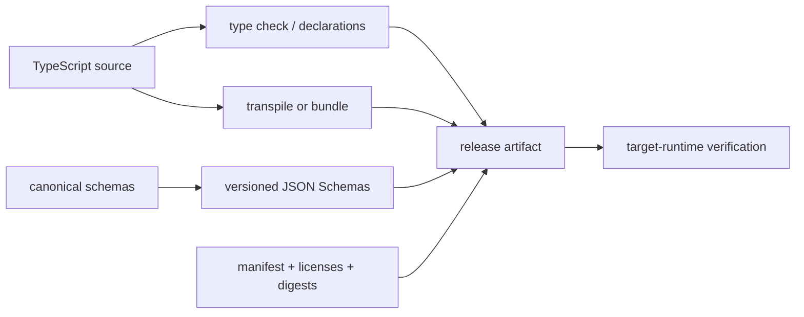

# Build Artifacts, Source Maps, and Cross-Runtime Delivery

> **Last researched:** 2026-08-31  
> **Runtime boundary:** This guide selects and verifies TypeScript artifacts. Event-loop, process, stream, worker, and shutdown behavior belongs in [TypeScript and Node.js agent runtimes](../typescript-node-agent-runtimes.md). Runtime-specific operational behavior must still be tested on the target host.

A green type check is not a deployment artifact. A production TypeScript agent may need JavaScript, declarations, executable schemas, source maps, licenses, and an artifact manifest—and each must correspond to the same source revision and dependency graph.

## Treat output as a coordinated artifact set



Record at least:

- source revision and dirty/clean build policy;
- TypeScript checker and emitter/transpiler versions;
- package-manager and lockfile digest;
- runtime target and minimum version;
- provider SDK and schema-projector versions;
- schema identifiers/versions and generated-file digests;
- build mode, module mode, and source-map policy.

This makes a runtime stack trace, stored contract, or provider regression traceable to the exact compiler and schema output.

Generate the manifest from the release job; do not maintain it as optimistic documentation. A minimal shape is:

```json
{
  "sourceRevision": "<commit>",
  "artifactDigest": "sha256:<digest>",
  "lockfileDigest": "sha256:<digest>",
  "typeChecker": "typescript@7.0.2",
  "apiCompatibilityCompiler": "@typescript/typescript6@6.0.2 -> typescript@6.0.3",
  "transformer": "<name>@<version>",
  "runtimeTarget": "node@<minimum-tested-version>",
  "providerSdks": { "<provider>": "<exact-version>" },
  "schemas": [{ "id": "agent.run-event", "version": 2, "digest": "sha256:<digest>" }],
  "sourceMapPolicy": "private-upload"
}
```

Omit the compatibility compiler when no release tool invokes it. Versions are illustrative except for the researched TypeScript baseline; the running artifact must report the values actually used.

## Separate type checking from transformation deliberately

`tsc` can check and emit JavaScript/declarations. Fast transformers such as esbuild parse and erase TypeScript syntax but do not perform TypeScript type checking; esbuild's documentation explicitly recommends a parallel `tsc --noEmit` check. It also does not emit declaration files or `emitDecoratorMetadata`.

A minimal reliable split is:

```text
type gate:      tsc --noEmit (or native TS 7 checker)
declarations:   tsc configured for declarations, when publishing
runtime build:  tsc, esbuild, or the chosen runtime/bundler
artifact tests: execute/install the produced output
```

Use `isolatedModules` when a single-file transformer needs to process code without whole-program type information. It warns about constructs whose emit can be incorrect in that mode; it does not make the transformer a type checker.

TypeScript 7 complicates the toolchain temporarily: the native CLI is stable, but the programmatic compiler API is not yet shipped. A release may therefore use the TS 7 CLI for diagnostics and a TypeScript 6 compatibility package for API-dependent declaration or analysis tooling. Pin and record both. Do not assume identical diagnostic ordering or tool plugin support.

## Choose a build profile per deployment target

| Target | Practical baseline | Type/library risks | Verification |
|---|---|---|---|
| Node.js compiled ESM | `module`/`moduleResolution: nodenext`, explicit relative extensions | Node version APIs, conditional exports, CommonJS interop | Run built JS with minimum/current Node |
| Node.js native type stripping | `noEmit`, `nodenext`, `erasableSyntaxOnly`, `verbatimModuleSyntax`, rewritten relative TS extensions as documented | Unsupported transform-requiring syntax; `tsconfig` transformations are not applied | Run `.ts` entry point on exact Node line |
| Bun | Bun-recommended config plus separate type gate | Node compatibility is broad, not identity; bundler/runtime semantics | Run under exact supported Bun version |
| Deno | Deno configuration/import conventions; optional Node/npm compatibility | URL/npm/Jsr resolution and permissions differ; DOM/runtime type mix | `deno check` and run with declared permissions |
| Cloudflare Workers | Worker generated types tied to compatibility date/flags | Node APIs may be unavailable, polyfilled, or present as throwing stubs | Generate types, bundle, local test, deployed smoke |
| Browser/other edge | Bundler resolver, minimal `lib`, platform API interfaces | No filesystem/process/socket assumptions; bundle conditions | Execute built bundle in the real isolate/browser class |

Avoid a single `tsconfig.json` with Node, DOM, Deno, and worker globals. It creates a fictional super-runtime where code type-checks against APIs no single deployment provides. Use a shared strict base and target-specific `lib`, `types`, module resolution, and entry points.

For every claimed target, maintain a small support record rather than a “works on edge” label:

| Field | Example evidence |
|---|---|
| Minimum/current host | Exact versions executed in CI; compatibility date/flags for Workers |
| Entry point and build profile | Export condition, `tsconfig`, bundler, and artifact digest |
| Required capabilities | Fetch streaming, crypto, timers, storage, schema validator, provider SDK path |
| Operation tests | Import, startup, provider stub, streamed tool call, checkpoint decode, deliberate error, shutdown/close |
| Known exclusions | Native add-ons, filesystem, dynamic evaluation, unsupported Node built-ins, unavailable provider SDK features |
| Rollback | Previously promoted artifact digest and readers for any wire version already emitted |

An import-only smoke is insufficient. A compatibility layer may resolve a module while the needed method throws, buffers an entire stream, or depends on an unavailable native binding. Run the smallest real operation for each capability the agent uses.

## `target`, `lib`, and runtime support are different

- `target` controls emitted syntax and default library selection;
- `lib` declares standard APIs available to the checker;
- module resolution models how the host finds files/packages;
- none of them installs polyfills or makes the deployment host implement an API.

Setting `lib: ["ESNext", "DOM"]` does not give a worker or Node process every browser API. Conversely, lowering `target` may rewrite syntax but does not automatically polyfill `fetch`, `AsyncDisposableStack`, or other APIs. Maintain a runtime capability matrix and execute artifacts on the minimum supported versions.

## Source maps are operational data and a disclosure risk

Source maps make stack traces actionable, but they can reveal source paths and, when `sourcesContent` is embedded, full source text. Choose a policy:

| Policy | Benefits | Risks/controls |
|---|---|---|
| External maps shipped beside code | On-host stack mapping | Deployment readers may access source; secure artifact access |
| Maps uploaded to error service, excluded from runtime artifact | Useful production traces with smaller/private artifact | Upload must be tied to exact release digest |
| Inline maps | Simple local debugging | Bloats and discloses source; normally avoid in production |
| No production maps | Minimal disclosure | Harder incident diagnosis; preserve symbolized staging path |

Normalize source paths, avoid embedding developer-machine paths, and inspect maps for secrets or generated credentials. Test a deliberate error in the built artifact and verify that the observed stack maps to the correct source revision and line.

Declaration maps are a developer navigation feature, not runtime source maps. Include them in published libraries only if their referenced sources are intentionally shipped and paths remain valid.

## Cross-runtime compatibility requires ports

The core should depend on small application-owned interfaces for host capabilities:

```ts
export interface AgentPlatform {
  readonly clock: Clock;
  readonly random: RandomSource;
  readonly fetch: typeof globalThis.fetch;
  readonly store: CheckpointStore;
  readonly secrets: SecretProvider;
}
```

Do not create an abstraction for every global. Abstract behavior that differs materially or needs deterministic testing. Keep host-specific implementations in entry-point packages so a worker build does not accidentally bundle a Node filesystem adapter.

Conditional exports can offer separate host entry points, but conditions are not a capability negotiation protocol. Each entry point still needs isolated type and runtime tests. Avoid runtime checks such as `if (process)` when merely referencing the undeclared identifier can fail; use build-time separation or safe capability checks.

Cloudflare documents that some Node compatibility modules may be available as stubs that throw when called. Successful import is therefore insufficient evidence. Exercise the operation needed by the agent.

## Keep schemas deployable independently of TypeScript

Agents often communicate with Python services, durable queues, models, MCP clients, or persisted checkpoints. Publish versioned JSON Schema files or another language-neutral contract artifact alongside TypeScript declarations. Validate that:

- the schema corresponds to the runtime validator mode (input versus output);
- `$id`, dialect, and version are stable;
- references resolve within the artifact;
- unrepresentable validator behavior is documented or eliminated;
- consumers can validate without executing the TypeScript package;
- schema digests are included in deployment metadata.

Never assume a `.d.ts` is a cross-language or runtime validation artifact.

## Inspect the production artifact

Before release:

1. build from the committed lockfile in a clean environment;
2. list every packaged file and reject unexpected source, maps, fixtures, credentials, or caches;
3. inspect runtime imports for source paths, dev dependencies, native modules, and unsupported built-ins;
4. install or deploy only the artifact, not the workspace source tree;
5. execute startup, one model call stub, one tool path, checkpoint decode, and graceful termination on each target;
6. induce an error and verify stack/source-map correlation;
7. compare generated schema and declaration reports with the approved baseline;
8. store the artifact digest and build manifest.

For bundled server/edge code, test both the bundle and source configuration. Tree shaking, conditional resolution, code splitting, and dynamic imports can alter which code actually ships.

## Failure matrix

| Failure | Root cause | Gate |
|---|---|---|
| Green editor, runtime cannot resolve import | Compiler resolution differs from host/bundler | Target-runtime artifact execution |
| Package types work only in monorepo | Path alias/workspace source bypasses exports | Packed consumer fixture |
| Edge build imports Node module then throws | Compatibility stub or unsupported API | Operation-level target smoke test |
| Fast build ships type error | Transformer strips types without checking | Independent no-emit type gate |
| Stack points to wrong source | Map/release digest mismatch | Deliberate-error correlation test |
| Source code leaked | `sourcesContent`, package files, or inline maps | Artifact inventory and map scan |
| TS 7 upgrade breaks generator | Tool needs unavailable compiler API | Side-by-side TS 6 API toolchain |
| Schema and declarations describe different versions | Generated independently without manifest | Coordinated generation and digest gate |

## Review checklist

- [ ] Type checking, transformation, declaration emission, and schema generation are explicit stages.
- [ ] Each deployment target has its own realistic `lib`, `types`, resolver, and entry point.
- [ ] The built artifact runs on minimum and current supported runtime versions.
- [ ] Every target claim names exact host versions/flags, entry point, required operations, exclusions, and rollback artifact.
- [ ] Source-map inclusion, storage, access, and release correlation are intentional.
- [ ] Packed artifacts contain no unintended source, secret, fixture, or development files.
- [ ] Cross-runtime code depends only on tested platform ports.
- [ ] Versioned schemas ship as language-neutral artifacts when contracts cross processes.
- [ ] Build metadata records exact compilers, SDKs, schemas, lockfile, and source revision.

## Primary sources

- [TypeScript guide: choosing compiler options](https://www.typescriptlang.org/docs/handbook/modules/guides/choosing-compiler-options.html)
- [TypeScript modules reference](https://www.typescriptlang.org/docs/handbook/modules/reference.html)
- [Announcing TypeScript 7.0](https://devblogs.microsoft.com/typescript/announcing-typescript-7-0/)
- [esbuild TypeScript content type](https://esbuild.github.io/content-types/#typescript)
- [esbuild source-map options](https://esbuild.github.io/api/#sourcemap)
- [Node.js native TypeScript support](https://nodejs.org/api/typescript.html)
- [Deno TypeScript fundamentals](https://docs.deno.com/runtime/fundamentals/typescript/)
- [Deno Node and npm compatibility](https://docs.deno.com/runtime/fundamentals/node/)
- [Bun TypeScript documentation](https://bun.sh/docs/typescript)
- [Cloudflare Workers TypeScript](https://developers.cloudflare.com/workers/languages/typescript/)
- [Cloudflare Workers Node.js compatibility](https://developers.cloudflare.com/workers/runtime-apis/nodejs/)
