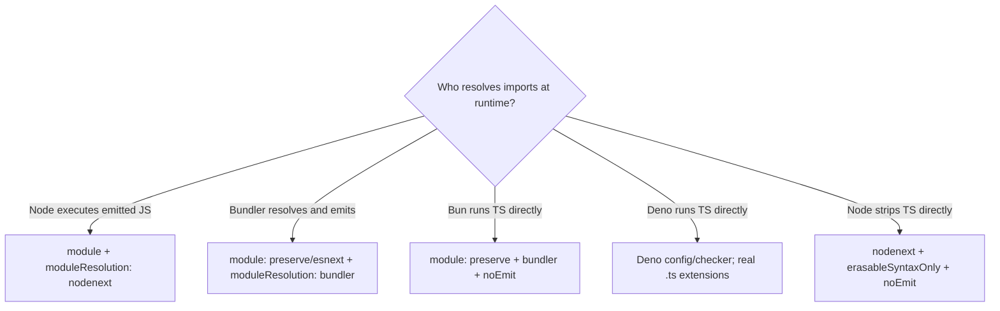
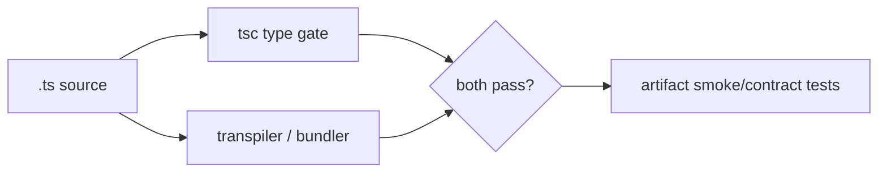

# Compiler Configuration and Module Resolution

> **Last researched:** 2026-08-31  
> **Runtime boundary:** Loader behavior, event-loop operation, and Node process concerns belong in [TypeScript and Node.js agent runtimes](../typescript-node-agent-runtimes.md).

A TypeScript configuration is an executable compatibility claim. It says which globals exist, how import specifiers resolve, which JavaScript semantics will run, and which unsafe states the checker should reject. If that claim does not match the real loader or bundler, green type-checks can produce code that fails at startup.

## Start from the execution host



`moduleResolution` is not a style preference. The TypeScript reference says it should match the resolver used by the target runtime or bundler.

| Target | Core choice | Important constraint |
|---|---|---|
| Emitted ESM for Node | `module: "nodenext"`, `moduleResolution: "nodenext"` | Relative ESM imports use runtime extensions such as `./tool.js`; nearest `package.json#type` affects `.ts` format |
| Bundled application | `module: "preserve"` or `"esnext"`, `moduleResolution: "bundler"` | Extensionless paths may be accepted because the bundler, not Node, resolves them |
| Library source | Check against every promised consumer mode | A config that works only under `bundler` may publish declarations that fail under `nodenext` |
| Direct Node `.ts` execution | `noEmit`, `nodenext`, `rewriteRelativeImportExtensions`, `erasableSyntaxOnly`, `verbatimModuleSyntax` | Node type stripping does not type-check and intentionally ignores most `tsconfig` runtime transformations |
| Bun-first project | Bun currently recommends `module: "Preserve"`, `moduleResolution: "bundler"`, `allowImportingTsExtensions`, `noEmit` | This is not evidence the same sources run under Node |
| Deno-first project | `deno check` and `deno.json` compiler options | Deno executes and type-checks separately; many emit options are irrelevant or ignored |

## Use one configuration per environment

A single `tsconfig.json` cannot accurately model Node globals, DOM globals, service-worker globals, test globals, and shared portable code at once. Separate them:

```text
tsconfig.base.json
packages/contracts/tsconfig.json
apps/api/tsconfig.json
apps/worker/tsconfig.json
apps/web/tsconfig.json
test/tsconfig.json
```

The shared contract package should normally have the smallest `lib` and `types` set. Adding `DOM` or `node` globally can mask portability errors such as an accidental `Buffer`, `process`, `window`, or `document` dependency.

TypeScript 7 defaults `types` to an empty list. Keep the list explicit per project:

```jsonc
{
  "compilerOptions": {
    "lib": ["ES2024"],
    "types": ["node"],
    "module": "nodenext",
    "moduleResolution": "nodenext"
  }
}
```

For a portable contract package, `types: []` is a useful constraint. Add a Web API library only when the contract intentionally exposes it.

## Strictness profile for agent code

`strict` is necessary but not sufficient. TypeScript 7 makes it a default; keeping it explicit preserves intent and compatibility with tools still using 6.0.

| Option | Agent-system failure it exposes |
|---|---|
| `strict` | implicit `any`, nullable access, unsafe function compatibility, and initialization gaps |
| `noUncheckedIndexedAccess` | missing tool registry keys, absent event map entries, and out-of-range array access |
| `exactOptionalPropertyTypes` | the wire-significant difference between an omitted property and `property: undefined` |
| `useUnknownInCatchVariables` | assumptions that every thrown value is an `Error` |
| `noImplicitReturns` | handlers that forget a terminal result in one branch |
| `noFallthroughCasesInSwitch` | accidental fallthrough in event/state reducers |
| `noImplicitOverride` | provider adapter subclasses drifting from a base method contract |
| `noUncheckedSideEffectImports` | misspelled side-effect-only imports that would otherwise be silently ignored |
| `verbatimModuleSyntax` | type/value import ambiguity and hidden ESM-to-CJS rewriting |
| `isolatedModules` | constructs that per-file transpilers such as esbuild cannot safely transform |
| `isolatedDeclarations` | exported APIs whose declarations require whole-program inference |

Enable additional options because they defend a known invariant, not to maximize a score. For example, `noPropertyAccessFromIndexSignature` is useful in dynamic metadata bags because bracket syntax makes uncertain keys visible, but it may be noisy for established framework types.

## Type/value separation is operational

Types are erased; imported values run module initialization. Use type-only imports when no runtime value is required:

```ts
import type { ToolCall } from "./contracts.js";
import { toolCallSchema } from "./contracts.js";
```

With `verbatimModuleSyntax`, imports without `type` remain in emitted JavaScript. This prevents a transpiler from guessing whether an import was intended only for types. It also makes circular initialization and side effects easier to review.

Avoid barrel files that re-export every provider, schema, and adapter from one entry point. They enlarge the public surface and can turn a type-only dependency into a runtime initialization cycle.

## ESM, CommonJS, and declaration alignment

Under Node-aware modes:

- `.mts`, `.mjs`, and `.d.mts` are ESM;
- `.cts`, `.cjs`, and `.d.cts` are CommonJS;
- `.ts`, `.js`, and `.d.ts` follow the nearest `package.json#type`;
- a declaration file implies a corresponding JavaScript module and must describe its real module kind.

If a package publishes independent ESM and CommonJS entry points, each needs a matching declaration interpretation. A single `.d.ts` cannot safely pretend to represent both formats when their module identities differ.

Prefer ESM-only for a new internal service when all dependencies and consumers support it. Publish dual format only for a real consumer requirement; dual packages add conditional-export, duplicate-instance, and test-matrix costs.

## `paths` does not rewrite runtime imports

`paths` teaches TypeScript how to locate types. It does not automatically change emitted specifiers. Code can type-check with `@contracts/*` and then fail when Node cannot resolve it.

Safe choices:

1. use workspace package names with real `package.json#exports`;
2. use relative imports that the target loader accepts;
3. configure an import map or bundler alias **and** test the exact built artifact;
4. use package `imports` (`#contracts`) when the runtime and build pipeline both support it.

Run `tsc --traceResolution` for a single failure and `tsc --showConfig` to prove the effective configuration. Do not debug resolution from the source tree by intuition.

## Build and type-check are separate gates

Fast transpilers strip types per file. esbuild explicitly does not type-check and recommends a separate `tsc --noEmit`; it also recommends `isolatedModules` because it compiles files independently.



Never accept “the bundle succeeded” as type evidence or “`tsc --noEmit` passed” as artifact evidence.

## TypeScript 7 and the 6.0 API bridge

TypeScript 7.0 is a native compiler and language server. It does not ship a programmatic API. The official guidance supports a side-by-side arrangement when linters, embedded-language tooling, or generators require the 6.0 API.

A safe adoption record names each tool:

| Command | Compiler/API it uses | Why |
|---|---|---|
| `typecheck:native` | pinned TypeScript 7 CLI | primary build diagnostics |
| `lint` | version supported by typescript-eslint | typed rules may import the compiler API |
| `schema:generate` | explicitly pinned generator + TypeScript API | reproducible output; do not inherit a transitive compiler |
| editor | workspace TypeScript 7 LSP or documented fallback | avoid developer-global drift |

TypeScript 7 removed or hard-errors several TypeScript 6 deprecations, including `moduleResolution: node/node10`, `classic`, `baseUrl`, legacy module targets, and ES5 target support. Migrate on TypeScript 6 with no ignored deprecations before switching the primary CLI.

The official compatibility claim is narrower than “TS 6 source works on TS 7”: the TS 6 lane should have `stableTypeOrdering` enabled and no `ignoreDeprecations` escape hatch. Use that as the preflight contract:

1. run the pinned TS 6 compatibility compiler with `stableTypeOrdering: true` and remove deprecated configuration rather than suppressing it;
2. capture effective config and diagnostics by code/location;
3. run the pinned TS 7 CLI over the same projects and target-specific configs;
4. compare public declarations, negative type tests, build graph/output paths, and any emitted artifact—not only exit status;
5. execute every compiler-API consumer (typed linter, framework plugin, declaration/schema tool) through its explicitly pinned TS 6 lane;
6. fail the release if an editor/global compiler is the only lane that passed.

This adoption test does not require diagnostic text or ordering to be identical. It requires every semantic difference to be understood and every shipped surface to remain within its declared compatibility window.

## Decorators are an emit contract

TypeScript supports two materially different decorator models:

- the newer decorators behavior available without `experimentalDecorators`;
- the legacy experimental decorator implementation enabled by `experimentalDecorators`.

The newer model is not compatible with `emitDecoratorMetadata` and does not support parameter decorators. Existing legacy decorators are unlikely to work unchanged under the newer emit.

For agent registries, prefer explicit data structures over decorator discovery:

```ts
export const tools = {
  search: searchTool,
  fetch_document: fetchDocumentTool,
} satisfies Record<string, ToolDefinition>;
```

Use decorators only when the framework requires them and pin all of: compiler mode, transformer/bundler behavior, metadata polyfill, initialization order, and runtime tests. Do not treat emitted design metadata as complete runtime validation; unions, refinements, generics, authorization, and many JSON constraints are not represented.

## Configuration review checklist

- [ ] Every `tsconfig` names one real execution environment.
- [ ] `moduleResolution` matches the runtime or bundler.
- [ ] Node ESM relative specifiers include the runtime extension.
- [ ] `lib` and `types` expose only globals present in that target.
- [ ] `strict`, indexed access, exact optional properties, catch variables, and control-flow checks are explicit.
- [ ] Per-file transpilation uses `isolatedModules` and a separate type gate.
- [ ] Type-only imports are marked and side-effect imports are intentional.
- [ ] `paths` aliases have an actual runtime resolver.
- [ ] TypeScript 7 CLI and any 6.0 API consumers are named and pinned separately.
- [ ] The TS 6 preflight uses stable type ordering with no ignored deprecations, and TS 7 differences are reviewed by diagnostic/API/artifact evidence.
- [ ] Decorator mode and metadata behavior are covered by artifact tests.
- [ ] `skipLibCheck` is not hiding duplicate or incompatible public declarations.

## Selected primary sources

- [TypeScript 7.0 announcement](https://devblogs.microsoft.com/typescript/announcing-typescript-7-0/)
- [TypeScript modules: theory](https://www.typescriptlang.org/docs/handbook/modules/theory.html)
- [TypeScript modules: reference](https://www.typescriptlang.org/docs/handbook/modules/reference.html)
- [Choosing compiler options](https://www.typescriptlang.org/docs/handbook/modules/guides/choosing-compiler-options.html)
- [TypeScript TSConfig reference](https://www.typescriptlang.org/tsconfig/)
- [TypeScript 5.0 decorator behavior](https://www.typescriptlang.org/docs/handbook/release-notes/typescript-5-0.html)
- [Node.js TypeScript type stripping](https://nodejs.org/api/typescript.html)
- [esbuild TypeScript caveats](https://esbuild.github.io/content-types/#typescript)
- [Bun TypeScript configuration](https://bun.sh/docs/typescript)
- [Deno TypeScript support](https://docs.deno.com/runtime/fundamentals/typescript/)
