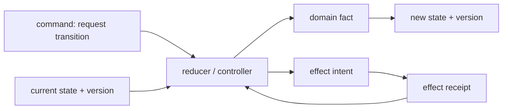

# Domain Modeling and State Machines

> **Last researched:** 2026-08-31  
> **Runtime boundary:** Durable ownership, cancellation delivery, effect idempotency, and process recovery belong in the [runtime](../../runtime/README.md), [reliability](../../reliability/README.md), and [Node.js](../typescript-node-agent-runtimes.md) guides. Types document those invariants; storage and execution mechanisms enforce them.

Use TypeScript to model what the agent controller knows and is allowed to do at each stage. The best models are small discriminated unions whose variants contain only valid fields. The worst are giant interfaces with dozens of optional properties and booleans that permit contradictory states.

## Prefer sum types over optional-property bags

Avoid:

```ts
interface RunState {
  status: string;
  output?: unknown;
  error?: Error;
  waitingForApproval?: boolean;
  cancelled?: boolean;
}
```

This admits `status: "succeeded"` with an error, cancellation with output, and a waiting run with no approval identity.

Use a discriminated union:

```ts
type RunState =
  | { readonly kind: "accepted"; readonly runId: RunId }
  | { readonly kind: "running"; readonly runId: RunId; readonly attemptId: AttemptId }
  | {
      readonly kind: "waiting_for_approval";
      readonly runId: RunId;
      readonly approvalId: ApprovalId;
      readonly proposal: EffectProposal;
    }
  | { readonly kind: "succeeded"; readonly runId: RunId; readonly output: FinalOutput }
  | { readonly kind: "failed"; readonly runId: RunId; readonly error: RunFailure }
  | { readonly kind: "cancelled"; readonly runId: RunId; readonly reason: CancelReason }
  | { readonly kind: "indeterminate"; readonly runId: RunId; readonly ambiguity: EffectAmbiguity };
```

Use `exactOptionalPropertyTypes` so omission is not silently equivalent to `property: undefined`. On wire contracts, those can mean different things.

## Exhaust every variant

TypeScript narrows discriminated unions and uses `never` for an exhausted set:

```ts
function assertNever(value: never): never {
  throw new Error(`Unhandled variant: ${JSON.stringify(value)}`);
}

function publicStatus(state: RunState): PublicRunStatus {
  switch (state.kind) {
    case "accepted":
    case "running":
      return { status: "running" };
    case "waiting_for_approval":
      return { status: "waiting", approvalId: state.approvalId };
    case "succeeded":
      return { status: "succeeded", output: state.output };
    case "failed":
      return { status: "failed", code: state.error.code };
    case "cancelled":
      return { status: "cancelled", reason: state.reason };
    case "indeterminate":
      return { status: "indeterminate" };
    default:
      return assertNever(state);
  }
}
```

The default branch is not expected to execute for a validated current-version value. It ensures that adding a union member breaks every incomplete reducer, serializer, UI projection, and adapter during type-checking.

Do not add a catch-all union member such as `{ kind: string }`; it destroys exhaustiveness. Preserve unknown future variants at the decoding boundary and reject or quarantine them according to protocol policy.

## Separate commands, facts, and state



Useful unions:

```ts
type RunCommand =
  | { readonly kind: "start"; readonly runId: RunId }
  | { readonly kind: "cancel"; readonly runId: RunId; readonly reason: string }
  | { readonly kind: "approve"; readonly approvalId: ApprovalId; readonly decision: "allow" | "deny" }
  | { readonly kind: "record_effect"; readonly receipt: EffectReceipt };

type RunEvent =
  | { readonly kind: "run_started"; readonly attemptId: AttemptId }
  | { readonly kind: "approval_requested"; readonly approvalId: ApprovalId; readonly proposal: EffectProposal }
  | { readonly kind: "effect_committed"; readonly receipt: EffectReceipt }
  | { readonly kind: "run_succeeded"; readonly output: FinalOutput }
  | { readonly kind: "run_failed"; readonly failure: RunFailure }
  | { readonly kind: "run_cancelled"; readonly reason: CancelReason };
```

A command can be rejected. An event states a fact that was accepted by the authoritative controller. A state is the current fold/projection. Do not call provider token deltas “state transitions” unless they really are durable facts.

## Model transition validity in one place

Avoid putting `if (state.status === ...)` checks throughout handlers. Use a reducer/controller that returns a typed decision:

```ts
type TransitionDecision =
  | { readonly ok: true; readonly event: RunEvent; readonly next: RunState }
  | { readonly ok: false; readonly reason: "stale_version" | "invalid_transition" | "unauthorized" };
```

The database still needs compare-and-set, a lease token, workflow ownership, or another fence. TypeScript cannot prevent two processes from accepting the same transition. Include `stateVersion`, `attemptId`, and effect identity in the storage command; check them transactionally.

## IDs should have meaning, not just `string`

Structural typing makes all strings interchangeable. A local nominal brand prevents accidental swaps:

```ts
declare const brand: unique symbol;

type Branded<T, Name extends string> = T & { readonly [brand]: Name };
export type RunId = Branded<string, "RunId">;
export type AttemptId = Branded<string, "AttemptId">;
export type EffectId = Branded<string, "EffectId">;
```

Create branded IDs only through a runtime parser/constructor:

```ts
function parseRunId(value: unknown): RunId {
  return RunIdSchema.parse(value) as RunId;
}
```

Brands are compile-time distinctions. They disappear across JSON and must be reconstructed after validation. They are not authentication and do not prove tenant ownership.

Keep these identities distinct:

| ID | Stable meaning |
|---|---|
| `conversationId` | user-visible continuity across runs |
| `runId` | one accepted execution lifecycle |
| `attemptId` | a lease/retry execution of that run or step |
| `toolCallId` | one model-requested invocation |
| `effectId` | one intended business effect across retries |
| `eventId` | immutable event occurrence/deduplication identity |
| trace/span IDs | diagnostic correlation, never business authority |

## Model trust-stage transitions

Do not let a raw model proposal share the same type as an authorized effect:

```ts
type ProposedToolCall = {
  readonly stage: "proposed";
  readonly toolName: string;
  readonly rawArguments: unknown;
};

type ValidatedToolCall<TName extends ToolName = ToolName> = {
  readonly stage: "validated";
  readonly toolName: TName;
  readonly arguments: ToolInput<TName>;
};

type AuthorizedToolCall<TName extends ToolName = ToolName> = {
  readonly stage: "authorized";
  readonly toolName: TName;
  readonly arguments: ToolInput<TName>;
  readonly effectId: EffectId;
  readonly policyVersion: string;
  readonly principal: PrincipalRef;
};
```

Only the authorization function can construct `AuthorizedToolCall`. Keep constructors inside the module and export opaque types or named factory functions. This is compile-time defense in depth; the executor must still verify tenant, policy, and effect fencing at runtime.

## Registries can preserve name-to-schema relationships

```ts
const toolRegistry = {
  search: {
    input: SearchInput,
    output: SearchOutput,
    effect: "read" as const,
  },
  send_email: {
    input: SendEmailInput,
    output: SendEmailOutput,
    effect: "external_write" as const,
  },
} as const satisfies Record<string, ToolDefinition>;

type ToolName = keyof typeof toolRegistry;
type ToolInput<N extends ToolName> =
  z.output<(typeof toolRegistry)[N]["input"]>;
```

This is a good use of `as const` plus `satisfies`: literal names/effect classes remain precise while the object is checked against the required shape.

Avoid an over-generic `ToolDefinition<TInput, TOutput, TContext, TError, ...>` that leaks through the system. Generics are useful at the registry boundary; domain handlers usually become clearer with concrete aliases.

## Expected failures belong in data

TypeScript does not have checked exceptions. For failures callers must branch on—policy denial, validation failure, rate limit, retryable provider failure, ambiguous effect—return a discriminated union:

```ts
type ToolOutcome<T> =
  | { readonly ok: true; readonly value: T; readonly receipt?: EffectReceipt }
  | {
      readonly ok: false;
      readonly error:
        | { readonly kind: "invalid_input"; readonly issues: readonly PublicIssue[] }
        | { readonly kind: "denied"; readonly policyVersion: string }
        | { readonly kind: "retryable"; readonly retryAfterMs?: number }
        | { readonly kind: "indeterminate"; readonly effectId: EffectId };
    };
```

Reserve exceptions for unexpected programming/infrastructure failures or translate foreign exceptions at the adapter boundary. See [Async APIs, errors, and resource lifecycles](async-apis-errors-and-resource-lifecycles.md).

## Immutability and privacy limits

`readonly` prevents assignment through that TypeScript view; it does not freeze an object at runtime. `private` is also erased and provides soft compile-time privacy. Use ECMAScript `#private` fields or closure boundaries only when runtime privacy is actually needed.

For state and events:

- prefer readonly plain data and pure projections;
- avoid class instances in persistence/wire types;
- clone or parse at trust boundaries instead of passing mutable SDK objects;
- apply `Object.freeze` only where its runtime cost and shallow semantics are understood;
- never rely on a `private` field or brand to hide a secret from JavaScript, logs, or serialization.

## Anti-pattern matrix

| Pattern | Failure | Better model |
|---|---|---|
| `status: string` | no exhaustiveness; typos compile | literal discriminator union |
| Many `?` properties | contradictory states are expressible | per-state required fields |
| `boolean` flags for lifecycle | invalid flag combinations | one state discriminator |
| Provider event union used as domain state | SDK churn propagates everywhere | adapter-owned mapping |
| `Record<string, any>` metadata | unchecked values infect trusted code | bounded `unknown` map plus schema |
| One `string` type for all IDs | run/effect/attempt IDs get swapped | local brands + validated constructors |
| Brand accepted from JSON via cast | nominal proof forged | validate then construct |
| `readonly` treated as runtime immutable | foreign code mutates shared object | copy/parse/freeze by policy |
| Exhaustive switch with catch-all `string` member | future variants silently pass | reject/quarantine unknown variant at decode edge |
| State reducer assumed to prevent races | two workers both commit | transactional state-version/lease fence |

## Review checklist

- [ ] Each state variant contains only fields valid in that state.
- [ ] Reducers, serializers, and UI projections use exhaustive `never` checks.
- [ ] Commands, domain facts, delivery events, telemetry, and state are distinct types.
- [ ] Unknown future wire variants are rejected or quarantined before the domain union.
- [ ] Run, attempt, tool call, effect, event, and trace identities are not interchangeable.
- [ ] Raw, validated, authorized, executed, and receipted values use different types.
- [ ] Expected operational failures are discriminated data, not guessed exception classes.
- [ ] Brands and `readonly` are documented as compile-time controls only.
- [ ] Persisted state is plain versioned data, not SDK objects or class instances.
- [ ] Cross-process transition validity is enforced by durable fencing.

## Selected primary sources

- [TypeScript narrowing, discriminated unions, and `never`](https://www.typescriptlang.org/docs/handbook/2/narrowing.html)
- [TypeScript type compatibility and structural typing](https://www.typescriptlang.org/docs/handbook/type-compatibility.html)
- [TypeScript `satisfies` operator](https://www.typescriptlang.org/docs/handbook/release-notes/typescript-4-9.html)
- [TypeScript const assertions](https://www.typescriptlang.org/docs/handbook/release-notes/typescript-3-4.html)
- [TypeScript exact optional property types](https://www.typescriptlang.org/tsconfig/exactOptionalPropertyTypes.html)
- [TypeScript classes and runtime privacy](https://www.typescriptlang.org/docs/handbook/2/classes.html)

