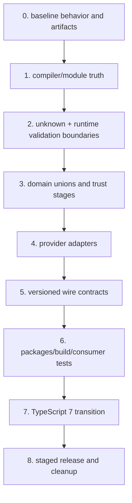

# Migration Playbook and Anti-Patterns

> **Last researched:** 2026-08-31  
> **Runtime boundary:** This migration covers TypeScript compiler, type, schema, package, and adapter changes. Node process, stream, cancellation, worker, and lifecycle migrations belong in [TypeScript and Node.js agent runtimes](../typescript-node-agent-runtimes.md).

Migrate by tightening observable boundaries first, not by converting every internal type at once. The safe order is: establish evidence, make runtime inputs explicit, model domain states, isolate provider churn, then change compilers and artifacts. Each phase should be independently deployable and reversible.

## Migration map

Do not combine a compiler major upgrade with schema redesign, package conversion, and provider SDK upgrade unless the current system cannot build otherwise. Independent changes produce clearer evidence and safer rollback.

## Phase 0: inventory and baseline

Record:

- every runtime/entry point and its exact version;
- all `tsconfig` inheritance, module modes, `lib`, `types`, aliases, and emit paths;
- compiler, bundler, test runner, linter, declaration/schema generators, and compiler-API consumers;
- public packages, export maps, deep imports, project references, and workspace links;
- provider SDKs and types that escape adapters;
- inputs cast from `JSON.parse`, environment, database, queue, model, tool, or network;
- durable events/checkpoints and their real JSON examples;
- decorators and whether they use legacy `experimentalDecorators`/metadata;
- deployment artifacts, source maps, minimum runtime, and current build manifest.

Freeze representative evidence: compile diagnostics, type tests, API/declaration report, schema files, packed tarballs, adapter stream fixtures, stored old events, and target-runtime smoke tests. Do not “fix” baseline failures silently; classify them so the migration does not normalize regressions.

## Phase 1: make compiler and host agree

Create a shared strict base only for invariant language checks. Give each host its own configuration. For Node ESM use `nodenext`; for bundler-owned applications use `bundler`; for Deno/Bun/Workers follow the host's resolver and type environment. Remove fictional global combinations.

Resolve these before deeper type work:

- imports that TypeScript resolves but the actual host cannot;
- extension and ESM/CommonJS mismatches;
- `paths` aliases without runtime mapping;
- source imports that bypass package exports;
- output accidentally included as source;
- missing explicit `rootDir`, `types`, `lib`, or include/exclude intent.

Keep type checking separate from fast transpilation. Add the target artifact smoke test now so later strictness changes cannot hide a runtime-resolution defect.

## Phase 2: replace trust-boundary casts with validation

Search for `as`, non-null assertions, `any`, untyped `JSON.parse`, SDK result assignment, and generic “typed fetch” helpers. Prioritize external and durable boundaries, not every assertion.

For each boundary:

1. accept `unknown`;
2. impose byte/depth/item limits before expensive validation;
3. parse and validate with one canonical executable schema;
4. return a domain type only on success;
5. preserve structured validation issues without leaking sensitive input;
6. add valid/invalid/boundary fixtures;
7. generate provider/wire schema as an explicit projection when needed.

Enable strictness incrementally: `strict`, `useUnknownInCatchVariables`, `noUncheckedIndexedAccess`, `exactOptionalPropertyTypes`, `noImplicitOverride`, and `noPropertyAccessFromIndexSignature`. Fix code by narrowing and correcting models, not by sprinkling assertions.

`exactOptionalPropertyTypes` often reveals wire ambiguity: absent and present-with-`undefined` are different in memory, while JSON drops `undefined`. Choose the wire meaning and model it explicitly, often with `null` or separate variants.

## Phase 3: model states and trust stages

Replace optional-property bags and boolean combinations with small discriminated unions. Start with high-risk flows:

- raw → validated → authorized → executed tool calls;
- running → awaiting tool → completed/failed run state;
- provider stream fragments → normalized calls/events;
- expected error unions and retry classification.

Use exhaustive `never` checks for app-owned closed unions. Use an explicit unknown case for provider and wire values that can evolve independently.

Keep constructors/validators as the only way to create proof-carrying types. Brands prevent accidental ID mixing but do not validate strings. Never migrate by replacing `as ToolCall` with `as AuthorizedToolCall`.

## Phase 4: isolate provider SDKs

Move vendor imports into adapter packages/modules. Introduce the narrowest app-owned `ModelGateway`, request, event, capability, and failure types required by current behavior.

Migrate one provider at a time:

1. capture redacted request and stream fixtures;
2. implement request projection;
3. normalize all known events with an explicit unknown strategy;
4. bound/assemble tool fragments and revalidate locally;
5. map provider failures into app-owned categories;
6. compare old and new adapter output on the same fixtures;
7. stage live traffic with safe shadowing or a small cohort where practical;
8. stop re-exporting SDK types only after consumers use app-owned types.

Avoid a flag day. A temporary compatibility adapter is preferable to letting new domain types leak back into provider-specific forms.

## Phase 5: version durable and cross-process contracts

Add a stable schema name and explicit version to events, checkpoints, effect requests, and independently deployed API messages. Do not rewrite old stored data before a reader can handle both versions.

Use read-old/write-new deployment:

- write deterministic upcasters from every retained version;
- test complete history replay, not only object conversion;
- deploy tolerant readers;
- begin new writes;
- monitor unknown versions and migration failures;
- backfill only when its operational value exceeds its risk;
- retain rollback readers until old/new writers can no longer appear.

Types and schemas evolve separately. A TypeScript rename need not alter JSON; a schema constraint change can break wire compatibility without any type error. Gate both.

## Phase 6: harden packages and artifacts

Introduce package boundaries only where dependency direction or deployment needs them. Add explicit export maps and stop deep/source imports. Enable project references when their incremental/build-boundary value justifies them.

Then validate what consumers receive:

- declaration/API reports;
- packed tarball inventory;
- empty consumer fixtures under supported resolvers;
- no `skipLibCheck` in the publisher gate;
- target-runtime execution of built entry points;
- versioned schema artifact and digest;
- source-map disclosure and correlation test;
- clean, frozen-lockfile build manifest.

Do not refactor internal folders and package boundaries simultaneously unless necessary. Package movement creates resolution noise that obscures type-model changes.

## Phase 7: migrate TypeScript 6 to 7

As of 2026-08-31, TypeScript 7.0.2 is the stable native CLI/language server, while TypeScript 6.0.3 is the compatibility compiler for programmatic API users. The official `@typescript/typescript6@6.0.2` wrapper currently resolves that compiler; wrapper and underlying compiler versions are distinct build-manifest fields.

### First, make the TypeScript 6 build deprecation-clean

TypeScript 7 removes or errors on legacy configuration including old module-resolution modes and other deprecated options. On TypeScript 6:

- enable deprecation diagnostics and remove suppressed legacy configuration;
- replace `node`/`node10`/`classic` resolution with a host-accurate mode;
- remove reliance on `baseUrl` where package imports or explicit paths are correct;
- eliminate ES5 and legacy module targets no longer supported by TS 7;
- set explicit `rootDir`, `types`, `lib`, and source scope;
- audit behavior affected by TS 7 defaults such as strictness, module/target, side-effect imports, and type ordering.

Confirm exact removed/defaulted options against the TypeScript 7 announcement and release notes rather than using a stale migration blog.

### Run side by side

Use the official compatibility path for compiler-API-dependent tools (`@typescript/typescript6` or a deliberate package alias) and the native TS 7 package/CLI for TS 7 checking. Pin both and invoke them explicitly.

Compare:

- diagnostics by code and location, not only display ordering;
- emitted JavaScript if either compiler emits it;
- declaration/API reports;
- type tests, including negative cases;
- build graph/output paths;
- linter, test runner, framework plugin, schema/declaration tooling compatibility;
- target artifacts and source maps.

Do not claim TS 7 support merely because the editor uses its language server. CI and release artifacts must use the documented toolchain.

### Retire compatibility only with evidence

When a supported native compiler API arrives, migrate each API consumer, compare output, and remove TypeScript 6 after the release path no longer invokes it. Until then, record the dual toolchain in the build manifest and dependency policy.

## Decorator migration

TypeScript 5.0 introduced standard decorators that differ from legacy experimental decorators. The new model is not compatible with `emitDecoratorMetadata` and does not permit parameter decorators. Determine which semantic model each package uses before changing flags.

Do not mass-rewrite decorator syntax based only on compilation. Frameworks may depend on legacy metadata and initialization order. Options:

- retain legacy mode in an isolated package while the framework requires it;
- migrate to standard decorators with framework-supported APIs and behavior tests;
- replace reflection-heavy injection/registration with explicit factories or registries where simpler.

Test class initialization, inheritance, metadata use, bundler transformation, and emitted/runtime target. Never enable both mental models implicitly through shared configuration.

## Anti-pattern catalog

| Anti-pattern | Why it fails | Migration target |
|---|---|---|
| `JSON.parse(...) as Event` | Assertion does no runtime checking | `unknown` → bounded parse → versioned validator |
| Provider SDK types in core/state | Vendor release becomes domain/wire break | Adapter-owned normalization |
| One giant `AgentState` with optional fields | Contradictory states compile | Discriminated state union |
| Tool schema equals authorization | Valid shape is mistaken for permission | Separate validated and authorized stages |
| Type-only schema generation with silent fallbacks | TS features have no exact JSON Schema meaning | Schema authority plus explicit projection-loss report |
| `paths` used as runtime/publication resolver | Built consumer cannot resolve | Package exports or host mapping with artifact test |
| `skipLibCheck` everywhere | Broken declarations remain invisible | Strict publisher/health gate |
| Fast transpiler as type checker | Types are erased without validation | Independent `tsc --noEmit`/TS 7 type gate |
| Raw `Error` or SDK instance persisted | Not stable/JSON-safe; may leak data | Versioned serialized failure |
| `catch (e as SdkError)` | Rejections are untyped | Catch `unknown`, adapter classification |
| Floating promise with `void` | Lost failure and shutdown race | Explicit task supervisor |
| `export *` from internal tree | Accidental API expansion and cycles | Explicit public entry points |
| One tsconfig for Node, DOM, worker, Deno | Fictional available APIs | Target-specific configs |
| Dual ESM/CJS by default | Doubles resolution/type surfaces | One format unless consumers prove need |
| Compiler + SDK + schema upgrade together | Regressions cannot be isolated | Small staged migrations |
| New compiler API assumed in TS 7 | Stable CLI currently lacks it | TS 6 compatibility lane |

## Rollback design

Before each phase, identify what cannot simply be rolled back:

- newly written event/schema versions need backward readers;
- package export removal may require a deprecation release;
- provider feature use may create state an old adapter cannot interpret;
- a published package version cannot be replaced immutably;
- an artifact/source-map mapping must stay available for incident evidence.

Prefer feature flags at composition boundaries rather than throughout domain logic. Roll back by immutable artifact digest. Keep schema readers and provider normalizers tolerant enough for the rollback window, but do not make validation permissive indefinitely.

## Completion gate

- [ ] Every deployment target type-checks under a host-accurate configuration and executes its built artifact.
- [ ] Every untrusted/durable boundary validates `unknown` with bounded executable schemas.
- [ ] Tool calls have distinct proposed, validated, authorized, and completed contracts.
- [ ] Domain state and events use exhaustively handled app-owned unions.
- [ ] Provider SDK types remain inside adapters with explicit unknown/capability behavior.
- [ ] Durable formats are versioned and every retained version replays deterministically.
- [ ] Public packages pass declaration/API and packed-consumer gates.
- [ ] Type, schema, adapter, and target-runtime compatibility tests are separate and green.
- [ ] Supply-chain/build manifests identify exact tools, lockfile, schemas, and artifact digest.
- [ ] TypeScript 7 CLI and TypeScript 6 compiler-API roles are explicit until the native API is supported.
- [ ] Rollback retains readers for every contract already emitted.

## Primary sources

- [Announcing TypeScript 7.0](https://devblogs.microsoft.com/typescript/announcing-typescript-7-0/)
- [Announcing TypeScript 6.0](https://devblogs.microsoft.com/typescript/announcing-typescript-6-0/)
- [TypeScript modules reference](https://www.typescriptlang.org/docs/handbook/modules/reference.html)
- [TypeScript TSConfig reference](https://www.typescriptlang.org/tsconfig/)
- [TypeScript 5.0 decorators](https://www.typescriptlang.org/docs/handbook/release-notes/typescript-5-0.html)
- [TypeScript legacy decorators](https://www.typescriptlang.org/docs/handbook/decorators)
- [TypeScript 5.6 build mode changes](https://www.typescriptlang.org/docs/handbook/release-notes/typescript-5-6.html)
- [Node.js native TypeScript support](https://nodejs.org/api/typescript.html)
- [MCP TypeScript SDK v2 migration guide](https://ts.sdk.modelcontextprotocol.io/v2/migration/upgrade-to-v2)
