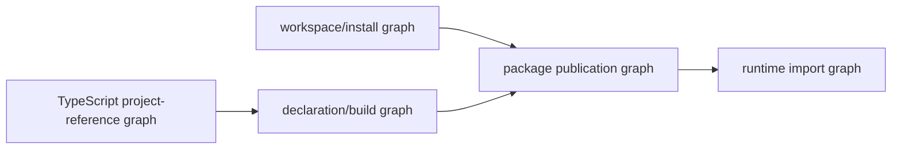

# Packages, Public APIs, and Monorepos

> **Last researched:** 2026-08-31  
> **Runtime boundary:** This guide covers TypeScript package and declaration contracts. Workspace process orchestration, worker topology, runtime dependency loading, and Node lifecycle belong in [TypeScript and Node.js agent runtimes](../typescript-node-agent-runtimes.md).

A TypeScript monorepo contains three graphs that are related but not interchangeable:



- the package-manager workspace graph controls installation and package linking;
- the TypeScript project-reference graph controls compiler boundaries and incremental builds;
- the runtime/publication graph is what consumers actually resolve from packed artifacts.

A path alias can make the editor green while the published package is broken. Validate all three graphs.

## Create packages only for real boundaries

Useful agent-system package boundaries often correspond to independent contracts or deployment concerns:

- `contracts`: JSON-safe domain types and executable schemas shared across processes;
- `core`: provider-independent agent decisions and reducers;
- `provider-*`: SDK adapters and schema projectors;
- `tools-*`: bounded executors for a specific capability or trust domain;
- an application/deployment package that wires concrete implementations.

Do not create one package per folder, union, or tool. A package adds versioning, build ordering, dependency, release, and compatibility costs. Split when it enforces a dependency direction, supports independent publication/deployment, or materially shortens the trust boundary.

The contracts package should not import provider SDKs, Node-only types, database clients, or application configuration. Otherwise every consumer inherits deployment assumptions that the wire contract does not need.

## Use exports as the public firewall

Declare the supported entry points explicitly. Avoid public deep imports into `dist/` or `src/`:

```json
{
  "name": "@example/agent-contracts",
  "type": "module",
  "exports": {
    ".": {
      "types": "./dist/index.d.ts",
      "import": "./dist/index.js"
    },
    "./schemas": {
      "types": "./dist/schemas.d.ts",
      "import": "./dist/schemas.js"
    }
  },
  "files": ["dist", "schemas", "README.md", "LICENSE"]
}
```

The example is intentionally ESM-only. Add CommonJS only when actual consumers require it, then test both runtime and declaration resolution. Dual packages multiply the ways that condition ordering, extensions, and declarations can disagree.

Keep the `types` condition first in each conditional object, and compile/package-test with the same module-resolution modes supported for consumers. The declaration path and JavaScript path for a condition must describe the same module kind and exports.

Use explicit public re-exports:

```ts
export type { ModelRequest, ModelEvent, ModelGateway } from "./model.js";
export { modelRequestSchema, modelEventSchema } from "./model.js";
```

This makes the public surface reviewable. A recursive `export *` barrel can expose internal helpers accidentally, create ambiguous names, and make cycles harder to see.

## Design declaration files as a product

Published TypeScript packages ship two contracts: runtime JavaScript and declarations. They can fail independently.

Guidelines:

- export app-owned domain types, not vendor SDK response types;
- name public parameter and return types instead of exposing enormous inferred types;
- avoid nominal dependence on duplicated classes when a structural interface is sufficient;
- use `unknown` at untrusted boundaries and executable schemas for runtime proof;
- avoid enums or class instances as wire values unless runtime identity is intentional;
- do not expose internal filesystem layout through declaration imports;
- document minimum supported TypeScript and module-resolution modes.

`isolatedDeclarations` helps ensure each file can emit declarations without cross-file inference, which supports parallel declaration tooling and exposes hard-to-name public inference. It is a build constraint, not a substitute for API review. Enable it when the public library/toolchain benefits and fix resulting annotations intentionally.

```json
{
  "compilerOptions": {
    "composite": true,
    "declaration": true,
    "declarationMap": true,
    "isolatedDeclarations": true,
    "stripInternal": false
  }
}
```

Do not use `stripInternal` as the primary API boundary: TypeScript documents it as an internal option whose output validity is not verified. Export maps and explicit entry points are the enforceable boundary.

Use API Extractor or a focused declaration-diff process for important published libraries. An API report makes accidental public changes visible in code review. It does not prove runtime compatibility, schema compatibility, or correct resolution.

## Keep package and runtime types aligned

A common failure is “types say one thing, JavaScript exports another.” Test the packed artifact, not just source:

1. build from a clean checkout with the lockfile;
2. run `npm pack --dry-run` and inspect included files;
3. create a tarball;
4. install it into small consumer fixtures;
5. compile fixtures with every supported resolver;
6. run the compiled/imported entry points under every supported runtime/module mode;
7. run [AreTheTypesWrong](https://github.com/arethetypeswrong/arethetypeswrong.github.io) or equivalent resolution checks.

Consumer fixtures should import only documented package specifiers. A source-level test using workspace links can bypass the packed layout and conceal missing files or wrong export conditions.

This is not theoretical: as of the research date, an open issue in the official Google Gen AI SDK repository demonstrates a package whose CommonJS JavaScript entry executes while TypeScript CommonJS consumers reject the shared ESM-interpreted `.d.ts`. That is exactly why a runtime `require()` smoke and a `nodenext` consumer type-check are separate gates. Treat the issue as time-sensitive evidence, not a permanent claim about the SDK; verify the exact candidate version. Do not hide this class of defect with `skipLibCheck`. Pin/use a supported module path or isolate a documented workaround until the package publishes matching declarations.

## Project references are build boundaries

Use project references for a large repository when separate projects have stable dependencies and incremental build value:

```json
{
  "files": [],
  "references": [
    { "path": "./packages/contracts" },
    { "path": "./packages/core" },
    { "path": "./packages/provider-openai" },
    { "path": "./apps/worker" }
  ]
}
```

Each referenced project enables `composite`; TypeScript then consumes declaration outputs across project boundaries. Keep the reference graph acyclic and aligned with package dependencies. A package should not import another workspace's `src` directory to evade the graph.

`tsc -b` determines build order and supports incremental state. Since TypeScript 5.6, build mode continues through intermediate errors by default so downstream diagnostics are available; `--stopOnBuildErrors` restores fail-fast behavior. CI release builds should normally fail closed. Developer diagnostic builds may intentionally continue.

TypeScript 7's native compiler adds parallel check/build modes. Parallelism changes resource demand, not dependency correctness. Establish CPU and memory limits in CI, and do not assume maximum parallelism is fastest on a constrained runner.

## Keep path aliases honest

`paths` teaches TypeScript how to resolve an import for checking; it does not guarantee a runtime loader or package consumer can resolve it. For published packages, prefer package specifiers and export maps. For application-only aliases, ensure the actual bundler/runtime performs the same mapping and verify the built artifact.

Do not point a package name alias directly at another package's source. It bypasses declarations, export maps, packaging, and sometimes module-mode checks. Workspaces should link packages as packages.

## Dependency placement is part of the API

| Dependency kind | Use when | Agent-specific concern |
|---|---|---|
| `dependencies` | Required by emitted runtime code | SDKs and validators increase deployment and supply-chain surface |
| `devDependencies` | Build/test only | Compiler, linter, API report, test runners |
| `peerDependencies` | Consumer must share a runtime instance/version | Schema libraries or framework identity only when truly required |
| `optionalDependencies` | Feature can be unavailable and code detects it | Native/runtime-specific acceleration with tested fallback |

Avoid making a validator a peer dependency merely to reduce bundle size; it transfers installation complexity to consumers. A peer is justified when shared runtime identity or plugin compatibility is a real requirement. `import type` removes a type-only runtime dependency only if emitted code and declaration resolution no longer require the package.

## `skipLibCheck` is not a release strategy

`skipLibCheck` can reduce checking time and help an application tolerate conflicting third-party declarations, but it skips validation of declaration files and can conceal the publisher's own broken output. Published packages should validate their declarations with `skipLibCheck: false` in release/consumer fixtures. If applications enable it, keep a separate dependency-health job that exposes declaration conflicts before upgrades reach production.

## Public API change policy

Review four dimensions independently:

| Change | TypeScript source | Runtime JS | Wire/schema | Package resolution |
|---|---:|---:|---:|---:|
| Add optional field | Often compatible | Often compatible | Depends on unknown-key policy | No effect |
| Narrow union | Breaking for producers | Possibly | Breaking for accepted data | No effect |
| Add union variant | Can break exhaustive consumers | Maybe | Readers need unknown behavior | No effect |
| Change export path | Breaking | Breaking | No effect | Breaking |
| Change SDK type exposed publicly | Potentially breaking | Possibly none | Possibly none | Possibly |
| Tighten schema while type stays same | No compile signal | Runtime breaking | Breaking | No effect |

SemVer must cover the public declarations, runtime behavior, schemas, and exports—not just whether implementation source compiles.

## Review checklist

- [ ] Every package boundary has a concrete dependency, deployment, or publication purpose.
- [ ] Contracts/core do not depend on provider or Node-specific types unnecessarily.
- [ ] Export maps enumerate supported entry points; public deep imports are absent.
- [ ] Runtime files and declarations align for every export condition.
- [ ] Public types are named, app-owned, and do not leak SDK internals.
- [ ] Project references match package dependencies and contain no source bypass.
- [ ] CI release builds fail on upstream project errors and declaration errors.
- [ ] Packed-tarball consumers compile and execute in supported modes.
- [ ] API, schema, runtime, and resolution compatibility are reviewed separately.

## Primary sources

- [TypeScript modules reference: package and module resolution](https://www.typescriptlang.org/docs/handbook/modules/reference.html)
- [TypeScript guide: choosing compiler options](https://www.typescriptlang.org/docs/handbook/modules/guides/choosing-compiler-options.html)
- [TypeScript project references](https://www.typescriptlang.org/docs/handbook/project-references)
- [TypeScript declaration-file publishing guidance](https://www.typescriptlang.org/docs/handbook/declaration-files/publishing.html)
- [TypeScript 5.5: `isolatedDeclarations`](https://www.typescriptlang.org/docs/handbook/release-notes/typescript-5-5.html)
- [TypeScript 5.6: build mode and `stopOnBuildErrors`](https://www.typescriptlang.org/docs/handbook/release-notes/typescript-5-6.html)
- [Node.js package entry points and conditional exports](https://nodejs.org/api/packages.html)
- [API Extractor overview](https://api-extractor.com/pages/overview/intro/)
- [AreTheTypesWrong package resolution checker](https://github.com/arethetypeswrong/arethetypeswrong.github.io)
- [Google Gen AI SDK issue: CommonJS runtime and declaration-mode mismatch](https://github.com/googleapis/js-genai/issues/1811)
