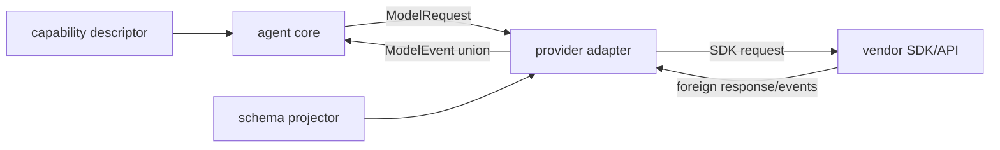

# Provider Adapters and SDK Churn

> **Last researched:** 2026-08-31  
> **Runtime boundary:** This guide covers TypeScript ownership and normalization. Retry scheduling, sockets, stream backpressure, cancellation mechanics, rate limiting, and connection lifecycle belong in [TypeScript and Node.js agent runtimes](../typescript-node-agent-runtimes.md).

Provider SDK types are useful at the integration edge and unstable as an application domain model. They encode one vendor's naming, streaming protocol, feature rollout, and release cadence. Keep them behind a small adapter that accepts app-owned requests, treats provider responses as foreign data, and emits app-owned events.

## The anti-corruption boundary



Only the adapter package imports vendor SDK types. The core does not expose them in public signatures, persisted state, telemetry authority, or tool contracts.

## Own the narrow interface the application needs

Do not build a universal copy of every provider API. Start from actual application use cases:

```ts
export type ModelRequest = Readonly<{
  model: ModelRef;
  messages: readonly AppMessage[];
  tools?: readonly AppToolDefinition[];
  responseSchema?: AppResponseSchema;
  maxOutputTokens?: number;
  metadata: Readonly<Record<string, string>>;
}>;

export type ModelEvent =
  | { type: "text.delta"; text: string }
  | { type: "tool.arguments.delta"; callId: string; name?: string; fragment: string }
  | { type: "tool.call"; call: ProposedToolCall }
  | { type: "refusal"; reason?: string }
  | { type: "usage"; usage: TokenUsage }
  | { type: "completed"; finish: Finish }
  | { type: "failed"; error: ModelFailure };

export interface ModelGateway {
  stream(
    request: ModelRequest,
    context: RequestContext,
  ): AsyncIterable<ModelEvent>;
}
```

`ModelRef` should preserve provider and exact model identity instead of flattening everything into an ambiguous string. `Finish` should retain both a normalized reason and the original provider value so new values are observable before the adapter supports them.

```ts
type Finish = Readonly<{
  reason: "stop" | "length" | "tool_call" | "content_filter" | "unknown";
  providerReason: string | null;
}>;
```

Unknown provider values are not impossible values. Map them to an explicit `unknown` case, record safe diagnostics, and decide whether the core can continue.

## Normalize foreign data defensively

Static SDK types are not a trust boundary. The response may come from a newer server, proxy, recorded fixture, webhook, cache, or partially upgraded SDK. Treat decoded response bodies and stream events as `unknown` at the adapter's normalization boundary when correctness matters.

The adapter should:

1. validate the provider event discriminant and required fields;
2. assemble fragmented tool arguments with byte and time limits;
3. reject duplicate or inconsistent call identifiers;
4. distinguish text, tool calls, refusal, safety filtering, truncation, and transport failure;
5. emit exactly one terminal domain event;
6. retain safe provider diagnostics without leaking credentials or sensitive prompts.

Never execute a partial tool call. A provider stream can end between UTF-8 fragments or in the middle of JSON. Assemble, bound, parse, then validate against the canonical local tool schema.

## Capabilities are data, not optimistic branching

Providers and models differ by structured-output dialect, tool-result format, parallel calls, streaming behavior, image support, token accounting, and schema limits. Express only capabilities that change core decisions:

```ts
type ProviderCapabilities = Readonly<{
  toolCalls: boolean;
  parallelToolCalls: boolean;
  structuredOutput: "none" | "json_schema_subset";
  streamedToolArguments: boolean;
  validatedToolResults: boolean;
}>;
```

Resolve this descriptor from tested provider/model configuration. Do not infer capabilities from a model-name substring scattered through business logic. Preserve provider-specific features with an explicit extension point only when the product needs them; the least-common-denominator API can discard material value.

Unsupported behavior should return a typed capability error before making a request:

```ts
type PrepareResult =
  | { ok: true; request: ProviderRequest }
  | { ok: false; error: { code: "unsupported_capability"; feature: string } };
```

## Project canonical schemas per provider

OpenAI and Gemini document supported subsets of JSON Schema for structured output, and those subsets need not be identical. The adapter's schema projector should:

- take a canonical application schema plus an explicit input/output mode;
- target the provider's supported dialect and keyword set;
- fail closed on an unrepresentable required constraint;
- report every dropped or rewritten constraint;
- retain canonical runtime validation after generation;
- cache projections by canonical schema digest, projector version, provider, and mode.

Do not silently replace a constrained object with “any JSON” because a keyword is unsupported. Either redesign that contract, encode it in a representable form, or declare the feature unsupported for that provider.

## SDK types are a change detector, not domain authority

Provider SDK updates may change overload resolution, union members, optionality, generated names, streaming event types, or minimum TypeScript/runtime versions even when runtime behavior is compatible. OpenAI's official Node SDK explicitly notes that static type changes may be released as minor versions. Treat dependency updates as migrations, not routine lockfile noise.

Current maintainer evidence shows why this must include more than types. As of the research date, the Google Gen AI SDK README warns that its next major changes automatic function-calling placement and raises the Node.js minimum to 22, while its API-version option can select stable or beta endpoints independently of the npm package. Record and test **SDK version + API version + runtime + model/region**, not only the package SemVer. This note is a refresh trigger, not a permanent statement about future releases.

For each adapter:

- pin a reviewed SDK range and commit the lockfile;
- compile against the minimum and proposed SDK versions when a range is supported;
- keep a small type-compatibility fixture for the APIs actually used;
- run recorded normalization fixtures independently of live credentials;
- run a bounded live contract test in a staging account where practical;
- review generated declaration diffs and transitive runtime changes;
- record the SDK and API/model versions in deployment metadata.

Do not copy an entire generated SDK response type into the core. Extract only stable, meaningful domain data through explicit normalization.

## Own observability before projecting to telemetry SDKs

Telemetry instrumentation is another third-party adapter. OpenTelemetry's GenAI conventions have moved to a dedicated repository and parts remain under active evolution; provider SDKs may also auto-instrument the same HTTP/model call. Keep a small application-owned observation and project it into the selected convention/version:

```ts
type ModelObservation = Readonly<{
  operation: "model.generate" | "model.stream";
  provider: string;
  requestedModel: string;
  responseModel?: string;
  outcome: "completed" | "refused" | "incomplete" | "failed" | "cancelled";
  contractVersion: number;
  adapterVersion: string;
  sdkVersion: string;
  schemaProjectorVersion?: string;
  providerRequestId?: string; // trace/log evidence; never a metric label
  inputTokens?: number;
  outputTokens?: number;
}>;
```

Use low-cardinality dimensions for metrics (`provider`, bounded operation, normalized outcome, allowlisted model). Keep request IDs on traces/logs, not metric labels. Prompts, tool arguments/results, retrieved documents, SDK error bodies, and model output are sensitive and potentially attacker-controlled; do not record them by default. If an audited diagnostic mode captures content, bound, redact, sample, access-control, and expire it separately.

Test the telemetry projection as a contract:

- one logical model call produces one owner span even when SDK auto-instrumentation is enabled;
- run/correlation ID propagates without becoming an unbounded metric dimension;
- refusal, incomplete response, timeout, abort, and invalid provider payload produce distinct normalized outcomes;
- provider request ID and exact SDK/adapter/projector versions are available for incident correlation;
- disabling or failing an exporter does not change business behavior;
- a semantic-convention upgrade produces an intentional attribute diff and dashboard/alert migration plan.

Do not persist spans as replay authority. Domain events describe what the application accepted; telemetry describes what an instrumentation observed.

## Case study: MCP TypeScript SDK v1 to v2

The Model Context Protocol TypeScript SDK v2 is a useful example of legitimate type and schema churn. Its migration guide documents changes to package structure, imports, request handlers, schemas, and APIs. V2 also accepts Standard Schema validators and JSON Schema, rather than making one schema library the universal public contract.

The production lesson is not “wrap every dependency.” Wrap dependencies whose types otherwise cross important boundaries. For MCP:

- keep protocol messages at the MCP transport edge;
- normalize tool definitions into the application registry;
- validate tool inputs and structured outputs locally;
- translate MCP errors into app-owned failure categories;
- compile consumer fixtures against both sides during a staged migration;
- avoid persisting SDK class instances or package-specific schema objects.

During the TypeScript 7 transition, remember that the native compiler's stable CLI does not yet provide the programmatic compiler API. Tooling or SDK generators that call the compiler API may still need the TypeScript 6 compatibility package even when application diagnostics run on TypeScript 7.

MCP v2 is stable, but “the codemod ran” is not an adoption test. The official migration surface includes split packages, Node.js 20+, ESM-first plus CommonJS artifacts, Standard Schema objects, changed registration/handler APIs, transport changes, and new error classes. Before promotion, exercise:

| Surface | Concrete gate |
|---|---|
| Package/runtime | Packed consumer imports every used v2 package under each advertised module mode on the minimum Node version |
| Schema | Server starts, `tools/list` succeeds, descriptions survive conversion, and valid/invalid `tools/call` arguments match the canonical validator |
| Registration/handler context | Each registered tool/resource/prompt is listed and invoked; auth and request context fields come from the documented v2 locations |
| Transport | Connect, reconnect/session behavior, close, and expected authentication failures pass for the selected transport; removed transports are not silently retained |
| Error mapping | SDK/protocol/HTTP errors map to stable app categories without relying only on class name or `instanceof` across duplicate packages |
| Protocol revision | Handshake/discovery and conformance fixtures run against every supported MCP revision; do not infer protocol support from SDK major alone |

For a monorepo, verify every member declares the v2 package it imports; hoisting can conceal a missing dependency. If MCP objects cross your public package API, a v1→v2 peer-package rename is a consumer breaking change even when internal behavior appears equivalent.

## Adapter failure taxonomy

Avoid a single `ProviderError`. The core needs enough classification to decide safely:

```ts
type ModelFailure = Readonly<{
  category:
    | "authentication"
    | "authorization"
    | "rate_limited"
    | "timeout"
    | "transport"
    | "invalid_request"
    | "content_filtered"
    | "invalid_response"
    | "provider_unavailable"
    | "unknown";
  retry: "never" | "same_request" | "after_backoff" | "operator_decision";
  providerCode?: string;
  requestId?: string;
  safeMessage: string;
  cause?: unknown;
}>;
```

The adapter proposes retry semantics; the runtime owns attempt limits, deadlines, idempotency, and scheduling. Never retry a side-effectful operation only because the SDK error class says “retryable.”

## Testing matrix

| Layer | Required evidence |
|---|---|
| Type surface | Consumer fixture compiles without vendor types leaking |
| Request mapping | Golden request for every used feature and capability combination |
| Stream normalization | Fragmentation, unknown events, missing/duplicate terminal, refusal, truncation |
| Schema projection | Accepted keywords, rejected constructs, local revalidation |
| Error mapping | Representative HTTP, SDK, timeout, abort, parse, and unknown failures |
| Dependency update | Old/new SDK compile fixtures plus declaration and behavior diff |
| Live smoke | Exact deployed SDK, model, region/API version, and bounded test input |

Fixtures copied from provider traffic must be redacted and reviewed. Do not place prompts, credentials, customer data, or opaque provider tokens in the repository.

## Common anti-patterns

| Anti-pattern | Consequence | Replacement |
|---|---|---|
| Re-exporting SDK request/response types | Vendor churn becomes an application breaking change | App-owned request and event union |
| `catch (error: ProviderError)` | JavaScript can reject with any value | Catch `unknown`, classify at boundary |
| One “OpenAI-compatible” adapter for every server | Silent protocol and feature differences | Capability-tested adapters/profiles |
| Parsing tool JSON in the core | Provider fragmentation leaks inward | Assemble and normalize in adapter |
| Exhaustive switch without an unknown case on foreign enums | New server value crashes the client | Explicit unknown plus observability |
| Automatic SDK update merge after green unit tests | Type/runtime behavior can drift | Compile, fixture, package, and live contract gates |

## Review checklist

- [ ] Vendor SDK imports are confined to adapter packages.
- [ ] Public and durable contracts use app-owned types.
- [ ] Foreign enums and event types have explicit unknown behavior.
- [ ] Stream assembly is bounded and never executes partial arguments.
- [ ] Canonical schemas are projected explicitly and revalidated locally.
- [ ] Capability decisions do not depend on scattered model-name checks.
- [ ] Provider failures are normalized without deciding runtime retry policy.
- [ ] SDK upgrades run compile fixtures, normalization fixtures, and a behavior review.
- [ ] Deployment metadata records exact SDK and model/API configuration.
- [ ] Telemetry is an app-owned, versioned projection with bounded cardinality, default content redaction, and double-instrumentation tests.

## Primary sources

- [OpenAI Node SDK compatibility policy](https://github.com/openai/openai-node)
- [Anthropic TypeScript SDK](https://github.com/anthropics/anthropic-sdk-typescript)
- [Google Gen AI JavaScript/TypeScript SDK](https://github.com/googleapis/js-genai)
- [OpenAI Structured Outputs guide](https://platform.openai.com/docs/guides/structured-outputs)
- [Gemini structured output and supported JSON Schema subset](https://ai.google.dev/gemini-api/docs/structured-output)
- [MCP TypeScript SDK v2 documentation](https://ts.sdk.modelcontextprotocol.io/v2/)
- [MCP TypeScript SDK v2 migration guide](https://ts.sdk.modelcontextprotocol.io/v2/migration/upgrade-to-v2)
- [OpenTelemetry GenAI semantic conventions](https://github.com/open-telemetry/semantic-conventions-genai)
- [OpenTelemetry GenAI metrics (development status)](https://github.com/open-telemetry/semantic-conventions-genai/blob/main/docs/gen-ai/gen-ai-metrics.md)
- [Announcing TypeScript 7.0](https://devblogs.microsoft.com/typescript/announcing-typescript-7-0/)
