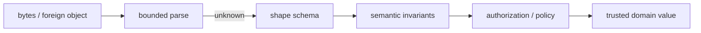
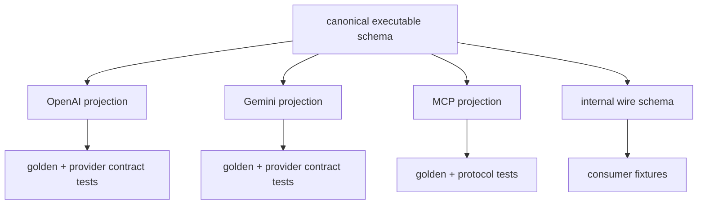

# Runtime Validation and JSON Schema

> **Last researched:** 2026-08-31  
> **Runtime boundary:** Input-size limits, stream backpressure, cancellation, and CPU isolation belong in [TypeScript and Node.js agent runtimes](../typescript-node-agent-runtimes.md).

TypeScript erases types. `JSON.parse`, SDK response objects, queue messages, database JSON, model output, tool arguments, environment variables, and persisted checkpoints are not made safe by assigning them an interface. Each must enter the trusted core as `unknown` and cross an executable validation boundary.

## The boundary pipeline



Each stage answers a different question:

| Stage | Question | Example |
|---|---|---|
| Decode | Can these bytes become the expected carrier value? | valid UTF-8 JSON object under the byte/depth budget |
| Shape validation | Are fields and primitive constraints correct? | `run_id` is a bounded string; `limit` is an integer 1–20 |
| Semantic validation | Are cross-field/domain invariants true? | `expires_at` is after `issued_at`; referenced tool version exists |
| Authorization | May this principal request this effect now? | tenant owns the document; tool is allowed by current policy |
| Execution | Can the operation complete under its budget? | downstream succeeds and returns a validated receipt |

A schema should not call a database or authorization service. Async schema refinements make validation latency, failure classification, caching, and cancellation obscure. Keep I/O-dependent rules in a named semantic/policy step.

## Choose one schema authority per boundary

| Authority | Strong fit | Main risk |
|---|---|---|
| Runtime-validator-first, then infer TypeScript | In-process application inputs and provider projections; rich parsing or transforms | Generated JSON Schema may not represent transforms or custom refinements |
| JSON-Schema-first, then infer/validate | Public wire protocols, provider tool schemas, cross-language contracts | TypeScript inference may be less expressive; validator dialect must be pinned |
| Handwritten TypeScript plus generated schema | Legacy models where migration must be staged | Two sources of truth and compiler-API/version coupling |

Default to an executable schema as the source of truth. Avoid starting a new contract with a plain `interface` and a compiler-API generator. TypeScript 7.0 has no programmatic compiler API, and even mature generators cannot translate every conditional type, generic, transform, brand, class, or semantic rule.

## A tool contract with separate representations

```ts
import * as z from "zod";

export const SearchToolInput = z.strictObject({
  query: z.string().trim().min(1).max(2_000),
  top_k: z.number().int().min(1).max(20).default(5),
  filters: z
    .strictObject({
      collection_ids: z.array(z.string().min(1).max(128)).max(50),
    })
    .optional(),
});

export type SearchToolWireInput = z.input<typeof SearchToolInput>;
export type SearchToolInput = z.output<typeof SearchToolInput>;

export const SearchToolResult = z.strictObject({
  items: z
    .array(
      z.strictObject({
        document_id: z.string().min(1).max(128),
        score: z.number().finite(),
        snippet: z.string().max(8_000),
      }),
    )
    .max(20),
});
```

The input and output types differ because `top_k` has a default and `query` is normalized. Keep those meanings explicit. For provider tool schemas, generate the **input** representation; for values stored or returned after parsing, use the output representation.

Do not add coercion reflexively. `z.coerce.number()` can turn values that should be rejected into apparently valid input. Coerce at user-interface or environment-variable edges where the source representation is known; reject type mismatches in machine-to-machine contracts.

## Unknown keys are a policy decision

Possible behaviors are reject, strip, or preserve. Choose by boundary:

| Boundary | Usual policy | Reason |
|---|---|---|
| Effectful tool arguments | Reject | Unknown fields may encode unsupported authority or a model/schema mismatch |
| Versioned internal event | Reject per version | Makes forward/backward compatibility deliberate |
| Provider response adapter | Preserve raw separately, project known fields | Providers may add fields; application logic should not consume them accidentally |
| User-editable config | Often reject with clear errors | Typos should not silently change behavior |
| Telemetry baggage | Preserve only inside a bounded namespaced map | Extensibility is intentional but must be size-limited |

Zod's plain object behavior and generated `additionalProperties` vary by object helper and input/output conversion mode. Use an explicit strict/loose policy and pin golden JSON Schema output; do not rely on a library default remaining semantically invisible.

## JSON Schema generation is a lossy projection

Zod 4's native conversion documents several unrepresentable values, including `bigint`, `Date`, `Map`, `Set`, symbols, transforms, and custom schemas. Its default is to throw, which is safer than converting an unrepresentable rule to `{}`.

```ts
const providerSchema = z.toJSONSchema(SearchToolInput, {
  io: "input",
  target: "draft-2020-12",
  unrepresentable: "throw",
  cycles: "throw",
});
```

Production rules:

- fail generation on an unrepresentable construct;
- represent dates, durations, big integers, and binary data with an explicit JSON encoding;
- name the target dialect and provider subset;
- keep transforms in the runtime parsing layer, not in the advertised schema claim;
- prefer bounded, shallow, non-recursive tool schemas even when the dialect supports `$ref`;
- add descriptions for model guidance without treating descriptions as enforcement;
- validate generated schemas with the intended validator and provider compatibility tests;
- store the generated schema digest with the tool/release version.

`unrepresentable: "any"` is an emergency escape hatch, not a production default. It can erase the exact constraint that protects an effect boundary.

## Provider subsets need projections

“JSON Schema” does not imply identical support. Providers and protocols accept different drafts, keywords, root types, recursion behavior, strictness, and unknown-property rules. Current OpenAI and Gemini documentation explicitly describes subsets; the MCP TypeScript SDK v2 advertises JSON Schema 2020-12-oriented tool schemas and can accept Standard Schema implementations that also provide JSON Schema conversion.

Use this architecture:



Do not scatter provider keyword deletion across call sites. Give each projection a named function, supported-keyword policy, schema version, tests, and failure mode. If a canonical constraint cannot be represented by a provider, either simplify the canonical schema or retain a second local validation pass after generation. Never pretend the provider enforced a rule it could not see.

### Test projection semantics, not just schema text

Keep named fixtures whose expected result is independent of the schema library and provider SDK. A useful projection result contains both the generated artifact and a machine-readable loss report:

```ts
type ProjectionResult = Readonly<{
  schema: JsonValue;
  projectorVersion: string;
  canonicalDigest: string;
  losses: readonly {
    path: string;
    canonicalRule: string;
    disposition: "rejected" | "local_only";
  }[];
}>;
```

A representative test should make the disagreement visible:

```ts
const cases = [
  { name: "minimum valid", value: { query: "incident", top_k: 1 }, canonical: true },
  { name: "unknown key", value: { query: "incident", top_k: 1, tenant: "other" }, canonical: false },
  { name: "fractional limit", value: { query: "incident", top_k: 1.5 }, canonical: false },
  { name: "over limit", value: { query: "incident", top_k: 21 }, canonical: false },
] as const;

const projection = projectSearchInput("openai", SearchToolInput);
expect(projection.losses).toEqual([]); // this effect boundary permits no weakening

for (const fixture of cases) {
  expect(SearchToolInput.safeParse(fixture.value).success, fixture.name)
    .toBe(fixture.canonical);
  expect(validateProjected(projection.schema, fixture.value), fixture.name)
    .toBe(fixture.canonical);
}
```

If a target cannot express one rule, the test may deliberately expect provider acceptance plus canonical rejection—but only when the loss report names that exact path and `local_only` control. A new or widened loss fails review. Run a bounded live schema-registration smoke separately because a local JSON Schema validator cannot prove a provider/model accepts the same subset.

Provider schema adherence also applies only to a successful structured output. For example, an API response can be incomplete, failed, cancelled, or a refusal rather than the expected completed payload. Normalize the terminal outcome first, then parse the completed structured value, then revalidate with the canonical schema. Do not call a parser helper and discard response status, refusal, truncation, or safety metadata.

## JSON-safe state is narrower than TypeScript

A type such as `unknown`, `object`, or `Record<string, unknown>` does not guarantee JSON serializability. Define the carrier explicitly:

```ts
export type JsonPrimitive = string | number | boolean | null;
export type JsonValue =
  | JsonPrimitive
  | { readonly [key: string]: JsonValue }
  | readonly JsonValue[];
```

Even this static type cannot guarantee that a number is finite, keys meet length limits, a graph is acyclic, or an object lacks a hostile prototype. Runtime validation still must enforce:

- finite numbers and intentional integer ranges;
- depth, property-count, array-length, and string/byte limits;
- allowed object keys and prototype handling;
- no `undefined`, functions, symbols, `bigint`, class instances, or cyclic graphs;
- explicit date/time and binary encodings.

For persisted checkpoints, parse into version-specific wire types and then migrate to the current domain type. Do not cast historical JSON to the latest interface.

## JSON Schema validators have their own threat model

Ajv recommends strict mode to catch ignored or ambiguous schema constructs. It also treats schemas as trusted application code: compiling an untrusted schema can be slow or overflow, and some patterns can cause expensive validation. Ajv specifically warns about regex-related behavior, large `uniqueItems`, circular data, and `allErrors` in production.

Therefore:

- bundle or allowlist application-owned schemas;
- never compile a model-supplied schema in the serving process;
- place schema generation in the build/release path where practical;
- enable strict schema compilation;
- apply size/depth/collection limits in schemas;
- bound validation work before invoking it;
- use standalone generated validators where startup cost, dynamic evaluation policy, or edge runtime constraints justify it;
- treat custom keywords/formats as executable dependencies with review and tests.

Validation failure details can contain secrets or attacker-controlled text. Return stable public issue codes/paths and keep full diagnostics in redacted internal telemetry.

## Standard Schema is an adapter, not semantic proof

Standard Schema defines a small interface for validation and input/output type inference; its JSON Schema extension distinguishes input and output conversion. This can decouple a tool registry from one validator library.

It does **not** guarantee that two validators:

- strip or preserve unknown keys identically;
- coerce values identically;
- execute transforms/refinements in the same order;
- generate the same JSON Schema;
- report equivalent paths or issue codes;
- support the same async behavior.

Adopt it when validator interchangeability is a real requirement, and keep semantic conformance fixtures for every supported implementation.

## Schema lifecycle

Give each externally meaningful schema stable identity:

```ts
export interface SchemaDescriptor {
  readonly schema_id: string;       // e.g. "tool.search.input"
  readonly schema_version: number;  // wire compatibility version
  readonly digest: string;          // canonical generated artifact digest
  readonly dialect: string;         // e.g. JSON Schema 2020-12/provider subset
}
```

Versioning rules:

- a stricter input is breaking for existing producers;
- a newly required output field is breaking for existing producers and tolerant consumers may still fail at validation;
- adding an optional field is only compatible if consumers reject neither unknown fields nor new union variants;
- changing defaults, transforms, descriptions, enum members, formats, or unknown-key policy can change behavior without changing the apparent TypeScript shape;
- schema IDs describe meaning; digests prove exact generated bytes/structure.

Retain fixtures from deployed versions. Test old producer → new consumer and new producer → old consumer according to the stated compatibility window.

## Failure matrix

| Failure | Why types miss it | Control |
|---|---|---|
| `JSON.parse(raw) as ToolCall` | Assertion emits no check | parse to `unknown`, then schema |
| SDK adds a nullable field | Generated SDK type changes or response violates assumption | adapter schema + exhaustive mapping |
| Zod transform advertised as JSON Schema | Transform has no schema analog | generate input shape; transform locally; fail unrepresentable conversion |
| Provider ignores a keyword | Provider supports a subset | named projection + provider fixture + local revalidation |
| Unknown effect field is stripped | Request appears valid with lost intent | strict object/reject policy |
| Async refinement calls database | Hidden I/O and unclear failure budget | separate semantic/policy phase |
| Dynamic untrusted schema compiled | schema compilation/validation resource attack | application-owned allowlisted schemas only |
| Historical checkpoint cast to latest state | structural evolution is bypassed | versioned decoder and migration |
| Validation errors returned verbatim | secret/attacker content leaks | stable public issues + redacted internal detail |

## Review checklist

- [ ] External values begin as `unknown`.
- [ ] Input, parsed output, domain value, and wire projection are distinguished.
- [ ] Unknown-key behavior is explicit for every object boundary.
- [ ] Coercion and transforms are limited to known representation edges.
- [ ] JSON Schema generation names the dialect, mode, and unrepresentable policy.
- [ ] Every provider projection has golden and executable compatibility tests.
- [ ] Projection losses are machine-readable, allowlisted by exact rule/path, and fail closed when widened.
- [ ] Local validation rechecks constraints the provider cannot enforce.
- [ ] Validation work has byte, depth, array, property, and string bounds.
- [ ] Schemas are trusted, versioned build inputs; model-supplied schemas are not compiled.
- [ ] Persisted data uses version-specific decoders and migrations.
- [ ] Validation is followed by semantic checks and authorization.

## Selected primary sources

- [TypeScript type compatibility and soundness](https://www.typescriptlang.org/docs/handbook/type-compatibility.html)
- [Zod basic parsing and input/output inference](https://zod.dev/basics)
- [Zod JSON Schema conversion](https://zod.dev/json-schema)
- [Ajv strict mode](https://ajv.js.org/strict-mode.html)
- [Ajv security considerations](https://ajv.js.org/security.html)
- [Ajv standalone validation code](https://ajv.js.org/standalone.html)
- [JSON Schema 2020-12 validation vocabulary](https://json-schema.org/draft/2020-12/json-schema-validation)
- [Standard Schema specification](https://standardschema.dev/)
- [MCP TypeScript SDK schema libraries](https://ts.sdk.modelcontextprotocol.io/v2/advanced/schema-libraries)
- [Gemini structured output JSON Schema support](https://ai.google.dev/gemini-api/docs/structured-output)
- [OpenAI structured outputs](https://platform.openai.com/docs/guides/structured-outputs)
- [OpenAI Responses API TypeScript reference](https://developers.openai.com/api/reference/typescript/resources/responses/methods/create)
