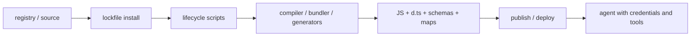
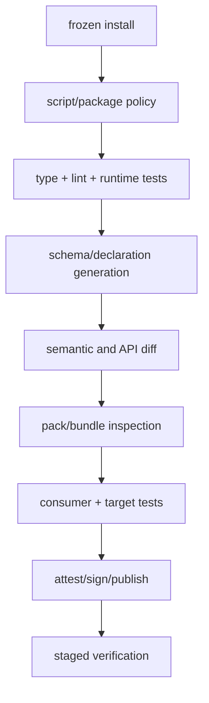

# Supply Chain and Release Engineering

> **Last researched:** 2026-08-31  
> **Runtime boundary:** This guide covers TypeScript/npm build inputs and published artifacts. Runtime secret delivery, process isolation, filesystem permissions, network egress, and incident operation belong in the [security](../../security/README.md), [operations](../../operations/README.md), and [Node.js runtime](../typescript-node-agent-runtimes.md) guides.

Agent services combine high-authority credentials, provider SDKs, validators, build tools, and tool integrations. A compromised development dependency can change emitted JavaScript, declarations, or JSON Schema even if it is absent from the production install. Treat the full build graph and generated output as part of the production supply chain.

## Threat model the whole path



Important attack or failure paths include:

- dependency takeover, typosquatting, or compromised maintainer credentials;
- lifecycle scripts executing during install;
- compiler, bundler, transformer, or schema generator modifying output;
- lockfile drift or non-reproducible dependency resolution;
- provider SDK update changing runtime or static behavior;
- source maps, tarballs, fixtures, or declaration comments leaking sensitive data;
- provenance that proves who built an artifact but not whether its content is safe;
- a valid package signature attached to a malicious or vulnerable package.

Controls must cover source, resolution, installation, build, review, publication, and deployment.

## Classify dependencies by production effect

Maintain an inventory that distinguishes:

| Class | Examples | Review focus |
|---|---|---|
| Runtime | provider SDK, validator, protocol client | Network behavior, transitive code, credentials, compatibility |
| Build-time | TypeScript, bundler, declaration/schema generator | Ability to alter every shipped artifact |
| Test/lint | test runner, typed linter | Install-time code and CI access even if not deployed |
| Peer/plugin | shared schema/framework contracts | Version range and runtime identity |
| Optional/native | platform accelerators, native packages | Install scripts, binary provenance, fallback behavior |

“Dev dependency” does not mean low risk. CI often has registry credentials, signing identity, source access, and permission to publish.

Remove unused packages and avoid duplicate tools with overlapping responsibility. Fewer packages reduce update and audit surface, but do not replace review of the remaining critical packages.

## Make installation deterministic and constrained

For npm-based CI, `npm ci` installs from the lockfile, fails when it disagrees with `package.json`, and does not rewrite the lock. Use the package manager's equivalent frozen mode when not using npm. Pin the package-manager version and commit the lockfile.

Lifecycle scripts execute dependency-controlled code. npm's current script controls include allowlisting mechanisms; environments can also ignore scripts. Choose an explicit policy:

1. default-deny or ignore scripts in high-assurance build lanes where the dependency set supports it;
2. allow only reviewed packages whose installation genuinely requires scripts;
3. build native artifacts in a restricted environment;
4. record exceptions with owner, reason, version range, and review date;
5. retest whenever a package adds or changes lifecycle scripts.

Do not blindly set `ignore-scripts` if required packages then produce incomplete or different artifacts. Detect and document the difference; the goal is controlled execution, not a checkbox.

For npm versions that support project `allowScripts`, keep reviewed approvals in `package.json`, prefer version-pinned approvals, and enable the strict mode that fails on unreviewed scripts. The command-line `--allow-scripts` path is intended for one-off/global contexts rather than project-scoped `install`/`ci`. Pin the npm CLI because enforcement defaults and command names have evolved across npm lines. Also remember that `ignore-scripts` does not mean “no package script can ever run”: an explicitly requested `npm run <name>` still runs that script, though pre/post hooks are suppressed. Test the policy with a dependency that has a known harmless install script so a misconfigured CI lane cannot pass silently.

An approval is for exact reviewed behavior, not a permanent package-name exemption. Re-review when the resolved version, integrity, lifecycle command, downloaded binary, platform selector, or transitive script owner changes. Keep the build identity/network credentials unavailable to install steps unless that step genuinely needs them.

Registry configuration is also code. Scope private packages, require authenticated publishing, avoid ambiguous registries, and never commit tokens. Restrict CI network and credentials to the stage that needs them.

## Review updates as behavior migrations

Automated dependency updates are inputs to review, not proof of safety. For TypeScript agent dependencies:

- inspect direct and material transitive changelogs;
- compare lifecycle scripts and packaged files;
- diff lockfile resolution, integrity, and registry source;
- run compiler/type-test/declaration diffs;
- regenerate schemas and review semantic changes;
- run provider adapter fixtures and staged live contract tests;
- inspect bundle size and new runtime imports;
- verify minimum runtime and TypeScript requirements;
- rebuild from the clean lockfile.

OpenAI's official Node SDK notes that some static type changes may arrive in minor versions. Generated SDKs can also rename or reshape types after API-spec updates. A “compatible” SemVer range does not eliminate the need for compile and adapter gates.

Update one high-impact toolchain component at a time when practical. Simultaneously changing the compiler, bundler, SDK, and schema library makes diagnosis and rollback unnecessarily hard.

Write a short migration record for every high-impact compiler, validator, provider/MCP SDK, telemetry SDK, bundler, or schema generator update:

| Record | Required content |
|---|---|
| Before/after | Exact direct and material transitive versions, registry/integrity, runtime and TypeScript requirements |
| Contract impact | Public declarations, provider events/errors, schema projection, emitted JS/maps, telemetry attributes |
| Evidence | Type/API diff, accept/reject fixtures, adapter streams, packed consumers, target artifacts, bounded live smoke |
| Rollout | Cohort/feature boundary, dashboards and abort thresholds, owner and observation window |
| Rollback | Previous immutable artifact; readers for every schema/event version already emitted |

Do not promote on “unit tests green” when the changed dependency controls wire parsing, provider calls, code generation, or instrumentation. For telemetry SDK changes, test disabled/exporter-failure behavior and span/metric cardinality so observability cannot become an availability or cost regression.

## Treat TypeScript 7 as a two-toolchain transition

As of the research date, TypeScript 7.0.2 provides the stable native CLI/language service but not the programmatic compiler API. TypeScript 6.0.3 remains the compatibility compiler for tools that require that API; the official wrapper package is currently `@typescript/typescript6@6.0.2`, which resolves the 6.0.3 compiler.

A controlled build records and locks both roles:

```text
diagnostic/build CLI: TypeScript 7 native package/version
compiler API tools:   TypeScript 6 compatibility alias/version
transformer/bundler:  exact independent version
declaration/schema:   exact generator and mode
```

Do not let dependency resolution accidentally select which compiler implementation a plugin uses. Invoke the intended binary/package explicitly. Compare diagnostics, declarations, and artifact behavior before retiring the TypeScript 6 lane after native API support becomes available.

## Generated artifacts require review

Generated `.d.ts`, JSON Schema, API clients, and bundles can hide material changes:

- schema constraint dropped because a validator type is unrepresentable;
- input/output mode switched, changing defaults or transformed types;
- provider enum expanded but normalization remains exhaustive without `unknown`;
- declaration export now references a private or missing module;
- bundled dependency adds dynamic code execution or a Node-only built-in;
- source map embeds the source tree.

Generate artifacts deterministically in CI, compare them with the approved baseline, and fail on unexplained drift. A text diff alone is insufficient for JSON Schema; run accept/reject parity fixtures as well.

Never run a schema supplied by an untrusted tenant through a code-generating validator in the privileged agent process. Ajv documents schemas as trusted code and warns that malicious schemas can cause resource exhaustion. If user-defined schemas are a product requirement, apply separate size/complexity limits and isolation.

## Provenance, signatures, and attestations

npm supports package provenance and registry signatures. Use them where available to strengthen origin and build-chain evidence. Understand their limits:

- provenance can link a package to a source repository and build workflow;
- signatures/integrity can show that the fetched bytes match what was published;
- neither proves maintainers, source, workflow, dependencies, or behavior are benign;
- neither replaces vulnerability analysis, code review, permission boundaries, or artifact tests.

For your own releases, prefer a hosted build with short-lived identity, protected source refs, reproducible commands, and attestations tied to the exact artifact digest. Separate build and publish permissions where practical.

Maintain an SBOM or equivalent dependency inventory for deployed artifacts, including bundled dependencies that are no longer visible as separate production packages. Retain build manifests and lockfiles for incident reconstruction.

## Inspect before publishing or deploying

For npm packages:

- run `npm pack --dry-run` and inspect the exact file list;
- build a tarball and test it in an empty consumer project;
- exclude source maps/sources unless publication is intentional;
- reject credentials, `.env`, recordings, customer fixtures, coverage, caches, and editor files;
- verify `exports`, declarations, licenses, repository metadata, and minimum engines;
- verify install has no unexpected network or lifecycle behavior;
- publish from the protected artifact, not a developer's mutable workspace.

For private deployment bundles, perform the same inventory. “Not on npm” does not make accidental content harmless.

## Release gates for agent packages



Promotion should be by immutable artifact digest. Rebuilding at each environment can resolve or generate different output.

Version four surfaces deliberately:

1. package public types;
2. runtime JavaScript behavior;
3. wire/schema contracts;
4. deployment configuration and provider/model capabilities.

A schema breaking change may require a new wire version even if the package stays internal. A declaration-only breaking change still matters to external TypeScript consumers.

## Rollback and incident readiness

Keep enough evidence to answer:

- Which dependency and compiler versions produced the running artifact?
- Which SDK and schema projector generated the provider request?
- Which schema digest validated a stored event?
- Which source revision and source map correspond to the stack?
- Did the install execute lifecycle scripts?
- Which package files and licenses were deployed?

Rollback to a previously tested immutable artifact; do not repair an incident by editing the lockfile directly on a host. If a wire-format writer has already emitted a new version, an application rollback must retain a reader for that version. Release and contract rollback plans must be coordinated.

When a package compromise is suspected, rotate credentials available to affected build/runtime stages, revoke publishing tokens and attestations where supported, preserve evidence, rebuild from a known-good graph, and verify downstream artifacts. The exact incident procedure belongs in the repository's security/operations area.

## Anti-patterns

| Anti-pattern | Why it fails | Replacement |
|---|---|---|
| `npm install` without enforcing the lockfile in CI | Resolution can drift | Frozen clean install |
| Trust every install script | Dependency code executes before tests | Default-deny/allowlist policy and restricted build |
| “Dev dependencies never reach production” | Build tools determine production bytes | Treat build graph as production-critical |
| Auto-merge SDK updates after unit tests | Type and protocol behavior can change | Compile, adapter, artifact, and staged gates |
| Provenance badge treated as security review | Origin is not safety | Combine provenance with review and isolation |
| Publish from a developer workspace | Dirty/untracked files and local state can leak | Protected clean artifact publication |
| Text-only schema snapshot | Misses semantic drift | Validator parity and contract fixtures |
| Rebuild separately in each environment | Output can differ | Promote immutable digests |

## Review checklist

- [ ] The lockfile and package-manager version are enforced in clean CI.
- [ ] Lifecycle scripts are disabled or explicitly allowlisted and reviewed.
- [ ] Package-manager version and script-policy behavior are pinned and exercised by a CI policy fixture.
- [ ] Runtime, build, test, peer, and optional dependencies have owners and purpose.
- [ ] SDK/compiler/validator upgrades run type, behavior, schema, package, and target gates.
- [ ] Generated declarations, schemas, maps, and bundles are inspected for drift and disclosure.
- [ ] Packed/deployed file inventories exclude sensitive or unnecessary content.
- [ ] Provenance/signatures supplement rather than replace review and isolation.
- [ ] SBOM/build manifest identifies exact source, lockfile, tools, schemas, and artifact digest.
- [ ] Rollback preserves readers for any wire versions already written.
- [ ] High-impact dependency updates have a before/after evidence record, staged abort thresholds, and immutable rollback artifact.

## Primary sources

- [npm `ci`](https://docs.npmjs.com/cli/commands/npm-ci/)
- [npm audit signatures](https://docs.npmjs.com/cli/v11/commands/npm-audit/)
- [npm package provenance](https://docs.npmjs.com/viewing-package-provenance/)
- [npm install-script allowlist and strict policy](https://docs.npmjs.com/cli/install/)
- [npm install-script approval management](https://docs.npmjs.com/cli/v11/commands/npm-install-scripts/)
- [Ajv security considerations](https://ajv.js.org/security.html)
- [OpenAI Node SDK compatibility policy](https://github.com/openai/openai-node)
- [Announcing TypeScript 7.0](https://devblogs.microsoft.com/typescript/announcing-typescript-7-0/)
- [Announcing TypeScript 6.0](https://devblogs.microsoft.com/typescript/announcing-typescript-6-0/)
