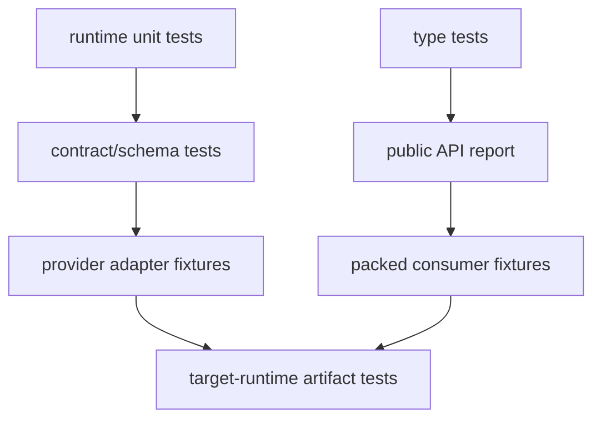

# Testing Types and Compatibility

> **Last researched:** 2026-08-31  
> **Runtime boundary:** Runtime stress, load, shutdown, backpressure, worker, and event-loop testing belongs in [TypeScript and Node.js agent runtimes](../typescript-node-agent-runtimes.md). This guide covers type, schema, package, adapter, and artifact compatibility.

Agent correctness spans more than executable unit tests. Type relationships can regress while runtime tests pass; a schema can drift while compilation passes; declarations can work from source and fail from the packed package; an adapter can compile while mishandling a new provider event.

## Build an evidence matrix



| Evidence | Finds | Does not prove |
|---|---|---|
| `tsc --noEmit` | Source type errors for one configuration | Runtime input validity or package correctness |
| Type tests | Intended inference and rejected calls | Runtime behavior |
| Validator tests | Accept/reject semantics | Public TypeScript ergonomics |
| API/declaration report | Public type-surface changes | Runtime or wire compatibility |
| Adapter fixtures | Provider mapping and stream invariants | Live provider behavior |
| Packed consumer | Exports/declarations/resolution | Every deployment host capability |
| Artifact runtime test | Actual built behavior on a target | Other targets or old stored data |

No single row replaces the others.

## Test positive and negative type behavior

Type tests should assert what users can write and what must be rejected. Use a dedicated library such as `tsd`, or Vitest's `expectTypeOf`/type-testing mode if the repository already uses Vitest.

```ts
import { expectTypeOf } from "vitest";

declare const result: Awaited<ReturnType<typeof prepareToolCall>>;

if (result.ok) {
  expectTypeOf(result.value.stage).toEqualTypeOf<"authorized">();
} else {
  expectTypeOf(result.error.code).toMatchTypeOf<
    "invalid_arguments" | "unknown_tool" | "policy_denied" | "unsupported_capability"
  >();
}
```

For a small local negative assertion, `@ts-expect-error` is preferable to `@ts-ignore` because it reports when no error occurs:

```ts
// @ts-expect-error raw proposals cannot be executed
await execute(proposedCall, context);
```

But a bare `@ts-expect-error` cannot assert which diagnostic occurred. A typo on the same line can satisfy it. Keep the expression tiny, explain the expected failure, and use a diagnostic-aware type-test tool for critical public APIs.

Test inference at consumer call sites, not only aliases inside the implementation. Useful cases include:

- tool name preserves its correlated input/output type;
- exhaustive switches fail after an unhandled variant is introduced;
- proposed calls cannot reach authorized executors;
- branded identifiers cannot be mixed accidentally;
- readonly contracts reject mutation;
- public functions do not expose SDK or internal module types;
- valid JavaScript consumers still receive useful declarations where supported.

## Run more than one compiler/configuration when compatibility requires it

For a published package, test the documented minimum supported TypeScript version and the release compiler. During the TypeScript 7 transition, also test API-dependent tooling on the pinned TypeScript 6 compatibility package. Do not promise a compiler range you do not exercise.

Use distinct configurations for Node, bundler, worker, or other supported consumers. A declaration can resolve under `bundler` and fail under `nodenext`. Keep `skipLibCheck: false` in the public declaration gate.

Compiler matrices are costly. Limit them to supported boundaries:

- library packages: minimum and current supported TypeScript plus supported resolvers;
- applications: exact pinned compiler and every deployment target config;
- tooling using compiler APIs: exact API version, plus a planned TS 7 native-API migration lane when available.

## Test schemas as executable contracts

For every boundary schema, keep valid, invalid, and boundary-value fixtures. Cover:

- missing versus explicit `undefined` where relevant before JSON serialization;
- unknown keys;
- empty, maximum-length, and over-limit strings/arrays;
- numbers at integer, precision, and range limits;
- recursive depth and total input-size limits;
- invalid discriminants and contradictory state fields;
- transformations/defaults in input versus output mode;
- version identifiers and migrations;
- objects produced by `JSON.parse`, not only hand-typed literals.

Property-based tests can generate invalid combinations and migration histories, but generators must be bounded. They supplement curated security and business cases.

For generated JSON Schema:

1. validate canonical fixtures with the source validator;
2. validate the same fixtures with the target JSON Schema engine/provider-compatible validator;
3. compare accept/reject behavior, not only serialized schema snapshots;
4. require an explicit allowlist for known projection losses;
5. test input/output modes separately.

Provider acceptance of a schema is not proof that all returned output conforms. Revalidate locally and include malformed provider-output fixtures.

## Test event history, not just individual events

State reducers need sequence tests:

- start → model → tool authorization → tool outcome → terminal;
- refusal, truncation, cancellation, and provider failure;
- duplicate event ID;
- sequence gap and reordering;
- duplicate/missing terminal event;
- event after terminal state;
- current and every retained old version through upcasters;
- retry/replay of an effect request with the same idempotency key.

Assert invariant outcomes, not implementation call order. A replay test should reduce stored fixtures with no network, clock, random, model, or current configuration dependency.

## Test provider adapters with adversarial streams

Recorded or constructed fixtures should include:

- one JSON token split across multiple fragments and UTF-8 boundaries;
- interleaved parallel tool calls;
- name and identifier arriving later than arguments;
- unknown provider event or finish reason;
- usage before/after the terminal response;
- connection ending without a terminal event;
- duplicate terminal event;
- refusal/content filtering and partial text;
- oversized arguments and invalid JSON;
- an SDK object that structurally differs from its installed declaration.

Assert the app-owned event sequence. Keep SDK-specific fixtures inside the adapter package and redact real traffic.

## Test the package consumers receive

Source tests under a workspace can resolve files that are absent from the tarball. A release gate should:

1. build and create the package tarball;
2. install it in an empty consumer fixture using only public package specifiers;
3. type-check under supported module resolvers and minimum/current TypeScript;
4. run ESM and CommonJS entry points only if each is advertised;
5. verify subpath exports and deliberate rejection of private deep imports;
6. run declaration-resolution analysis such as AreTheTypesWrong;
7. inspect package contents and licenses.

Keep fixtures tiny. One import and one representative call per entry point usually catches more packaging defects than another large implementation test.

Make the matrix explicit rather than saying “consumer tested”:

| Fixture | Installs | Type-checks with | Executes with | Must also prove |
|---|---|---|---|---|
| `consumer-node-esm` | release tarball only | minimum/current TS, `nodenext` | minimum/current Node | public ESM and subpaths load |
| `consumer-bundler` | same tarball | supported TS, `bundler` | chosen bundler smoke | declarations do not depend on Node-only globals |
| `consumer-node-cjs` | same tarball, **only if advertised** | supported TS, `nodenext` | `require()` on supported Node | CJS and types describe the same exports |
| `consumer-worker` | same tarball or deployment bundle | generated worker types/config | local isolate and deployed smoke | used operations do not hit Node compatibility stubs |

Every fixture must have no workspace link, source alias, repository-root `node_modules`, or import from `src`/`dist`. Install the newly created tarball by exact path, import only documented specifiers, and assert that a representative private deep import fails. A practical release sequence is `pack → install fixture → type-check → execute → inspect files`; do not run the fixture against the workspace and pack afterward.

For each advertised entry point, exercise at least one value import and one public type. Runtime-only tests miss broken declarations; type-only tests miss missing JavaScript. If the package exports schemas, validate a golden payload from the packed schema entry point as well.

Artifact tests should also assert negative capability. An ESM-only package should fail a CommonJS support claim rather than accidentally work on one machine; an edge entry point should not expose a Node-only subpath; an optional adapter should fail with the documented capability error when its peer is absent.

## Type-aware linting is a correctness layer

Use typescript-eslint typed linting for defects the compiler intentionally permits. High-value rules for agent code include:

- `no-floating-promises` for lost asynchronous work;
- `no-misused-promises` for promises passed where synchronous callbacks are expected;
- `use-unknown-in-catch-callback-variable` for rejection reasons;
- unsafe assignment/member/call rules around `any` boundaries;
- switch exhaustiveness checks where an explicit unknown/default strategy is not required.

Typed linting consumes resources and must use the intended project configuration. Avoid enabling a huge preset without triage; select rules whose failure modes matter, establish a baseline, and prevent new violations.

## Compatibility decision table

| Change | Required tests |
|---|---|
| Add domain union variant | Exhaustive consumer type tests, old-reader behavior |
| Change schema/default/transform | Canonical and projection behavior fixtures, migration/golden tests |
| Upgrade provider SDK | Compile fixture, request mapping, adversarial streams, error mapping, staged live smoke |
| Change export map/build | Packed consumers for every resolver/runtime condition |
| Upgrade TypeScript | Diagnostics/type-test diff, declarations/API report, transformer and tooling compatibility |
| Add runtime target | Target-specific config, artifact execution, capability and failure tests |
| Change persisted event | Read-old/write-new fixtures and complete history replay |
| Change telemetry SDK/semantic convention | Attribute-name/cardinality/redaction fixtures, trace correlation, exporter-disabled behavior |

## Avoid brittle type tests

- Assert useful assignability or call behavior, not compiler display formatting.
- Do not snapshot entire inferred SDK types.
- Avoid depending on union member order; TypeScript 7 even adds stable type-ordering work because ordering affects tooling output.
- Keep negative examples on one expression.
- Test public entry points instead of internal source paths.
- Separate intended breaking changes from incidental diagnostic wording changes.

## Release checklist

- [ ] Exact application configs pass with no unchecked type errors.
- [ ] Public packages pass minimum/current compiler and resolver fixtures.
- [ ] Positive and negative type tests cover trust-stage and registry correlations.
- [ ] Runtime schemas cover malformed, oversized, unknown-key, and version cases.
- [ ] Generated/provider schemas are tested for semantic parity.
- [ ] Event histories cover duplicates, gaps, replay, migration, and terminal invariants.
- [ ] Adapters handle fragmented, unknown, malformed, and incomplete streams.
- [ ] Type-aware lint catches floating promises and unsafe `any` flows.
- [ ] Packed artifacts, not workspace source, pass consumer and target-runtime tests.
- [ ] Consumer fixtures have no workspace/source escape hatch and cover both value and type imports.
- [ ] Unsupported entry points and unavailable optional capabilities fail in the documented way.

## Primary sources

- [TypeScript 3.9: `@ts-expect-error`](https://www.typescriptlang.org/docs/handbook/release-notes/typescript-3-9.html)
- [TypeScript project references](https://www.typescriptlang.org/docs/handbook/project-references)
- [tsd type-test library](https://github.com/tsdjs/tsd)
- [Vitest testing types](https://vitest.dev/guide/testing-types)
- [typescript-eslint typed linting](https://typescript-eslint.io/getting-started/typed-linting/)
- [`no-floating-promises` rule](https://typescript-eslint.io/rules/no-floating-promises/)
- [AreTheTypesWrong](https://github.com/arethetypeswrong/arethetypeswrong.github.io)
- [Zod JSON Schema conversion](https://zod.dev/json-schema)
- [Ajv strict mode](https://ajv.js.org/strict-mode.html)
