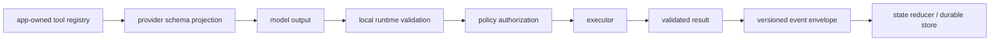

# Tools, Events, and Versioned Contracts

> **Last researched:** 2026-08-31  
> **Runtime boundary:** This guide defines the TypeScript and wire contracts. Scheduling, durable delivery, cancellation, backpressure, and process recovery belong in [TypeScript and Node.js agent runtimes](../typescript-node-agent-runtimes.md) and the [runtime guides](../../runtime/README.md).

Agent systems fail when one object is asked to be four different things: an LLM-facing tool description, an authorization request, an executor input, and a durable event. Keep those contracts related, but separate. A model-generated object is proposed data, not an executable command.

## Contract graph



The registry is the application authority. Provider schemas are lossy projections. The local validator is the enforcement point. Authorization happens after validation because policy code must never reason over malformed input.

## Define tools once, without coupling policy to schema

This example uses Zod because it can provide both executable validators and JSON Schema. The architecture also works with another [Standard Schema](https://standardschema.dev/)-compatible library or a JSON-Schema-first system.

```ts
import { z } from "zod";

const lookupInput = z.object({
  query: z.string().min(1).max(1_000),
  limit: z.number().int().min(1).max(20).default(5),
}).strict();

const lookupOutput = z.object({
  documents: z.array(z.object({
    id: z.string(),
    title: z.string(),
    excerpt: z.string(),
  }).strict()).max(20),
}).strict();

type ToolDefinition<I extends z.ZodType, O extends z.ZodType> = Readonly<{
  description: string;
  input: I;
  output: O;
  risk: "read" | "write" | "external_side_effect";
}>;

export const tools = {
  lookup: {
    description: "Search the approved document index",
    input: lookupInput,
    output: lookupOutput,
    risk: "read",
  },
} as const satisfies Record<string, ToolDefinition<z.ZodType, z.ZodType>>;

export type ToolName = keyof typeof tools;
```

The schema describes shape. `risk` supplies policy metadata. Neither grants permission. Credentials, tenant identity, rate limits, confirmation rules, and allowed resources come from authenticated execution context, never from model arguments.

Keep provider-only fields out of the canonical definition. Generate a provider projection that records unsupported keywords, rejected schema features, and any description or enum limits. If a projection must weaken a constraint, local validation still applies the canonical constraint.

## Stage tool calls as different types

Do not mutate one `ToolCall` from “raw” to “safe.” Make illegal transitions difficult to express.

```ts
type ProposedCall = Readonly<{
  stage: "proposed";
  providerCallId: string;
  name: string;
  rawArguments: unknown;
}>;

type ValidatedCall<N extends ToolName = ToolName> = Readonly<{
  stage: "validated";
  providerCallId: string;
  name: N;
  arguments: z.output<(typeof tools)[N]["input"]>;
}>;

type AuthorizedCall<N extends ToolName = ToolName> = Readonly<{
  stage: "authorized";
  requestId: string;
  call: ValidatedCall<N>;
  authorizationId: string;
}>;
```

Construction functions should be the only path into `ValidatedCall` and `AuthorizedCall`. Types then reflect a real runtime proof rather than a cast. Never “advance” a call with `as AuthorizedCall`.

## Correlate names, inputs, and outputs

A small registry-indexed helper preserves the correlation at execution time:

```ts
type InputOf<N extends ToolName> = z.output<(typeof tools)[N]["input"]>;
type OutputOf<N extends ToolName> = z.output<(typeof tools)[N]["output"]>;

type Executors = {
  [N in ToolName]: (
    input: InputOf<N>,
    context: ExecutionContext,
  ) => Promise<OutputOf<N>>;
};

async function execute<N extends ToolName>(
  name: N,
  input: InputOf<N>,
  context: ExecutionContext,
): Promise<OutputOf<N>> {
  const value = await executors[name](input as never, context);
  return tools[name].output.parse(value) as OutputOf<N>;
}
```

The localized assertion works around a limitation in correlated indexed access. It is acceptable only if tests exercise every registry entry and all construction happens through this function. Avoid exporting a deeply generic abstraction merely to eliminate one audited assertion; a generated switch can be clearer for a small registry.

Validate tool results too. Executors can drift, downstream APIs can return malformed data, and oversized outputs can exhaust a model context. Validate, bound, redact, and then serialize.

## Separate event, state, effect, and telemetry

These concepts have different compatibility and retention rules:

| Contract | Meaning | Typical compatibility requirement |
|---|---|---|
| Event | Durable fact that already happened | Old events must remain readable |
| State/checkpoint | Current resumable snapshot | Readers need a migration path |
| Effect request | Intent to interact with the outside world | Must carry idempotency and authorization context |
| Telemetry | Operational observation | May evolve faster; must not be replay authority |
| Provider event | Foreign SDK/protocol representation | Normalize at adapter boundary; do not persist as domain authority |

```ts
type RunEvent =
  | { type: "run.started"; runId: string; createdAt: string }
  | { type: "model.completed"; runId: string; usage: TokenUsage }
  | { type: "tool.authorized"; runId: string; requestId: string; tool: ToolName }
  | { type: "tool.succeeded"; runId: string; requestId: string; result: unknown }
  | { type: "tool.failed"; runId: string; requestId: string; error: SerializedFailure }
  | { type: "run.completed"; runId: string }
  | { type: "run.failed"; runId: string; error: SerializedFailure };

type EventEnvelope<E extends RunEvent = RunEvent> = Readonly<{
  schema: "agent.run-event";
  version: 2;
  eventId: string;
  aggregateId: string;
  sequence: number;
  occurredAt: string;
  correlationId: string;
  causationId?: string;
  event: E;
}>;
```

Validate the envelope and payload at ingress. A TypeScript generic does not validate either. Use stable, language-neutral field types on the wire: strings for timestamps and identifiers, JSON numbers only where range and precision are safe, and explicit encodings for binary or large integers.

### Make effect ambiguity explicit

An event says what the application knows happened; an effect request asks another system to act. A network timeout after submission does **not** prove the effect failed. Preserve enough identity to reconcile instead of retrying blindly:

```ts
type EffectRequestV1 = Readonly<{
  schema: "agent.effect-request";
  version: 1;
  effectId: string;          // stable logical effect identity
  runId: string;
  toolCallId: string;
  idempotencyKey: string;
  authorizationId: string;   // decision reference, never a credential
  tool: ToolName;
  input: JsonValue;
  requestedAt: string;
}>;

type EffectReceiptV1 = Readonly<{
  schema: "agent.effect-receipt";
  version: 1;
  effectId: string;
  attemptId: string;
  observedAt: string;
}> & (
  | { outcome: "committed"; externalRef?: string; output: JsonValue }
  | { outcome: "rejected"; failure: SerializedFailure }
  | { outcome: "unknown"; reason: "timeout" | "connection_lost" | "worker_lost" }
);
```

Only `committed` is evidence that the external effect succeeded, and only an authoritative rejection is evidence that it did not. `unknown` must enter a workload-specific reconciliation path using `effectId`, `idempotencyKey`, and any provider request ID. Do not encode secrets, mutable policy documents, or whole SDK objects in the request. Validate both request and receipt with executable version-specific schemas; the types above only show the relationship.

## Version the wire format, not every internal type

Add an explicit schema name and integer version to every durable or independently deployed contract. Do not infer version from package version, deployment date, or TypeScript interface name.

Use additive change only when old readers can safely ignore the field and new readers can supply a well-defined default. Renaming a field, changing semantics, tightening a previously accepted value, or changing units is a breaking wire change even if TypeScript compilation succeeds.

```ts
type PersistedEvent = EventV1 | EventV2;

function toCurrent(event: PersistedEvent): EventV2 {
  switch (event.version) {
    case 1:
      return upgradeV1ToV2(event);
    case 2:
      return event;
    default:
      return assertNever(event);
  }
}
```

Prefer read-old/write-new:

1. deploy readers that accept old and new;
2. begin writing the new version;
3. backfill only if operationally necessary;
4. remove old readers after retained old data and rollback windows expire.

Keep migrations pure and deterministic. An upcaster must not call a model, fetch current configuration, or depend on wall-clock time. Preserve the original bytes or event identity for audit when legally and operationally appropriate.

## Ordering, duplication, and terminal invariants

Type definitions cannot guarantee delivery properties, but they can force required evidence to be present:

- `eventId` supports deduplication;
- `sequence` detects gaps and reordering within an aggregate;
- `requestId` correlates an effect request with exactly one logical outcome;
- `correlationId` ties a run together;
- `causationId` records the prior event or command;
- an idempotency key belongs in the effect contract, not hidden inside an executor closure.

Reducers should define behavior for duplicate events, missing predecessors, unknown versions, and events after a terminal state. Rejecting an impossible history is usually safer than silently producing a plausible state.

```ts
function reduce(state: RunState, envelope: EventEnvelope): RunState {
  if (envelope.sequence !== state.sequence + 1) {
    throw new ContractViolation("event sequence gap");
  }
  if (state.status === "completed" || state.status === "failed") {
    throw new ContractViolation("event after terminal state");
  }
  return applyKnownEvent(state, envelope.event, envelope.sequence);
}
```

The storage transaction and concurrency control that make this reliable are runtime concerns; see the linked runtime material.

## Compatibility tests are part of the contract

For each durable version, keep:

- canonical valid fixtures;
- malformed and boundary fixtures;
- a decode → normalize → encode golden test;
- upcaster tests from every supported version;
- tests for unknown event types and versions;
- replay tests covering duplicates, gaps, reordering, and terminal events;
- a consumer test built from the published package and declaration files;
- JSON Schema compatibility checks for provider projections.

Never snapshot only generated JSON Schema text. Also test runtime accept/reject behavior, because keyword order and harmless generator output can change while semantics remain stable—and semantics can change while a diff looks small.

Use an explicit producer/consumer matrix before changing a contract:

| Direction | Required result during read-old/write-new rollout |
|---|---|
| old event → new reader | Decodes and upcasts deterministically |
| new event → old reader | Not relied upon until old readers are drained; otherwise the change is not rollout-safe |
| old effect request → new executor | Preserves logical effect and idempotency identity |
| new receipt → rollback reader | Remains readable for the full rollback window |
| TypeScript package N → non-TypeScript validator | Agrees on golden JSON fixtures and schema ID/version |

Record the oldest readable and newest writable version per deployed component. Package SemVer is useful for code distribution but must not substitute for these wire compatibility facts.

## Failure matrix

| Failure | Defensive contract design |
|---|---|
| Model invents a tool name | Treat name as string until registry lookup succeeds |
| Provider accepts weaker schema | Canonical local validation after provider output |
| Executor returns malformed result | Output schema before persistence or model submission |
| SDK event shape changes | Provider adapter normalizes `unknown` to app-owned events |
| Old event cannot be read | Explicit version, retained schema, deterministic upcaster |
| Duplicate side effect | Request ID plus executor idempotency contract |
| Event stream has two terminal events | Reducer invariant and history test |
| Type refactor changes persisted JSON | Golden wire fixtures independent of TypeScript names |

## Review checklist

- [ ] Raw model output starts as `unknown`.
- [ ] Tool name lookup, input validation, policy authorization, and execution are distinct stages.
- [ ] Canonical schemas are validated locally even when the provider validates them.
- [ ] Tool results are bounded and validated.
- [ ] Durable envelopes have a stable schema name and explicit version.
- [ ] Effect requests and receipts preserve effect, attempt, idempotency, authorization-decision, and ambiguous-outcome identity.
- [ ] Events, state, effects, telemetry, and provider events are not conflated.
- [ ] Migrations are pure, deterministic, and tested from every supported version.
- [ ] Duplicate, reordered, missing, unknown, and post-terminal events have defined behavior.
- [ ] Wire fixtures and runtime validators, not interfaces alone, define compatibility.

## Primary sources

- [TypeScript narrowing and exhaustive `never` checks](https://www.typescriptlang.org/docs/handbook/2/narrowing.html)
- [TypeScript type compatibility and intentional unsoundness](https://www.typescriptlang.org/docs/handbook/type-compatibility.html)
- [Zod JSON Schema conversion and unrepresentable types](https://zod.dev/json-schema)
- [JSON Schema Draft 2020-12 validation specification](https://json-schema.org/draft/2020-12/json-schema-validation)
- [Model Context Protocol TypeScript SDK v2 schema libraries](https://ts.sdk.modelcontextprotocol.io/v2/advanced/schema-libraries)
- [Model Context Protocol TypeScript SDK v2 migration guide](https://ts.sdk.modelcontextprotocol.io/v2/migration/upgrade-to-v2)
