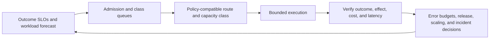

# Production Operations, Cost, and Performance

> **Status:** Research-backed core available.  
> **Research baseline:** 2026-08-30  
> **Evidence:** [Production operations and architectures packet](../research/packets/production-operations-and-architectures.md)

Operate an agent as a service that consumes variable model, tool, compute, state, and human capacity while producing stochastic outcomes and potentially irreversible effects. The guides here join those concerns into admission, routing, SLO, release, and incident policy.

## Guides

| Guide | Core decision |
|---|---|
| [Queues, scheduling, and backpressure](queues-scheduling-and-backpressure.md) | How to admit, prioritize, retry, shed, and drain agent work without hiding overload |
| [Model routing, cost, and latency](model-routing-cost-and-latency.md) | How to choose models and service classes by policy, measured quality, deadline, and total outcome cost |
| [Scaling, capacity, and SLOs](scaling-capacity-and-slos.md) | How to model multidimensional demand, isolate tenants, and measure useful task outcomes |
| [Deployment, release, and incident response](deployment-release-and-incident-response.md) | How to version the behavioral bundle, canary it, roll it back, and contain incidents and ambiguous effects |

## Operational control loop

The central rule is that retries, quality repair, evaluation, and reconciliation are part of workload demand. Capacity is not just worker replicas, and success is not just an HTTP response.

## Stable production position

- Bound admission before the queue and keep interactive, background, effectful, and recovery classes distinct.
- Measure oldest work, drain time, successful throughput, and retry amplification—not queue depth alone.
- Optimize cost per verified outcome under a task/risk quality floor.
- Propagate absolute deadlines and assign one retry owner per call chain.
- Define task-level SLOs for deadline completion, verified quality, safe effects, and continuity.
- Release models, prompts, tools, policy, routes, memory, evaluators, and runtime configuration as a versioned bundle.
- Preserve independent kill switches, last-known-good configuration, and an effect-reconciliation path.

## Remaining research queue

- Tool discovery, ranking, lazy loading, schema evolution, and registry fleet operations.
- Disaster recovery and regional failover with data-residency and active-run semantics.
- Workload-specific cost models for coding, browser, research, and support agents.
- Cross-provider experiments for prompt caching, service tiers, routing, and quota behavior.
- Human review/approval capacity design and operations in high-impact domains.
