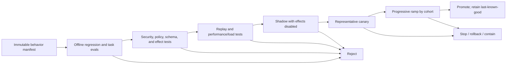
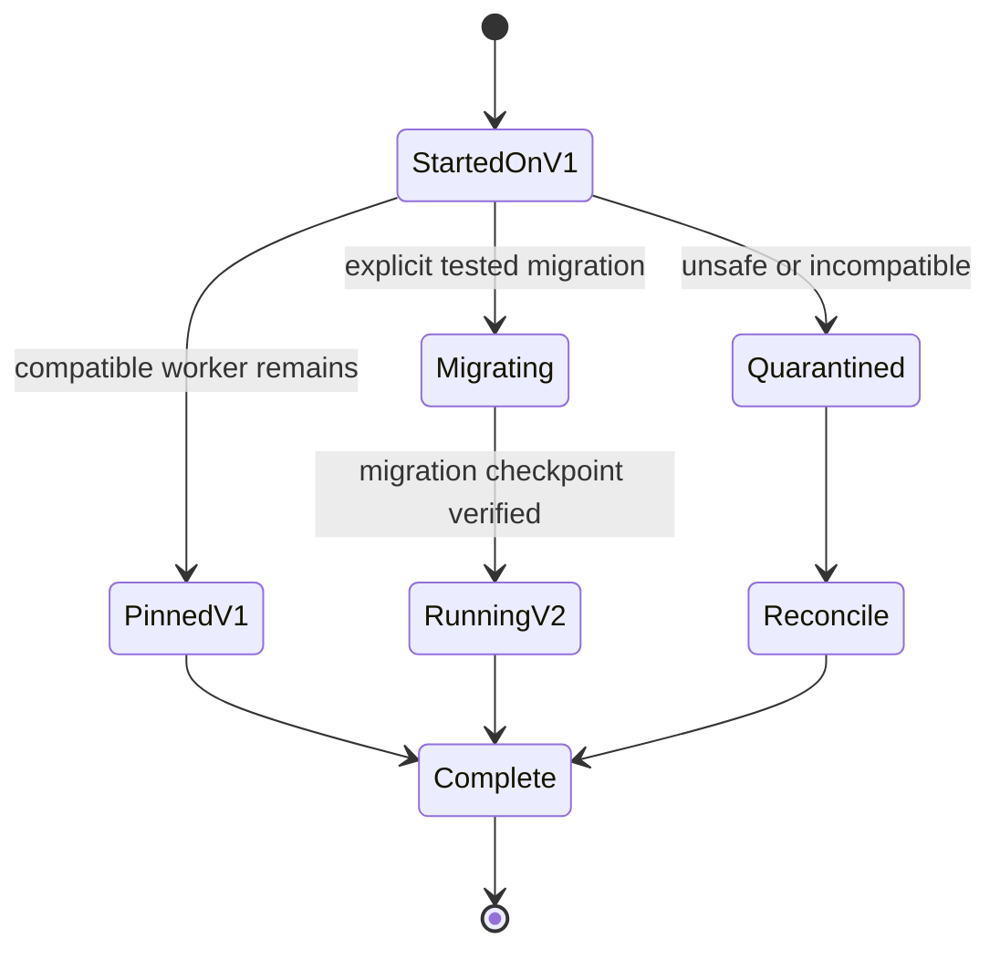
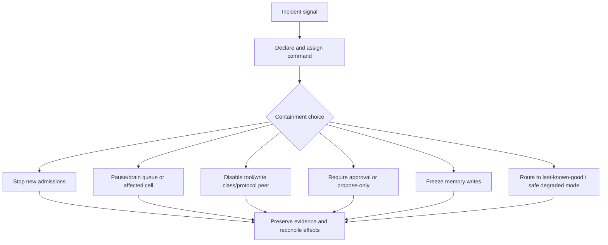

# Deployment, Release, and Incident Response

> **Status:** Research-backed draft  
> **Last researched:** 2026-08-30  
> **Scope:** Behavior versioning, release gates, shadowing, canaries, long-running migrations, rollback, containment, incident command, effect reconciliation, and learning.  
> **Evidence:** [Production operations and architectures research packet](../research/packets/production-operations-and-architectures.md)  
> **Section index:** [Production operations](README.md)

An agent release is a change to a behavioral system, not just a container image. Model, prompt, tools, permissions, workflow, router, context/memory policy, evaluator, and operational configuration must be released and observed as one traceable bundle.

## The release manifest

Create an immutable manifest for every deployable behavior:

| Component | Pin or record |
|---|---|
| Runtime and workflow | application image, graph/controller version, worker build, workflow compatibility policy |
| Models | provider, endpoint/region, exact snapshot or resolved alias, parameters, service tier |
| Instructions and context | system/developer prompts, templates, retrieval policy, compaction and memory versions |
| Tools and protocols | schemas, adapters, server/peer versions, capability grants, credential policy |
| Safety and authority | policy bundle, risk classifier, approval matrix, sandbox profile, spend/run controls |
| Routing | router version, feature inputs, candidate routes, fallbacks, escalation policy |
| Evaluation | dataset/slice, grader, rubric, threshold, judge model, calibration version |
| Operations | queue/scheduler policy, limits, feature flags, degradation and kill-switch configuration |

Resolve mutable aliases into observed versions at run start. Carry the release ID through traces, queue messages, artifacts, effects, approvals, evaluation, and incident records.

## Release pipeline

### Gate 1: offline behavior

Run deterministic tests, trajectory/effect replays, regression and adversarial task suites, policy and authorization tests, evaluator calibration, and critical-slice comparisons. Report uncertainty and dataset coverage. A better average does not excuse a regression on irreversible or regulated tasks.

### Gate 2: compatibility and resilience

Validate tool/protocol schemas, state and memory migrations, old queued messages, cancellation, idempotency, dependency errors, retry budgets, checkpoints, restoration, and rollback. Load-test the full task distribution rather than isolated model calls.

### Gate 3: shadow

Observe the candidate on mirrored or sampled inputs without letting it commit effects. For effectful workflows, compare proposed actions and policy decisions; use a simulator, dry-run capability, or a two-phase prepare/commit boundary. Redact and authorize shadow data like production data—shadowing is still processing.

### Gate 4: canary and ramp

Choose a representative cohort with bounded exposure. Compare against a concurrent control on:

- verified task success and critical slices;
- authority/policy violations and effect anomalies;
- deadline, first-progress, and abandonment SLOs;
- model/tool calls, retries, escalation, review, and cost per success;
- memory/continuity and queue behavior;
- user corrections and operator interventions.

Use both absolute SLO floors and relative change. Shared providers or state can contaminate control and canary, so mark common dependencies. Hold long enough to observe timers, delayed evaluation, memory reuse, batch delivery, and external effects—not merely fast requests.

## Long-running runs and version changes

Define policy per change:

| Change | Common safe policy |
|---|---|
| Prompt/model/router only, no state-schema change | Pin existing runs or explicitly opt them into a compatible release |
| Workflow graph or durable-state shape | Use version-aware branches or a tested state migration |
| Tool/effect contract | Keep adapter compatibility; never replay old intents under new semantics silently |
| Authorization policy tightened | Re-evaluate pending commits under current policy; preserve audit history |
| Authorization policy loosened | Do not grant existing plan text new authority automatically |
| Known unsafe release | Stop new admission, disable affected effects, quarantine/reconcile in-flight runs |

Rollback must state what happens to new requests, queued work, active steps, timers, approvals, partially written memory, prepared effects, and already committed effects. “Redeploy the old image” is not an effect rollback.

## Configuration and emergency changes

Store operational policy centrally, version it, validate it, and log actor/reason/time. Support gradual targeting by release, tenant, workflow, cell, route, and tool. Detect configuration drift between intended and observed state.

Emergency changes need a fast path, but not an invisible path: require bounded scope, named owner, expiry, audit event, post-change validation, and later reconciliation into the normal configuration source.

## Containment controls

Kill switches must operate independently of the unhealthy agent path. Test them under dependency failure. Prefer fine-grained controls, but retain a system-wide emergency stop for uncontrolled high-impact effects.

## Incident operating model

Declare early when there is meaningful user impact, uncontrolled cost/load, policy breach, data exposure, memory contamination, or ambiguous external effects. Assign:

- **incident commander:** priorities, scope, decisions, and handoffs;
- **operations lead:** diagnosis and mitigation execution;
- **communications lead:** user, stakeholder, legal/security, and status updates;
- **subject specialists:** models, tools, security, state, provider, or tenant as needed;
- **scribe:** timeline, hypotheses, commands, evidence, and decision log.

Follow this order:

1. Assess user, tenant, data, cost, and effect impact.
2. Contain autonomy and stop amplification.
3. Preserve logs, traces, prompts/context references, versions, approvals, and provider identifiers.
4. Restore a known safe service or explicitly remain unavailable.
5. Reconcile attempted, acknowledged, verified, failed, and unknown effects.
6. Drain or redrive backlogs under a controlled rate.
7. Determine cause and contributing conditions after mitigation.
8. Communicate closure, remaining risk, and follow-up ownership.

### Effect reconciliation ledger

| State | Meaning | Operator action |
|---|---|---|
| Intended | Agent proposed an operation | Confirm authorization and whether execution began |
| Dispatched | Request left the trusted boundary | Query by idempotency/provider operation ID |
| Acknowledged | Dependency accepted or returned a result | Verify domain postcondition, not response text alone |
| Verified | Authoritative state matches intended postcondition | Close with evidence |
| Failed-not-committed | Authoritative evidence shows no effect | Retry only if still desired, authorized, and within deadline |
| Unknown | Neither commit nor absence can be proven | Escalate; do not blind-retry |
| Compensated | A separate reversal/repair was verified | Retain both original and compensation lineage |

## Runbooks and drills

Maintain runbooks for provider throttling/outage, model regression, unsafe tool behavior, prompt-injection campaign, credential compromise, queue runaway, cost anomaly, state corruption, evaluator failure, regional/cell loss, and notification/stream failure. Each runbook should name signals, impact tests, safe commands, kill-switch scope, evidence locations, rollback/version options, reconciliation, and escalation contacts.

Exercise:

- stop admission while allowing safe drain;
- disable one tool or effect type;
- roll back a canary with active and waiting runs;
- recover from a provider retry storm;
- reconcile timed-out writes;
- restore durable runs in another compatible cell;
- freeze and repair contaminated memory;
- drain a large backlog without starving interactive work.

## Postmortem and follow-through

Write a blameless account of impact, detection, timeline, contributing conditions, why defenses failed, mitigation, recovery, and residual risk. Use run/effect/version evidence rather than reconstructed model explanations. Correct system conditions: tests, boundaries, observability, limits, rollback, ownership, and documentation. Assign owners and due dates, then verify completion in later readiness reviews.

## Readiness checklist

- [ ] The release manifest pins the full behavior bundle.
- [ ] Regression, security, compatibility, replay, and load gates are automated where reliable.
- [ ] Shadow evaluation cannot commit unapproved effects.
- [ ] Canary cohorts are representative and outcome metrics are versioned.
- [ ] Existing and new long-running runs have explicit version policy.
- [ ] Last-known-good and emergency configuration paths are tested.
- [ ] Kill switches can stop admission, routes, tools, writes, and cells independently.
- [ ] Incident roles, working log, evidence capture, and communications are practiced.
- [ ] Ambiguous effects are reconciled before retry or closure.
- [ ] Postmortem actions are owned and verified.

## Related guides

- [Evaluation-driven development](../evaluation/evaluation-driven-development.md)
- [Observability and tracing](../evaluation/observability-and-tracing.md)
- [Durable execution](../runtime/durable-execution.md)
- [Idempotency and side effects](../reliability/idempotency-and-side-effects.md)
- [Scaling, capacity, and SLOs](scaling-capacity-and-slos.md)
- [Tool registries, versioning, and lifecycle](../tools/tool-registries-versioning-and-lifecycle.md)
- [Tool fleet operations](../tools/tool-fleet-operations.md)

## Selected sources

- [Google SRE Workbook: Canarying releases](https://sre.google/workbook/canarying-releases/)
- [Google SRE Workbook: Incident response](https://sre.google/workbook/incident-response/)
- [Google SRE: Postmortem culture](https://sre.google/sre-book/postmortem-culture/)
- [Temporal worker versioning](https://docs.temporal.io/production-deployment/worker-deployments/worker-versioning)
- [AWS Agentic AI Lens: Versioning and rollback](https://docs.aws.amazon.com/wellarchitected/latest/agentic-ai-lens/agentops02-bp03.html)
- [AWS Agentic AI Lens: CI/CD quality gates](https://docs.aws.amazon.com/wellarchitected/latest/agentic-ai-lens/agentops03-bp02.html)
