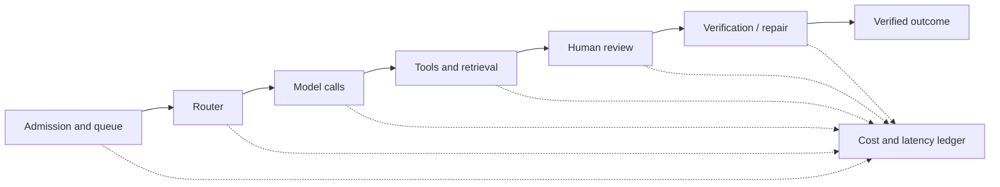
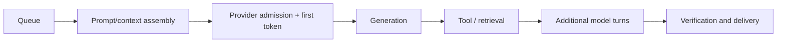
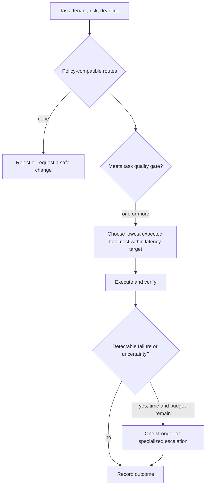

# Model Routing, Cost, and Latency

> **Status:** Research-backed draft  
> **Last researched:** 2026-08-30  
> **Scope:** Model selection, routing, cascades, service classes, caching, latency budgets, and task-level economics.  
> **Evidence:** [Production operations and architectures research packet](../research/packets/production-operations-and-architectures.md)  
> **Section index:** [Production operations](README.md)

Optimize for the least expensive path that still produces a timely, verified, policy-compliant outcome. Per-token price, benchmark rank, and raw response latency are incomplete objectives.

## The unit of optimization

Track cost and time across the whole task:

At minimum, attribute usage from call → step/agent → run/workflow → tenant/product. Separate input, cached input, generated output, reasoning where exposed, embedding/reranking, tool/API, sandbox/compute, storage, retry, evaluation, and review cost. Preserve provider invoice identifiers and the price-card version used for estimates.

Useful business metrics include:

- cost per accepted task, terminal task, and verified-successful task;
- incremental cost of retries, repair, escalation, and human review;
- latency and cost by task class, route, tenant, release, and outcome;
- contribution margin or value per successful task where measurable;
- abandonment and deadline failure caused by latency.

An apparently cheaper route can be more expensive if it increases tool calls, retries, review, unsafe actions, or failed tasks.

## Build a latency budget

Measure each span and its tail. Generated output is often a major model-latency driver; a shorter, structured answer can matter more than trimming a modest input. Very large context, repeated unchanged prefixes, sequential model calls, slow tools, overloaded queues, and approval waits can instead dominate.

| Lever | Helps when | Risk or limit |
|---|---|---|
| Shorter outputs and stopping criteria | Generation dominates | May omit required evidence or explanation |
| Fewer model turns | Orchestration overhead dominates | Combining steps can reduce observability or overload one prompt |
| Parallel independent reads | Slowest dependency dominates | Adds fan-out, rate pressure, and cancellation waste |
| Stable-prefix caching | Long prefixes repeat exactly or semantically per provider rules | Moving fields and version changes destroy hits; writes can exceed reads |
| Smaller qualifying model | The task is routine and evals show adequate quality | Hidden difficult cases and safety floors |
| Streaming progress | User needs responsiveness before completion | Does not reduce actual completion time |
| Speculative work | Next step is highly predictable and cancellable | Wasted spend and accidental effects if cancellation is weak |
| Deterministic code/search | The task does not need generation | Requires explicit product logic and maintenance |

Do not parallelize effectful or causally dependent operations merely for speed. A branch that becomes unnecessary must be cancellable and must not commit an external effect.

## Routing policy

Route on explicit facts first:

- task family, expected complexity, and required capabilities;
- effect/risk class and required quality floor;
- tool, schema, context, modality, and language compatibility;
- data-residency, retention, and provider policy;
- deadline and current queue/capacity state;
- tenant entitlement and spend budget;
- measured route quality for the active release.

High-impact work should have a model/capability floor that overload or price pressure cannot downgrade. Provider failover must pass the same policy and capability checks; availability failover and quality escalation are separate decisions.

## Routing strategies

| Strategy | Best fit | Strength | Failure mode |
|---|---|---|---|
| Fixed route by task class | Most systems and early production | Auditable, cheap, easy to evaluate | Coarse classes leave savings or quality on the table |
| Rule-based cascade | Detectable weak-route failures | Bounded cost-quality trade | Cannot escalate silent errors; double latency on escalated tasks |
| Learned weak/strong router | High volume, representative labels, stable model pair | Finer cost-quality frontier | Drift, label leakage, router overhead, poor domain transfer |
| Capability specialist routing | Distinct modalities, tools, languages, or context needs | Matches real model differences | More operational combinations and sparse eval coverage |
| Multi-model ensemble/rank/fuse | Exceptional quality value and relaxed latency/cost | Can improve candidate diversity | Multiplies calls; judges and candidates may share errors |

RouteLLM and FrugalGPT show that learned routing and cascades can create useful cost-quality frontiers in studied settings. Treat published savings as experiments, not forecasts. Re-evaluate whenever model version, price, prompt, task distribution, tool contract, or evaluator changes.

Start with static rules. Add a learned router only when it is cheaper than the expected savings, its errors are acceptable by risk class, and there is a safe default route. Keep an exploration or audit sample so weak-route failures do not disappear from the training data.

## Calibration and escalation

Model self-reported confidence is not enough. Escalation signals can combine:

- schema or tool-call validation failure;
- missing required evidence or failed deterministic check;
- evaluator disagreement or low calibrated score;
- novelty/out-of-distribution detector;
- repeated planning/tool failure;
- risk-specific ambiguity;
- user correction or explicit high-assurance request.

Calibrate on the production task distribution. Measure false negatives—weak results accepted without escalation—as well as false positives. Put a maximum on cascades; repeated “try a stronger model” loops can consume the entire deadline without repairing the underlying context or tool problem.

## Choose a service class

| Work characteristic | Preferred capacity class | Notes |
|---|---|---|
| User waiting, tight deadline | Online/on-demand or reserved/provisioned | Reserve headroom and bound queueing |
| Predictable sustained critical load | Provisioned or committed capacity where economics fit | Size by token/service demand, region, and version—not requests alone |
| Deferrable bulk work | Provider batch or internal batch queue | Join out-of-order results by stable ID; recheck current limits and windows |
| Low-priority asynchronous work | Flexible/best-effort tier where supported | Design for slower completion and transient unavailability |
| Spiky noncritical work | Shared/on-demand with admission and backoff | Do not treat published maximum as guaranteed capacity |

Provider support, discounts, rate pools, and completion windows change. Link the current price and service documentation in runbooks; keep architecture policy expressed as deadline, predictability, and cost requirements.

## Prompt-cache economics

Put stable, shared material before changing material and use provider-supported cache boundaries. Track:

- eligible prefix tokens and cache key/version;
- cache reads, writes, misses, and invalidations;
- read/write price and latency at the active provider version;
- correctness when tools, instructions, permissions, or retrieved facts change;
- hit rate by tenant and release, without creating unsafe cross-tenant sharing.

A timestamp, user-specific field, or reordered tool definition early in the prefix can cause repeated writes with few reads. Never cache an authorization decision as if it were static prompt content.

## Release and monitor a router

1. Pin candidate routes, prompts, tool schemas, prices, and evaluator versions.
2. Establish quality, safety, latency, and cost floors per task/risk class.
3. Replay a representative set, including difficult and adversarial cases.
4. Shadow the new decision without changing the serving route.
5. Canary a small cohort with outcome-level guardrails.
6. Compare cost per verified result and tail latency, not average call cost.
7. Ramp gradually; retain a static safe route and immediate kill switch.
8. Audit samples from every route and monitor input/decision drift.

## Readiness checklist

- [ ] Cost is attributable through task, tenant, route, and verified outcome.
- [ ] Latency spans separate queue, first token, generation, tools, turns, and verification.
- [ ] Every route satisfies capability, data, and safety policy before price comparison.
- [ ] High-risk work has a non-downgradable quality floor.
- [ ] Escalation uses measurable signals and is attempt/deadline bounded.
- [ ] Provider failover is evaluated for behavior and governance.
- [ ] Cache writes, reads, and invalidations are economically visible.
- [ ] Batch/flexible/provisioned choices are based on deadlines and current terms.
- [ ] Router drift, counterfactual quality, and route-level SLOs are monitored.
- [ ] Current provider prices and limits are not hard-coded as architecture facts.

## Related guides

- [Evaluation-driven development](../evaluation/evaluation-driven-development.md)
- [Trajectory and reliability evaluation](../evaluation/trajectory-and-reliability-evaluation.md)
- [Scaling, capacity, and SLOs](scaling-capacity-and-slos.md)
- [Context engineering](../context-memory/context-engineering.md)
- [Run controls](../runtime/run-controls.md)

## Selected sources

- [OpenAI latency optimization](https://developers.openai.com/api/docs/guides/latency-optimization)
- [OpenAI cost optimization](https://developers.openai.com/api/docs/guides/cost-optimization)
- [Anthropic prompt caching](https://platform.claude.com/docs/en/build-with-claude/prompt-caching)
- [Google Vertex AI: Measure provisioned throughput](https://docs.cloud.google.com/vertex-ai/generative-ai/docs/provisioned-throughput/measure-provisioned-throughput)
- [RouteLLM, ICLR 2025](https://proceedings.iclr.cc/paper_files/paper/2025/file/5503a7c69d48a2f86fc00b3dc09de686-Paper-Conference.pdf)
- [FrugalGPT](https://arxiv.org/abs/2305.05176)
- [LLM-Blender, ACL 2023](https://aclanthology.org/2023.acl-long.792/)
