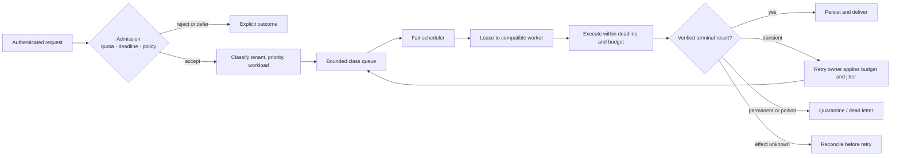
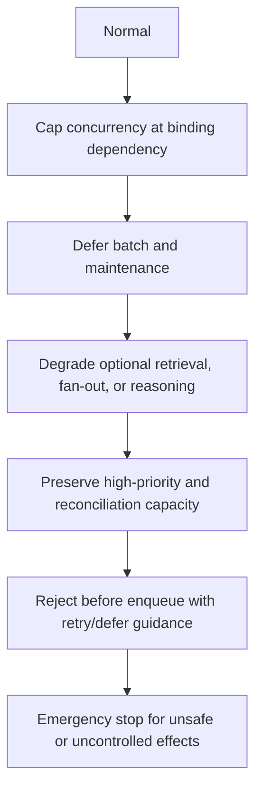
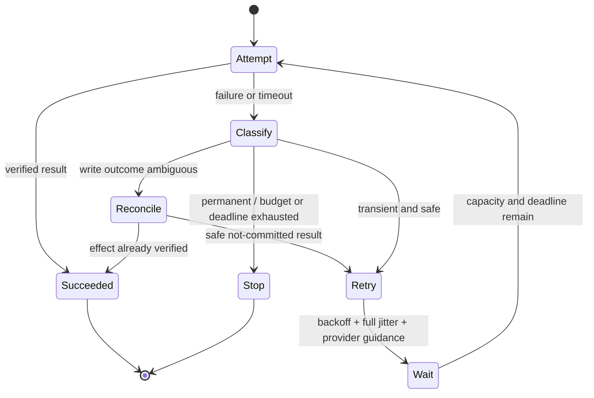
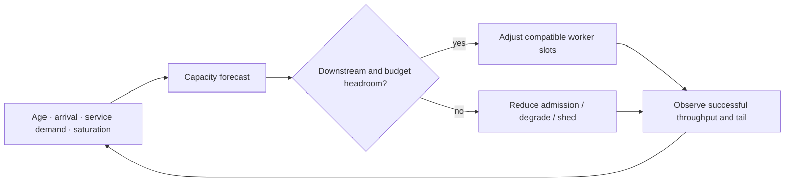

# Queues, Scheduling, and Backpressure

> **Status:** Research-backed draft  
> **Last researched:** 2026-08-30  
> **Scope:** Admission, scheduling, fairness, overload, retries, deadlines, dead-letter handling, and autoscaling for agent work.  
> **Evidence:** [Production operations and architectures research packet](../research/packets/production-operations-and-architectures.md)  
> **Section index:** [Production operations](README.md)

A queue is a shock absorber, not a capacity source. It is useful only when the platform can decide what to admit, keep waiting work bounded and fair, expire work that no longer matters, and drain the backlog before its deadline.

## The production scheduling path

Every transition should preserve `run_id`, tenant, workload class, release version, attempt, deadline, cancellation state, and trace lineage. A queue message is a reference to authoritative work state—not the only copy of that state.

## Admission comes before queuing

Admission decides whether the system can plausibly finish the work. It should evaluate:

- tenant and global concurrency, token, tool, sandbox, spend, and approval budgets;
- deadline versus estimated schedule and service time;
- queue age, completion rate, dependency health, and regional capacity;
- workload compatibility with the requested model, tools, data region, and safety policy;
- duplicate/idempotency identity and current run state.

An explicit rejection, degraded offer, or deferred job is better than accepting work that expires invisibly. Do not admit based on worker CPU alone: the binding constraint may be provider output tokens, a browser pool, a tool API, or human approval.

## Partition work by behavior

| Class | Scheduling objective | Typical isolation | Overload response |
|---|---|---|---|
| Interactive read-only | Fast first useful progress and short end-to-end tail | Reserved online capacity | Simplify, use a qualifying faster route, or reject promptly |
| Interactive effectful | Deadline plus approval/effect integrity | Separate effect and approval limits | Switch to propose-only or require explicit resume |
| Background durable | Completion within a stated deadline | Durable queue and resumable workers | Defer, lower concurrency, or extend only with user agreement |
| Batch/evaluation | Throughput and unit cost | Separate provider/service tier and queue | Pause or shed before user-facing work |
| Recovery/reconciliation | Restore correctness, not raw throughput | Reserved protected capacity | Preserve even during catch-up; tightly bound fan-out |

A single global FIFO lets one large task, tenant, or poisoned cohort dominate. Prefer class queues with weighted fairness, per-tenant concurrency, and reserved capacity. If strict priorities exist, add aging or service floors to prevent starvation. Preserve ordering only where the domain actually requires it.

## Reason from flow, not queue size

For a stable workload, average work in system follows the relationship `WIP ≈ arrival rate × time in system`. More important operationally: sustained arrival rate must remain below successful completion rate with headroom. Retries are arrivals too.

| Metric | Use |
|---|---|
| Ready and in-flight work | Current work-in-process |
| Oldest eligible age | Whether waiting work is becoming stale |
| Schedule-latency percentiles | User-visible fairness and capacity pressure |
| New arrival, retry, and successful completion rates | Backlog direction and amplification |
| Estimated drain time | Recovery horizon after admission is reduced |
| Lease age and heartbeat lag | Stuck or abandoned work |
| Deadline-expired and cancellation fractions | Work the platform should have stopped earlier |
| Per-tenant/service share | Noisy-neighbor and starvation evidence |

Queue length is not portable across task types: 100 ten-second calls and 100 thirty-minute browser sessions are different loads. Estimate remaining service demand by workload class and update estimates from observed distributions.

## Backpressure and shedding ladder

The ladder must preserve the task's quality and safety floor. Never reduce review, authorization, verification, or a required capable-model route merely to increase throughput. A degraded mode is a distinct, tested product behavior, not an improvised prompt change.

Backpressure belongs as close as possible to the producer. Signals can include schedule-age SLO burn, dependency saturation, provider `Retry-After`, projected drain time, approval backlog, and cell capacity. Propagate them through gateways so an upstream service does not continue producing work faster than it can be completed.

## Retry ownership

Retries are controlled recovery traffic. Assign exactly one layer responsibility for the end-to-end attempt budget; provider clients may perform the mechanical wait only if their attempts are visible and counted.

Retry policy should state:

- eligible failure codes and semantic conditions;
- maximum attempts and elapsed recovery time;
- retry token or global budget during incidents;
- idempotency and reconciliation method for effects;
- exponential-backoff cap, jitter, and `Retry-After` precedence;
- whether a route change is recovery, quality escalation, or forbidden;
- terminal state and operator/user notification.

Authentication, authorization, invalid schema, policy rejection, and spend-cap failures normally require correction rather than retry. A timeout is ambiguous around writes; query the effect ledger or provider operation before replay.

## Deadlines, cancellation, and stale work

Carry one absolute deadline through scheduling, model calls, tools, approval waits, retries, and result delivery. Each step gets the remaining budget, not a fresh timeout. Reject or cancel work when its result is no longer useful.

Cancellation is a durable state transition. Stop new calls, signal cancellable work, ignore late results by version/attempt token, reconcile in-flight effects, and write a terminal outcome. Canceling a client connection alone does not cancel a remote model task or tool effect.

## Dead-letter and poison-work handling

A dead-letter queue is quarantine, not a retry mechanism. Record the failure classification, last safe checkpoint, release and dependency versions, attempts, effect state, and evidence references. Alert on rate and age, not every item.

Redrive only after:

1. the cause is understood or the cohort is safely selected;
2. the fix/version is deployed;
3. idempotency and stale-deadline checks pass;
4. the redrive rate is capped below spare capacity;
5. effects and user expectations are reconciled.

## Autoscaling without feedback failure

Scale using a combination of arrival rate, service-demand estimate, oldest age/deadline pressure, worker saturation, and downstream capacity. Scale consumers before reopening producer admission. Apply stabilization windows and per-cell limits so delayed signals do not create oscillation.

More workers can worsen a quota-limited dependency. Maintain a concurrency limiter at each scarce provider, tool, tenant, sandbox, and human-review boundary.

## Readiness checklist

- [ ] Queues are bounded by count and estimated service demand.
- [ ] Interactive, batch, effectful, and recovery work have explicit classes.
- [ ] Tenant fairness and starvation behavior are load-tested.
- [ ] Admission uses deadlines and downstream health, not only local utilization.
- [ ] One retry owner accounts for SDK and service retries.
- [ ] Effects have idempotency and ambiguous-outcome reconciliation.
- [ ] Cancellation and expired-work removal are end-to-end.
- [ ] Dead letters are quarantined and redrive is controlled.
- [ ] Autoscaling respects provider, tool, and approval capacity.
- [ ] Burst, sustained overload, poison work, dependency slowdown, and catch-up are drilled.

## Related guides

- [Scaling, capacity, and SLOs](scaling-capacity-and-slos.md)
- [Durable execution](../runtime/durable-execution.md)
- [Run controls](../runtime/run-controls.md)
- [Idempotency and side effects](../reliability/idempotency-and-side-effects.md)
- [Failure taxonomy](../reliability/failure-taxonomy.md)

## Selected sources

- [Google SRE: Addressing cascading failures](https://sre.google/sre-book/addressing-cascading-failures/)
- [AWS Builders' Library: Avoiding insurmountable queue backlogs](https://aws.amazon.com/builders-library/avoiding-insurmountable-queue-backlogs/)
- [AWS Builders' Library: Timeouts, retries, and backoff with jitter](https://aws.amazon.com/builders-library/timeouts-retries-and-backoff-with-jitter/)
- [Temporal task queues](https://docs.temporal.io/task-queue)
- [Temporal worker performance](https://docs.temporal.io/develop/worker-performance)
- [OpenAI rate limits](https://developers.openai.com/api/docs/guides/rate-limits)
- [Anthropic rate limits](https://platform.claude.com/docs/en/api/rate-limits)

