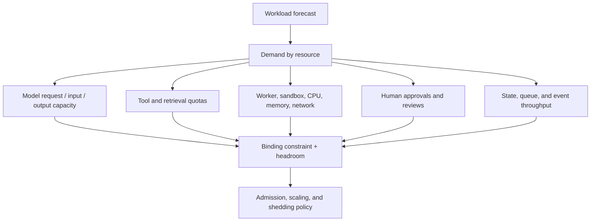
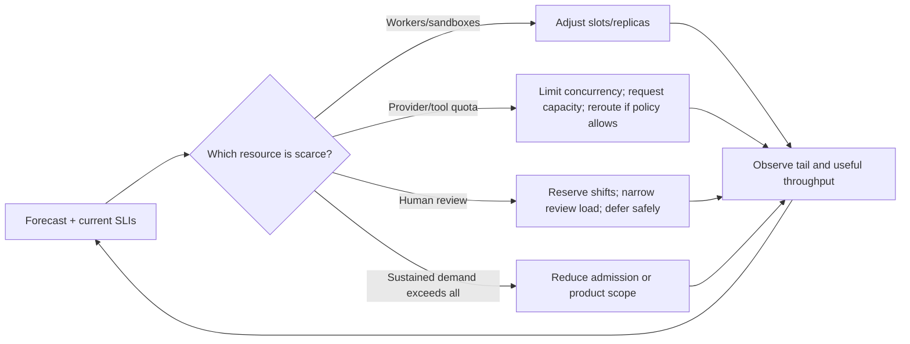
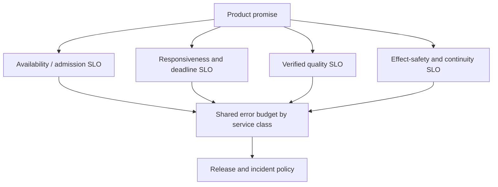

# Scaling, Capacity, and SLOs

> **Status:** Research-backed draft  
> **Last researched:** 2026-08-30  
> **Scope:** Workload modeling, capacity constraints, autoscaling, load testing, multi-tenant isolation, graceful degradation, and task-level service objectives.  
> **Evidence:** [Production operations and architectures research packet](../research/packets/production-operations-and-architectures.md)  
> **Section index:** [Production operations](README.md)

An agent platform is healthy when it completes useful work within its promised deadline and authority—not when its HTTP tier is merely up. Capacity and SLO design must follow the entire run through models, tools, state, sandboxes, approvals, and external effects.

## Define workloads before capacity

Separate workloads whose latency, durability, and failure semantics differ.

| Workload | Primary promise | Dominant resources | Capacity mistake to avoid |
|---|---|---|---|
| Interactive answer | First useful progress and terminal answer | online model, retrieval, streaming connections | Hiding queue delay inside “model latency” |
| Interactive action | Safe decision, approval, effect, and verification | model, tool quota, approval operators, effect ledger | Treating a quick acknowledgement as completion |
| Background research/job | Durable completion by deadline | queue, model tokens, tools, artifacts, checkpoints | Allowing batch work to consume online headroom |
| Long-running workflow | Resume across waits, versions, and failures | workflow history, timers, workers, state stores | Pinning worker capacity while waiting externally |
| Evaluation/replay | Throughput, reproducibility, and cost | batch capacity, evaluator, trace/artifact store | Competing with production or training on biased samples |
| Reconciliation/recovery | Restore known state after ambiguity | provider read APIs, ledger, operators | Shedding the very work required to regain correctness |

For each class, record arrival distributions, deadlines, token and tool demand, concurrency duration, tenant skew, expected retry rate, approval demand, and value of late completion.

## Find the binding constraint

Model demand depends on input/output size, number of turns, routing, retries, and service class—not only requests per minute. Tools may have their own tenant quotas or serialize access to a scarce resource. Browser and code workers are occupied by wall time and memory. An approval queue has human service times and working hours.

Use distributions and correlations. A task that produces a long output may also make more tool calls and occupy a worker longer. Average demand can understate tail saturation dramatically.

### A practical capacity model

For each resource and workload class, estimate:

1. peak and sustained new-task arrival rate;
2. expected calls or visits per successful task;
3. service-demand percentiles per visit;
4. retry and repair amplification under normal and degraded dependencies;
5. concurrency from service duration;
6. reserved headroom for bursts, failover, recovery, and noisy neighbors;
7. the maximum safe admission rate at the smallest constraint.

Recalculate when a model, prompt, tool, route, context policy, workflow graph, or task mix changes. Those are capacity changes even if application code is untouched.

## Scale the right controller

Autoscaling signals should combine:

- arrival rate and predicted service demand;
- oldest eligible age and deadline pressure;
- successful completions, not merely attempts;
- worker slot and sandbox saturation;
- provider and tool throttling headers/rates;
- approval backlog and operator availability;
- queue drain-time forecast;
- per-cell and per-tenant fairness.

Use stabilization windows and maximum change rates. Scaling out workers against a provider token limit raises contention and retry load. Scaling down must respect leased work, checkpoints, and draining. Keep minimum warm capacity where cold starts violate the interactive SLO.

## Agent service-level indicators

### User-facing SLIs

| SLI | Good event definition |
|---|---|
| Admission decision | Accepted, explicitly deferred, or clearly rejected within target time |
| First useful progress | A truthful, actionable event—not a heartbeat or generic “thinking” message |
| Deadline completion | Required terminal evidence exists before the promised deadline |
| Verified task success | Versioned deterministic or rubric evaluation passes |
| Safe effect completion | Authorization, effect acknowledgement, and postcondition verification agree |
| Continuity | Interrupted run resumes without losing accepted work or duplicating effects |
| Cancellation | New work stops promptly and terminal/cross-system state is reconciled |

Define denominator eligibility precisely: user cancellations, invalid requests, dependency exclusions, and planned maintenance can otherwise be manipulated to improve the number. Report accepted-work failures separately from admission rejections.

### Diagnostic SLIs

Queue age, token throughput, first-token latency, tool latency, retry ratio, evaluator delay, cache behavior, worker saturation, provider errors, approval time, and checkpoint lag explain outcome failures. They support, but do not replace, task-level SLOs.

Quality is often delayed or sampled. Mark outcomes as provisional until the applicable verifier completes, pin evaluator versions, audit judge disagreements, and publish coverage. Do not silently count unevaluated work as good.

## SLO structure

Use a small hierarchy instead of one overloaded number:

Segment by workload class, tenant/tier, region/cell, risk, route, and release. A global average can conceal a failing tenant or unsafe workflow. Avoid a proliferation of objectives that nobody can act on; choose indicators tied to concrete release, capacity, or incident decisions.

Alert on multi-window burn rate rather than every transient error. A fast burn over a short window catches acute incidents; a slower burn over a longer window catches persistent degradation. Page on user-impacting budget consumption, then use component alerts for diagnosis. Quality and effect-safety incidents may need event-count or absolute-severity paging even before a statistically stable rate exists.

## Graceful degradation

Specify a pre-tested ladder by workload and risk:

| Pressure | Safe option | Unsafe shortcut |
|---|---|---|
| Online model saturation | Defer background work; select an already-qualified route; limit fan-out | Unvalidated downgrade for high-risk actions |
| Retrieval/tool slowdown | Return a scoped partial result with uncertainty; retry inside deadline | Fabricate missing evidence or repeat unlimited calls |
| Approval backlog | Pause before commit; preserve proposal and deadline state | Auto-approve to clear the queue |
| Memory/state write impairment | Freeze writes, preserve durable run events, use read-only degraded mode | Continue with divergent hidden state |
| Evaluator unavailable | Mark provisional, hold high-impact effects or promotion | Treat missing evaluation as pass |
| Regional/cell failure | Route only compatible new work; resume durable runs by policy | Duplicate active runs or cross data boundaries silently |

## Multi-tenant capacity and blast radius

Apply tenant identity and limits at API admission, workflow scheduling, model gateway, memory/state, tool gateway, sandbox, and approvals. A global limit at ingress does not prevent a single tenant's long calls from monopolizing workers or provider tokens.

Isolation is a spectrum:

| Level | Appropriate when | Cost |
|---|---|---|
| Shared pool with quotas/fair scheduling | Similar low-risk tenants and strong logical controls | Best utilization; broader noisy-neighbor blast radius |
| Cell/shard assignment | Scale and failure containment matter | Capacity fragmentation and rebalancing complexity |
| Sandboxed/dedicated node or account | Stronger compute, credential, or quota isolation | Higher operational and idle-capacity cost |
| Dedicated cluster/region/control domain | Regulatory, residency, or severe threat boundary | Highest cost and upgrade complexity |

Namespace separation alone is not strong isolation. Combine identity, RBAC, network and storage policy, resource quotas, secret boundaries, runtime sandboxing, and workload placement appropriate to the threat model.

## Load and resilience testing

Test with production-like task distributions and dependencies:

- steady-state at expected and rated load;
- gradual ramp and sudden impulse;
- sustained overload until admission/shedding stabilizes;
- long-tail model/tool latency and partial provider throttling;
- worker loss, cell loss, network partition, and cold recovery;
- poison messages and retry storms;
- one hot tenant plus normal tenants;
- approval unavailability and burst return;
- queue catch-up after outage;
- release canary under representative load;
- soak for memory, workflow history, storage, and cache growth.

Success means the system degrades as designed, preserves protected capacity, keeps effects consistent, and returns to steady state without an uncontrolled catch-up storm.

## Readiness checklist

- [ ] Workload classes have distinct promises, demand distributions, and queues.
- [ ] Capacity models include model tokens, tools, workers, state, and humans.
- [ ] The current binding constraint is observable.
- [ ] Autoscaling cannot overrun downstream quotas or duplicate leased work.
- [ ] SLOs measure deadline-valid, verified, authorized outcomes.
- [ ] Quality coverage and evaluator versions are explicit.
- [ ] Multi-window burn alerts drive release and incident policy.
- [ ] Degraded modes preserve safety and are exercised.
- [ ] Tenant limits exist at every scarce layer.
- [ ] Overload, failover, noisy-neighbor, and recovery tests pass.

## Related guides

- [Queues, scheduling, and backpressure](queues-scheduling-and-backpressure.md)
- [Model routing, cost, and latency](model-routing-cost-and-latency.md)
- [Observability and tracing](../evaluation/observability-and-tracing.md)
- [Production agent control plane](../architectures/production-agent-control-plane.md)
- [Failure taxonomy](../reliability/failure-taxonomy.md)

## Selected sources

- [Google SRE Workbook: Implementing SLOs](https://sre.google/workbook/implementing-slos/)
- [Google SRE Workbook: Alerting on SLOs](https://sre.google/workbook/alerting-on-slos/)
- [Google SRE: Service best practices](https://sre.google/sre-book/service-best-practices/)
- [Kubernetes horizontal pod autoscaling](https://kubernetes.io/docs/concepts/workloads/autoscaling/horizontal-pod-autoscale/)
- [Kubernetes multi-tenancy](https://kubernetes.io/docs/concepts/security/multi-tenancy/)
- [AWS SaaS Lens foundations](https://docs.aws.amazon.com/wellarchitected/latest/saas-lens/foundations.html)
- [Google Vertex AI throughput quota](https://docs.cloud.google.com/vertex-ai/generative-ai/docs/resources/throughput-quota)

