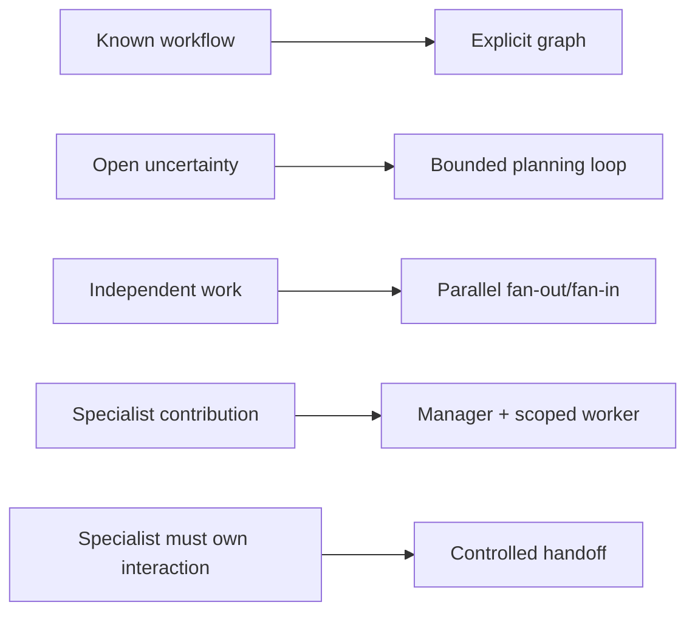

# Orchestration and Multi-Agent Systems

> **Status:** Research-backed core available.  
> **Last researched:** 2026-08-30  
> **Evidence:** [Orchestration and protocols research packet](../research/packets/orchestration-and-protocols.md)

Orchestration decides what runs next, under whose authority, with which state and budget, and how evidence and effects are reconciled. Prefer explicit workflows for known dependencies; add model-directed planning or multiple agents only when workload evaluations show that uncertainty, isolation, or parallelism justifies the coordination cost.

## Guides

| Guide | Use it to |
|---|---|
| [Planning and replanning](planning-and-replanning.md) | Design versioned plans, dependency graphs, safe parallelism, verification, and evidence-triggered replanning |
| [Multi-agent topologies](multi-agent-topologies.md) | Choose among single agent, router, parallel workers, manager-worker, handoff, and peer/group patterns |
| [Delegation, handoffs, and shared state](delegation-handoffs-and-shared-state.md) | Define capability, context, result, state, cancellation, and ownership-transfer contracts |

## Core position

- A plan is a fallible, versioned hypothesis; policy and current state remain authoritative.
- Multi-agent systems scale context, tools, and parallel work—not truth.
- Central manager ownership is the default for dynamic delegation and effect control.
- Context isolation and typed result artifacts beat shared unbounded transcripts.
- Child authority, budget, deadline, and effect scope must be equal to or narrower than the parent's.
- Cancellation is best-effort; commit fences and reconciliation handle late results.
- Re-evaluate topology whenever workload, model, tools, latency, or pricing changes.

## Remaining research queue

- Scheduling strategies across long-running asynchronous agent workstreams.
- Formal shared-memory consistency and distributed merge techniques by workload.
- Workload-specific topology benchmarks and production incident corpora.
- Remote-agent identity/delegation standards as they mature.
- Queue/backpressure and fleet-level cost behavior, covered next in operations.

## Related sections

- [Protocols](../protocols/README.md)
- [Runtime](../runtime/README.md)
- [Context and memory](../context-memory/README.md)
- [Evaluation](../evaluation/README.md)
- [Security](../security/README.md)
