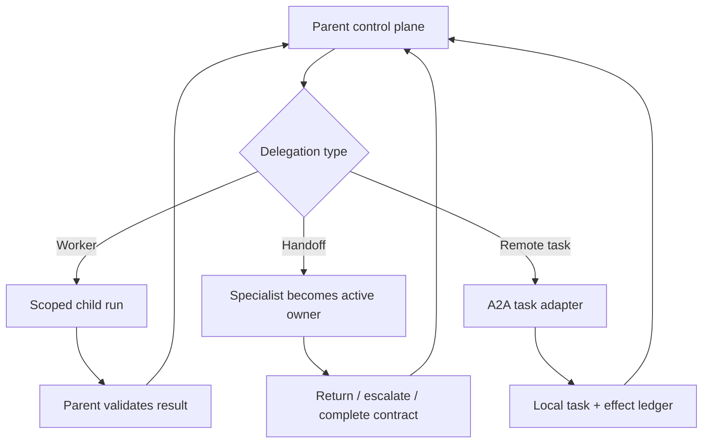
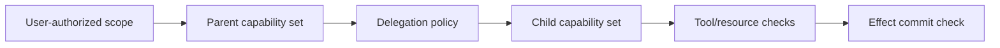
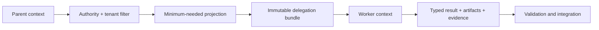
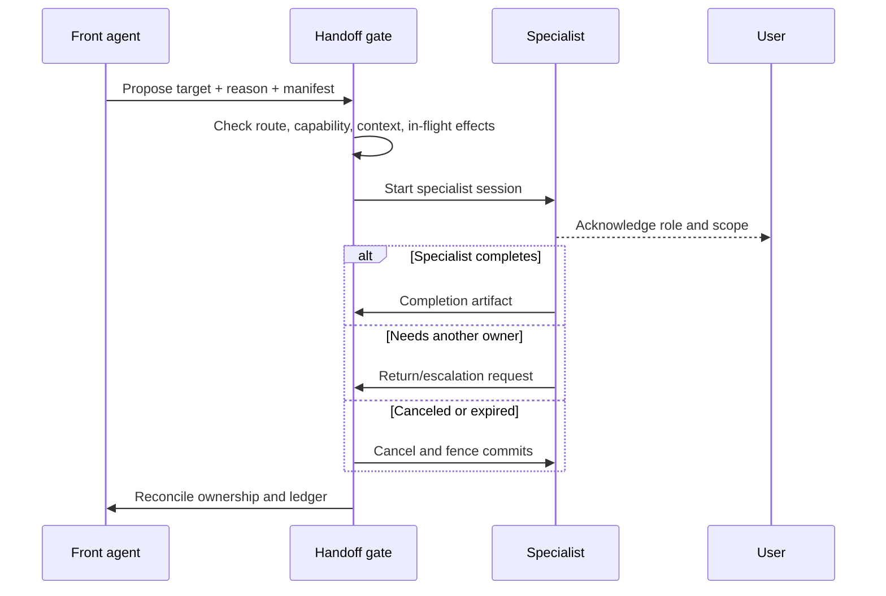
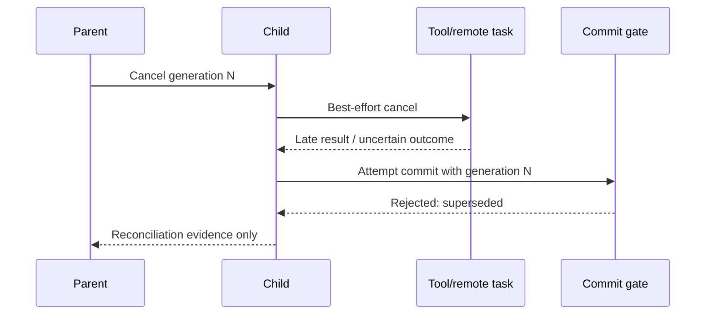

# Delegation, Handoffs, and Shared State

> **Status:** Research-backed draft  
> **Last researched:** 2026-08-30  
> **Scope:** Contracts and runtime controls for delegating work, transferring conversational ownership, sharing state, and integrating results.  
> **Evidence:** [Orchestration and protocols research packet](../research/packets/orchestration-and-protocols.md)  
> **Section index:** [Orchestration and multi-agent systems](README.md)

Delegation creates a new trust and failure boundary. The parent does not merely send a prompt: it lends bounded capabilities and resources to another execution context, then decides whether the returned evidence is fit to use.

## Three different operations

| Operation | Ownership after dispatch | Result path | Best use |
|---|---|---|---|
| **Agent as tool / worker** | Parent retains task and user ownership | Child returns a typed result to parent | Research, specialist analysis, bounded subtask |
| **Handoff** | Specialist owns the next phase or user interaction | Specialist responds directly; may later return/escalate | Domain service, triage-to-specialist conversation |
| **Remote task** | Local runtime owns the user contract; remote service owns its opaque task execution | Poll, stream, or push task status/artifacts | Cross-system A2A delegation |

OpenAI Agents SDK, Microsoft Agent Framework, and LangChain differ in API shape but agree on the core distinction: a worker returns control; a handoff transfers it. Do not model these as interchangeable tool calls.

## Delegation contract

A delegation should be a structured record with at least:

| Group | Required fields |
|---|---|
| Identity | delegation ID, parent/child run IDs, tenant/subject, trace/span links |
| Objective | bounded outcome, exclusions, acceptance criteria, priority |
| Context | immutable artifact refs, verified facts, source trust labels, freshness/version |
| Capability | allowed tools, resources, operations, data scope, network/host boundaries |
| Effects | read/propose/commit class, idempotency namespace, approval requirements |
| Resources | token, tool-call, time, money, concurrency, and storage budgets |
| Lifecycle | deadline, lease, cancellation/supersession token, retry owner |
| Result | schema, evidence/citation requirements, confidence/unknown fields, max size |
| Recovery | retryable classes, partial-result rule, escalation and compensation owner |

The child should reject an impossible or ambiguous contract rather than silently broadening it.

## Capability attenuation

Authority must be monotonic: `child scope ⊆ parent scope ⊆ user/system authorization`. A prompt saying “only read” is not enforcement. Mint scoped, short-lived credentials or broker calls through a policy-enforcing runtime. Bind authority to:

- tenant, subject, and purpose;
- named operations and resource selectors;
- maximum impact or amount;
- expiry, attempt, and delegation lineage;
- environment and network boundary;
- approval/proposal identity for material effects.

Never forward a parent bearer token to a child or remote service merely because it is convenient. A child that needs an upstream resource should receive a token intended for that resource and audience, or call through the parent broker.

## Context projection

Nested agents do not universally inherit parent conversation or application state; where they do, inherited mutable objects can create coupling. Make projection explicit:

Do not forward the full transcript by default. Preserve tool-call/result pairing if a framework requires it, but remove unrelated conversation, secrets, other-tenant data, abandoned plans, and untrusted text that does not support the task. The worker needs the current accepted objective—not every prior interpretation of it.

## Result envelope

A good child result is concise and machine-checkable:

- `status`: succeeded, partial, blocked, failed, canceled, or unknown;
- `summary`: bounded conclusion, not hidden reasoning;
- `claims[]`: claim, evidence refs, source authority/freshness, uncertainty;
- `artifacts[]`: immutable identifier, media/type, hash, sensitivity, retention;
- `observations[]`: authoritative versions and timestamps;
- `effects[]`: proposed, attempted, confirmed, or unknown—never ambiguous prose;
- `remaining_questions[]` and recommended next action;
- consumed budget and terminal/cancellation state.

The parent validates schema, tenant, provenance, source quality, policy, and current state before integration. A successful child status does not prove its conclusion or an external write.

## Handoff lifecycle

Define these handoff semantics before shipping:

1. **Eligibility:** which destinations are enabled for this request and user?
2. **Manifest:** what state and conversation slice transfers?
3. **Acknowledgement:** when does the new owner become active?
4. **In-flight work:** who cancels, waits for, or inherits pending effects?
5. **User visibility:** does the user know responsibility changed?
6. **Return route:** can the specialist return, escalate, or consult the former owner?
7. **Completion:** who verifies the final outcome and closes durable state?

A handoff is not complete when a routing tool is emitted. It is complete when the destination acknowledges the accepted manifest and ownership ledger changes atomically.

## Shared-state strategies

| Strategy | Advantages | Risks | Use when |
|---|---|---|---|
| Immutable inputs + artifact outputs | Isolation, replay, auditability | Join work and storage | Default for parallel workers |
| Single-writer shared state | Simple conflict model | Writer bottleneck | One manager owns integration |
| Optimistic concurrency | Parallel progress | Conflicts and retries | Updates are sparse and mergeable |
| Partitioned ownership | Scales independent domains | Cross-partition transactions | Boundaries are stable and enforced |
| CRDT/commutative merge | Tolerates ordering and disconnects | Semantic complexity | State operations are genuinely commutative |
| Shared mutable session object | Easy prototype | Hidden coupling, races, replay failure | Avoid for production control state |

Every mutable record needs owner, schema/version, revision, write precondition, conflict rule, timestamp source, and audit history. Text summaries are views, not the source of truth.

### Merge by semantics, not last response

For a fan-in, define field-level behavior:

- union independently verified evidence by immutable source identity;
- prefer authoritative/newer facts only when effective-time rules allow;
- surface contradictions rather than selecting the most confident prose;
- require a single commit owner for non-commutative effects;
- never use “last agent wins” for approvals, permissions, balances, or lifecycle state.

## Cancellation and late results

Cancellation is a request; external work may already be in flight. Use a hierarchical cancellation token and commit fence:

Propagate cancel to queues, model streams, tools, remote tasks, and UI streams. Keep enough reconciliation access to determine whether an already-issued external operation completed. Never compensate an unknown effect until authoritative state is checked.

## Nested approvals and guardrails

Approval must apply at the layer that can execute the effect. A parent-level guardrail may not run around every nested tool invocation, depending on framework semantics. Therefore:

- enforce tool policy and input/output validation at every execution boundary;
- bind approval to actor, resource, operation, parameters, amount/impact, expiry, and proposal hash;
- invalidate approval if a child changes material parameters;
- keep approval credentials out of child prompts and tool output;
- require the final commit gate to re-check current state and cancellation.

## Operational signals

Trace each delegation as a linked span/event set:

- parent/child IDs and topology role;
- capability and context manifest hashes;
- budget assigned/used and queue/runtime duration;
- handoff acknowledged/returned/escalated;
- state versions read/written and conflicts;
- result schema/validation/evidence status;
- cancellation request, propagation, acknowledgement, and late commits rejected;
- effects proposed/approved/attempted/reconciled.

Do not log raw delegated context or credentials by default. Record hashes, source IDs, sensitivity labels, and safe summaries.

## Failure tests

- worker ignores scope or claims a capability it lacks;
- malicious peer result contains instructions for the parent;
- child succeeds after the parent is canceled;
- two children update the same record from the same revision;
- handoff destination never acknowledges;
- handoff loses tool-call/result pairing or critical user correction;
- remote cancellation is rejected or ignored;
- child times out after an external write with unknown outcome;
- approval changes between proposal and commit;
- parent retries while the original child continues;
- artifact belongs to another tenant or is replaced after validation.

## Readiness checklist

- [ ] Worker, handoff, and remote-task semantics are distinct.
- [ ] Every delegation has an immutable contract and lineage.
- [ ] Child capabilities and credentials are narrower and short-lived.
- [ ] Context is minimized, typed, and trust-labeled.
- [ ] Results contain evidence and explicit effect status.
- [ ] Shared state has ownership, versions, and conflict handling.
- [ ] Handoff acknowledgement atomically changes ownership.
- [ ] Cancellation propagates and a commit fence rejects late effects.
- [ ] Nested tools enforce their own policy and exact-effect approval.
- [ ] Adversarial-peer, race, unknown-outcome, and resume tests pass.

## Related guides

- [Multi-agent topologies](multi-agent-topologies.md)
- [Planning and replanning](planning-and-replanning.md)
- [Agent2Agent protocol](../protocols/agent-to-agent-protocol.md)
- [Permissions, sandboxing, and secrets](../security/permissions-sandboxing-and-secrets.md)
- [Durable execution](../runtime/durable-execution.md)
- [Interactive and long-running reference architectures](../architectures/interactive-and-long-running-reference-architectures.md)
- [Production agent control plane](../architectures/production-agent-control-plane.md)

## Selected sources

- [OpenAI Agents SDK: Multi-agent orchestration](https://openai.github.io/openai-agents-python/multi_agent/)
- [OpenAI Agents SDK: Handoffs](https://openai.github.io/openai-agents-python/handoffs/)
- [OpenAI Agents SDK: Context](https://openai.github.io/openai-agents-python/context/)
- [Microsoft Agent Framework: Handoff orchestration](https://learn.microsoft.com/en-us/agent-framework/user-guide/workflows/orchestrations/handoff)
- [LangChain: Subagents](https://docs.langchain.com/oss/python/langchain/multi-agent/subagents)
- [LangChain: Handoffs](https://docs.langchain.com/oss/python/langchain/multi-agent/handoffs)
- [Prompt Infection](https://arxiv.org/abs/2410.07283)
- [Bounded Agents](https://arxiv.org/abs/2608.15888)
