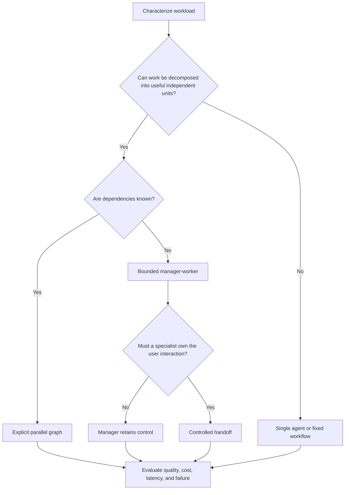
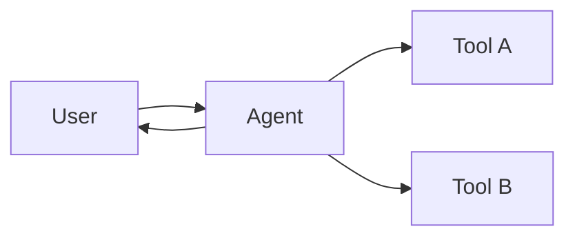
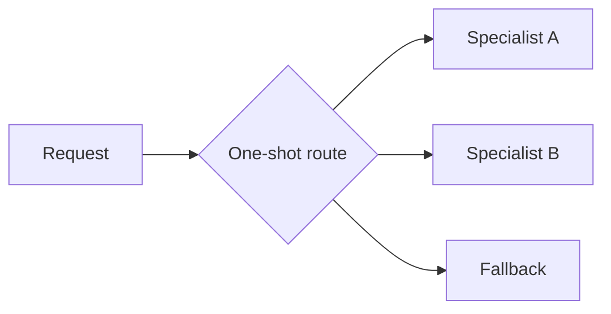
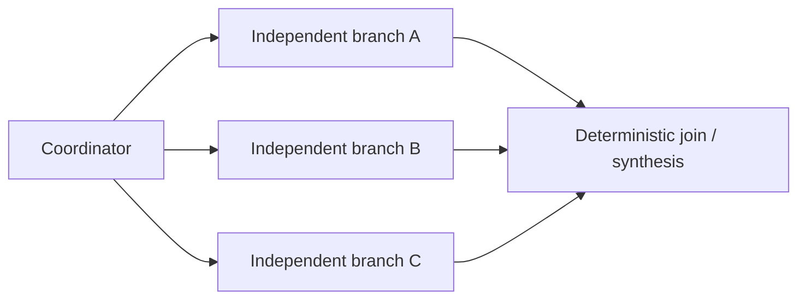
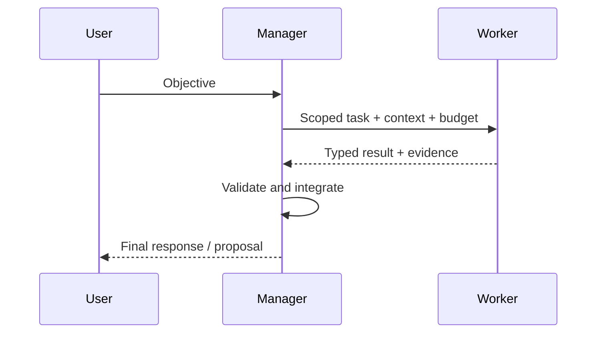
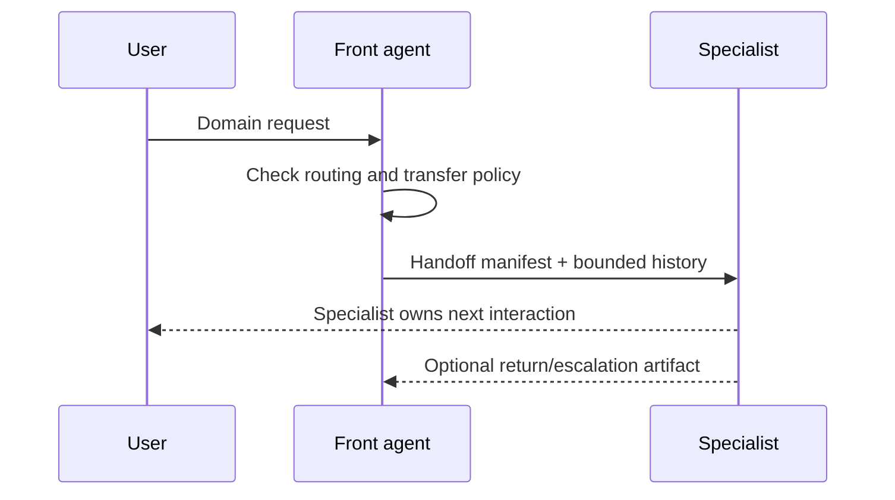
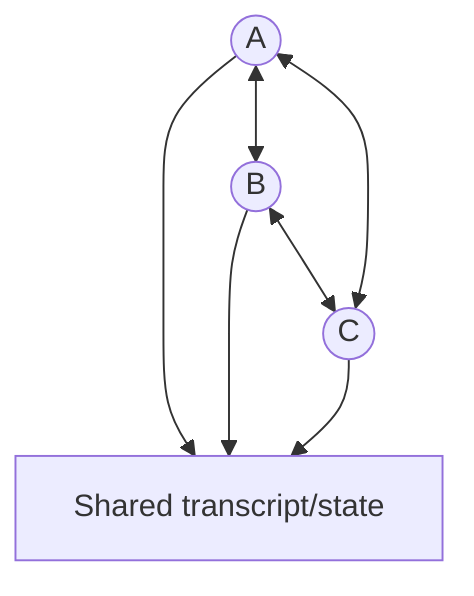

# Multi-Agent Topologies

> **Status:** Research-backed draft  
> **Last researched:** 2026-08-30  
> **Scope:** Selecting and operating single-agent, routing, manager-worker, handoff, parallel, and collaborative topologies.  
> **Evidence:** [Orchestration and protocols research packet](../research/packets/orchestration-and-protocols.md)  
> **Section index:** [Orchestration and multi-agent systems](README.md)

Multi-agent design is a resource-allocation decision, not a default path to higher intelligence. Additional agents can provide parallel context, tools, and perspectives; they also create communication overhead, larger attack surfaces, divergent state, and compounded error.

## Start with the work shape



Google's 2026 scaling study found that parallelizable tasks could benefit while sequential tasks often degraded in its tested configurations. Anthropic's production research system benefited from parallel breadth-first search but spent far more tokens and required strict worker controls. These are not universal multipliers; they identify the conditions worth testing locally.

## Topology catalog

### Single agent with tools



Use when one context can hold the relevant state and the task is not usefully parallel. It minimizes coordination and makes authorization, tracing, and termination easiest.

### Router to specialist



Use for mutually exclusive domains with a single dispatch. A router is classification; a supervisor makes ongoing decisions. Add confidence/fallback handling and test ambiguous or adversarial inputs.

### Parallel fan-out/fan-in



Use for independent research, retrieval, scoring, or candidate generation. Define width, shared budgets, partial-success policy, result schema, and merge semantics. Independent candidates are most valuable when they actually use distinct evidence or methods; identical agents can produce correlated errors.

### Manager with agents as tools



The manager retains user-facing ownership and the effect ledger. This is the default dynamic multi-agent topology because it centralizes termination, budgets, approval, and synthesis. The manager can become a bottleneck, so return compact artifacts and use explicit parallel branches.

### Handoff



Use when the specialist needs to converse directly, maintain domain continuity, or control a distinct phase. A handoff must specify transferred authority, history filter, session/state mapping, return path, and responsibility for in-flight effects.

### Group chat, swarm, or peer mesh



Use sparingly for workloads where emergent collaboration beats a manager in representative evaluations. Ownership, termination, cost attribution, injection containment, and conflict resolution are substantially harder. Role prompts alone do not solve these problems.

## Decision matrix

| Condition | Single / graph | Router | Parallel workers | Manager-workers | Handoff | Peer/group |
|---|---:|---:|---:|---:|---:|---:|
| Sequential dependencies | **Best** | Limited | Poor | Possible | Possible | Poor |
| Independent subtasks | Good | Limited | **Best** | **Good** | Limited | Possible |
| Central effect control required | **Best** | Good | Good at join | **Best** | Harder | Poor |
| Specialist owns user dialogue | Possible | Good | Poor | Poor | **Best** | Ambiguous |
| Strong context isolation desired | Good | Good | **Best** | **Best** | Moderate | Poor |
| Low latency/token budget | **Best** | Good | Conditional | Poorer | Poorer | Worst |
| Easy cancellation and replay | **Best** | Good | Moderate | Moderate | Harder | Hardest |
| Open-ended decomposition | Limited | Poor | Needs known split | **Best** | Conditional | Experimental |

## Estimate whether agents will pay for themselves

Before implementation, score:

- **decomposability:** can branches yield independently useful results?
- **dependency density:** how often does one branch need another branch's latest output?
- **context interference:** does isolating evidence reduce distraction or leakage?
- **tool specialization:** are capabilities genuinely different or only differently named prompts?
- **parallel slack:** is wall time dominated by independent I/O/model calls?
- **diversity value:** can independent methods reduce blind spots?
- **integration difficulty:** can results be validated and merged mechanically?
- **error cost:** can one bad worker contaminate the final result or effects?

If dependency density and integration ambiguity are high, a single agent with a clear workflow usually wins.

## Control-plane invariants

Every topology needs one accountable control plane, even if work is decentralized:

| Invariant | Minimum implementation |
|---|---|
| Objective ownership | One canonical accepted objective/version |
| Authority | Per-worker capabilities no broader than parent delegation |
| Budget | Parent plus child token/time/money/tool-call limits |
| Termination | Explicit success, stop, timeout, cancellation, and escalation conditions |
| State | Versioned ownership and conflict policy |
| Effects | Central or federated idempotency ledger with commit fencing |
| Evidence | Typed result envelope and immutable artifact references |
| Lineage | Parent/child run, delegation, tool, and external-operation IDs |
| Security | Isolation, output validation, peer admission, tenant controls |

## Context and communication

Prefer a compact delegation envelope over transcript copying:

1. objective and explicit exclusions;
2. authoritative constraints and policy references;
3. minimal verified state and source references;
4. allowed tools/data/effects;
5. output schema and evidence bar;
6. budget, deadline, and stop conditions;
7. correlation and cancellation identifiers.

Worker messages and artifacts are untrusted evidence. Never place them in a privileged instruction lane. Validate claims against sources before synthesis and treat files/URLs as hostile until scanned and authorized.

## Cost and latency model

Total cost is more than the sum of worker calls:

```text
manager planning + worker prompts + worker tools + communication/summaries
+ retries/replans + join/synthesis + verification + idle/duplicate work
```

Wall time follows the critical path, not the worker count. Fan-out can reduce latency only until provider quotas, connection pools, tool rate limits, join stragglers, and manager synthesis dominate. Measure:

- quality and evidence coverage per additional worker;
- total and critical-path latency;
- token/tool/currency cost by parent and branch;
- duplicate work and unused worker results;
- fan-out width, queue time, straggler time, and cancellation lag;
- coordination and integration failures;
- security/permission violations by delegation edge.

## Failure modes

| Failure | Detection | Control |
|---|---|---|
| Over-delegation | High worker count, duplicate queries, unused results | Fan-out cap and marginal-value stop rule |
| Under-specified task | Workers return incompatible outputs | Typed task/result contract and examples |
| Error amplification | Same unsupported claim propagates across agents | Provenance, independent verification, trust-weighted synthesis |
| State divergence | Conflicting versions or lost updates | Single writer, optimistic concurrency, or deterministic merge |
| Orphan work | Parent stopped but children/tools still run | Hierarchical cancellation and lease expiry |
| Infinite conversation | No terminal state or unchanged cycles | Hard turn/time budgets and progress detector |
| Authority expansion | Child accesses broader data/tool scope | Capability attenuation enforced by runtime |
| Injection propagation | Peer content influences privileged control | Context lanes, sanitization, policy at action boundary |
| Manager bottleneck | Long queue and oversized synthesis context | Parallel bounded branches and artifact-based returns |

MAST's trace taxonomy is a useful seed for coordination failures, but local traces should drive the final taxonomy and priorities.

## Evaluation design

Run the same task set with:

1. a single-agent or explicit-workflow baseline;
2. the proposed topology at multiple fan-out widths;
3. injected worker/tool/communication failures;
4. dependency and ambiguity levels representative of production;
5. changed base models and tool latencies;
6. malicious or poisoned worker output;
7. cancellation, timeout, resume, and partial-result scenarios.

Compare end outcome, evidence quality, effects, latency, cost, and failure containment. Do not ship a topology because it looks better on one aggregate answer score.

## Readiness checklist

- [ ] A single-agent or explicit-workflow baseline exists.
- [ ] Workload decomposability and dependency density were measured.
- [ ] One component owns objective, budgets, termination, and effects.
- [ ] Worker context, capability, result, and evidence contracts are explicit.
- [ ] Shared state has ownership, version, and conflict semantics.
- [ ] Cancellation, deadlines, and budgets propagate to descendants.
- [ ] Peer output is handled as untrusted evidence.
- [ ] Topology evals include quality, cost, latency, security, and failure containment.
- [ ] Model or workload changes trigger re-evaluation.

## Related guides

- [Planning and replanning](planning-and-replanning.md)
- [Delegation, handoffs, and shared state](delegation-handoffs-and-shared-state.md)
- [Context engineering](../context-memory/context-engineering.md)
- [Agent threat model](../security/agent-threat-model.md)
- [Trajectory and reliability evaluation](../evaluation/trajectory-and-reliability-evaluation.md)

## Selected sources

- [OpenAI Agents SDK multi-agent orchestration](https://openai.github.io/openai-agents-python/multi_agent/)
- [Anthropic multi-agent research system](https://www.anthropic.com/engineering/multi-agent-research-system)
- [Google: Science of scaling agent systems](https://research.google/blog/towards-a-science-of-scaling-agent-systems-when-and-why-agent-systems-work/)
- [Microsoft Agent Framework orchestrations](https://learn.microsoft.com/en-us/agent-framework/workflows/orchestrations/)
- [Google ADK collaborative workflows](https://adk.dev/workflows/collaboration/)
- [MultiAgentBench](https://aclanthology.org/2025.acl-long.421/)
- [MAST](https://openreview.net/pdf?id=fAjbYBmonr)
- [Nature Machine Intelligence: multi-agent collaboration](https://www.nature.com/articles/s42256-026-01268-y)
