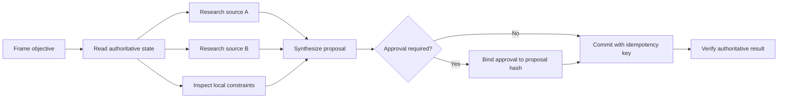

# Planning and Replanning

> **Status:** Research-backed draft  
> **Last researched:** 2026-08-30  
> **Scope:** Turning an objective into an executable, observable, and revisable task graph without granting a generated plan authority over reality.  
> **Evidence:** [Orchestration and protocols research packet](../research/packets/orchestration-and-protocols.md)  
> **Section index:** [Orchestration and multi-agent systems](README.md)

A production plan is a versioned hypothesis about how to reach an outcome. It helps sequence work, expose dependencies, reserve resources, and define verification—but it never overrides current policy, approvals, or observed system state.

## The control loop

```mermaid
stateDiagram-v2
    [*] --> Frame
    Frame --> Plan: objective and constraints valid
    Plan --> Ready: dependencies and budgets checked
    Ready --> Execute: next node authorized
    Execute --> Observe
    Observe --> Verify
    Verify --> Ready: node passed; successors unblocked
    Verify --> Replan: assumption invalid / state changed
    Verify --> Recover: retryable failure
    Recover --> Ready: recovery succeeded
    Recover --> Replan: plan no longer viable
    Replan --> Plan: preserve evidence and update version
    Verify --> Complete: terminal evidence satisfied
    Verify --> Stop: canceled / budget exhausted / unsafe
    Complete --> [*]
    Stop --> [*]
```

The loop separates four things models often blur:

- **intent:** what outcome and constraints the user accepted;
- **plan:** a proposed dependency structure;
- **observation:** evidence about the current environment;
- **commit:** an authorized external effect with a recorded outcome.

## Choose the least dynamic adequate controller

| Work shape | Preferred controller | Why | Avoid |
|---|---|---|---|
| Stable sequence with known branches | Code or workflow graph | Deterministic joins, retries, approvals, and recovery | Asking a model to rediscover the same sequence each run |
| Known graph with semantic decisions inside nodes | Workflow graph plus bounded model nodes | Keeps invariants explicit while retaining interpretation | Giving model output permission to bypass graph guards |
| One classification followed by a known handler | Router | Low coordination overhead and clear ownership | A persistent supervisor for a one-shot dispatch |
| Independent known calls | Parallel fan-out/fan-in | Reduces wall time with an explicit join | Parallelizing writes or hidden dependencies |
| Open-ended investigation with changing evidence | Model-generated working plan inside a fixed run envelope | Adapts search and decomposition | Treating the first plan as final |
| High-cost search over alternatives | Bounded search/evaluator loop | Can explore difficult solution spaces | Unbounded reflection or tree search around real effects |

Anthropic's workflow taxonomy, current Microsoft Agent Framework graphs, and Google ADK 2.0 all converge on a useful division: known topology belongs in explicit orchestration; semantic uncertainty belongs in bounded agent steps.

## The plan artifact

Store a plan separately from chat prose. A useful node includes:

| Field | Purpose |
|---|---|
| `node_id`, `plan_version`, `parent_run` | Stable identity and lineage |
| objective and acceptance evidence | Defines what “done” means |
| dependencies and dependency type | Enables readiness and safe parallelism |
| assumptions and required resource versions | Makes staleness detectable |
| action class | Read, propose, approve, commit, verify, compensate, or wait |
| authority and approval reference | Prevents plan text from granting permission |
| time/token/money/tool-call budgets | Bounds exploration and recovery |
| deadline and cancellation token | Propagates stopping conditions |
| input artifact references | Avoids copying mutable or sensitive state into prose |
| output/result schema | Supports deterministic integration |
| retry and recovery policy | Prevents improvised loops |
| state and attempt number | Enables checkpointing and replay analysis |

Do not store hidden chain-of-thought. Record a concise decision rationale, assumptions, alternatives considered, and evidence references—the information operators need to audit or resume the run.

## Dependency-aware execution

Parallelism is safe only when nodes do not contend for mutable resources and do not require one another's result. Write this as an explicit dependency rule. LLMCompiler shows why dependency planning can reduce latency, but production execution also needs rate limits, per-tenant quotas, backpressure, join timeouts, partial-result rules, and cancellation.

For each fan-out, define:

- maximum width and queue depth;
- shared and per-branch budgets;
- whether partial success is useful;
- fail-fast vs collect-all behavior;
- deterministic merge or conflict-resolution rule;
- cancellation behavior for losing or superseded branches;
- evidence required at the join.

## Replanning triggers

Replan on events, not arbitrary introspection intervals:

| Trigger | Required response |
|---|---|
| Resource version differs from assumption | Invalidate affected descendants and re-read state |
| Observation contradicts a plan premise | Preserve evidence, revise dependency graph, increment version |
| Tool reports unknown outcome | Reconcile by idempotency key or authoritative query before retrying |
| Required capability becomes unavailable | Choose an approved fallback or stop |
| Deadline/budget can no longer cover remaining critical path | Reduce scope with permission or terminate clearly |
| User changes objective or constraints | Supersede prior plan and cancel stale branches |
| Approval expires or proposed effect changes | Generate a new proposal and request new approval |
| Repeated retry reaches policy limit | Escalate or switch recovery strategy; never loop indefinitely |

A replan must not erase failed attempts or quietly reinterpret the user's objective. Retain plan lineage and explain material scope or risk changes.

## Planning patterns and trade-offs

| Pattern | Strength | Weakness | Suitable use |
|---|---|---|---|
| Plan-and-execute | Simple separation and fewer planner calls | Up-front plan becomes stale | Predictable, mostly read-only work |
| ReAct-style loop | Responds to observations | Can meander, repeat, or overuse tools | Short open-ended tasks with strict run controls |
| Dependency DAG | Visible parallelism and critical path | Requires accurate dependencies | Known tool workflows and research fan-out |
| Evaluator-optimizer | Explicit quality feedback | Costly; evaluator may share the same blind spots | Outputs with testable rubrics or independent verification |
| Candidate search/tree | Explores multiple alternatives | Token/latency explosion; difficult effect safety | Simulated or read-only hard reasoning, experimentally |
| Human checkpoint | Adds judgment at material uncertainty | Queue latency and operator load | Irreversible, high-impact, ambiguous decisions |

ReWOO-style decoupling can reduce repeated planner calls when the tool graph is predictable. ReAct is more adaptive. LATS-style search may help hard benchmarks but should remain behind a proposal/simulation boundary until workload evidence justifies its cost.

## Stale-plan and progress detection

A node is not “in progress” merely because an agent emitted text. Track state transitions and evidence:

- **ready:** dependencies satisfied and current authorization valid;
- **leased:** one attempt owns execution for a bounded time;
- **running:** heartbeat/progress has advanced;
- **waiting:** named external condition with wake-up mechanism;
- **succeeded:** acceptance evidence stored;
- **failed:** classified error and retry disposition stored;
- **unknown:** external outcome cannot yet be proven;
- **canceled/superseded:** commit fence prevents late effects.

Detect loops using repeated tool-call signatures, unchanged state versions, repeated failure class, plan-version churn, and lack of marginal evidence. A natural-language claim of progress is not a heartbeat.

## Verification and evaluation

Evaluate planning separately from final-answer fluency:

| Dimension | Example measurement |
|---|---|
| Constraint coverage | Required constraints represented in graph and commit checks |
| Dependency validity | No node consumes missing or stale predecessor output |
| Adaptation | Recovery after injected state changes or misleading observations |
| Efficiency | Useful nodes / total nodes, parallel utilization, critical-path time |
| Termination | Success, clear stop, or escalation within configured bounds |
| Effect safety | No commit without valid authority, approval, version, and idempotency |
| Resume correctness | Same semantic outcome after checkpoint interruption |
| Plan stability | Replans caused by evidence rather than indecision |

Use PlanBench-like constraint cases only as one layer. Add workload traces with unavailable tools, rate limits, stale state, cancellation, conflicting evidence, and unknown write outcomes.

## Anti-patterns

| Anti-pattern | Failure |
|---|---|
| “Make a detailed plan and follow it exactly” | Rewards obedience to stale assumptions |
| Plan stored only in conversation text | No stable identity, dependencies, state, or recovery |
| Model chooses its own unlimited budget | Unbounded cost and looping |
| Parallelize every listed step | Races, rate-limit storms, and invalid joins |
| Replan from a blank slate | Loses evidence, approvals, and effect history |
| Mark tool call as completion | Confuses attempted with verified effect |
| Reflect until confident | Confidence can rise without new evidence |

## Readiness checklist

- [ ] Known dependencies and terminal conditions are expressed outside model prose.
- [ ] Every plan has a version, assumptions, budgets, and acceptance evidence.
- [ ] Authorization and approvals are checked at execution, not inferred from the plan.
- [ ] Parallel nodes have proven independence, bounded width, and merge rules.
- [ ] Replanning has event triggers and preserves plan/effect lineage.
- [ ] Cancellation and supersession fence late commits.
- [ ] Unknown outcomes reconcile before retry.
- [ ] Planning is evaluated under state change, failure, resume, and cost pressure.

## Related guides

- [Multi-agent topologies](multi-agent-topologies.md)
- [Delegation, handoffs, and shared state](delegation-handoffs-and-shared-state.md)
- [Run controls](../runtime/run-controls.md)
- [Durable execution](../runtime/durable-execution.md)
- [Idempotency and side effects](../reliability/idempotency-and-side-effects.md)

## Selected sources

- [Anthropic: Building effective agents](https://www.anthropic.com/engineering/building-effective-agents)
- [Microsoft Agent Framework workflows](https://learn.microsoft.com/en-us/agent-framework/concepts/workflows/)
- [Google ADK workflows](https://adk.dev/workflows/)
- [ReAct](https://arxiv.org/abs/2210.03629)
- [ReWOO](https://arxiv.org/abs/2305.18323)
- [LLMCompiler](https://icml.cc/virtual/2024/poster/32829)
- [LATS](https://icml.cc/virtual/2024/poster/33107)
- [PlanBench](https://arxiv.org/abs/2206.10498)

