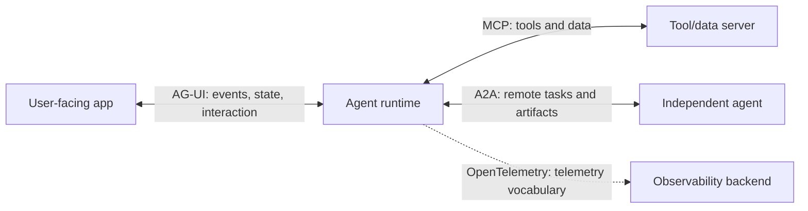

# Agent Protocols and Interface Standards

> **Status:** Research-backed core available.  
> **Last researched:** 2026-08-30  
> **Pinned baselines:** MCP 2026-07-28; A2A 1.0.0; current AG-UI documentation/capability profile must be pinned per implementation.  
> **Evidence:** [Orchestration and protocols research packet](../research/packets/orchestration-and-protocols.md)

Protocols standardize different system boundaries. They can coexist, and none supplies trust, product authorization, durable workflow state, or safe effect semantics by itself.

## Guides

| Guide | Boundary and use |
|---|---|
| [Selecting agent protocols](protocol-selection.md) | Choose and compose MCP, A2A, AG-UI, telemetry, and the application-owned control plane |
| [Model Context Protocol](model-context-protocol.md) | Admit and operate MCP servers/tools/resources securely against the 2026-07-28 baseline |
| [Agent2Agent protocol](agent-to-agent-protocol.md) | Delegate tasks to opaque remote agents with local lifecycle/effect control against A2A 1.0.0 |
| [Agent-user interaction with AG-UI](agent-user-interaction-protocol.md) | Build resumable event streams, state projection, frontend tools, and exact-effect approval UI |

## Boundary summary

| Protocol | Standardizes | Application still owns |
|---|---|---|
| MCP | Agent application ↔ tool/data server | Server admission, authorization, sandboxing, effect safety, workflow durability |
| A2A | Independent agent ↔ independent agent | Peer trust, delegated authority, local task/effect ledger, result verification |
| AG-UI | Agent backend ↔ user application | Durable truth, client authorization, replay policy, safe rendering, approval commit |
| OpenTelemetry GenAI | Instrumentation ↔ telemetry ecosystem | Control flow, privacy policy, stable internal schema, business semantics |

## Remaining research queue

- Conformance results and cross-SDK interoperability for current revisions.
- Protocol gateways, registries, enterprise identity, and revocation at scale.
- Delivery and extension semantics as AG-UI and A2A implementations mature.
- OpenTelemetry GenAI agent conventions when they move beyond Development status.
- MCP compatibility experience after the 2026-07-28 transition.

## Related sections

- [Orchestration](../orchestration/README.md)
- [Tools](../tools/README.md)
- [Security](../security/README.md)
- [Runtime](../runtime/README.md)
- [Evaluation](../evaluation/README.md)
