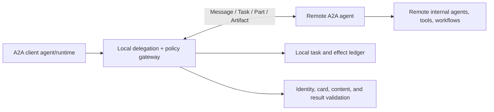
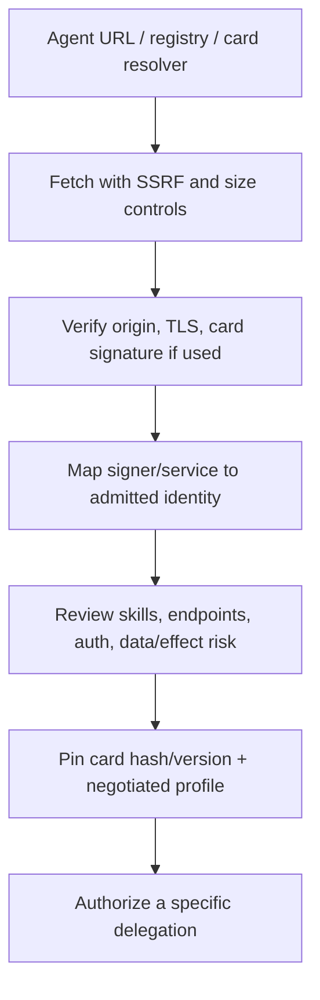
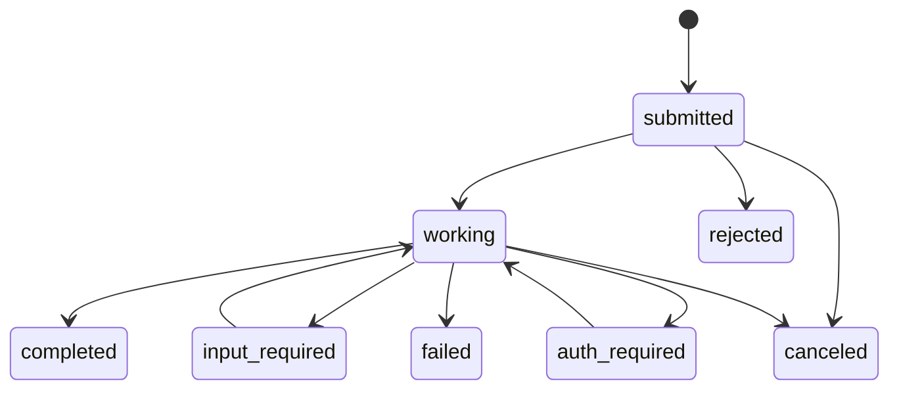
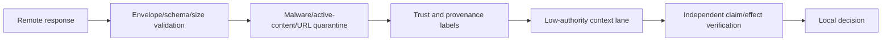

# Agent2Agent (A2A) Protocol

> **Status:** Research-backed draft  
> **Last researched:** 2026-08-30  
> **Pinned baseline:** A2A specification **1.0.0**  
> **Scope:** Safely delegating tasks and exchanging messages/artifacts between independent agent services.  
> **Evidence:** [Orchestration and protocols research packet](../research/packets/orchestration-and-protocols.md)  
> **Section index:** [Agent protocols and interface standards](README.md)

A2A defines an interoperability boundary between independent, potentially opaque agent systems. Treat an A2A peer as an external service—not as a trusted extension of the local reasoning loop or a principal that inherits the caller's permissions.

## Conceptual model

The remote agent's internals can remain opaque. That makes the protocol useful across organizations and frameworks, while requiring a stronger boundary around authority, lifecycle, evidence, and side effects.

## Core objects

| Object | Meaning | Local handling |
|---|---|---|
| AgentCard | Self-description, endpoints, skills, transports, security and capabilities | Discover, authenticate/signature-check, admit, and pin; never trust on description alone |
| Message | Communication with role and typed parts | Validate schema/content; bind to local task and principal |
| Part | Unit of text, data, file, or other payload | Enforce MIME, size, URL, content, and tenant policy |
| Artifact | Output assembled by an agent | Store immutably, verify integrity/provenance, scan active content |
| Task | Stateful unit with lifecycle and messages/artifacts | Map to a local durable task; do not rely on remote record alone |
| Extension | Negotiated additional semantics | Allowlist and version; unknown extensions cannot grant authority |

The 1.0.0 specification supports JSON-RPC, gRPC, and REST bindings plus streaming and push notifications. A common conceptual model does not guarantee identical delivery or intermediary behavior across transports, so qualify each supported profile.

## Discovery and admission

An AgentCard tells the client what the agent claims to support. Even a valid JWS signature establishes integrity and signer identity, not organizational approval or truthfulness. Maintain an admission record with owner, expected origins, permitted skills, transports, auth schemes, data classes, effect classes, quotas, retention, review expiry, and revocation switch.

Treat card URLs and endpoints as untrusted network input. Block loopback, link-local, metadata, private/internal, and disallowed redirect destinations unless a deliberate policy permits them.

## Local delegation envelope

Before sending a message, create a local record containing:

- authenticated local principal, tenant, purpose, and parent run;
- admitted remote identity and pinned AgentCard/capability profile;
- bounded objective and acceptance criteria;
- only the required context/artifacts, each with provenance and sensitivity;
- allowed remote data use and effects;
- token/time/money/call/artifact budgets and deadline;
- local operation/idempotency key and remote `messageId` mapping;
- cancellation and supersession generation;
- expected result/evidence schema and verification policy.

`messageId` may support idempotent send behavior under the specification, but it is not proof that arbitrary downstream business effects are exactly-once. Keep an application-level operation key and reconcile effects independently.

## Task lifecycle

A2A 1.0.0 includes `submitted`, `working`, `input_required`, `auth_required`, `completed`, `failed`, `canceled`, and `rejected`. Preserve the remote state, but normalize it into the local lifecycle and apply stricter transition rules where needed.

### `auth_required` is not authorization

The state is a signal that more authentication/authorization interaction is required; the specification does not by itself define credential scope, validity, revocation, or grant semantics. Prefer out-of-band credential exchange. If credentials must be carried in-band, bind them to the remote origin, task, purpose, audience, scope, and short expiry, and ensure they cannot appear in logs or artifacts.

### Cancellation is best-effort

Cancel is idempotent as an attempt, but cancellation may be unsupported, rejected, or too late. After requesting cancellation:

- mark local state `cancel_requested`, not immediately `canceled`;
- stop accepting new effect proposals from that generation;
- continue bounded polling/reconciliation until terminal or policy timeout;
- fence late local commits;
- record a remote-completed-after-cancel result rather than rewriting history;
- escalate unknown consequential outcomes.

## Delivery choices

| Mode | Strength | Failure modes | Required controls |
|---|---|---|---|
| Synchronous response | Simple | Client timeout while remote keeps working | Operation key and later task query |
| Streaming | Low-latency progress | Disconnect, replay, missing/duplicate chunks | Cursor/sequence, reconnect, bounded buffer, final reconciliation |
| Polling | Client-controlled and firewall-friendly | Load, stale intervals, thundering herd | Backoff/jitter, ETag/version if available, terminal deadline |
| Push notification | Efficient async completion | SSRF, spoofing, duplicate/late delivery, endpoint outage | Pre-registered allowlisted callback, authentication, dedupe, queue and poll fallback |

Push delivery should be treated as at least once. Authenticate callbacks, validate task/tenant/peer mapping, deduplicate event identities or state versions, respond quickly after durable enqueue, and query the authoritative task when an event conflicts or lacks required data.

## Remote content and prompt infection

A remote peer can be compromised, malicious, or simply wrong. Its messages, card text, files, URLs, status messages, and artifacts are untrusted data.

Do not forward remote text into system/developer instructions, automatically invoke requested local tools, or accept remote claims of authorization. Prompt Infection and related multi-agent security research show why a peer message can propagate malicious instructions through otherwise benign agents.

## Identity and delegated authority

Keep three identities separate:

1. **local user/workload principal** requesting the outcome;
2. **local agent/service** making the A2A request;
3. **remote agent/service** performing the task.

Do not send a broad user token to the peer. Use audience-bound delegated credentials or a broker. The remote authorization should be no broader than the local delegation, and any local effect based on the remote result must pass local policy again.

The emerging Bounded Agents work is directionally useful: propagate a verifiable principal/delegation chain, explicit scopes, and budgets. It is a 2026 preprint, not yet a replacement for established OAuth/workload identity and application policy.

## Artifact contract

For every artifact, record:

- immutable local identifier, remote task/message/part lineage, and content hash;
- content type, byte size, encoding, compression, and safe display/download name;
- source peer/card identity and generation time;
- tenant/subject, sensitivity, license/usage, retention, and deletion policy;
- validation/scanning state and whether content is active/executable;
- evidence references and claimed semantics;
- authoritative/non-authoritative status.

Prefer content-addressed/object storage references over copying large artifacts through prompts. Re-fetching a mutable URL after approval creates a time-of-check/time-of-use gap; pin and hash what was reviewed.

## Effects and result verification

The local runtime should classify remote work:

- **advice/evidence:** validate sources and uncertainty;
- **proposal:** compare exact parameters against local state/policy;
- **remote effect:** require remote idempotency/reconciliation evidence and local audit;
- **request for local effect:** treat as untrusted proposal and run normal local authorization/approval;
- **completed task:** verify acceptance criteria; remote terminal state alone is insufficient.

Never grant a remote peer the ability to declare a local business operation complete without authoritative verification.

## Failure and conformance tests

| Scenario | Expected behavior |
|---|---|
| AgentCard changes endpoint/skill/security unexpectedly | Existing pin fails or triggers re-admission |
| Card signature valid but signer not admitted | Rejected |
| Duplicate Send Message / push event | Deduped without duplicate effect |
| Stream disconnects before terminal event | Resume or query task; no guessed terminal state |
| Cancel unsupported or too late | Local fence remains; reconcile final remote state |
| `auth_required` includes credential-harvesting instructions | No credential leakage; trusted auth flow only |
| Remote artifact contains prompt/tool instructions | Quarantined as untrusted content |
| Push URL redirects to internal metadata endpoint | SSRF protection blocks it |
| Remote says “completed” without evidence | Local state remains unverified/partial |
| Cross-tenant task/artifact ID supplied | Authorization rejects access |
| Same business effect retried with new message ID | Application operation ledger detects duplication |

## Readiness checklist

- [ ] A2A 1.0.0 transport/capability profile is pinned and tested.
- [ ] Agent discovery, identity verification, admission, and authorization are separate steps.
- [ ] A local durable task/effect ledger remains authoritative.
- [ ] Delegations carry attenuated authority, budgets, deadlines, and result contracts.
- [ ] `messageId` is not mistaken for universal effect exactly-once behavior.
- [ ] Streaming, polling, and push converge through dedupe and reconciliation.
- [ ] `auth_required` uses a trusted, origin-bound credential flow.
- [ ] Cancellation is modeled as best-effort with a local commit fence.
- [ ] All peer content/artifacts are untrusted, scoped, scanned, and provenance-labeled.
- [ ] Terminal task status is independently checked against acceptance/effect evidence.

## Related guides

- [Protocol selection](protocol-selection.md)
- [Delegation, handoffs, and shared state](../orchestration/delegation-handoffs-and-shared-state.md)
- [Prompt injection and untrusted data](../security/prompt-injection-and-untrusted-data.md)
- [Idempotency and side effects](../reliability/idempotency-and-side-effects.md)
- [Agent threat model](../security/agent-threat-model.md)

## Selected sources

- [A2A specification 1.0.0](https://github.com/a2aproject/A2A/blob/main/docs/specification.md)
- [A2A agent discovery](https://github.com/a2aproject/A2A/blob/main/docs/topics/agent-discovery.md)
- [A2A samples and security warning](https://github.com/a2aproject/a2a-samples)
- [Prompt Infection](https://arxiv.org/abs/2410.07283)
- [Google: Securing multi-agent systems](https://research.google/pubs/securing-multi-agent-systems-an-empirical-analysis-of-security-prompt-hardening-and-residual-risks/)
- [Bounded Agents](https://arxiv.org/abs/2608.15888)

