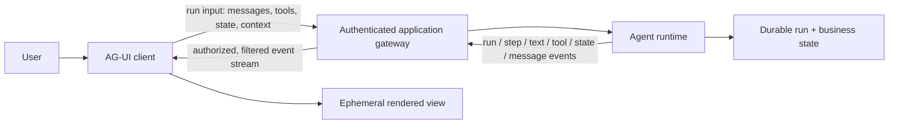
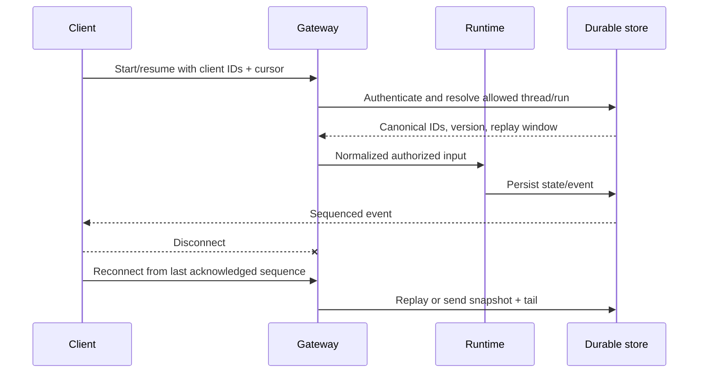
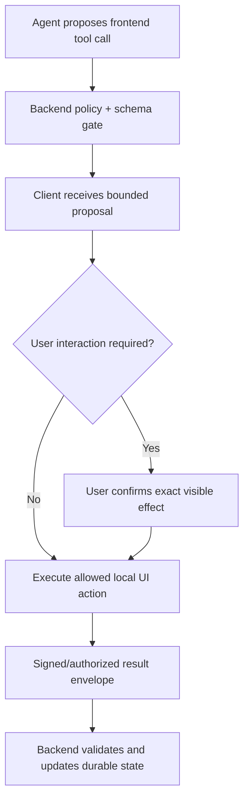

# Agent-User Interaction with AG-UI

> **Status:** Research-backed draft  
> **Last researched:** 2026-08-30  
> **Scope:** Designing secure, resumable, and observable event interaction between an agent backend and a user-facing application using AG-UI concepts.  
> **Evidence:** [Orchestration and protocols research packet](../research/packets/orchestration-and-protocols.md)  
> **Section index:** [Agent protocols and interface standards](README.md)

AG-UI standardizes an event-driven boundary between an agent backend and an interactive application. It is useful for streaming runs, tool activity, state updates, and human input—but the browser/UI is not the authorization authority or durable business-state store.

## Boundary and event families

The documented event model includes run/step lifecycle, text/message content, tool calls/results, state snapshots/deltas, raw and custom events, and human-in-the-loop capabilities. Some generative-UI/meta-event features may be draft or evolving; pin the implementation profile rather than assuming every client/runtime pair behaves identically.

## Three state layers

| Layer | Owner | Examples | Recovery role |
|---|---|---|---|
| Durable business/workflow state | Backend system of record | orders, approvals, effect ledger, run checkpoint | Authoritative after restart |
| Interaction projection | Backend-owned stream/read model | current run status, proposal, tool activity, citations | Rebuilt from durable events/state |
| UI-local state | Client | open panels, cursor, pending text, optimistic animation | Disposable; never grants authority |

AG-UI state snapshot/delta events synchronize a view. They should not become the sole record of permissions, approvals, completed effects, or task progress. A client-supplied state object is input requiring authorization and validation.

## Run identity and replay

Core run inputs can include thread, run, and parent-run identifiers plus messages, tools, context, state, and forwarded properties. Treat all client-supplied IDs and objects as claims.

Use server-generated or server-validated IDs, monotonically ordered sequence numbers within a stream, stable event IDs for dedupe, and a bounded replay window. If replay is unavailable, send a versioned canonical snapshot followed by new events. Do not rely on network order across concurrent producers without a sequencer.

## Delivery semantics

Design for at-least-once reception and interrupted streams:

- persist consequential state before emitting the corresponding event;
- make display events idempotent or deduplicable;
- distinguish ephemeral token deltas from durable message/artifact completion;
- bound client/server buffers and apply backpressure or coalescing;
- heartbeat only to detect connection liveness, not task progress;
- include run generation/version so stale streams cannot update a superseding run;
- reconcile terminal state from the backend after reconnect;
- represent an unknown effect outcome rather than inferring failure from disconnect.

Text-token streams can be lossy if the final canonical message is retrievable. Approval, tool-result, state, and effect events need stronger persistence and replay.

## Frontend-defined tools

AG-UI supports tools defined or executed at the frontend. This can enable UI actions such as navigation, form interaction, or local selection, but “client-side” does not mean safe.

The backend must allowlist tool name/version, validate arguments, bind it to the authenticated session and run, and decide whether user confirmation is required. The client result is untrusted evidence; never let JavaScript claim a protected server-side effect completed without verification.

Separate:

- harmless presentation actions (highlight, scroll, open a panel);
- local data access (clipboard, files, device capabilities);
- navigation or URL opening;
- form mutation or submission;
- protected backend effects.

Each class needs different browser permission, content-security, CSRF, origin, and approval controls.

## Human-in-the-loop interaction

An interrupt or approval UI needs a durable server-side proposal:

| Field | Why |
|---|---|
| proposal ID/hash and run generation | Prevent stale or substituted approval |
| actor, resource, operation, exact parameters | Show what will happen |
| material impact and side effects | Support informed decision |
| supporting evidence and uncertainty | Avoid blind confirmation |
| expiry and current resource version | Prevent time-of-check/time-of-use drift |
| approve/reject/edit options | Make user intent explicit |
| authentication strength | Match impact/risk |

The UI sends a decision referencing the proposal; the backend reauthenticates, verifies version/expiry/current state, records the decision, and only then allows the commit. Editing material parameters creates a new proposal.

## Client input and trust controls

Validate every run-input field:

- thread/run/parent IDs must belong to the authenticated tenant and allowed lineage;
- messages and context are untrusted and size-limited;
- client tool definitions must be allowlisted or namespaced, schema-limited, and non-authoritative;
- state updates require per-field ownership/version checks;
- forwarded properties need an explicit schema—never spread arbitrary fields into provider/tool calls;
- URLs/files/media require allowlists, safe fetch, content scanning, and retention rules;
- custom/raw events must not bypass normal policy, filtering, or telemetry redaction.

Use origin checks, secure cookies/token audience, CSRF protection, Content Security Policy, safe rendering, and tenant-aware channel authorization. Never render model/tool HTML as trusted markup.

## Event schema design

Every consequential event should carry or derive:

- event ID, event type/version, sequence, timestamp source;
- tenant, user/session, thread, run, parent-run, step/tool IDs;
- causal parent/correlation and attempt/generation;
- payload schema version and sensitivity label;
- snapshot/state version or delta precondition;
- terminal/replayability/durability classification;
- trace context without granting trust from trace IDs.

Keep provider-specific token/tool shapes behind a backend adapter. UI code should depend on the application event contract so a model/framework upgrade does not rewrite the security boundary.

## State synchronization

| Pattern | Use | Rule |
|---|---|---|
| Snapshot | Initial load, gap recovery, compaction | Canonical version replaces the projection only after authorization |
| Delta/patch | Efficient live updates | Include base version; reject or recover on mismatch |
| Event replay | Audit and reconnect | Events immutable and ordered within defined scope |
| Optimistic UI | Low-risk reversible interaction | Mark pending; backend accept/reject remains authoritative |
| Client edit | User-owned fields only | Validate field ownership, revision, and conflict policy |

Never apply an unversioned delta after reconnect. A missing event can silently corrupt the projection even when every subsequent delta is syntactically valid.

## Privacy and observability

Measure run start/finish, reconnects, replay counts, stream lag, event size, dropped/coalesced token events, state-version conflicts, tool proposal/approval/commit latency, cancellation lag, and client/runtime errors. Avoid recording raw prompts, message text, tool arguments/results, files, auth tokens, or approval secrets by default.

Keep user-visible status truthful: “requested,” “running,” “waiting for approval,” “cancel requested,” “effect outcome unknown,” and “verified complete” are distinct. Smooth animation must not invent progress.

## Failure and adversarial tests

| Scenario | Expected behavior |
|---|---|
| Client reconnects from an expired cursor | Canonical snapshot + current tail or explicit restart |
| Duplicate approval event | One decision/commit; subsequent event is idempotent |
| Approval arrives after proposal/resource changed | Rejected; new proposal required |
| Stale stream emits after new run generation | UI/backend discard it |
| Client changes protected state field | Authorization/version check rejects it |
| Frontend tool result claims server effect | Backend independently verifies |
| Tool/model returns script or malicious Markdown/URL | Safe renderer and URL policy prevent execution/fetch |
| Event flood or giant custom payload | Quota/backpressure/size limit activates |
| Disconnect occurs after effect request | UI shows unknown/reconciling, not automatic failure/retry |
| Cross-tenant run ID supplied | No existence leak; access denied |

## Readiness checklist

- [ ] Supported AG-UI event/capability profile is pinned.
- [ ] Durable state, interaction projection, and UI-local state are separate.
- [ ] Runs/events have canonical IDs, generations, sequences, and replay rules.
- [ ] Client messages, state, tools, context, and forwarded properties are untrusted.
- [ ] Frontend tool calls are allowlisted and cannot self-authorize backend effects.
- [ ] Approvals bind to an exact, versioned, expiring proposal.
- [ ] Reconnect handles duplicate, missing, stale, and out-of-order events.
- [ ] Safe rendering, origin/CSRF/CSP, artifact, and tenant controls are tested.
- [ ] UI status distinguishes requested, attempted, unknown, and verified states.

## Related guides

- [Protocol selection](protocol-selection.md)
- [Run controls](../runtime/run-controls.md)
- [Durable execution](../runtime/durable-execution.md)
- [Agent state and event contracts](../runtime/agent-state-and-event-contracts.md)
- [Prompt injection and untrusted data](../security/prompt-injection-and-untrusted-data.md)
- [Observability and tracing](../evaluation/observability-and-tracing.md)
- [Interactive and long-running reference architectures](../architectures/interactive-and-long-running-reference-architectures.md)
- [Production agent control plane](../architectures/production-agent-control-plane.md)

## Selected sources

- [AG-UI architecture](https://docs.ag-ui.com/concepts/architecture)
- [AG-UI tools](https://docs.ag-ui.com/concepts/tools)
- [AG-UI capabilities](https://docs.ag-ui.com/concepts/capabilities)
- [AG-UI core types](https://docs.ag-ui.com/sdk/js/core/types)
