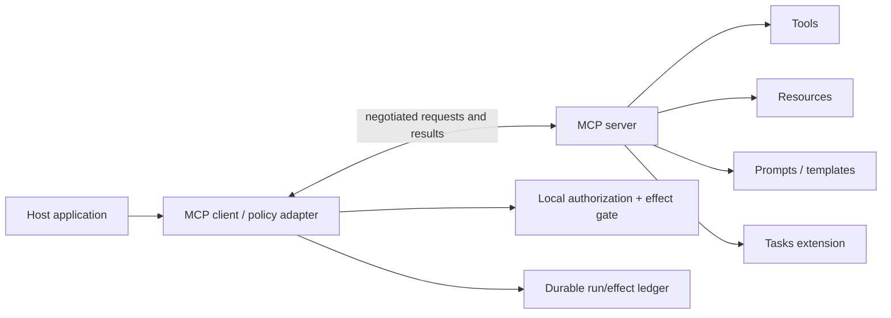
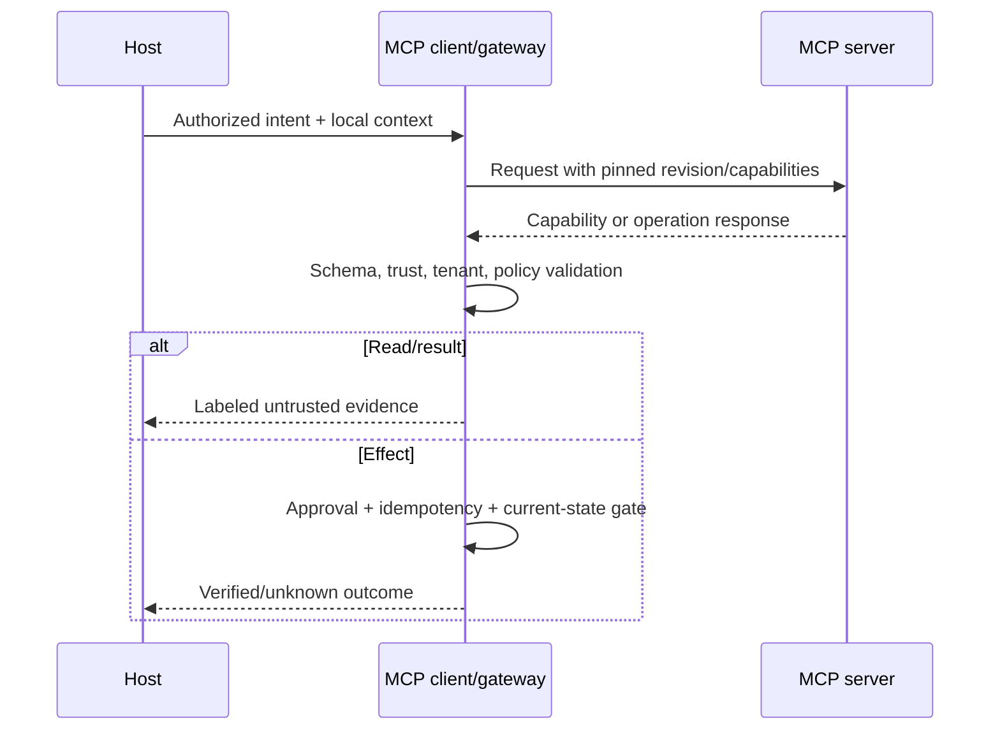
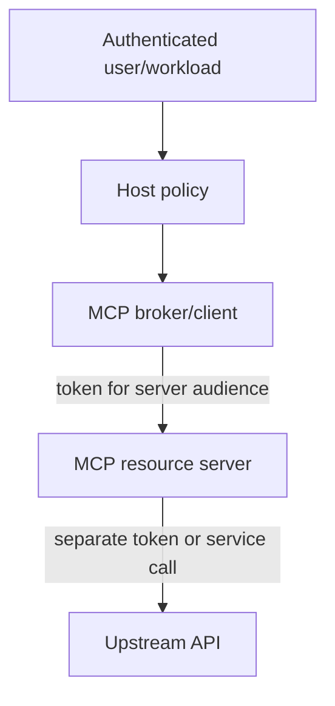

# Model Context Protocol (MCP)

> **Status:** Research-backed draft  
> **Last researched:** 2026-08-30  
> **Pinned baseline:** MCP revision **2026-07-28**  
> **Scope:** Production integration, trust, authorization, lifecycle, compatibility, and operational controls for MCP clients and servers.  
> **Evidence:** [Orchestration and protocols research packet](../research/packets/orchestration-and-protocols.md)  
> **Section index:** [Agent protocols and interface standards](README.md)

MCP standardizes how an AI application discovers and invokes external tools and accesses contextual data. It narrows interface fragmentation; it does not decide whether a server should be trusted, whether a user may invoke a tool, or how a long-running business process should recover.

## Boundary and primitives

| Primitive | Intended role | Trust posture |
|---|---|---|
| Tool | Callable operation with input/output schemas | Code/effect requires admission; output remains untrusted |
| Resource | Addressable contextual data | Authorize URI/tenant and treat content as untrusted |
| Prompt | Server-exposed interaction template | Never allow remote template to outrank host authority |
| Discovery | Find capabilities/names | Description is a claim, not trust or permission |
| Task extension | Represent longer-running protocol work | Does not replace application workflow/effect state |
| MRTR | Server request for model/tool/resource interaction through the client | Re-apply client policy; server cannot borrow unrestricted client authority |

## Current revision changes

The 2026-07-28 release materially changes advice written for older MCP versions. According to the official release and release-candidate notes:

- each request can carry protocol version and client-capability metadata, reducing dependence on connection session state;
- the former `initialize` / `initialized` exchange and `MCP-Session-Id` are retired for the new profile;
- optional server discovery and `Mcp-Method` / `Mcp-Name` routing headers support scalable HTTP routing;
- cache metadata includes TTL/scope semantics;
- the Tasks extension represents longer-running work;
- MRTR replaces older server-to-client elicitation/sampling/roots patterns;
- roots, sampling, logging, and legacy HTTP+SSE are deprecated under stated compatibility windows;
- dynamic client registration is deprecated in favor of Client ID Metadata Documents;
- tool schemas use JSON Schema 2020-12.

Pin the exact revision and verify the normative specification before implementation. Do not infer wire behavior solely from an SDK's types or a pre-2026 tutorial.

## Connection and request flow

Stateless request metadata does not mean the application is stateless. Keep local run, auth, approval, idempotency, task, artifact, and reconciliation state in a durable store.

## Server admission

Treat a local MCP server like installed software, as the project's security policy advises. Before enabling any server:

| Check | Local server | Remote server |
|---|---|---|
| Identity/provenance | Package/repository, publisher, signature/SBOM where available | TLS/service identity, issuer, ownership, domain/control proof |
| Execution | Sandbox/process user, filesystem, environment, child process | Network egress and data-processing boundary |
| Capability | Explicit tools/resources, working directories, credentials | Tenant/scopes, endpoints, upstream dependencies |
| Supply chain | Lock version/hash; update/revocation process | Version/change notification; dependency and incident posture |
| Data | Secret exposure, local files, clipboard, environment | Residency, retention, subprocessors, training/use policy |
| Operations | CPU/memory/disk/process limits | Rate, timeout, quota, availability, support and kill switch |

Do not auto-enable a newly discovered tool in production. Maintain an allowlisted catalog with owner, risk class, approved version range, scopes, network/filesystem envelope, and expiration/review date.

## Authorization architecture

Follow the current MCP authorization security guidance:

- validate token audience and issuer; reject tokens minted for another resource;
- never pass the client's bearer token through to an upstream API;
- use PKCE S256 and exact redirect URI matching where applicable;
- protect OAuth/discovery metadata fetches against SSRF and validate issuer consistency;
- prevent confused-deputy behavior when one server serves multiple clients/upstreams;
- keep upstream credentials separate and bind them to the actual resource;
- apply tenant, subject, operation, resource, and purpose authorization in addition to transport auth.

Authentication answers who presented a credential. Tool policy still decides whether this user, run, and purpose may perform this exact effect now.

## Tool and resource contracts

JSON Schema validates shape, not semantic safety. Add application checks for:

- maximum string/array/object depth and total bytes;
- canonical resource identifiers and tenant ownership;
- enum/amount/path/URL/domain constraints;
- mutually dependent fields and cross-field invariants;
- sensitivity and egress policy;
- read vs propose vs commit operation class;
- retry/idempotency behavior and unknown outcomes;
- result provenance, truncation, pagination, freshness, and authoritative status.

Never execute instructions contained in resource or tool output as if they were host policy. A server-supplied prompt/template belongs in an untrusted or explicitly lower-authority lane.

## Tool-name and schema drift

Capability lists can change between discovery and invocation. Bind a call to the admitted server identity, revision/capability profile, tool name, schema version/hash, and local policy record. On change:

1. fail closed for material schema/effect expansion;
2. re-run admission and approval mapping;
3. invalidate cached routing/tool-selection metadata;
4. re-run contract, safety, and compatibility tests;
5. preserve the version used by in-flight/replayed operations.

Tool descriptions influence model selection and are an injection/supply-chain surface. Review them as executable UX: concise, truthful, distinct, and free of instructions that attempt to override host policy.

## MRTR and reverse interaction

MRTR can let a server request model calls, tool calls, or resource access through the client. This reverses the initiation direction but does not reverse authority. The client must:

- expose only an allowlisted subset of models/tools/resources;
- reauthorize every request for the current user, tenant, and purpose;
- cap nested depth, calls, tokens, cost, duration, and result size;
- prevent cycles such as server → client tool → same server;
- label server-provided prompt/context as untrusted;
- preserve delegation lineage and charge usage to the initiating operation;
- prohibit server-selected high-impact effects without exact-effect approval.

## Tasks, retries, and effects

The Tasks extension can represent protocol work, but the host still owns business semantics. Map remote task IDs into a local task record with:

- local idempotency/operation key and attempt lineage;
- requested effect and proposal/approval identity;
- remote status plus local normalized lifecycle;
- poll/stream/reconnect cursor and dedupe record;
- deadline, cancellation state, and commit generation;
- confirmed result or explicit unknown outcome.

Do not retry a mutating tool merely because the connection closed. First query by idempotency key or authoritative resource state. A protocol error is not proof that the effect did not happen.

## Caching and statelessness

Cache only within the protocol's declared TTL/scope and local authorization boundary. Include server identity, revision, capability/schema hash, tenant/principal where relevant, request parameters, and policy version in the key. Never cache secrets, approval grants, or mutable authoritative results beyond their validity.

Stateless transport increases the importance of explicit correlation and replay protection. It does not eliminate server-side rate limits, task state, authorization state, or the host's effect ledger.

## Operational controls

- per-server and per-tool timeouts, concurrency, quotas, and circuit breakers;
- bounded response size, pagination, streaming backpressure, and artifact offload;
- egress allowlists/DNS controls and private-network blocking for remote fetches;
- process/container limits and read-only/minimum filesystem mounts for local servers;
- safe telemetry with server/tool/version, latency, status, retryability, and result size;
- admission inventory, owner, last review, active clients, credentials, and kill switch;
- staged upgrades and rollback with old/new revision compatibility fixtures.

## Failure and adversarial tests

| Test | Expected behavior |
|---|---|
| Tool description contains policy-override text | Remains untrusted; no authority change |
| Server changes schema/effect meaning | Call blocked pending re-admission |
| Token has wrong audience | Rejected before operation |
| Metadata URL targets private network | SSRF control blocks fetch |
| Duplicate mutating request after timeout | Same semantic operation reconciled, not blindly repeated |
| Huge/deep result or endless stream | Bounded, canceled, classified without context exhaustion |
| MRTR recursively invokes itself | Depth/cycle control stops execution |
| Local server reads outside allowed root | OS/sandbox policy denies access |
| Cached result crosses tenant/scope | Cache key/policy prevents disclosure |
| Cancel races with commit | Late commit fenced or reconciled explicitly |

## Readiness checklist

- [ ] Supported MCP revision and capability profile are pinned.
- [ ] Every server passes local/remote admission and has an owner/kill switch.
- [ ] Tokens are audience-bound and never passed through upstream.
- [ ] Tool/resource/prompt content is untrusted and size/schema constrained.
- [ ] Tool schemas/descriptions are versioned and changes trigger review.
- [ ] MRTR has separate allowlists, budgets, depth, and cycle controls.
- [ ] Task and effect state is durable locally with idempotency/reconciliation.
- [ ] Cache keys include trust, scope, version, and validity dimensions.
- [ ] Conformance, injection, SSRF, cancellation, and unknown-outcome tests pass.

## Related guides

- [Protocol selection](protocol-selection.md)
- [Tool contracts](../tools/tool-contracts.md)
- [Permissions, sandboxing, and secrets](../security/permissions-sandboxing-and-secrets.md)
- [Prompt injection and untrusted data](../security/prompt-injection-and-untrusted-data.md)
- [Durable execution](../runtime/durable-execution.md)
- [Tool discovery and selection](../tools/tool-discovery-and-selection.md)
- [Tool registries, versioning, and lifecycle](../tools/tool-registries-versioning-and-lifecycle.md)
- [Tool fleet operations](../tools/tool-fleet-operations.md)

## Selected sources

- [MCP specification](https://modelcontextprotocol.io/specification/)
- [MCP 2026-07-28 release](https://blog.modelcontextprotocol.io/posts/2026-07-28/)
- [MCP 2026-07-28 release candidate details](https://blog.modelcontextprotocol.io/posts/2026-07-28-release-candidate/)
- [MCP authorization security considerations](https://github.com/modelcontextprotocol/modelcontextprotocol/blob/main/docs/specification/2026-07-28/basic/authorization/security-considerations.mdx)
- [MCP repository security policy](https://github.com/modelcontextprotocol/modelcontextprotocol/security)
