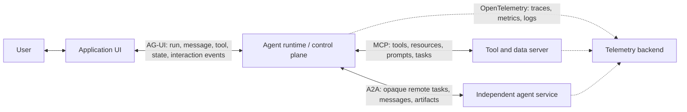
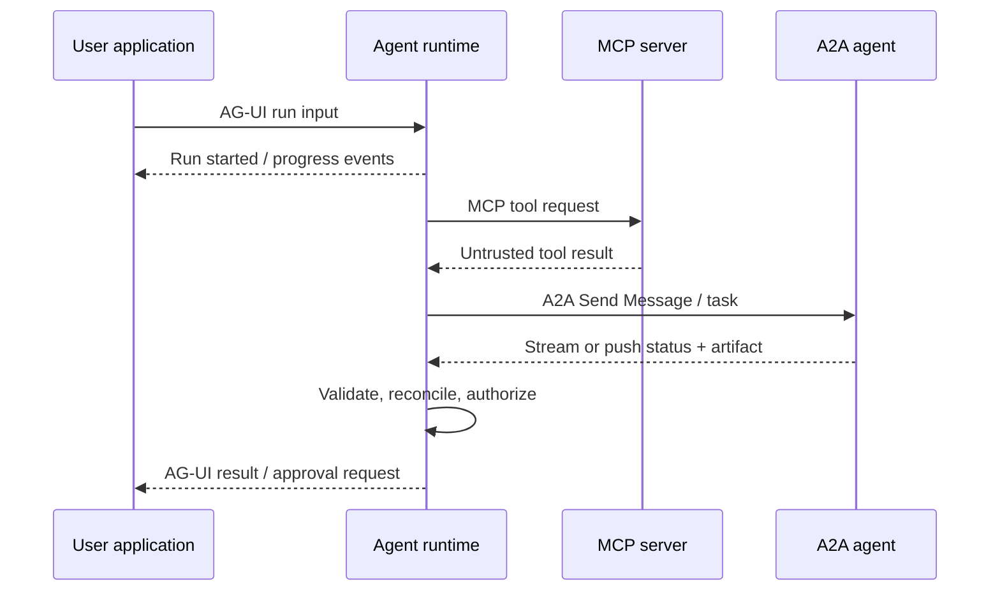
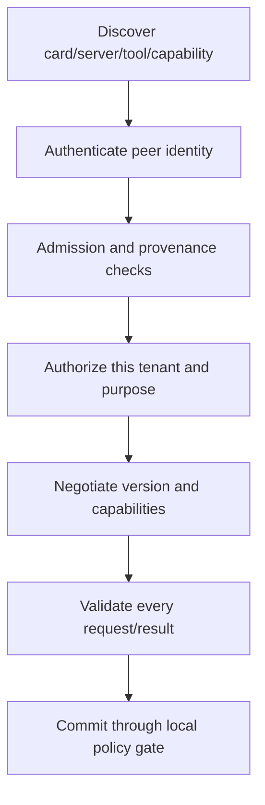
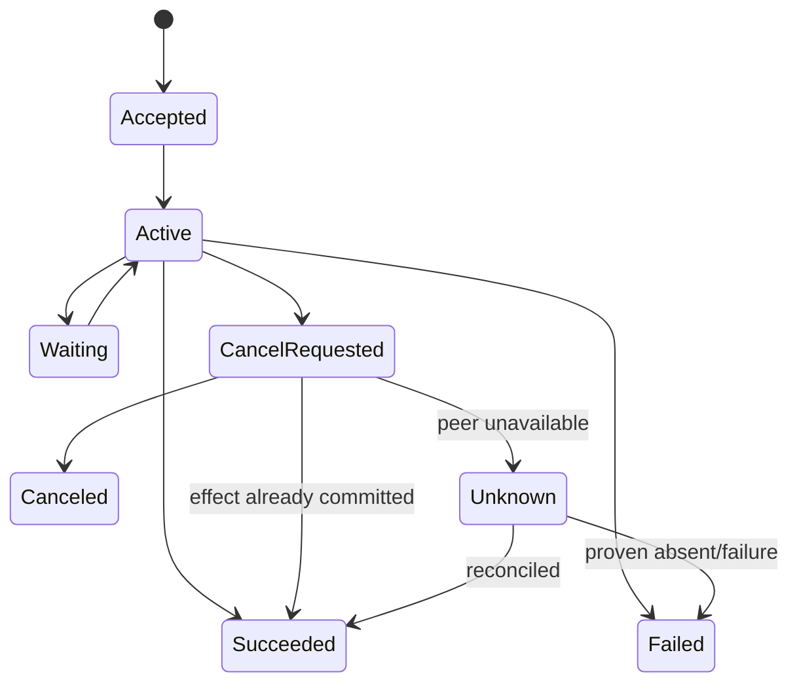

# Selecting Agent Protocols

> **Status:** Research-backed draft  
> **Last researched:** 2026-08-30  
> **Scope:** Choosing and composing MCP, A2A, AG-UI, and OpenTelemetry at their intended architectural boundaries.  
> **Evidence:** [Orchestration and protocols research packet](../research/packets/orchestration-and-protocols.md)  
> **Section index:** [Agent protocols and interface standards](README.md)

Agent protocols standardize different edges of a system. They can reduce bespoke integration, but none establishes trust, defines product authorization, guarantees durable execution, or replaces orchestration.

## Boundary map

## Decision table

| Need | Use | Do not assume |
|---|---|---|
| Expose tools or data from a server to an agent application | **MCP** | The server/tool is safe, authorized, sandboxed, or durable |
| Delegate a stateful task to an independent/opaque agent service | **A2A** | Discovery proves trust, cancel always succeeds, or remote effects are exactly-once |
| Stream an agent run and interactive state/tool/approval events to a user interface | **AG-UI** | UI state is authoritative, the browser may authorize itself, or delivery is durable |
| Emit standardized model/agent telemetry | **OpenTelemetry GenAI conventions** | Telemetry controls execution or its evolving schema is stable forever |
| Define internal branches, retries, joins, budgets, and checkpoints | **Workflow/orchestrator** | Any of the above protocols supplies the control plane |
| Enforce resource/action permission | **Policy and capability layer** | Protocol conformance implies authorization |

## Protocols can compose

A production interaction may cross all three boundaries:

The runtime remains responsible for tenant binding, state, budgets, approval, idempotency, and final effect reconciliation across every edge.

## Cross-protocol contract

Build a protocol-neutral internal envelope and adapters around it:

| Concern | Internal requirement |
|---|---|
| Identity | authenticated principal, tenant, subject, peer/service identity |
| Authority | scopes/capabilities, purpose, resource bounds, expiry, delegation lineage |
| Correlation | local run/task/attempt/operation IDs mapped to protocol IDs |
| Lifecycle | accepted, queued, active, waiting, terminal, canceled, superseded, unknown |
| Delivery | sequence, dedupe key, replay cursor, acknowledgement and retention rules |
| Effects | idempotency key, proposal/approval identity, outcome and reconciliation status |
| Content | schema, size, MIME/media, provenance, sensitivity and trust classification |
| Budget | deadline, tokens, money, calls, concurrency and artifact limits |
| Observability | trace links and safe event attributes without raw sensitive content |

Do not expose provider/framework objects as the system of record. The adapter can translate them into a stable application model and preserve unknown extension fields for forward compatibility.

## Trust is separate from discovery

A signed AgentCard can provide integrity and signer identity; it does not say the signer is approved for this tenant or that advertised code is safe. An MCP tool schema can validate shape; it does not validate intent or effect. An AG-UI client can request a tool call; it cannot grant its own permission.

## Version and capability strategy

Protocols are evolving on different timelines. For each connection:

1. pin supported normative revision(s) and transport profile;
2. negotiate or discover capabilities explicitly;
3. reject incompatible mandatory behavior clearly;
4. ignore or preserve unknown optional fields according to the specification;
5. isolate protocol mapping from domain logic;
6. run conformance plus product-policy tests in both directions;
7. record peer revision/capabilities on traces and task records;
8. set a deprecation and compatibility-window policy.

Never branch business authorization on a user-controlled version string. Normalize to the internal envelope, then apply policy.

## Delivery and lifecycle normalization

Streaming, push, and polling are delivery choices—not different business truth. Normalize all of them into one durable task state machine:

The local runtime owns transition validity and keeps protocol-specific states as evidence. It must tolerate duplicate push events, reconnect/replay, out-of-order delivery, stream interruption, and a terminal result arriving after local cancellation.

## Security baseline for every edge

- authenticate the peer and bind it to a tenant/purpose;
- validate audience/issuer and never pass tokens through to unintended services;
- restrict network destinations and defend discovery/metadata/webhook fetches against SSRF;
- validate size, nesting, media type, schema, URL, and artifact integrity;
- treat messages, tool output, cards, prompts, UI state, and files as untrusted content;
- quarantine or sandbox executable/active content;
- rate-limit by principal, tenant, endpoint, tool/task class, and cost;
- redact telemetry and avoid secrets in prompts, events, URLs, or cards;
- enforce exact-effect approval and policy at the final tool/commit boundary;
- maintain an incident kill switch and peer/tool revocation path.

## Adapter and gateway pattern

Use a gateway when multiple teams, versions, or trust zones share the protocols. It may handle peer admission, authentication, schema/size controls, quotas, egress allowlists, capability attenuation, version translation, audit, and observability. It must not silently reinterpret effect semantics or claim exactly-once delivery.

Prefer transparent failure over semantic invention. For example, if a remote protocol cannot represent “outcome unknown,” keep that state locally rather than mapping it to “failed” and causing a duplicate write.

## Anti-patterns

| Anti-pattern | Why it fails |
|---|---|
| “MCP makes every tool safe to install” | Local servers can have installed-software-level access; remote output is untrusted |
| Use A2A for in-process helper functions | Adds distributed lifecycle and trust overhead without independence benefit |
| Use MCP as multi-agent conversation | Its primary boundary is tools/data, not opaque peer task ownership |
| Store business truth only in AG-UI events | Reconnect, client tampering, and retention can lose or corrupt state |
| Let protocol IDs be database idempotency keys globally | Peers may not share uniqueness or retry semantics |
| Trust capability discovery | Self-description is not admission or authorization |
| One universal access token across edges | Enables confused-deputy and token-passthrough failures |
| Hide every integration behind the lowest common denominator | Loses important lifecycle/security semantics and blocks upgrades |

## Conformance test matrix

| Layer | Required tests |
|---|---|
| Envelope | Missing/unknown fields, invalid types, huge/deep payloads, incompatible versions |
| Identity/auth | Wrong audience/issuer/tenant, expired token, confused deputy, key rotation |
| Delivery | Duplicate, missing, late, reordered, replayed, interrupted, and forged events |
| Lifecycle | Invalid transitions, cancel races, terminal conflicts, resume after restart |
| Effects | Same semantic operation under retries, unknown outcome, stale approval, superseded run |
| Content | Injection, malicious URL/file/card, cross-tenant artifact, active content |
| Operations | Peer outage, quota, backpressure, time drift, partial dependency failure |

## Readiness checklist

- [ ] Each protocol is used at its intended boundary.
- [ ] An application-owned envelope and durable state model sit behind adapters.
- [ ] Version, transport, and capability profiles are pinned and traced.
- [ ] Discovery is followed by identity, admission, authorization, and validation.
- [ ] Delivery modes converge on one lifecycle with dedupe/replay rules.
- [ ] Protocol output is treated as untrusted and effect policy is enforced locally.
- [ ] Cancellation races and unknown outcomes are represented explicitly.
- [ ] Conformance and adversarial tests cover each supported peer/version.

## Related guides

- [Model Context Protocol](model-context-protocol.md)
- [Agent2Agent protocol](agent-to-agent-protocol.md)
- [Agent-user interaction with AG-UI](agent-user-interaction-protocol.md)
- [Delegation, handoffs, and shared state](../orchestration/delegation-handoffs-and-shared-state.md)
- [Tool contracts](../tools/tool-contracts.md)

## Selected sources

- [MCP specification](https://modelcontextprotocol.io/specification/)
- [A2A specification](https://github.com/a2aproject/A2A/blob/main/docs/specification.md)
- [AG-UI documentation](https://docs.ag-ui.com/)
- [OpenTelemetry GenAI semantic conventions](https://opentelemetry.io/docs/specs/semconv/gen-ai/)

