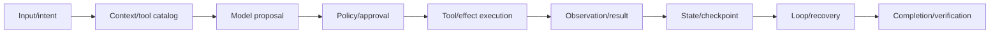
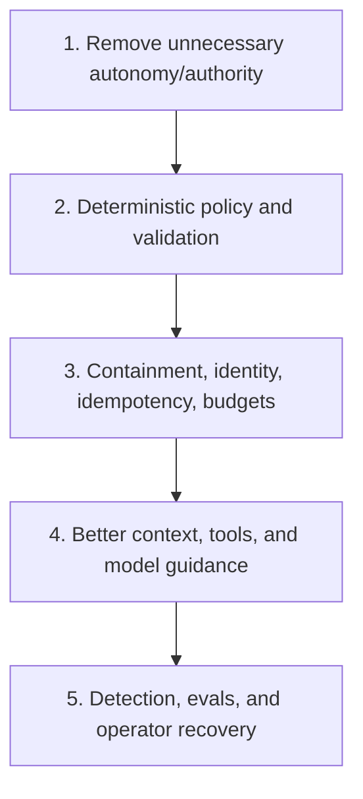

# Agent Runtime Failure Taxonomy

> **Status:** Research-backed draft  
> **Last researched:** 2026-08-30  
> **Scope:** First-order failures in bounded tool-using agent runtimes; memory, multi-agent, security, and provider-specific catalogs will deepen separately  
> **Research packet:** [Core agent loop and runtime boundary](../research/packets/core-agent-runtime.md)

## Use this catalog

Do not start incident analysis with “the model is bad.” Locate the failed boundary: intent, context, proposal, policy, execution, observation, state, recovery, or completion.

## Triage priorities

1. **Contain:** stop scheduling, fence commits, revoke leases/scopes, isolate affected tenant/workspace.
2. **Establish effects:** what actually changed externally? Reconcile unknown outcomes by operation ID.
3. **Preserve evidence:** trace, policy, tool versions, state/checkpoints, provider IDs, approvals, receipts.
4. **Classify boundary:** use the catalog below.
5. **Recover safely:** resume only from a proven boundary; compensate or escalate partial effects.
6. **Prevent recurrence:** add a deterministic guard, narrower authority, better contract, or eval—not only a prompt sentence.

## Failure catalog

### Intent, context, and tool surface

| Failure | Typical root causes | Detect | Prevent | Recover |
|---|---|---|---|---|
| Ambiguous objective silently assumed | Missing clarification contract; pressure to act | Divergent repeated trajectories; user correction | Require clarification/escalation for materially different interpretations | Pause before effects; present assumptions |
| Context drift | Long history, irrelevant observations, conflicting instructions | Goal/constraint checks degrade over turns | Context manifest, priority rules, periodic objective restatement, evals | Rebuild context from authoritative session state |
| Compaction loses critical state | Summary-only continuity; IDs/results omitted | Post-compaction failures spike; missing references | Preserve structured run state, unresolved obligations, receipts outside summary | Reload artifacts/checkpoints; do not guess |
| Tool not discovered | Catalog too large, weak metadata/ranking, authorization filter error | Suitable tool exists but never becomes eligible/called | Task-scoped catalog, evaluated lazy discovery, namespacing | Expose missing capability or escalate |
| Wrong tool selected | Confusable names/descriptions; too many overlapping tools | Selection eval and trace mismatch | Merge/rename tools, negative usage guidance, task-scoped availability | Return non-effectful correction; prevent commit |
| Capability hallucination | Tool absent or model invents a name | Unknown tool call | Strict registry and bounded model-visible error | Offer real alternatives; consume retry budget |
| Tool schema/result overflow | Huge definitions or raw results | Context/token spikes, truncation, degraded selection | Lazy tools, paging, artifacts, result budgets | Store artifact; return compact summary/cursor |

### Proposal, policy, and approval

| Failure | Typical root causes | Detect | Prevent | Recover |
|---|---|---|---|---|
| Malformed tool arguments | Weak schema, provider mismatch, ambiguous fields | Validation error | Strict schema, domain types, field descriptions | Model-visible correction within per-tool budget |
| Structurally valid but semantically invalid action | Schema mistaken for business validation | Domain conflict/failed precondition | Domain and freshness validation after schema | Refresh state and replan |
| Unauthorized resource access | Tool visibility mistaken for authorization; model supplies tenant ID | Policy denial or audit anomaly | Runtime-owned identity, resource-level auth, least privilege | Deny; investigate attempted cross-boundary access |
| Prompt-only guardrail bypass | Security rule exists only in instructions | Forbidden proposal reaches executor | Deterministic policy and sandbox boundary | Fence/deny; inspect context for injection |
| Approval fatigue | Too many prompts; poor action preview | Very high approval rate, low review time | Containment, risk-tiered approval, exact previews | Revoke broad approvals; review recent effects |
| Stale approval | Target/policy/identity changed during wait | Version mismatch at commit | Expiry, expected version, commit-time revalidation | Re-request approval on current action |
| Approval sibling leak | Parallel branch continues effects while one waits | Trace shows commits during pause | Define branch/barrier semantics; block risky siblings | Cancel/fence siblings; reconcile effects |
| Permission escalation via nested agent/tool | Child inherits ambient parent authority | Child trace uses unrelated high-risk tool | Narrow child control domains and credentials | Cancel child; revoke credentials; audit effects |

### Tool execution and effects

| Failure | Typical root causes | Detect | Prevent | Recover |
|---|---|---|---|---|
| Duplicate side effect | Retry/replay/duplicate delivery with new or absent key | Multiple receipts/business records | Stable operation ID, downstream dedup, effect ledger | Reconcile and compensate if possible |
| Unknown effect outcome | Commit succeeded but response/checkpoint was lost | No local receipt; timeout/crash at boundary | Queryable operation ID/status, durable receipt | Reconcile; never blind retry |
| Retry storm | Nested transport/tool/model/workflow retries | Attempt count far exceeds configured expectation | Inventory layers, root retry budget, circuit breaker | Stop, fence effects, resolve underlying deterministic error |
| Timeout zombie | Caller stops waiting but thread/process/remote job continues | Work/commit after timeout | Cooperative cancel plus process/job control and commit fence | Kill/cancel; reconcile late effects |
| Cancellation ignored | Signal not propagated or tool is uncooperative | Post-cancel calls/events | Root control domain, descendant signals, leases/fencing | Revoke lease/scope; reject late result |
| Parallel race | Independent scheduling over shared state | Conflicts, lost update, nondeterministic result | Dependency analysis, versions/locks, serialize writes | Re-read state; compensate/replan |
| Partial parallel commit | Some sibling effects succeed before failure | Mixed receipts | Transaction/saga design, per-branch receipts, safe ordering | Compensate or return explicit partial state |
| Tool result lies or is stale | Untrusted server, cache, wrong source, stale read | Provenance/freshness mismatch | Trust registry, signed/attributed results, timestamps, validation | Re-fetch authoritative source; quarantine server |
| Secret leakage in arguments/result | Ambient credentials, raw logs, overbroad tracing | DLP/audit alert | Scoped credentials, redaction, content minimization | Revoke/rotate secret; purge where possible; incident response |

### State, durability, and recovery

| Failure | Typical root causes | Detect | Prevent | Recover |
|---|---|---|---|---|
| State lost on process restart | In-memory run/session only | Missing run or restarts from beginning | Durable run/session state at semantic boundaries | Restart only if effects are reconciled |
| Checkpoint says incomplete after effect committed | Non-atomic external effect and local state | Unknown effect at replay | Idempotent effect/receipt lookup | Reconcile by operation ID |
| Nondeterministic workflow replay | Model/time/I/O inside deterministic orchestration | Replay mismatch or corrupted transition | Activities/steps for nondeterminism; versioned workflow | Pin/migrate worker; manual repair |
| Concurrent resume/zombie worker | Duplicate event or mistaken worker failover | Conflicting owners/checkpoints | Idempotent resume, leases/fencing, workflow IDs | Park/reject stale owner; preserve winning outcome |
| Serialization/schema drift | Tool/error/run state changed across versions | Deserialization or adapter failure | Versioned schemas, compatibility tests, migration | Run migration or pin compatible worker |
| Live stream lost while run continues | Transport treated as durable state | Client misses events after reconnect | Durable semantic event log plus cursor | Rebuild UI from durable events/final artifact |
| Approval state lost | Interruption stored only in memory/client | Run cannot safely resume | Durable interruption with exact call ID and scope | Recreate review from persisted proposal; do not auto-approve |

### Loop and completion

| Failure | Typical root causes | Detect | Prevent | Recover |
|---|---|---|---|---|
| Infinite/repeated tool loop | No structural limit; result does not create new information; weak stop contract | Same normalized action cycle | Turn/tool/cost limits, repeated-action detector, precise observations | Stop with loop reason; expose evidence gap |
| Runaway tokens/cost | Large context/results, nested agents, retries | Budget slope and high tail | Root budgets, result reduction, lazy tools, child quotas | Cancel/fence; deliver safe partial result |
| Premature completion | Context pressure, vague success, model self-declaration | Verification fails or obligations remain | Explicit completion contract and verifier | Continue within budget or mark partial |
| False failure after success | Receipt not recorded/recognized | External state correct but terminal status failed | Authoritative verification and effect ledger | Reconcile and correct terminal record |
| Silent partial failure | Framework/tool returns success envelope despite missing branch/data | Trace gaps, absent required artifact | Required result schema and completeness fields | Mark partial; recover only missing work |
| Stale plan | Environment changed but agent follows original decomposition | Actions conflict with current state | Plans as revisable artifacts; freshness triggers | Re-observe and replan, preserving completed receipts |
| Verification loop | Validator gives vague rejection; no progress measure | Repeated revision with same score/error | Actionable criteria, max revisions, deterministic checks first | Return best partial plus failed criteria |
| Incorrect fallback success | Provider/model switch changes tool/output behavior | Quality/policy regression after fallback | Per-provider compatibility eval and schema normalization | Re-run safe verification; do not repeat effects |

## Failure signatures in traces

| Signature | Likely class |
|---|---|
| Same normalized call, unchanged state delta | Tool loop or stale observation |
| High model turns, low tool count, repeated plan | Planning/completion failure |
| Low turns, very high tool count | Parallel/tool storm |
| Many hidden transport attempts | Retry amplification below agent layer |
| Commit receipt after cancellation timestamp | Cancellation fence failure |
| Approval timestamp precedes target version change | Stale approval |
| Recovery calls same effect with new operation ID | Idempotency identity failure |
| Final success with missing required trace/artifact | Silent partial or weak verifier |
| Failures begin after compaction boundary | Context continuity loss |
| Failures cluster by tool/schema version | Contract or deployment mismatch |

## Evidence to preserve

- run/session/tenant and parent-child lineage;
- model/provider/prompt/tool/policy/runtime versions;
- context manifest and compaction events;
- eligible tools and normalized proposals;
- policy/approval decisions and target versions;
- operation IDs, attempts, receipts, and external status;
- cancellation/deadline/lease timeline;
- checkpoints, replay, resume, and migration events;
- budget counters and terminal reason;
- completion-verification inputs and results.

Avoid requiring hidden chain-of-thought. Observable proposals, actions, state transitions, and evidence are enough for engineering diagnosis and are more stable across providers.

## Prevention hierarchy

Prompt changes are useful but sit below hard architectural controls for effects and security.

## Release-gate scenarios

- [ ] Same task repeated across seeds/models/provider snapshots.
- [ ] Wrong, missing, and confusable tool availability.
- [ ] Malformed, huge, injected, stale, and contradictory tool output.
- [ ] Provider/tool rate limits, timeout, and partial response.
- [ ] Duplicate queue/resume/tool delivery.
- [ ] Crash before and after external commit.
- [ ] Cancellation/timeout with uncooperative and remote work.
- [ ] Approval rejection, expiry, duplicate decision, and target change.
- [ ] Parallel sibling failure and partial commit.
- [ ] Context compaction and session resume.
- [ ] Code/tool/policy schema version change with active run.
- [ ] Budget exhaustion at each layer.
- [ ] Completion claim with missing or incorrect artifact/state.

## Signals that architecture—not prompting—must change

- A failure can create an irreversible effect before deterministic validation.
- Recovery cannot answer whether an effect happened.
- Cancellation cannot prevent late commits.
- Most successful runs follow one stable sequence.
- Tool selection errors persist after description/schema evals.
- Context regularly contains raw data the model rarely needs.
- Subagents consume unbounded root authority or cost.
- Operators cannot reconstruct a terminal decision from traces.
- Approval is too frequent for meaningful attention.
- A provider fallback changes business semantics.

## Related guides

- [Agentic systems](../foundations/agentic-systems.md)
- [The production agent loop](../foundations/agent-loop.md)
- [Run controls](../runtime/run-controls.md)
- [Durable execution](../runtime/durable-execution.md)
- [Idempotency and side effects](idempotency-and-side-effects.md)
- [Agent threat model](../security/agent-threat-model.md)
- [Evaluation-driven development](../evaluation/evaluation-driven-development.md)
- [Observability and tracing](../evaluation/observability-and-tracing.md)
- [Context and memory](../context-memory/README.md)

## Research notes

The catalog combines failure categories observed in [AgentBench](https://arxiv.org/abs/2308.03688), repeated reliability concerns in [τ-bench](https://proceedings.iclr.cc/paper_files/paper/2025/hash/1b126cc38b8638e07bef37e7b2bb72bf-Abstract-Conference.html), production reports from Anthropic, explicit SDK/runtime semantics, and selected version-specific issues documented in the [research packet](../research/packets/core-agent-runtime.md). Issue-derived failures are treated as test cases, not prevalence estimates.
