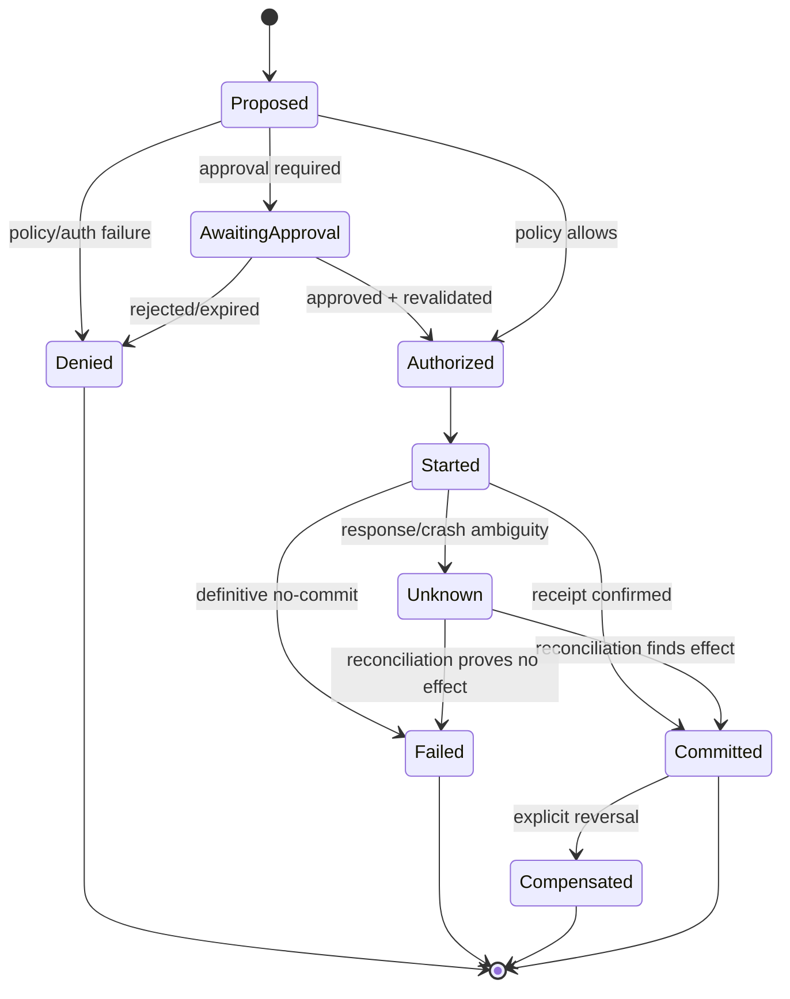
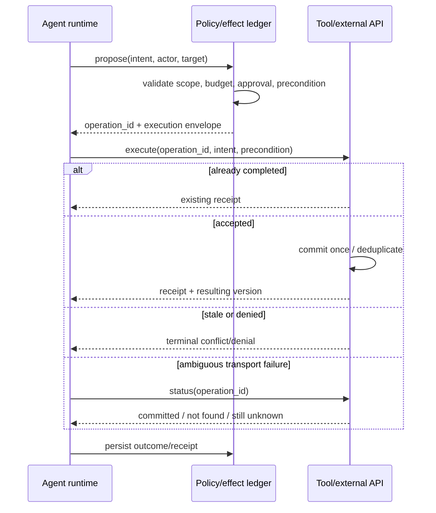
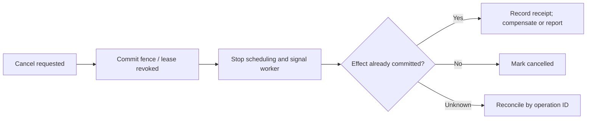

# Idempotency and Side-Effect Safety

> **Status:** Research-backed draft  
> **Last researched:** 2026-08-30  
> **Scope:** Preventing duplicate, stale, or unauthorized effects under retries, replay, concurrency, cancellation, and human approval  
> **Research packet:** [Core agent loop and runtime boundary](../research/packets/core-agent-runtime.md)

## Core rule

Assume every effect request can be delivered more than once and every response can be lost. Make the semantic operation identifiable independently of any single attempt.

An idempotent agent is not one that repeats the same reasoning. It is one whose repeated attempts cannot create unintended additional effects.

## Effect lifecycle



**Unknown** must be first class. Collapsing it into failed causes blind retry; collapsing it into committed can lose required work.

## Identify the semantic operation

Generate the operation ID at the stable parent boundary before the first attempt. Reuse it across:

- transport retries;
- worker/process recovery;
- durable workflow replay;
- provider or tool fallback when semantics remain identical;
- duplicate queue/webhook delivery;
- approval pause/resume.

Do not reuse it if the semantic intent changes.

### Good identity material

An operation record should bind:

```text
operation_id
actor + tenant
tool/capability version
normalized target
normalized semantic arguments / intent hash
business precondition or expected version
approval/policy reference
parent run and step
```

The tool must reject an operation ID reused with different intent. Otherwise a bug can silently turn deduplication into authorization for a new action.

## Idempotency patterns

| Pattern | Use when | Guarantee boundary | Caveat |
|---|---|---|---|
| Downstream idempotency key | API supports stable request keys | Repeated same key returns same semantic result | Retention window and key scope vary |
| Unique database constraint | Effect is a local transaction | One row/business operation per key | External calls still need an outbox or reconciliation |
| Transactional outbox | Database change must trigger message/effect | State change and outbound intent commit atomically | Consumer must deduplicate; delivery remains at least once |
| Inbox/dedup table | Receiving duplicate events/calls | Each event ID processed once per consumer scope | Cleanup/retention and race-safe insert required |
| Compare-and-set/version precondition | Update must apply to known state | Rejects stale concurrent writes | Model must handle conflict/replan |
| Query-by-operation receipt | External system exposes status | Resolves lost responses | Status must be authoritative and retained |
| Lease + fencing token | Prevent stale worker commit | Later owner invalidates older worker's writes | Downstream must enforce fencing token |
| Saga/compensation | Atomicity unavailable across effects | Explicitly reverses completed steps | Compensation may be partial or semantically lossy |
| Manual reconciliation | High-risk unknown outcome | Human resolves ambiguity | Slow; requires strong evidence and tooling |

“Exactly once” is usually implemented as at-least-once delivery plus deduplicated/idempotent processing and durable outcome recording. State the actual boundary instead of using the slogan.

## Read, compute, and effect classes

Classify tools before assigning retry policy:

| Class | Examples | Default retry posture |
|---|---|---|
| Pure/deterministic compute | Parse, validate, calculate | Safe to repeat within resource budget |
| Read-only current-state query | Search, fetch status | Repeatable, but result may change; record freshness |
| Idempotent set/update | Set desired configuration with version/key | Repeat under same operation ID and preconditions |
| Append/create | Send email, create ticket, charge, deploy | Never blind retry; require key/receipt/reconciliation |
| Destructive/irreversible | Delete, revoke, force push, external publish | Strong policy, approval/containment, version precondition, receipt |
| Long-running remote job | Build, crawl, batch operation | Stable job ID, status/cancel API, lease/fence |

Tool descriptions should expose this class to the harness/model, but the runtime must enforce the corresponding policy.

## Side-effect-safe execution flow



## Approval does not replace idempotency

A human can approve an action once while the runtime executes it twice. Bind approval to the semantic operation ID and exact intent, not to a transient attempt.

On resume:

- reject a changed intent hash;
- verify the approval has not expired;
- recheck actor/resource authorization;
- check if a receipt already exists;
- recheck target version/preconditions;
- execute or reconcile under the same operation ID.

For high-consequence work, authorization and approval evidence should be current at commit, not merely current when the model proposed the action.

## Cancellation and late effects

Cancellation is a race:



Use a fencing token or current-run version when a stale worker could commit after cancellation or reassignment. The downstream store/service—not only the old worker—must reject stale tokens.

## Parallel effects

Parallel tool proposals do not imply safe parallel effects.

Before executing writes concurrently, establish:

- disjoint resources or a coordination/locking strategy;
- stable operation ID per branch;
- reserved budget and authority per branch;
- deterministic aggregation of outcomes;
- compensation semantics if only some branches commit;
- cancellation and approval barrier behavior;
- no hidden ordering precondition.

When calls update the same entity, use expected versions or serialize them. Letting the model “know” they should not race is insufficient.

## Error taxonomy for effectful tools

Return a structured result with one of these meanings:

| Result | Runtime action | Model-visible summary |
|---|---|---|
| Committed | Persist receipt; continue | What changed and authoritative resulting state |
| Duplicate/already committed | Reuse receipt; continue | Same operation was already completed |
| Definitive no-commit/transient | Retry runtime if safe and budgeted | Usually hide transport detail; expose delay only if relevant |
| Invalid arguments | Ask model to correct within tool budget | Precise field/business validation error |
| Stale precondition/conflict | Refresh state and replan | Current version/state needed for new decision |
| Policy/authorization denied | Do not retry unchanged | Allowed alternatives or escalation path |
| Unknown outcome | Reconcile; pause if necessary | Do not ask model to guess or repeat |
| Partial commit | Record each receipt; compensate/escalate | Exact completed and unresolved effects |

Do not send stack traces, secrets, or vague “something went wrong” text as the only result.

## Effect ledger design

Minimal logical schema:

| Field | Notes |
|---|---|
| `operation_id` | Unique in explicit tenant/domain scope |
| `intent_hash` | Canonical semantic payload and tool version |
| `status` | Proposed/authorized/started/committed/failed/unknown/compensated |
| `attempt_count` | Diagnostics, not semantic identity |
| `actor`, `tenant`, `run_id`, `step_id` | Trace and authorization lineage |
| `target`, `effect_class` | Search, blast-radius review, reconciliation |
| `precondition` | Expected version/state, if any |
| `approval_id`, `policy_version` | Decision evidence |
| `external_receipt`, `result_version` | Authoritative outcome |
| `first_seen`, `last_attempt`, `committed_at` | Timing and stale-run detection |
| `compensation_operation_id` | Link reversal without erasing original effect |

Store secrets separately; the ledger should contain references or hashes where possible.

## Common failures

| Failure | Root cause | Prevention/recovery |
|---|---|---|
| Duplicate email/charge/ticket | Whole run or tool retried with new identity | Parent-generated stable key; downstream dedup; existing receipt |
| Lost required action | Ambiguous timeout treated as success | Unknown state and reconciliation |
| Action repeated after crash | Effect committed before checkpoint | Query/dedup by operation ID on replay |
| Approved action applied to changed target | Approval not bound to version/freshness | Expected version and commit-time revalidation |
| Cancelled worker commits later | Cooperative cancellation only | Fencing token/lease plus downstream enforcement |
| Parallel branches partially commit | No transaction/saga model | Branch receipts, compensation, explicit partial state |
| Same key used for changed action | Key generated per workflow slot without intent binding | Intent hash mismatch rejection |
| Dedup record expired before retry | Retention shorter than maximum retry/replay horizon | Align retention or keep durable business receipt |

## Verification and chaos tests

- Crash after downstream commit but before local receipt save.
- Drop the response while the external action succeeds.
- Deliver the same job/event/resume signal concurrently.
- Retry through a different worker and provider/tool adapter.
- Reuse an operation ID with modified arguments.
- Cancel immediately before, during, and after commit.
- Expire approval or change target version during the wait.
- Lose one result in a parallel batch after other branches commit.
- Replay historical workflow state after a code/tool version change.
- Delay reconciliation until provider idempotency retention expires.

Assert authoritative external state, ledger state, number of semantic effects, and terminal outcome—not only returned text.

## Production checklist

- [ ] Every write/destructive/communicative tool has an effect class.
- [ ] Operation IDs are created before attempts and survive retry/replay.
- [ ] IDs are tenant-scoped and bound to canonical intent/tool version.
- [ ] Downstream services deduplicate or expose authoritative receipt/status lookup.
- [ ] Unknown outcome is represented and reconciled.
- [ ] Approval binds the semantic operation and is revalidated at commit.
- [ ] Concurrent updates use version checks, locks, or serialization.
- [ ] Cancellation fences stale workers from committing.
- [ ] Partial commit and compensation are modeled explicitly.
- [ ] Retry-layer amplification cannot create new semantic identities.
- [ ] Effect receipts are durable before the run advances.
- [ ] Retention covers the maximum replay/retry horizon.
- [ ] Chaos tests verify external state and effect count.

## Related guides

- [Execution boundaries](../runtime/execution-boundaries.md)
- [Run controls](../runtime/run-controls.md)
- [Durable execution](../runtime/durable-execution.md)
- [Agent state and event contracts](../runtime/agent-state-and-event-contracts.md)
- [Tool contracts](../tools/tool-contracts.md)
- [Runtime failure taxonomy](failure-taxonomy.md)
- [Queues, scheduling, and backpressure](../operations/queues-scheduling-and-backpressure.md)
- [Deployment, release, and incident response](../operations/deployment-release-and-incident-response.md)
- [Production agent control plane](../architectures/production-agent-control-plane.md)

## Research notes

The guide applies distributed-systems invariants exposed by [Temporal](https://go.temporal.io/platform-hub/ai-engineering/ai-reference-architecture), [DBOS](https://docs.dbos.dev/architecture), and [Restate](https://restate.dev/blog/why-we-built-restate) to model-directed effects. Recent work on [commit-time authorization](https://arxiv.org/abs/2607.10487) is treated as emerging support for revalidation, not as a standardized mechanism. See the [research packet](../research/packets/core-agent-runtime.md) for source caveats.
