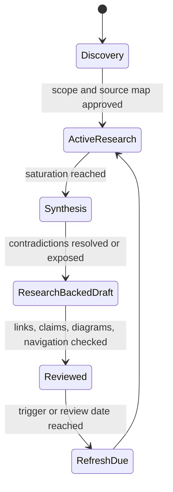

# Research Hub

This area makes the repository's evidence, coverage, and staleness visible.

## Navigate

| Document | Purpose |
|---|---|
| [Research and documentation method](research-method.md) | Search, triangulation, synthesis, and review protocol |
| [Deep knowledge-area expansion program](deep-expansion-program.md) | Folder/file boundary rules, canonicality, parallel research contract, baseline gap analysis, expansion waves, and integration gates |
| [Real-world agent blueprint expansion program](agent-blueprint-expansion-program.md) | Category promotion, blueprint boundaries, required coverage, anti-shallow gates, five refinement passes, evidence/freshness, and rolling ownership |
| [50-category agent blueprint registry](agent-blueprint-category-registry.md) | Distinct workload zones, owned folder names, nearest-overlap tests, zero-to-production path, and rolling queue state for all planned blueprints |
| [Public agent-engineering documentation landscape](packets/public-agent-engineering-landscape.md) | Current framework docs, cookbooks, courses, cloud architectures, workload references, handbooks, benchmarks, security guidance, public gaps, and defensible success metrics |
| [Cross-cutting controls for agent blueprints](packets/agent-blueprint-cross-cutting-controls.md) | D0–D4 effect danger tiers, application-owned boundaries, 15-workload control matrix, common failure-injection suite, identity, durability, privacy, evaluation, release, and incident gates |
| [Coding-agent blueprint packet](packets/coding-agent-blueprint.md) | Repository discovery, bounded edits and commands, patch provenance, sandbox/supply-chain controls, recovery, evaluation, integration, scaling, and staged delivery evidence |
| [DevOps and deployment-agent blueprint packet](packets/devops-deployment-agent-blueprint.md) | Release contracts, build provenance, promotion, policy/approval, rollout/rollback, reconciliation, observability, failure injection, and production operations evidence |
| [Infrastructure-operations agent blueprint packet](packets/infrastructure-operations-agent-blueprint.md) | Provider-neutral inventory, identity, plans, approvals, effect contracts, drift, break-glass, failure recovery, scaling, and privileged-operations evidence |
| [Enterprise-knowledge agent blueprint packet](packets/enterprise-knowledge-agent-blueprint.md) | Permission-aware retrieval, connector reconciliation, evidence/citation lineage, bounded research, memory/context controls, outbound effects, evaluation, and operations evidence |
| [SRE incident-response agent blueprint packet](packets/sre-incident-response-agent-blueprint.md) | Alert intake, incident state, evidence/hypotheses, authority, remediation, rollback, roles, communications, postmortems, failure injection, and on-call operations evidence |
| [Sales and revenue-operations agent blueprint packet](packets/sales-revenue-operations-agent-blueprint.md) | CRM/entity truth, consent and outreach authority, routing/forecasting/quotes, durable follow-up, effect reconciliation, governance, evaluation, and deployment evidence |
| [Deep-research agent blueprint packet](packets/deep-research-agent-blueprint.md) | Search/source acquisition, evidence and claim ledgers, citation/contradiction verification, context/compaction/memory, security, evaluation, operations, and reproducible synthesis evidence |
| [Back-office workflow-agent blueprint packet](packets/back-office-workflow-agent-blueprint.md) | Long-running cases, rules and bounded judgment, approvals/segregation of duties, multi-system effects, privacy/audit, reconciliation, failure injection, and resilient operations evidence |
| [Browser-automation agent blueprint packet](packets/browser-automation-agent-blueprint.md) | Browser/session identity, untrusted page content, origin-aware tools/effects, authentication, prompt-injection containment, reconciliation, evaluation, isolation, capacity, and site-drift evidence |
| [Computer-use agent blueprint packet](packets/computer-use-agent-blueprint.md) | Visual/semantic perception, application and focus identity, policy-gated GUI effects, isolation/credentials, stuck detection, recovery/takeover, replay/evaluation, capacity, and operations evidence |
| [Database-operations agent blueprint packet](packets/database-operations-agent-blueprint.md) | Engine-aware query/schema authority, catalog evidence, transactions/locks/migrations, approval/effect contracts, restore/replication/failover, tenant/PII controls, failure injection, and operations evidence |
| [Analytics-agent blueprint packet](packets/analytics-agent-blueprint.md) | Governed metric/semantic discovery, query planning/execution, notebook isolation, statistical validity, privacy/lineage, reproducible artifacts, review, evaluation, cost, and deployment evidence |
| [Security-investigation agent blueprint packet](packets/security-investigation-agent-blueprint.md) | Adversarial evidence intake, alert and entity correlation, case state, chain of custody, containment authority, context and memory controls, evaluation, deployment, incident handoff, and continuous evolution evidence |
| [Executive-operations agent blueprint packet](packets/executive-operations-agent-blueprint.md) | Principal and delegate identity, cross-provider objectives, authority and approvals, tools and reconciliation, context and memory, privacy, evaluation, deployment, scaling, and governed evolution evidence |
| [FinOps and cloud-cost agent blueprint packet](packets/finops-agent-blueprint.md) | Billing and allocation semantics, anomaly and forecast evidence, safe optimization, commitments, approvals and effects, context and memory, evaluation, scaling, incidents, and realized-savings evidence |
| [Document-intelligence agent blueprint packet](packets/document-intelligence-agent-blueprint.md) | Authenticated intake, document identity and lineage, OCR/layout/table/image understanding, calibrated extraction, review, hostile-file security, durable state, effects, evaluation, scaling, and evolution evidence |
| [Vulnerability-remediation agent blueprint packet](packets/vulnerability-remediation-agent-blueprint.md) | Finding identity and validation, assets and reachability, exploitability and risk, controls and exceptions, secure patching, remediation proof, state and memory, failure injection, deployment, and evolution evidence |
| [Test and quality-engineering agent blueprint packet](packets/test-quality-engineering-agent-blueprint.md) | Independent test design, oracles and selection, isolated environments and fixtures, domain boundaries, campaign state and memory, flaky evidence, security, evaluation, deployment, scaling, and evolution evidence |
| [Network-operations agent blueprint packet](packets/network-operations-agent-blueprint.md) | Topology and intent identity, routing/DNS/certificates/traffic policy, probes and multivendor adapters, staged changes and rollback, state and memory, security, failure injection, HA/DR, scale, and evolution evidence |
| [Data-pipeline operations agent blueprint packet](packets/data-pipeline-operations-agent-blueprint.md) | Batch/stream/CDC adapters, schema contracts and evolution, lineage and quality quarantine, backfill/replay/idempotency, state and memory, security, SLOs, incidents, scaling, evaluation, and evolution evidence |
| [MLOps and model-operations agent blueprint packet](packets/mlops-agent-blueprint.md) | Registry and artifact identity, model/data/feature lineage, behavioral evaluation and promotion, serving rollout/drift/rollback, state and memory, security, accelerators, failure injection, scaling, and evolution evidence |
| [Patent and IP-research agent blueprint packet](packets/patent-ip-research-agent-blueprint.md) | Patent identity, dates/families/classification, multi-source prior-art retrieval, claims and element evidence, legal-status provenance, matter-scoped state and memory, rights/security, evaluation, scaling, and correction evidence |
| [IT service-desk and endpoint-support agent blueprint packet](packets/it-service-desk-agent-blueprint.md) | Authenticated intake, principal/device/ticket identity, evidence-driven diagnostics, remote-support consent and effects, account-recovery boundary, state and memory, abuse resistance, evaluation, scaling, incidents, and evolution evidence |
| [Identity and access-governance agent blueprint packet](packets/identity-access-governance-agent-blueprint.md) | Entitlement graph and source truth, JML, reviews and SoD, time-bound access, approvals and effects, revocation proof, state and memory, security, failure injection, scaling, operations, and evolution evidence |
| [Compliance-audit and control-evidence agent blueprint packet](packets/compliance-audit-agent-blueprint.md) | Control profiles and mappings, evidence requests and lineage, sampling and test procedures, engagement state and all memory lifetimes, reviewer independence, exceptions, audit packages, security, failure injection, scaling, incidents, and governed behavior evolution |
| [Competitive and market-intelligence agent blueprint packet](packets/competitive-market-intelligence-agent-blueprint.md) | Entity and watchlist truth, lawful source acquisition, rights, temporal change detection, evidence and provenance, scenarios and briefings, all memory lifetimes, compaction, security, evals, incidents, scaling, cost, and governed evolution |
| [Customer-support and service-resolution agent blueprint packet](packets/customer-support-agent-blueprint.md) | Authenticated case and channel state, grounded resolution, tools and provider qualification, effects and reconciliation, all memory lifetimes, loss-aware compaction, security, abuse resistance, SLOs, failure injection, deployment, scaling, and governed improvement |
| [Business-intelligence monitoring and decision-operations agent blueprint packet](packets/business-intelligence-monitoring-agent-blueprint.md) | Metric/watch/semantic/freshness contracts, deterministic detection, bounded evidence triage, routing and decision workflows, all memory lifetimes, loss-aware compaction, reliable effects, evals, observability, failure injection, scale, incidents, cost, and evolution |
| [Procurement and strategic-sourcing agent blueprint packet](packets/procurement-sourcing-agent-blueprint.md) | Requisition and spend evidence, supplier identity and due diligence, RFX/bid isolation and evaluation, conflicts and approvals, tool/provider qualification, all memory lifetimes, reliable effects and handoffs, evaluation, scaling, incidents, and governed evolution |
| [Scientific-research and laboratory-operations agent blueprint packet](packets/scientific-research-agent-blueprint.md) | Hypothesis, protocol, sample, measurement, instrument/simulation and artifact truth; reproducibility and uncertainty; all memory lifetimes and typed compaction; safety, secure effects, reconciliation, evaluation, failure injection, deployment, scaling, incidents, and continuous evolution |
| [HR and talent-operations agent blueprint packet](packets/hr-talent-operations-agent-blueprint.md) | Candidate/worker identity and effective-dated lifecycle, recruiting/interview evidence, human decision ownership, HRIS/ATS and downstream effects, all memory lifetimes and typed compaction, fairness, accessibility, privacy, evaluation, scaling, incidents, and governed behavior releases |
| [Regulatory-intelligence agent blueprint packet](packets/regulatory-intelligence-agent-blueprint.md) | Official-source identity, provenance and reconciliation; bitemporal legal/status/applicability semantics; professional interpretation and obligation handoff boundaries; all memory lifetimes and typed compaction; rights, security, evaluation, failure injection, deployment, scaling, incidents, and controlled evolution |
| [Investigative-journalism and source-verification agent blueprint packet](packets/investigative-journalism-agent-blueprint.md) | Matter and confidential-source boundaries, evidence custody and authenticity, claims/contradictions/entities/timelines, bounded research, all memory lifetimes and typed compaction, editorial/legal handoff, corrections, source protection, adversarial evaluation, deployment, scaling, incidents, and continuous evolution |
| [Clinical-trial operations agent blueprint packet](packets/clinical-trial-operations-agent-blueprint.md) | Protocol, study, site, participant-alias and blinding boundaries; consent, eligibility, deviations, monitoring, safety-case preparation and regulated-record workflows; all memory lifetimes and restart-safe compaction; validated adapters, secure effects, evaluation, failure injection, deployment, scaling, incident response, and controlled evolution |
| [Knowledge-graph and data-catalog stewardship agent blueprint packet](packets/knowledge-graph-stewardship-agent-blueprint.md) | Assertion, observation, candidate, decision, canonical-fact, provenance and effect separation; entity resolution, ontology/schema/vocabulary governance, lineage and merge/split workflows; all memory lifetimes, restart-safe compaction, typed adapters, security, evaluation, scaling, incidents, and staged evolution |
| [Fraud and AML investigation agent blueprint packet](packets/fraud-aml-investigation-agent-blueprint.md) | Customer/account/transaction evidence, entity networks, typologies, alert and case workflow, KYC/CDD/EDD, sanctions and filing boundaries; all memory lifetimes and continuity receipts; governed effects, privacy/fairness/security, evaluation, observability, scaling, incidents, and controlled releases |
| [Healthcare care-coordination agent blueprint packet](packets/healthcare-care-coordination-agent-blueprint.md) | Patient, proxy, consent and care-team authority; scheduling, referrals, prior authorization, coordination tasks and clinical-administrative safety boundaries; exactly seven memory lifetimes and restart receipt; qualified integrations, effects, privacy/security, evaluation, SLOs, deployment, scale, incidents, and Stage 0–6 delivery |
| [Travel planning and booking-operations agent blueprint packet](packets/travel-booking-agent-blueprint.md) | Traveler, delegation, journey, itinerary, quote, order, ticket, booking, payment and service-request truth; live availability and commercial freshness; exactly seven memory lifetimes and restart receipt; qualified provider adapters, effects, changes/refunds, disruptions, security, evaluation, scale, incidents, and Stage 0–6 delivery |
| [Manufacturing maintenance and quality agent blueprint packet](packets/manufacturing-maintenance-quality-agent-blueprint.md) | Site, asset, equipment, production, maintenance and quality-case truth; sensor/calibration evidence, work orders, nonconformance/CAPA, safety interlocks and human LOTO authority; exactly seven memory lifetimes and restart receipt; qualified OT/IT adapters, effects, evaluation, scale, incidents, DR, and Stage 0–6 delivery |
| [Energy and utilities operations agent blueprint packet](packets/energy-utilities-operations-agent-blueprint.md) | Utility, commodity, territory, topology, asset, telemetry, alarm, outage, field-resource and restoration truth; critical-load constraints and qualified-operator control; exactly seven memory lifetimes and restart receipt; OT/IT adapters, security, effects, evaluation, storm scale, incidents, DR, and Stage 0–6 delivery |
| [Education and tutoring agent blueprint packet](packets/education-tutoring-agent-blueprint.md) | Learner, guardian, teacher, enrollment, course, curriculum, goal, attempt, assistance and outcome truth; formative learning and assessment-integrity boundaries; exactly seven memory lifetimes and restart receipt; qualified education adapters, privacy, accessibility, fairness, evaluation, scale, incidents, and Stage 0–6 delivery |
| [Content production and editorial operations agent blueprint packet](packets/content-editorial-agent-blueprint.md) | Assignment, source, claim, rights, asset, content-block, revision, review, approval, publication and correction truth; exactly seven memory lifetimes and restart receipt; qualified content adapters, reliable effects, accessibility, security, evaluation, scale, incidents, cost, and Stage 0–6 delivery |
| [Localization and transcreation operations agent blueprint packet](packets/localization-transcreation-agent-blueprint.md) | Source release, segment, locale, translation-memory unit, term/concept, protected token, candidate, review and multilingual release-parity truth; exactly seven memory lifetimes and restart receipt; qualified localization adapters, rights/security, QA/evaluation, scale, incidents, cost, and Stage 0–6 delivery |
| [Marketing campaign-operations agent blueprint packet](packets/marketing-operations-agent-blueprint.md) | Campaign, objective, audience/consent, asset/claim, channel, spend, experiment and handoff state; exactly seven memory lifetimes and restart receipt; qualified marketing adapters, reliable effects, attribution/evaluation, privacy/security, observability, scaling, incidents, cost, and controlled evolution |
| [E-commerce merchandising and operations agent blueprint packet](packets/ecommerce-operations-agent-blueprint.md) | Product/variant/offer/catalog/channel identity, availability, pricing, promotion, content, policy and marketplace effects; exactly seven memory lifetimes and restart receipt; qualified adapters, reconciliation, security, evaluation, peak scaling, incidents, cost, and Stage 0–6 evolution |
| [Supply-chain and logistics operations agent blueprint packet](packets/supply-chain-logistics-agent-blueprint.md) | Order, shipment, leg, inventory, carrier/warehouse and constraint truth; ETA/solver uncertainty, exception planning, exactly seven memory lifetimes and restart receipt, reliable effects, reconciliation, security, evaluation, SLOs, deployment, recovery, incidents, and governed evolution |
| [Real-estate and property operations agent blueprint packet](packets/real-estate-property-operations-agent-blueprint.md) | Property/unit/occupancy/listing/lease/work-order identity, tenant/vendor/physical-access boundaries, fair-housing and privacy controls, qualified adapters, exactly seven memory lifetimes and continuity receipt, effects, evaluation, scaling, incidents, DR, cost, and Stage 0–6 gates |
| [Legal matter and contract-operations agent blueprint packet](packets/legal-contract-operations-agent-blueprint.md) | Matter, party, privilege, jurisdiction, document/redline/clause/obligation/deadline/hold state; attorney-owned decisions, signature and records boundaries; exactly seven memory lifetimes and restart receipt, qualified integrations, effects, security, evaluation, SLOs, deployment, incidents, and Stage 0–6 delivery |
| [Finance and accounting operations agent blueprint packet](packets/finance-accounting-agent-blueprint.md) | Entity/book/period, ledger/subledger, journal, reconciliation, close and audit-evidence semantics; accountant-owned posting/payment/materiality/certification authority; exactly seven memory lifetimes and restart receipt, integrations, effects, controls, evaluation, scaling, incidents, and Stage 0–6 delivery |
| [Insurance claims operations agent blueprint packet](packets/insurance-claims-agent-blueprint.md) | Policy/term/claim/exposure/FNOL/evidence/reserve/assessment/communication/referral state; adjuster-owned coverage, reserve and adjudication decisions; exactly seven memory lifetimes and restart receipt, effects, privacy/security, evaluation, catastrophe scaling, incidents, cost, releases, and Stage 0–6 gates |
| [Coverage map](coverage-map.md) | Topic maturity and prioritized research queue |
| [Source register](source-register.md) | Authoritative source families and refresh triggers |
| [Core agent runtime packet](packets/core-agent-runtime.md) | Evidence behind the first deep guide cluster |
| [Security, evaluation, context, and memory packet](packets/security-evaluation-context-memory.md) | Evidence, disagreements, exclusions, and refresh triggers behind the second deep guide cluster |
| [Orchestration and protocols packet](packets/orchestration-and-protocols.md) | Planning, topology, delegation, shared-state, MCP, A2A, and AG-UI evidence behind the third deep guide cluster |
| [Production operations and architectures packet](packets/production-operations-and-architectures.md) | Queues, retries, capacity, SLOs, routing, cost, releases, incidents, multi-tenancy, and control-plane evidence |
| [Tool fleet engineering packet](packets/tool-fleet-engineering.md) | Discovery, selection, registry trust, semantic versioning, result evidence, supply chain, and fleet operations |
| [Runtime language selection packet](packets/runtime-language-selection.md) | Language choice, concurrency/cancellation semantics, SDK/protocol/telemetry parity, schema boundaries, and polyglot trade-offs |
| [Python and TypeScript/Node.js runtime packet](packets/python-and-typescript-agent-runtimes.md) | Runtime ownership, cancellation, CPU isolation, streaming, schemas, deployment, packaging, telemetry, and direct language selection evidence |
| [Python agent-engineering deep-dive packet](packets/python-agent-engineering-deep-dive.md) | Task ownership, cancellation, executors/processes/subinterpreters, streams, schemas, effects, durability, state, workers, diagnostics, testing, packaging, deployment, and ecosystem boundaries |
| [TypeScript agent-engineering deep-dive packet](packets/typescript-agent-engineering-deep-dive.md) | Compiler/module contracts, erased-type validation, state machines, tools/events, provider adapters, async API surfaces, packages, artifacts, compatibility tests, supply chain, and migration |
| [Node.js agent-runtime deep-dive packet](packets/nodejs-agent-runtime-deep-dive.md) | Event-loop ownership, cancellation/deadlines, streams, Undici, libuv/workers/processes, sandboxes, durable queues, memory admission, effects, tracing, diagnostics, tests, security, and deployment |
| [Go runtime packet](packets/go-agent-runtimes.md) | Goroutine/context ownership, bounded concurrency, HTTP/process safety, schemas, framework/MCP/durable maturity, diagnostics, testing, and three-runtime selection evidence |
| [Go agent-engineering deep-dive packet](packets/go-agent-engineering-deep-dive.md) | Service/run ownership, contexts, byte-aware backpressure, streams, tools/processes, schemas, effects, durable workers, resources, diagnostics, tests, supply chain, deployment, and framework maturity |
| [Agent state and event contracts packet](packets/agent-state-and-event-contracts.md) | Authoritative run state, stable identity, event envelopes, ordering, replay, delivery, effects, and telemetry boundaries |
| [Rust agent-engineering packet](packets/rust-agent-engineering-deep-dive.md) | Rust/Tokio ownership, cancellation, transport, schemas, effects, durability, SDK/MCP maturity, observability, resources, sandboxing, and supply chain |
| [JVM agent-engineering deep-dive packet](packets/jvm-agent-engineering-deep-dive.md) | Java virtual threads/preview structured concurrency, Kotlin coroutines/Flow, cancellation, streams, tools, schemas, effects, durability, memory, observability, tests, build/deployment, and SDK maturity |
| [C#/.NET agent-engineering deep-dive packet](packets/csharp-dotnet-agent-engineering-deep-dive.md) | .NET 10/C# 14 task ownership, cancellation, channels, HTTP resilience, tools, schemas, effects, durable workers, resources, diagnostics, tests, NuGet, deployment, Azure, MCP, and SDK maturity |
| [LangGraph deep-dive packet](packets/langgraph-deep-dive.md) | LangGraph runtime, reducers, checkpoints, interrupts, replay, subgraphs, Agent Server, security advisories, migrations, and bounded failure evidence |
| [OpenAI Agents SDK deep-dive packet](packets/openai-agents-sdk-deep-dive.md) | Python/TypeScript loop semantics, tools, sessions, handoffs, streaming, evals, security, retries, deployment, sandbox, version parity, and limitations |
| [Vercel AI SDK deep-dive packet](packets/vercel-ai-sdk-deep-dive.md) | AI SDK 7 Core/UI/provider architecture, agent loops, tools, streaming, persistence, Workflow durability, testing, reliability, deployment, security, and migration |
| [Strands Agents deep-dive packet](packets/strands-agents-deep-dive.md) | Python/TypeScript loop semantics, tools/MCP, sessions/memory, streams, hooks, multi-agent patterns, HITL/security, evaluation, reliability, deployment, and parity |
| [Pydantic AI deep-dive packet](packets/pydantic-ai-deep-dive.md) | V2 lifecycle, tools/MCP, validation/retries, streams, limits, state/history, durable adapters, delegation, evals, telemetry, advisories, deployment, and migration |
| [Claude Agent SDK and Managed Agents deep-dive packet](packets/claude-agent-sdk-deep-dive.md) | Child-process/workspace runtime, loop, extensions, sessions/compaction, events, permissions, delegation, hosting, testing, reliability, managed boundary, retention, and migration |
| [Google ADK deep-dive packet](packets/google-adk-deep-dive.md) | Runner/events, agents/models, tools/MCP/A2A, sessions/artifacts/memory, graph workflows, streaming, HITL, deployment, evaluation, reliability, security, and language parity |
| [Microsoft Agent Framework deep-dive packet](packets/microsoft-agent-framework-deep-dive.md) | Python/.NET/Go agents, workflows, checkpoints, middleware, providers, protocols, hosting, Durable Extension, evaluation, security, feature maturity, contradictions, and migration |
| [AutoGen deep-dive packet](packets/autogen-deep-dive.md) | Maintenance lifecycle, message/runtime contracts, tools/code execution, teams, state/resume, streaming/HITL, distributed runtime, observability, security, operations, and migration |
| [Semantic Kernel agents deep-dive packet](packets/semantic-kernel-agents-deep-dive.md) | Retained kernels/plugins/connectors/data, transitional agents/threads, experimental process/orchestration APIs, filters, security, reliability, .NET/Python/Java maturity, advisories, and MAF migration |
| [CrewAI deep-dive packet](packets/crewai-deep-dive.md) | Version-pinned Crews/Flows architecture, state/events, tools/MCP/knowledge, memory, checkpointing/HITL, delegation/A2A, reliability, security, deployment, limitations, and contradictions |
| [Mastra deep-dive packet](packets/mastra-deep-dive.md) | Package-pinned agents/workflows, tools/MCP, memory/storage, snapshots, streams/PubSub, supervisors, durable adapters, reliability, security incidents, maturity, and migration evidence |
| [LlamaIndex and LlamaAgents deep-dive packet](packets/llamaindex-llamaagents-deep-dive.md) | Data/agent framework, Agent Workflows, server/client protocol, DBOS ownership/recovery, context/memory/state boundaries, security, evaluation, deployment, and LlamaDeploy migration evidence |
| [DeepSeek Harness deep-dive packet](packets/deepseek-harness-deep-dive.md) | Cordis/plugin architecture, event-sourced sessions, persistence, tools/skills, compaction, orchestration, sandbox/PTC trust, providers, evaluation, operations, prerelease history, and adoption gates |
| [Provider-native agent frameworks packet](packets/provider-native-agent-frameworks.md) | OpenAI, Anthropic, Google, and Microsoft runtime boundaries, state/resume semantics, operational failure evidence, and selection criteria |
| [Independent agent frameworks packet](packets/independent-agent-frameworks.md) | LangChain/LangGraph/Deep Agents, Pydantic AI, Vercel AI SDK, and Strands execution, replay, cancellation, security, and adoption evidence |
| [Framework lifecycle and second-wave ecosystem packet](packets/framework-lifecycle-and-second-wave.md) | AutoGen/Semantic Kernel migration, CrewAI, LlamaIndex/LlamaAgents, Mastra, and DeepSeek Harness lifecycle, durability, failure, and security evidence |
| [Durable agent workflow runtimes packet](packets/durable-agent-workflow-runtimes.md) | Temporal, Restate, DBOS, Prefect, and Dapr replay, effects, waits, cancellation, versioning, storage, operations, and selection evidence |

## Research lifecycle

The lifecycle applies to individual topics, not to the repository as a whole. A broad repository can contain reviewed guides and discovery queues at the same time.
