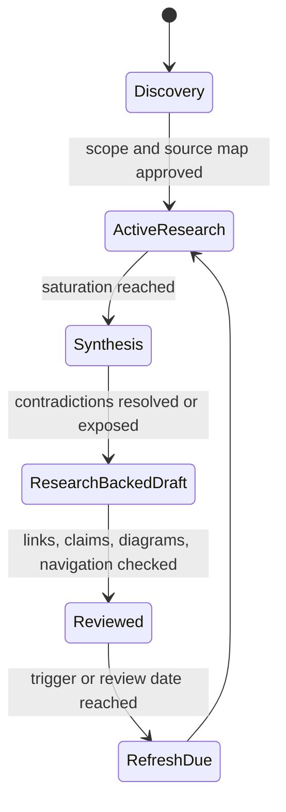

# Research Hub

This area makes the repository's evidence, coverage, and staleness visible.

## Navigate

| Document | Purpose |
|---|---|
| [Research and documentation method](research-method.md) | Search, triangulation, synthesis, and review protocol |
| [Coverage map](coverage-map.md) | Topic maturity and prioritized research queue |
| [Source register](source-register.md) | Authoritative source families and refresh triggers |
| [Core agent runtime packet](packets/core-agent-runtime.md) | Evidence behind the first deep guide cluster |
| [Security, evaluation, context, and memory packet](packets/security-evaluation-context-memory.md) | Evidence, disagreements, exclusions, and refresh triggers behind the second deep guide cluster |
| [Orchestration and protocols packet](packets/orchestration-and-protocols.md) | Planning, topology, delegation, shared-state, MCP, A2A, and AG-UI evidence behind the third deep guide cluster |
| [Production operations and architectures packet](packets/production-operations-and-architectures.md) | Queues, retries, capacity, SLOs, routing, cost, releases, incidents, multi-tenancy, and control-plane evidence |
| [Tool fleet engineering packet](packets/tool-fleet-engineering.md) | Discovery, selection, registry trust, semantic versioning, result evidence, supply chain, and fleet operations |
| [Runtime language selection packet](packets/runtime-language-selection.md) | Language choice, concurrency/cancellation semantics, SDK/protocol/telemetry parity, schema boundaries, and polyglot trade-offs |
| [Provider-native agent frameworks packet](packets/provider-native-agent-frameworks.md) | OpenAI, Anthropic, Google, and Microsoft runtime boundaries, state/resume semantics, operational failure evidence, and selection criteria |
| [Independent agent frameworks packet](packets/independent-agent-frameworks.md) | LangChain/LangGraph/Deep Agents, Pydantic AI, Vercel AI SDK, and Strands execution, replay, cancellation, security, and adoption evidence |
| [Framework lifecycle and second-wave ecosystem packet](packets/framework-lifecycle-and-second-wave.md) | AutoGen/Semantic Kernel migration, CrewAI, LlamaIndex/LlamaAgents, Mastra, and DeepSeek Harness lifecycle, durability, failure, and security evidence |
| [Durable agent workflow runtimes packet](packets/durable-agent-workflow-runtimes.md) | Temporal, Restate, DBOS, Prefect, and Dapr replay, effects, waits, cancellation, versioning, storage, operations, and selection evidence |

## Research lifecycle

The lifecycle applies to individual topics, not to the repository as a whole. A broad repository can contain reviewed guides and discovery queues at the same time.
