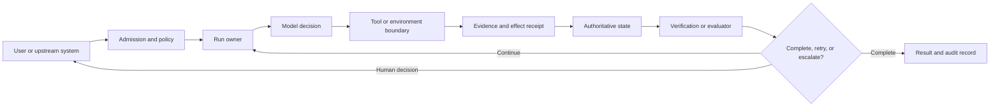
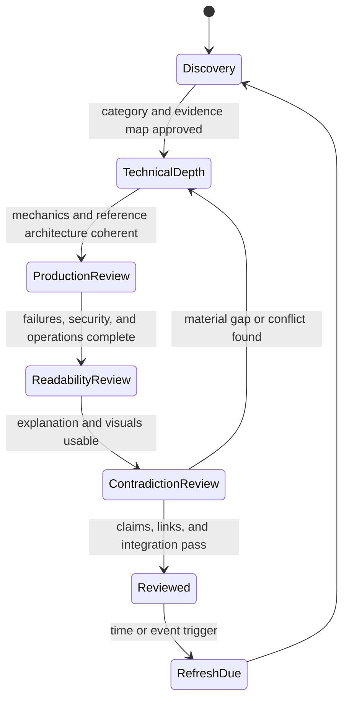
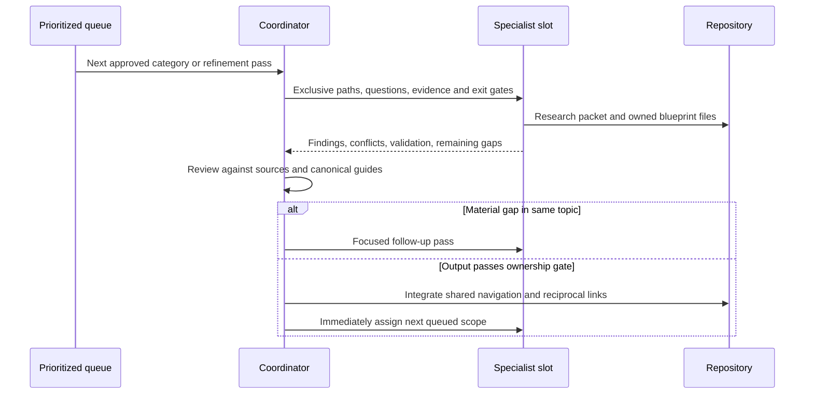

# Real-World Agent Blueprint Expansion Program

> **Status:** Completed 50-category baseline and continuing quality contract  
> **Baseline date:** 2026-08-31  
> **Target area:** `docs/agents/`  
> **Purpose:** Build workload-specific engineering blueprints that a capable team can use to choose, implement, secure, evaluate, deploy, and improve a production agent without duplicating the repository's canonical foundations.

## Mission and boundary

The `docs/agents/` area answers a different question from framework, language, and cross-cutting guidance:

| Area | Primary question | Examples of canonical ownership |
|---|---|---|
| Framework or SDK area | How does this technology actually behave? | Runner semantics, checkpoints, hooks, tool conversion, hosted limits |
| Language area | How does this runtime change implementation and operations? | Cancellation, process ownership, serialization, profiling, packaging |
| Cross-cutting area | What invariant or reusable pattern applies across workloads? | Effect idempotency, state identity, context compaction, prompt-injection defenses |
| Agent blueprint area | How should this complete workload-specific system be designed? | Required tools, authority model, workload state, failure recovery, evaluation tasks, staged deployment |

A blueprint is not a renamed framework tutorial. It may select a custom loop, an SDK, a workflow runtime, a harness, or a hybrid, but it must justify that choice from workload requirements. It must also explain when a deterministic application or workflow is sufficient. Anthropic distinguishes predefined workflows from systems in which a model directs its own process, and recommends adding agentic complexity only when evaluation shows that it improves outcomes. OpenAI similarly excludes simple chatbots and single-turn model calls from its agent definition and recommends escalating architecture only when the use case requires model-directed execution and tool use.[^anthropic-effective-agents][^openai-practical-guide]

The existing taxonomy remains authoritative. The new area extends it; it does not rename, relocate, or replace strong guides. Universal material stays canonical in its current section and is linked from blueprints with workload-specific application guidance.

## What qualifies as a real agent blueprint

A candidate workload must pass all four entry conditions:

1. **Model-directed work:** the model must make at least one consequential runtime decision about planning, tool choice, evidence gathering, or recovery. If a fixed parser, classifier, retrieval call, or deterministic workflow solves the problem better, the candidate is not an agent blueprint.
2. **Environment interaction:** the system must observe or change an external environment through tools, artifacts, delegated workers, or human decisions. Generating prose alone does not qualify.
3. **Multi-step state:** useful execution spans multiple state transitions, and the blueprint must define ownership, completion, cancellation, and partial progress.
4. **Workload-specific engineering:** permissions, tools, state, failure recovery, evaluation, or deployment must differ materially from another blueprint. A new business label is insufficient.

### Anti-chatbot test

Reject or merge a proposed category if its complete architecture is adequately described as:

```text
user message -> retrieve documents -> model response
```

That can be a valuable application, but it does not justify a production-agent blueprint unless the workload adds goal-directed actions, stateful progress, environment feedback, meaningful authority, and a distinct failure model.

### Category separation test

Two candidates deserve separate folders only when at least three of these seams differ materially:

| Separation seam | Question that must produce a different answer |
|---|---|
| Environment | What system is observed or changed: repository, host, browser, database, desktop, incident system, or business application? |
| Authority | Which actions are read-only, reversible, destructive, privileged, regulated, or externally visible? |
| State and time | Is work interactive, queued, long-running, approval-blocked, resumable, concurrent, or deadline-driven? |
| Ground truth | What evidence can prove progress or correctness: tests, telemetry, browser state, database invariants, citations, reconciled records? |
| Recovery | What does partial completion mean, and how are duplicate, stale, or unsafe effects repaired? |
| Evaluation | What realistic task suite and graders distinguish success from a plausible-looking answer? |
| Deployment | Does the workload require a sandbox fleet, private-network worker, browser pool, desktop session, privileged runner, or ordinary service? |

If fewer than three seams differ, prefer one broader blueprint with explicit variants. If a single candidate contains incompatible authority or recovery models, split it even if the user-facing label is the same. For example, a read-only database analyst and a schema-changing database operator should not silently share one safety model.

## Dynamic category selection

The initial list is a research hypothesis, not a quota. Category discovery continues through ecosystem research, repository gap reviews, production case studies, security guidance, and reader decision needs.

### Candidate promotion scorecard

Every candidate receives a short promotion record in its research packet before drafting. A category is promoted only when all mandatory gates pass; popularity alone never promotes it.

| Gate | Evidence required | Result |
|---|---|---|
| Real-agent fit | At least two representative workflows showing model-directed tool use and environment feedback | Mandatory |
| Distinct architecture | Separation test against the closest existing blueprint | Mandatory |
| Buildability | A credible minimal architecture, tool boundary, state model, and deployment path | Mandatory |
| Production depth | At least one meaningful partial-failure, security, and recovery problem unique to the workload | Mandatory |
| Evaluation viability | Observable outcomes and realistic tasks can be specified; success is not only subjective prose quality | Mandatory |
| Evidence depth | Current primary sources plus direct operational or security evidence support material claims | Mandatory |
| Reader value | The blueprint removes a recurring engineering decision or research burden | Mandatory |
| Ecosystem signal | Active products, open implementations, serious deployments, research, or repeated engineering demand | Supporting, not sufficient |

Candidate outcomes are:

- **promote** — distinct, evidence-rich, and buildable now;
- **hold** — promising, but the evidence, maturity, or category boundary is not yet strong;
- **merge** — useful as a variant of another blueprint;
- **reject** — chatbot-only, deterministic by nature, hype-led, unsafe to operationalize, or too speculative for production guidance.

### Fifty-category target registry

The active scope is the [50-category real-world agent blueprint registry](agent-blueprint-category-registry.md). It spans software/platform operations; research, knowledge, data, and media; interactive and customer-facing work; regulated business workflows; and industry/human-work domains.

The number is a coverage target, not a waiver of the separation test. Every row names its closest overlap and the production boundary that must remain distinct. If research proves that two rows have the same architecture, the coordinator records a merge and replaces the vacated slot with a genuinely distinct workload; it never creates two blueprints by changing only a business noun. Conversely, an apparently broad row is split only when authority, recovery, evaluation, or deployment models are incompatible.

Execution uses a rolling pool of up to 18 independent Pass-1 construction tasks, not closed batches. As soon as one task completes, its slot receives the next distinct queued category; the coordinator does not wait for the other tasks. Three additional direct refinement lanes continuously take reviewed folders through Pass 2. After all 50 categories have entered construction, released Pass-1 capacity shifts to evidence refresh, production/security review, contradiction review, and gap repair rather than inventing duplicate categories.

## Information architecture and file boundaries

Each promoted category owns one folder:

```text
docs/agents/<agent-type>/
  README.md
  <focused workload guides>.md

docs/research/packets/<agent-type>-agent-blueprint.md
```

The packet records evidence and decisions; it is not an extra blueprint chapter. The folder README is the entry point and decision map, not a compressed duplicate of every child guide.

### Default shape, not a mandatory template

A broad blueprint will often justify these reader paths:

1. requirements, scope, non-goals, and autonomy boundary;
2. reference architecture and custom/framework/hybrid choices;
3. task lifecycle, planning, state, context, memory, and durability;
4. workload tools, environment adapters, permissions, and security;
5. reliability, failure recovery, observability, testing, and evaluation;
6. performance, cost, deployment, scaling, operations, and build roadmap.

Create a child file only when it has an independent reader question, failure model, and maintenance boundary. Combine adjacent concerns when splitting would force readers to open several small files to answer one decision. Split a guide when one file would mix incompatible threat models, runtime lifecycles, or operational owners.

There is no minimum or target file count. One deep category may need twelve guides and another may need five. A folder is rejected as shallow when its pages are generic fragments that could be moved to another agent type by changing the title.

### README contract

Every blueprint README must contain:

- scope, target users, non-goals, and definition of done;
- research date, maturity label, and refresh triggers;
- representative workflows and explicit autonomy boundaries;
- a system-context diagram and concise component map;
- architecture selection summary with custom, SDK/framework, and hybrid paths where credible;
- language/runtime selection summary specific to the workload;
- reader paths into child guides;
- top production risks and explicit stop/escalation conditions;
- links to its evidence packet and canonical repository guides;
- a staged build roadmap summary.

The README must let a reader decide whether the category and architecture fit before reading implementation details.

## Required coverage contract

Coverage is judged by answered engineering questions, not by headings or word count.

| Domain | Required blueprint-specific answers |
|---|---|
| Purpose and non-goals | What outcome is owned? Why is model-directed action justified? What must remain deterministic or human-owned? |
| Representative workflows | What are the normal, exceptional, approval, cancellation, and recovery journeys? |
| Requirements and autonomy | Latency, duration, concurrency, failure tolerance, human interaction, evidence, data sensitivity, and acceptable blast radius |
| Architecture options | Custom runtime, SDK/framework, workflow engine/harness, and hybrid trade-offs; selection and rejection criteria |
| Language and runtime | Workload-specific comparison of viable languages, process model, library parity, team operations, and polyglot boundaries |
| Model strategy | Capability requirements, routing, fallback, provider-specific features, structured output, budget, and evidence-based upgrade tests |
| Execution lifecycle | Accepted, planned, running, waiting, approved/rejected, cancelling, recovering, completed, and failed states where relevant |
| Tools and environment | Tool taxonomy, schemas, discovery, ranking, result evidence, idempotency, timeouts, cleanup, destructive effects, and unavailable-tool behavior |
| State and persistence | Authoritative state, identity, checkpoints, artifacts, effect receipts, concurrency control, and retention/deletion |
| Memory | Explicit include-or-reject decisions for turn/scratch, working/run, session, durable workflow/task, domain knowledge, long-term/preference, and episodic/outcome memory; authority, provenance, retrieval, retention, correction, poisoning, and verified deletion controls |
| Context engineering | Static instructions, retrieved evidence, tool-result compaction, provenance, cache boundaries, long-session loss, and context quality tests |
| Planning and orchestration | Fixed versus dynamic decomposition, replanning triggers, parallelism, delegation, completion detection, and loop limits |
| Permissions and security | Identity, tenancy, least privilege, approvals, credentials, network/filesystem boundaries, sandboxing, prompt injection, and audit trail |
| Reliability | Timeouts, bounded retries, stale state, duplicates, partial effects, reconciliation, crash recovery, rollback/compensation, and safe abandonment |
| Observability | Trace topology, run/effect identifiers, logs, metrics, content-redaction policy, cost, decision evidence, and incident queries |
| Evaluation | Realistic task set, environment fixture, trajectory checks, outcome checks, safety graders, human review, regression gates, and online monitoring |
| Performance and cost | Model/tool latency, concurrency, token and artifact volume, cache economics, sandbox/browser/worker capacity, and recovery load |
| Deployment and scaling | Local/MVP, reliable single-region production, larger production, isolation, workers, queues, storage, release, rollback, and disaster recovery |
| Build roadmap | Smallest useful MVP, reliable v1, production hardening, and advanced capabilities with explicit deferrals |
| Alternatives and limits | Deterministic substitute, adjacent blueprint, rejected complexity, experimental features, and conditions that change the recommendation |

### Zero-to-production reader contract

Every category must provide an explicit **0 → 100** learning and build path. “Complete” does not mean that every system needs every feature; it means the reader can make and implement each decision without another survey-level research cycle.

1. **Stage 0 — qualify the problem:** establish the ordinary-software, deterministic workflow, retrieval, or single-call baseline and prove why any model-directed loop is justified.
2. **Stage 1 — first bounded agent:** implement the smallest useful loop with typed tools, explicit completion, hard budgets, and no unnecessary write authority.
3. **Stage 2 — useful MVP:** add the real environment, evidence-bearing results, context assembly, short-term working state, approval seams, and representative evaluation tasks.
4. **Stage 3 — reliable v1:** add durable task state where needed, compaction, justified long-term memory, idempotency, effect receipts, reconciliation, cancellation, recovery, and versioned third-party integrations.
5. **Stage 4 — production readiness:** add identity, tenancy, least privilege, threat controls, deployment, rollback, observability, distributed tracing, SLOs, release gates, runbooks, and incident response.
6. **Stage 5 — scale and resilience:** add admission control, bounded queues/workers, isolation, capacity and cost models, disaster recovery, safe degradation, and any justified regional or tenant boundaries.
7. **Stage 6 — continuous evolution:** add offline/online evaluation loops, failure mining, feedback governance, drift monitoring, model/tool/schema upgrade gates, freshness triggers, and deprecation plans.

Each blueprint must distinguish **turn/scratch memory, working/run memory, session memory, durable workflow/task memory, domain knowledge memory, long-term/preference memory, and episodic/outcome memory**. It then either designs authority, provenance, write admission, retrieval, compaction, poisoning defense, retention, correction, verified deletion, and evaluation controls for each used class or explains why that class is deliberately absent. Provider-managed conversation state is never silently treated as durable application state. The same explicit include-or-reject rule applies to multi-agent delegation, workflow engines, third-party connectors, MCP servers, managed tools, and provider-specific features.

### End-to-end architecture slice

Every blueprint must trace at least one consequential task across the complete system:



The real diagram must name workload components and trust boundaries. It must show where authority changes hands, where durable state is committed, and how completion is verified. Decorative “user → agent → tools” diagrams do not satisfy this gate.

## Anti-shallow promotion gates

A first draft remains **Research-backed draft**, not **Reviewed**, until every applicable gate passes.

### Decision gate

- The guide states when not to build this agent.
- At least two credible architecture paths are compared; a third is included when custom, framework, and hybrid are all realistic.
- The recommended path has preconditions, rejection reasons, and change signals.
- Language and model choices are tied to workload constraints, not popularity.
- Multi-agent topology is recommended only when delegation produces a measurable or operational benefit.

### System gate

- A named task lifecycle identifies the owner of each transition.
- State, event, artifact, and effect boundaries are explicit.
- Cancellation, retries, resumability, duplicate effects, and partial completion are not conflated.
- At least one realistic sequence or state diagram explains a hard lifecycle seam.
- The small-deployment architecture is concrete and does not assume premature distributed infrastructure.

### Authority and security gate

- A tool-authority matrix classifies read/write scope, reversibility, identity, credential, network, filesystem, tenant, and approval requirements.
- Untrusted content remains data rather than silently becoming authority.
- High-impact actions have an enforceable policy/approval/commit boundary, not a prompt-only warning.
- The guide contains workload-specific abuse cases and recovery, not only a generic prompt-injection paragraph.
- Security claims distinguish product features from end-to-end guarantees.

OpenAI's current agent guide recommends rating tools by read/write access, reversibility, permissions, and financial impact, then using those ratings to trigger checks or human review. OWASP's Agentic Security Initiative treats agentic threats as a distinct threat-modeling problem. These sources support the required authority matrix, but neither substitutes for a workload-specific threat model.[^openai-practical-guide][^owasp-agentic-threats]

### Failure and operations gate

- A failure matrix covers cause, detection, containment, state after failure, retry safety, recovery, owner, and evidence.
- At least one “effect happened but recording failed” scenario is resolved.
- Stale approvals and stale environment observations are addressed when time can pass between decision and commit.
- Resource, queue, worker, browser/sandbox, or external-system capacity is bounded where applicable.
- Operational runbooks include diagnosis and safe degradation, not only happy-path deployment.

### Evaluation gate

- Evaluation measures the full trajectory and environment outcome, not only final-answer style.
- The task suite includes normal, boundary, adversarial, tool-failure, cancellation, and partial-effect cases.
- Deterministic/code-based, model-based, and human graders are assigned where each is credible.
- At least one safety or authority violation is a hard release failure.
- Metrics include quality, reliability, latency, cost, and escalation behavior with workload-specific definitions.
- Offline release gates connect to online observations and failure mining.

Anthropic's agent-evaluation guidance emphasizes multi-turn trajectories, state changes, and combined code, model, and human graders. NIST's Generative AI Profile places testing and risk management across the lifecycle rather than at a single release checkpoint. The blueprint must turn those principles into workload-specific tasks, artifacts, and thresholds.[^anthropic-agent-evals][^nist-genai-profile]

### Evidence and usability gate

- Material current claims are source-backed and version/date bounded.
- Conflicts, weak evidence, and engineering inferences are visible.
- Code snippets clarify hard contracts and are not unexplained demo dumps.
- Diagrams, tables, and checklists each answer a decision or relationship.
- The blueprint is navigable from concept through production recommendation.
- A capable engineer can derive a build plan and adoption tests without repeating the primary-source research.

## Code, diagram, and table contract

### Code inside Markdown

Use concise code blocks for mechanics whose failure behavior is easier to understand concretely, such as:

- typed tool input and evidence-bearing output;
- run cancellation and deadline propagation;
- approval pause, validation, and resume;
- idempotency key and effect receipt handling;
- checkpoint or durable-state compare-and-set;
- bounded parallel work and cleanup;
- trace/run/effect correlation;
- result verification before completion.

Each substantial snippet must state:

1. language/runtime and relevant SDK version or “framework-neutral pseudocode”;
2. which production concern it illustrates;
3. which infrastructure and policy assumptions it omits;
4. how errors, cancellation, and duplicate execution behave when relevant.

Do not create runnable applications or non-Markdown source files. Do not present illustrative pseudocode as a production-ready API. Prefer one focused 20–60 line example over a 300-line sample. Validate syntax or compile snippets when practical; otherwise record the unverified boundary in the packet.

### Visuals

A complete blueprint normally needs, where material:

- one system-context/trust-boundary diagram;
- one task lifecycle, sequence, or state diagram;
- one deployment/isolation diagram for production;
- one decision tree when architecture selection has more than two meaningful branches.

Do not impose a diagram quota. A diagram passes only if labels name real components, authority, data, or state transitions and the surrounding text interprets it.

### Tables and matrices

Every substantial blueprint should include the applicable decision surfaces:

| Matrix | Minimum useful dimensions |
|---|---|
| Architecture options | Control, time-to-build, durability, observability, portability, operational burden, fit |
| Language/runtime | Concurrency, ecosystem parity, sandbox/process control, deployment, diagnostics, team fit |
| Tool authority | Effect, scope, reversibility, identity, approval, idempotency, audit evidence |
| State ownership | State class, source of truth, writer, lifetime, recovery, deletion |
| Failure analysis | Failure, signal, containment, retry safety, recovery, owner |
| Evaluation plan | Scenario, fixture, expected environment state, graders, threshold, release consequence |
| Roadmap | Capability, reason now, deferred complexity, promotion evidence |

## Canonical-link and duplication rules

Blueprints summarize universal invariants in a few sentences, apply them to the workload, and link to the canonical guide. They do not fork canonical definitions.

| Invariant or reusable subject | Canonical guide |
|---|---|
| Run identity, state, events, ordering, replay, and effect correlation | [Agent state and event contracts](../runtime/agent-state-and-event-contracts.md) |
| Durable execution boundaries | [Durable execution](../runtime/durable-execution.md) |
| Retry-safe external effects | [Idempotency and side effects](../reliability/idempotency-and-side-effects.md) |
| Tool input/output contracts | [Tool contracts](../tools/tool-contracts.md) |
| Tool result evidence and provenance | [Tool results, artifacts, and provenance](../tools/tool-results-artifacts-and-provenance.md) |
| Context selection and budgeting | [Context engineering](../context-memory/context-engineering.md) |
| Compaction and long-session continuity | [Compaction and continuity](../context-memory/compaction-and-continuity.md) |
| Memory classes and ownership | [Memory architecture](../context-memory/memory-architecture.md) |
| Prompt injection and untrusted data | [Prompt injection and untrusted data](../security/prompt-injection-and-untrusted-data.md) |
| Permissions, sandboxing, and credentials | [Permissions, sandboxing, and secrets](../security/permissions-sandboxing-and-secrets.md) |
| Threat modeling | [Agent threat model](../security/agent-threat-model.md) |
| Trajectory and reliability evaluation | [Trajectory and reliability evaluation](../evaluation/trajectory-and-reliability-evaluation.md) |
| Observability and tracing | [Observability and tracing](../evaluation/observability-and-tracing.md) |
| Release, deployment, and incidents | [Deployment, release, and incident response](../operations/deployment-release-and-incident-response.md) |
| Model routing, latency, and cost | [Model routing, cost, and latency](../operations/model-routing-cost-and-latency.md) |
| Custom loop versus framework or workflow engine | [Custom loop vs framework vs workflow engine](../comparisons/custom-loop-vs-framework-vs-workflow-engine.md) |

The blueprint still owns the workload-specific answer. “See the security guide” is insufficient; a browser agent must explain page-content trust, session authority, action confirmation, and stale DOM/screenshot risks before linking to the general defenses.

Add reciprocal canonical links only when the blueprint provides a reusable concrete implementation or failure case. The coordinator owns edits to shared guides and navigation so parallel workers cannot create inconsistent indexes.

## Evidence contract

Each category has a dated research packet using the repository's [research method](research-method.md). The packet must preserve enough provenance for a reviewer to reconstruct material decisions.

### Evidence layers

| Layer | Preferred evidence | Blueprint question |
|---|---|---|
| Workload reality | Direct product documentation, public reference systems, case studies, task datasets | What work and environment actually exist? |
| Mechanics | Official specifications, APIs, repositories, tests | What do tools, models, runtimes, and protocols guarantee? |
| Evolution | Release notes, migrations, deprecations, dated model/system cards | Which behavior is current and what is volatile? |
| Failure and operations | Maintainer issues, incident reports, production engineering, reproducible tests | How does the system fail, recover, and scale? |
| Security and governance | NIST, OWASP, MITRE, vendor security docs, advisories, threat research | Which threats, authority boundaries, and residual risks matter? |
| Evaluation | Official eval guidance, papers, benchmarks with inspectable tasks/scaffolds, production eval reports | What evidence distinguishes real success from plausible output? |

Discovery lists and secondary summaries may reveal sources but do not support important claims by themselves. Vendor sources can establish product behavior; they are not independent proof that the product is the best architecture.

### Packet decision record

For every material recommendation, the packet records:

- claim or decision;
- claim class: mechanic, observed result, engineering inference, recommendation, or open question;
- source and access/research date;
- product/model/version or workload boundary;
- conflicting evidence or known limitation;
- blueprint consequence and refresh trigger.

Do not invent a numeric confidence score. Explain the evidence boundary in plain language. A single issue can prove that a failure is possible; it cannot prove prevalence.

### Research saturation

Research for a blueprint is saturated only when additional credible sources stop changing:

- category boundary and non-goals;
- reference architecture and alternatives;
- authority/threat model;
- state and failure model;
- evaluation suite;
- deployment and roadmap recommendation;
- important disagreements and adoption tests.

Saturation is temporary. It is not permission to ignore a later release, incident, security advisory, or benchmark that changes a decision.

## Freshness and maturity

Every README and research packet carries a research date, maturity label, and explicit refresh triggers.

| Material | Default review window | Immediate refresh triggers |
|---|---|---|
| Provider models, agent SDKs, harnesses, computer-use/browser APIs | 90 days | Major release, deprecation, changed tool/approval/state semantics |
| Security, protocols, sandbox/browser controls, external integrations | 90 days | Advisory, exploit, authorization change, protocol revision |
| Pricing, quotas, model availability, hosted limits | Verify at decision time; never rely on a stale snapshot | Provider change or deployment planning |
| Workload architecture and operations | 180 days | New production evidence, incident pattern, or materially better design |
| Stable conceptual invariants | 180 days | Counterexample, standards update, or canonical-guide revision |

Maturity labels are:

- **Discovery** — category and source map are not yet approved;
- **Active research** — evidence is still changing key decisions;
- **Research-backed draft** — first complete synthesis exists but has not passed all reviews;
- **Reviewed blueprint** — all promotion, evidence, contradiction, integration, and validation gates passed;
- **Refresh due** — a time or event trigger fired; historical value remains but current adoption claims require verification.

OpenTelemetry's GenAI conventions illustrate why freshness labels matter: GenAI attributes and conventions have moved repositories, some surfaces remain in development, and content-bearing telemetry may contain sensitive data. Blueprints should use stable cross-system trace identities while pinning any evolving GenAI semantic schema and documenting content-redaction policy.[^otel-genai][^otel-semconv]

## Iterative research and refinement passes

First-pass breadth is never automatic completion. The coordinator chooses the passes that materially improve the topic and may return the same task to the same specialist to preserve context.



### Pass 1 — discovery and category boundary

Deliver:

- representative workflows and non-goals;
- closest-category separation analysis;
- public ecosystem and source map;
- initial tool, authority, state, failure, and evaluation seams;
- promote/hold/merge/reject recommendation.

Exit only when the category is real, distinct, buildable, and evidence-rich.

### Pass 2 — deep technical architecture

Deliver:

- named component and trust-boundary model;
- end-to-end task lifecycle and data/effect contracts;
- custom, framework, workflow, and hybrid comparisons;
- language/runtime and model strategy;
- workload-specific tools, state, memory, context, planning, and code examples;
- adoption tests for uncertain mechanics.

Exit only when a reviewer can trace state, authority, evidence, and failure across a complete task.

### Pass 3 — production, failure, and security

Deliver:

- authority matrix and threat model;
- incident/failure matrix, stale-state cases, reconciliation, and recovery;
- isolation, tenancy, credentials, approvals, and destructive-action controls;
- observability, runbooks, release gates, capacity, cost, deployment, and disaster recovery;
- adversarial and partial-failure evaluation cases.

Exit only when the blueprint remains coherent after process death, tool failure, overload, malicious input, denied approval, and partial external effects.

### Pass 4 — documentation and readability

Deliver:

- clear concept → visual → mechanics → architecture → failure → recommendation flow;
- useful diagrams, decision tables, failure matrices, and checklists;
- concise realistic code with assumptions and failure behavior;
- removal of repetition, filler, unexplained jargon, and navigation dead ends;
- reader paths for an evaluator, implementer, security reviewer, and operator.

Exit only when a new reader can follow the system and an experienced engineer can extract a defensible implementation decision.

### Pass 5 — contradiction, gap, and polish review

Deliver:

- source/version recheck and disagreement resolution;
- comparison against canonical guides and adjacent blueprints;
- claim-strength, maturity, security, cost, and alternatives audit;
- link, heading, fence, Mermaid, table, and terminology validation;
- explicit remaining limitations and refresh triggers.

Exit only when no unresolved contradiction is hidden and all integration gates pass. A material conflict returns the blueprint to the relevant earlier pass.

## Rolling parallel ownership

Parallelism operates as a rolling queue, not as closed batches.

The current coordination ceiling is up to **18 external task agents plus 3 direct repository subagents** when the environment supports them. This is a safety ceiling, not a utilization or file-count target. The coordinator keeps enough capacity for review and integration.



When one slot completes, the coordinator reviews it promptly and either:

1. returns it for a targeted refinement pass;
2. integrates it and immediately fills that free slot from the approved queue; or
3. leaves it idle deliberately because review capacity, path conflicts, or evidence quality would make more concurrency harmful.

The coordinator does **not** wait for all 18 tasks to finish before refilling completed slots. While useful, non-duplicative work remains, it keeps the pool at or near the ceiling; it does not invent vanity tasks solely to increase task or file counts.

### Ownership rules

- One specialist owns one blueprint folder and its research packet during a pass.
- Specialists may read the whole repository but do not edit shared navigation, canonical guides, the coverage map, or the source register.
- The coordinator owns `docs/agents/README.md`, shared indexes, cross-blueprint terminology, canonical reciprocal links, and final maturity promotion.
- Adjacent specialists receive explicit separation questions and may exchange findings through the coordinator.
- A specialist reports file paths, source/version findings, contradictions, validation results, and unresolved gaps.
- First-pass output is not merged blindly. Weak evidence, generic advice, artificial splitting, or incompatible canonical definitions trigger a focused rework.

## Integration and review gates

A blueprint is promoted to **Reviewed blueprint** only after the coordinator confirms:

### Content and evidence

- category promotion record passes and the closest overlap was tested;
- research packet contains current primary sources and material decision records;
- every recommendation states preconditions, alternatives, and evidence limits;
- architecture, state, authority, failure, evaluation, and deployment models agree;
- real workflow examples cover normal and exceptional execution;
- experimental or provider-specific behavior is labeled and dated.

### Repository coherence

- universal guidance links to canonical guides rather than duplicating them;
- workload-specific application is still explained locally;
- terminology matches state, tool, context, security, evaluation, and operations guides;
- adjacent blueprints link or compare where a reader could choose between them;
- framework and language links lead to current deep areas rather than stale summaries;
- no strong existing guide was replaced or weakened without evidence.

### Navigation and validation

- `docs/agents/README.md`, root entry points, topic/technology/decision indexes, coverage map, research hub, and source register agree;
- folder README and every child guide have reciprocal navigation;
- exactly one H1 exists per file and heading order is coherent;
- local links, code fences, tables, and Mermaid directives validate;
- external sources resolve and point to the intended primary material;
- no non-Markdown application, demo, generated artifact, or unrelated rewrite was introduced;
- final diff preserves concurrent user and agent work.

### Review cadence

- Every completed blueprint triggers a category, authority, evidence, and alternatives review.
- Every three reviewed blueprints trigger a cross-blueprint duplication and terminology review.
- Every five reviewed blueprints trigger a repository gap and public-ecosystem benchmark.
- Any security advisory, major framework/model change, or production failure report triggers targeted review immediately.

## Public-ecosystem benchmark

Benchmarking is a gap-finding exercise, not a ranking-by-stars exercise. Review current official SDK collections, architecture guides, public reference agents, security projects, evaluations, educational repositories, and production reports.

The current baseline is the [public agent-engineering documentation landscape packet](packets/public-agent-engineering-landscape.md). Its comparison and source set must be refreshed rather than treated as a permanent ranking.

For each benchmark round, record:

- which real workloads or engineering seams are absent here;
- which external source explains a concept more clearly;
- which sources stop at demos, happy paths, or vendor features;
- which production failure, security, cost, deployment, or evaluation detail this repository can add;
- which local guide is redundant, stale, or harder to navigate;
- which apparent gap should be rejected because it would create a shallow category.

Do not copy external structures or prose. Promote a new category or refinement only when it passes the same decision and evidence gates as every other blueprint.

## Coordinator quality dashboard

Do not use raw Markdown count or word count as a success metric. Track:

| Dimension | Useful signal | Misleading substitute |
|---|---|---|
| Breadth | Distinct promoted workload architectures | Number of folders |
| Depth | Promotion gates answered with evidence and operational consequences | Total words or sources |
| Practicality | Decisions, adoption tests, failure recovery, eval tasks, and staged roadmap | Number of code blocks |
| Coherence | Canonical links, stable terminology, low duplication, adjacent comparisons | Link count |
| Freshness | Current research dates, version boundaries, resolved triggers | “Last updated” text alone |
| Reliability | Partial-failure and recovery coverage tied to state/effects | Generic retry advice |
| Security | Workload-specific authority and abuse cases with enforceable controls | Guardrail checklist alone |
| Evaluation | Outcome and trajectory suites that gate releases | Final-answer examples |
| Readability | Reader can choose and trace an architecture without hidden assumptions | Short pages |

The program succeeds when an engineer can make a defensible build-versus-workflow decision, select a proportionate architecture, implement the critical contracts, test realistic failures and abuse cases, and operate the result without restarting the same research from zero.

## Primary evidence baseline

These sources establish the program-level gates. Each blueprint still needs workload-specific evidence.

| Source | Program consequence | Refresh trigger |
|---|---|---|
| Anthropic, *Building effective agents* | Require the simplest architecture that evaluates well; distinguish workflows from model-directed agents | Major revision or materially new architecture guidance |
| OpenAI, *A practical guide to building agents* | Exclude simple chatbots; require tool-risk classification, layered controls, and human intervention for high-risk actions | Major revision or new agent safety guidance |
| Anthropic, *Demystifying evals for AI agents* | Evaluate trajectories, state changes, and outcomes with code, model, and human graders | Major revision or new eval methodology |
| NIST AI 600-1, *Generative AI Profile* | Treat governance, mapping, measurement, and management as lifecycle work; date risk assumptions | NIST AI RMF/Profile revision |
| OWASP, *Top 10 for Agentic Applications 2026* and *Agentic AI — Threats and Mitigations* | Require a workload-specific agentic threat model and layered mitigations | OWASP Agentic Top 10 or detailed guide revision |
| MITRE ATLAS | Use real adversary tactics and techniques to inform abuse cases without treating the catalog as a complete control set | Material ATLAS technique/case-study update |
| OpenTelemetry semantic conventions | Use interoperable trace concepts while pinning unstable GenAI conventions and protecting recorded content | GenAI convention stabilization or schema migration |

## Sources

- [Anthropic — Building effective agents (2024-12-19)](https://www.anthropic.com/engineering/building-effective-agents)
- [Anthropic — Demystifying evals for AI agents (2026-01-09)](https://www.anthropic.com/engineering/demystifying-evals-for-ai-agents)
- [OpenAI — A practical guide to building agents](https://openai.com/business/guides-and-resources/a-practical-guide-to-building-ai-agents/)
- [NIST — Artificial Intelligence Risk Management Framework: Generative Artificial Intelligence Profile, NIST AI 600-1 (2024-07-26; updated 2026-04-08)](https://www.nist.gov/publications/artificial-intelligence-risk-management-framework-generative-artificial-intelligence)
- [OWASP GenAI Security Project — Top 10 for Agentic Applications for 2026 (2025-12-09)](https://genai.owasp.org/resource/owasp-top-10-for-agentic-applications-for-2026/)
- [OWASP GenAI Security Project — Agentic AI: Threats and Mitigations (2025-02-17)](https://genai.owasp.org/resource/agentic-ai-threats-and-mitigations/)
- [MITRE ATLAS — Adversarial Threat Landscape for Artificial-Intelligence Systems](https://atlas.mitre.org/)
- [OpenTelemetry — Generative AI semantic conventions](https://opentelemetry.io/docs/specs/semconv/gen-ai/)
- [OpenTelemetry — Semantic Conventions](https://opentelemetry.io/docs/specs/semconv/)

[^anthropic-effective-agents]: Anthropic, [*Building effective agents*](https://www.anthropic.com/engineering/building-effective-agents), published 2024-12-19.
[^openai-practical-guide]: OpenAI, [*A practical guide to building agents*](https://openai.com/business/guides-and-resources/a-practical-guide-to-building-ai-agents/), accessed 2026-08-31.
[^anthropic-agent-evals]: Anthropic, [*Demystifying evals for AI agents*](https://www.anthropic.com/engineering/demystifying-evals-for-ai-agents), published 2026-01-09.
[^nist-genai-profile]: NIST, [*Artificial Intelligence Risk Management Framework: Generative Artificial Intelligence Profile*](https://www.nist.gov/publications/artificial-intelligence-risk-management-framework-generative-artificial-intelligence), NIST AI 600-1, published 2024-07-26 and updated 2026-04-08.
[^owasp-agentic-threats]: OWASP GenAI Security Project, [*Top 10 for Agentic Applications for 2026*](https://genai.owasp.org/resource/owasp-top-10-for-agentic-applications-for-2026/), published 2025-12-09, and [*Agentic AI — Threats and Mitigations*](https://genai.owasp.org/resource/agentic-ai-threats-and-mitigations/), published 2025-02-17.
[^otel-genai]: OpenTelemetry, [*Generative AI semantic conventions*](https://opentelemetry.io/docs/specs/semconv/gen-ai/), accessed 2026-08-31. The main semantic-conventions page marks this material as moved to the dedicated GenAI repository.
[^otel-semconv]: OpenTelemetry, [*Semantic Conventions 1.44.0*](https://opentelemetry.io/docs/specs/semconv/), accessed 2026-08-31.
