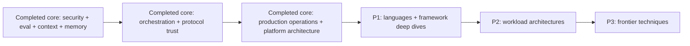

# Coverage Map and Research Queue

**Snapshot date:** 2026-08-31

This map prevents navigation breadth from being mistaken for completed coverage.

## Status summary

| Domain | Status | Current evidence | Next research gate |
|---|---|---|---|
| Agent definition and autonomy choice | Research-backed draft | Core runtime packet | Review additional non-agent alternatives and production case studies |
| Agent loop and execution boundary | Research-backed draft | Core runtime packet | Trace/event-model comparison |
| Tool contracts and execution | Research-backed draft | Core runtime and tool-fleet packets | Code/shell/browser/computer-use workload controls |
| Tool discovery, registry, and fleet operations | Research-backed draft | Tool fleet packet; MCP 2026-07-28 baseline | Cross-provider selection/reduction experiments and private catalog federation |
| Run controls | Research-backed draft | Core runtime packet | Cross-runtime cancellation experiments and framework issue review |
| Durable execution | Research-backed guide cluster | Core runtime + durable-runtime packets | Cross-runtime comparison and five deep dives available; LangGraph covered separately |
| Idempotency and side effects | Research-backed draft | Core runtime packet | Commit-time authorization and transactional outbox packet |
| Runtime failure taxonomy | Research-backed draft | Core runtime packet | Production incident corpus and trace exemplars |
| Prompt and context engineering | Research-backed draft | Cross-cutting security/eval/context/memory packet | Provider-version comparison and workload context-ablation studies |
| Memory architecture | Research-backed draft | Cross-cutting security/eval/context/memory packet | Shared-memory consistency, deletion verification, and defense replication |
| Planning and task decomposition | Research-backed draft | Orchestration/protocol packet | Workload-specific planning ablations and long-horizon plan-drift corpus |
| Multi-agent coordination | Research-backed draft | Orchestration/protocol packet | Production incident corpus, topology cost curves, and shared-state consistency experiments |
| Security and containment | Research-backed draft | Cross-cutting security/eval/context/memory packet | Tenant isolation, incident response, MCP-specific and workload-specific controls |
| Evaluation and observability | Research-backed draft | Cross-cutting security/eval/context/memory packet | Workload-specific suites, online evaluation, rare-event methods, stable OTel mapping |
| Cost and performance | Research-backed draft | Production operations/architectures packet | Cross-provider cache, service-tier, routing, and workload-specific cost experiments |
| Queues, scaling, and SLOs | Research-backed draft | Production operations/architectures packet | Regional failover, approval capacity, and recovery-load experiments |
| Release and incident operations | Research-backed draft | Production operations/architectures packet | Agent incident corpus, effect-reconciliation drills, and cross-runtime rollout comparison |
| Production architectures | Research-backed platform core | Production operations/architectures packet | Separate packets by workload class |
| Language/runtime selection | Research-backed decision guide | Runtime language selection packet | Per-language packets and implementation-specific failure evidence |
| Language ecosystems | Discovery | Shared selection packet and availability map | Python, TypeScript/Node, Go, Rust, Java/Kotlin, and .NET packets |
| SDK/framework deep dives | Research-backed provider-native, independent, lifecycle, and durable-runtime clusters | Comparisons plus OpenAI, Anthropic, Google, Microsoft, LangChain/LangGraph/Deep Agents, Pydantic AI, Vercel AI SDK, Strands, CrewAI, LlamaIndex/LlamaAgents, Mastra, DeepSeek Harness, five durable runtimes, and predecessor migration guides | Newly relevant frameworks and language-specific ecosystems |
| Protocols | Research-backed draft | Orchestration/protocol packet; MCP 2026-07-28 and A2A 1.0.0 pinned | Cross-SDK conformance, enterprise identity, and post-release interoperability evidence |
| Research frontier | Discovery | Paper leads | Maturity rubric and reproducibility review |

## Priority queue

### Completed core — broad production foundations now available

- Agent threat model, permissions, sandboxing, egress, secrets, indirect prompt injection, and memory poisoning baseline.
- Evaluation-driven development, trajectory/state grading, stochastic reliability, adversarial tests, and release gates.
- Observability event model, privacy-safe capture, effect evidence, and current OpenTelemetry maturity boundary.
- Context assembly, budgets, caching semantics, loss-aware compaction, memory writes, retrieval, updates, and deletion baseline.
- Versioned planning, dependency-aware execution, evidence-triggered replanning, and stale-plan controls.
- Multi-agent topology selection, bounded delegation, handoffs, state ownership, result integration, and cancellation fencing.
- MCP 2026-07-28, A2A 1.0.0, and AG-UI boundary/security/lifecycle guidance.
- Bounded queues, fair scheduling, backpressure, retry ownership, deadlines, dead-letter recovery, and overload controls.
- Model routing, cache and service-class economics, cost-per-success accounting, capacity models, task-level SLOs, and tenant isolation.
- Versioned behavioral releases, shadow/canary/rollback, incident command, kill switches, and effect reconciliation.
- Production control-plane, execution-cell, interactive, long-running, and hybrid handoff reference architectures.
- Policy-first tool discovery, progressive schema loading, registry trust boundaries, semantic compatibility, result provenance, and fleet operations.
- Component-level runtime language selection, cancellation/concurrency comparison, ecosystem parity checks, wire-schema rules, and polyglot boundary guidance.
- Provider-native runtime selection plus production deep dives for OpenAI Agents SDK, Claude Agent SDK/Managed Agents, Google ADK, and Microsoft Agent Framework.
- Independent framework selection plus production deep dives for LangChain/LangGraph/Deep Agents, Pydantic AI, Vercel AI SDK, and Strands Agents.
- Lifecycle-aware selection plus AutoGen/Semantic Kernel migration and production guides for CrewAI, LlamaIndex/LlamaAgents, Mastra, and the DeepSeek Harness preview boundary.
- Durable-runtime selection plus Temporal, Restate, DBOS, Prefect, and Dapr Workflow deep dives covering replay, effects, waits, cancellation, versioning, storage, security, and operations.

### P1 — Remaining ecosystem decisions

- Go, Python, TypeScript/Node.js, Rust, Java, C#, Kotlin, and other justified runtimes.
- Newly relevant frameworks that clear the research and adoption threshold.
- Additional queue/scheduler systems beyond the researched durable-runtime core.

### P2 — Complete workload architectures

- Assistants, coding, research, browser/computer use, infrastructure, customer support, workflow, long-running autonomous, local desktop, and multi-tenant SaaS agents.

### P3 — Frontier

- Learned tool routing, adaptive memory, reflection, experience replay, agent-generated skills, self-improvement boundaries, world models, and reinforcement approaches.

## Gap review rule

Every new deep guide must update this map. Every five deep guides, perform a cross-domain gap review for duplicated concepts, conflicting recommendations, stale status, and missing bidirectional links.
