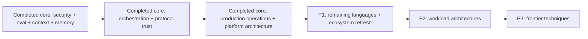

# Coverage Map and Research Queue

**Snapshot date:** 2026-08-31

This map prevents navigation breadth from being mistaken for completed coverage.

## Status summary

| Domain | Status | Current evidence | Next research gate |
|---|---|---|---|
| Agent definition and autonomy choice | Research-backed draft | Core runtime packet | Review additional non-agent alternatives and production case studies |
| Agent loop and execution boundary | Research-backed draft | Core runtime packet | Trace/event-model comparison |
| Tool contracts and execution | Research-backed draft | Core runtime and tool-fleet packets | Code/shell/browser/computer-use workload controls |
| Tool discovery, registry, and fleet operations | Research-backed draft | Tool fleet packet; MCP 2026-07-28 baseline | Cross-provider selection/reduction experiments and private catalog federation |
| Run controls | Research-backed draft | Core runtime packet | Cross-runtime cancellation experiments and framework issue review |
| Agent state and event contracts | Research-backed draft | Dedicated state/event packet; CloudEvents, Trace Context, SSE, OTel GenAI, and AG-UI evidence | Adapter conformance suites and production event-corpus review |
| Durable execution | Research-backed guide cluster | Core runtime + durable-runtime packets | Cross-runtime comparison and five deep dives available; LangGraph covered separately |
| Idempotency and side effects | Research-backed draft | Core runtime packet | Commit-time authorization and transactional outbox packet |
| Runtime failure taxonomy | Research-backed draft | Core runtime packet | Production incident corpus and trace exemplars |
| Prompt and context engineering | Research-backed draft | Cross-cutting security/eval/context/memory packet | Provider-version comparison and workload context-ablation studies |
| Memory architecture | Research-backed draft | Cross-cutting security/eval/context/memory packet | Shared-memory consistency, deletion verification, and defense replication |
| Planning and task decomposition | Research-backed draft | Orchestration/protocol packet | Workload-specific planning ablations and long-horizon plan-drift corpus |
| Multi-agent coordination | Research-backed draft | Orchestration/protocol packet | Production incident corpus, topology cost curves, and shared-state consistency experiments |
| Security and containment | Research-backed draft | Cross-cutting security/eval/context/memory packet | Tenant isolation, incident response, MCP-specific and workload-specific controls |
| Evaluation and observability | Research-backed draft | Cross-cutting security/eval/context/memory packet | Workload-specific suites, online evaluation, rare-event methods, stable OTel mapping |
| Cost and performance | Research-backed draft | Production operations/architectures packet | Cross-provider cache, service-tier, routing, and workload-specific cost experiments |
| Queues, scaling, and SLOs | Research-backed draft | Production operations/architectures packet | Regional failover, approval capacity, and recovery-load experiments |
| Release and incident operations | Research-backed draft | Production operations/architectures packet | Agent incident corpus, effect-reconciliation drills, and cross-runtime rollout comparison |
| Production architectures | Research-backed platform core | Production operations/architectures packet | Separate packets by workload class |
| Real-world agent blueprints | 50-category baseline complete; review ledger retained | Fifty-category registry, blueprint expansion program, public-landscape benchmark, cross-cutting D0–D4 controls packet; all fifty areas are integrated, 28 have recorded Pass-2 completion, and the remaining rows retain explicit review maturity rather than implying live background work | Scope any future usefulness, production/security, and contradiction review deliberately; do not create duplicate categories |
| Language/runtime selection | Research-backed decision cluster; deep-area expansion active | Runtime selection packet, Python/TypeScript direct comparison, Go/Python/TypeScript three-runtime comparison, and production overview guides | Multi-guide Rust, Python, TypeScript/Node.js, Go, JVM, and .NET implementation areas |
| Language ecosystems | Research-backed deep cluster; iterative refinement active | Rust 12-guide, TypeScript 11-guide, Python/Go 14-guide, Node.js and C#/.NET 15-guide, and JVM Java/Kotlin 16-guide playbooks; Python, TypeScript, Node.js, JVM, and .NET Pass-2 refinement complete | Run production/security and contradiction passes; add languages only when ecosystem evidence and reader value justify them |
| SDK/framework deep dives | Research-backed deep clusters; multi-guide expansion active | AutoGen retained-estate and DeepSeek preview 10-guide areas; OpenAI, Google ADK, Vercel, Strands, CrewAI, LlamaIndex/LlamaAgents, and Semantic Kernel 12-guide areas; Claude and Microsoft Agent Framework 13-guide areas; Pydantic AI, LangGraph, and Mastra 14-guide playbooks | Review remaining active framework/harness and language expansions, then fill durable-runtime folders |
| Protocols | Research-backed draft | Orchestration/protocol packet; MCP 2026-07-28 and A2A 1.0.0 pinned | Cross-SDK conformance, enterprise identity, and post-release interoperability evidence |
| Research frontier | Discovery | Paper leads | Maturity rubric and reproducibility review |

## Priority queue

### Completed core — broad production foundations now available

- Agent threat model, permissions, sandboxing, egress, secrets, indirect prompt injection, and memory poisoning baseline.
- Evaluation-driven development, trajectory/state grading, stochastic reliability, adversarial tests, and release gates.
- Observability event model, privacy-safe capture, effect evidence, and current OpenTelemetry maturity boundary.
- Context assembly, budgets, caching semantics, loss-aware compaction, memory writes, retrieval, updates, and deletion baseline.
- Versioned planning, dependency-aware execution, evidence-triggered replanning, and stale-plan controls.
- Multi-agent topology selection, bounded delegation, handoffs, state ownership, result integration, and cancellation fencing.
- MCP 2026-07-28, A2A 1.0.0, and AG-UI boundary/security/lifecycle guidance.
- Bounded queues, fair scheduling, backpressure, retry ownership, deadlines, dead-letter recovery, and overload controls.
- Model routing, cache and service-class economics, cost-per-success accounting, capacity models, task-level SLOs, and tenant isolation.
- Versioned behavioral releases, shadow/canary/rollback, incident command, kill switches, and effect reconciliation.
- Production control-plane, execution-cell, interactive, long-running, and hybrid handoff reference architectures.
- Policy-first tool discovery, progressive schema loading, registry trust boundaries, semantic compatibility, result provenance, and fleet operations.
- Component-level runtime language selection, cancellation/concurrency comparison, ecosystem parity checks, wire-schema rules, and polyglot boundary guidance.
- Python and TypeScript/Node.js production runtime deep dives plus a direct decision guide covering cancellation, CPU isolation, streams, schemas, deployment, packaging, telemetry, and operational failure tests.
- Go production runtime deep dive plus a three-runtime decision guide covering goroutine ownership, context cancellation, HTTP/process safety, framework and MCP maturity, durable-runtime support, container resources, diagnostics, and failure injection.
- Application-owned agent state and event contracts covering stable identity, fenced state transitions, terminal invariants, ordering, snapshots/deltas, reconnect/replay, effect evidence, telemetry boundaries, and framework adapters.
- Provider-native runtime selection plus production deep dives for OpenAI Agents SDK, Claude Agent SDK/Managed Agents, Google ADK, and Microsoft Agent Framework.
- Independent framework selection plus production deep dives for LangChain/LangGraph/Deep Agents, Pydantic AI, Vercel AI SDK, and Strands Agents.
- Lifecycle-aware selection plus deep retained-estate guides for AutoGen and Semantic Kernel, their migration paths, and production guides for CrewAI, LlamaIndex/LlamaAgents, Mastra, and the DeepSeek Harness preview boundary.
- Durable-runtime selection plus Temporal, Restate, DBOS, Prefect, and Dapr Workflow deep dives covering replay, effects, waits, cancellation, versioning, storage, security, and operations.

### P1 — Remaining ecosystem decisions

- Direct cross-runtime decisions and other justified ecosystems; Rust, Java/Kotlin JVM, and C#/.NET deep playbooks are available.
- Newly relevant frameworks that clear the research and adoption threshold.
- Additional queue/scheduler systems beyond the researched durable-runtime core.

### P2 — Complete workload architectures (active)

- Build and review the rolling [real-world agent blueprint cohort](../agents/README.md). All fifty distinct areas have passed the first integration gate, now including Localization and Transcreation Operations. Released first-pass capacity has shifted entirely to refinement rather than duplicate category creation.
- Promote only categories that pass the [blueprint expansion program](agent-blueprint-expansion-program.md); merge or hold categories whose authority, recovery, and evaluation models are not distinct.

### P3 — Frontier

- Learned tool routing, adaptive memory, reflection, experience replay, agent-generated skills, self-improvement boundaries, world models, and reinforcement approaches.

## Cross-domain gap review — 2026-08-31

The Python/TypeScript and Go batches form the first five language-specific production and comparison guides and were reviewed against the runtime, framework, reliability, security, evaluation, operations, architecture, protocol, and decision layers.

- **Status and navigation:** root, learning path, research hub, language/comparison indexes, and reciprocal runtime/framework links expose both packets and five guides. Go, Python, and TypeScript/Node.js are no longer labeled discovery or queued.
- **Canonical-boundary check:** the language guides specialize concurrency, cancellation, schemas, deployment, packaging, process/HTTP ownership, and runtime health; they link to rather than replace canonical effect safety, durable execution, security, evaluation, protocol, and framework semantics.
- **Contradiction check:** no conflict was found in cancellation, persistence, sandbox, type-safety, or durability claims. All layers retain the same invariants: cancellation is cooperative, types do not authorize values, process persistence does not imply effect safety, and runtime permission features are not malicious-code sandboxes.
- **Category-boundary check:** the Go review separates base provider API clients, agent frameworks, MCP SDKs, and durable engines. A Go API SDK is not an Agents SDK, protocol conformance is not authorization, and a framework flow is not automatically durable execution.
- **Material remaining gaps:** workload-specific architectures are the broadest architecture gap; adapter-level state/event conformance and focused reliability failures remain deep cross-cutting gaps; shell/filesystem/network/browser security, workload evals, cost/token engineering, and frontier maturity remain separate research clusters.
- **Next language gate:** Rust, JVM, and .NET now establish runtime-specific ownership, cancellation, process isolation, schema/effect boundaries, and current SDK/protocol/durable maturity. Direct comparison work should use these packets and wait for the dedicated usefulness reviews rather than inheriting assumptions from ecosystem popularity.

## Gap review rule

Every new deep guide must update this map. Every five deep guides, perform a cross-domain gap review for duplicated concepts, conflicting recommendations, stale status, and missing bidirectional links.
