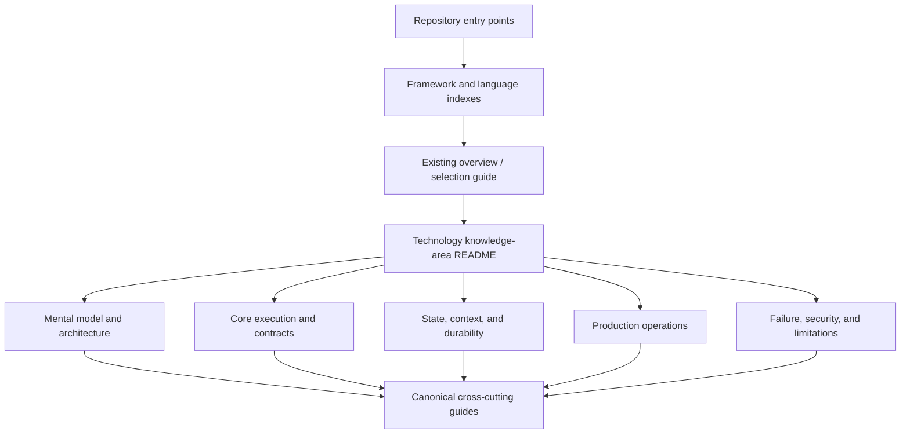
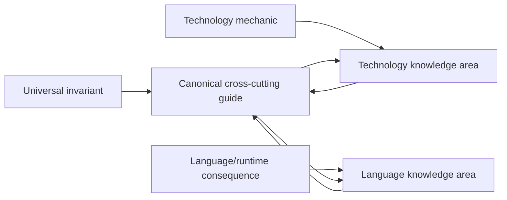
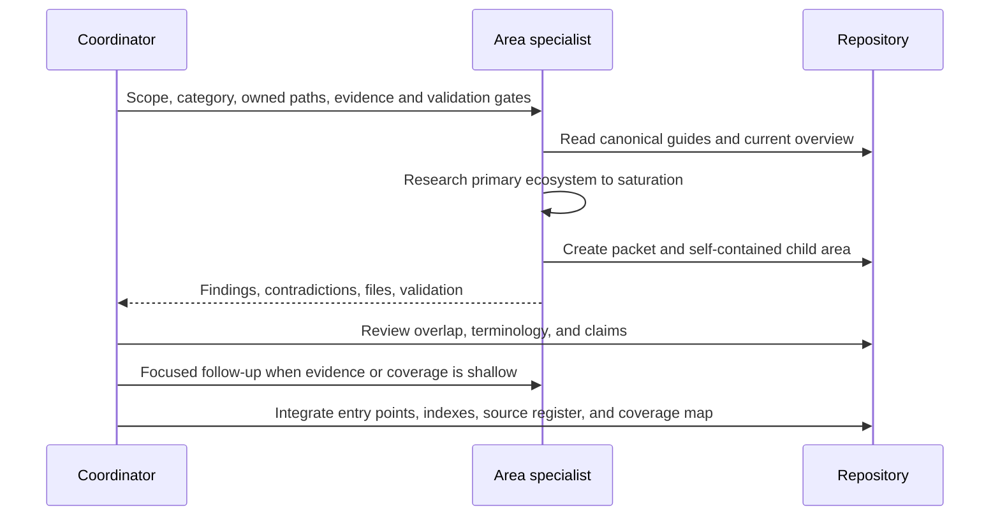

# Deep Knowledge-Area Expansion Program

> **Status:** Active repository expansion program  
> **Baseline date:** 2026-08-31  
> **Purpose:** Transform strong overview guides into navigable, technology-specific and language-specific engineering playbooks without duplicating canonical agent guidance or manufacturing low-value files.

## Why this expansion exists

The repository has a solid production foundation, but its depth is uneven. At this baseline it contains 103 Markdown files. Eighteen significant framework, SDK, harness, and durable-runtime ecosystems are each represented by one guide of roughly 1,000–1,400 words. The language section has useful production guides for Go, Python, and TypeScript/Node.js, but no language-specific subdirectories. No framework or language yet has a true multi-guide knowledge area.

That structure is good for discovery and comparison. It is not deep enough for an engineer who needs to implement, debug, secure, upgrade, and operate one selected stack.

The expansion does not discard the existing overview guides. Each strong overview becomes one of:

- a stable entry point that routes readers into a deeper area;
- a concise cross-technology comparison that remains outside any vendor folder;
- a migration bridge while a new area is being developed;
- a canonical summary when the detailed mechanics live in child guides.

## Target information architecture

A folder is justified when a reader can reasonably need several independent learning or operational paths. The folder name identifies one real technology or runtime, not a marketing category. Examples include an SDK, an agent graph runtime, a durable engine, a language runtime, or a workspace harness.

An area must not collapse distinct products merely because they share a vendor. For example:

- a base model API client is not an agent SDK;
- an agent library is not its hosted deployment platform;
- a checkpoint library is not automatically a durable workflow engine;
- an observability product is not the runtime it observes;
- a protocol SDK is not a permission or sandbox system;
- Python and TypeScript packages with different release and feature histories are separate adoption surfaces.

## File-boundary rule

Create a child guide only when it has an independent reader question, failure model, and maintenance boundary.

Good boundaries include:

- runtime architecture and request lifecycle;
- tools, structured outputs, and effect handling;
- sessions, state, context, memory, and persistence;
- streaming and event protocols;
- handoffs, subagents, and multi-agent composition;
- cancellation, timeouts, retries, and idempotency;
- testing, tracing, evaluation, and debugging;
- security, approvals, permissions, and tenant isolation;
- deployment, scaling, release, and incident operations;
- version evolution, migration, limitations, and alternatives.

Weak boundaries include:

- one file for a single method that has no separate operational model;
- copied generic advice with a technology name substituted;
- one page per documentation heading regardless of engineering value;
- a “best practices” page that merely repeats the production guide;
- separate files that must always be read together to answer one question.

There is no target file count. A mature, broad ecosystem may justify twenty or more substantial guides. A narrow SDK may justify four. File count is an output of useful boundaries, not a metric.

## Required shape of a deep knowledge area

Every completed area has:

1. a README that states category, maturity, scope, version/research date, reader paths, and the boundary with adjacent products;
2. an architecture model grounded in the technology's actual runtime or source, not a generic agent loop;
3. implementation-focused guides for its major contracts and lifecycle seams;
4. production guidance for ownership, cancellation, state, resources, telemetry, release, and failure recovery;
5. security guidance tied to the technology's real permission, hook, transport, storage, and extension surfaces;
6. known limitations and maturity claims with dates and refresh triggers;
7. a dated research packet that records primary sources, disagreements, exclusions, and adoption-test leads;
8. internal parent/child navigation and reciprocal links to canonical repository guidance;
9. diagrams, tables, and checklists only where they make a relationship or decision materially clearer;
10. validation evidence for Markdown structure, local links, fences, tables, and Mermaid directives.

An area is not “deep” merely because it has many words. It must answer how the technology behaves under cancellation, partial failure, concurrent state, upgrade, overload, hostile input, and operational diagnosis.

## Canonicality and duplication rules

Put a claim in a canonical cross-cutting guide when it is true regardless of SDK or language: external effects need idempotency, cancellation is not rollback, untrusted data needs policy separation, and durable replay has effect constraints.

Put a claim in a technology area when the implementation changes the engineering decision: exact checkpoint semantics, event types, retry defaults, hook ordering, session ownership, tool schema conversion, or hosted deployment behavior.

Put a claim in a language area when the runtime changes the implementation: task ownership, event-loop blocking, process cleanup, serializer defaults, allocator or garbage collector behavior, profiling, package resolution, or graceful shutdown.

Technology and language guides should summarize the relevant invariant briefly and link to the canonical guide. Canonical guides should link back to specialized implementations when they provide useful concrete evidence.

## Research depth gate

Each major area researches five evidence layers:

| Layer | Evidence sought | Promotion gate |
|---|---|---|
| Intended behavior | Official docs, API reference, specification, examples | Supported surface and stated guarantees are pinned to a version/date |
| Actual implementation | Official repository, source, tests, package metadata | Important defaults and lifecycle behavior are verified where docs are ambiguous |
| Evolution | Releases, changelogs, migrations, deprecations | Adoption guidance reflects current rather than historical behavior |
| Failure and operations | Maintainer issues/discussions, incident reports, production engineering | Failure claims are bounded; high-risk seams become adoption tests |
| Security and limits | Security docs/advisories, permission model, transport/storage boundaries | Product features are not promoted into guarantees they do not provide |

Research is saturated for one guide only when additional credible sources stop changing its architecture model, failure model, recommendations, maturity label, or adoption tests. A landing page plus API tutorial is never sufficient for a major area.

## Parallel research contract

Specialized agents receive exclusive file ownership for one new knowledge area. They may read the entire repository but must not concurrently edit shared indexes, parent READMEs, coverage maps, or canonical guides. The coordinator owns those shared files.

The coordinator must reject or rework:

- vendor claims presented as independent production evidence;
- issue reports generalized into prevalence claims;
- undocumented APIs or invented maturity;
- generic content duplicated across many areas;
- missing failure, security, or version boundaries;
- navigation islands;
- artificial micro-files;
- changes to unrelated user work.

## Baseline gap analysis

### Framework, SDK, and harness compression

The following existing overview guides are valuable entry points but not complete knowledge areas:

| Expansion wave | Existing surface | Main depth gaps |
|---|---|---|
| Wave 1 | OpenAI Agents SDK | Python/TypeScript runtime parity, runner lifecycle, tools, sessions, handoffs, streaming, tracing/evals, safety, operations, migration |
| Wave 1 | LangChain/LangGraph/Deep Agents | Product separation, graph state, checkpoints, interrupts, replay/effects, subgraphs, server queues, deployment, tenancy, failure recovery |
| Wave 2 | Claude Agent SDK and Managed Agents | Local SDK versus managed runtime, process/workspace lifecycle, sessions, tools/MCP/hooks, permissions, hosting, scaling, state retention |
| Wave 2 | Google ADK | Language parity, runners/events, sessions/artifacts, workflows, tools/plugins, deployment, state/concurrency, evaluation and operations |
| Wave 2 | Microsoft Agent Framework | Package maturity, agents versus workflows, providers, middleware, checkpoints/HITL, hosting, AutoGen/Semantic Kernel migration |
| Wave 3 | Pydantic AI, Strands, Vercel AI SDK, Mastra | Each needs independent runtime, state, tool, streaming, durable, deployment, security, and version areas |
| Wave 3 | CrewAI, LlamaIndex/LlamaAgents, DeepSeek Harness | Product and maturity boundaries, persistence, orchestration, plugins, runtime failure, deployment, and migration |
| Wave 3 | AutoGen and Semantic Kernel | Separate retained-product knowledge plus evidence-based migration to Microsoft Agent Framework |
| Wave 4 | Temporal, Restate, DBOS, Prefect, Dapr Workflow | Language-specific SDK behavior, deep replay/effect semantics, testing, operations, security, scaling, upgrades, incident repair |

Framework expansion priority is determined by user relevance, ecosystem maturity, semantic complexity, current overview compression, and volatility—not popularity alone.

### Language compression

| Expansion wave | Runtime | Main depth gaps |
|---|---|---|
| Wave 1 | Rust | Tokio ownership/cancellation safety, processes/sandboxing, Serde/schema, ecosystem maturity, durability, telemetry, resources, supply chain |
| Wave 2 | Python | Async ownership, sync/CPU boundaries, workers, validation, packaging, memory, profiling, framework integration, production recipes |
| Wave 2 | TypeScript and Node.js | Separate language/build contracts from Node runtime; event loop, streams, workers, packages, deployment targets, diagnostics |
| Wave 2 | Go | Goroutine ownership, channels/backpressure, HTTP/process lifecycle, schemas, workers, profiling, container limits, framework integrations |
| Wave 3 | Java and Kotlin | Virtual threads/reactive/coroutine boundaries, JVM resources, frameworks, serialization, deployment, profiling, durable workers |
| Wave 3 | C#/.NET | Task/cancellation/hosted services, HTTP resilience, DI scope, serialization, diagnostics, Azure/Microsoft integrations, durable workers |

The existing production guides remain usable while their content is decomposed. Migration must preserve URLs or leave explicit entry points; no strong overview is deleted merely to create a directory.

### Cross-cutting depth gaps

The broadest missing areas are workload-specific reference architectures: coding, research, browser/computer-use, infrastructure, support, local desktop, long-running autonomy, and multi-tenant SaaS.

The deepest missing cross-cutting clusters are:

- event schemas and state/execution semantics;
- effect commit, authorization, reconciliation, and transactional outbox patterns;
- shell, filesystem, browser, network, and code-execution security by workload;
- production failure casebooks and trace exemplars;
- memory consistency, deletion verification, shared-memory concurrency, and poisoning recovery;
- context quality measurement, compaction loss tests, cache interactions, and provider limits;
- workload-specific evaluation suites, rare-event methods, and online release gates;
- token/cost accounting, routing experiments, cache economics, and recovery load;
- protocol identity, authorization, conformance, and multi-tenant deployment;
- frontier-technique maturity and reproducibility.

These remain canonical areas. SDK and language specialists must link to them rather than create incompatible local definitions.

## Integration and review gates

An expansion wave is integrated only after:

- every specialist output is reviewed against its sources and current overview;
- category and maturity claims are reconciled across areas;
- duplicated universal guidance is reduced to links;
- entry points and parent/child navigation are updated;
- the root README, START-HERE, section indexes, topic/technology/language/decision indexes, research hub, source register, and coverage map agree;
- reciprocal links exist from relevant canonical guides;
- local links, H1 count, heading order, fences, tables, and Mermaid blocks validate;
- no non-Markdown artifact was introduced;
- the final diff contains no unrelated rewrites or accidental loss of existing content.

Every five substantial child guides trigger a cross-domain review. Every completed technology area triggers a focused category, version, security, and alternatives review.

## Completion rule

The repository is not complete when every technology has a folder. It is complete only when the important areas let an engineer avoid restarting the same primary-source research from zero and still make a defensible production decision.

Until then, the coverage map must say what is deep, what is an entry point, what is actively expanding, and what evidence would promote the next area.

