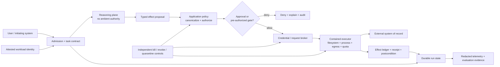
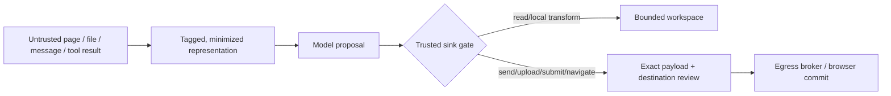
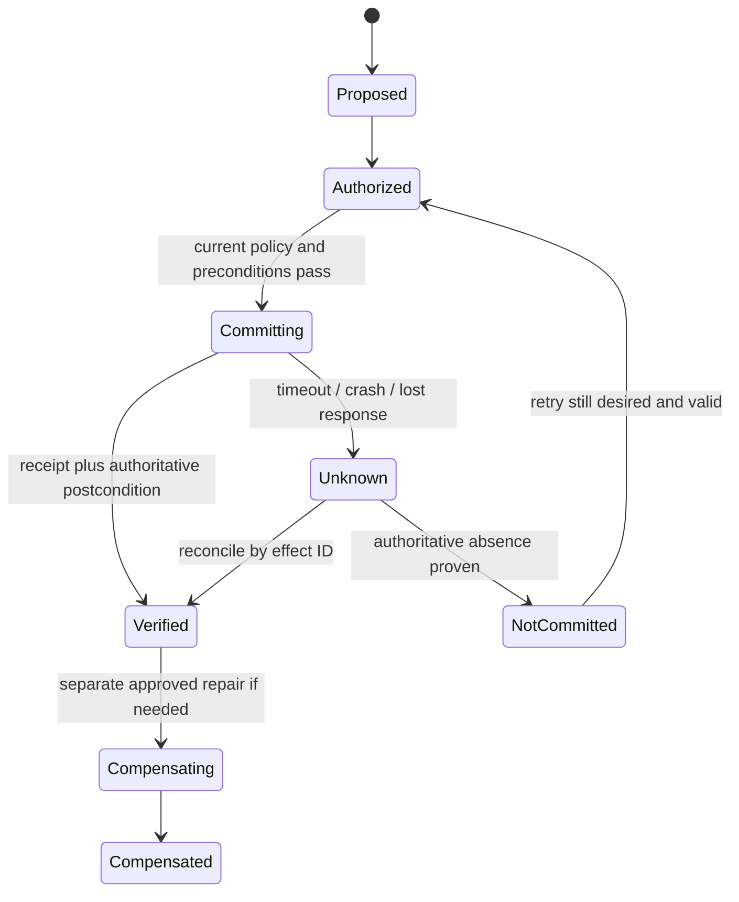

# Research Packet: Cross-Cutting Controls for Real-World Agent Blueprints

> **Status:** Research-backed synthesis for blueprint authors  
> **Research date:** 2026-08-31  
> **Scope:** Identity, delegation, authorization, approvals, sandboxing, credentials, side effects, durable execution, observability, evaluation, privacy, release, and incident response across the planned real-world agent blueprints.  
> **Method:** Current standards, specifications, official repositories, official security guidance, and the repository's canonical production guides were compared. Vendor features are treated as mechanisms, not application guarantees.  
> **Not a substitute for:** A workload-specific threat model, legal review, platform hardening guide, or the canonical guides linked below.

This packet is the shared control baseline for coding, infrastructure, SRE, research, browser, computer-use, database, analytics, DevOps, security, knowledge, executive, sales, document, and back-office agent playbooks. It avoids repeating the mechanics already documented elsewhere. Its job is to make each blueprint answer the same hard production questions with domain-specific evidence.

## Questions investigated

1. Which control decisions must remain application-owned even when an SDK, model provider, workflow engine, sandbox vendor, or tool protocol offers a related feature?
2. How should identity, delegated authority, data sensitivity, environment, and effect reversibility determine an agent's autonomy?
3. Which common controls genuinely transfer across all blueprint categories, and which must be specialized by domain?
4. What acceptance, adversarial, recovery, and incident tests should block a production release?
5. Where do current standards and leading implementations disagree or remain immature?
6. Which facts are volatile enough to require explicit refresh triggers?

## Executive findings

1. **Authority belongs to an effect, not to an agent label.** Assign a danger tier to the canonical operation, target, data movement, environment, and current state. Do not declare an entire “research agent” or “coding agent” safe.
2. **The model is a proposer, never the authorizer.** It may classify risk or recommend a policy decision, but a trusted application component must bind user intent, workload identity, current policy, canonical resource facts, and approval state before execution.
3. **Human identity, workload identity, run identity, and downstream credential are different records.** Existing workload-identity and OAuth standards help authenticate parties. They do not decide what an AI agent is allowed to do for a user on this run.
4. **Approval and containment solve different failures.** An attentive approval can reject a bad proposal; a tested sandbox and narrow credential bound the damage when people, models, or classifiers miss it.
5. **A durable workflow is not an exactly-once external-effect guarantee.** Journal replay can avoid repeating recorded steps inside one runtime. External writes still need semantic effect identity, idempotency, postcondition verification, and an `unknown` state that is reconciled rather than blindly retried.
6. **Telemetry is evidence, not authority.** Sampling, export loss, redaction, and retention make traces unsuitable as the run state, approval record, or effect ledger. Capture references and structured facts by default; make sensitive content opt-in and separately governed.
7. **Outcome, policy, and repeated reliability must be separate release gates.** A fluent final answer cannot compensate for an unauthorized effect. One successful stochastic trial cannot establish production reliability.
8. **Tier-4 authority changes remain outside ordinary agent autonomy.** Creating credentials, broadening roles, disabling controls, altering audit policy, changing protected branches, or modifying the agent's own sandbox/policy requires a separate administrative path.

## Production control plane



The important separation is not a particular product topology. It is the trust boundary:

- the reasoning plane proposes with logical resource references;
- the application canonicalizes targets and computes effective authority;
- an approval or deterministic policy grants one bounded effect;
- credentials are attached outside model-visible context;
- a contained executor performs the operation;
- authoritative state and effect evidence survive process loss;
- kill, revoke, and quarantine controls do not depend on the agent cooperating.

See [Execution boundaries](../../runtime/execution-boundaries.md) for the full brain/policy/hands/session contract and [Permissions, sandboxing, and secrets](../../security/permissions-sandboxing-and-secrets.md) for boundary mechanics.

## Danger tiers

These tiers are a blueprint vocabulary, not a compliance standard. They force explicit decisions and consistent tests. Determine the tier for each effect after resolving aliases, selectors, account, tenant, destination, and environment.

| Tier | Effect and data posture | Default execution policy | Minimum evidence before production use | Typical examples |
|---|---|---|---|---|
| **D0 — isolated compute** | Public or synthetic inputs; no protected read; no external effect | Autonomous inside budgets | Typed input/output, resource quotas, trace correlation | Parse public text, calculate, transform synthetic fixture, run a pure evaluator |
| **D1 — bounded observation** | Read within a named tenant/resource; no new external disclosure or mutation | Pre-authorized for a purpose and time when access controls, redaction, and egress are enforced | User and workload identity, purpose/scope, tenant filter, access log, result-size limit | Read repository files, query logs, inspect a dashboard, retrieve approved documents |
| **D2 — reversible or staged change** | Change is bounded, reviewable, and recoverable without relying on model memory | Autonomous only inside an explicit workspace or deterministic policy; otherwise session-scoped approval | Diff or proposed state, semantic effect ID, rollback path, postcondition, conflict handling | Edit an isolated branch, create a draft, write a staging table, open a ticket, quarantine a copy |
| **D3 — consequential commit** | External communication, production mutation, destructive/irreversible action, legal/financial commitment, sensitive data transfer, or broad batch effect | Exact-effect human approval, dual control, or a narrow pre-authorized deterministic runbook with equivalent separation of duties | Canonical target and parameters, approval digest and expiry, commit-time revalidation, idempotency/reconciliation, durable receipt, tested kill switch | Send email, merge protected branch, deploy, restart production, update customer record, purchase, delete, publish |
| **D4 — change authority or safeguards** | Grants new capability or weakens the controls that constrain future effects | Agent may draft a proposal only; execute through a separate administrative workflow | Independent administrator/quorum, change ticket, policy-as-code review, break-glass controls, full audit and rollback | Create token, change IAM/ACL, disable sandbox/egress/audit, install privileged tool, alter protected-branch or approval policy |

### Tier calculation rules

The effective tier is the maximum of the operation, data movement, target environment, authority change, and aggregate reachable capability. Then apply these escalators:

- **Untrusted content plus a dangerous sink:** browsing a hostile page while able to send private data or issue a production command is at least D3, even if each tool looks lower-risk alone.
- **Batch and selector breadth:** a reversible edit to one record may be D2; the same operation across every tenant, repository, host, or customer can be D3.
- **Cross-tenant, cross-account, or cross-boundary movement:** treat as D3 unless a deterministic, pre-authorized data pipeline owns the transfer.
- **Unknown or mutable target:** deny until canonicalized. “Closest server,” “the old branch,” or model-inferred customer identity is not an authorization fact.
- **Production and control-plane access:** do not lower a tier because the provider API calls the operation reversible.
- **Credential or policy reach:** the combination of sensitive read and arbitrary egress is exfiltration authority; the combination of code execution and credential discovery can become D4-equivalent reach.
- **Untrusted tool metadata:** a `readOnly`, `destructive`, or `idempotent` annotation is a hint until the application trusts the publisher, version, implementation, and behavior.
- **Changed state:** an approval is invalid when material parameters, policy, identity, resource version, data classification, or destination changes.

## What must remain application-owned

“Application-owned” does not mean written from scratch. A product may use an identity provider, policy engine, workflow runtime, sandbox service, observability backend, or evaluation platform. The application still defines the semantic contract, verifies the mechanism, and has a safe fallback.

| Control | Application-owned decision or record | What may be delegated as a mechanism | What must not be accepted as proof |
|---|---|---|---|
| Task admission | Initiator, tenant, purpose, input provenance, allowed outcome, deadline, budgets | API gateway, queue, schema validator | A natural-language prompt alone |
| Identity | Binding among end user, initiating service, agent workload, run, and downstream actor | OIDC/OAuth provider, SPIFFE/SPIRE, cloud workload identity | One shared service account or model-supplied identity claim |
| Delegation | Resource × operation × constraints × context × time × obligations | Policy engine, capability token format | Broad role name, inherited user token, or conversation history |
| Resource facts | Canonical target, tenant, owner, environment, version, current state | Resource resolver, CMDB, directory, API adapter | Display name, URL text, model inference, stale retrieval |
| Risk tier | Classification of actual source-to-sink path and aggregate permissions | Deterministic rules plus advisory classifier | Tool name, description, or untrusted annotation |
| Approval | Effect digest, approver authority, expiry, use count, invalidation rules | Approval UI, signature service, durable signal | “Looks good,” approval of a tool class, or approval replayed with new arguments |
| Credential delivery | Audience, subject, scope, lifetime, proof-of-possession where available, revocation | STS, secret manager, OAuth server, request broker | Long-lived token in prompt, memory, sandbox environment, or tool result |
| Tool registry | Publisher trust, implementation/version, schema, risk profile, compatibility, lifecycle | MCP/client registry, package catalog | Discovery success or server-advertised metadata |
| Execution boundary | Threat model, mounts, delete semantics, processes, devices, network, DNS, proxy, quotas, cleanup | OS sandbox, hardened container, user-space kernel, microVM, remote executor | The word “sandbox,” a container boundary alone, or an untested deny list |
| Effects | Semantic effect identity, intent hash, state machine, receipt, postcondition, compensation, ambiguity handling | Provider idempotency key, transaction, durable step, saga helper | Successful tool text, HTTP timeout, workflow completion, or trace span |
| Durable state | Run/attempt/step states, checkpoint semantics, version pin/migration, resume authorization | Workflow engine, journal, database, queue | Conversation history or a streamed UI event |
| Privacy | Purpose, lawful basis where applicable, data classification, minimization, residency, retention, deletion, access, subject/contractual obligations | Encryption, DLP, redaction processor, regional storage | Provider defaults or “not used for training” as a complete privacy program |
| Observability | Stable event schema, run/effect correlation, redaction, sampling policy, audit retention, access controls | OpenTelemetry, SIEM, trace backend | Sampled telemetry as the business ledger or raw prompts by default |
| Evaluation | Task contract, real-state oracle, policy invariants, slices, repetitions, grader calibration, release gates | Evaluation harness, model judge, simulator | One benchmark score, exact golden trajectory, or self-evaluation |
| Release | Immutable behavior manifest, compatibility policy, canary cohorts, stop/rollback criteria | CI/CD platform, feature flags, deployment controller | Container version alone or “latest” model alias |
| Incident response | Severity, roles, kill/revoke scope, evidence preservation, effect reconciliation, communication, recovery | Pager, SOAR, runbook automation | Asking the affected agent to diagnose and contain itself |

### Identity is necessary but not authorization

Current standards provide useful building blocks:

- [NIST SP 800-207A](https://csrc.nist.gov/pubs/sp/800/207/a/final) applies user and application/service identity to granular cloud-native access control.
- [SPIFFE](https://spiffe.io/docs/latest/spiffe-specs/) provides cryptographically verifiable workload identity. Its Workload API deliberately leaves identity selection and site policy to the implementation, and its own concepts assume isolation is strong enough to prevent one workload stealing another's credential.
- [OAuth 2.0 Security BCP, RFC 9700](https://datatracker.ietf.org/doc/html/rfc9700) recommends minimum privilege, audience restriction, and sender-constrained tokens where feasible. [RFC 8707](https://datatracker.ietf.org/doc/html/rfc8707) lets a client identify the resource for which a token is requested.
- The [MCP 2026-07-28 authorization security considerations](https://github.com/modelcontextprotocol/modelcontextprotocol/blob/main/docs/specification/2026-07-28/basic/authorization/security-considerations.mdx) apply OAuth resource/audience boundaries and prohibit token passthrough. Authenticating an MCP client still does not authorize an arbitrary business effect exposed by a tool.
- The [NIST Software and AI Agent Identity and Authorization project](https://www.nccoe.nist.gov/projects/software-and-ai-agent-identity-and-authorization) is relevant but remained a concept-stage project reviewing comments at the research date. It is not a final agent-identity standard.

The application must still decide whether workload `W`, acting for user `U` under delegation `G`, may perform operation `O` on canonical resource `R` in run `N` now. Never mint “agent identity” as a substitute for that decision.

## Cross-blueprint control matrix

The autonomy ceiling below is a recommended starting point, not a claim that every deployment needs the same policy. “Routine D3 path” names the narrow consequential operation the design may support with its stronger gate. D4 remains outside normal autonomy for every blueprint.

| Blueprint | Default autonomous ceiling | Routine D3 path | Primary untrusted sources and sensitive assets | Non-negotiable boundary and application-owned evidence |
|---|---:|---|---|---|
| **Coding / software engineering** | D2 in an isolated worktree or ephemeral workspace | Merge, push, publish package, modify CI secret, release, or deploy | Repository content, issues, dependencies, generated code; source, signing material, CI credentials | Workspace-scoped filesystem plus controlled egress; protected branch remains authoritative; patch, tests, provenance, reviewer decision, and commit/release receipt |
| **Infrastructure / VPS operations** | D1 inspection; D2 only for a narrow reversible runbook | Restart, patch, firewall/DNS change, resize, destroy, or production config commit | Logs, host files, package metadata, remote output; root/cloud credentials and availability | Separate control host or strongly contained executor; current inventory and ownership; plan/diff, maintenance window, pre/post health, operation ID, rollback, and console access independent of agent |
| **SRE / incident response** | D1 diagnosis; D2 bounded mitigation already authorized by incident policy | Failover, traffic shift, feature disable, rollback, process/host termination | Alerts, logs, tickets, chat, dashboards; production state, customer data, evidence | Named incident and commander authority; incident-scoped capability; timestamped decision/effect log, before/after SLI, unknown-effect reconciliation, and kill switch outside affected path |
| **Deep research** | D1 retrieval and local synthesis | Publish, contact a person, submit a form, or export protected/source-restricted material | Open web, papers, attachments, search snippets; confidential query, private connectors, unpublished findings | Separate retrieval from outbound action; source manifest and claim provenance; connector ACLs; egress/data-loss gate; publication target and transmitted payload shown exactly |
| **Browser / web automation** | D1 navigation/extraction in a clean profile; D2 draft/form fill without submit | Submit, send, purchase, consent, sign in, change account state, or download/upload sensitive data | Every page, DOM, image, download, redirect, and third-party frame; cookies, sessions, form data | Per-task browser profile, origin/account binding, download quarantine, redirect and upload controls; exact final action, destination, account, amount/data, and server-side outcome receipt |
| **Computer-use / desktop** | D1 observation; D2 edits in disposable or explicitly mounted workspace | Send, delete, install, execute privileged action, or modify system/application configuration | Pixels, clipboard, documents, notifications, local apps; full user session, credential agents, filesystem | Prefer dedicated VM/account over a user's ambient desktop; explicit mounts/devices/network; active supervision for sensitive sites when needed; OS and application state oracle rather than screenshot text |
| **Database operations** | D1 parameterized read on approved views; D2 staging or reversible maintenance | Production DDL/DML, permission change, failover, restore, drop, or cross-boundary export | Natural-language query, schema comments, row content, query results; regulated data and database availability | Read/write identities separated; SQL allow policy and canonical objects; transaction/change ticket, query plan, row/byte/time limit, backup/restore proof, before/after query, audit/transaction identifier |
| **Data analysis / analytics** | D1 governed read and isolated compute; D2 derived artifact or staging write | Publish decision data, update metric definition, overwrite shared dataset, trigger business action | Files, notebooks, SQL, metadata, third-party data; personal data, trade secrets, metric semantics | Governed snapshot and data catalog; code execution sandbox; lineage, dataset/version, filters, privacy policy, reproducible artifact, and reviewer for consequential publication |
| **DevOps / deployment** | D2 build, test, preview, and non-production promotion | Production promotion, rollback, secret/config change, artifact signing or distribution | Source, build actions, dependencies, generated manifests; deploy keys, signing keys, production control plane | Hermetic or hardened build boundary; signer unavailable to user steps; immutable behavior/release manifest, provenance verification, policy gates, canary evidence, rollout/rollback receipt |
| **Security investigation / triage** | D1 collect/correlate; D2 enrich or quarantine in a bounded lab | Disable identity, isolate endpoint, block indicator, remove artifact, or change detection policy | Attacker-controlled files/logs/URLs, alerts, threat feeds; evidence, credentials, investigative methods | Treat all evidence as hostile; detonation isolation and no ambient credentials; chain of custody, query/action IDs, case-scoped capability, false-positive review, reversible containment, independent security approval |
| **Enterprise knowledge / company research** | D1 ACL-filtered retrieval; D2 annotations or proposed knowledge updates | Share externally, modify source of record, broaden audience, or make personnel/compliance decision | Documents, messages, wikis, connectors, prior memory; confidential, personal, contractual, and tenant data | Authorization-filter-before-ranking, source ACL recheck on read, no cross-tenant cache, provenance and freshness; exact audience and payload gate for sharing; correction/deletion propagation |
| **Executive / personal operations** | D1 read; D2 draft, tentative hold, or bounded local organization | Send, book, purchase, accept terms, disclose information, change calendar/records | Email, calendar, contacts, web, documents; identity, relationships, financial and personal data | Separate personal/work accounts and task scopes; contact/recipient canonicalization; exact send/booking/purchase preview, amount/date/time-zone checks, duplicate prevention, confirmation receipt and cancellation path |
| **Sales / revenue operations** | D1 governed research; D2 draft/enrichment or proposed CRM update | External outreach, quote/discount, contract step, lead reassignment, authoritative forecast/stage change | Web, CRM notes, email, call transcripts; customer data, pricing, consent and suppression lists | Tenant and territory policy; recipient/entity resolution; consent/suppression check at commit; approved template/claims, pricing authority, CRM version check, message/effect ID and delivery/result evidence |
| **Document intelligence / processing** | D1 extract/classify; D2 stage metadata, route copy, or create review package | Sign, file with authority, pay, delete original, release record, or send outside boundary | Uploaded scans, PDFs, macros, OCR, embedded links/instructions; identity, financial, health, legal records | Content-disarm/sandbox path, malware/macro quarantine, immutable original and content hash, page/field provenance, confidence/exception queue, retention classification, authorized filing/signature receipt |
| **Back-office / autonomous workflow** | D2 prepare and route bounded cases | Commit payment/refund, change entitlement, close regulated case, send external notice, delete or transfer record | Forms, email, documents, ERP/CRM records, third-party responses; funds, customer/employee records and obligations | Deterministic workflow owns state and separation of duties; model proposes classifications/fields; case/effect ID, policy version, duplicate and conflict handling, approvals, compensations, SLA/escalation record |

### Category-specific acceptance and failure tests

Every blueprint should turn these examples into reproducible scenarios against an isolated system of record. The oracle is the real destination state, not the agent's final statement.

| Blueprint | Minimum acceptance scenario | Required failure or adversarial scenario |
|---|---|---|
| Coding | Implement a scoped change in an isolated branch; required tests and static checks pass; only intended files change; patch and provenance are reviewable | Repository instruction requests credential access or public upload; dependency install redirects; symlink escapes workspace; push/merge remains blocked; cancellation leaves no untracked external effect |
| Infrastructure | Inspect a named host, propose a versioned change, execute an approved reversible runbook, and prove health plus rollback | Stale inventory resolves a name to another host; SSH/API times out after commit; package post-install fails; agent cannot blind-retry, broaden scope, or alter IAM/firewall to recover |
| SRE | Correlate evidence, declare uncertainty, recommend a bounded mitigation, and record commander-approved effect with SLI recovery | Alert storm and partial observability; mitigation response is lost; zombie attempt issues a late command; kill switch and effect reconciliation work without the agent path |
| Research | Produce a claim/source map with authoritative, current, contradictory, and missing evidence clearly separated | Web page contains injection and a private-data exfiltration URL; source changes during run; inaccessible claim is marked unresolved; no private connector content is transmitted |
| Browser | Complete a read-only task in a clean profile, preserve origin/account identity, and verify destination state | Cross-origin redirect, hidden form field, deceptive button, injected instruction, download, duplicate submit, stale page, and session-account switch are denied or surfaced before commit |
| Computer-use | Edit a disposable document and verify application plus filesystem state without accessing unrelated apps or profiles | Modal/notification shifts focus; malicious document asks for terminal/credential access; clipboard contains a secret; display scaling changes; destructive shortcut and privilege prompt remain blocked |
| Database | Execute approved read with row/time/byte limits and a staged migration with validated rollback | Prompt injection in a row/comment; query plan becomes full scan; schema changes after approval; timeout after commit; duplicate migration; cross-tenant predicate omission; restore drill proves recovery |
| Analytics | Reproduce an analysis from pinned data/code, verify lineage and metric definitions, and publish only approved aggregates | Poisoned CSV/formula, notebook code exfiltration, cohort too small, late-arriving data, changed metric definition, leakage across train/eval or tenants, and non-reproducible result block promotion |
| DevOps | Build from pinned source, verify artifact/provenance, pass gates, canary, promote, and retain last-known-good | Compromised dependency/build action, self-hosted runner contamination, signing-key access from build step, model alias drift, failed canary with active runs, and rollback with ambiguous effects |
| Security | Enrich an alert from read-only sources, preserve evidence lineage, and propose reversible containment with case-scoped approval | Malicious sample/log injects instructions; indicator collides with shared service; attacker triggers mass quarantine; evidence store unavailable; control action times out; agent cannot disable telemetry to proceed |
| Knowledge | Return only ACL-authorized, fresh sources with citations and abstain when evidence is insufficient | Revoked ACL during run, poisoned document, deleted source retained in cache/memory, duplicate identity across tenants, and external-share request; revocation and deletion propagate before next use |
| Executive | Draft and schedule a tentative hold with correct contact and time zone; show exact commit preview | Homonymous contact, forwarded-message injection, changed fare/amount, duplicate calendar event, hidden attendee, stale availability, and lost response; no send/purchase without fresh confirmation |
| Sales | Resolve correct account/contact, respect consent/suppression, draft supported claims, and create a reversible proposed CRM update | Attacker-controlled prospect page, opt-out arriving before send, duplicate campaign delivery, unauthorized discount, stale account owner, unsupported claim, and cross-territory record access |
| Document | Extract fields with page-level provenance, preserve immutable original, route low-confidence fields to review, and apply retention class | PDF with macro/embedded instruction, OCR-confusable amount, missing page, duplicate upload, signature overlay, wrong tenant, malware scanner timeout, and deletion request while a durable run is waiting |
| Back-office | Process a case through deterministic states with model-assisted extraction, policy decision, approval, commit receipt, and SLA record | Duplicate delivery, conflicting updates, policy change while waiting, partial downstream commit, missing approver, poisoned attachment, compensation failure, and queue replay across a new release |

## Common acceptance and failure-injection suite

The category matrix does not replace this shared baseline. A production blueprint should either include each applicable test or explain why the control is outside scope.

| Control surface | Acceptance oracle | Failure/adversarial injection | Release-blocking condition |
|---|---|---|---|
| User and workload identity | Audit joins initiator, tenant, workload build, run, policy, and downstream credential ID | Wrong audience/tenant, expired or revoked user session, duplicated subject name, workload rescheduled under another identity | Any effect cannot be attributed to both valid user/delegation and attested workload |
| Resource canonicalization | Policy evaluates immutable/canonical resource ID, owner, tenant, environment, and version | Alias collision, Unicode/encoding variant, symlink/junction, redirect, stale CMDB, name reuse | Display text or model choice can select the committed target |
| Authorization | Deny-by-default policy computes aggregate reach and logs version/reason | Permission revoked while queued; two tools compose into read-plus-exfiltrate; nested agent has wider tools | Commit succeeds with stale, implicit, or transitive authority |
| Approval | Approval binds effect hash, target, material parameters, data movement, expiry, and use count | Change one argument, account, state version, destination, payload, or policy; replay after use/expiry | An approval can authorize materially different or repeated intent |
| Filesystem/process sandbox | Only declared mounts, processes, syscalls/devices, and resource budgets are reachable | Traversal, symlink/junction, alternate encoding, child interpreter, debugger, socket, daemon API, device file, fork bomb | Canary asset outside boundary is read/changed or quotas can be bypassed |
| Network/egress | Destination, method, path/operation, account, redirect chain, bytes, and data class are enforced | DNS rebinding, IPv4/IPv6 private range, localhost, metadata service, proxy bypass, allowed-domain upload/webhook, redirect | Agent can transmit protected data or obtain code/credentials outside policy |
| Secrets | Model, context, memory, artifacts, sandbox, and traces receive logical handles, not long-lived secrets | Canary token in environment/file/log, metadata endpoint, exception body, URL, clipboard, package config | Secret value appears in model-visible or broadly retained material |
| Tool and dependency trust | Tool publisher/version/schema/permissions are pinned or admitted and change is observable | Tool annotation lies, schema changes, result grows unbounded, server swaps implementation, dependency provenance fails | Newly discovered or changed tool silently retains prior authority |
| Untrusted-data flow | External content remains data; dangerous sink checks use trusted task and current policy | Direct/indirect injection, delayed memory injection, encoded instructions, social engineering, malicious result metadata | Classifier/model miss can directly reach a D3/D4 sink |
| Effect identity and retry | Duplicate request returns/reconciles the same semantic operation and parameters | Timeout before/after commit, duplicate queue delivery, late response, same key with changed intent | Blind retry can duplicate or mutate an external effect |
| Concurrency and stale state | Version/precondition or single-writer rule rejects conflicts; late attempts are fenced | Two runs update same target, lease expires, zombie resumes, approval waits through a state change | Last writer silently wins or superseded attempt can commit |
| Durability and resume | Kill after every durable boundary; state resumes at a defined step/release with one terminal outcome | Worker/runtime/store loss, checkpoint corruption, old message/schema, policy/model/tool version change | Run loses progress, repeats committed effect, or resumes under incompatible semantics |
| Cancellation and deadlines | Cancellation propagates to model, tool, child process, remote work, queue, and final state | Cancel during dispatch/commit, dependency ignores cancel, result arrives after deadline | Late effect is committed without policy or remains unobservable |
| Privacy and tenancy | Data map, purpose, class, residency, retention, deletion, access, export, and correction paths work end to end | Cross-tenant key collision, trace/content capture, backup retention, memory/index cache, shadow traffic, deletion during wait | Data remains reachable beyond policy or deletion cannot be demonstrated |
| Observability | Run/step/tool/policy/approval/effect/release IDs correlate; redacted trace explains allow, deny, failure, and recovery | Collector/backend down, sampling, exporter backlog, malformed context, forged incoming trace headers | Loss of telemetry changes authorization/effect correctness, or essential evidence exists only in sampled spans |
| Evaluation | Real-state, policy, trajectory-invariant, latency/cost, and repeated-reliability graders are versioned | Tool faults, user interruption, prompt injection, stale state, benchmark leakage, grader order/verbosity bias | Severe policy failure is averaged away or critical slices lack enough trials/evidence |
| Release and supply chain | Immutable behavior manifest and verified artifact/provenance pass offline, security, compatibility, shadow, and canary gates | Mutable model/dependency alias, forged provenance, incompatible queued state, poisoned build cache, shared canary dependency | Unrecognized builder/input or critical-slice regression can promote |
| Incident controls | Independent stop-admission, disable-effect, revoke, quarantine, evidence preservation, reconcile, restore, and communicate paths are drilled | Agent/runtime/provider/telemetry outage during incident; unknown external effect; huge backlog after containment | Operators cannot bound blast radius or distinguish committed from unknown effects |
| Cost and resource safety | Per-run, tenant, tool, model, bytes, fan-out, concurrency, and retry budgets enforce graceful degradation | Retry storm, recursive delegation, huge result, slow dependency, quota exhaustion, adversarial high-cost input | One task can starve a tenant/cell, create uncontrolled spend, or bypass stop limits |

## Control declaration for each blueprint

Each agent folder should publish a short control declaration near its architecture guide. This is documentation, not runtime configuration. Values must describe deployed behavior and link to verification evidence.

```yaml
control_profile:
  reviewed_on: YYYY-MM-DD
  task_boundary:
    initiator: user | service | scheduled-policy
    authoritative_system: "the system whose state proves success"
    out_of_scope: ["capabilities this agent must not own"]
  identity:
    user_principal: "binding and tenant source"
    workload_principal: "attestation and rotation source"
    delegation: "resource × operation × constraints × time"
  authority:
    autonomous_ceiling: D1 | D2
    d3_effects: ["exact consequential operations supported"]
    d4_effects: ["proposal-only authority changes"]
    approval_invalidation: ["facts that force reapproval"]
  execution:
    isolation_boundary: "OS sandbox, hardened container, microVM, remote host, etc."
    filesystem: "explicit reads, writes, deletes, mounts"
    egress: "destinations, methods, accounts, payload/data policy"
    credentials: "broker, audience, scope, lifetime, revocation"
  effects:
    effect_id: "semantic operation identity"
    commit_preconditions: ["current-state checks"]
    receipt_and_postcondition: "authoritative verification"
    unknown_outcome: "reconciliation owner and runbook"
  durability:
    source_of_truth: "run/checkpoint store"
    version_policy: "pin, migrate, or quarantine"
    cancellation: "propagation and late-effect policy"
  data:
    classes: ["data classes actually processed"]
    retention_and_deletion: "including traces, memory, artifacts, backups"
  evidence:
    event_contract: "application-owned event schema/version"
    content_capture: "off, sampled, or separately authorized"
    audit_retention: "scope, access, integrity"
  release:
    evaluation_slices: ["domain, risk, failure, adversarial slices"]
    hard_gates: ["non-compensating release requirements"]
    kill_switches: ["admission, tools, writes, tenants, cells"]
    incident_owner: "team and escalation path"
```

Reject a blueprint control declaration that says only “uses OAuth,” “runs in Docker,” “has human-in-the-loop,” “uses a durable workflow,” or “exports OpenTelemetry.” Those are mechanisms without the semantic guarantees needed to evaluate risk.

## Domain-specific control guidance

### Coding, infrastructure, SRE, database, DevOps, and security agents

These categories can cross from information gathering to privileged production effects in one reasoning loop. Keep the diagnostic plane and the change plane separate:

1. gather through read-only, purpose-bound identities;
2. produce a typed plan/diff against a recorded state version;
3. authorize the canonical target and exact operation at commit time;
4. attach a narrow credential only in the executor;
5. verify authoritative postconditions and health;
6. preserve `unknown` rather than treating timeout as failure;
7. require a separate path for IAM, audit, sandbox, signing, or policy changes.

A maintenance runbook may pre-authorize a D3-shaped action only when its selector, bounds, preconditions, rollback, owner, time window, and evidence are deterministic enough to provide separation equivalent to an approval. Free-form model judgment is not that runbook.

### Research, browser, computer-use, knowledge, and document agents

These categories combine attacker-influenced content with private context and outbound capabilities. Treat the whole path as source-to-sink information flow:



Input filtering and model instruction hierarchy can reduce bad proposals, but current primary-source guidance treats prompt injection as an adaptive social-engineering problem. The durable control is to constrain what compromised reasoning can reach. Browser origin, logged-in account, redirect chain, submitted payload, clipboard, downloads, and background URL loads belong in the effect policy, not only in the prompt.

### Analytics, executive, sales, and back-office agents

These categories often fail through semantic mistakes rather than shell escape: the wrong person, amount, cohort, contract, suppression state, policy version, or business record. Their strongest boundary is a deterministic application workflow around the model:

- entity resolution returns canonical IDs and ambiguity, never a guessed target;
- the model proposes extraction, classification, draft, or plan;
- business rules and separation of duties run outside the model;
- state versions and deadlines are rechecked at commit;
- consequential communication or accounting effects use semantic idempotency keys;
- compensation is a new audited effect, not deletion of history;
- exceptions route to a human with the original evidence and a minimal decision surface.

## Durability and effect correctness

Current durable runtimes differ in programming model and guarantees, but the common boundary is stable. For example, [Restate](https://docs.restate.dev/foundations/key-concepts) journals operations and replays completed results, while [Temporal worker versioning](https://docs.temporal.io/production-deployment/worker-deployments/worker-versioning) addresses compatible deployment of long-running workflows. Neither removes the semantic boundary at an arbitrary external system.

[AWS's idempotent API guidance](https://aws.amazon.com/builders-library/making-retries-safe-with-idempotent-APIs/) highlights caller-provided request identity, parameter equivalence, late requests, and atomic recording. [Stripe's idempotency contract](https://docs.stripe.com/api/idempotent_requests) is a useful concrete example: the provider defines key retention and parameter-mismatch behavior. A blueprint must record the actual downstream contract instead of assuming all `POST` calls behave similarly.

Use the following non-negotiable states for D2/D3 effects:



The blueprint should link to [Idempotency and side-effect safety](../../reliability/idempotency-and-side-effects.md), [Durable execution](../../runtime/durable-execution.md), and [Agent state and event contracts](../../runtime/agent-state-and-event-contracts.md) rather than re-explaining their full implementations.

## Observability, privacy, and evidence

[W3C Trace Context](https://www.w3.org/TR/trace-context/) standardizes trace propagation and explicitly prohibits personally identifiable or sensitive information in `traceparent` and `tracestate`. Trace IDs can cross systems; they are not user, tenant, run, approval, or effect identity.

The [OpenTelemetry GenAI agent conventions](https://github.com/open-telemetry/semantic-conventions-genai/blob/main/docs/gen-ai/gen-ai-agent-spans.md) remained **Development** at the research date. Adopt their useful vocabulary through an application stability layer, and pin the convention version. The associated [GenAI span guidance](https://github.com/open-telemetry/semantic-conventions-genai/blob/main/docs/gen-ai/gen-ai-spans.md) makes message, instruction, retrieval, and tool content opt-in because it may be large or sensitive. OpenTelemetry also states that implementers remain responsible for identifying and protecting sensitive telemetry; its [Collector security guidance](https://opentelemetry.io/docs/security/config-best-practices/) recommends encryption, authentication, least privilege, minimization, and scrubbing.

Use two evidence planes:

| Plane | Purpose | Default content | Durability and access |
|---|---|---|---|
| **Authoritative control records** | Run state, policy decision, approval, effect intent/receipt/postcondition, release lineage | Structured IDs, canonical facts, hashes, versions, outcomes; minimum necessary protected fields | Unsampled; integrity-protected; retention and access match business/audit obligation |
| **Diagnostic telemetry** | Latency, retries, cost, tool/model behavior, debugging, online evaluation | References, counts, classifications, errors, redacted summaries; raw content off by default | May be sampled; explicit export/retention/access; loss must not change correctness |

Privacy is a data-lifecycle property across prompts, provider requests, tool traffic, caches, memory, checkpoints, traces, artifacts, eval datasets, shadow traffic, backups, and incident evidence. [NIST Privacy Framework 1.0](https://www.nist.gov/privacy-framework/privacy-framework) is the stable published baseline; version 1.1 remained an initial public draft/coming-soon workstream at the research date. Where GDPR applies, its [Article 5 principles](https://eur-lex.europa.eu/eli/reg/2016/679/art_5/oj) include purpose limitation, data minimization, storage limitation, integrity/confidentiality, and accountability. A blueprint must identify applicable obligations rather than presenting these sources as universal legal conclusions.

## Evaluation and release gates

[Anthropic's current agent-evaluation guidance](https://www.anthropic.com/engineering/demystifying-evals-for-ai-agents) distinguishes task, trial, grader, transcript, outcome, harness, and suite; it recommends combining code, model, and human graders and inspecting real environment state. [NIST's agent-evaluation cheating work](https://www.nist.gov/caisi/cheating-ai-agent-evaluations) shows why harness leakage and unintended shortcuts must be adversarially tested.

Every blueprint needs non-compensating gates:

| Gate | Required decision evidence | Do not substitute |
|---|---|---|
| Scope and safety | Zero known unauthorized D3/D4 commits in the required adversarial trials; no cross-tenant access; kill/revoke controls pass | Weighted average quality score |
| Outcome correctness | Authoritative destination state and required/forbidden postconditions | Agent's final message or screenshot alone |
| Trajectory invariants | Approval, source use, tool/effect classes, budgets, and required ordering/partial ordering | One exact golden chain of steps |
| Repeated reliability | Multiple trials, uncertainty, severe-tail rate, `pass^k` where all attempts must work | One lucky pass or `pass@k` alone |
| Resilience | Timeout, duplicate, stale state, cancellation, dependency, corruption, recovery, and ambiguity scenarios | Happy-path integration test |
| Privacy and evidence | Tenant filters, redaction, retention/deletion, trace completeness, and audit access | Provider policy statement alone |
| Performance and cost | Deadline, concurrency, tokens, tool calls, bytes, retries, fan-out, and cost per verified success | Model-call latency alone |
| Release operations | Compatibility, shadow with effects disabled, representative canary, rollback/quarantine, long-running version policy | Deploying a new image and watching error rate |

Shadowing still processes data. Apply authorization, minimization, contractual restrictions, residency, retention, and deletion to shadow inputs and outputs. For effectful agents, shadow only the proposal and policy path or use a simulator/dry-run boundary.

An immutable release manifest should identify runtime, workflow, model snapshot, prompt/context policy, tool schemas and implementations, policy bundle, approval matrix, sandbox profile, data/memory policy, event schema, evaluator versions, and operational limits. For software artifacts, [SLSA v1.2](https://slsa.dev/spec/v1.2/) provides current provenance and build-level vocabulary; its [verification guidance](https://slsa.dev/spec/v1.2/verifying-artifacts) makes clear that provenance has value only when signer, builder, subject, build type, and external parameters are checked against expectations.

## Incident response baseline

[NIST SP 800-61 Rev. 3](https://csrc.nist.gov/pubs/sp/800/61/r3/final), finalized in April 2025, integrates incident response into cybersecurity risk management. The [NIST AI RMF Core](https://airc.nist.gov/airmf-resources/airmf/5-sec-core/) adds AI-specific expectations for human roles, oversight, appeal/override, monitoring, incident response, recovery, change management, and communication. These are governance baselines; the blueprint still needs executable runbooks.

Minimum independent controls:

- stop new task admission by tenant, agent, release, route, or cell;
- disable a tool, effect class, connector, destination, or write path;
- revoke workload and downstream credentials without waiting for a running agent;
- force propose-only or approval-required mode;
- freeze memory/index writes and quarantine contaminated records;
- preserve prompts/context references, tool data, policy/approval decisions, versions, sandbox/egress decisions, and effect evidence under incident access controls;
- reconcile every intended, dispatched, acknowledged, verified, failed-not-committed, unknown, and compensated effect;
- restore a last-known-good release or intentionally remain unavailable;
- drain/redrive a backlog under bounded rate and current authorization;
- notify affected stakeholders and meet applicable security/privacy/legal obligations.

Runbooks should cover prompt-injection campaign, malicious tool/dependency, credential compromise, cross-tenant access, uncontrolled external communication, destructive or duplicate effect, queue/retry runaway, model regression, contaminated memory/index, trace/evaluator failure, provider outage, cost anomaly, and sandbox escape suspicion.

## Material disagreements and resolved positions

### 1. Human approval for every tool call versus risk-tiered autonomy

The [MCP tools specification](https://modelcontextprotocol.io/specification/2025-11-25/server/tools) says a human should retain the ability to deny tool invocations and recommends confirmation prompts. That is a safe protocol default, not proof that prompting on every low-risk call is the best product design. Anthropic reports substantial approval fatigue and uses containment plus automated review in [Claude Code auto mode](https://www.anthropic.com/engineering/claude-code-auto-mode); OpenAI describes sandbox boundaries, approval policy, network policy, and agent-native logs working together in [Running Codex safely](https://openai.com/index/running-codex-safely/).

**Resolved position:** retain user/operator stop and denial capability, but use exact D3 approval and strong containment instead of indiscriminate prompts. Low-risk D0/D1 and bounded D2 work may run under explicit pre-authorization and tested limits. Probabilistic auto-review may reduce prompts; it must not be the only control on a D3/D4 sink.

### 2. Model guardrails versus deterministic effect enforcement

Current model providers use instruction hierarchy, detectors, monitors, and action classifiers. OpenAI's [prompt-injection design report](https://openai.com/index/designing-agents-to-resist-prompt-injection/) frames the problem as adaptive social engineering and emphasizes constraining impact when detection fails. Anthropic's [containment report](https://www.anthropic.com/engineering/how-we-contain-claude) similarly treats probabilistic defenses as having non-zero miss rates.

**Resolved position:** use model-layer defenses to reduce proposals and prioritize review. Enforce identity, policy, data flow, egress, credentials, resource limits, and commit preconditions outside the model.

### 3. Container, user-space kernel, or microVM as the universal sandbox

[gVisor's security model](https://gvisor.dev/docs/architecture_guide/security/) reduces direct host-kernel exposure but explicitly says a sandbox is not a secure architecture by itself and relies on external resource and network controls. [Firecracker's design](https://github.com/firecracker-microvm/firecracker/blob/main/docs/design.md) treats guest code as malicious and layers KVM, a minimal device model, seccomp, namespaces, cgroups, and privilege dropping; its [production guidance](https://github.com/firecracker-microvm/firecracker/blob/main/docs/prod-host-setup.md) requires the jailer or equivalent constraints and states that Firecracker does not filter network traffic. [Kubernetes security guidance](https://kubernetes.io/docs/concepts/security/linux-kernel-security-constraints/) describes the trade-offs and limits of seccomp, AppArmor, SELinux, non-root execution, and sandbox runtimes.

**Resolved position:** select the boundary from the adversary, asset, tenant, compatibility, performance, and visibility requirements. Test filesystem, process, network, credentials, resources, lifecycle, telemetry, and cleanup as separate properties. Never infer safety from the runtime category alone.

### 4. “Exactly once” durable execution versus external effects

Workflow runtimes may provide exactly-once-like execution within a journal or keyed handler. Networks and external systems can still leave a caller uncertain after dispatch.

**Resolved position:** state the runtime's precise boundary. For external effects, require semantic identity, parameter equivalence, downstream idempotency or conditional commit, durable receipts, postcondition checks, fencing, and reconciliation. Keep `unknown` as a first-class state.

### 5. Full trace capture versus privacy and security

Rich prompts, tool arguments/results, documents, screenshots, and reasoning-adjacent content improve debugging but can replicate secrets, personal data, proprietary content, and attacker material into a broader analytics system.

**Resolved position:** structured references and minimum evidence by default; content capture opt-in by class and purpose; redaction before export; separate access/retention for audit and diagnostic planes; deletion propagation; no secrets in trace context or baggage.

### 6. Exact trajectory grading versus outcome and invariants

Some evaluation tools support exact tool-trajectory comparison. That is useful for narrow contract tests but rejects safe alternative paths and rewards imitation.

**Resolved position:** grade authoritative outcome and hard policy constraints first. Use required/forbidden actions and partial-order invariants for trajectories. Reserve exact paths for deterministic runbooks or protocol conformance.

### 7. Current policy versus the policy captured at approval

Replaying an old policy can preserve workflow determinism, while current policy may revoke unsafe authority.

**Resolved position:** retain the historical policy/version for audit and replay interpretation, but re-evaluate a pending commit against current revocations and safety restrictions. A later policy loosening must not silently grant old plan text more authority; obtain a new grant.

### 8. Tool annotations as control facts

The [MCP schema](https://modelcontextprotocol.io/specification/2025-11-25/schema) describes annotations such as read-only, destructive, idempotent, and open-world as hints, not guaranteed behavior.

**Resolved position:** annotations may improve UI and initial classification only after server trust is established. Application policy uses its own registry, versioned tests, canonical operation mapping, and observed behavior.

### 9. Emerging agent identity versus established identity components

NIST's agent identity project confirms the problem is important, but it is not yet a normative solution. A conversational name, model ID, or agent card is not a cryptographic workload identity; a workload identity is not user delegation.

**Resolved position:** use established user, service/workload, OAuth, and resource-authorization components now. Preserve explicit run/delegation/effect lineage so future agent-specific standards can be adopted without changing the security model.

## Canonical guide map

Blueprint authors should specialize these guides rather than duplicate them.

| Blueprint question | Canonical guide |
|---|---|
| What are the assets, actors, boundaries, and attack paths? | [Agent threat model](../../security/agent-threat-model.md) |
| How should untrusted content be kept away from dangerous effects? | [Prompt injection and untrusted data](../../security/prompt-injection-and-untrusted-data.md) |
| How do permission tuples, approvals, sandboxing, egress, and credentials work? | [Permissions, sandboxing, and secrets](../../security/permissions-sandboxing-and-secrets.md) |
| Where should reasoning, policy, execution, session state, and effects be separated? | [Execution boundaries](../../runtime/execution-boundaries.md) |
| How do budgets, timeouts, cancellation, approval pauses, retry, and stopping work? | [Run controls](../../runtime/run-controls.md) |
| Which state/event/effect/telemetry identities survive adapters and reconnects? | [Agent state and event contracts](../../runtime/agent-state-and-event-contracts.md) |
| What should checkpoints, replay, versioning, and long waits guarantee? | [Durable execution](../../runtime/durable-execution.md) |
| How are duplicate, partial, late, and ambiguous effects handled? | [Idempotency and side effects](../../reliability/idempotency-and-side-effects.md) |
| Which failures and evidence should triage use? | [Agent runtime failure taxonomy](../../reliability/failure-taxonomy.md) |
| How are tools named, typed, executed, bounded, and evaluated? | [Tool contracts](../../tools/tool-contracts.md) |
| How are tool publishers, schemas, versions, and changes admitted? | [Tool registries, versioning, and lifecycle](../../tools/tool-registries-versioning-and-lifecycle.md) |
| What must an evaluation program and release gate measure? | [Evaluation-driven development](../../evaluation/evaluation-driven-development.md) |
| How should outcome, trajectory, repeated reliability, and adversarial trials be reported? | [Trajectory and reliability evaluation](../../evaluation/trajectory-and-reliability-evaluation.md) |
| Which trace and metric records are useful without becoming the ledger? | [Observability and tracing](../../evaluation/observability-and-tracing.md) |
| How should memory writes, retrieval, poisoning, correction, and deletion work? | [Memory architecture](../../context-memory/memory-architecture.md) |
| How should context be selected, transformed, compacted, and kept within trust boundaries? | [Context engineering](../../context-memory/context-engineering.md) and [Compaction and continuity](../../context-memory/compaction-and-continuity.md) |
| How are release manifests, shadow, canary, rollback, containment, and incidents operated? | [Deployment, release, and incident response](../../operations/deployment-release-and-incident-response.md) |
| How are capacity, tenant isolation, degradation, and SLOs designed? | [Scaling, capacity, and SLOs](../../operations/scaling-capacity-and-slos.md) |
| Which MCP trust, authorization, task, and effect boundaries matter? | [Model Context Protocol](../../protocols/model-context-protocol.md) |

## Refresh triggers

Review the affected sections immediately—not only on a calendar—when one of these occurs:

| Trigger | Why it can invalidate guidance | Required refresh work |
|---|---|---|
| NIST publishes a final agent identity/authorization practice guide or revised AI RMF | Current agent-identity work is concept-stage; AI RMF 1.0 is being revised | Reconcile terminology, responsibilities, and maturity labels; do not silently convert draft ideas into requirements |
| OAuth/OIDC, SPIFFE, MCP authorization, MCP tools/tasks, or A2A security semantics change | Audience, discovery, delegation, tool metadata, and remote execution assumptions may shift | Diff normative requirements; update threat tests and token/tool admission guidance |
| OpenTelemetry GenAI conventions reach stable or make breaking schema/content changes | Current agent/workflow/tool conventions are Development | Update the application stability layer, schema versioning, privacy fields, and migration tests |
| Sandbox runtime, kernel, container runtime, hypervisor, browser, or desktop automation layer has a security advisory or architecture change | Isolation, filesystem, network, device, snapshot, and telemetry assumptions may fail | Re-run escape/egress/secret/resource suites on exact deployed versions; reassess threat model |
| Workflow/runtime changes replay, versioning, checkpoint, cancellation, signal, or idempotency semantics | Long-running recovery and effect boundaries are version-specific | Kill/replay test every boundary; validate old runs and migration/quarantine policy |
| Model/provider changes tool calling, background execution, computer use, data retention, residency, caching, or safety behavior | Proposal quality, provider-side state, privacy, and failure modes change | Re-run critical/adversarial/repeated eval slices; update release manifest and vendor data map |
| Tool, MCP server, plugin, dependency, model alias, prompt, policy, schema, sandbox profile, or data connector changes | The deployed behavior bundle changed even if application code did not | Treat as a release; verify provenance/compatibility; shadow/canary by risk |
| Privacy law, contract, retention, data-residency, or subprocessor terms change | Data processing may no longer match obligations | Update data inventory, notices/consent where applicable, deletion/export tests, and vendor controls with counsel |
| A production incident, near miss, approval-fatigue signal, prompt-injection bypass, cross-tenant fault, unknown effect, or evaluator escape occurs | Existing controls or tests missed a real path | Preserve reproducer, add deterministic/adversarial regression, re-tier affected effects, update runbook and release gate |
| A blueprint gains broader selectors, batch size, new destination, production access, autonomous D3 action, multi-agent delegation, or long-lived memory | Aggregate authority and persistence increase blast radius | Re-run threat model; revise danger ceiling, approvals, containment, evals, and incident controls before launch |
| Quarterly review for D3-capable deployments; at least semiannual review for D0–D2-only deployments | Standards and provider behavior evolve even without a visible incident | Verify links, versions, control declarations, kill-switch drills, critical eval slices, and unresolved disagreements |

## Evidence snapshot and maturity

| Area | Strongest current evidence | Maturity note |
|---|---|---|
| Identity and authorization | NIST SP 800-207/207A, OAuth RFC 9700 and RFC 8707, SPIFFE specifications | Established components; AI-agent-specific NIST work remained concept-stage |
| Tool protocol security | MCP authorization, tools, and schema specifications | Normative protocol details are revision-specific; annotations remain hints |
| Containment | gVisor, Firecracker, Kubernetes, Anthropic, and OpenAI production/security documentation | Strong architecture evidence, but boundary choice and configuration remain workload-specific |
| Effects and durability | AWS/Stripe idempotency contracts, Temporal/Restate runtime documentation, repository canonical guides | High confidence that ambiguity persists across arbitrary external effects; exact runtime semantics require version tests |
| Observability | W3C Trace Context and OpenTelemetry core | Trace propagation is mature; GenAI agent semantic conventions remain Development |
| Evaluation | NIST agent-eval work and current Anthropic/provider practices | Evaluation methods are improving quickly; benchmark and harness health are volatile |
| Privacy | NIST Privacy Framework 1.0, GDPR where applicable, OTel sensitive-data guidance | Stable risk principles; legal applicability and provider processing are deployment-specific |
| Incident response | NIST SP 800-61r3, AI RMF/GenAI profile, Google SRE practice | Mature general process; agent-specific effect reconciliation and memory containment require application runbooks |
| Supply chain and release | SLSA v1.2, NIST SSDF, Google SRE canary guidance | Mature software baseline; behavior manifests must extend beyond binaries to model/prompt/tool/policy/runtime state |

## Selected primary sources

### Standards and public-sector guidance

- [NIST SP 800-207: Zero Trust Architecture](https://csrc.nist.gov/pubs/sp/800/207/final)
- [NIST SP 800-207A: Application identity in cloud-native access control](https://csrc.nist.gov/pubs/sp/800/207/a/final)
- [NIST Software and AI Agent Identity and Authorization project](https://www.nccoe.nist.gov/projects/software-and-ai-agent-identity-and-authorization)
- [NIST AI Risk Management Framework](https://www.nist.gov/itl/ai-risk-management-framework)
- [NIST AI RMF Core](https://airc.nist.gov/airmf-resources/airmf/5-sec-core/)
- [NIST AI 600-1: Generative AI Profile](https://nvlpubs.nist.gov/nistpubs/ai/NIST.AI.600-1.pdf)
- [NIST SP 800-61 Rev. 3: Incident Response](https://csrc.nist.gov/pubs/sp/800/61/r3/final)
- [NIST Privacy Framework 1.0](https://www.nist.gov/privacy-framework/privacy-framework)
- [NIST SP 800-218: Secure Software Development Framework](https://csrc.nist.gov/pubs/sp/800/218/final)
- [NIST: Cheating on AI Agent Evaluations](https://www.nist.gov/caisi/cheating-ai-agent-evaluations)
- [OAuth 2.0 Security Best Current Practice, RFC 9700](https://datatracker.ietf.org/doc/html/rfc9700)
- [OAuth 2.0 Resource Indicators, RFC 8707](https://datatracker.ietf.org/doc/html/rfc8707)
- [W3C Trace Context](https://www.w3.org/TR/trace-context/)
- [GDPR Article 5, where applicable](https://eur-lex.europa.eu/eli/reg/2016/679/art_5/oj)

### Protocols, identity, telemetry, and supply chain

- [SPIFFE specifications](https://spiffe.io/docs/latest/spiffe-specs/)
- [SPIFFE Workload API](https://spiffe.io/docs/latest/spiffe-specs/spiffe_workload_api/)
- [MCP authorization specification, 2025-11-25](https://modelcontextprotocol.io/specification/2025-11-25/basic/authorization)
- [MCP authorization security considerations, 2026-07-28](https://github.com/modelcontextprotocol/modelcontextprotocol/blob/main/docs/specification/2026-07-28/basic/authorization/security-considerations.mdx)
- [MCP tools specification, 2025-11-25](https://modelcontextprotocol.io/specification/2025-11-25/server/tools)
- [MCP schema and tool annotation caveats, 2025-11-25](https://modelcontextprotocol.io/specification/2025-11-25/schema)
- [OpenTelemetry GenAI agent conventions](https://github.com/open-telemetry/semantic-conventions-genai/blob/main/docs/gen-ai/gen-ai-agent-spans.md)
- [OpenTelemetry GenAI spans and content capture](https://github.com/open-telemetry/semantic-conventions-genai/blob/main/docs/gen-ai/gen-ai-spans.md)
- [OpenTelemetry Collector security practices](https://opentelemetry.io/docs/security/config-best-practices/)
- [SLSA specification v1.2](https://slsa.dev/spec/v1.2/)
- [SLSA artifact verification](https://slsa.dev/spec/v1.2/verifying-artifacts)

### Isolation, effects, durability, and operations

- [gVisor security model](https://gvisor.dev/docs/architecture_guide/security/)
- [Firecracker design and threat containment](https://github.com/firecracker-microvm/firecracker/blob/main/docs/design.md)
- [Firecracker production host setup](https://github.com/firecracker-microvm/firecracker/blob/main/docs/prod-host-setup.md)
- [Kubernetes Linux kernel security constraints](https://kubernetes.io/docs/concepts/security/linux-kernel-security-constraints/)
- [AWS: Making retries safe with idempotent APIs](https://aws.amazon.com/builders-library/making-retries-safe-with-idempotent-APIs/)
- [Stripe idempotent requests](https://docs.stripe.com/api/idempotent_requests)
- [Restate key concepts and journal replay](https://docs.restate.dev/foundations/key-concepts)
- [Temporal worker versioning](https://docs.temporal.io/production-deployment/worker-deployments/worker-versioning)
- [Google SRE Workbook: Canarying releases](https://sre.google/workbook/canarying-releases/)
- [Google SRE Workbook: Incident response](https://sre.google/workbook/incident-response/)

### Current agent-security and evaluation engineering

- [Anthropic: How we contain Claude across products](https://www.anthropic.com/engineering/how-we-contain-claude)
- [Anthropic: Claude Code sandboxing](https://www.anthropic.com/engineering/claude-code-sandboxing)
- [Anthropic: Claude Code auto mode](https://www.anthropic.com/engineering/claude-code-auto-mode)
- [Anthropic: Demystifying evals for AI agents](https://www.anthropic.com/engineering/demystifying-evals-for-ai-agents)
- [OpenAI: Designing AI agents to resist prompt injection](https://openai.com/index/designing-agents-to-resist-prompt-injection/)
- [OpenAI: Running Codex safely](https://openai.com/index/running-codex-safely/)

## Blueprint review checklist

- [ ] The agent's purpose and out-of-scope responsibilities are explicit.
- [ ] Every tool/effect class has a danger tier based on canonical source, sink, data, target, and environment.
- [ ] User, tenant, workload, run, policy, approval, credential, and effect identities are separable in evidence.
- [ ] D3 effects use exact approval or an equivalently narrow deterministic runbook; D4 is proposal-only.
- [ ] Aggregate permissions and untrusted-content-to-dangerous-sink paths are reviewed.
- [ ] Filesystem, process, device, network, credential, quota, lifetime, cleanup, and telemetry boundaries are specified and tested.
- [ ] The system of record and real-state success oracle are named.
- [ ] Idempotency, ambiguous outcome, fencing, compensation, and reconciliation are designed per effect.
- [ ] Crash, replay, version migration, cancellation, stale state, and late-effect tests pass.
- [ ] Data purpose, minimization, retention, deletion, residency, tenancy, shadow, memory, trace, artifact, and backup behavior are documented.
- [ ] Application-owned events and authoritative control records remain separate from sampled diagnostic telemetry.
- [ ] Evaluation covers outcome, policy, trajectory invariants, repetitions, severe tails, adversarial inputs, faults, latency, cost, and critical slices.
- [ ] The full behavior bundle is versioned and passes compatibility, shadow, canary, rollback, and long-running-run policy.
- [ ] Independent kill, revoke, quarantine, evidence preservation, effect reconciliation, and backlog-recovery controls are drilled.
- [ ] Volatile standards, provider behavior, sandbox/runtime versions, and legal/contractual assumptions have owners and refresh triggers.
