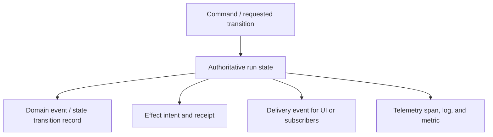
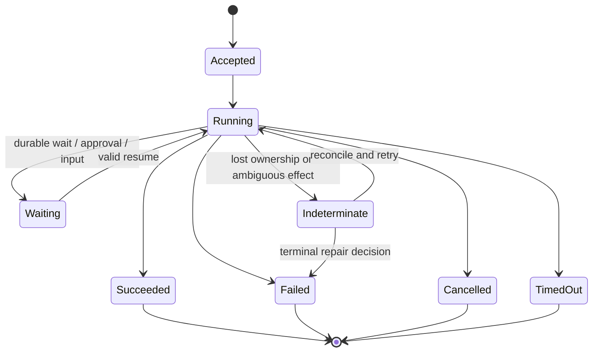

# Research Packet: Agent State and Event Contracts

> **Status:** Research-backed synthesis  
> **Research date:** 2026-08-31  
> **Scope:** Application-owned run state, event envelopes, ordering, delivery, replay, streaming, checkpoints, effect evidence, and telemetry boundaries across agent SDKs and runtimes.  
> **Method:** Current CloudEvents, W3C Trace Context, WHATWG SSE, OpenTelemetry GenAI, AG-UI, MCP, and repository durable-execution evidence were compared with current integration failure reports. Protocol mechanics are separated from application guarantees.

## Research questions

1. Which identities and states must remain stable across SDKs, queues, processes, reconnects, and durable runtimes?
2. What is the difference between an event stream, a state transition, a checkpoint, an effect receipt, and a telemetry span?
3. Which ordering, duplication, truncation, and replay failures must consumers handle?
4. What is the smallest application-owned contract that can survive framework replacement?

## Snapshot and confidence

| Surface | Checked position | Confidence and refresh trigger |
|---|---|---|
| CloudEvents | Version 1.0 defines a vendor-neutral event envelope. The specification requires `id`, `source`, `specversion`, and `type`; `source` + `id` identifies duplicates. It does not define agent processing, ordering, storage, or exactly-once delivery. | High; refresh on a new core specification version or material JSON-format change. |
| W3C Trace Context | `traceparent` and optional `tracestate` propagate trace position across trust boundaries. They are observability context, not business or run identity. | High; refresh on a new W3C recommendation. |
| Server-Sent Events | SSE uses `text/event-stream`; `id` updates the browser's last event ID and `Last-Event-ID` can support reconnection. The standard does not supply retention or replay storage. | High; refresh on transport-spec changes. |
| AG-UI | Current SDK event families include run, step, message, tool, reasoning, state, activity, raw, and custom events. Run start and one terminal outcome form the intended run boundary. | Medium-high; event schemas are evolving and integration behavior needs exact-version tests. |
| OpenTelemetry GenAI | Agent, workflow, inference, and tool semantic conventions remain Development. Sensitive message/instruction/tool content is opt-in and has changed representation across convention releases. | High for maturity; refresh on stabilization or semantic-convention breaking changes. |
| Durable runtimes | Checkpoint/replay semantics differ across Temporal, Restate, DBOS, Prefect, Dapr, and agent-specific runtimes. An emitted UI event is not automatically durable state. | High for category distinction; verify each runtime and adapter release. |

## Finding 1: five records with different jobs

The records may share identifiers, but they are not interchangeable:

- **Command or intent:** asks the controller to start, cancel, approve, retry, or resume.
- **Authoritative state:** answers what the run is allowed to do next and which version currently owns it.
- **Domain event:** records a meaningful transition such as approval granted, tool effect committed, or run suspended.
- **Effect receipt:** proves what happened at an external boundary and supports ambiguity reconciliation.
- **Delivery event:** incrementally updates a user or subscriber; it may be dropped, coalesced, replayed, or regenerated.
- **Telemetry:** helps diagnose execution; sampling, redaction, retention, and backend loss make it unsuitable as the business source of truth.

Collapsing these creates common failures. Treating token deltas as durable state makes recovery depend on every fragment. Treating a trace as an audit ledger loses events under sampling. Treating a checkpoint as an effect receipt duplicates writes after ambiguous failures.

## Finding 2: stable identity is multidimensional

An agent system usually needs distinct identifiers for:

| Identity | Stable meaning |
|---|---|
| `conversation_id` or `thread_id` | A user-visible continuity container; may contain many runs |
| `run_id` | One bounded execution attempt from accepted input to one terminal or suspended outcome |
| `attempt_id` | One retry/lease execution of a run or step |
| `step_id` | One logical model, tool, approval, or workflow step |
| `tool_call_id` | One model-requested tool invocation |
| `effect_id` | One intended external business effect across retries |
| `event_id` | One immutable event occurrence or duplicate-delivery key |
| `parent_run_id` / causal ID | Delegation, branch, replay, or fork lineage |
| trace/span IDs | Diagnostic causality; sampling and trust-boundary rules apply |
| schema/release/policy version | Interpretation and behavior provenance |

These IDs must not be casually substituted. A retry needs a new attempt ID but normally retains the effect ID. A replay may create new delivery events while referring to the same stored domain event. A trace can restart at a trust boundary without changing the business run.

CloudEvents establishes a useful duplicate rule for an envelope: the combination of source and ID identifies the event. It deliberately does not define correlation, so application lineage remains explicit.

## Finding 3: terminal state is a protocol invariant

A stream ending is not evidence that a run succeeded. The process may have crashed, the load balancer may have closed an idle connection, the client may have disconnected, or a buffer may have truncated the response.

The application may use different names, but it needs:

- exactly one accepted start;
- explicit suspended/waiting semantics that are not confused with success;
- one terminal outcome;
- a rule for a connection ending before a terminal event;
- fencing that prevents a late attempt from publishing a second terminal outcome;
- repair for indeterminate state.

An August 2026 AG-UI issue provides a bounded example: a client could accept a stream that ended without `RUN_FINISHED` or `RUN_ERROR` as success. The issue is evidence for an adoption test, not a permanent protocol defect or prevalence estimate.

## Finding 4: event ordering is scoped, not global

Distributed systems rarely provide one global total order without a centralized sequencer. An application usually needs:

- monotonic sequence numbers within one run stream;
- message-local ordering for start, deltas, and end;
- tool-call-local ordering for arguments, execution, and result;
- explicit causal references across parallel branches;
- state versions or compare-and-set tokens for authoritative writes;
- no assumption that wall-clock timestamps produce a reliable total order.

Parallel tools can produce events concurrently. A consumer should merge them by run sequence and causal identity, not by arrival time alone. If multiple producers allocate sequence numbers, the allocator itself becomes an ownership boundary.

## Finding 5: snapshots and deltas require a base contract

A delta is meaningful only against a known state version. For any state or message delta define:

- the target entity and schema version;
- base state version or cursor;
- transition operation;
- resulting version;
- conflict behavior;
- whether the transition is commutative;
- maximum size and validation rules;
- recovery path when a delta is missing.

Periodic snapshots reduce recovery cost but do not remove event/version rules. A consumer that misses a delta must request a newer snapshot or restart from a retained cursor. It must not guess.

## Finding 6: delivery semantics must be named

At-most-once delivery loses events. At-least-once delivery duplicates events. “Exactly once” normally means a bounded deduplication or transaction claim and must state its scope.

CloudEvents lets a consumer detect duplicate envelopes using source + ID. It does not guarantee that intermediaries preserve order or deliver once. SSE lets a client send `Last-Event-ID` when reconnecting, but the server must retain and replay events for that cursor to be useful.

For each transport document:

- retention duration and maximum replay count/bytes;
- cursor scope and expiry;
- duplicate policy;
- ordering scope;
- slow-consumer and overflow behavior;
- disconnect-to-cancel policy;
- authentication/authorization on resume;
- terminal-state lookup when replay is unavailable.

## Finding 7: streaming and persistence should be decoupled

Persist durable facts at semantic boundaries rather than every token:

- input accepted and run ownership assigned;
- model request/response receipt when needed for recovery or audit;
- validated tool call;
- approval decision;
- effect intent and effect receipt;
- checkpoint or wait registration;
- terminal outcome.

Token and reasoning deltas are usually delivery data. They may be coalesced, redacted, sampled, or omitted from long-term storage. If a product requires exact transcript reconstruction, that becomes an explicit retention and privacy contract rather than an accidental consequence of the streaming library.

## Finding 8: telemetry is correlated, not authoritative

OpenTelemetry GenAI conventions currently define agent, workflow, inference, planning, and tool spans, but remain Development. Message, instruction, output, and tool-definition attributes may contain sensitive content and should not be recorded by default.

Use application-owned attributes for stable identity while the convention evolves:

- run, attempt, step, tool call, and effect identifiers;
- tenant and release identifiers using privacy-safe values;
- schema, policy, and model route versions;
- queue/admission and retry ownership;
- terminal class and reconciliation result.

Propagate W3C trace context across trusted boundaries. At public or hostile boundaries validate or restart trace context according to policy. Never use an incoming trace ID as authorization or idempotency identity.

## Finding 9: event payloads are untrusted interfaces

Event producers include models, tools, framework adapters, browsers, workers, and remote services. Validate:

- envelope and discriminator;
- schema version and supported event type;
- run/tenant ownership;
- sequence and state version;
- byte, collection, and nesting limits;
- tool/result artifact references;
- URLs, content types, and filenames;
- redaction and data-classification policy;
- authorization for command-like events.

Raw/custom events are particularly dangerous because they bypass stable union types. Keep them namespaced, versioned, size-bounded, and non-authoritative until translated by trusted code.

## Finding 10: framework adapters are semantic translators

An adapter from a framework event stream to AG-UI, CloudEvents, a queue, or an internal event schema must decide:

- which framework ID is a run, step, message, or trace ID;
- how framework start/end/error events map to exactly one application terminal outcome;
- how partial tool arguments and results are framed;
- how interrupts, approvals, and durable waits are distinguished from success;
- how internal retries appear externally;
- what is persisted versus forwarded;
- what happens when the upstream stream is malformed or ends early.

Current AG-UI integration source and issues show that ID clobbering, double terminal events, error/message confusion, and missing terminal validation are real adapter seams. Treat them as version-specific tests.

## Recommended application-owned envelope

CloudEvents is a useful outer model, but agent systems generally need extensions:

| Field | Purpose |
|---|---|
| `event_id`, `event_type`, `event_version` | Immutable duplicate and schema identity |
| `source`, `occurred_at` | Producer and occurrence time |
| `conversation_id`, `run_id`, `attempt_id` | Continuity and execution ownership |
| `step_id`, `parent_id`, `causation_id` | Local and cross-branch causality |
| `sequence` | Monotonic order within a declared scope |
| `state_version` | Optimistic state transition fence |
| `tenant_id`, `principal_ref` | Trusted routing and audit identity; never model supplied |
| `release_id`, `schema_id`, `policy_version` | Reproducibility and interpretation |
| `traceparent` or trace linkage | Diagnostic correlation, not authority |
| `data` | Typed, validated, size-bounded payload |

Do not force every field into a public UI stream. Separate internal authoritative envelopes from redacted delivery projections.

## Failure-injection backlog

- [ ] End every stream before its terminal event and prove consumers report incomplete/indeterminate rather than success.
- [ ] Deliver every event twice and prove state/effects remain correct.
- [ ] Reorder parallel tool events and prove causal merging remains deterministic.
- [ ] Drop one delta and prove snapshot/cursor recovery.
- [ ] Resume with an expired, cross-tenant, or forged cursor and prove rejection.
- [ ] Crash after effect commit but before receipt persistence and prove reconciliation by effect ID.
- [ ] Let an old lease publish after takeover and prove state-version fencing.
- [ ] Emit two terminal events and prove one is rejected and diagnosed.
- [ ] Saturate a slow subscriber and prove bounded memory and documented coalescing/drop policy.
- [ ] Rotate schema/release versions mid-run and prove compatibility or pinning behavior.
- [ ] Disable telemetry sampling/content capture and prove authoritative recovery is unchanged.
- [ ] Send oversized/deep/custom payloads and prove validation before allocation/effect.

## Claims deliberately excluded

- An event stream being a durable event log.
- SSE reconnection automatically providing replay.
- CloudEvents providing ordering or exactly-once delivery.
- A checkpoint proving an external effect committed once.
- OpenTelemetry traces being an audit ledger.
- A framework's internal run ID being stable across adapters and retries.
- Stream closure proving success.
- Timestamps providing a global order.
- “State delta” having meaning without a base version.
- A protocol event schema supplying authentication or authorization.

## Derived guide

- [Agent state and event contracts](../../runtime/agent-state-and-event-contracts.md)

## Selected sources

- [CloudEvents specification](https://github.com/cloudevents/spec/blob/main/cloudevents/spec.md)
- [CloudEvents primer and versioning guidance](https://github.com/cloudevents/spec/blob/main/cloudevents/primer.md)
- [W3C Trace Context](https://www.w3.org/TR/trace-context/)
- [WHATWG Server-Sent Events](https://html.spec.whatwg.org/multipage/server-sent-events.html)
- [OpenTelemetry GenAI agent spans](https://github.com/open-telemetry/semantic-conventions-genai/blob/main/docs/gen-ai/gen-ai-agent-spans.md)
- [OpenTelemetry semantic-convention changelog](https://github.com/open-telemetry/semantic-conventions/blob/main/CHANGELOG.md)
- [AG-UI event definitions](https://github.com/ag-ui-protocol/ag-ui/blob/main/docs/sdk/js/core/events.mdx)
- [AG-UI core architecture](https://docs.ag-ui.com/concepts/architecture)
- [AG-UI missing-terminal issue #2300](https://github.com/ag-ui-protocol/ag-ui/issues/2300)
- [AG-UI duplicate-terminal issue #1892](https://github.com/ag-ui-protocol/ag-ui/issues/1892)
- [MCP 2026-07-28 specification](https://modelcontextprotocol.io/specification/2026-07-28)

## Refresh triggers

- OpenTelemetry GenAI agent or tool conventions stabilize or break schema;
- AG-UI run, interrupt, state, activity, or event validation changes;
- CloudEvents or W3C Trace Context publishes a new normative version;
- MCP task/event/cancellation semantics change;
- a durable-runtime adapter changes checkpoint, replay, or event identity;
- production evidence contradicts the proposed state machine or delivery rules.

