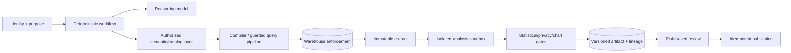

# Research Packet: Production Analytics Agent Blueprint

**Research date:** 2026-08-31  
**Research status:** Pass 2 production-depth synthesis complete  
**Target guide:** [Production Analytics Agent Blueprint](../../agents/analytics-agent/README.md)  
**Scope:** Production analytics/data-analysis agents spanning governed discovery, metric semantics, SQL/query execution, code sandboxes, statistics, privacy, lineage, artifacts, evaluation, reliability, cost, and operations

## Research objective

Determine the smallest production architecture that can answer analytical questions with governed data while making the result authorized, statistically defensible, reproducible, reviewable, and operable under failure.

The research focused on these questions:

1. Which guarantees belong to the model, an agent/workflow framework, the application, the semantic layer, and the warehouse?
2. When is semantic-layer-first, warehouse-native, notebook-first, custom, or hybrid architecture appropriate?
3. Which contracts are required for metrics, analysis plans, tools/effects, results, statistics, charts, artifacts, and review?
4. How should discovery and execution preserve row/column policy, privacy, and least privilege?
5. What is a credible isolation and reproducibility boundary for generated analysis code?
6. How should the system prevent statistically invalid or causally overstated claims?
7. Which lineage, state, idempotency, observability, evaluation, and operational controls are required?
8. Which current vendor behaviors, versions, and contradictions must be called out rather than generalized away?
9. Which identifiers prove the exact question, hypothesis, metric, dataset, cohort, query, notebook, analysis, test, chart, finding, decision, and artifact used?
10. Which adapter behaviors are actually qualified for the target deployment rather than merely advertised by a vendor?
11. How do the seven memory lifetimes, restart-safe compaction receipt, four representative workflows, and Stage 0–6 exit evidence make the design implementable?

## Research method

Primary and authoritative sources were used as the foundation:

- official product documentation and specifications;
- official source repositories, changelogs, and project updates;
- standards from W3C, NIST, OWASP, and the EU;
- official statistical guidance and peer-reviewed papers;
- benchmark project sites and papers.

Important claims were compared across multiple platforms. Vendor capabilities were treated as evidence of available primitives, not as universal guarantees. The resulting guide is vendor-neutral and makes the application/platform ownership boundary explicit.

All linked sources in this packet were accessed on **2026-08-31**. Version labels below distinguish stable, beta/preview, incubating, and deployment-dependent behavior. A documentation page was not treated as proof that a feature is enabled, licensed, regionally available, complete, or compatible in a particular tenant.

No live vendor tenant was provisioned during this research. Product behavior, licensing, regional availability, preview status, and exact runtime/version compatibility must be verified in the target deployment.

## Selected design

The evidence supports a **hybrid governed deterministic workflow**:

The model proposes interpretations, plans, queries/code, chart specifications, and narrative. Deterministic systems enforce identity, authorization, data/semantic versions, query budgets, isolation, state transitions, artifact lineage, review, and effects.

One orchestrator with typed tools is the default. Specialist model workers should be introduced only for a measured failure class and must not create a new authority path.

## Evidence-to-decision synthesis

| Evidence | Production implication | Blueprint decision |
|---|---|---|
| MetricFlow compiles governed metrics/semantic models and entity-based joins but is not itself the query runner | Semantic compilation and execution/authorization are separate concerns | Pin semantic snapshot and compiler; execute through a separately governed adapter |
| Cube combines modeling, access policies, caching, and APIs; LookML, Snowflake, and Databricks expose different semantic/governance primitives | No universal semantic API has complete cross-platform parity | Use a vendor-neutral application contract with explicit adapter behavior, not lowest-common-denominator prompts |
| Snowflake and Databricks document non-additive/rollup constraints | Aggregate correctness is part of semantics, not a SQL formatting detail | Make additivity and safe dimensions/grains machine-readable and fail unsupported rollups |
| Snowflake verified queries and Databricks trusted assets improve contextual accuracy; eval docs separate examples/benchmarks from runtime context | Examples can help but can also leak/overfit or become stale | Review/version/expire trusted examples and keep held-out eval cases separate |
| BigQuery exposes dry runs, maximum bytes billed, timeout, and labels; PostgreSQL/Snowflake expose independent session/plan controls | AST parsing alone cannot control cost or runtime | Layer dialect AST, authorized schema resolution, native estimate/plan, least privilege, timeout/budget, result validation |
| SQLGlot documents lenient parsing and fallback command expressions | Parser acceptance is not a safety proof | Treat AST policy as one filter; pin dialect/version and rely on engine/platform enforcement |
| BigQuery notes `LIMIT` does not necessarily reduce bytes processed | Small output is not cheap execution | Track scan/cost separately from result rows and require partition/plan controls |
| BigQuery and Snowflake result caching depends on query/data/policy conditions; BigQuery documents a revocation caveat | Cache reuse can violate authorization expectations | Bind caches to principal/policy/semantic/data versions and re-authorize on read; disable shared caching for high-risk data |
| Jupyter states server access permits arbitrary code as the server user | Notebook trust is not code isolation | Execute generated code only in a fresh constrained sandbox; notebooks are artifacts |
| gVisor and Firecracker docs describe isolation plus separate operational hardening/resource needs | Runtime choice is not a turnkey guarantee | Combine isolation with no credentials, default-deny egress, cgroups/limits, patched images, output promotion gate |
| ASA/NIST/statistical sources emphasize effect size, assumptions, randomness, missing data, outliers, and multiplicity | Successful code execution and p-values are insufficient | Require analysis class, estimand, assumptions, sensitivity, effect/interval, and claim-evidence validation |
| NIST privacy and de-identification guidance treats release context/risk/governance as essential | Removing names is not enough | Apply purpose, minimization, release-context controls, re-identification assessment, retention, and privacy review |
| BigQuery security guidance notes timing/error/billing side channels | Fine-grained policy is not perfect noninterference | Treat repeated-query inference as a threat; use stronger physical isolation for the highest-risk cases |
| W3C PROV and OpenLineage define provenance entities/activities/agents and column lineage facets | A chat transcript is not sufficient provenance | Model every result/chart/report as versioned entities generated from versioned activities and actors |
| OpenTelemetry warns SQL text may contain sensitive data and GenAI conventions evolve | Observability can become a data leak or unstable coupling | Default to opaque IDs/digests, restricted evidence storage, bounded attributes, versioned instrumentation adapter |
| Vega-Lite offers a versioned declarative chart grammar; W3C requires text equivalents for complex images | Charts can be validated and must be accessible in context | Preserve chart spec plus render, bind data digest, run truth/accessibility checks, include table/long description |
| Public benchmarks target only parts of the workflow and continue to evolve | Leaderboard scores cannot certify local production behavior | Maintain a held-out local suite with real metrics/policies and use public benchmarks only as supplemental signals |
| Looker query IDs are content-addressed slugs, Power BI APIs address semantic-model objects, and BI definitions can change without changing a human label | An object ID is not a reproducible semantic or data version | Persist object ID plus definition/model revision, parameter/filter state, upstream source snapshot, adapter version, and result digest |
| BigQuery, Snowflake, Delta Lake, and Iceberg expose different time-travel identifiers and retention behavior | A timestamp or “latest” does not name one portable immutable dataset | Resolve each source to a platform-native snapshot/version and record retention/expiry; promote an approved extract when replay must outlive it |
| Tableau metadata can omit/obfuscate data under permissions and warns that lineage may be incomplete; Databricks lineage has bounded capture/retention | Catalog/lineage responses can be partial without being syntactically invalid | Qualify completeness and permission behavior; represent lineage confidence and unknown edges rather than claiming a complete graph |
| DuckDB global connections are not thread-safe; Polars streaming can fall back; pandas 3.0 changed copy/dtype behavior; Spark plans can adapt at runtime | A library name or lockfile alone does not reproduce execution semantics | Pin versions and engine settings, capture physical plans/fallbacks, isolate concurrency, and verify result/property fixtures after upgrades |
| Object stores offer different conditional-write, checksum, and versioning semantics | A successful upload response alone does not prove immutable, deduplicated publication | Use digest-addressed artifacts, platform-specific preconditions, stored version/generation/ETag, read-back verification, and effect reconciliation |

## Architecture alternatives considered

### Semantic-layer-first

**Use when:** shared business metrics are mature and must remain consistent across BI, applications, and the agent.

**Evidence:** MetricFlow, Cube, LookML, Snowflake semantic views, and Databricks metric views all provide structured business semantics, but differ in entity/join models, access controls, query APIs, materialization, and non-additivity.

**Why not sufficient alone:** it does not define the full run lifecycle, statistical design, code isolation, artifact provenance, stakeholder approval, or idempotent publication.

### Warehouse-native

**Use when:** one platform owns almost all data, identity, policies, catalog, lineage, semantics, execution, and AI/BI interfaces.

**Evidence:** Snowflake Cortex Analyst/semantic views and Databricks Genie/metric views integrate tightly with their data governance systems; BigQuery exposes strong query and policy controls even where the semantic product pattern differs.

**Why not universal:** cross-platform workflows and non-warehouse artifacts still require an application ledger; portability and feature behavior vary.

### Notebook-first

**Use when:** qualified analysts lead open-ended exploration and inspect intermediate work.

**Evidence:** Jupyter, nbclient, and Papermill support interactive, programmatic, and parameterized execution.

**Why rejected as the control plane:** arbitrary code, hidden state, mutable kernels/files, credential exposure, and weak approval/effect semantics make an unsandboxed notebook unsuitable for autonomous multi-user production.

### Fully custom workflow

**Use when:** regulated or multi-engine requirements cannot be expressed by current platforms.

**Why not the default:** it recreates mature identity, policy, query, catalog, lineage, scheduling, storage, or isolation capabilities and carries the highest maintenance burden.

### Hybrid

**Selected because:** it reuses authoritative governance and execution while adding only the missing cross-stage state, artifact, evaluation, and approval contracts. It offers the best practical balance of security, reliability, portability, and implementation effort.

## Semantic-layer and warehouse research

### dbt and MetricFlow

- [MetricFlow metric semantics in dbt Core](https://github.com/dbt-labs/dbt-core/blob/main/crates/dbt-metricflow/docs/metric-semantics.md) — metric meaning, query scope, metric time, entity relationships, compiler behavior.
- [MetricFlow repository README](https://github.com/dbt-labs/metricflow/blob/main/README.md) — compiler/query-planning role, multi-hop queries, metrics, Apache licensing.
- [MetricFlow changelog](https://github.com/dbt-labs/metricflow/blob/main/CHANGELOG.md) — behavior/version evolution.
- [dbt semantic-layer agent skill](https://github.com/dbt-labs/dbt-agent-skills/blob/main/skills/dbt/skills/building-dbt-semantic-layer/SKILL.md) — current Core 1.12+/Fusion guidance and legacy-version distinction.
- [How the dbt Semantic Layer works](https://www.getdbt.com/blog/how-the-dbt-semantic-layer-works) — official architecture explanation.

Key conclusion: use MetricFlow/dbt as the authoritative compiler/model when adopted, but keep query authorization, engine execution, budgets, and run lifecycle outside the compiler.

### Cube

- [Cube introduction](https://docs.cube.dev/docs/introduction) — semantic modeling, access control, caching, and APIs.
- [Cube access control](https://docs.cube.dev/docs/data-modeling/access-control/index) — access architecture.
- [Cube data-access policies](https://docs.cube.dev/docs/data-modeling/data-access-policies) — member, row, and masking policies.
- [Cube pre-aggregations](https://docs.cube.dev/docs/pre-aggregations/using-pre-aggregations) — rollups, performance, and rollup-only behavior.

Key conclusion: Cube can collapse several integration layers, but application identity propagation, result disclosure, artifact lifecycle, and statistical validity remain separate responsibilities.

### Looker

- [LookML terms and concepts](https://docs.cloud.google.com/looker/docs/lookml-terms-and-concepts) — views, explores, dimensions, measures.
- [LookML required access grants](https://docs.cloud.google.com/looker/docs/reference/param-field-required-access-grants) — model-level access gating.
- [Looker Open SQL Interface](https://docs.cloud.google.com/looker/docs/sql-interface) — SQL client access to LookML semantics.

Key conclusion: mature modeled explores are valuable, but external/client access still needs supported semantics, authenticated context, and surrounding workflow controls.

### Snowflake

- [Semantic views overview](https://docs.snowflake.com/en/user-guide/views-semantic/overview) — native semantic object model and recommendation for new implementations.
- [Semantic-view YAML specification](https://docs.snowflake.com/en/user-guide/views-semantic/semantic-view-yaml-spec) — logical tables, facts, dimensions, metrics, relationships, non-additive behavior.
- [Creating semantic views with SQL](https://docs.snowflake.com/en/user-guide/views-semantic/sql) — DDL path.
- [SEMANTIC_VIEW query syntax](https://docs.snowflake.com/en/sql-reference/constructs/semantic_view) — native semantic-query behavior.
- [Verified Query Repository](https://docs.snowflake.com/en/user-guide/views-semantic/verified-query-repository) — reviewed natural-language/SQL examples and quality implications.
- [Verified-query suggestions](https://docs.snowflake.com/en/user-guide/views-semantic/verified-query-suggestions) — generated candidates requiring human review.
- [Cortex Analyst](https://docs.snowflake.com/en/user-guide/snowflake-cortex/cortex-analyst) and [REST API](https://docs.snowflake.com/en/user-guide/snowflake-cortex/cortex-analyst/rest-api) — warehouse-native conversational analytics path.
- [Cortex Analyst evaluations](https://docs.snowflake.com/en/user-guide/snowflake-cortex/cortex-analyst-evaluations) — evaluation workflow and protection against verified-query leakage.
- [Snowflake parameters](https://docs.snowflake.com/en/sql-reference/parameters) — statement timeouts, tags, and session controls.
- [Persisted query results](https://docs.snowflake.com/en/user-guide/querying-persisted-results) — result reuse behavior.
- [Row access policies](https://docs.snowflake.com/en/user-guide/security-row-intro) and [dynamic data masking](https://docs.snowflake.com/en/user-guide/security-column-ddm-intro) — native fine-grained controls.

Key conclusion: warehouse-native is compelling for a Snowflake-consolidated estate, but verified examples need review and held-out evaluation; external workflow/artifact guarantees still need explicit ownership.

### Databricks

- [Genie concepts](https://docs.databricks.com/aws/en/genie-agents/concepts), [setup](https://docs.databricks.com/aws/en/genie/set-up), [quality tuning](https://docs.databricks.com/aws/en/genie-agents/tune-quality), and [monitoring](https://docs.databricks.com/aws/en/genie-agents/monitor) — current Genie Agent/Space concepts, compute/data credentials, trusted assets, benchmarks.
- [Metric views](https://docs.databricks.com/aws/en/business-semantics/metric-views), [YAML reference](https://docs.databricks.com/aws/en/uc-semantics/metric-views/yaml-reference), and [basic modeling](https://docs.databricks.com/aws/en/uc-semantics/metric-views/basic-modeling) — governed measures/dimensions/joins and runtime/spec behavior.
- [Metric-view materialization](https://docs.databricks.com/aws/en/uc-semantics/metric-views/materialization) and [materialization choice](https://docs.databricks.com/gcp/en/uc-semantics/metric-views/choose-materialization-type) — acceleration and rollup compatibility.
- [Unity Catalog access control](https://docs.databricks.com/aws/en/data-governance/unity-catalog/access-control), [filters and masks](https://docs.databricks.com/aws/en/data-governance/unity-catalog/filters-and-masks), [data discovery](https://docs.databricks.com/aws/en/data-governance/unity-catalog/data-discovery), and [data lineage](https://docs.databricks.com/aws/en/data-governance/unity-catalog/data-lineage) — governance primitives.
- [Databricks SQL query tags](https://docs.databricks.com/aws/en/sql/user/queries/query-tags) — workload correlation.

Key conclusion: Genie/metric views/Unity Catalog are a strong warehouse-native design. Preserve the documented distinction between compute-author credentials and end-user data authorization, and verify YAML spec/runtime features during deployment.

### Interchange

- [Apache Ossie](https://ossie.apache.org/) and [April 2026 community update](https://ossie.apache.org/updates/osi-april-2026-community-update/) — evolution of the formerly named Open Semantic Interchange work.

Key conclusion: interchange is strategically useful but still evolving/incubating. Treat translation fidelity, security semantics, and aggregation behavior as tested adapter properties.

## Query execution and cost research

### BigQuery

- [Jobs API](https://docs.cloud.google.com/bigquery/docs/reference/rest/v2/Job) — dry run, job timeout, labels, maximum bytes billed.
- [Running queries](https://docs.cloud.google.com/bigquery/docs/running-queries) — execution and dry-run patterns.
- [Pricing](https://cloud.google.com/bigquery/pricing) — bytes processed and the fact that `LIMIT` does not necessarily reduce on-demand query cost.
- [Cached results](https://docs.cloud.google.com/bigquery/docs/cached-results) — eligibility, lifetime, row/column policy behavior, and access-change caveat.
- [Row-level-security introduction](https://docs.cloud.google.com/bigquery/docs/row-level-security-intro) and [best practices](https://docs.cloud.google.com/bigquery/docs/best-practices-row-level-security) — policy behavior and side-channel considerations.
- [Column-level security](https://docs.cloud.google.com/bigquery/docs/column-level-security-intro) and [data masking](https://docs.cloud.google.com/bigquery/docs/column-data-masking-intro) — sensitive-column controls.

### PostgreSQL and SQL parsing

- [PostgreSQL 18 transaction modes](https://www.postgresql.org/docs/18/sql-set-transaction.html) — read-only behavior and limits.
- [PostgreSQL 18 client connection defaults](https://www.postgresql.org/docs/18/runtime-config-client.html) — statement timeout and session behavior.
- [PostgreSQL EXPLAIN](https://www.postgresql.org/docs/current/sql-explain.html) — JSON and other plan formats.
- [SQLGlot README](https://github.com/tobymao/sqlglot/blob/main/README.md), [parser onboarding](https://github.com/tobymao/sqlglot/blob/main/posts/onboarding.md), and [AST primer](https://github.com/tobymao/sqlglot/blob/main/posts/ast_primer.md) — parsing, dialects, lenience, traversal.
- [OWASP SQL Injection Prevention Cheat Sheet](https://cheatsheetseries.owasp.org/cheatsheets/SQL_Injection_Prevention_Cheat_Sheet.html) — parameterized literals and allow-listed identifier handling.

Key conclusion: the reliable query path combines structured semantic intent, dialect AST checks, authorized schema binding, engine plan/estimate, least-privilege execution, limits, and result validation. None substitutes for the others.

## Sandbox and reproducibility research

- [Jupyter Server security](https://jupyter-server.readthedocs.io/en/latest/operators/security.html) — server access and arbitrary code, authentication/authorization separation.
- [nbclient documentation](https://nbclient.readthedocs.io/en/stable/) and [Papermill documentation](https://papermill.readthedocs.io/) — programmatic and parameterized notebook execution.
- [gVisor architecture](https://gvisor.dev/docs/architecture_guide/intro/), [security model](https://gvisor.dev/docs/architecture_guide/security/), and [production guidance](https://gvisor.dev/docs/user_guide/production/) — userspace application-kernel isolation and separate resource/network controls.
- [Firecracker production host setup](https://github.com/firecracker-microvm/firecracker/blob/main/docs/prod-host-setup.md) and [seccomp filters](https://github.com/firecracker-microvm/firecracker/blob/main/docs/seccomp.md) — Jailer, KVM host hardening, filters, patching, rate/resource controls.
- [Kubernetes security](https://kubernetes.io/docs/concepts/security/), [multi-tenancy](https://kubernetes.io/docs/concepts/security/multi-tenancy/), and [security checklist](https://kubernetes.io/docs/concepts/security/security-checklist/) — workload isolation, network policy, pod security, runtime classes, quotas.
- [Apache Arrow format 25.0.1](https://arrow.apache.org/docs/format/index.html) — versioned typed columnar interchange.
- [MLflow datasets](https://mlflow.org/docs/latest/dataset/) and [tracking](https://mlflow.org/docs/latest/tracking) — dataset/run metadata and artifact concepts.

Key conclusion: a fresh container/userspace-kernel/microVM is the appropriate generated-code boundary according to risk. A reproducibility manifest must bind source snapshot/extract, semantic/query versions, code, dependencies, runtime image, seed/timezone, and output digests. Neither notebook orchestration nor experiment tracking supplies isolation by itself.

## Statistical research

- [American Statistical Association statement on p-values](https://www.amstat.org/asa/files/pdfs/p-valuestatement.pdf) — p-values do not measure effect magnitude or importance and should not be a bright-line conclusion alone.
- NIST/SEMATECH handbook sections on [process-model assumptions](https://www.itl.nist.gov/div898/handbook/pmd/section2/pmd2.htm), [non-randomness](https://www.itl.nist.gov/div898/handbook/eda/section2/eda251.htm), and [outliers](https://www.itl.nist.gov/div898/handbook/prc/section1/prc16.htm) — assumption checks, validity, and careful anomaly handling.
- [CONSORT 2025 explanation and elaboration](https://www.bmj.com/content/bmj/389/bmj-2024-081124.full.pdf) — modern randomized-trial reporting, multiplicity, missing data, sensitivity.
- statsmodels documentation for [missing data](https://www.statsmodels.org/stable/missing.html), [multiple testing](https://www.statsmodels.org/stable/generated/statsmodels.stats.multitest.multipletests.html), and [statistics/inference](https://www.statsmodels.org/stable/stats.html) — concrete library behavior and methods.

Key conclusion: the application must require analysis class, population/unit/estimand, design, assumptions, missingness, dependence, multiplicity, effect sizes/intervals, and sensitivity. Statistical libraries provide methods; they do not decide whether a business design identifies the desired quantity.

## Security and privacy research

- [OWASP LLM Prompt Injection Prevention Cheat Sheet](https://cheatsheetseries.owasp.org/cheatsheets/LLM_Prompt_Injection_Prevention_Cheat_Sheet.html) — direct/indirect injection patterns and controls.
- [OWASP AI Agent Security Cheat Sheet](https://cheatsheetseries.owasp.org/cheatsheets/AI_Agent_Security_Cheat_Sheet.html) — tool/capability, memory, monitoring, and excessive-agency risks.
- [OWASP LLM Verification Standard](https://owasp.org/www-project-llm-verification-standard/LLMSVS-v2.0-en.html) — verification framework.
- [NIST AI RMF Generative AI Profile](https://www.nist.gov/publications/artificial-intelligence-risk-management-framework-generative-artificial-intelligence) — govern/map/measure/manage risk framing.
- [NIST Privacy Framework](https://www.nist.gov/privacy-framework) — privacy risk management.
- [NIST SP 800-188](https://csrc.nist.gov/pubs/sp/800/188/final) — de-identification goals, release models, re-identification risk, governance.
- [EU GDPR official text](https://eur-lex.europa.eu/eli/reg/2016/679/oj) — purpose/data-minimization/storage and other legal requirements requiring local interpretation.

Key conclusion: prompt injection must be assumed possible. Safety comes from capability scoping and deterministic enforcement. Authorization precedes discovery and execution; privacy controls apply again to result, cache, artifact, telemetry, and destination.

## Lineage, observability, artifact, and evaluation research

### Provenance and telemetry

- [W3C PROV primer](https://www.w3.org/TR/prov-primer/) and [PROV overview](https://www.w3.org/TR/prov-overview/) — entities, activities, and agents.
- [OpenLineage column-lineage facet](https://openlineage.io/docs/spec/facets/dataset-facets/column_lineage_facet/) and the evolving [next lineage facet](https://openlineage.io/docs/next/spec/facets/dataset-facets/lineage/) — field-level provenance structures.
- [OpenTelemetry SQL semantic conventions](https://opentelemetry.io/docs/specs/semconv/db/sql/) — database spans and sensitive query-text caution.
- [OpenTelemetry GenAI registry](https://opentelemetry.io/docs/specs/semconv/registry/attributes/gen-ai/) — current generative-AI attribute registry and evolving conventions.

### Charts and accessibility

- [Vega-Lite 6 specification](https://vega.github.io/vega-lite/docs/spec.html) — versioned declarative chart schema.
- W3C resources for [complex images](https://www.w3.org/WAI/tutorials/images/complex/), [accessibility principles](https://www.w3.org/WAI/fundamentals/accessibility-principles/), and [WCAG](https://www.w3.org/WAI/standards-guidelines/wcag/) — text equivalents and accessible delivery.

### Benchmarks

- [Spider 2.0](https://spider2-sql.github.io/) — enterprise text-to-SQL/workflow tasks and documented dataset evolution.
- [BIRD](https://bird-bench.github.io/) — execution-oriented text-to-SQL over larger databases.
- [DS-1000](https://ds1000-code-gen.github.io/) — data-science code generation.
- [InfiAgent-DABench](https://proceedings.mlr.press/v235/hu24s.html) — multi-step data analysis benchmark.
- [UniDataBench](https://aclanthology.org/2026.acl-long.1556/), [DataAgentBench](https://github.com/ucbepic/DataAgentBench), and [DAComp](https://da-comp.github.io/) — emerging end-to-end data-agent evaluations.

Key conclusion: preserve provenance as first-class entities/activities/actors, keep sensitive payloads out of ordinary telemetry, use declarative data-bound charts, and treat public benchmark performance as supplemental to held-out local evaluation.

## Pass 2 source qualification ledger

The second pass converted product claims into deployable adapter obligations. “Current” below means current in the cited primary source when accessed on 2026-08-31; it is not a promise about a particular account, cloud, region, edition, or runtime.

| Surface and primary evidence | Captured status/version | What the source supports | Deployment limitation that must be tested |
|---|---|---|---|
| [MetricFlow releases](https://github.com/dbt-labs/metricflow/releases), [changelog](https://github.com/dbt-labs/metricflow/blob/main/CHANGELOG.md), and [dbt compiler semantics](https://github.com/dbt-labs/dbt-core/blob/main/crates/dbt-metricflow/docs/metric-semantics.md) | MetricFlow 0.211.0 released 2026-05; current dbt compiler work coexists with older integration paths | Metric compilation, entity paths, metric time, and planned SQL | Compiler output is not query authorization or execution; Core/Fusion and legacy integration behavior must be regression-tested |
| [Looker API 4.0 query methods](https://cloud.google.com/looker/docs/reference/looker-api/latest/methods/Query/create_query) and [LookML concepts](https://cloud.google.com/looker/docs/lookml-terms-and-concepts) | API 4.0; product release and instance model versions remain tenant-dependent | Query slugs, model/explore/field/filter structures, modeled measures | Query ID proves a query definition, not the upstream data snapshot; permissions, model revision, PDT/cache state, and source snapshot remain separate |
| [Power BI Execute Queries](https://learn.microsoft.com/en-us/rest/api/power-bi/datasets/execute-dax-queries-in-group), [semantic-model permissions](https://learn.microsoft.com/en-us/power-bi/connect-data/service-datasets-permissions), and [TMDL overview](https://learn.microsoft.com/en-us/analysis-services/tmdl/tmdl-overview) | REST v1.0; TMDL is the textual model-definition surface; Git/workspace behavior remains feature-specific | One-query DAX execution, impersonated-user support, model metadata-as-code | Row/size/rate limits, tenant settings, RLS/service-principal restrictions, Build permission, refresh state, and upstream source version must be qualified |
| [Tableau REST API](https://help.tableau.com/current/api/rest_api/en-us/REST/rest_api_concepts_versions.htm), [Metadata API permissions](https://help.tableau.com/current/api/metadata_api/en-us/docs/meta_api_permissions.html), and [lineage limitations](https://help.tableau.com/current/api/metadata_api/en-us/docs/meta_api_model.html) | Tableau 2026.2 maps to REST 3.29 | Revision-aware REST resources and permission-aware metadata graph | Metadata can be omitted or obfuscated and lineage can be incomplete; server/site settings, revisions, extract refresh, and upstream snapshots are separate identities |
| [BigQuery time travel](https://cloud.google.com/bigquery/docs/time-travel) and [table snapshots](https://cloud.google.com/bigquery/docs/table-snapshots-intro) | Configurable 2–7 day time-travel window; snapshots are distinct table resources | Historical table reads and longer-lived snapshot resources | Retention starts at deletion/change boundaries, access and billing still apply, and a job timestamp alone is not a permanent snapshot |
| [Snowflake AT/BEFORE](https://docs.snowflake.com/en/sql-reference/constructs/at-before) and [Time Travel](https://docs.snowflake.com/en/user-guide/data-time-travel) | Retention is edition/object/configuration dependent | Querying by timestamp, offset, statement, or stream | `AT(STATEMENT => ...)` uses statement completion; concurrent writes and retention expiry make wall-clock labels insufficient |
| [Delta Lake table history](https://docs.databricks.com/aws/en/delta/history) and [Unity Catalog lineage](https://docs.databricks.com/aws/en/data-governance/unity-catalog/data-lineage) | Delta commits provide table versions; Unity Catalog lineage is retained for one year in current docs | Versioned table history plus captured lineage | Vacuum/retention can remove replay data; lineage capture is not universal and excludes some external transformations/paths |
| [Iceberg branching and tagging](https://iceberg.apache.org/docs/latest/branching/) and [Spark procedures](https://iceberg.apache.org/docs/latest/spark-procedures/) | Current Iceberg docs; implementation/catalog compatibility varies | Snapshot IDs, branches, tags, and retention controls | Tags do not retain data files unless policy does; engine/catalog versions and expiration procedures must be compatible |
| [DuckDB Python concurrency](https://duckdb.org/docs/stable/guides/python/multiple_threads), [memory management](https://duckdb.org/docs/stable/configuration/pragmas.html#memory-limit), and [order preservation](https://duckdb.org/docs/stable/sql/dialect/order_preservation) | DuckDB Python 1.5.x baseline | Local analytical execution, explicit connection/thread and ordering behavior | The module-global connection is not thread-safe, allocations can exceed the configured buffer limit, and unordered SQL remains unordered |
| [Polars streaming](https://docs.pola.rs/user-guide/concepts/streaming/), [pandas 3.0 changes](https://pandas.pydata.org/docs/whatsnew/v3.0.0.html), [Spark SQL performance](https://spark.apache.org/docs/latest/sql-performance-tuning.html), [SciPy `ttest_ind`](https://docs.scipy.org/doc/scipy/reference/generated/scipy.stats.ttest_ind.html), and [statsmodels stable](https://www.statsmodels.org/stable/) | pandas 3.0; statsmodels 0.14.6; Spark 4.2 documentation; other runtime pins deployment-specific | Concrete lazy/eager, streaming, adaptive-plan, dtype/copy, and statistical defaults | Physical plans/fallbacks/defaults can change; pin exact packages/settings and retain behavioral fixtures, not just source code |
| [OpenLineage object model](https://openlineage.io/docs/spec/object-model/) and [facets](https://openlineage.io/docs/spec/facets/) | OpenLineage 1.52.x documentation | Extensible run/job/dataset events and provenance facets | Integration coverage is partial; custom facets need stable schemas and consumers; absence of an edge is not evidence of no dependency |
| [OpenTelemetry semantic conventions](https://opentelemetry.io/docs/specs/semconv/) and [database conventions](https://opentelemetry.io/docs/specs/semconv/database/) | Semantic conventions 1.44.x; some database migration behavior remains mixed/stability-dependent | Separate metrics, traces, logs, resource/attribute conventions | High-cardinality identities and SQL/data values can leak or overload telemetry; evidence and audit stores remain separate |
| [Amazon S3 conditional writes](https://docs.aws.amazon.com/AmazonS3/latest/userguide/conditional-writes.html), [Google Cloud Storage request preconditions](https://cloud.google.com/storage/docs/request-preconditions), and [Azure Blob versioning](https://learn.microsoft.com/en-us/azure/storage/blobs/versioning-overview) | Current cloud APIs; account configuration controls exact behavior | Create-if-absent/update-if-current and object version/generation primitives | ETags are not portable content hashes, versioning may be disabled, checksums differ, and retries require effect reconciliation |

## Analytical identity and version findings

The reproducibility boundary is a chain, not one run ID. The guide therefore assigns an immutable ID and revision/digest to the question and scope, hypothesis family, governed metric definition, source dataset snapshot, cohort definition and materialization, logical and physical query, notebook/code bundle, analysis plan and result, statistical test configuration, chart specification and render, finding/claim, decision/review receipt, and publication artifact.

The critical distinctions are:

- a BI object ID or query slug identifies an object/definition, not the data revision used to compute it;
- a source timestamp is only adequate when the platform resolves and records the exact snapshot/statement/commit behind it;
- a semantic-model revision is distinct from an upstream table snapshot and from a cached/imported semantic-model refresh;
- source code plus a dependency lock is weaker than code, exact runtime/image, settings, seed/timezone/locale, physical plan/fallbacks, input digests, and output digests;
- a decision references reviewed finding versions, while a corrected source creates new downstream versions and a supersession edge rather than mutating history.

These conclusions produced the canonical chain and schemas in the blueprint README, metric guide, notebook/reproducibility guide, statistics guide, artifact guide, and worked flows.

## Adapter and tool qualification findings

An adapter is approved only against an explicit manifest containing product/API/client versions, deployment identity and region, enabled features/licensing, permission model, timeout/rate/result/cost limits, pagination and consistency behavior, snapshot and lineage semantics, error taxonomy, idempotency or precondition mechanism, telemetry redaction policy, owner, fixtures, qualification timestamp, and expiry.

The minimum qualification suite is behavioral:

1. prove least-privilege discovery and execution under two principals with different row/column rights;
2. prove object-definition revision and upstream source snapshot are captured separately;
3. cross-check one governed metric and one non-additive/invalid rollup against the native UI/compiler;
4. exercise native plan/dry-run, timeout, cancellation, scan/result limits, rate limit, pagination, and retry hints;
5. replay a pinned source/runtime twice and compare schema, values/tolerances, plan/fallback metadata, and digests;
6. simulate token expiry, schema/semantic change, partial lineage, retention expiry, and unavailable source history;
7. inject timeout-after-commit for publication and reconcile from the destination before retry;
8. verify conditional writes/version IDs and read-back digest on artifact storage;
9. prove secrets, SQL literals, row values, and sensitive cohort labels do not enter ordinary telemetry;
10. rerun golden, adversarial, policy, statistical, and source-correction fixtures after every adapter/runtime upgrade.

This is why the guide exposes a small typed surface—discover/resolve, estimate/execute/cancel, materialize, analyze, validate, render, review, publish/reconcile/correct—instead of granting the model a generic SQL session, notebook kernel, BI admin client, filesystem, or cloud SDK.

## Worked-flow research conclusions

Four flows were selected because together they exercise the most consequential seams:

| Flow | Deterministic baseline | Model contribution | Evidence and stop conditions |
|---|---|---|---|
| Metric discrepancy | Resolve both metric definitions, filters, timezones, semantic revisions, source snapshots, SQL/plans, and reconcile a component bridge | Rank plausible semantic causes and draft a bounded investigation plan | Stop if either number lacks identity/evidence, snapshots cannot be aligned, or permission would be broadened |
| Cohort analysis | Pin eligibility/index/follow-up/censoring rules; materialize membership; validate leakage, duplicates, observation opportunity, denominators, and sensitivity windows | Clarify ambiguous cohort language and propose interpretable segment hypotheses | Stop on post-outcome eligibility, incomparable exposure, unstable membership, or disclosure risk |
| Experiment readout | Validate assignment unit, exposure, sample-ratio mismatch, exclusions, dependence, estimand, test config, multiplicity, effect/interval, and guardrails | Explain caveats and synthesize the decision-facing narrative | Stop on broken randomization, unregistered/adaptive choices without disclosure, or invalid dependence assumptions |
| Source correction | Identify affected lineage descendants, rerun from the corrected source snapshot, diff claims/charts/artifacts, supersede rather than overwrite, notify/retract by policy | Summarize materiality and draft correction language | Stop publication when effect state is unknown; reconcile destination and preserve both old/new evidence |

The concrete walkthroughs and exercises are in [Integration Qualification and Worked Flows](../../agents/analytics-agent/11-integration-qualification-and-worked-flows.md). They deliberately show agent admission, question-to-artifact identity, authorization, query and statistical gates, reviewer ownership, unknown-effect recovery, and exit evidence rather than only happy-path SQL.

## State, memory, and restart findings

Exactly seven memory lifetimes are required because their authority and deletion rules differ: **Turn/scratch**, **Working/run**, **Session**, **Durable workflow/task**, **Domain knowledge**, **Long-term/preference**, and **Episodic/outcome**. Retrieval from any memory is untrusted context until re-authorized and revalidated; only durable workflow state/events/effect ledgers can drive resumable control flow. Domain knowledge, preferences, and outcomes cannot silently override governed semantics, source evidence, policy, approval, or statistical design.

The restart-safe compaction receipt must bind tenant/principal/purpose, authorization and expiry, state/event/source high-watermarks, question/metric/dataset/cohort/analysis identities and versions, plan/query/code/runtime/result/artifact digests, budget and stop rules, privacy/causal boundaries, approvals, pending or `UNKNOWN` effects, correction/deletion obligations, next safe action, and an invariants hash. Resume verifies every watermark/hash, refreshes expiring authority/freshness, reconciles unknown effects, and blocks on gaps, drift, or stale approval. A prose summary is not a checkpoint.

## Stage 0–6 evidence model

| Stage | Deliverable | Exit evidence required before expansion |
|---|---|---|
| 0 — foundations and deterministic baseline | One governed metric/discrepancy and experiment template without model authority | Native metric/query parity, identity chain, denied-principal tests, fixed artifacts, four workflow fixtures, cost/latency baseline |
| 1 — read-only governed answers | Model-assisted typed planning/explanation for certified metrics through one qualified read adapter | Held-out improvement over baseline, ambiguity/abstention, deterministic validation, cross-principal policy, estimate/timeout/cancel/reconcile and snapshot/replay evidence |
| 2 — isolated analysis and charts | Pinned generated analysis and declarative chart bundles with no publication authority | Isolation escape tests, repeat-run equality/tolerance, statistical/leakage/multiplicity, property and truthful-accessible-chart checks |
| 3 — controlled self-service and refresh | Low-risk refresh/draft plus review-gated idempotent internal publication | Reviewer receipts, revocation/cache tests, timeout-after-commit reconciliation, correction/takedown, SLO/error-budget and runbook drills |
| 4 — broader platforms and advanced methods | One additional adapter, direct-SQL gap, predictive/causal method, privacy release, model route, or destination at a time | Deployment-specific qualification, exact method/snapshot/identity fixtures, specialized reviewer ownership, measured value greater than added risk/cost |
| 5 — resilient multi-tenant scale | Independently bounded pools, tenant/region cells, reserved recovery and correction capacity | Peak/noisy-neighbor/backlog tests, restore/RPO/RTO, dependency outage, regional failover/return, unknown-effect reconciliation |
| 6 — continuous evolution | Reproducible full-bundle upgrades and governed incident/correction feedback | Signed release/eval evidence, held-out protection, shadow/canary, active-run migration, deletion/correction propagation and rollback proof |

No stage exits on a demo alone. Promotion requires stored artifacts and test receipts that a reviewer can independently inspect.

## Current version and terminology baseline

| Area | Baseline captured | Refresh concern |
|---|---|---|
| Research | 2026-08-31 | All cloud documentation can change continuously |
| PostgreSQL | 18 documentation for transaction/session behavior | Recheck selected server major version |
| Apache Arrow | Format documentation reports 25.0.1 | Readers/writers may implement different format/library versions |
| Vega-Lite | Version 6 schema | Renderer support and accessibility integration |
| pandas | 3.0 release notes | Copy-on-Write, string/datetime dtypes, removed behavior, and dependent-library compatibility |
| DuckDB | Python 1.5.x documentation | Connection/thread model, memory behavior, optimizer and ordering changes |
| Spark | 4.2 SQL documentation | Adaptive execution, optimizer, connector, catalog, and runtime distribution behavior |
| statsmodels | Stable 0.14.6 documentation | Defaults/APIs and installed SciPy/NumPy versions |
| dbt | Current MetricFlow semantics; Core 1.12+/Fusion guidance contrasted with legacy 1.6–1.11 | Product integration and migration behavior |
| Snowflake | Semantic views recommended for new implementations; legacy semantic-model paths remain | Edition/region/preview/API and SQL changes |
| Databricks | Metric views/Genie Agents; YAML spec/runtime-dependent features | Cloud/runtime/region and syntax evolution |
| Looker | API 4.0 and current LookML/Explore behavior | Instance release, model revision, permission, cache/PDT, and upstream snapshot behavior |
| Power BI/Fabric | REST v1.0 query API and TMDL model definitions | Tenant switches, Build/RLS/service-principal limits, workspace/Git feature status, refresh identity |
| Tableau | 2026.2 / REST 3.29 documentation | Server/Cloud release, site settings, permissions, revision, extract freshness, lineage completeness |
| OpenLineage | 1.52.x documentation | Integration coverage, consumer compatibility, and custom-facet schema evolution |
| OpenTelemetry | Semantic conventions 1.44.x | Signal-specific stability, database migration mode, sensitive/high-cardinality attributes |
| Apache Ossie | Incubating, renamed from OSI, active 2026 updates | Spec/governance/compatibility remains fluid |
| OpenTelemetry GenAI | Registry/conventions evolving | Attribute names and stability levels |
| Public benchmarks | Current sites/papers as of research date | Dataset/task removals, harness changes, contamination |

## Contradictions and unresolved issues

### “Semantic layer” is not a uniform contract

Metric definitions, join inference, query syntax, materialization, access policy, and AI/BI integration differ across products. Apache Ossie may improve interchange but was still incubating. The blueprint therefore defines application-facing contracts while requiring adapter-specific validation and regression fixtures.

### Product generations coexist

Snowflake recommends semantic views for new implementations while legacy YAML remains supported. Databricks documentation includes newer `fields` authoring and UI-generated `dimensions`/`measures` forms, with features tied to YAML spec/runtime. dbt guidance distinguishes current and legacy Core behavior. Examples must be labeled by target version; no syntax is presented as universal.

### Trusted examples improve and can corrupt quality

Snowflake verified queries and Databricks trusted assets/examples can ground natural-language interpretation. They can also be wrong, stale, overly broad, or leak into evaluation. The blueprint requires review, version, scope, expiry, and held-out separation.

### Warehouse fine-grained policy is necessary but not complete privacy

Native policies enforce access, while BigQuery documentation acknowledges side channels. Repeated authorized aggregates can also create inference. The blueprint retains warehouse enforcement but adds disclosure controls, related-query monitoring, and stronger physical isolation for the highest-risk data.

### Result caches trade cost for revocation complexity

Warehouse caches are useful and have platform-specific behavior; BigQuery documents that some cached data may remain visible after access loss. The blueprint does not assume the platform cache has application-level revocation semantics and requires authorization-aware retrieval.

### Parser versus validator

SQLGlot is powerful but lenient and cannot prove arbitrary statements safe, authorized, cheap, or semantically correct. The blueprint uses it only as one layer.

### Reproducibility versus retention/privacy

Exact replay requires stable source snapshots or retained extracts; data minimization and retention may forbid long-term raw storage. The resolution is policy-specific: retain the minimum approved extract or aggregate fixture, record expiry, and state when exact source replay becomes impossible.

### Statistical automation versus substantive validity

Libraries and automated checks can validate calculations and known assumptions, but cannot supply domain knowledge or causal identification. High-risk inference remains review-gated, and the workflow is allowed to stop.

### Benchmark accuracy versus production quality

Text-to-SQL/code benchmarks do not test local identity, semantic versions, privacy, lineage, review, or effects. Exact SQL and single-database execution can both mis-score equivalence. The blueprint uses layered local result/property/policy/claim tests.

### Object identity versus object version

A Looker query slug, Power BI semantic-model ID, Tableau workbook ID, or warehouse table name is useful for lookup but does not prove which definition, refresh, source snapshot, permission state, parameters, or cache produced a number. The blueprint records both identity and version/snapshot evidence and rejects “same ID” as a replay guarantee.

### BI metadata visibility versus lineage completeness

Permission-aware catalogs may omit or obfuscate objects, and lineage systems capture only supported paths for bounded retention. This protects metadata but makes an apparently complete response ambiguous. The blueprint labels lineage scope, capture time, permission context, confidence, and unknown edges; it never treats absence as proof of no dependency.

### Imported semantic model versus upstream source

An imported/extracted BI model has its own definition revision and refresh state. Its result may legitimately differ from a direct warehouse query over newer data. Reconciliation must compare the semantic definition, import/extract refresh, cache/PDT/materialization, and upstream snapshot rather than only SQL text.

### Timestamp versus snapshot identity

BigQuery time travel, Snowflake `AT/BEFORE`, Delta commits, and Iceberg snapshots have different resolution and retention. A client timestamp is not portable snapshot identity. The adapter resolves a native immutable identifier where possible and records when retention makes future replay impossible.

### Dependency lock versus behavioral reproducibility

Locks do not capture native libraries, execution settings, adaptive/physical plans, thread/ordering behavior, locale/timezone, or streaming fallback. The blueprint combines exact environment identity with plan/fallback capture and result/property fixtures.

### Workflow durability versus exactly-once effects

A durable workflow engine can replay orchestration, but it cannot make a remote BI/object-store notification or publication exactly once. The blueprint models at-least-once attempts, deterministic idempotency keys or conditional writes, `UNKNOWN` outcomes, destination reconciliation, and superseding correction.

### Access authorization versus purpose and release permission

Being allowed to read rows does not necessarily authorize a purpose, cohort disclosure, statistical claim, external destination, or retention period. The blueprint separates source authorization, purpose/use policy, privacy release, reviewer authority, and publication capability.

## Rejected shortcuts

- **Privileged service account plus prompt instruction:** rejected because the model/prompt is not an authorization boundary.
- **Regex SQL allow/deny list:** rejected because dialect syntax and obfuscation require AST and engine controls, and AST alone still is not enough.
- **Notebook trust as sandbox:** rejected because trust does not constrain kernel code.
- **Shared cache keyed by question:** rejected because authorization, semantics, parameters, data version, timezone, and privacy context affect correctness.
- **One conversational memory store:** rejected because control state, evidence, effects, auth, and telemetry have different consistency and retention needs.
- **BI object ID or query timestamp as a reproducibility key:** rejected because definition, refresh/cache, source snapshot, permission context, runtime, and result digest are independent.
- **Package lockfile as complete replay proof:** rejected because engine settings, native dependencies, adaptive/physical plans, fallback behavior, locale/timezone, and external data still vary.
- **Vendor lineage graph as complete truth:** rejected because permissions, unsupported operations, ingestion lag, and finite retention create unknown edges.
- **Retrying a timed-out publication blindly:** rejected because the first attempt may have committed; reconcile the destination using the idempotency key/digest first.
- **P-value threshold as decision rule:** rejected by statistical guidance and because effect magnitude/uncertainty/assumptions matter.
- **LLM judge as sole evaluator:** rejected for numerical, security, policy, causal, and effect correctness.
- **Automatic publication after tool success:** rejected because evidence validation and authorized review are separate stages.
- **Multi-agent-by-default:** rejected because it increases coordination, cost, correlated failures, and permission surface without evidence of benefit.
- **Fully custom platform:** rejected as the default because mature governance/execution/isolation primitives should be reused.

## Known limitations

- The packet is a cross-platform design synthesis, not a product certification or penetration test.
- No live cloud tenant, edition-specific feature matrix, or benchmark was executed during research.
- Product/API documentation was inspected, but the adapters remain unqualified until the behavioral suite runs against the exact tenant, region, edition, client, runtime, permissions, and enabled features.
- Documentation may describe intended behavior differently from tenant configuration or preview behavior.
- Cross-system clocks, import/extract/PDT/cache refresh, lineage capture lag, and source-retention expiry can prevent perfect historical alignment even when each component is operating as documented.
- Vendor pricing and model availability are deliberately not hard-coded because they change frequently.
- Formal differential privacy, survey methodology, forecasting/MLOps, and domain-specific regulated analysis each warrant separate specialist designs.
- The artifact schemas are reference contracts, not an adopted open standard.
- Exact numeric/runtime versions in examples are illustrative unless the target deployment pins them.

## Refresh triggers

Refresh the packet and affected guides when:

- 12 months have elapsed since the research date;
- selected model/provider/tool-calling or retention behavior changes;
- the semantic platform changes query syntax, entity/relationship rules, non-additivity, materialization, verified examples, or licensing;
- warehouse policy, cache, timeout, cost, lineage, or AI/BI behavior changes;
- SQL parser/compiler, sandbox runtime/kernel, scientific libraries, Arrow, or chart renderer changes;
- a warehouse/BI/catalog adapter, API version, client, tenant setting, edition, region, permission model, snapshot retention, lineage capture, or object-store precondition behavior changes;
- OpenTelemetry GenAI conventions or Apache Ossie reach a materially new stability level;
- privacy/security/legal classification or deployment regions change;
- public benchmark tasks/harnesses change;
- an incident, reviewer correction, evaluation regression, or cost anomaly reveals a new failure class.

## Research completeness checklist

- [x] Purpose, non-goals, requirements, threat/risk model, and architecture alternatives researched.
- [x] Semantic-layer, warehouse-native, notebook-first, custom, and hybrid options compared.
- [x] Metric semantics, governed discovery, query controls, caching, and cost covered.
- [x] Code/notebook isolation, reproducibility, lineage, and artifact formats covered.
- [x] Statistical validity, privacy, prompt injection, and fine-grained access covered.
- [x] State, retries, idempotency, failure recovery, observability, evaluation, and operations covered.
- [x] Versions/dates, contradictions, limitations, and refresh triggers recorded.
- [x] Exact analytical identity/version chain and snapshot-versus-object distinctions recorded.
- [x] Warehouse, lakehouse, semantic/BI, notebook, statistics, lineage, telemetry, and object-store adapters converted into qualification obligations.
- [x] Exactly seven memory lifetimes and a restart-safe compaction receipt defined.
- [x] Metric-discrepancy, cohort, experiment-readout, and source-correction flows researched and exercised.
- [x] Stage 0–6 exit evidence, rollback/correction, recovery load, incidents, cost, and requalification expectations covered.
- [x] Primary sources preserved for future verification.
