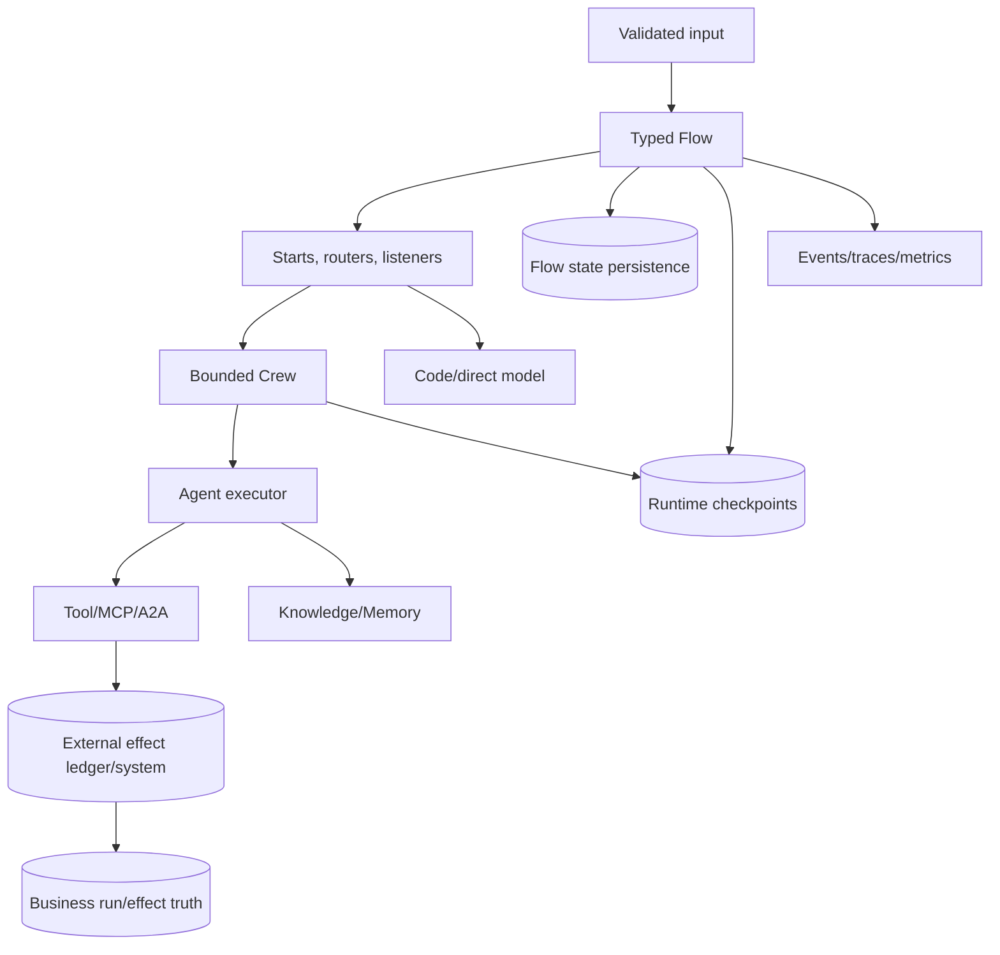

# CrewAI Deep-Dive Research Packet

> **Research date:** 2026-08-31  
> **Status:** Pass-two reviewed for the `1.15.18` baseline  
> **Deliverable:** [CrewAI production-engineering guide cluster](../../frameworks/crewai/README.md)

## Scope

This packet records the evidence behind the CrewAI deep-dive. It covers:

- current package/version/runtime architecture;
- Agents, Tasks, Crews, processes, delegation, and A2A;
- Flows, routing, events, state, conversational mode, and concurrency;
- tools, execution hooks, Skills, native MCP, Knowledge, and unified Memory;
- planning/reasoning, frame/chunk streaming, and extension-point failure semantics;
- Flow persistence, runtime checkpoints, resume, fork, and HITL;
- observability, testing, evaluation, deployment, scaling, cost, and security;
- migration history, current limitations, and bounded maintainer-issue evidence.

It does not claim to audit CrewAI AMP internals or establish a vendor security/compliance certification. Managed-platform claims are attributed to current official Platform documentation and kept separate from OSS source behavior.

## Method

1. Identified the newest public CrewAI release at the research date.
2. Checked out the exact official tag and recorded its commit.
3. Used frozen `v1.15.18` documentation rather than `main` for framework behavior.
4. Inspected runtime source for concurrency, restore, timeout, checkpoint, event, memory, MCP, and A2A semantics.
5. Reviewed the changelog across `1.14`–`1.15` for migrations and security changes.
6. Compared docs with source where recovery/cancellation behavior was operationally important.
7. Reviewed a bounded set of maintainer issues only where current source or upgrade tests could validate the concern.
8. Consulted official CrewAI Platform docs for AMP deployment, API, SSO/RBAC, HITL, PII redaction, webhooks, and OpenTelemetry export.
9. Synthesized production guidance without treating examples, marketing claims, or prompts as controls.
10. Performed a second-pass usefulness audit of every guide, then rechecked planning, hooks, streaming, Skills, callbacks, and local artifact execution against tagged source.

## Reproducibility Snapshot

| Item | Value |
|---|---|
| Repository | `crewAIInc/crewAI` |
| Tag | `1.15.18` |
| Commit | `4bc5d2924218e892bd0bc91b46352b49b0d3a740` |
| Release date | 2026-08-27 |
| Documentation tree | `docs/v1.15.18/en/` |
| Python range | `>=3.10,<3.14` |
| Internal package alignment | `crewai-core==1.15.18`, `crewai-cli==1.15.18` |
| MCP SDK constraint | `mcp~=1.28.1` |
| Research timezone/date | Asia/Calcutta, 2026-08-31 |

## Research Questions and Findings

### 1. What is the production architecture boundary?

**Finding:** CrewAI has a reasoning/collaboration layer (Agent/Task/Crew) and an explicit orchestration layer (Flow). Official production guidance favors Flow-first composition. Source confirms Flow owns method/event state while Crew owns task execution.

**Decision:** Recommend typed Flow control with bounded Crews, direct Agents/model calls, or deterministic code as inner activities. Keep business/effect truth external.

**Confidence:** High—official architecture/docs plus source structure.

### 2. How do Flows schedule work?

**Finding:** Multiple unconditional starts can run concurrently. Routers for a trigger are processed before ordinary listeners; eligible listeners can run concurrently. Some racing OR paths cancel remaining tasks after success. Overall output can be the method that completes last.

**Decision:** Require disjoint state writes, explicit joins/terminal results, and cancellation-safe/read-only races.

**Confidence:** High—verified in `flow/runtime/__init__.py` and versioned Flow docs.

### 3. Does persisted Flow state resume execution?

**Finding:** `@persist` saves Flow state. Loading a state ID does not generally carry a program counter; without runtime checkpoint progress, starts can execute again. `restore_from_state_id` normally creates a fresh ID/lineage, while an explicit input ID can defeat that separation. Missing state can fall through.

**Decision:** Distinguish state restore from execution-cursor restore. Make starts/effects replay-safe and validate restore existence/identity.

**Confidence:** High—source restore/kickoff path plus docs.

### 4. What do runtime checkpoints provide?

**Finding:** `CheckpointConfig` applies to Crew, Flow, and Agent; it serializes entity/runtime state, progress, outputs, inputs, event graph, and lineage. Default automatic checkpoints occur at `task_completed`. JSON and SQLite providers are built in. Automatic checkpoint write failures are logged and do not fail a run; manual calls re-raise.

**Decision:** Monitor recoverability, choose checkpoint events deliberately, and use manual/fail-closed boundaries where checkpoint success is mandatory.

**Confidence:** High—checkpoint docs, listener, config, runtime-state, and provider source.

### 5. Do persistence/checkpoints give exactly-once effects?

**Finding:** No framework snapshot is atomic with a remote API/database write. A process can fail after an effect but before the next snapshot. Thread/coroutine cancellation does not undo remote work.

**Decision:** Require receiving-service idempotency plus an application effect ledger and reconciliation.

**Confidence:** High—distributed-systems consequence directly supported by ordering in source.

### 6. How reliable are timeouts?

**Finding:** Current synchronous Agent timeout uses `ThreadPoolExecutor`, calls `future.cancel()`, and leaves a context manager that waits on shutdown. Python cannot cancel an already-running thread. Blocking work/effects can continue, and the apparent timeout may not be a hard return boundary.

**Decision:** Use transport timeouts/cooperative cancellation and process/container isolation where hard termination matters.

**Confidence:** High—direct source inspection; consistent with closed issue #4135.

### 7. What is the async/concurrency model?

**Finding:** `kickoff_async` offloads synchronous kickoff with `asyncio.to_thread`; `akickoff` follows a native async path. Flow listeners and async tasks create multiple concurrency surfaces. Already-started sibling work may produce effects even when another branch fails.

**Decision:** Put admission control outside CrewAI, use disjoint effect keys, and failure-inject every chosen executor path.

**Confidence:** High for source behavior; dependency-specific async safety remains deployment-dependent.

### 8. How do tool failures propagate?

**Finding:** CrewAI normalizes returned/raised/MCP/missing/usage-limit failures and supports policy at several levels. Warning/continue behavior can return a result with recorded tool failures.

**Decision:** Inspect tool-failure fields; fail closed for required reads/writes/policy checks; model degraded outcomes explicitly.

**Confidence:** High—versioned Tools docs and tool source.

### 9. What are native MCP boundaries?

**Finding:** Native integration supports tool discovery/invocation over stdio, Streamable HTTP, and SSE, with filtering/caching options. Tool metadata itself enters model context. Current package pins MCP SDK `1.28.x`; it does not support MCP 2.x by dependency constraint.

**Decision:** Allowlist server/tool metadata, sandbox stdio, control remote egress/SSRF/tokens, and contract-test exact MCP versions. Treat prompts/resources/protocol extensions as unsupported unless verified.

**Confidence:** High—package metadata, MCP docs/source; issue #6750 provides bounded compatibility evidence.

### 10. How do Knowledge and Memory differ?

**Finding:** Knowledge is an authored retrieval corpus, using Chroma/RAG patterns and a documented default OpenAI `text-embedding-3-small`. Unified Memory is run-derived, LLM-analyzed/consolidated, using LanceDB and a documented default `text-embedding-3-large`. Task context is a third mechanism for same-run dependencies.

**Decision:** Keep separate lifecycle, namespace, access, version, and cost policies. Use explicit task context before Memory.

**Confidence:** High—matching versioned docs and memory source.

### 11. What can unified Memory silently do?

**Finding:** Encoding can insert/update/delete through LLM-mediated consolidation. Background writes use threads; standalone use must drain/close. Some analysis/background failures degrade or emit events rather than fail the agent. Memory “private”/scope behavior is not a tenant authorization system.

**Decision:** Store provenance/verification/retention, authorize before recall, monitor save failures, and fail closed only when application correctness requires memory.

**Confidence:** High—Memory docs and encoding/unified-memory source.

### 12. What is safe HITL behavior?

**Finding:** `@human_feedback` supports blocking and non-blocking providers. Pending exceptions trigger automatic Flow-state persistence; resume uses `from_pending` and sync/async resume APIs. Free-text can be classified into route labels. AMP offers a separate email-first Flow HITL feature.

**Decision:** Bind approval to authenticated reviewer, tenant, artifact hash, outcome set, policy revision, expiry, and a single-use claim. Prefer structured decisions. Assess email identity risk for high-impact AMP flows.

**Confidence:** High for OSS/API docs; managed security guarantees require deployment-specific validation.

### 13. What are event/tracing guarantees?

**Finding:** Event handlers can be sync/async and their failures are logged rather than failing workflow execution. AMP tracing is opt-in/configured separately. CrewAI package telemetry recognizes three disable variables. AMP webhooks may be out of order and realtime delivery has performance cost.

**Decision:** Keep required business writes out of event handlers; maintain an authoritative ledger; redact before export; make webhook consumers durable/idempotent.

**Confidence:** High—event bus/telemetry source and official Platform docs.

### 14. Is `crewai test` enough?

**Finding:** It runs a small number of Crew iterations (default two) and uses an OpenAI model judge (documented default `gpt-4o-mini`; currently only OpenAI supported).

**Decision:** Use as an exploratory signal alongside deterministic, contract, restore, failure-injection, adversarial, statistical eval, and canary tests.

**Confidence:** High—versioned testing documentation.

### 15. What does AMP add?

**Finding:** Official docs describe managed deployments/automations, REST endpoints, execution history, metrics/traces, managed variables/connections, SSO/RBAC, HITL, webhook streaming, PII redaction, and OTel export. Deployment supports CLI, GitHub, Studio, and redeploy API paths.

**Decision:** Treat AMP as a managed control/operations plane. Retain application identity/tenant policy, effect idempotency, data governance, and API/webhook integration controls.

**Confidence:** High for documented feature surface; no source-level or contractual SLO audit performed.

### 16. Which planning API is current and bounded?

**Finding:** Tagged Agent source deprecates `reasoning` and `max_reasoning_attempts` in favor of `PlanningConfig`. Bare Agent `planning=True` constructs low-effort, one-attempt configuration; an explicit default `PlanningConfig()` can refine without an attempt limit. Crew-level planning is a separate `CrewPlanner` stage. Versioned Crew planning docs name `gpt-4o-mini`, while tagged source defaults the implicit planner to `gpt-5.4-mini`.

**Decision:** Use explicit bounded `PlanningConfig`, explicit Crew `planning_llm`, and include all planner/observer calls in the run budget and eval.

**Confidence:** High—tagged Agent configuration, reasoning handler, and Crew planner source.

### 17. What is the streaming integration contract?

**Finding:** Frame streaming exposes ordered `StreamFrame` objects for Flow, direct LLM, and conversational surfaces, with channel projections. Crew `stream=True` retains a separate chunk-oriented result. A stream must be consumed before `.result`; disconnect cleanup closes the stream but does not provide effect rollback.

**Decision:** Adapt frames into an application event envelope, persist terminal state separately, close on disconnect, and reconcile rather than restarting a run.

**Confidence:** High—versioned streaming docs and `types/streaming.py`.

### 18. Can hooks enforce policy safely?

**Finding:** Hooks can mutate, replace, or abort. Only `HookAborted` is a deliberate stop; ordinary hook exceptions are swallowed fail-open. A blocked tool call is returned to the Agent and the wider run can continue. Global registration is process-scoped. Open #6736 plus tagged provider handlers show an async post-LLM hook coverage gap that must be regression-tested.

**Decision:** Use hooks for early deny/redaction and telemetry, explicitly convert policy-engine failure to `HookAborted`, and re-enforce authorization/redaction inside the tool/service/export boundary.

**Confidence:** High for dispatcher/tool-hook source; issue evidence is bounded to the reported/tagged async paths.

### 19. Are project files and Skills passive content?

**Finding:** No. Crew project import loads dotenv state; trusted declarative script actions execute Python; definitions resolve Python references; trained-agent data uses pickle; Skills inject authored instructions and may include support files/scripts. Skills Registry is stable, while `allowed-tools` remains non-provisioning experimental metadata.

**Decision:** Sandbox and review downloaded projects, disable Flow script execution by default, reject untrusted pickle, pin artifacts/Skills, and keep tool permission independent from Skill metadata.

**Confidence:** High—tagged project/Flow/file-handler/Skills source and docs; #7050 is treated as an upgrade/test lead rather than a blanket exploitability claim.

## Runtime Semantics Map

## Version and Migration Findings

### `1.14.x`

- `1.14.0`: runtime state checkpointing, event infrastructure, JSON/SQLite providers; deprecated code-execution surfaces removed.
- `1.14.2`–`1.14.4`: restore/fork/lineage, CLI inspection, checkpoint migration/serialization, custom persistence keys, guardrail/callable fixes.
- `1.14.5`: AgentExecutor became default; CrewAgentExecutor deprecated; Flow state restore/fork surface added.
- `1.14.6`: checkpoint serialization and stdio environment security fixes.
- `1.14.7`: Flow DSL/definition/runtime split and runtime-state isolation work.

### `1.15.x`

- `1.15.0`: JSON-first Crews, unified declarative Flows, `StateProxy` removal, aggregated Flow usage, owner-only credential/security changes.
- `1.15.2`: stream-frame protocol and inline Skills support.
- `1.15.3`: tool-result caching made opt-in; generic, execution-boundary, and step hooks added/reworked.
- `1.15.4`: Skills Repository promoted from experimental.
- `1.15.17`: tool SSRF redirect and connected-peer checks; MCP fixes.
- `1.15.18`: conversational Flows promoted to stable and supporting APIs/docs hardened.

**Interpretation:** even patch releases changed defaults/security. Exact pins plus fixture/eval migration gates are necessary.

## Bounded Maintainer-Issue Review

Issue status is a point-in-time research aid, not a substitute for source/tests.

| Issue | Research-date interpretation | Documentation response |
|---|---|---|
| [#6706](https://github.com/crewAIInc/crewAI/issues/6706) | Open report: persisted dict state loses new initialized defaults on restore | Prefer Pydantic; schema-version/migration fixtures |
| [#6650](https://github.com/crewAIInc/crewAI/issues/6650) | Open report: `kickoff_for_each` clears latest replay records; reset remains visible in current source | Do not use replay as batch durability |
| [#6750](https://github.com/crewAIInc/crewAI/issues/6750) | Open compatibility report for MCP 2.0; package pins `mcp~=1.28.1` | Pin client/server; contract-test before protocol upgrade |
| [#4135](https://github.com/crewAIInc/crewAI/issues/4135) | Closed not planned, but current timeout path still cannot kill running thread work | Transport deadlines and process isolation |
| [#6736](https://github.com/crewAIInc/crewAI/issues/6736) | Open report: native async provider handlers skip post-LLM hooks; tagged handler source lacks sync invocation sites | Do not rely on post hook alone; contract-test sync/async/streaming paths |
| [#7050](https://github.com/crewAIInc/crewAI/issues/7050) | Open report linking dotenv-loaded configuration, Flow script execution, and pickle surfaces in untrusted projects | Sandbox/review downloaded projects; disable scripts; reject untrusted pickle |

Historical executor/HITL/chat reports were not presented as current defects when release notes/source indicated fixes. They remain useful regression-test seams during upgrades.

## Contradictions and Uncertainty Register

| Conflict | Evidence | Resolution |
|---|---|---|
| Existing repository overview calls conversational Flows experimental | Accurate for earlier `1.15.x`; `1.15.18` changelog/current guide promotes stable | Deep-dive says stable at `1.15.18`; flag overview for owner update |
| Tools docs list `CodeInterpreterTool` | `1.14.0` changelog/current Agent docs say removed; current source lacks old surface | Treat as unavailable; do not recreate unsafe in-process execution |
| Persistence described generically | Source exposes Flow state persistence and runtime checkpoint systems with different restore semantics | Document separately with explicit comparison |
| Timeout name implies a hard bound | Source thread cancellation cannot terminate running work | Document as soft/cooperative boundary |
| Managed “production-ready/scalable/security” language | Feature docs describe controls, not every application invariant or SLO | Attribute exact features; retain app controls |
| Event timelines can look authoritative | Handlers/export/webhooks can fail or reorder | Use external run/effect ledger |
| Agent/Reasoning docs foreground `reasoning` | Tagged Agent source deprecates it for `planning_config` | Use bounded `PlanningConfig`; retain compatibility note only |
| Crew Planning docs name `gpt-4o-mini` default | Tagged `CrewPlanner` source uses `gpt-5.4-mini` | Configure and record `planning_llm` explicitly |
| Boundary-hook docs say Crew internal Flow also dispatches | `1.15.18` changelog/source skip interception on CrewAI-internal Flows | Treat dispatch count as version-sensitive; test exact runtime |
| Skill `allowed-tools` can sound like permission | Official Skills docs call it experimental metadata and say tools must be provided separately | Never derive capability grant from Skill text |

## Failure-Injection Matrix Derived From Research

| Injection | Required assertion |
|---|---|
| Crash before/after state persist | State migration and replay behavior are explicit |
| Crash after effect before checkpoint | Same effect key reconciles; no duplicate write |
| Auto-checkpoint provider failure | Alert/degraded recoverability or declared fail-closed result |
| Restore missing state ID | Request fails explicitly rather than silently starting new work |
| Dict/Pydantic old snapshot | Defaults/migrations behave intentionally |
| Parallel listener/task failure | Sibling effects are discovered/reconciled |
| Agent timeout with blocking tool | Worker isolation contains continuing work |
| Provider 429/5xx/malformed schema | One bounded retry owner; typed outcome |
| MCP missing/poisoned metadata/SSRF | Required capability fails closed; allowlist blocks attack |
| A2A duplicate/out-of-order update | Idempotent monotonic state |
| Memory background write failure | Metrics/outcome reflect configured optional/required semantics |
| Duplicate/expired/forged HITL response | Only authorized single-use claim resumes |
| AMP webhook reorder/duplicate | Durable consumer reconciles final status |
| Version upgrade with old checkpoint | Restore/migrate or reject explicitly |
| Hook throws ordinary exception | Policy remains safe because tool/service rechecks authorization |
| Async/streaming provider path | Required redaction/audit remains enforced outside post-LLM hook |
| Malicious project `.env`/script/pickle/Skill | Sandbox prevents credential or host compromise |

## Selected Primary Sources

### Version, package, and architecture

- [CrewAI source tag `1.15.18`](https://github.com/crewAIInc/crewAI/tree/1.15.18)
- [`1.15.18` changelog](https://github.com/crewAIInc/crewAI/blob/1.15.18/docs/v1.15.18/en/changelog.mdx)
- [Package metadata](https://github.com/crewAIInc/crewAI/blob/1.15.18/lib/crewai/pyproject.toml)
- [Production architecture guide](https://github.com/crewAIInc/crewAI/blob/1.15.18/docs/v1.15.18/en/concepts/production-architecture.mdx)

### Agents, Tasks, Crews, and Flows

- [Agents](https://github.com/crewAIInc/crewAI/blob/1.15.18/docs/v1.15.18/en/concepts/agents.mdx)
- [Tasks](https://github.com/crewAIInc/crewAI/blob/1.15.18/docs/v1.15.18/en/concepts/tasks.mdx)
- [Crews](https://github.com/crewAIInc/crewAI/blob/1.15.18/docs/v1.15.18/en/concepts/crews.mdx)
- [Processes](https://github.com/crewAIInc/crewAI/blob/1.15.18/docs/v1.15.18/en/concepts/processes.mdx)
- [Flows](https://github.com/crewAIInc/crewAI/blob/1.15.18/docs/v1.15.18/en/concepts/flows.mdx)
- [Conversational Flows](https://github.com/crewAIInc/crewAI/blob/1.15.18/docs/v1.15.18/en/guides/flows/conversational-flows.mdx)
- [Flow runtime source](https://github.com/crewAIInc/crewAI/blob/1.15.18/lib/crewai/src/crewai/flow/runtime/__init__.py)
- [Crew source](https://github.com/crewAIInc/crewAI/blob/1.15.18/lib/crewai/src/crewai/crew.py)
- [Agent core source](https://github.com/crewAIInc/crewAI/blob/1.15.18/lib/crewai/src/crewai/agent/core.py)
- [Agent planning configuration](https://github.com/crewAIInc/crewAI/blob/1.15.18/lib/crewai/src/crewai/agent/planning_config.py)
- [Crew planner source](https://github.com/crewAIInc/crewAI/blob/1.15.18/lib/crewai/src/crewai/utilities/planning_handler.py)
- [Streaming runtime contract](https://github.com/crewAIInc/crewAI/blob/1.15.18/docs/v1.15.18/en/learn/streaming-runtime-contract.mdx)
- [Streaming types](https://github.com/crewAIInc/crewAI/blob/1.15.18/lib/crewai/src/crewai/types/streaming.py)

### Durability and HITL

- [Checkpointing](https://github.com/crewAIInc/crewAI/blob/1.15.18/docs/v1.15.18/en/concepts/checkpointing.mdx)
- [Checkpoint listener](https://github.com/crewAIInc/crewAI/blob/1.15.18/lib/crewai/src/crewai/state/checkpoint_listener.py)
- [Runtime state](https://github.com/crewAIInc/crewAI/blob/1.15.18/lib/crewai/src/crewai/state/runtime.py)
- [Human feedback in Flows](https://github.com/crewAIInc/crewAI/blob/1.15.18/docs/v1.15.18/en/learn/human-feedback-in-flows.mdx)

### Capabilities, data, and collaboration

- [Tools](https://github.com/crewAIInc/crewAI/blob/1.15.18/docs/v1.15.18/en/concepts/tools.mdx)
- [MCP overview](https://github.com/crewAIInc/crewAI/blob/1.15.18/docs/v1.15.18/en/mcp/overview.mdx)
- [MCP security](https://github.com/crewAIInc/crewAI/blob/1.15.18/docs/v1.15.18/en/mcp/security.mdx)
- [Knowledge](https://github.com/crewAIInc/crewAI/blob/1.15.18/docs/v1.15.18/en/concepts/knowledge.mdx)
- [Memory](https://github.com/crewAIInc/crewAI/blob/1.15.18/docs/v1.15.18/en/concepts/memory.mdx)
- [A2A delegation](https://github.com/crewAIInc/crewAI/blob/1.15.18/docs/v1.15.18/en/learn/a2a-agent-delegation.mdx)
- [Execution hooks](https://github.com/crewAIInc/crewAI/blob/1.15.18/docs/v1.15.18/en/learn/execution-hooks.mdx)
- [Tool hooks](https://github.com/crewAIInc/crewAI/blob/1.15.18/docs/v1.15.18/en/learn/tool-hooks.mdx)
- [Hook dispatcher source](https://github.com/crewAIInc/crewAI/blob/1.15.18/lib/crewai/src/crewai/hooks/dispatch.py)
- [Skills](https://github.com/crewAIInc/crewAI/blob/1.15.18/docs/v1.15.18/en/concepts/skills.mdx)
- [Declarative Flow action source](https://github.com/crewAIInc/crewAI/blob/1.15.18/lib/crewai/src/crewai/flow/runtime/_actions.py)
- [Crew project loader source](https://github.com/crewAIInc/crewAI/blob/1.15.18/lib/crewai/src/crewai/project/crew_base.py)
- [Training pickle loader source](https://github.com/crewAIInc/crewAI/blob/1.15.18/lib/crewai/src/crewai/utilities/file_handler.py)

### Operations and managed platform

- [Event listener](https://github.com/crewAIInc/crewAI/blob/1.15.18/docs/v1.15.18/en/concepts/event-listener.mdx)
- [Tracing](https://github.com/crewAIInc/crewAI/blob/1.15.18/docs/v1.15.18/en/observability/tracing.mdx)
- [Testing](https://github.com/crewAIInc/crewAI/blob/1.15.18/docs/v1.15.18/en/concepts/testing.mdx)
- [AMP deployment](https://docs-platform.crewai.com/platform/en/guides/deploy-to-amp)
- [AMP SSO](https://docs-platform.crewai.com/platform/en/features/sso)
- [AMP RBAC](https://docs-platform.crewai.com/platform/en/features/rbac)
- [AMP Flow HITL](https://docs-platform.crewai.com/platform/en/features/flow-hitl-management)
- [AMP webhook streaming](https://docs-platform.crewai.com/platform/en/features/webhook-streaming)
- [AMP PII trace redaction](https://docs-platform.crewai.com/platform/en/features/pii-trace-redactions)
- [AMP OpenTelemetry export](https://docs-platform.crewai.com/platform/en/guides/capture_telemetry_logs)

## Refresh Triggers

Refresh this packet when any of the following occurs:

- CrewAI `1.16`, `2.0`, or a security release ships;
- `A2AConfig` is removed or A2A protocol/runtime changes materially;
- CrewAI adopts MCP 2.x;
- checkpoint providers/serialization or Flow restore semantics change;
- conversational Flow APIs move again;
- the timeout executor gains hard/cooperative cancellation changes;
- unified Memory storage/encoding/tenant controls change;
- AMP API, authentication, RBAC, HITL, webhook, retention, or deployment contracts change;
- #6706, #6650, #6750, or the corresponding source behavior is resolved;
- #6736 or #7050 is resolved, or hook/artifact loading behavior changes;
- the repository's shared CrewAI overview is refreshed.

## Handoff Notes

- The guide cluster intentionally leaves `docs/frameworks/crewai.md` and shared indexes to the coordinator; integration has since corrected the overview's conversational-Flow status.
- The Tools/CodeInterpreter documentation inconsistency is preserved as a limitation rather than papered over.
- Pass two added bounded planning, streaming, hooks, Skills, callback, and untrusted-project guidance without creating more files.
- All production recommendations distinguish framework convenience from authorization, exact effects, distributed durability, and managed-platform guarantees.
