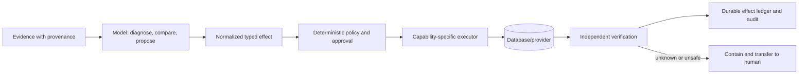
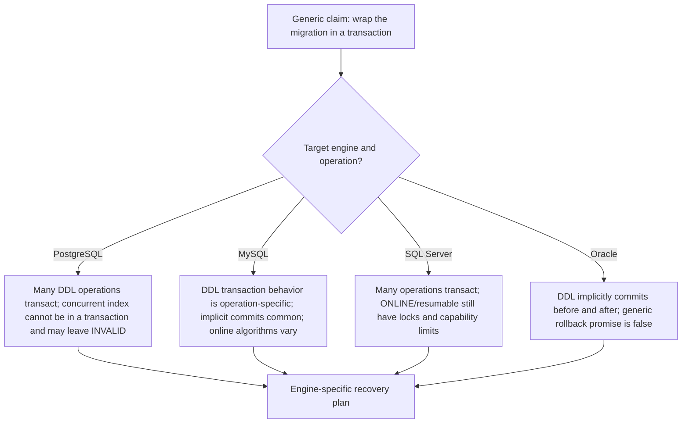

# Research Packet: Database Operations Agent Blueprint

> **Status:** Complete Pass 2 synthesis for the 2026-08-31 blueprint  
> **Research date:** 2026-08-31  
> **Blueprint:** [Database Operations Agent](../../agents/database-operations-agent/README.md)  
> **Scope:** Production agent architecture for database discovery, bounded query assistance, migration review, supervised change execution, backup/restore, replication, and failover  
> **Database baseline:** PostgreSQL 18.6; MySQL 8.4 LTS (8.4.11 general server release, 8.4.12 Docker-image-only security update); SQL Server 2025 17.x CU8; Oracle AI Database 26ai; managed-service guidance is capability- and date-sensitive

This packet records the evidence and decisions behind the blueprint. It is not a general database administration guide. Its purpose is to make safety-critical architecture claims reviewable, expose engine differences that invalidate generic agent patterns, and identify what must be retested when models, engines, providers, or control-plane components change.

## Research method

Research proceeded from product boundary to effect safety:

1. Inspect the repository’s existing security, runtime, tool, reliability, evaluation, and operations guidance to avoid duplicate canonical material.
2. Establish current supported database versions from vendor policy, release notes, and current manuals.
3. Read primary engine documentation for plans, read-only behavior, DDL/online operations, locks, transaction semantics, advisory locks, row/tenant controls, backup validation, PITR, replication, and role transitions.
4. Read managed-service documentation for blue/green switching, backups, restore testing, and disaster failover.
5. Cross-check security and privacy architecture against OWASP and NIST guidance; use official legal text only for narrow data-processing principles.
6. Review durable execution and telemetry specifications for retry, persistence, and sensitive-data consequences.
7. Assess public text-to-SQL and database-operations benchmarks for what they measure and, equally importantly, what they do not.
8. Review production incident reports and an engine-upgrade case study for failure patterns that reference documentation often underemphasizes.
9. Synthesize a minimum-authority operating model and deterministic safety plane; document contradictions and residual gaps.

Search continued across alternative terms and engine-specific manuals until new results mostly repeated already captured safety constraints. Primary documentation is the foundation. Incident reports and benchmark papers supplement it with observed production and evaluation behavior; they do not override current vendor semantics.

Pass 2 rechecked the volatile version pages and qualified managed-service, migration, secret, workflow, and observability surfaces. It also traced cluster/database/schema/object/query/transaction/lock/migration/backup/restore/replica/failover identity through restart and topology changes, reviewed the seven required memory lifetimes and compaction receipt, and converted the delivery roadmap into Stage 0 through Stage 6 exercises with exit evidence.

## Core conclusion

The evidence does not support giving a general-purpose model unrestricted production SQL or failover authority. The safest useful pattern is progressive:

1. advisory analysis over exported or tightly bounded evidence;
2. query assistance under database-native read/tenant policy and resource budgets;
3. migration review that produces artifacts for the established change pipeline;
4. supervised execution of individually named, rehearsed capabilities.

The model’s role is strongest where evidence must be synthesized and alternatives explained. Deterministic code and database-native mechanisms are strongest where identity, authorization, exact effects, limits, concurrency, and outcome must be enforced.

## Research questions and answers

| Question | Synthesis |
|---|---|
| Should the agent be autonomous? | No general autonomous DBA mode is justified. Start advisory and add only named supervised capabilities whose effects and recovery can be deterministically constrained and evaluated. |
| Is read-only SQL safe enough for a generic tool? | No. It can expose sensitive data, consume resources, hold locks, use temporary objects, or call side-effecting routines. Use a parsed allowlist plus database privileges, tenant policy, budgets, target selection, cancellation, and output controls. |
| Can one DDL safety abstraction cover four engines? | Only at the proposal/effect-envelope level. Transaction, implicit commit, online-operation, lock, failure residue, and feature support remain engine/version/edition/provider-specific. |
| Can approval be conversational? | No. Approval must bind a canonical plan/effect hash, immutable target/topology epoch, budgets, window, recovery, policy, and expiry. Material drift invalidates it. |
| Can workflow retries make operations reliable? | Only when each external effect is idempotent or reconciled. At-least-once workers can execute Activities/tasks more than once; a timeout can occur after commit. |
| Is a verified backup recoverable? | Native validation raises confidence but only an isolated restore plus database/application verification and measured RPO/RTO proves useful recovery. |
| Is a healthy replica a backup? | No. Replication copies operator error/corruption and asynchronous promotion can lose acknowledged writes. Failover also requires fencing and dependent-system reconciliation. |
| Can tenant isolation be implemented once in the agent? | No. Use database-native or physical isolation. Engines have materially different primitives and privileged bypass behavior. Agent parsing/rewriting is only defense in depth. |
| What dominates cost? | Database load, operational/recovery infrastructure, review time, and incident risk often dominate model tokens. Admission control and evidence reuse matter more than aggressive prompt compression. |
| What does public benchmarking establish? | Text-to-SQL benchmarks test reasoning/query execution; DBA-Bench adds live PostgreSQL operations and safety. None certifies this production control plane or every engine/provider. Internal effect/failure/security evaluations are mandatory. |

## Current version baseline

| Technology | Baseline on 2026-08-31 | Evidence and implication |
|---|---|---|
| PostgreSQL | 18.6; major 18 released 2025-09-25 | The [versioning policy](https://www.postgresql.org/support/versioning/) lists supported majors/current minors. Pin adapter semantics to major 18 and test minor/security updates. |
| MySQL | 8.4 LTS; 8.4.11 is the latest general server release found, while 8.4.12 released 2026-08-18 for the MySQL Server Docker image only | [8.4 release notes](https://dev.mysql.com/doc/relnotes/mysql/8.4/en/) and [8.4.12 note](https://dev.mysql.com/doc/relnotes/mysql/8.4/en/news-8-4-12.html). Do not claim 8.4.12 semantics for every binary/distribution, and do not infer 9.x Innovation behavior. |
| SQL Server | SQL Server 2025, 17.x; CU8 build 17.0.4075.5 current on the research date | [Release notes](https://learn.microsoft.com/en-us/sql/sql-server/sql-server-2025-release-notes?view=sql-server-ver17) and [build history](https://learn.microsoft.com/en-us/troubleshoot/sql/releases/sqlserver-2025/build-versions). Edition, OS/platform, compatibility-level, GDR/CU servicing branch, and Azure differences still require capability detection. |
| Oracle Database | Oracle AI Database 26ai, next LTS | [26ai documentation](https://docs.oracle.com/en/database/oracle/oracle-database/26/) and [new-features overview](https://docs.oracle.com/en/database/oracle/oracle-database/26/nfcoa/all-nfg.html). Use current role-transition guidance and deprecation notices. |
| OpenTelemetry semantic conventions | Documentation reported 1.44.0 during research | Database conventions are stable; GenAI areas remain evolving. Pin the semantic-convention version and capture sensitive fields only by policy. |

Version labels alone are insufficient. Adapters must probe edition, provider, topology, configuration, extensions/plugins, and object type because capabilities such as online/resumable DDL and replica reads vary.

## Pass 2 source qualification record

All entries below were accessed on **2026-08-31**. “Status” describes the source/product surface observed on that date, not a promise about the reader's deployment.

| Surface | Version/status observed | Contradiction or limitation resolved | Deployment implication |
|---|---|---|---|
| PostgreSQL | Version policy lists 18.6 current; 18.5 was skipped after a post-wrap regression | A major label is not enough, and a missing sequential minor is not proof that documentation is stale | Record actual `server_version_num`, extensions, config/topology; qualify 18.6 and the deployed platform |
| MySQL | 8.4 LTS manuals; 8.4.12 release note is Docker-image-only, 8.4.11 is the general server baseline found | “8.4.12 is the current MySQL server everywhere” is false | Record distribution/container digest and edition as well as SQL version; test the exact artifact |
| SQL Server | 2025 17.x, CU8 latest build table; release page contains preview/GA status by feature | Product year and compatibility level do not prove build, servicing branch, edition, platform, or feature state | Probe `@@VERSION`, engine edition, compatibility level and relevant configuration; pin GDR/CU branch |
| Oracle AI Database | 26ai documentation identifies the next LTS and continues to publish release-update-specific changes | On-premises/Exadata/Autonomous and 19c/23ai/26ai behavior cannot be merged | Pin RU, platform/service shape, CDB/PDB topology, options and Data Guard/Broker capability |
| Amazon RDS Blue/Green | Current service docs, unversioned managed contract | New green production has a different immutable resource ID; old PITR history does not carry over; connections/integrations and engine-specific replication limits remain | Adapter keys state by resource ID and retains old environment/recovery evidence; rehearse clients and integrations |
| Amazon Aurora Global Database | Current managed contract | RDS Blue/Green rules are not Aurora Global rules; cross-region loss follows lag and old-writer fencing is documented as best effort | Separate adapter, loss gate, infrastructure fencing and divergent-write reconciliation |
| Google Cloud SQL | HA, advanced DR, backups/PITR docs updated in July/August 2026 | HA, switchover and immediate DR replica failover differ; replica failover can lose data and PITR can be temporarily unavailable after promotion | Detect edition/log-storage/topology, persist long-running operation ID, test reconnect/backup interval and unsupported automation paths |
| Azure SQL Database | Current failover-group docs; asynchronous geo-replication | Planned failover synchronizes; forced failover explicitly allows loss; `sp_wait_for_database_copy_sync` hardens but does not wait for redo | Separate planned/forced tools and approvals; do not reuse SQL Database contract for Managed Instance |
| Oracle Autonomous AI Database | Serverless/Dedicated backup and Data Guard pages; 2026 service docs | Local/cross-region, Serverless/Dedicated/Cloud@Customer, automatic/manual transitions and restore restrictions differ | Detect service shape and standby type; bind key/backup/data-loss limits and concurrent-operation state |
| Flyway | Current transaction-handling docs | A runner transaction cannot make non-transactional engine statements transactional; grouped mixed runs have constraints | Qualify exact edition/version/config and migration; preserve established history/lock authority |
| Liquibase | Community 5.0.3 rollback matrix updated 2026-08-21 during research | Automatic rollback is not universal; destructive/DML and formatted SQL cases often need custom recovery | Bind changelog format and change types; rehearse rollback/forward fix and data recovery |
| `gh-ost` | Official repository `master`, not a versioned service contract | Pause/throttle/cutover controls do not remove binlog, privilege, topology, trigger/foreign-key and hook limitations; RDS guidance is community-driven | Pin a reviewed release/commit and container digest; test the exact MySQL/RDS topology and deny unreviewed hooks |
| HashiCorp Vault DB secrets | Current plugin-based engine and lease docs | TTL/revocation is not proof that an already-open DB session ended; plugin features/root rotation differ; forced lease removal can desynchronize Vault | Qualify exact Vault/plugin/database version, issue/renew/revoke/orphan behavior and database-side session cleanup |
| Temporal | Current Activity/workflow/worker-versioning docs | Workflow durability does not make side effects exactly-once; Activities can execute more than once and arguments/results enter history | External effect ledger/reconciliation remains mandatory; store sensitive payloads by protected reference and test history/version migration |
| OpenTelemetry | Semantic Conventions 1.44.0; database spans stable, some attributes/GenAI conventions still development/opt-in | Stable database fields can coexist with legacy emissions; query parameters are not safe default telemetry | Pin convention and instrumentation versions, migration opt-in, sanitization, processors/exporters and retention |
| NIST SSDF | SP 800-218 v1.1 final; v1.2 is draft on the research date | Draft 1.2 should not be described as the current final baseline | Use final v1.1 for provenance/component controls and track the draft separately |

## Evidence synthesis

### Operating modes and authority

The key risk reduction is product separation, not better prompting.

| Mode | Evidence-based boundary | Rationale |
|---|---|---|
| Advisory analyst | No database effect; live evidence tools are bounded and redacted | Most diagnosis value comes from correlating metadata, workload, waits, and change history. Removing effect authority sharply limits harm. |
| Query assistant | Dedicated read identity plus parsed statement allowlist and resource/data budgets | Vendor read-only semantics have exceptions; execution plans and stored functions can execute; result data is sensitive. |
| Migration reviewer | Catalog and plan evidence, semantic diff, engine-specific impact/recovery; execution remains in CI/change tooling | Migration tools already own ordering/history. Review benefits from reasoning without coupling generation to privileged execution. |
| Supervised operator | Only named capability, exact approval, JIT credential, preflight, effect ledger, and verification | DDL/continuity operations have high blast radius and ambiguous outcomes; deterministic controls must own them. |

OWASP’s agent guidance supports least privilege, structured validation, separate decision/execution, and specific human-in-the-loop approval. NIST SP 800-53 supplies the broader separation-of-duties, least-privilege, audit, and controlled-change principles. DBA-Bench’s emerging results reinforce caution: its paper reports an overall 12.4% safe-pass average across evaluated agents and 17.9% for the best automated system, versus 93.4% for human DBAs. Because this is a July 2026 preprint and the official repository said artifacts were being finalized, the exact results are directional evidence rather than a maturity claim.

### Read and plan safety

The word “read” hides different effects:

- PostgreSQL `EXPLAIN ANALYZE` actually executes the statement. Documentation suggests rolling back write examples, but that is not a universal safe sandbox for arbitrary effects.
- MySQL `EXPLAIN ANALYZE` executes and times supported statements.
- SQL Server estimated plans do not execute; actual plans follow execution.
- Oracle `EXPLAIN PLAN` may differ from the actual runtime plan because binds and environment differ.
- PostgreSQL and MySQL read-only transactions permit temporary-table activity; SQL Server `READ COMMITTED` is an isolation setting, not a read-only capability.
- SQL text, bind values, results, errors, plans, and telemetry may contain PII/secrets; OpenTelemetry recommends sanitization and leaves parameter capture off by default.

Therefore the query assistant needs dialect AST parsing, a narrow allowlist, database-native identity/policy, statement/lock/transaction limits, row/byte/concurrency budgets, a safe target, cancellation, and pre-model redaction. Regex rejection and prompt-only “SELECT” rules are inadequate.

### Discovery and evidence quality

Vendor telemetry provides valuable but scoped evidence:

- PostgreSQL `pg_stat_statements` aggregates normalized query statistics, while `pg_locks` exposes current lock state.
- MySQL Performance Schema statement digests aggregate query families and InnoDB instrumentation exposes lock waits.
- SQL Server Query Store retains query, plan, runtime, and wait history; configuration/reset/replica behavior affects interpretation.
- Oracle plan/cursor evidence can differ between explained and executed environments.

A snapshot must record collector, target fingerprint, topology epoch, time range, reset/sampling boundaries, redaction, consistency, TTL, and limitations. The model should see a bounded projection; protected raw artifacts remain outside prompt context.

### Identity, incarnation, and version synthesis

The research exposed a recurring category error: a familiar name is treated as the same operational object after restore, blue/green switch, recreation, or failover. The design therefore separates logical continuity from physical incarnation.

- Cluster/server identity includes immutable provider/native resource identity, account/region, engine/build/edition/config revision and topology epoch. A stable DNS endpoint is routing, not resource identity.
- Database/schema/object identity is scoped to the cluster/database incarnation. Native object IDs are useful when available but are paired with normalized scope and canonical definition/dependency/security hashes; restore/recreate can reuse names or IDs without preserving authority.
- Query identity combines dialect/version, normalized AST or engine fingerprint, parameter type signature and execution context. A telemetry digest can reset or merge observations and is not a permanent business identity. Plans are separately versioned by plan ID/hash and statistics/config snapshot.
- Transaction and lock identities are attempt- and observation-scoped. Reconnect/retry/failover creates a new transaction attempt; a lock graph expires with its snapshot and cannot authorize later cancellation by name alone.
- Migration identity binds repository/tool namespace, ordered migration ID, immutable artifact digest and applied-history high-watermark/checksum. Backup identity binds source incarnation, manifest and dependency graph, recovery position, tool/format and key version.
- A restore is a new effect and destination incarnation with requested versus achieved recovery point. A replica has member identity and source lineage plus receive/persist/replay positions. A switchover/failover has its own transition ID, old/new members, fencing receipt, loss decision and new topology epoch.

This scheme makes approval invalidation mechanical: any target incarnation, canonical definition, applied-history, backup chain, topology, plan/evidence freshness, or relevant policy/config change reopens preflight and often requires a new grant.

### Transactions, DDL, and locks

Cross-engine commonality exists at the operational level: resolve current schema/topology, forecast lock/rewrite/log/storage/replication cost, prefer compatibility phases, use fail-fast lock acquisition, define live gates, and verify. The implementation details cannot be collapsed:

- PostgreSQL concurrent index creation takes two scans, waits on transactions, uses extra work, cannot run in a transaction block, allows only one concurrent build per table, and can leave an invalid index on failure.
- MySQL online DDL selects among `INSTANT`, `INPLACE`, and `COPY`; requesting `LOCK=NONE` is important because unsupported concurrency should fail rather than silently block. Metadata locks held to transaction end can create unexpected queues.
- SQL Server online index operations still need short schema locks. `WAIT_AT_LOW_PRIORITY` can abort itself or blockers; killing blockers requires elevated authority and is too dangerous as a quiet default. Resumable support has constraints.
- Oracle DDL implicitly commits. `DBMS_REDEFINITION` and online operations have object, feature, and security-policy restrictions; `DDL_LOCK_TIMEOUT` provides a bounded wait, not atomic rollback.

Migration tooling reflects the same reality. Flyway documents database-specific transaction handling; Liquibase automatic rollback support is change-type-specific; `gh-ost` offers useful MySQL throttle/pause/cutover controls but adds binlog/topology operational prerequisites. The agent should generate/review artifacts for the established tool, not replace it.

### Effect contracts, retries, and coordination

At-least-once execution means a worker can disappear after the database commits and before the controller records success. Temporal explicitly documents that Activities may execute more than once even though the workflow observes one completion. This produces three requirements:

1. persist a `STARTED` effect record before dispatch;
2. tag/correlate the native operation where possible;
3. reconcile database/provider state before retrying any ambiguous attempt.

Database advisory/application locks coordinate only cooperating clients and differ:

- PostgreSQL supplies session- and transaction-scoped advisory locks, application-defined rather than enforced object policy.
- MySQL `GET_LOCK()` is session-scoped, not released at transaction end, operates within one server, and has replication limitations.
- SQL Server `sp_getapplock` supports session or transaction ownership and scopes the resource to database/principal/name.

Use a durable orchestration lease plus a topology epoch as authority, with a database lock only to reduce local races. Failover and non-cooperating clients can bypass session-level coordination.

### Typed state, memory, and restart evidence

Conversation history is not operational state. The refined contract distinguishes typed request, state, event, plan, tool, effect and receipt records. Events carry workflow-local monotonic sequence, source/type/schema version, causation/correlation, actor, target epoch and payload/artifact hash; deterministic reducers reject sequence gaps, hash conflicts, unknown versions and illegal transitions.

The only permitted memory lifetimes are **Turn/scratch**, **Working/run**, **Session**, **Durable workflow/task**, **Domain knowledge**, **Long-term/preference**, and **Episodic/outcome**. Each has a specific use, rejection boundary, retention/deletion policy and test suite. In particular, session/preference memory cannot influence target, tenant, approval, risk, credential or recovery decisions, while episodic material enters production guidance only after human review, provenance, redaction and evaluation curation.

Compaction is a model projection, never state replacement. Its restart receipt records workflow/state version, event and per-source high-watermarks, target/topology epoch, model/prompt/controller/policy/adapter/schema versions, retained plan/evidence, approvals, every pending or `UNKNOWN` effect, budgets/stop conditions, engine warnings, omissions, `next_safe_action`, input/output digests and an invariants hash. Resume verifies these values against durable state, refreshes volatile database/provider observations and enters reconciliation/containment on any gap, mismatch, stale approval or unknown effect.

### Backup and restore evidence

Native backup validation is necessary but not sufficient:

- PostgreSQL `pg_verifybackup` checks a base backup against its manifest but warns that test restore remains necessary.
- SQL Server `RESTORE VERIFYONLY` checks readability/completeness but explicitly does not verify data structures.
- Oracle RMAN `VALIDATE` exercises backup/database reads for corruption and availability but does not prove application completeness.
- Managed backup success still depends on keys, permissions, log chain, global objects, external services, format/tool compatibility, and realistic restore throughput.

Google Cloud’s reliability architecture guidance recommends testing the full application recovery path and measuring integrity, RPO, and RTO. Production incidents make this concrete:

- GitLab’s 2017 outage found multiple backups unusable or absent, including a `pg_dump` version mismatch and a notification without effective ownership; recovery took roughly 18 hours and lost about six hours of data.
- GitHub’s 2018 incident showed how a network partition and role transition can create divergent writes; daily-tested backups were available, yet multi-terabyte restore time shaped the recovery decision, and replication catch-up was nonlinear.

The blueprint therefore uses a recovery assurance ladder culminating in isolated restore, database/security/application verification, and measured RPO/RTO.

### Replication and role transition

Replication is not backup, and “lag seconds” is not a complete loss/readiness signal.

- PostgreSQL asynchronous streaming is the default, so failover loss is related to lag; synchronous replication trades latency/availability. Replication slots can retain WAL until storage pressure becomes an incident. PostgreSQL does not supply the external failure detector/orchestrator and warns about ensuring the old primary cannot continue as primary.
- SQL Server Always On availability-group secondaries do not replace backups. Forced failover can lose data; server-level objects such as logins/jobs need separate coordination.
- Oracle Data Guard distinguishes switchover from failover and notes possible failover loss depending on protection. Some services on a logical standby are not replicated. 26ai guidance prefers Broker-based role management over deprecated legacy syntax.
- Cloud SQL and Azure SQL documentation acknowledges potential loss/lag in disaster scenarios.

A safe workflow freezes concurrent effects, resolves roles from authoritative sources, fences the old writer, evaluates candidate positions and business loss, promotes through a native operation, advances topology epoch, updates routing, proves single-writer behavior, and reconciles replicas, jobs, CDC consumers, secrets, and applications.

### Managed-service switches

Amazon RDS Blue/Green Deployments are a useful example of provider-native guardrails: the switch stops writes, waits for replication catch-up, checks guardrails, times out/rolls back under conditions, and drops connections. However, RDS documentation also notes limitations such as point-in-time recovery history on the green environment not including the earlier blue history. Thus the old environment may need retention through the recovery window, and application reconnection/switchback must be rehearsed.

The design uses provider-specific adapters with request tokens, operation IDs, reconciliation, and documented limitations. Provider automation never supplies the business approval, tenant/PII policy, application validation, or cross-system fencing by itself.

### Identity, tenants, and PII

Least privilege must survive a compromised planner:

- The model runtime has no database or broker network path.
- The executor obtains a short-lived target/capability credential after approval and preflight.
- Requester, approver, executor, verifier, and database principal remain attributable.
- Modes and environments have distinct identities.

Vault’s database secrets engine demonstrates dynamic, unique, leased database credentials and revocation, but support varies by plugin/database. It is one credential-broker option, not a security architecture by itself.

Tenant controls differ materially:

- PostgreSQL row security is bypassed by superusers and `BYPASSRLS`; owners normally bypass unless forced.
- SQL Server row-level security is database-tier enforcement, while privileged policy manipulation can create side channels; policy schema ownership matters.
- Oracle VPD uses policy functions/application context and has operational interactions that require explicit testing.
- MySQL 8.4 documents global/database/table/column/routine privileges and partial schema revokes; a generic PostgreSQL-like row-policy primitive should not be invented.

NIST SP 800-122 and the NIST Privacy Framework support impact-based PII protection and risk management. GDPR Article 5 supplies purpose/minimization/storage/security principles for covered processing. Engineering implications are data classification, purpose binding, pre-model minimization/redaction, restricted artifacts, retention/deletion, residency, and negative isolation testing—not legal conclusions.

### Observability and sensitive data

OpenTelemetry database conventions support consistent client spans and caution around statement/parameter capture. Injecting trace context into SQL comments can affect prepared-statement or query caching on MySQL, Oracle, and SQL Server. GenAI telemetry fields and conventions are still evolving and model/tool content is sensitive.

The blueprint separates:

- append-only lifecycle/effect audit with IDs, hashes, principals, policy, and outcomes;
- low-cardinality service/safety metrics;
- sanitized traces;
- encrypted access-controlled artifacts for plans, results, native receipts, and incident evidence.

No observability backend should become an ungoverned copy of production data.

### Evaluation evidence

Public benchmarks have different scopes:

| Benchmark | What it contributes | What it does not establish |
|---|---|---|
| Spider 2.0 | 632 complex enterprise-style text-to-SQL workflows, multiple dialects, large schemas, tool use; published at ICLR 2025 | Production privileges, concurrency, backups, failover, tenant policy, or effect recovery |
| BIRD | Large databases, execution accuracy, valid efficiency | Operational side effects and control-plane safety |
| Dr.Spider | Robustness under question/schema/SQL perturbations | Live DBA operation outcomes |
| DBA-Bench | 106 live PostgreSQL operations across seven domains under active workload; diagnosis, outcome, and safety-aware scoring | Other engines/providers; mature universal benchmark status; certification of a specific production system |

The internal suite must test exact engine versions, schema/data shape, load, locks, replicas, backups, provider operations, PII/tenancy, prompt injection from stored content, duplicate delivery, timeouts after commit, worker loss, topology change, credential expiry, and independent postconditions. Catastrophic false allows are hard failures, never averaged away.

## Contradictions and resolved design decisions

| Simplified claim or tension | Primary-source reality | Blueprint resolution |
|---|---|---|
| “Read-only means harmless.” | Read-only transactions have exceptions; reads can lock/load/expose data; routines and actual plans execute. | Narrow parsed tools plus privileges, policy, budgets, cancellation, and redaction. |
| “EXPLAIN is safe.” | PostgreSQL/MySQL `EXPLAIN ANALYZE` executes; SQL Server actual plans require execution; Oracle explained and actual plans can differ. | Estimated/non-executing plan by default; actual execution is a separately authorized capability. |
| “Wrap DDL in a transaction and roll back.” | Oracle DDL implicitly commits; MySQL behavior is operation-specific; PostgreSQL concurrent index cannot run in a transaction. | Adapter declares transactional/recovery semantics; no generic rollback promise. |
| “Online DDL does not block.” | All four engines document locks, restrictions, resource work, or failure residue around online modes. | Explicit online mode, fail closed on unsupported, lock budget, live health gates, cleanup plan. |
| “`IF NOT EXISTS` makes retry idempotent.” | Existing object may have a different definition or a failed operation may leave intermediate state. | Semantic reconciliation against intended definition and health before retry/close. |
| “An advisory lock serializes operations.” | Locks are cooperative, scoped differently, and may disappear/bypass on failover or non-cooperating clients. | Durable orchestration lease + topology epoch; DB lock is secondary. |
| “Backup verification proves recovery.” | Native verify commands have documented limits. | Scheduled isolated restore and application validation with measured RPO/RTO. |
| “Replica/HA replaces backup.” | Replication copies bad changes and can lose acknowledged writes on failover. | Independent backup/restore discipline plus explicit failover-loss/fencing policy. |
| “Provider blue/green/failover is atomic.” | Providers document guardrails, connection drops, timeouts, history/lag limitations. | Provider-specific workflow with native operation reconciliation and application checks. |
| “RLS is portable.” | PostgreSQL, SQL Server, Oracle, and MySQL expose different controls and privileged bypass/coverage. | Engine capability contract; physical isolation where warranted; negative tests. |
| “Masking secures data.” | SQL Server states Dynamic Data Masking is not a security boundary and values can be inferred. | Privileges/row-column policy authorize; masking is presentation defense. |
| “A workflow engine gives exactly-once effects.” | Temporal Activities may execute more than once. | Effect ledger, idempotency/reconciliation, native IDs, independent verification. |
| “A second model can approve the first.” | Both share reasoning/injection failure modes and neither is an authorization authority. | Model critic is advisory; deterministic policy and eligible human approval are authoritative. |
| “Higher model confidence permits higher privilege.” | Self-reported confidence is not calibrated to database harm. | Risk derives from effect/target; uncertainty can only raise risk or request evidence. |
| “More autonomy is the natural roadmap.” | DBA-Bench reports a large safety gap; incidents show recovery and topology failures are organizational as well as technical. | Capability-by-capability progression; advisory-only can be a valid final state. |

## Alternatives considered

### Unrestricted SQL agent

Rejected for production. It maximizes expressiveness but makes static policy, exact review, effect classification, retries, tenant controls, and verification intractable. Keep any raw emergency console as a separately authenticated human break-glass system.

### Framework-first multi-agent design

Rejected as the authority architecture. Multiple planner/critic agents may improve analysis, but add cost, latency, nondeterminism, and shared failure modes. A framework can live inside the unprivileged reasoning plane; policy, approval, execution, and verification remain application-owned.

### Lowest-common-denominator database abstraction

Rejected. It would either hide safety-critical semantics or disable useful native mechanisms. Use stable core effect/state contracts plus explicit engine/provider capability adapters.

### Human review of raw SQL only

Insufficient. Reviewers need semantic diff, immutable target, object identities, current workload/topology, lock/log/replication forecast, live gates, and recovery. Raw SQL can be included, but the canonical effect envelope is the review unit.

### Fully manual execution after agent review

Recommended for early stages and many organizations. It sacrifices executor consistency but sharply reduces direct agent authority. If manual execution remains, preserve proposal hashes and capture actual deployed artifact/target so verification can compare intent with reality.

### One monolithic application versus separate executor

Default to one simple codebase/deployable if network and privilege isolation can be enforced. A small separate executor is justified across material trust boundaries or where a minimal dependency/runtime footprint reduces credential exposure. Avoid a microservice per capability.

### Durable workflow engine versus database table/state machine

A database-backed state machine is enough for short advisory/query flows. Add a durable workflow engine for human waits, change windows, batched changes, restore drills, and failover—but still design idempotent/reconcilable Activities and keep sensitive payloads out of workflow history.

## Production incidents and lessons

| Evidence | Observed lesson | Control derived |
|---|---|---|
| [GitLab 2017 database outage](https://about.gitlab.com/blog/postmortem-of-database-outage-of-january-31/) | Accidental action plus unusable/missing backups, version mismatch, ineffective alerts/ownership, long restore | Exact target/effect fences; validate tool compatibility; full restore drills; named owners and alert routing |
| [GitHub 2018 incident](https://github.blog/news-insights/company-news/oct21-post-incident-analysis/) | Network partition and failover caused divergent writes; restore scale and nonlinear catch-up shaped decisions | Fence before promotion; prioritize integrity; measure restore/apply throughput; reconcile topology and downstream state |
| [Meta MySQL 8 migration](https://engineering.fb.com/2021/07/22/core-infra/mysql/) | Engine changes broke automation assumptions including errors/data dictionary | Treat engine upgrade as adapter/control-plane release; test automation and failure behavior, not just SQL |

These incidents do not prove every proposed control individually. They demonstrate why “configured” backup/HA/automation and happy-path tests are not operational evidence.

## Source ledger

### PostgreSQL

1. [Versioning policy](https://www.postgresql.org/support/versioning/) — supported/current version baseline.
2. [`EXPLAIN`](https://www.postgresql.org/docs/18/sql-explain.html) — `ANALYZE` execution semantics and side-effect warning.
3. [`CREATE INDEX`](https://www.postgresql.org/docs/18/sql-createindex.html) — concurrent-build scans, waits, invalid residue, transaction and partition limitations.
4. [`pg_locks`](https://www.postgresql.org/docs/current/view-pg-locks.html) — lock-observation surface.
5. [`pg_stat_statements`](https://www.postgresql.org/docs/current/pgstatstatements.html) — normalized workload statistics.
6. [Client connection defaults/timeouts](https://www.postgresql.org/docs/18/runtime-config-client.html) — statement, transaction, idle-transaction, and lock timeout relationship.
7. [`SET TRANSACTION`](https://www.postgresql.org/docs/18/sql-set-transaction.html) — read-only and isolation semantics.
8. [Row security policies](https://www.postgresql.org/docs/18/ddl-rowsecurity.html) — policy behavior, owner/superuser/`BYPASSRLS` qualifications.
9. [Continuous archiving and PITR](https://www.postgresql.org/docs/current/continuous-archiving.html) — base backup/WAL recovery and dependency considerations.
10. [`pg_basebackup`](https://www.postgresql.org/docs/current/app-pgbasebackup.html) — physical base-backup operation.
11. [`pg_verifybackup`](https://www.postgresql.org/docs/18/app-pgverifybackup.html) — manifest verification and test-restore limitation.
12. [Warm standby/failover](https://www.postgresql.org/docs/current/warm-standby-failover.html) — external orchestration and fencing concern.
13. [Warm standby/streaming replication](https://www.postgresql.org/docs/current/warm-standby.html) — asynchronous/synchronous behavior and slots.
14. [Logical replication failover](https://www.postgresql.org/docs/current/logical-replication-failover.html) — slot synchronization/readiness.
15. [Administrative/advisory lock functions](https://www.postgresql.org/docs/18/functions-admin.html) — session/transaction cooperative locks.
16. [SQL dump backup](https://www.postgresql.org/docs/17/backup-dump.html) — per-database consistency and global object considerations.

### MySQL

17. [MySQL 8.4 release notes](https://dev.mysql.com/doc/relnotes/mysql/8.4/en/) — LTS release history; the 8.4.12 entry is Docker-image-only rather than a universal server distribution baseline.
18. [MySQL release model](https://dev.mysql.com/doc/refman/8.4/en/mysql-releases.html) — LTS versus Innovation lifecycle.
19. [Metadata locking](https://dev.mysql.com/doc/refman/8.4/en/metadata-locking.html) — lock lifetime and DDL blocking.
20. [InnoDB online DDL](https://dev.mysql.com/doc/refman/8.4/en/innodb-online-ddl.html) — algorithms, concurrency, and operational limits.
21. [Online DDL operations](https://dev.mysql.com/doc/refman/8.4/en/innodb-online-ddl-operations.html) — per-operation support.
22. [Online DDL performance](https://dev.mysql.com/doc/refman/8.4/en/innodb-online-ddl-performance.html) — resource/concurrency impact.
23. [`EXPLAIN`](https://dev.mysql.com/doc/refman/8.4/en/explain.html) — actual analysis execution behavior.
24. [Performance Schema statement digests](https://dev.mysql.com/doc/refman/8.4/en/performance-schema-statement-digests.html) — normalized workload telemetry.
25. [InnoDB lock-wait inspection](https://dev.mysql.com/doc/refman/8.4/en/innodb-information-schema-understanding-innodb-locking.html) — contention evidence.
26. [`COMMIT`/transaction characteristics](https://dev.mysql.com/doc/refman/8.4/en/commit.html) — read-only transaction and temporary-table qualification.
27. [Point-in-time recovery](https://dev.mysql.com/doc/refman/8.4/en/point-in-time-recovery-binlog.html) — backup plus binary-log recovery.
28. [Binary log](https://dev.mysql.com/doc/refman/8.4/en/binary-log.html) — replication/recovery log semantics.
29. [Clone plugin with replication](https://dev.mysql.com/doc/refman/8.4/en/clone-plugin-replication.html) — required binlog retention around clone.
30. [Access control](https://dev.mysql.com/doc/refman/8.4/en/access-control.html) — privilege scopes and verification.
31. [Partial revokes](https://dev.mysql.com/doc/refman/8.4/en/partial-revokes.html) — schema-level partial restriction.
32. [Locking functions](https://dev.mysql.com/doc/refman/8.4/en/locking-functions.html) — `GET_LOCK()` scope/lifetime/replication caveats.

### SQL Server

33. [SQL Server 2025 release notes](https://learn.microsoft.com/en-us/sql/sql-server/sql-server-2025-release-notes?view=sql-server-ver17) — current major and volatile known issues.
34. [`@@VERSION`](https://learn.microsoft.com/en-us/sql/t-sql/functions/version-transact-sql-configuration-functions?view=sql-server-ver17) — 17.x identification.
35. [Query Store](https://learn.microsoft.com/en-us/sql/relational-databases/performance/monitoring-performance-by-using-the-query-store?view=sql-server-ver17) — plan/runtime/wait history and configuration.
36. [Display/save execution plans](https://learn.microsoft.com/en-us/sql/relational-databases/performance/display-and-save-execution-plans?view=sql-server-ver17) — estimated versus actual execution.
37. [`CREATE INDEX`](https://learn.microsoft.com/en-us/sql/t-sql/statements/create-index-transact-sql?view=sql-server-ver17) — online, resumable, low-priority locking behavior.
38. [Online index operation guidelines](https://learn.microsoft.com/en-us/sql/relational-databases/indexes/guidelines-for-online-index-operations?view=sql-server-ver17) — restrictions and resource/lock impact.
39. [Row-level security](https://learn.microsoft.com/en-us/sql/relational-databases/security/row-level-security?view=sql-server-ver17) — policy enforcement and privileged considerations.
40. [Dynamic Data Masking](https://learn.microsoft.com/en-us/sql/relational-databases/security/dynamic-data-masking?view=sql-server-ver17) — explicit non-boundary limitations.
41. [Security best practices](https://learn.microsoft.com/en-us/sql/relational-databases/security/sql-server-security-best-practices?view=sql-server-ver17) — server/database security baseline.
42. [Always On availability groups overview](https://learn.microsoft.com/en-us/SQL/database-engine/availability-groups/windows/overview-of-always-on-availability-groups-sql-server?view=sql-server-ver17) — replica/availability behavior and backup distinction.
43. [Failover modes](https://learn.microsoft.com/en-us/sql/database-engine/availability-groups/windows/failover-and-failover-modes-always-on-availability-groups?view=sql-server-ver17) — planned/forced failover and data loss.
44. [Business continuity](https://learn.microsoft.com/en-us/sql/database-engine/sql-server-business-continuity-dr?view=sql-server-ver17) — HA/DR/backup planning.
45. [Restore statements and `VERIFYONLY`](https://learn.microsoft.com/en-us/sql/t-sql/statements/restore-statements-for-restoring-recovering-and-managing-backups-transact-sql?view=sql-server-ver17) — verification scope.
46. [`DBCC`](https://learn.microsoft.com/en-us/sql/t-sql/database-console-commands/dbcc-transact-sql?view=sql-server-ver17) — database consistency checks.
47. [`SET TRANSACTION ISOLATION LEVEL`](https://learn.microsoft.com/en-us/sql/t-sql/statements/set-transaction-isolation-level-transact-sql?view=sql-server-ver17) — read-committed locking/versioning behavior.
48. [`sp_getapplock`](https://learn.microsoft.com/en-us/sql/relational-databases/system-stored-procedures/sp-getapplock-transact-sql?view=sql-server-ver17) — application lock scope and return behavior.

### Oracle

49. [Oracle AI Database 26ai documentation](https://docs.oracle.com/en/database/oracle/oracle-database/26/) — current baseline.
50. [26ai new-features overview](https://docs.oracle.com/en/database/oracle/oracle-database/26/nfcoa/all-nfg.html) — LTS/version positioning.
51. [Generating/displaying execution plans](https://docs.oracle.com/en/database/oracle/oracle-database/26/tgsql/generating-and-displaying-execution-plans.html) — explained versus runtime plan considerations.
52. [Managing tables/online redefinition](https://docs.oracle.com/en/database/oracle/oracle-database/26/admin/managing-tables.html) — `DBMS_REDEFINITION` workflow and restrictions.
53. [`DDL_LOCK_TIMEOUT`](https://docs.oracle.com/en/database/oracle/oracle-database/26/refrn/DDL_LOCK_TIMEOUT.html) — bounded DDL lock wait.
54. [`SET TRANSACTION`](https://docs.oracle.com/en/database/oracle/oracle-database/26/sqlrf/SET-TRANSACTION.html) — read-only transactions and implicit DDL commits.
55. [Validating database files and backups](https://docs.oracle.com/en/database/oracle/oracle-database/26/bradv/validating-database-files-backups.html) — RMAN validation use.
56. [`VALIDATE`](https://docs.oracle.com/en/database/oracle/oracle-database/26/rcmrf/VALIDATE.html) — command-level behavior.
57. [Oracle VPD](https://docs.oracle.com/en/database/oracle/oracle-database/26/dbseg/using-oracle-vpd-to-control-data-access.html) — row/data-access policy mechanism.
58. [Data Guard role transitions](https://docs.oracle.com/en/database/oracle/oracle-database/26/sbydb/managing-oracle-data-guard-role-transitions.html) — switchover/failover, loss, non-replicated services, deprecation.
59. [Data Guard transition assessment](https://docs.oracle.com/en/database/oracle/oracle-database/26/haovw/role-transition-assessment-tuning-and-troubleshooting.html) — Broker assessment and operational guidance.

### Managed services and recovery engineering

60. [Amazon RDS blue/green switching](https://docs.aws.amazon.com/AmazonRDS/latest/UserGuide/blue-green-deployments-switching.html) — guardrails, write stop, catch-up, timeout, connection behavior.
61. [Amazon RDS blue/green considerations](https://docs.aws.amazon.com/AmazonRDS/latest/UserGuide/blue-green-deployments-considerations.html) — engine/PITR/replication limitations.
62. [Google Cloud: test recovery from data loss](https://docs.cloud.google.com/architecture/framework/reliability/perform-testing-for-recovery-from-data-loss) — full application recovery, integrity, RPO/RTO.
63. [Cloud SQL for MySQL backups](https://docs.cloud.google.com/sql/docs/mysql/backup-recovery/backups) — managed backup/recovery behavior.
64. [Cloud SQL for PostgreSQL high availability](https://docs.cloud.google.com/sql/docs/postgres/high-availability) — managed HA behavior.
65. [Cloud SQL advanced disaster recovery](https://docs.cloud.google.com/sql/docs/postgres/use-advanced-disaster-recovery) — cross-region failover and loss considerations.
66. [Azure SQL disaster recovery guidance](https://learn.microsoft.com/en-us/azure/azure-sql/database/disaster-recovery-guidance?view=azuresql) — forced failover/recovery planning.

### Security, privacy, contracts, and telemetry

67. [OWASP AI Agent Security Cheat Sheet](https://cheatsheetseries.owasp.org/cheatsheets/AI_Agent_Security_Cheat_Sheet.html) — injection, least privilege, structured output, decision/execution separation, HITL.
68. [OWASP Database Security Cheat Sheet](https://cheatsheetseries.owasp.org/cheatsheets/Database_Security_Cheat_Sheet.html) — accounts, network, encryption, least privilege.
69. [OWASP Multi-Tenant Security Cheat Sheet](https://cheatsheetseries.owasp.org/cheatsheets/Multi_Tenant_Security_Cheat_Sheet.html) — defense-in-depth tenant isolation.
70. [NIST SP 800-53 Rev. 5 Update 1](https://csrc.nist.gov/pubs/sp/800/53/r5/upd1/final) — separation of duties, least privilege, audit, change control.
71. [NIST SP 800-122](https://csrc.nist.gov/pubs/sp/800/122/final) — impact-based PII confidentiality.
72. [NIST Privacy Framework](https://www.nist.gov/privacy-framework) — privacy risk-management framework.
73. [GDPR consolidated regulation](https://eur-lex.europa.eu/legal-content/EN/TXT/?uri=CELEX:32016R0679) — Article 5 processing principles; not a substitute for legal advice.
74. [Vault database secrets engine](https://developer.hashicorp.com/vault/docs/secrets/databases) — dynamic database credentials and plugin variation.
75. [Vault lease semantics](https://developer.hashicorp.com/vault/docs/concepts/lease) — lease/revocation model.
76. [OpenTelemetry database spans](https://opentelemetry.io/docs/specs/semconv/db/database-spans/) — stable DB semantics and sensitive statement/parameter handling.
77. [OpenTelemetry GenAI attributes](https://opentelemetry.io/docs/specs/semconv/registry/attributes/gen-ai/) — evolving GenAI telemetry and content sensitivity.
78. [JSON Schema Draft 2020-12](https://json-schema.org/draft/2020-12) — structured contract basis.
79. [Temporal Activity definition](https://docs.temporal.io/activity-definition) — at-least-once Activity execution/idempotency implication.
80. [Temporal Workflow execution](https://docs.temporal.io/workflow-execution) — durable workflow state/history.
81. [Temporal worker versioning](https://docs.temporal.io/production-deployment/worker-deployments/worker-versioning) — safe coexistence/routing of workflow code versions.

### Migration tools, benchmarks, and production evidence

82. [Flyway migration transaction handling](https://documentation.red-gate.com/fd/migration-transaction-handling-273973399.html) — database/statement-specific transaction behavior.
83. [Liquibase Community 5.0.3 automatic rollbacks](https://docs.liquibase.com/community/user-guide-5-0-3/what-automatic-rollbacks-does-liquibase-support) — rollback coverage limitations.
84. [`gh-ost` official repository](https://github.com/github/gh-ost) — online MySQL migration controls and prerequisites.
85. [Spider 2.0 project](https://spider2-sql.github.io/) — task/dataset overview and reported baseline context.
86. [Spider 2.0 ICLR 2025 paper](https://proceedings.iclr.cc/paper_files/paper/2025/file/46c10f6c8ea5aa6f267bcdabcb123f97-Paper-Conference.pdf) — 632 enterprise workflows and methodology.
87. [BIRD benchmark paper](https://proceedings.neurips.cc/paper_files/paper/2023/file/83fc8fab1710363050bbd1d4b8cc0021-Paper-Datasets_and_Benchmarks.pdf) — execution/efficiency evaluation.
88. [Dr.Spider](https://openreview.net/pdf?id=Wc5bmZZU9cy) — robustness perturbations.
89. [DBA-Bench preprint](https://arxiv.org/abs/2607.22165) — live PostgreSQL operations and safety-aware evaluation; emerging evidence.
90. [DBA-Bench repository](https://github.com/TanJI-C/DBA-Bench) — artifact availability status at research date.
91. [GitLab January 2017 database outage](https://about.gitlab.com/blog/postmortem-of-database-outage-of-january-31/) — backup, tooling, ownership, and restore lessons.
92. [GitHub October 2018 incident](https://github.blog/news-insights/company-news/oct21-post-incident-analysis/) — partition, failover, divergence, backup/restore/catch-up lessons.
93. [Meta’s MySQL 8 migration](https://engineering.fb.com/2021/07/22/core-infra/mysql/) — automation assumptions during major engine change.

### Pass 2 additions and volatile-source checks

94. [PostgreSQL 18.6 release notes](https://www.postgresql.org/docs/release/18.6/) — current minor and skipped-18.5 qualification.
95. [MySQL 8.4.12 release note](https://dev.mysql.com/doc/relnotes/mysql/8.4/en/news-8-4-12.html) — Docker-image-only security-update scope.
96. [SQL Server 2025 build versions](https://learn.microsoft.com/en-us/troubleshoot/sql/releases/sqlserver-2025/build-versions) — CU8/build baseline and servicing history.
97. [Amazon Aurora Global Database disaster recovery](https://docs.aws.amazon.com/AmazonRDS/latest/AuroraUserGuide/aurora-global-database-disaster-recovery.html) — lag-based loss and best-effort old-primary fencing limitation.
98. [Cloud SQL for PostgreSQL high availability](https://docs.cloud.google.com/sql/docs/postgres/high-availability) — connection closure/reconnect behavior and HA qualification.
99. [Cloud SQL advanced disaster recovery](https://docs.cloud.google.com/sql/docs/postgres/use-advanced-disaster-recovery) — switchover versus replica failover, possible loss, post-promotion PITR gap and deployment limits.
100. [Cloud SQL for MySQL PITR configuration](https://docs.cloud.google.com/sql/docs/mysql/backup-recovery/configure-pitr) — edition/log-retention and log-storage state plus long-running operation identity.
101. [Azure SQL Database failover groups](https://learn.microsoft.com/en-us/azure/azure-sql/database/failover-group-configure-sql-db?view=azuresql) — planned versus forced failover and `sp_wait_for_database_copy_sync` scope.
102. [Oracle Autonomous AI Database backup and restore](https://docs.oracle.com/en-us/iaas/autonomous-database-serverless/doc/backup-restore.html) — managed retention and restore surface.
103. [Oracle Autonomous Data Guard switchover and failover](https://docs.oracle.com/en-us/iaas/autonomous-database-serverless/doc/autonomous-data-guard-switchover-failover.html) — service-level transition distinction.
104. [Oracle Autonomous manual failover](https://docs.oracle.com/en/cloud/paas/autonomous-database/serverless/adbsb/autonomous-data-guard-failover.html) — possible loss, local/cross-region and post-failover behavior.
105. [Liquibase Community 5.0.3 automatic rollback matrix](https://docs.liquibase.com/community/user-guide-5-0-3/what-automatic-rollbacks-does-liquibase-support) — exact change-type and formatted-SQL limitations at research time.
106. [`gh-ost` requirements and limitations](https://github.com/github/gh-ost/blob/master/doc/requirements-and-limitations.md) — binlog/privilege/topology, foreign-key and trigger qualification.
107. [Vault database secrets engine](https://developer.hashicorp.com/vault/docs/secrets/databases) — plugin-specific credential features, dynamic/static roles and root-rotation cautions.
108. [Vault lease revocation](https://developer.hashicorp.com/vault/docs/commands/lease/revoke) — forced-revocation desynchronization warning.
109. [OpenTelemetry database convention migration](https://opentelemetry.io/docs/specs/semconv/non-normative/db-migration/) — legacy/stable dual-emission migration and sensitive query behavior.
110. [NIST SP 800-218 SSDF 1.1](https://csrc.nist.gov/pubs/sp/800/218/final) — final secure-development and software-component provenance baseline; 1.2 remained draft.

## Evidence quality and limitations

- Vendor documentation is authoritative for documented behavior but does not prove the behavior of every edition, managed-service wrapper, extension, or configuration. Adapter integration tests are still required.
- “Current” pages sometimes redirect or expose a later/development manual. The blueprint pins major-version URLs where possible and records the research date.
- Managed-service pages change without semantic-versioned releases. Refresh before implementing or approving a provider capability.
- SQL Server documentation pages sometimes use a view selector whose path/version differs from the product feature’s introduction. Validate on SQL Server 2025 and the deployed platform/edition.
- Security/privacy sources provide engineering principles, not an organization-specific risk decision or legal advice.
- Incident postmortems are selective narratives from one environment. They motivate controls but do not quantify universal failure probabilities.
- Public benchmarks measure limited task distributions. DBA-Bench is especially relevant but was a new preprint with incomplete public artifacts at the research date; reproduce it before comparing models.
- No public source validates the complete architecture in this blueprint. The proposed safety plane is a synthesis that must earn confidence through local threat modeling, adapter tests, failure injection, restore drills, canary operation, and incident review.
- Database extensions, sharding layers, proxies, warehouses, serverless databases, and nonrelational systems are outside the primary scope. They require dedicated adapters and research.
- Backup retention, privacy, change approval, and separation-of-duties policies must be mapped to the deploying organization and jurisdiction.

## Refresh triggers

Refresh the relevant section and evaluation evidence when any of these changes:

- database major version, SQL compatibility level, edition, managed-service tier, or topology;
- online DDL, backup, replication, failover, security, or observability feature/configuration;
- migration/backup tool or database driver major version;
- model/provider, prompt, tool schema, dialect parser, policy, adapter, verifier, or workflow version;
- credential broker, IAM, tenant isolation, data-classification, privacy, retention, or residency policy;
- OpenTelemetry semantic-convention version or telemetry capture configuration;
- public benchmark artifacts/results relevant to database operations;
- a production incident, near miss, unsafe recommendation, policy override, or failed restore/failover drill.

At minimum, recheck vendor release notes and managed-service limitations quarterly for writable capabilities and immediately before an engine upgrade or continuity drill.

## Blueprint coverage map

| Decision area | Blueprint guide |
|---|---|
| Product modes, requirements, threats, risk tiers | [Operating models, requirements, and risk](../../agents/database-operations-agent/01-operating-models-requirements-and-risk.md) |
| Components, runtime, framework/workflow choices, target identity | [Reference architecture, runtime, and control](../../agents/database-operations-agent/02-reference-architecture-runtime-and-control.md) |
| Catalog/workload discovery, query and plan safety | [Discovery, analysis, and query safety](../../agents/database-operations-agent/03-discovery-analysis-and-query-safety.md) |
| Typed tools/plans/state/events/effects, seven memory lifetimes, compaction receipt, approval and idempotency | [Tool, effect, state, and approval contracts](../../agents/database-operations-agent/04-tool-effect-state-and-approval-contracts.md) |
| DDL, transactions, locks, backfills, rollback/recovery | [Migrations, transactions, locks, and rollback](../../agents/database-operations-agent/05-migrations-transactions-locks-and-rollback.md) |
| Backup validation, restore drills, replication, failover | [Backup, restore, replication, and failover](../../agents/database-operations-agent/06-backup-restore-replication-and-failover.md) |
| Credentials, tenant controls, PII, prompt injection, audit | [Security, identity, tenancy, and PII](../../agents/database-operations-agent/07-security-identity-tenancy-and-pii.md) |
| Retries, telemetry, scaling, cost, deployment, incidents | [Reliability, observability, scaling, and operations](../../agents/database-operations-agent/08-reliability-observability-scaling-and-operations.md) |
| Engine evals, failure injection, release gates, roadmap | [Evaluation, failure injection, and delivery](../../agents/database-operations-agent/09-evaluation-failure-injection-and-delivery.md) |
| Production incident, migration, restore and failover runbooks | [Production runbooks and walkthroughs](../../agents/database-operations-agent/10-production-runbooks-and-walkthroughs.md) |
