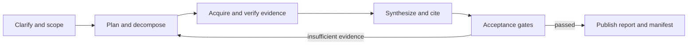
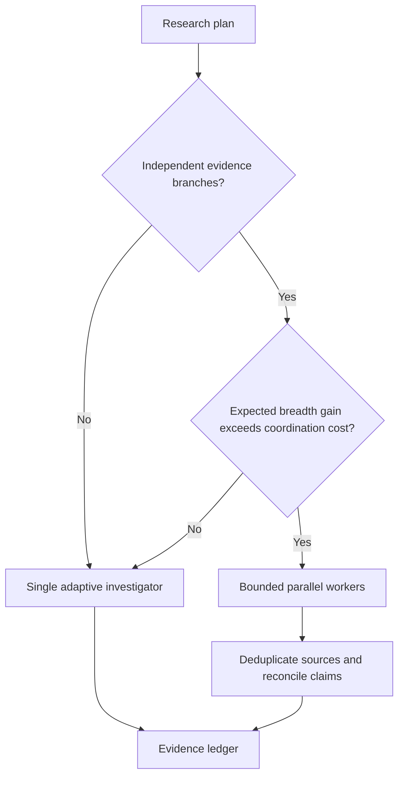
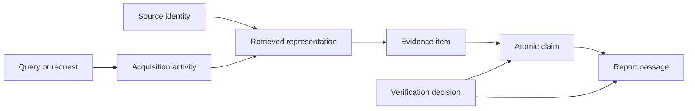
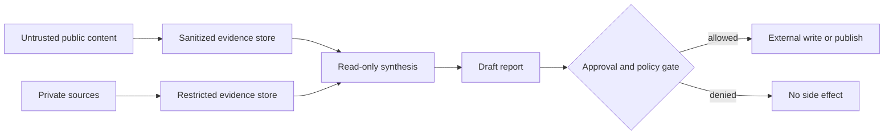

# Deep-Research Agent Blueprint: Research Packet

> **Status:** Active research packet  
> **Research date:** 2026-08-31  
> **Scope:** Architecture, retrieval, evidence, citations, state, security, reliability, evaluation, and implementation choices for a production deep-research agent  
> **Method:** Primary-source-led web research, cross-checked across provider documentation, standards, peer-reviewed papers, benchmark repositories, security guidance, and workflow-runtime documentation

This packet records the evidence and decisions behind the deep-research agent blueprint. It is not a link dump or a market survey. Its purpose is to make the blueprint's recommendations auditable, show where the evidence conflicts, and preserve the volatile facts that future maintainers should re-check.

## Guides Supported

- [Blueprint overview](../../agents/deep-research-agent/README.md)
- [Requirements and threat model](../../agents/deep-research-agent/requirements-and-threat-model.md)
- [Architecture and stack selection](../../agents/deep-research-agent/architecture-and-stack-selection.md)
- [Connectors and provider qualification](../../agents/deep-research-agent/connectors-and-provider-qualification.md)
- [Research loop and source acquisition](../../agents/deep-research-agent/research-loop-and-source-acquisition.md)
- [Evidence, citations, and verification](../../agents/deep-research-agent/evidence-citations-and-verification.md)
- [State, context, and artifacts](../../agents/deep-research-agent/state-context-and-artifacts.md)
- [Security, permissions, and isolation](../../agents/deep-research-agent/security-permissions-and-isolation.md)
- [Reliability, observability, and operations](../../agents/deep-research-agent/reliability-observability-and-operations.md)
- [Evaluation and acceptance testing](../../agents/deep-research-agent/evaluation-and-acceptance-testing.md)
- [Implementation blueprint](../../agents/deep-research-agent/implementation-blueprint.md)
- [Worked cases, exercises, and runbooks](../../agents/deep-research-agent/worked-cases-exercises-and-runbooks.md)

## Research Questions

The research was organized around decisions the implementation must make, not around vendor feature lists:

1. What distinguishes a deep-research agent from ordinary retrieval-augmented generation?
2. Which responsibilities belong to deterministic application code, an LLM, a workflow runtime, or parallel workers?
3. When does multi-agent fan-out improve results enough to justify its cost and coordination risk?
4. How should search, browsing, document parsing, and iterative query reformulation interact?
5. What evidence and provenance must be stored so that a report can be verified later?
6. How should citation correctness, citation completeness, source quality, and claim correctness be evaluated separately?
7. How should corrections, retractions, freshness, and conflicting sources affect conclusions?
8. What state belongs in model context, durable workflow state, an evidence ledger, or an artifact store?
9. Which threats are unique or amplified when an agent reads untrusted pages and can also access private data or tools?
10. How should long-running jobs handle retries, cancellation, partial results, and external side effects?
11. Which evaluation design catches both answer-quality failures and unsafe or unreliable trajectories?
12. Which current platform and runtime details are sufficiently stable to recommend, and which should remain configurable?
13. How do search, browser, database, document, paper, dataset, archive, and enterprise connectors differ in coverage, pagination, access, rights, capture, correction, and deletion semantics?
14. Which controls belong to each of the seven memory lifetimes, and how can compaction prove continuity without pretending it is lossless?
15. How should a source correction, permission loss, license change, or deletion propagate through evidence, memory, claims, artifacts, and destinations?
16. What operational design is needed for behavior bundles, regional/tenant isolation, backpressure, disaster recovery, recovery load, drift, and controlled failure mining?

## Search Breadth and Selection Method

Research proceeded in several passes:

1. **Capability baseline:** official deep-research product/API documentation from OpenAI and Google, plus Anthropic's published multi-agent research architecture.
2. **Retrieval and reasoning:** ReAct, WebGPT, IRCoT, draft-and-revise research, and benchmark definitions.
3. **Evidence quality:** ALCE, FActScore, SAFE/LongFact, DeepResearch Bench, Deep Research Bench, Crossref correction metadata, W3C provenance, web archiving, and HTTP caching.
4. **Security:** provider system cards, OWASP guidance, MCP authorization/security material, and NIST generative-AI risk guidance.
5. **Operations:** durable workflow and retry semantics, trace propagation, context engineering, and production evaluation practice.
6. **Runtime baseline:** official Python, Node.js, TypeScript, and protocol release sources checked on the research date.
7. **Connector qualification:** current official API references and terms for Brave Search, Playwright, PostgreSQL, BigQuery, Crossref, OpenAlex, PubMed, Semantic Scholar, Zenodo, Dataverse, Common Crawl, Google Drive, Microsoft Graph, Confluence, and OpenAI managed deep research.
8. **Lifecycle and operations refinement:** primary change-feed, pagination, access, regional, retention, and correction/deletion semantics translated into fixtures, manifests, recovery tests, and release gates.

Primary sources were preferred. Provider claims about provider systems were retained only as evidence of the documented design or as vendor-reported measurements; they were not promoted to universal laws. Sources that were mainly promotional, duplicated a primary source, lacked enough methodological detail, or described superseded APIs were excluded from the blueprint.

## Finding 1: Deep Research Is a Long-Running Evidence-Production Process

The strongest current systems do more than retrieve passages and answer once. They plan, search repeatedly, inspect sources, update their working hypotheses, and produce a report with citations. OpenAI's API guide treats deep research as a potentially long-running background operation and explicitly notes that the API does not perform the product's clarification and prompt-rewriting steps for the developer. Google's Deep Research agent likewise exposes planning and background execution rather than a single synchronous model call.

This implies an application contract with at least four explicit phases:

The important boundary is between **researching** and **writing**. If prose is drafted before the evidence ledger is coherent, unsupported statements become hard to detect because the draft itself starts influencing later searches. Drafting can be iterative, but every material claim still needs an independently inspectable evidence path.

**Sources:** [OpenAI deep research guide](https://developers.openai.com/api/docs/guides/deep-research), [Gemini Deep Research agent](https://ai.google.dev/gemini-api/docs/deep-research), [Google test-time diffusion deep researcher](https://research.google/blog/deep-researcher-with-test-time-diffusion/), [WebGPT](https://arxiv.org/abs/2112.09332).

## Finding 2: A Hybrid Controller Is the Best Default

The evidence does not support making either a completely fixed pipeline or a fully autonomous LLM loop the universal default.

- A fixed pipeline gives predictable permissions, retry boundaries, budgets, and acceptance gates, but cannot enumerate all useful searches before evidence is seen.
- An adaptive model can reformulate queries and recognize information gaps, but it is weak at guaranteeing invariants such as maximum fan-out, deterministic idempotency keys, mandatory citation checks, or isolation boundaries.
- A durable workflow runtime can recover long jobs and time out activities, but it does not decide whether a source actually resolves a disputed claim.

The selected design therefore gives deterministic code authority over lifecycle, policy, state transitions, budgets, and publication. The model proposes plans, queries, claim decompositions, and synthesis. A workflow runtime is optional at low scale and becomes valuable when jobs must survive process failure, run for many minutes, or coordinate retried activities.

| Responsibility | Preferred owner | Reason |
|---|---|---|
| Clarification and acceptance contract | Application plus model | Product policy is deterministic; ambiguity resolution benefits from language understanding |
| Query generation and replanning | Model | Depends on evidence discovered during the run |
| Permission checks and trust-zone routing | Deterministic policy code | Must not be bypassable by generated instructions |
| Fetch, parse, snapshot, hash | Tool services | Needs bounded I/O and reproducible artifacts |
| Evidence assessment | Model plus validators | Semantic judgment and machine-checkable invariants are both required |
| Retry, timeout, cancellation | Application or workflow runtime | Operational behavior must be explicit |
| Publication | Deterministic acceptance gate | A plausible draft is not proof that requirements passed |

**Sources:** [Anthropic, building effective agents](https://www.anthropic.com/research/building-effective-agents), [Anthropic multi-agent research system](https://www.anthropic.com/engineering/multi-agent-research-system), [Temporal workflow execution](https://docs.temporal.io/workflow-execution), [ReAct](https://arxiv.org/abs/2210.03629).

## Finding 3: Multi-Agent Research Is a Conditional Optimization

Anthropic reports that its orchestrator-worker research system substantially outperformed its single-agent baseline on an internal breadth-oriented evaluation. The same engineering report says multi-agent systems used approximately fifteen times the tokens of ordinary chat interactions and describes coordination, delegation, and production rollout difficulties. This is useful evidence that parallel workers can improve breadth, but not that all deep-research tasks should use them.

Parallel workers are justified when subquestions are genuinely independent, the result benefits from broad coverage, sources are numerous, and the budget can absorb duplicate work. A single adaptive investigator is usually better for tightly coupled reasoning, small source sets, private-data tasks with narrow permissions, or latency- and cost-sensitive jobs.

The blueprint consequently uses a routing decision instead of a permanent multi-agent topology:

The vendor-reported improvement is not used as a general expected uplift. The only production-safe way to choose the threshold is to measure marginal verified evidence, quality, latency, and cost on the application's own workload.

**Sources:** [Anthropic multi-agent research system](https://www.anthropic.com/engineering/multi-agent-research-system), [Anthropic context engineering](https://www.anthropic.com/engineering/effective-context-engineering-for-ai-agents).

## Finding 4: Search Results Are Leads, Not Evidence

Search snippets can be truncated, stale, detached from qualifications, or generated from text that no longer appears on the page. They are useful for discovery and query reformulation, not as the final evidentiary object. The agent should open the source, select the exact supporting passage or structured field, capture source metadata, and record the retrieval time.

IRCoT and ReAct support interleaving retrieval with reasoning instead of treating retrieval as a single front-loaded stage. Google's draft-and-revise research work similarly uses iterative search to challenge and improve a working answer. The blueprint translates that pattern into a bounded loop with explicit gap analysis and stopping rules.

Recommended acquisition order:

1. Search or query a trusted index.
2. Open candidate sources rather than citing snippets.
3. Prefer the original document, official repository, standard, paper, or first-party dataset.
4. Extract a bounded passage or structured record with location information.
5. Store a snapshot or content hash when policy permits.
6. Record failed, blocked, and excluded candidates, not only successes.
7. Replan from unresolved claim gaps and contradictions.

Robots exclusion is a crawler communication protocol, not an authorization mechanism. It should be respected where applicable, while authentication, licensing, terms, rate limits, and data-handling policy remain separate controls. HTTP validators and cache directives can reduce unnecessary refetching, but a cached representation needs its own capture time and validator metadata.

**Sources:** [IRCoT](https://aclanthology.org/2023.acl-long.557/), [ReAct](https://arxiv.org/abs/2210.03629), [RFC 9309: Robots Exclusion Protocol](https://www.rfc-editor.org/rfc/rfc9309.html), [RFC 9111: HTTP Caching](https://www.rfc-editor.org/rfc/rfc9111.html), [Library of Congress WARC description](https://www.loc.gov/preservation/digital/formats/fdd/fdd000236.shtml).

## Finding 5: Provenance Must Be a First-Class Data Model

A URL alone is insufficient provenance. Pages change, PDFs are revised, database results depend on query parameters, and the same URL may serve different content. W3C PROV supplies a useful conceptual separation among entities, activities, and agents. For a research system, a practical minimum record associates:

- the source identity and canonical locator;
- the retrieved representation, content hash, and capture time;
- the retrieval activity, tool, parameters, and authorization context class;
- an extracted evidence span or structured result and its location;
- the claim or question the evidence supports, contradicts, or contextualizes;
- the transformation chain from evidence through synthesis to report;
- policy and quality assessments without treating them as immutable truth.

The ledger should remain durable even when the model's context is compacted. This enables later citation repair, changed-source detection, audit, and targeted re-verification without rerunning the entire investigation.

**Sources:** [W3C PROV-O](https://www.w3.org/TR/prov-o/), [Library of Congress WARC description](https://www.loc.gov/preservation/digital/formats/fdd/fdd000236.shtml), [OpenAI deep research guide](https://developers.openai.com/api/docs/guides/deep-research).

## Finding 6: Citation Quality Is Multi-Dimensional

Citation presence is not citation correctness. A report can contain many links while still failing in several different ways:

| Dimension | Question |
|---|---|
| Entailment | Does the cited evidence actually support the nearby claim? |
| Completeness | Are all externally verifiable material claims supported? |
| Placement | Is it clear which claim each citation supports? |
| Source quality | Is the source appropriate for this type of claim? |
| Source independence | Are apparently multiple sources actually repeating one origin? |
| Freshness | Was the evidence current enough at the report's as-of time? |
| Quote fidelity | Does quoted text match the captured representation and location? |
| Claim correctness | Is the claim true after considering the whole evidence set, including conflicts? |

ALCE made citation correctness and completeness explicit evaluation targets for long-form generation. FActScore and SAFE/LongFact decompose long-form answers into atomic factual claims, which is useful for coverage and correctness assessment. DeepResearch Bench adds report-level and citation-level dimensions specifically for long-form research. None of these alone proves production readiness: evaluators may disagree, automated judges can be biased, and source authority depends on the claim.

The blueprint therefore uses a claim-evidence matrix and deterministic checks before semantic judging. Missing source identifiers, invalid locations, changed quote hashes, uncited high-risk claims, or inaccessible artifacts should fail mechanically. Entailment, contradiction, and source suitability require semantic review or calibrated evaluators.

**Sources:** [ALCE repository](https://github.com/princeton-nlp/ALCE), [FActScore](https://aclanthology.org/2023.emnlp-main.741/), [LongFact and SAFE](https://deepmind.google/research/publications/85420/), [DeepResearch Bench](https://arxiv.org/abs/2506.11763).

## Finding 7: Source Quality Is Claim-Specific, Not a Single Global Score

An official source is normally strongest for its own API behavior, policy, or release status, but it may be weak evidence for comparative performance. A peer-reviewed paper can be strong for a precisely described experiment but stale for a rapidly changing product. A reputable secondary source can synthesize a field well but should not replace the original standard or dataset when that is available.

The system should therefore store separate dimensions such as authority, directness, methodological transparency, recency, independence, and correction status. A policy then applies weights or hard requirements based on claim type. For example:

- current API behavior requires current official documentation;
- performance claims require a reproducible method, dates, hardware/model versions, and preferably independent validation;
- legal or compliance claims require qualified authoritative sources and human review;
- claims about a provider's internal architecture can cite its engineering report but must be labeled provider-reported;
- news or rapidly changing events need publication time, event time, and independent corroboration.

Correction and retraction checks should be part of evidence maintenance for scholarly sources. Crossref documents `updated-by` metadata and production data routes for corrections, updates, and retractions. The blueprint uses such metadata as a signal, not as a claim that every publisher supplies complete correction data.

**Sources:** [Crossref, retractions and post-publication updates](https://www.crossref.org/documentation/retrieve-metadata/retractions-and-post-publication-updates/), [Crossmark](https://www.crossref.org/services/crossmark/), [NIST AI 600-1](https://doi.org/10.6028/NIST.AI.600-1).

## Finding 8: Contradiction and Freshness Need Explicit State

Research systems should not silently collapse conflicting sources into a confident average. Contradictions may result from different definitions, jurisdictions, cohorts, dates, versions, or genuinely unresolved evidence. The ledger needs relations such as supports, contradicts, narrows, supersedes, and duplicates, plus an adjudication note that explains the resolution.

Every report should carry an **as-of time** and identify volatile claims. A freshness policy can use claim-specific maximum ages, source validators, release feeds, or event-time checks. Re-running only the stale or contradicted portions is more efficient and auditable than regenerating the whole report.

The safe output when high-impact evidence remains unresolved is an explicit disagreement with bounded conclusions—not fabricated certainty. The acceptance gate should allow a report to publish uncertainty when the task permits it, while blocking claims that the user required to be decisive.

**Sources:** [Crossref post-publication updates](https://www.crossref.org/documentation/retrieve-metadata/retractions-and-post-publication-updates/), [W3C PROV-O](https://www.w3.org/TR/prov-o/), [NIST AI 600-1](https://doi.org/10.6028/NIST.AI.600-1).

## Finding 9: Long Context Is Not Durable Memory

Larger context windows reduce some truncation pressure but do not eliminate position effects, distraction, duplicate evidence, or recovery requirements. The Lost in the Middle results showed that relevant information can be used less reliably when placed in the middle of long contexts. Anthropic's context-engineering guidance similarly treats context as a finite resource requiring selection and compaction.

The selected architecture separates four stores:

1. **Working context:** a small, current packet of goals, plan state, open questions, and selected evidence.
2. **Durable workflow state:** lifecycle, budgets, attempts, leases, approvals, and cancellation state.
3. **Evidence ledger:** normalized claims, sources, representations, spans, relationships, and verification decisions.
4. **Artifact store:** raw or normalized captures, parsed documents, tables, reports, and manifests.

Compaction produces a derived working summary; it never deletes the evidence of record. Model conversations are diagnostic traces, not the authoritative database.

**Sources:** [Lost in the Middle](https://aclanthology.org/2024.tacl-1.9/), [Anthropic context engineering](https://www.anthropic.com/engineering/effective-context-engineering-for-ai-agents), [W3C PROV-O](https://www.w3.org/TR/prov-o/).

## Finding 10: Untrusted Content Creates a Cross-Tool Security Problem

Provider system cards and API guidance identify indirect prompt injection as a central risk for browsing agents. A page can contain instructions designed to alter the agent's behavior. The danger becomes materially larger if the same context can access private connectors, secrets, code execution, arbitrary URLs, or write-capable tools.

OpenAI's guidance recommends separating public-web research from private-data research and using trusted MCP servers. The system card describes constraints around arbitrary URL access. OWASP SSRF guidance supports network egress allowlisting and URL validation, while OWASP's excessive-agency guidance supports minimizing permissions and requiring human approval for consequential actions.

The blueprint applies these findings through trust zones:

Important consequences:

- Treat page instructions as data, never as authority.
- Do not place public-web content, private credentials, and write-capable tools in one unconstrained agent context.
- Validate URLs after redirects and block private, loopback, link-local, metadata, and disallowed address ranges.
- Keep retrieval read-only by default and isolate code or document processing.
- Redact sensitive values before tracing or model calls.
- Require a separate authorization decision for external writes; “the model decided” is not authorization.

**Sources:** [OpenAI deep research guide](https://developers.openai.com/api/docs/guides/deep-research), [OpenAI deep research system card](https://cdn.openai.com/deep-research-system-card.pdf), [OWASP SSRF Prevention Cheat Sheet](https://cheatsheetseries.owasp.org/cheatsheets/Server_Side_Request_Forgery_Prevention_Cheat_Sheet.html), [OWASP LLM06: Excessive Agency](https://genai.owasp.org/llmrisk/llm062025-excessive-agency/), [Model Context Protocol specification](https://modelcontextprotocol.io/specification/2025-03-26).

## Finding 11: Durability Does Not Mean Exactly-Once Effects

Workflow runtimes can persist orchestration state and retry activities, but an external request may succeed even when its acknowledgement is lost. Retrying such an activity can duplicate a charge, message, upload, or database write. Temporal's documentation makes workflow and retry behavior explicit; the application still has to design idempotent activities and reconcile ambiguous outcomes.

For a deep-research agent:

- retrieval activities should use stable request identities and content-addressed capture where possible;
- artifact writes should be upserts or compare-and-swap operations keyed by run and artifact identity;
- model calls need an attempt record so an unknown outcome is not confused with a confirmed failure;
- publication and notification should use idempotency keys and durable outboxes;
- retries need bounded attempts, backoff, and error classification;
- cancellation must propagate to fan-out workers and preserve partial evidence;
- lease expiry needs fencing tokens or equivalent stale-writer protection;
- the final state should distinguish complete, incomplete, cancelled, rejected, and failed.

The system can promise durable orchestration and deduplicated effects under stated conditions. It should not claim universal exactly-once execution.

**Sources:** [Temporal workflow execution](https://docs.temporal.io/workflow-execution), [Temporal retry policies](https://docs.temporal.io/encyclopedia/retry-policies), [OpenTelemetry context](https://opentelemetry.io/docs/concepts/context-propagation/).

## Finding 12: Evaluation Must Cover the Artifact and the Trajectory

BrowseComp measures hard-to-find factual browsing tasks; Deep Research Bench uses a frozen historical corpus for reproducibility; DeepResearch Bench evaluates long-form reports and citations. These measure different capabilities. A production test program needs more than one benchmark and must add application-specific cases.

Recommended layers:

| Layer | What it catches | Example measures |
|---|---|---|
| Deterministic unit/contract tests | Broken schemas and invariants | state transitions, URL policy, citation resolvability, hash fidelity |
| Tool and parser tests | Retrieval and extraction errors | redirects, PDFs, tables, encoding, timeouts, partial responses |
| Frozen-corpus research tests | Regressions with reproducible evidence | recall, claim correctness, citation entailment, cost |
| Adversarial security tests | Unsafe trajectories | indirect injection, SSRF, secret requests, cross-zone exfiltration |
| Live-web canaries | Drift and operational realism | stale links, current answers, latency, source availability |
| Human review | Nuance and usefulness | synthesis, uncertainty, source suitability, decision value |

Web-enabled evaluations can themselves become contaminated. Anthropic reported examples of an agent recognizing BrowseComp items and, in some cases, finding or reconstructing benchmark answers online. This does not invalidate web benchmarks, but it means evaluators must inspect trajectories, rotate private cases, and separate benchmark recognition from legitimate research.

The core quality score should not be a single opaque average. Production gates should include hard safety and evidence-integrity failures, with softer metrics for usefulness, coverage, latency, and cost. Cost is best normalized per accepted report or verified claim, not merely per token.

**Sources:** [BrowseComp](https://openai.com/index/browsecomp/), [Deep Research Bench](https://arxiv.org/abs/2506.06287), [DeepResearch Bench](https://arxiv.org/abs/2506.11763), [Anthropic BrowseComp eval-awareness analysis](https://www.anthropic.com/engineering/eval-awareness-browsecomp), [Anthropic agent evaluations](https://www.anthropic.com/engineering/demystifying-evals-for-ai-agents).

## Finding 13: Connector Semantics Are Part of the Evidence Contract

The research confirmed that a generic `search(query) -> text` abstraction loses correctness-critical behavior:

- Brave Web Search pages with `count`/`offset`, can overlap results, and exposes `more_results_available`; its terms updated 2026-02-11 restrict storage/caching, redistribution, and AI training/evaluation use of Search Results.
- Crossref cursors are the recommended deep-pagination route and the current API says they expire after five minutes; Crossref records are metadata/status signals, not a full-text license.
- OpenAlex's current documentation limits supported page size to 100 and basic paging to 10,000 before cursor paging; it directs bulk users to snapshots and declares OpenAlex data CC0 while linked content can have separate rights.
- NCBI documents different E-utilities request rates with/without API keys and asks bulk clients to use Entrez History/batching; PubMed abstracts can be copyrighted.
- Zenodo exposes record versions, recommends OAI-PMH/dumps for bulk, and publishes a deleted-record dump; Dataverse distinguishes exact dataset versions, restricted/embargoed/deaccessioned files, and `:latest` resolution that can differ with privileged draft access.
- Google Drive Changes exposes page/start tokens and removals; Microsoft Drive delta can repeat items and reports latest state rather than every intermediate change; Confluence REST v2 uses opaque cursor links.
- Common Crawl indexes periodic WARC captures, not “the live web,” and its terms state crawled content can remain subject to source-owner terms.
- A browser context improves dynamic-page fidelity but does not grant permission to bypass robots, authentication, terms, paywalls, or licensing.

The application therefore needs a versioned adapter capability manifest with query syntax, coverage, pagination, freshness clock, access, rights/retention, capture fidelity, correction/deletion, quotas, security, and qualification expiry. Discovery results remain leads unless an exact representation or structured result is captured under an allowed policy.

This also resolves an apparent conflict: retaining a reproducible evidence package is desirable, but provider terms or source rights may prohibit retaining some search results or full content. Reproducibility must be rights-aware. The manifest records governed hashes/validators/receipts and explicit omissions rather than illegally copying content.

**Sources:** [Brave Web Search API](https://api-dashboard.search.brave.com/app/documentation/web-search/get-started), [Brave Search API Terms](https://api-dashboard.search.brave.com/documentation/resources/terms-of-service), [Crossref REST API](https://api.crossref.org/), [OpenAlex paging](https://help.openalex.org/api/paging/), [OpenAlex API authentication](https://help.openalex.org/api/authentication/), [NCBI E-utilities](https://www.ncbi.nlm.nih.gov/books/NBK25497/), [Zenodo developers](https://developers.zenodo.org/), [Dataverse 6.11 API](https://guides.dataverse.org/en/latest/api/), [Common Crawl Get Started](https://commoncrawl.org/get-started), [Google Drive Changes](https://developers.google.com/workspace/drive/api/reference/rest/v3/changes/list), [Microsoft Graph Drive delta](https://learn.microsoft.com/en-us/graph/api/driveitem-delta?view=graph-rest-1.0), [Confluence REST v2](https://developer.atlassian.com/cloud/confluence/rest/v2/intro/).

## Finding 14: Memory Needs Seven Explicit Lifetimes and Loss-Aware Compaction

The blueprint originally distinguished context, run state, evidence, and artifacts, but implementation readiness requires explicit policy across seven lifetimes:

1. turn/scratch;
2. working/run;
3. session;
4. durable workflow/task;
5. domain knowledge;
6. long-term/preference;
7. episodic/outcome.

Each needs separate admission, retrieval, retention, correction/deletion, and poisoning controls. Telemetry is not an additional memory; it is an operational signal and must not become an implicit prompt store.

Promotion is a durable effect. A reviewed task claim may enter domain knowledge only with provenance, authorization/tenant scope, source status, rights, freshness/TTL, poisoning checks, and a deletion route. A user preference may affect formatting but can never become factual authority. Reviewed incident outcomes may enter held-out evaluations, while raw private trajectories should not.

Compaction cannot honestly promise to be lossless. It can promise **loss-aware continuity**: flush authoritative state, enumerate required IDs/revisions/budgets/approvals/in-flight operations, record what scratch material was deliberately omitted, hash the before/flushed/rehydrated reference sets, and fail closed on unresolved loss. Injected compaction tests must surround evidence acceptance, contradiction, approval, cancellation, budget reservation, and external effects.

**Sources:** [Lost in the Middle](https://aclanthology.org/2024.tacl-1.9/), [Anthropic context engineering](https://www.anthropic.com/engineering/effective-context-engineering-for-ai-agents), [W3C PROV-O](https://www.w3.org/TR/prov-o/), [Temporal workflow execution](https://docs.temporal.io/workflow-execution).

## Finding 15: Corrections and Deletions Must Propagate Through Lineage

Provider change/status mechanisms differ, but the application needs one domain process. A source event—content change, correction, retraction, deaccession, permission loss, rights change, or deletion—must traverse:

`source → representation → evidence span/edge → claim/contradiction → memory → artifact statement/citation → artifact revision → destination`.

The process fences new use immediately, then gives every descendant a terminal policy disposition such as reverify, supersede, invalidate, redact, tombstone, cryptographically erase, legal hold, or no impact. It closes only after effect reconciliation and feed-watermark continuity. Otherwise an organization can delete the raw source while leaving a poisoned summary, embedding, cached result, evaluation sample, or published artifact active.

Crossref/Crossmark and retraction data are useful scholarly signals but not complete universal registries. Google Drive and Microsoft Graph change feeds carry different removal/permission semantics. Zenodo's deleted-record dump and Dataverse deaccession supply repository signals. No single provider feed proves all descendants have been handled; the application lineage graph does.

**Sources:** [Crossref post-publication updates](https://www.crossref.org/documentation/retrieve-metadata/retractions-and-post-publication-updates/), [Crossmark](https://www.crossref.org/services/crossmark/), [Google Drive Changes](https://developers.google.com/workspace/drive/api/reference/rest/v3/changes/list), [Microsoft Graph Drive delta](https://learn.microsoft.com/en-us/graph/api/driveitem-delta?view=graph-rest-1.0), [Zenodo developers](https://developers.zenodo.org/), [Dataverse API](https://guides.dataverse.org/en/latest/api/), [W3C PROV-O](https://www.w3.org/TR/prov-o/).

## Finding 16: Production Evolution and Recovery Operate on Complete Behavior Bundles

A research system's behavior is the combination of schemas, controller, prompts, model routes, adapters, parsers/OCR, policies, memory/compaction, verifier/graders, and renderer. Changing several independently under floating aliases makes regressions unattributable and frozen artifacts hard to reproduce. The release unit should be an immutable behavior bundle.

Shadow runs compare behavior without external effects. Canaries should be stratified by task class, source zone, tenant risk, region/language, and publication authority. Rollback thresholds cover claim support, required coverage, contradiction/citation correctness, security, cost/latency, and correction propagation; rollback restores the prior compatible bundle rather than an untested mixture.

Regional and tenant isolation extend through database rows, object storage, queues, caches/indexes, provider credentials/jobs, telemetry, backups, and failover. Current Microsoft documentation notes a region requirement for SharePoint search with application permissions; BigQuery result retrieval also uses job location in specified cases. The blueprint cannot promise residency that a provider does not expose contractually.

Disaster recovery must exercise recovery load, not only restore backups. Replayed outboxes, provider polling, object verification, cold caches, overdue source checks, correction backlogs, and queued new research compete for quotas. Reserved reconciliation/correction capacity, priority queues, and tested drain-time/RPO/RTO are therefore part of correctness.

Finally, production failures are valuable only after governed transformation into de-identified, reviewed, uncontaminated fixtures. Training/tuning on the same incident artifact used for release grading creates a false regression signal.

**Sources:** [Microsoft Graph application-permission search](https://learn.microsoft.com/en-us/graph/search-concept-searchall), [BigQuery `jobs.getQueryResults`](https://cloud.google.com/bigquery/docs/reference/rest/v2/jobs/getQueryResults), [PostgreSQL transaction characteristics](https://www.postgresql.org/docs/current/sql-set-transaction.html), [Temporal workflow execution](https://docs.temporal.io/workflow-execution), [OpenTelemetry context propagation](https://opentelemetry.io/docs/concepts/context-propagation/), [Anthropic agent evaluations](https://www.anthropic.com/engineering/demystifying-evals-for-ai-agents).

## Architecture Options Compared

| Option | Strengths | Main failure modes | Suitable use | Blueprint decision |
|---|---|---|---|---|
| One model call with search | Lowest implementation cost | Weak recovery, shallow search, unverifiable state | Low-risk summaries | Not a production deep-research architecture |
| Single adaptive agent loop | Coherent reasoning, low coordination overhead | Loop drift, weak deterministic guarantees | Default investigator for coupled work | Use inside a controlled lifecycle |
| Fixed deterministic pipeline | Reproducible, easy to test | Cannot adapt well to discovered gaps | Bounded, known source workflows | Use for lifecycle and gates, not all reasoning |
| Orchestrator plus parallel workers | Broad coverage and latency reduction | High token cost, duplication, integration failures | Independent branches with sufficient budget | Activate conditionally with fan-out limits |
| Durable workflow plus adaptive workers | Recovery, retries, visibility, adaptive research | More infrastructure and versioning discipline | Long-running or high-value production work | Target architecture when operational need justifies it |
| Fully managed research agent | Fastest product integration | Provider-specific limits, preview behavior, reduced control | Teams accepting vendor boundary | Valid adapter, not the domain model |

## Important Contradictions and Resolutions

| Tension in the evidence | Why both sides can be true | Resolution used in the blueprint |
|---|---|---|
| Multi-agent research improves breadth; multi-agent research is expensive and hard to coordinate | Parallel independent searches increase coverage but also duplicate work and enlarge the integration surface | Default to one investigator; fan out only when a plan exposes independent branches and a measured benefit |
| Fixed workflows are reproducible; adaptive agents find evidence that was not predictable in advance | Lifecycle invariants and research choices have different uncertainty | Deterministic outer workflow, adaptive inner research loop |
| Huge context windows hold more evidence; long contexts still degrade recall and focus | Capacity is not the same as reliable use or durable recovery | Keep typed durable state and assemble small task-specific context packets |
| Citations make answers auditable; citation count does not prove truth | Links expose a path, but can be irrelevant, low-quality, stale, or copied | Evaluate entailment, completeness, placement, authority, independence, freshness, and claim correctness separately |
| Frozen web corpora are reproducible; live-web tests reflect production | Reproducibility and ecological validity optimize for different goals | Maintain both frozen regression suites and live canaries |
| Managed deep-research services reduce engineering effort; application guarantees remain the developer's responsibility | Providers supply research behavior but differ in planning, retention, tool support, preview status, and security boundaries | Put providers behind adapters and keep acceptance, evidence, permissions, and run state application-owned |
| One source-quality score simplifies ranking; source fitness depends on the claim | Authority, directness, independence, and recency are not interchangeable | Store dimensions and apply claim-type policy rather than a universal scalar |
| Read-only browsing sounds safe; read-only content can still redirect an agent toward data exfiltration | The side effect occurs through another tool or network request | Separate trust zones and prohibit privilege composition in one unconstrained context |
| Durable workflows recover failures; external activities cannot always be exactly once | A lost acknowledgement makes success ambiguous | Idempotency keys, outboxes, reconciliation, attempt records, and honest guarantees |
| Search benchmarks show retrieval capability; a useful research report needs long-form synthesis and evidence coverage | Short-answer retrieval and report construction are different tasks | Combine browsing, report, citation, trajectory, security, and domain-specific evaluations |
| Two 2025 benchmarks have almost identical names | “Deep Research Bench” and “DeepResearch Bench” were authored independently and evaluate different artifacts | Always link and describe the specific benchmark rather than referring to the name alone |
| Official TypeScript pages disagreed on the latest major version on the research date | Release propagation and web content can be temporarily inconsistent | Avoid an exact TypeScript recommendation here; pin and test a project toolchain instead of resolving “latest” by assumption |

## Claims Deliberately Narrowed or Excluded

The following statements were not promoted into general recommendations:

- **“Multi-agent is 90.2% better.”** Anthropic reports this result for an internal research evaluation and architecture. The blueprint records the direction and cost trade-off, not a transferable uplift.
- **“A particular provider is best at deep research.”** Public benchmarks change quickly, contamination is possible, and product/API behavior differs. Provider selection must use a private workload evaluation.
- **“Citations eliminate hallucinations.”** Citations can be irrelevant or incomplete; claim-level verification remains necessary.
- **“A long context window replaces retrieval or memory.”** Available evidence does not support that guarantee.
- **“Robots.txt grants or denies access.”** RFC 9309 explicitly separates the protocol from access authorization.
- **“A workflow engine provides exactly-once external actions.”** Durable replay and retries do not remove ambiguous external outcomes.
- **“Every correction or retraction appears in Crossref metadata.”** Crossref is useful infrastructure, but metadata coverage depends on publishers and deposits.
- **“LLM-as-judge scores are objective.”** Automated graders are useful at scale but require calibration, disagreement analysis, and human review.
- **“A preview managed-agent API is a stable long-term contract.”** Preview features and restrictions must be verified at integration time.

## Version and Volatility Baseline

These facts were checked on 2026-08-31. They are included to help future maintainers know what should be refreshed, not to force an implementation to use every listed version.

| Component or capability | Observed state on research date | Blueprint consequence | Refresh trigger |
|---|---|---|---|
| OpenAI deep research API | Official guide documents background execution, web search/MCP use, citations, and developer-owned clarification | Treat it as a provider adapter, preserve application-owned planning contract and evidence ledger | Model, tool, retention, or security-guide change |
| OpenAI retention details | Official guide says background mode retains response data for roughly 10 minutes and is incompatible with ZDR; `store=true` is logged for 30 days unless ZDR | Qualify provider/background mode per tenant data policy and reconcile by response ID | Retention, ZDR, background, or store behavior change |
| Gemini Deep Research agent | Official guide described a preview, asynchronous agent with planning and documented limitations | Do not make preview-specific fields the domain schema | General availability or API contract change |
| Anthropic multi-agent research | Public engineering report describes an orchestrator-worker production system and high relative token use | Use as a design case study, not a universal topology | New architecture or independent replication |
| MCP | Specification snapshot dated 2025-03-26 was reviewed | Pin protocol/client versions and trust servers explicitly | Authorization or tool-security specification change |
| OpenTelemetry | Current context-propagation documentation was reviewed | Use trace/run correlation, but keep sensitive data out of baggage | Semantic-convention or SDK support change |
| Python | Python.org listed 3.14.7 as current stable | Use a supported project-pinned runtime; do not encode a minor version in the architecture | Supported-version or dependency compatibility change |
| Node.js | Node 24 was LTS; Node 26 was current | Prefer an LTS line for production unless a dependency requires otherwise | LTS transition |
| TypeScript | Official release and homepage content were not internally consistent about the latest major release | Pin a tested compiler version and verify documentation for that exact version | Toolchain selection or consistency restored |
| Crossref update metadata | Production guidance recommends work metadata/update relations; older Labs paths are not the production basis | Use supported production metadata routes and store last-checked time | Schema, dataset, or service guidance change |
| Brave Web Search | Web API uses bounded offset pages and rate-limit headers; terms last updated 2026-02-11 restrict retention/redistribution and AI training/evaluation use of Search Results | Use for discovery only under contract; fetch/capture sources separately | Terms, pagination, rate, or result-retention change |
| OpenAlex | Help pages updated 2026-08-11 through 2026-08-19 document page size 100, 10,000 basic-paging limit, cursor/snapshot routes, usage budgets, and CC0 data | Pin API route/manifest; distinguish metadata from linked content rights | Pricing, license, paging, snapshot, or freshness change |
| Google Drive Changes | Reference updated 2026-07-07 documents page/start tokens, removal behavior, and scopes | Maintain provider cursor out of model context; propagate access/deletion | Token, scope, delta, permission, or region change |
| Dataverse | 6.11 API guide updated 2026-07-01 documents versioned datasets/files and access states | Pin exact dataset/file version/checksum and license/access | API version, deaccession, license, or pagination change |
| BigQuery queries | Query guide updated 2026-08-27 and result API updated 2026-05-30 document dry run, job/location, page token, completion, bytes, and cache fields | Use read-only governed jobs and capture exact structured-result identity | API, quota, pricing, job, or residency change |
| Common Crawl | Current Get Started page lists periodic crawls through `CC-MAIN-2026-34` | Treat archive as incomplete historical evidence; pin crawl/WARC coordinates | Crawl release, index API, terms, or redaction behavior change |

Runtime sources: [Python downloads](https://www.python.org/downloads/), [Node.js releases](https://nodejs.org/en/about/previous-releases), [TypeScript release notes](https://www.typescriptlang.org/docs/handbook/release-notes/typescript-6-0.html), [TypeScript homepage](https://www.typescriptlang.org/).

## Decision Record

The resulting blueprint adopts the following production defaults:

1. Start from an explicit research contract with scope, as-of time, deliverable, risk class, and acceptance criteria.
2. Use deterministic lifecycle control around an adaptive single-investigator loop.
3. Enable parallel workers only for independent branches with bounded fan-out and measured value.
4. Treat search snippets as discovery metadata; cite opened and captured source representations.
5. Make the claim-evidence-provenance ledger the center of the architecture.
6. Keep raw artifacts and durable run state outside model context.
7. Separate public-web, private-data, code-execution, and write-capable trust zones.
8. Make retries idempotent and cancellation durable; do not promise universal exactly-once effects.
9. Publish only after deterministic and semantic evidence gates pass.
10. Evaluate frozen and live workloads, final artifacts and trajectories, ordinary and adversarial cases.
11. Measure cost per accepted result and verified evidence unit, not token count alone.
12. Keep provider, model, search, parser, storage, and workflow choices replaceable behind narrow adapters.
13. Qualify every connector with a versioned manifest for coverage, pagination, freshness, access, rights, capture, correction/deletion, limits, and security.
14. Enforce seven memory lifetimes and make every cross-lifetime promotion a reviewable, deletable effect.
15. Emit a loss-aware continuity receipt at compaction and fail closed on unresolved required-state loss.
16. Propagate source correction/deletion through every derivative and operate releases/recovery through immutable behavior bundles with tenant/region controls.

## Research Limitations

- Provider engineering reports reveal valuable implementation details but are not independent evaluations of those providers.
- Public benchmark leaderboards and model results were intentionally not copied because they become stale quickly and can be affected by contamination, browsing policy, and hidden tool differences.
- Legal requirements for web acquisition, copyright, privacy, and records retention vary by jurisdiction and use case. The blueprint supplies engineering controls, not legal advice.
- Robots, authentication, licensing, and terms-of-service enforcement cannot be reduced to one universal crawler rule.
- Citation and factuality evaluators remain imperfect; high-impact domains still require qualified human review.
- The research did not benchmark a concrete provider stack inside this repository because the delegated scope is a technology-neutral Markdown blueprint.
- Costs and latency are architecture-dependent. The blueprint provides measurement units and controls rather than unsupported universal thresholds.
- Public provider documentation does not establish negotiated enterprise terms, actual account quotas, residency, support, or deletion guarantees. Each deployment still needs contract/legal/security review and live qualification fixtures.
- Search-index coverage and lag are largely provider-controlled and not completely measurable from public documentation. The blueprint requires empirical canaries and honest coverage statements instead of universal recall claims.
- Internet Archive public API/availability behavior is less formally documented than the strongest provider APIs reviewed; treat that adapter as limited until its exact production interface, limits, and rights path are contractually/operationally qualified.
- OpenAI's current deep-research documentation provides managed tool-call/citation output and retention guidance, but it does not replace an application-owned claim ledger or prove citation entailment/completeness.

## Refresh Triggers

Re-run targeted research when any of these occur:

- a managed deep-research API changes availability, planning semantics, tool support, retention, or citation format;
- the MCP authorization or security model changes;
- a selected workflow runtime changes retry, versioning, or cancellation behavior;
- benchmark datasets disclose contamination or publish a new frozen corpus;
- a citation/factuality evaluator is replaced or materially recalibrated;
- Crossref or another correction/retraction source changes its production interface;
- the implementation adds authenticated private sources, code execution, or external write actions;
- the selected language/runtime leaves support or changes its LTS/stable status;
- incident evidence shows a failure mode not represented in the threat model or evaluation suite.

## Primary and Direct Sources Reviewed

### Deep-research systems and agent architecture

- OpenAI, [Deep research API guide](https://developers.openai.com/api/docs/guides/deep-research) — checked 2026-08-31.
- OpenAI, [Deep research system card](https://cdn.openai.com/deep-research-system-card.pdf) — checked 2026-08-31.
- Google, [Gemini Deep Research agent](https://ai.google.dev/gemini-api/docs/deep-research) — checked 2026-08-31.
- Google Research, [Deep Researcher with test-time diffusion](https://research.google/blog/deep-researcher-with-test-time-diffusion/) — checked 2026-08-31.
- Anthropic, [How we built our multi-agent research system](https://www.anthropic.com/engineering/multi-agent-research-system) — checked 2026-08-31.
- Anthropic, [Building effective agents](https://www.anthropic.com/research/building-effective-agents) — checked 2026-08-31.
- Anthropic, [Effective context engineering for AI agents](https://www.anthropic.com/engineering/effective-context-engineering-for-ai-agents) — checked 2026-08-31.

### Retrieval, reasoning, and long-context behavior

- Yao et al., [ReAct: Synergizing Reasoning and Acting in Language Models](https://arxiv.org/abs/2210.03629) — checked 2026-08-31.
- Nakano et al., [WebGPT](https://arxiv.org/abs/2112.09332) — checked 2026-08-31.
- Trivedi et al., [Interleaving Retrieval with Chain-of-Thought Reasoning](https://aclanthology.org/2023.acl-long.557/) — checked 2026-08-31.
- Liu et al., [Lost in the Middle](https://aclanthology.org/2024.tacl-1.9/) — checked 2026-08-31.

### Evidence, factuality, and citation evaluation

- Princeton NLP, [ALCE](https://github.com/princeton-nlp/ALCE) — checked 2026-08-31.
- Min et al., [FActScore](https://aclanthology.org/2023.emnlp-main.741/) — checked 2026-08-31.
- Google DeepMind, [LongFact and SAFE](https://deepmind.google/research/publications/85420/) — checked 2026-08-31.
- FutureSearch, [Deep Research Bench](https://arxiv.org/abs/2506.06287) — checked 2026-08-31.
- Du et al., [DeepResearch Bench](https://arxiv.org/abs/2506.11763) — checked 2026-08-31.
- OpenAI, [BrowseComp](https://openai.com/index/browsecomp/) — checked 2026-08-31.
- Anthropic, [BrowseComp evaluation awareness](https://www.anthropic.com/engineering/eval-awareness-browsecomp) — checked 2026-08-31.
- Anthropic, [Demystifying evals for AI agents](https://www.anthropic.com/engineering/demystifying-evals-for-ai-agents) — checked 2026-08-31.

### Provenance, web acquisition, and scholarly updates

- W3C, [PROV-O](https://www.w3.org/TR/prov-o/) — checked 2026-08-31.
- IETF, [RFC 9309: Robots Exclusion Protocol](https://www.rfc-editor.org/rfc/rfc9309.html) — checked 2026-08-31.
- IETF, [RFC 9111: HTTP Caching](https://www.rfc-editor.org/rfc/rfc9111.html) — checked 2026-08-31.
- Library of Congress, [WARC format description](https://www.loc.gov/preservation/digital/formats/fdd/fdd000236.shtml) — checked 2026-08-31.
- Crossref, [Retractions and post-publication updates](https://www.crossref.org/documentation/retrieve-metadata/retractions-and-post-publication-updates/) — checked 2026-08-31.
- Crossref, [Crossmark](https://www.crossref.org/services/crossmark/) — checked 2026-08-31.

### Connector and provider qualification

- Brave, [Web Search API](https://api-dashboard.search.brave.com/app/documentation/web-search/get-started) — checked 2026-08-31.
- Brave, [rate limiting](https://api-dashboard.search.brave.com/documentation/guides/rate-limiting) — checked 2026-08-31.
- Brave, [Search API Terms of Use](https://api-dashboard.search.brave.com/documentation/resources/terms-of-service) — last updated 2026-02-11; checked 2026-08-31.
- Playwright, [BrowserContext](https://playwright.dev/docs/api/class-browsercontext) and [authentication state](https://playwright.dev/docs/auth) — checked 2026-08-31.
- OpenAlex, [API authentication and limits](https://help.openalex.org/api/authentication/), [paging](https://help.openalex.org/api/paging/), and [pricing/data license](https://help.openalex.org/access/pricing/) — pages updated 2026-08-11 through 2026-08-19; checked 2026-08-31.
- NCBI, [E-utilities guidance](https://www.ncbi.nlm.nih.gov/books/NBK25497/) — checked 2026-08-31.
- Semantic Scholar, [Academic Graph API](https://www.semanticscholar.org/product/api) and [API license](https://www.semanticscholar.org/product/api/license) — license last updated 2023-05-17; checked 2026-08-31.
- Zenodo, [REST API and bulk metadata/deletion dumps](https://developers.zenodo.org/) — checked 2026-08-31.
- Dataverse, [6.11 API Guide](https://guides.dataverse.org/en/latest/api/) and [Data Access API](https://guides.dataverse.org/en/latest/api/dataaccess.html) — guide updated 2026-07-01; checked 2026-08-31.
- Common Crawl, [Get Started](https://commoncrawl.org/get-started), [index server](https://index.commoncrawl.org/), and [Terms of Use](https://commoncrawl.org/terms-of-use) — checked 2026-08-31.
- Internet Archive, [Wayback CDX server reference](https://github.com/internetarchive/wayback/tree/master/wayback-cdx-server) — checked 2026-08-31; limitations retained explicitly.
- Google, [Drive Changes API](https://developers.google.com/workspace/drive/api/reference/rest/v3/changes/list) and [sharing/permissions](https://developers.google.com/workspace/drive/api/guides/manage-sharing) — Changes reference updated 2026-07-07; checked 2026-08-31.
- Microsoft, [Search OneDrive/SharePoint](https://learn.microsoft.com/en-us/graph/search-concept-files), [Drive delta](https://learn.microsoft.com/en-us/graph/api/driveitem-delta?view=graph-rest-1.0), and [application-permission regions](https://learn.microsoft.com/en-us/graph/search-concept-searchall) — checked 2026-08-31.
- Atlassian, [Confluence Cloud REST v2](https://developer.atlassian.com/cloud/confluence/rest/v2/intro/) — checked 2026-08-31.

### Database and structured-query sources

- PostgreSQL, [`SET TRANSACTION`](https://www.postgresql.org/docs/current/sql-set-transaction.html) and [client connection defaults](https://www.postgresql.org/docs/current/runtime-config-client.html) — PostgreSQL 18.6 docs checked 2026-08-31.
- Google Cloud, [BigQuery query execution](https://cloud.google.com/bigquery/docs/running-queries) — updated 2026-08-27; checked 2026-08-31.
- Google Cloud, [BigQuery `jobs.getQueryResults`](https://cloud.google.com/bigquery/docs/reference/rest/v2/jobs/getQueryResults) — updated 2026-05-30; checked 2026-08-31.

### Security and protocol guidance

- OWASP, [Server-Side Request Forgery Prevention Cheat Sheet](https://cheatsheetseries.owasp.org/cheatsheets/Server_Side_Request_Forgery_Prevention_Cheat_Sheet.html) — checked 2026-08-31.
- OWASP GenAI Security Project, [LLM06: Excessive Agency](https://genai.owasp.org/llmrisk/llm062025-excessive-agency/) — checked 2026-08-31.
- NIST, [Artificial Intelligence Risk Management Framework: Generative AI Profile](https://doi.org/10.6028/NIST.AI.600-1) — checked 2026-08-31.
- Model Context Protocol, [Specification 2025-03-26](https://modelcontextprotocol.io/specification/2025-03-26) — checked 2026-08-31.

### Reliability, observability, and runtime baselines

- Temporal, [Workflow execution](https://docs.temporal.io/workflow-execution) — checked 2026-08-31.
- Temporal, [Retry policies](https://docs.temporal.io/encyclopedia/retry-policies) — checked 2026-08-31.
- OpenTelemetry, [Context propagation](https://opentelemetry.io/docs/concepts/context-propagation/) — checked 2026-08-31.
- Python Software Foundation, [Python downloads](https://www.python.org/downloads/) — checked 2026-08-31.
- OpenJS Foundation, [Node.js releases](https://nodejs.org/en/about/previous-releases) — checked 2026-08-31.
- Microsoft, [TypeScript 6.0 release notes](https://www.typescriptlang.org/docs/handbook/release-notes/typescript-6-0.html) — checked 2026-08-31.
- Microsoft, [TypeScript homepage](https://www.typescriptlang.org/) — checked 2026-08-31.
