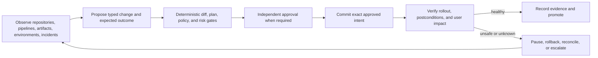
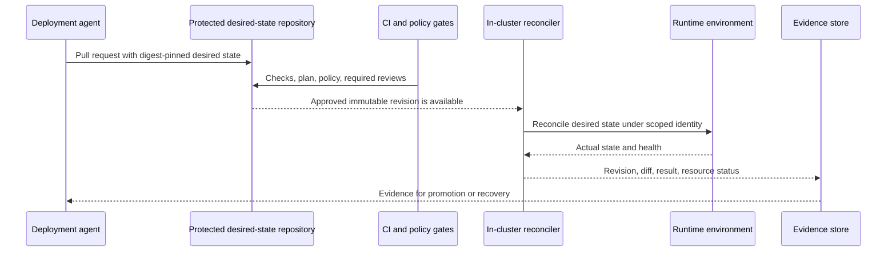
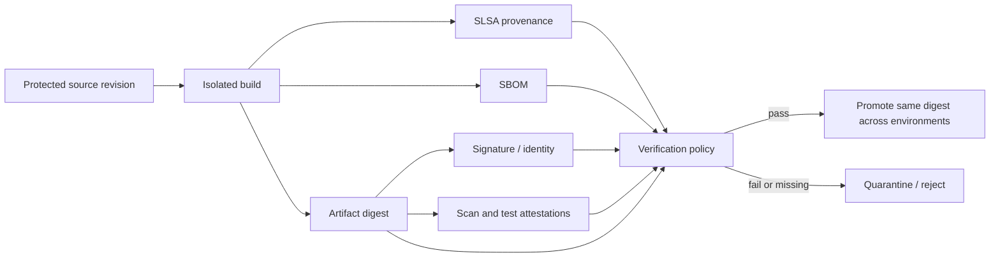
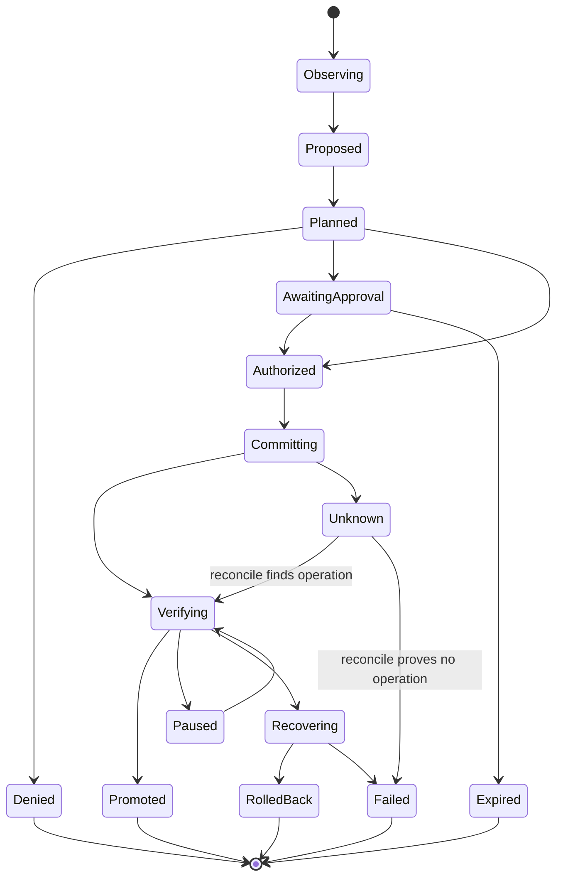

# Research Packet: DevOps and Deployment Agent Blueprint

> **Status:** Active research packet  
> **Research date:** 2026-08-31  
> **Scope:** A production DevOps/deployment agent that can inspect delivery systems, prepare evidence-bound changes, coordinate approvals, promote immutable artifacts, and supervise or execute bounded rollouts.  
> **Derived guides:** [DevOps and deployment agent](../../agents/devops-deployment-agent/README.md), including [context, memory, and behavior evolution](../../agents/devops-deployment-agent/context-compilation-memory-and-behavior-evolution.md)  
> **Method:** Primary standards, official product documentation, official repositories, and original engineering references were compared. Product behavior, feature tiers, defaults, and release versions are volatile and must be rechecked before implementation.

This packet preserves the evidence behind the blueprint. It separates durable engineering conclusions from vendor-specific mechanisms, exposes unresolved disagreements, and records claims that were intentionally excluded.

## Research questions

1. What makes a deployment agent different from a chat assistant or a scripted pipeline?
2. Which decisions may be delegated to a model, and which guarantees must remain deterministic?
3. When should the agent use direct CI/CD orchestration, GitOps, or a hybrid?
4. How should a proposed change be bound to the exact revision, plan, artifact, environment, policy, and approval later committed?
5. Which evidence is required to promote an artifact without rebuilding it?
6. How should canary, blue/green, rollback, cancellation, and ambiguous completion be represented?
7. How should Git, CI, registries, Kubernetes, cloud, IaC, ticket, and incident tools be exposed to a nondeterministic caller?
8. Which credentials, tenant boundaries, and separation-of-duties controls constrain autonomy?
9. When is framework checkpointing sufficient, and when is a durable workflow runtime required?
10. How should agent reasoning quality and delivery-system outcomes be evaluated together?
11. How should context, compaction, caches, transcripts, retrieval, and every cross-run memory class be governed?
12. How should model, prompt, tool, adapter, policy, workflow, query, and trust-root upgrades be evaluated and rolled back?

## Baseline as researched

| Domain | Baseline used | Why it matters | Volatility note |
|---|---|---|---|
| GitOps | OpenGitOps Principles and Glossary v1.0.0 | Declarative, versioned and immutable desired state; automatically pulled and continuously reconciled | Follow published releases rather than `main` |
| Supply chain | SLSA specification v1.2; SLSA Provenance predicate `https://slsa.dev/provenance/v1` | Current approved build-track model and provenance schema | Draft tracks are not treated as production requirements |
| Attestations | in-toto Attestation Framework v1.2; Statement schema v1; DSSE v1 envelope guidance | Digest-bound, typed claims with an authenticated envelope | Framework, Statement, envelope, and predicate versions are separate |
| Registry | OCI Distribution Specification 1.1.1 referrers model | Digest-addressed content and discoverable subject/referrer relationships | Registry conformance, fallback tags, replication, and retention must be tested |
| Kubernetes | Rolling documentation current on 2026-08-31; ValidatingAdmissionPolicy stable since v1.30 | Dry-run, conflict semantics, field ownership, rollout conditions, admission | Cluster minor versions and enabled features must be inventoried |
| Infrastructure plans | Terraform rolling documentation and OpenTofu v1.12 | Saved plans, sensitive state, backend locking, and exact apply | Pin CLI, provider, backend, lockfile, and plan-format compatibility per adapter |
| Delivery events | CDEvents v0.5.0 | Cross-tool vocabulary for CI, CD, tickets, and operations | Specification and individual event types version independently |
| Security | NIST SP 800-218 SSDF v1.1 final; SP 800-204D final; SP 800-53 Rev. 5.1 controls | Secure development, CI/CD supply-chain measures, least privilege, separation of duties | SSDF v1.2 was still draft; do not present it as final |
| Telemetry | OpenTelemetry Specification 1.60.0; profiles remained alpha | Vendor-neutral causal telemetry and signal correlation | Semantic conventions and profiles are evolving independently |
| Delivery performance | DORA five-metric model as documented in 2026 | Throughput and instability outcomes | Definitions have evolved; pin the formula used by each dashboard |
| Agent runtimes | Product documentation current on 2026-08-31 | Framework checkpointing, interruption, tracing, and durable adapters | APIs and support matrices change quickly |

The packet does not claim that every implementation must adopt every baseline. The baseline makes claims reviewable and identifies refresh points.

## Finding 1: the agent is a bounded change controller, not a privileged chatbot

A useful deployment agent closes a loop across evidence, intent, policy, execution, and verification:



The model is strong at synthesizing context, explaining risk, forming hypotheses, choosing among known playbooks, and generating candidate patches. It is not an authority for identity, policy, live resource state, artifact integrity, approval validity, or whether a remote side effect committed.

OWASP's CI/CD risk catalog highlights flow control, IAM, pipeline-based access, credentials, artifact integrity, and visibility as systemic risks. NIST SP 800-204D treats build, test, package, and deploy as a connected software supply chain. Giving a language model ambient credentials across this chain concentrates rather than removes those risks.

**Stable conclusion**

The agent produces proposals and bounded decisions. Trusted adapters and control services validate structured intent against current authoritative state and commit only an exact, authorized operation. A free-form answer never establishes deployment success.

**Sources**

- [NIST SP 800-204D: software supply-chain security in CI/CD](https://csrc.nist.gov/pubs/sp/800/204/d/final)
- [NIST SP 800-218 SSDF v1.1](https://csrc.nist.gov/pubs/sp/800/218/final)
- [OWASP Top 10 CI/CD Security Risks](https://owasp.org/www-project-top-10-ci-cd-security-risks/)
- [OWASP CI/CD Security Cheat Sheet](https://cheatsheetseries.owasp.org/cheatsheets/CI_CD_Security_Cheat_Sheet.html)

## Finding 2: autonomy must be granted by effect class and environment

“Autonomous” is too coarse. Reading production health, opening a pull request, approving a plan, shifting traffic, deleting infrastructure, and rotating a credential have different failure costs and reversibility.

| Level | Agent authority | Appropriate default |
|---|---|---|
| A0 — explain | Answer from supplied evidence; no external reads | New or untrusted installation |
| A1 — observe | Read scoped repositories, CI, registry, ticket, and environment state | Production diagnosis with redacted credentials |
| A2 — propose | Create a local patch, plan, evidence bundle, or pull-request draft | Default useful production posture |
| A3 — non-production execute | Run pre-authorized, reversible operations in ephemeral/dev/test environments | After policy and recovery tests |
| A4 — production initiate | Start an approved deployment or promotion whose exact subject and target are bound | Mature teams with external approval and commit-time revalidation |
| A5 — closed-loop supervise | Advance, pause, or roll back within a pre-authorized progressive-delivery envelope | High-volume standardized workloads with proven metrics and kill switches |

The highest level is not “arbitrary production administration.” It is a closed set of actions, resources, budgets, and time windows. Destructive infrastructure changes, identity-policy changes, trust-root changes, data migrations, and incident-time overrides should remain separately governed even in an A5 system.

GitHub and GitLab both expose environment protection and approval mechanisms. GitLab explicitly recommends serializing deployments to an environment with a resource group and separating deployment permissions when needed. These are enforcement features outside the model, not conversational conventions.

**Stable conclusion**

Record autonomy as a matrix of environment × effect class × reversibility × blast radius × evidence quality. Deny unspecified cells. Raise autonomy only after failure-injection evidence shows the lower level is safe and operationally valuable.

**Sources**

- [GitHub deployment environments and protection rules](https://docs.github.com/en/actions/how-tos/deploy/configure-and-manage-deployments)
- [GitLab deployment safety](https://docs.gitlab.com/ci/environments/deployment_safety/)
- [GitLab protected environments](https://docs.gitlab.com/ci/environments/protected_environments/)
- [NIST SP 800-53 Rev. 5.1](https://csrc.nist.gov/pubs/sp/800/53/r5/upd1/final)

## Finding 3: GitOps reduces credential reach but does not eliminate deployment risk

OpenGitOps defines desired state as declarative, versioned and immutable, pulled automatically, and continuously reconciled. Argo CD and Flux implement this controller shape for Kubernetes. In a pull architecture, CI or the agent can propose a Git change while an in-cluster reconciler owns cluster credentials.



Important limits:

- A bad approved declaration is still bad desired state.
- Reconciliation can amplify destructive configuration quickly.
- The Git commit, rendered manifests, image digests, policy decision, and observed cluster revision must be linked.
- Direct manual changes can be reverted by self-heal, potentially fighting incident responders.
- Argo CD automated sync does not prune by default; enabling prune and allow-empty materially changes risk.
- Argo CD documents that rollback cannot be performed while automated sync is enabled. A Git revert or controlled sync policy change may be the correct recovery path.
- Argo CD selective sync does not run hooks and is not recorded in history, so it is a dangerous default for evidence-sensitive recovery.
- Flux image automation can write changes back to Git; its writer identity and policy need the same protection as any release bot.

**Stable conclusion**

Prefer GitOps for declarative Kubernetes and infrastructure targets when a pull reconciler can own credentials and drift. Keep direct APIs for operations that are not desired-state changes—queries, rollout pause/abort, incident containment, ticket updates, and provider operations with their own durable controller. Make the authoritative path explicit to avoid competing writers.

**Sources**

- [OpenGitOps documents repository](https://github.com/open-gitops/documents)
- [OpenGitOps glossary](https://github.com/open-gitops/documents/blob/main/GLOSSARY.md)
- [Argo CD automated sync](https://argo-cd.readthedocs.io/en/stable/user-guide/auto_sync/)
- [Argo CD sync phases and waves](https://argo-cd.readthedocs.io/en/stable/user-guide/sync-waves/)
- [Argo CD selective sync limitations](https://argo-cd.readthedocs.io/en/stable/user-guide/selective_sync/)
- [Argo CD sync windows](https://argo-cd.readthedocs.io/en/stable/user-guide/sync_windows/)
- [Flux components](https://fluxcd.io/flux/components/)
- [Flux image update automation](https://fluxcd.io/flux/components/image/imageupdateautomations/)

## Finding 4: plan and approval must bind to the committed subject

Terraform and OpenTofu can save an execution plan and later apply that exact plan. Kubernetes server-side dry-run exercises defaulting, validation, admission, and conflict checks without persistence. Azure Resource Manager exposes a what-if operation. These mechanisms are valuable only if the approval is attached to the exact inputs later committed.

An approval record should bind at least:

```text
change_id + proposal_version
source_repository + commit_sha
rendered_configuration_digest
artifact_digests
plan_type + plan_digest + tool_version
target_environment_id + observed_base_revision
policy_bundle_digest + decision
risk_class + declared effects
approver_identity + role + decision + expiry
```

Commit-time revalidation must reject changed artifacts, stale targets, expired approvals, policy changes, missing evidence, and altered plan semantics. A human approving “deploy version 4.2” is not approval for a later regenerated plan with additional deletes.

Plan limitations are material:

- Terraform plan files can contain secrets in cleartext even when terminal output redacts them.
- Plan JSON can contain unknown values; OPA notes that some facts are unavailable at plan time.
- A speculative plan can become stale as real state changes.
- Kubernetes dry-run does not prove controllers, webhooks with prohibited side effects, or external systems will converge successfully.
- Azure what-if has expansion and time limits; ignored resources are not evidence of no change.
- A plan is predicted intent, not a receipt.

**Stable conclusion**

Treat the machine-readable plan as a sensitive, immutable review artifact. Sign or hash it, store it with restricted access, attach a concise human diff, and revalidate current state immediately before commit. Verify authoritative postconditions afterward.

**Sources**

- [Terraform plan and saved-plan workflow](https://developer.hashicorp.com/terraform/tutorials/cli/plan)
- [Terraform sensitive data in state and plans](https://developer.hashicorp.com/terraform/language/manage-sensitive-data)
- [OpenTofu `plan`](https://opentofu.org/docs/cli/commands/plan/)
- [OpenTofu state storage and locking](https://opentofu.org/docs/language/state/backends/)
- [OPA and Terraform plan limitations](https://www.openpolicyagent.org/docs/terraform)
- [Kubernetes API dry-run and conflict semantics](https://kubernetes.io/docs/reference/using-api/api-concepts)
- [Kubernetes server-side apply](https://kubernetes.io/docs/reference/using-api/server-side-apply/)
- [Azure Resource Manager what-if](https://learn.microsoft.com/en-us/azure/azure-resource-manager/templates/deploy-what-if)

## Finding 5: policy is layered and must fail according to risk

No one gate sees every relevant fact. Useful enforcement points are:

1. repository rules before merge;
2. CI policy over source, rendered configuration, and plan;
3. release policy over artifact provenance and test evidence;
4. commit-time authorization over principal, target, current state, and approval;
5. runtime admission over the actual object and artifact digest;
6. continuous drift and health policy after deployment.

OPA supports CI/CD evaluation and recommends Conftest for configuration and IaC formats. Kubernetes ValidatingAdmissionPolicy provides in-process CEL validation; Gatekeeper adds a parameterized policy library and audit; Kyverno and Sigstore policy-controller can validate image signatures and attestations. These tools overlap but are not interchangeable.

| Gate | Best evidence | Failure default |
|---|---|---|
| Local/PR advisory | Source and rendered diff | Explain and block merge only when repository policy says so |
| CI mandatory | Tests, plan JSON, dependency and configuration scans | Block promotion |
| Approval | Human-readable plan plus immutable evidence references | Expire and require a new decision on change |
| Commit-time | Current identity, target, base revision, policy, plan digest | Fail closed for writes |
| Admission | Submitted object, namespace, image digest, attestations | Fail closed for protected workloads; rehearse dependency outage behavior |
| Runtime | Drift, health, SLO, business KPI | Pause/reroute/rollback within authorized envelope |

Policy-service failure modes require deliberate choices. A global fail-closed admission webhook can become a cluster outage; fail-open can admit unsafe workloads. Use risk-scoped enforcement, cached or in-process policies where appropriate, bounded timeouts, break-glass procedures, and failure drills.

**Stable conclusion**

Use policy as deterministic code with versioned bundles, tests, decision logs, staged rollout, and an explicit availability posture. A model may explain a denial or propose remediation; it must not reinterpret a mandatory denial as permission.

**Sources**

- [OPA in CI/CD](https://www.openpolicyagent.org/docs/cicd)
- [OPA for Kubernetes](https://www.openpolicyagent.org/docs/kubernetes)
- [Kubernetes ValidatingAdmissionPolicy](https://kubernetes.io/docs/reference/access-authn-authz/validating-admission-policy/)
- [Kyverno ImageValidatingPolicy](https://kyverno.io/docs/policy-types/image-validating-policy/)
- [Sigstore policy-controller](https://docs.sigstore.dev/policy-controller/overview/)

## Finding 6: build once, identify by digest, and promote evidence—not mutable tags

SLSA v1.2 defines build levels from provenance existence through a hardened build platform. Its provenance predicate describes the build definition, external parameters, resolved dependencies, builder identity, invocation, and output subjects. in-toto Statement v1 binds typed predicates to digest-identified subjects. OCI 1.1 defines subject/referrer discovery for attached artifacts such as signatures, SBOMs, and provenance.



Key distinctions:

- A signature says an accepted identity signed a subject; it does not say the subject is safe.
- Provenance explains origin and build process; it does not prove the source is correct or vulnerability-free.
- An SBOM inventories components; it is not a vulnerability verdict.
- A vulnerability scan is time- and database-dependent; its result becomes stale.
- A tag is a human-readable pointer and may move unless immutability is enforced.
- An attestation must be verified against a trusted identity, issuer, subject digest, predicate type, and policy—not merely found.

Docker BuildKit can emit SBOM and provenance attestations, but its documented default provenance schema remained SLSA v0.2 unless v1 is explicitly selected. Tekton Chains documentation exposes several formatter names whose aliases can be confusing. This is a concrete reason to inspect the produced predicate rather than assuming a CLI flag or product name implies the desired standard version.

**Stable conclusion**

Build once in a controlled builder, publish immutable digest-addressed artifacts, attach signed evidence, verify it at promotion and admission, and deploy the same digest. Rebuilding for production creates a different subject and invalidates earlier evidence.

**Sources**

- [SLSA v1.2 specification](https://slsa.dev/spec/v1.2/)
- [SLSA build provenance](https://slsa.dev/spec/v1.2/build-provenance)
- [SLSA artifact verification](https://slsa.dev/spec/v1.2/verifying-artifacts)
- [in-toto Statement v1](https://github.com/in-toto/attestation/blob/v1.2.0/spec/v1/statement.md)
- [in-toto validation model](https://github.com/in-toto/attestation/blob/main/docs/validation.md)
- [OCI Distribution Specification](https://github.com/opencontainers/distribution-spec/blob/main/spec.md)
- [Sigstore keyless signing overview](https://docs.sigstore.dev/cosign/signing/overview/)
- [Sigstore verification](https://docs.sigstore.dev/cosign/verifying/verify/)
- [Docker BuildKit provenance](https://docs.docker.com/build/metadata/attestations/slsa-provenance/)
- [Tekton Chains configuration](https://tekton.dev/docs/chains/config/)
- [Google Artifact Registry immutable tags](https://docs.cloud.google.com/artifact-registry/docs/docker/names)
- [Harbor tag immutability](https://goharbor.io/docs/2.9.0/working-with-projects/working-with-images/create-tag-immutability-rules/)

## Finding 7: environment promotion is a state transition, not another build

A release should carry a manifest that identifies:

- source and build subjects;
- exact artifact digests and platform variants;
- provenance, SBOM, scans, test and policy evidence;
- configuration and database compatibility bounds;
- target environment and base revision;
- rollout strategy, analysis template, stop conditions, and rollback target;
- required approvals and change ticket;
- retention, audit, and incident links.

Promotion then authorizes the same release subject for a new target. Environment-specific configuration should be versioned separately and rendered into a digest that becomes part of the plan. Avoid copying mutable tags, rebuilding from source, or letting the model select an unverified “latest” version.

Google Cloud Deploy models releases, rollouts, targets, and stages; AWS CodeDeploy records deployment revisions and assigns rollback deployments their own IDs; GitHub and GitLab deployment APIs associate revisions with environments. The common invariant is more important than the product vocabulary: promotion must have a stable release identity and a new environment-specific execution record.

**Stable conclusion**

Use an immutable release manifest and an append-only promotion record. The artifact digest remains constant; target-specific configuration, approval, plan, rollout, and observed outcome receive new versioned identities.

**Sources**

- [Google Cloud Deploy terminology](https://docs.cloud.google.com/deploy/docs/terminology)
- [AWS CodeDeploy deployment workflow](https://docs.aws.amazon.com/codedeploy/latest/userguide/deployments.html)
- [GitHub Deployments REST API](https://docs.github.com/en/rest/deployments/deployments)
- [GitLab Deployments API](https://docs.gitlab.com/api/deployments/)

## Finding 8: rollout controllers report state; the application owns success criteria

Kubernetes Deployment reports progress and a `ProgressDeadlineExceeded` condition, but explicitly does not automatically roll back a stalled deployment. Argo Rollouts and Flagger add canary or blue/green strategies, metric analysis, promotion, and abort behavior. Google SRE defines a canary as a partial, time-limited deployment evaluated against a control.

| Strategy | Strength | Failure mode the agent must understand |
|---|---|---|
| Rolling update | Low extra capacity; native | Readiness can pass while user outcomes regress; rollback is not automatic |
| Canary | Bounded exposure with comparative evidence | Low traffic or biased cohorts make analysis inconclusive; shared dependencies contaminate control |
| Blue/green | Fast traffic switch and fast switch-back while old stack remains | Double capacity, state/schema compatibility, and delayed background work complicate rollback |
| Shadow | Exercises new code without authoritative response | Side effects must be disabled or isolated; traffic fidelity and privacy matter |
| Feature flag | Separates code deployment from feature exposure | Flag state becomes another control plane and rollback dependency |

Analysis must include absolute SLO floors, relative control comparison, minimum sample and duration, guardrail metrics, business outcome where relevant, missing-data behavior, and maximum exposure. The model may summarize evidence, but a deterministic analysis controller should enforce thresholds.

Argo Rollouts documents that an analysis failure can abort and return traffic to stable. Its rollback window can fast-track recent revisions. Flagger similarly increments traffic and rolls back after failed checks. These semantics depend on the traffic provider, metric availability, controller version, and application behavior; they are not generic guarantees.

**Stable conclusion**

Use a rollout controller for mechanics and deterministic gates. Let the agent choose only among pre-approved strategies and parameters. A promotion decision must cite the exact metric queries, sample window, control, missing-data decision, and observed release.

**Sources**

- [Kubernetes Deployments](https://kubernetes.io/docs/concepts/workloads/controllers/deployment/)
- [Google SRE: Canarying releases](https://sre.google/workbook/canarying-releases/)
- [Argo Rollouts analysis and progressive delivery](https://github.com/argoproj/argo-rollouts/blob/master/docs/features/analysis.md)
- [Argo Rollouts rollback window](https://argoproj.github.io/argo-rollouts/features/rollback/)
- [Flagger: how it works](https://docs.flagger.app/usage/how-it-works)
- [AWS CodeDeploy deployment types](https://docs.aws.amazon.com/codedeploy/latest/userguide/deployments.html)

## Finding 9: rollback is a new forward operation and may be unsafe

Code rollback does not automatically reverse:

- database schema or data changes;
- messages emitted to old or new consumers;
- infrastructure deletions or replacements;
- secrets and identity-policy changes;
- cached state and feature-flag exposure;
- external side effects;
- work already accepted by the new version.

AWS CodeDeploy models rollback as a new deployment with a new ID. This is the accurate mental model. A traffic switch, Git revert, manifest reapply, or IaC apply is a new effect with its own authorization, evidence, and possible failure.

Safe release design therefore needs expand/contract schema changes, backward/forward compatibility windows, retained old artifacts and configuration, durable migration checkpoints, compensation or reconciliation for external effects, and an explicit roll-forward path.

**Stable conclusion**

Never label a release “rollback safe” without testing application, schema, state, traffic, queue, and external-effect behavior. Store a typed recovery plan per release: `traffic_revert`, `config_revert`, `artifact_redeploy`, `feature_disable`, `roll_forward`, `manual_reconcile`, or a sequence.

**Sources**

- [AWS CodeDeploy rollback semantics](https://docs.aws.amazon.com/codedeploy/latest/userguide/deployment-steps-server.html)
- [Argo Rollouts getting started and abort behavior](https://github.com/argoproj/argo-rollouts/blob/master/docs/getting-started.md)
- [Argo CD automated sync limitations](https://argo-cd.readthedocs.io/en/stable/user-guide/auto_sync/)

## Finding 10: identities must be short-lived, target-bound, and separated by plane

GitHub Actions and GitLab CI support OIDC federation so jobs can exchange identity tokens for short-lived cloud credentials. Both emphasize claim conditions. GitLab recommends stable identifiers such as project IDs in addition to path claims. Vault dynamic secrets use leases and support revocation. SPIFFE defines workload identities and SVIDs; its own model assumes workloads are sufficiently isolated that one cannot steal another's credential.

Credential planes should be separated:

| Identity | May do | Must not do |
|---|---|---|
| Agent observer | Read bounded metadata and evidence | Deploy or fetch raw secrets |
| Proposal writer | Create branch/PR in scoped repositories | Merge, approve, or push protected desired state directly |
| Builder | Read source and dependencies; publish new artifact and provenance | Deploy production or modify approval policy |
| Promoter | Copy/authorize existing digest and write release metadata | Rebuild artifact or alter provenance |
| Reconciler/deployer | Apply approved desired state to assigned target | Write source or approve its own change |
| Verifier | Read runtime and evidence; publish signed result | Mutate target under the same identity |
| Break-glass operator | Perform time-bound incident action with extra audit | Become the agent's routine credential |

Do not serialize bearer tokens into prompts, checkpoints, plans, traces, or artifact stores. The tool gateway should exchange workload identity for a target- and operation-scoped credential immediately before execution.

**Stable conclusion**

Keep the reasoning plane credential-free. Use distinct workload identities for observe, propose, build, promote, deploy, and verify. Bind federation to repository/workflow/environment or equivalent stable claims, use short TTLs, and make revocation effective for queued and resumed work.

**Sources**

- [GitHub Actions deployment hardening with OIDC](https://docs.github.com/en/actions/how-tos/secure-your-work/security-harden-deployments)
- [GitHub Actions secure-use reference](https://docs.github.com/en/actions/reference/security/secure-use)
- [GitLab OIDC cloud connections](https://docs.gitlab.com/ci/cloud_services/)
- [Vault leases and revocation](https://developer.hashicorp.com/vault/docs/concepts/lease)
- [SPIFFE concepts](https://spiffe.io/docs/latest/spiffe/concepts/)
- [Kubernetes service-account administration](https://kubernetes.io/docs/reference/access-authn-authz/service-accounts-admin/)

## Finding 11: tenant and environment boundaries must survive every adapter

Kubernetes describes a spectrum from namespace-based sharing through virtual control planes and dedicated clusters. Namespaces are logical boundaries and require RBAC, network policy, quotas, admission, storage, and workload isolation. Per-tenant control planes still do not solve data-plane isolation.

A deployment agent adds cross-system confused-deputy risks. It must carry immutable tenant, organization, repository, application, environment, cloud account/project/subscription, cluster, namespace, and credential-connection identifiers. The model should select from authorized logical IDs; it should not construct trusted target identifiers from free text.

Risk-based isolation options:

- shared control plane with per-tenant repository and resource scopes;
- isolated worker queues and credential brokers per environment class;
- separate cloud accounts/projects/subscriptions for production or regulated tenants;
- dedicated reconcilers, runners, nodes, clusters, and evidence keys for high-isolation cases;
- separate model-provider projects and telemetry partitions when prompts contain tenant data.

**Stable conclusion**

Enforce tenant and environment scope at admission, state, queue, credential broker, every tool adapter, artifact store, trace store, and callback. A namespace or prompt instruction alone is not a tenant boundary.

**Sources**

- [Kubernetes multi-tenancy](https://kubernetes.io/docs/concepts/security/multi-tenancy/)
- [GitLab protected environments](https://docs.gitlab.com/ci/environments/protected_environments/)
- [GitHub workflow token permissions](https://docs.github.com/en/actions/reference/workflows-and-actions/workflow-syntax)

## Finding 12: deployment work needs durable state and first-class unknown outcomes

Deployment operations span builds, manual approvals, change windows, rollouts, health analysis, and incident handoffs. A socket or model conversation is not a durable run.



Frameworks expose useful convenience:

- LangGraph checkpoints graph state and supports interrupts and resume by thread ID.
- OpenAI Agents SDK serializes run state for approval flows and documents durable runtime integrations.
- general workflow runtimes such as Temporal preserve long-lived control flow across process loss.

None of these establishes exactly-once deployment. External operations still need provider deployment IDs, idempotency keys, state reads, postcondition verification, and an unknown state when timeout occurs after possible commit.

Cancellation is also a request, not proof. A remote deployment can continue after the local worker stops. Record `cancel_requested`, query authoritative status, revoke future authority, and reconcile late completion.

**Stable conclusion**

Persist a domain state machine independent of chat history. Use an agent framework for model/tool ergonomics, and add a durable workflow runtime when runs must survive long waits or process loss. Always own effect identity, reconciliation, authorization, and terminal invariants in application code.

**Sources**

- [LangGraph persistence](https://docs.langchain.com/oss/python/langgraph/persistence)
- [LangGraph interrupts](https://docs.langchain.com/oss/python/langgraph/interrupts)
- [OpenAI Agents SDK human-in-the-loop](https://openai.github.io/openai-agents-python/human_in_the_loop/)
- [OpenAI Agents SDK durable integrations](https://openai.github.io/openai-agents-python/running_agents/)
- [Temporal documentation](https://docs.temporal.io/)

## Finding 13: evidence must cross tool boundaries and remain causally linkable

CDEvents v0.5.0 defines event families across source control, CI, testing, CD, operations, and tickets, transported using CloudEvents. OpenTelemetry supplies traces, metrics, logs, and baggage. Vendor deployment APIs add their own identifiers and asynchronous semantics.

Carry a lineage spine:

```text
tenant_id / principal_id
change_id / proposal_version / run_id
source_revision / desired_state_revision
build_id / artifact_digest / attestation_digest
plan_id / plan_digest / policy_decision_id
approval_id / ticket_id
deployment_id / rollout_id / environment_id
effect_id / attempt_id
trace_id / incident_id / evaluation_id
```

Jira's deployment ingestion is asynchronous and uses deployment and update sequence numbers; submissions may be partially rejected. GitHub dispatches deployment and deployment-status events. GitLab preserves deployment records and exposes approvals. The agent must not equate an accepted API request with stored or completed evidence.

**Stable conclusion**

Normalize a small internal event and evidence contract, preserve vendor payload references, and verify eventual ingestion when required. Do not force every provider into a lowest-common-denominator status; retain raw authoritative IDs and error categories.

**Sources**

- [CDEvents v0.5.0](https://cdevents.dev/docs/)
- [OpenTelemetry signals](https://opentelemetry.io/docs/concepts/signals/)
- [OpenTelemetry Specification 1.60.0](https://opentelemetry.io/docs/specs/otel/)
- [OpenTelemetry log correlation](https://opentelemetry.io/docs/specs/otel/logs/)
- [Jira deployment API](https://developer.atlassian.com/cloud/jira/software/rest/api-group-deployments/)
- [GitHub Deployments REST API](https://docs.github.com/en/rest/deployments/deployments)
- [GitLab Deployments API](https://docs.gitlab.com/api/deployments/)

## Finding 14: evaluate both agent judgment and delivery outcomes

DORA's current five metrics describe throughput and instability, but they are organizational outcome indicators, not an agent scorecard. Agent evaluation needs additional dimensions:

| Dimension | Example measure | Counter-metric |
|---|---|---|
| Proposal correctness | Accepted changes with no material correction | Reviewer disagreement and escaped defects |
| Grounding | Claims linked to fresh authoritative evidence | Stale or invented target/artifact identifiers |
| Policy behavior | Mandatory denials respected; correct approval tier | Unsafe escalation or approval fatigue |
| Plan quality | Predicted effects match observed effects | Surprise deletes/replacements and unknowns |
| Operational outcome | Healthy promotion within SLO | Change failure, rollback, incident, rework |
| Recovery | Correct pause/rollback/reconcile decision | Duplicate effect or prolonged exposure |
| Efficiency | Cost and latency per verified useful change | Token/tool fan-out and human review burden |
| Calibration | Confidence/risk tier matches empirical error | Confident unsafe decisions or excessive abstention |

Offline scenario tests must replay real sanitized evidence, including incomplete and conflicting signals. Shadow mode should compare proposed actions with actual operator decisions. Online canaries should start at A1/A2, where the agent cannot commit production effects. Promotion to higher autonomy requires statistically useful samples per workload and risk class, not a global average.

**Stable conclusion**

Gate agent releases using safety, task quality, recovery, latency, cost, and operator-load criteria. Evaluate the whole behavior bundle—model, prompt, tools, policy mappings, retrieval, workflow, and runtime—not only the model name.

**Sources**

- [DORA software delivery performance metrics](https://dora.dev/guides/dora-metrics/)
- [Google SRE: Canarying releases](https://sre.google/workbook/canarying-releases/)
- [OpenTelemetry observability primer](https://opentelemetry.io/docs/concepts/observability-primer/)

## Finding 15: incident authority must override normal automation

Google SRE recommends clear command, delegated roles, a working log, and early incident declaration. During an incident, multiple independent actors changing production creates additional uncertainty. The deployment agent should become subordinate to incident command.

Required containment controls include:

- freeze new production admissions by application, tenant, environment, or region;
- pause GitOps reconciliation or place it in an incident-safe mode without losing desired-state history;
- disable production commit tools while preserving read and evidence access;
- stop rollout progression and route traffic to known stable versions;
- revoke deploy credentials and queued grants;
- correlate recent releases, config changes, feature flags, and incidents;
- preserve snapshots, plans, policy decisions, approvals, and ambiguous effects;
- require an incident-role identity for recovery mutations;
- restore normal automation only after reconciliation and explicit handback.

The agent can accelerate evidence collection, timeline construction, hypothesis comparison, and runbook retrieval. It should not compete with the Operations Lead or silently self-heal changes incident responders made intentionally.

**Stable conclusion**

Incident state is a high-priority policy input. The incident commander or delegated operations role controls production mutations; the agent defaults to observe/propose and uses dedicated, audited recovery operations.

**Sources**

- [Google SRE Workbook: Incident response](https://sre.google/workbook/incident-response/)
- [Google SRE: Managing incidents](https://sre.google/sre-book/managing-incidents/)
- [Google SRE: Postmortem culture](https://sre.google/sre-book/postmortem-culture/)

## Finding 16: context is a disposable projection; memory classes need separate decisions

A deployment run contains more truth than any model context should hold. Authority, cancellation, approvals, effect identity, unknown provider outcomes, and current target state need typed application-owned records. The model needs a bounded projection for its next decision.

An implementable compiler reserves mandatory lanes for:

1. authenticated principal, tenant, target/action scope, incident state, and budgets;
2. durable run/effect state, including cancellation and unknown outcomes;
3. immutable release, plan, policy, approval, and rollout identities;
4. fresh target and provider observations with completeness and conflict metadata;
5. applicable governed runbook/query templates;
6. optional decision evidence and working hypotheses.

Every evidence item should retain provider/native ID, tenant, subject, source and adapter versions, occurrence/fetch/expiry time, pagination/completeness, digest, sensitivity, redaction, and conflicts. Large logs can be externalized, but their bounded excerpts must refer to an immutable artifact.

Conversation state and compaction solve a narrower problem. The OpenAI Responses API exposes stored conversation items and an opaque compaction artifact for continuation. Neither feature claims to be an authorization, audit, or external-effect ledger. A safe deployment checkpoint is reconstructed from authoritative state and revalidated on resume.

| Memory class | Evidence-backed default |
|---|---|
| Durable run/release/approval/effect state | Enabled outside model memory |
| Run working notes and transcript | Enabled only for the current scoped run and retention need |
| Evidence cache | Enabled with tenant/target/source-version key, TTL, and completeness |
| Retrieval/vector index | Disabled for the first version; add only after measured exact-search misses |
| Reviewed runbooks/service knowledge | Enabled from versioned governed sources |
| Cross-run user preference | Disabled unless an explicit non-authoritative use survives privacy/deletion review |
| Free-form episodic learning | Disabled; curate reviewed outcomes into runbooks or eval fixtures |
| Secrets, credentials, permission, target, or effect memory | Forbidden |
| Online self-modifying prompt/tool/policy memory | Disabled |

Compaction tests need the same scenario uninterrupted, compacted once, compacted repeatedly, crash-resumed, cleanly handed off, and migrated to another qualified model. Stale approval, cross-tenant retrieval, prompt injection, cancellation, and an unknown effect must remain correctly represented.

**Stable conclusion**

Compile context for the next decision from authoritative stores, emit a context manifest, and fail if a mandatory lane is absent. Treat summaries, transcripts, embeddings, and provider compaction as derived data. Enable memory classes individually; reviewed offline failure ingestion is safer than production self-learning.

**Sources**

- [OpenAI Responses conversation resource](https://developers.openai.com/api/reference/python/resources/conversations/methods/create)
- [OpenAI Responses compaction](https://developers.openai.com/api/reference/java/resources/responses/methods/compact)
- [OWASP LLM Prompt Injection Prevention Cheat Sheet](https://cheatsheetseries.owasp.org/cheatsheets/LLM_Prompt_Injection_Prevention_Cheat_Sheet.html)
- [NIST SP 800-204D](https://csrc.nist.gov/pubs/sp/800/204/d/final)

## Finding 17: qualify each integration and release the whole behavior bundle

Provider APIs expose similar nouns but different guarantees:

- GitHub environment reviewers can prevent self-review, but administrative bypass and feature availability are configurable.
- GitLab deployment approval blocks a job but does not start it; resource-group process modes differ in ordering, and newest-first modes require idempotent jobs.
- Bitbucket serializes in-progress deployment environments, while custom deployment permissions are plan-dependent.
- OCI referrer discovery has a standard API and fallback tag schema, but registry retention, replication, rate limits, and garbage collection remain provider-specific.
- Argo CD automated/selective sync and Flux image automation change writer, history, hook, suspension, and recovery behavior.
- CodeDeploy stop can be pending or leave instances in an indeterminate state; rollback is a new deployment. Cloud Deploy promotion/repair is another provider operation.
- Azure what-if returns ignored results when expansion limits are reached; ignored is not “no change.”
- HCP Terraform queues workspace runs and saved plans, while a local or OpenTofu backend may have different locking and sensitive-state behavior.
- Jira deployment ingestion is asynchronous. ServiceNow now publishes a Change Management API, but instance models, roles, workflows, fields, and endpoint versions still require qualification.

The adapter record therefore needs product edition/version, API versions, authentication claims/scopes, immutable object and operation IDs, idempotency/preconditions, concurrency owner and ordering, cancellation states, authoritative status/postcondition query, webhook verification/dedup/backfill, pagination/rate/payload limits, retention, native receipts, tenant tests, and qualification expiry.

The behavior that consumes those adapters is also a release unit:

~~~text
model snapshot + parameters
prompt and structured-output schema
context compiler + memory policy + compactor
tool registry + adapter versions
workflow state machine
policy and query-template bundles
trust roots and verifier versions
evaluation dataset and graders
~~~

OPA supports signed policy bundles, activation failure reporting, active revision status, and decision logs. These mechanisms support a staged policy release, but the application still decides validity, in-flight-run reuse, revocation, and rollback. The same staged ladder applies to every behavior component: contract tests, deterministic faults, held-out evals, historical replay, shadow, read-only canary, non-production effect canary, and narrow production cell.

Failure mining should include near misses, human edits/rejections, denials/exceptions, stale approvals, unknown effects, long reconciliation, provider drift, cross-tenant attempts, cost/latency outliers, later-linked rework, and incidents. Review assigns each failure to the correct owner—adapter, policy, context, runbook, interface, delivery system, or model—and creates a regression or held-out case before another rollout.

**Stable conclusion**

No third-party integration receives production write authority without a dated provider qualification and conformance campaign. No model/prompt/tool/policy change is “just configuration”; release and canary the full behavior bundle, retain the previous bundle, and preserve deterministic status/reconciliation during rollback.

**Sources**

- [GitHub deployments and environments](https://docs.github.com/en/actions/reference/workflows-and-actions/deployments-and-environments)
- [GitLab deployment approvals](https://docs.gitlab.com/ci/environments/deployment_approvals/)
- [GitLab resource groups](https://docs.gitlab.com/ci/resource_groups/)
- [Bitbucket deployment environments](https://support.atlassian.com/bitbucket-cloud/docs/set-up-and-monitor-deployments/)
- [OCI Distribution 1.1.1](https://github.com/opencontainers/distribution-spec/blob/v1.1.1/spec.md)
- [Amazon ECR ListImageReferrers](https://docs.aws.amazon.com/AmazonECR/latest/APIReference/API_ListImageReferrers.html)
- [Azure Container Registry OCI/ORAS artifact management](https://learn.microsoft.com/en-us/azure/container-registry/container-registry-manage-artifact)
- [Google Artifact Registry immutable Docker tags](https://docs.cloud.google.com/artifact-registry/docs/docker/pushing-and-pulling)
- [Harbor tag immutability](https://goharbor.io/docs/main/working-with-projects/working-with-images/create-tag-immutability-rules/)
- [Harbor garbage collection](https://goharbor.io/docs/main/administration/garbage-collection/)
- [Argo CD automated sync](https://argo-cd.readthedocs.io/en/stable/user-guide/auto_sync/)
- [Flux image update automation](https://fluxcd.io/flux/components/image/imageupdateautomations/)
- [AWS CodeDeploy stop](https://docs.aws.amazon.com/codedeploy/latest/userguide/deployments-stop.html)
- [AWS CodeDeploy rollback and redeployment](https://docs.aws.amazon.com/codedeploy/latest/userguide/deployments-rollback-and-redeploy.html)
- [Google Cloud Deploy automation](https://docs.cloud.google.com/deploy/docs/automation)
- [Azure ARM what-if](https://learn.microsoft.com/en-us/azure/azure-resource-manager/templates/deploy-what-if)
- [HCP Terraform remote operations](https://developer.hashicorp.com/terraform/cloud-docs/workspaces/run/remote-operations)
- [ServiceNow Change Management API](https://www.servicenow.com/docs/r/api-reference/rest-apis/change-management-api.html)
- [OPA bundles](https://www.openpolicyagent.org/docs/management-bundles)
- [OPA status](https://www.openpolicyagent.org/docs/management-status)
- [OPA decision logs](https://www.openpolicyagent.org/docs/management-decision-logs)

## Tool capability evidence

| Domain | Read capabilities | Proposal/commit capabilities | Evidence and traps |
|---|---|---|---|
| Git providers | Revisions, diffs, checks, reviews, branch rules, code owners | Branch, commit, PR/MR, merge under rules | Automation with direct push permission can bypass review; protect workflow and desired-state paths |
| CI systems | Runs, jobs, logs, artifacts, test results | Dispatch, cancel, retry allowed class | Retrying a deploy job may repeat effects; third-party actions/plugins share runner authority |
| Registries | Resolve digest, list referrers, signatures, attestations, scans | Push new artifact, copy/promote digest, quarantine | Tags may move; registry referrers and attestation formats vary |
| Kubernetes | Discovery, dry-run, diff, events, status, logs | Server-side apply, rollout pause/resume/undo, scoped patch | Field-manager conflicts, eventual controllers, and admission availability matter |
| GitOps | Desired/live diff, reconciliation and health | Commit desired state; sync/pause only when authorized | Avoid competing direct writers; selective sync can bypass hooks/history |
| Cloud deployment | Plans/what-if, operations, health, audit | Start/stop/rollback provider deployment | Async acceptance is not completion; cancellation may be pending |
| IaC | Validate, plan, state metadata | Apply exact approved plan | Plan/state are sensitive; provider effects may be partial or unknown |
| Tickets/change | Read approval/change window and dependencies | Create/update/link deployment evidence | Ticket status is not authorization unless policy explicitly makes it so |
| Incident systems | Active incident, severity, commander, affected services | Link change; execute delegated containment | Incident role and handback must be authoritative and current |

## Disagreements and conditional decisions

| Question | Evidence-backed default | Why no universal answer exists |
|---|---|---|
| Push pipeline or pull GitOps? | Pull GitOps for declarative targets; direct provider controllers for imperative operations | GitOps narrows credentials and handles drift but adds reconciliation latency and competing-writer concerns |
| PR-only or direct non-production mutation? | PR-only for production; allow bounded direct mutation in ephemeral environments | Preview environments value speed; production values review, replay, and separation of duties |
| Custom loop, agent framework, or durable workflow? | Hybrid: framework for model/tool ergonomics plus application-owned state; durable workflow for long waits/effects | Short read-only tasks do not justify workflow infrastructure; deployment runs usually do |
| One general model or routed models? | One qualified model first; add routing only with task-specific evaluation | Routing adds drift, compatibility, safety, and observability work |
| Automatic rollback on metric failure? | Automatic within a tested traffic-only envelope; otherwise pause and escalate | Schemas, queues, data, and external effects may make rollback more harmful |
| Fail open or closed when policy/verification is unavailable? | Fail closed for protected writes; preserve an audited break-glass route | Global fail-closed admission can cause availability incidents; fail-open weakens the control |
| Rebuild per environment or promote? | Promote the same digest | Some legacy systems embed environment config at build time; they must be redesigned or evidence must be environment-specific |
| Shared or dedicated deployment cells? | Shared for ordinary internal workloads, isolated as tenant/risk requirements rise | Dedicated cells reduce blast radius but add cost and stranded capacity |
| Human approval on every production change? | Risk-based approval with policy-autonomous low-risk changes | Universal manual gates cause fatigue; universal automation ignores separation and high-impact change |
| Model decides rollout health? | Deterministic gates; model summarizes and diagnoses | Models can synthesize weak signals but are not stable threshold evaluators |

## Product-specific contradictions and cautions

1. **Argo CD rollback versus auto-sync:** product marketing commonly mentions rollback, while the automated-sync documentation states rollback cannot be performed with automated sync enabled. Recovery design must follow the configured mode, not the generic feature list.
2. **Selective sync versus hooks/history:** selective sync can look like a safe minimal action but skips hooks and is not recorded for rollback. It should not be the agent's generic recovery shortcut.
3. **Kubernetes progress deadline versus rollback:** the Deployment controller reports stalled progress but takes no automatic rollback action. Higher-level tooling must decide.
4. **SLSA version labels in tooling:** Docker BuildKit defaults and Tekton formatter aliases do not map intuitively to the latest SLSA specification. Inspect actual `predicateType` and fields.
5. **Signature versus security:** GitHub explicitly warns artifact attestations are not proof that an artifact is secure. Verification policy must evaluate identity and claims.
6. **Approval versus separation of duties:** a product can expose a manual approval while allowing the change author, committer, or administrator to approve. Configure eligibility and self-approval rules; do not infer separation from the presence of a button.
7. **OIDC versus least privilege:** eliminating stored secrets does not constrain the exchanged cloud role by itself. Trust claims and target-role permissions remain the security boundary.
8. **Dry-run versus safe apply:** dry-run validates the API path but cannot guarantee controller convergence or external effects.

## Claims deliberately excluded

- “AI can safely deploy to production if prompted to ask for confirmation.”
- Exactly-once deployment across arbitrary external systems.
- A universal model, language, framework, vector database, or workflow engine.
- A fixed canary percentage, duration, or metric threshold for every service.
- Automatic rollback as a universally safe response.
- Artifact signing, SBOM generation, or SLSA provenance as proof of vulnerability-free software.
- Mutable image tags as stable promotion identities.
- A change ticket status as sufficient authorization without identity and policy binding.
- Kubernetes namespaces alone as a strong tenant boundary.
- A framework checkpoint as a substitute for idempotency and effect reconciliation.
- DORA metrics as direct proof that the agent made good individual decisions.
- Product pricing, plan availability, or current default settings as architectural invariants.
- Full autonomy as the maturity goal; the correct goal is bounded, evidence-backed authority.

## Derived guide set

This packet supports:

- [DevOps and deployment agent](../../agents/devops-deployment-agent/README.md)
- [Mission, workloads, and autonomy](../../agents/devops-deployment-agent/mission-workloads-and-autonomy.md)
- [Reference architecture and build choices](../../agents/devops-deployment-agent/reference-architecture-and-build-choices.md)
- [Plans, policy, approvals, and change control](../../agents/devops-deployment-agent/plans-policy-approvals-and-change-control.md)
- [Artifacts, provenance, and environment promotion](../../agents/devops-deployment-agent/artifacts-provenance-and-promotion.md)
- [Progressive delivery, rollback, and recovery](../../agents/devops-deployment-agent/progressive-delivery-rollback-and-recovery.md)
- [Tool adapters and deployment evidence](../../agents/devops-deployment-agent/tool-adapters-and-deployment-evidence.md)
- [Security, credentials, and tenant isolation](../../agents/devops-deployment-agent/security-credentials-and-tenant-isolation.md)
- [Durability, observability, evaluation, and cost](../../agents/devops-deployment-agent/durability-observability-evaluation-and-cost.md)
- [Context compilation, memory, and behavior evolution](../../agents/devops-deployment-agent/context-compilation-memory-and-behavior-evolution.md)
- [Implementation roadmap and production tests](../../agents/devops-deployment-agent/implementation-roadmap-and-production-tests.md)

## Refresh triggers

Refresh this packet when any of the following changes materially:

- OpenGitOps publishes a new stable principles/glossary release;
- SLSA, in-toto, OCI Distribution, Sigstore bundle, or CDEvents publishes a new stable major/minor baseline;
- a selected registry changes OCI referrers, signature, attestation, retention, or immutability behavior;
- GitHub, GitLab, Argo CD, Flux, Argo Rollouts, Flagger, Kubernetes, Terraform/OpenTofu, or a cloud deployer changes approval, rollback, cancellation, dry-run, or identity semantics;
- NIST finalizes a successor to SSDF v1.1 or revises CI/CD supply-chain guidance;
- agent frameworks change persistence, approval, tool, trace, or durable-runtime guarantees;
- a model provider changes context limits, session semantics, compaction behavior, snapshot availability, or structured-output guarantees;
- an integration changes API version, edition/tier support, identity claims, idempotency, concurrency, cancellation, retention, webhook, or reconciliation semantics;
- a behavior-bundle component or memory class is enabled, retired, or given new authority;
- deployment or incident evidence reveals a new ambiguous-effect, stale-approval, cross-tenant, policy-availability, or reconciliation failure;
- model/tool evaluations show a material shift in structured planning, evidence use, or unsafe action rates;
- the implementation adds a new target type, tenant class, effect class, or autonomy level.

## Research limitations

- Official documentation describes supported mechanisms, not the fitness of a configuration for a particular threat model or workload.
- No production telemetry from a specific organization was available, so numerical SLOs, canary thresholds, concurrency limits, and cost budgets remain workload inputs.
- Vendor plan/tier availability and rolling documentation can change without a standards-version update.
- ServiceNow's public Change Management API establishes available models and operations, but it cannot establish a particular instance's active API version, licensed capabilities, roles, workflows, custom fields, approval semantics, or conflict rules. The implementation therefore still requires an instance-specific qualification alongside the vendor-neutral ticket contract.
- Cloud coverage is representative rather than exhaustive: AWS CodeDeploy, Google Cloud Deploy, and Azure ARM/Bicep what-if establish common patterns, but every target adapter needs its own capability and failure review.
- Formal regulatory mappings are out of scope. NIST controls inform the design but do not make an implementation compliant.

## Research quality note

Standards and first-party product documentation establish the mechanisms used in the blueprint. Cross-checking exposed several important non-obvious limitations: Kubernetes does not auto-rollback a stalled Deployment; Argo CD selective sync skips hooks and history; auto-sync changes rollback semantics; IaC plans may contain secrets and unknown values; OIDC removes stored credentials but not over-broad authorization; provenance or signatures require explicit verification policy; and provider-managed sessions or compaction do not become an authorization, audit, or effect ledger. Registry product defaults also diverge: tag immutability, referrer fallback, attachment maturity, retention, replication, and garbage collection can change whether evidence survives. Product names conceal material differences in approval start semantics, concurrency, cancellation, asynchronous ingestion, and retention. These limitations are carried into the guides rather than hidden behind a generic “use CI/CD best practices” recommendation.
