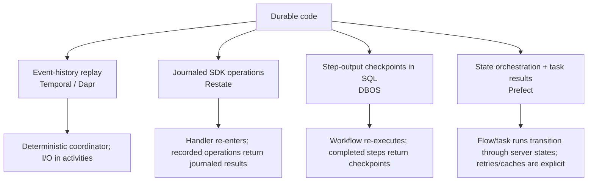
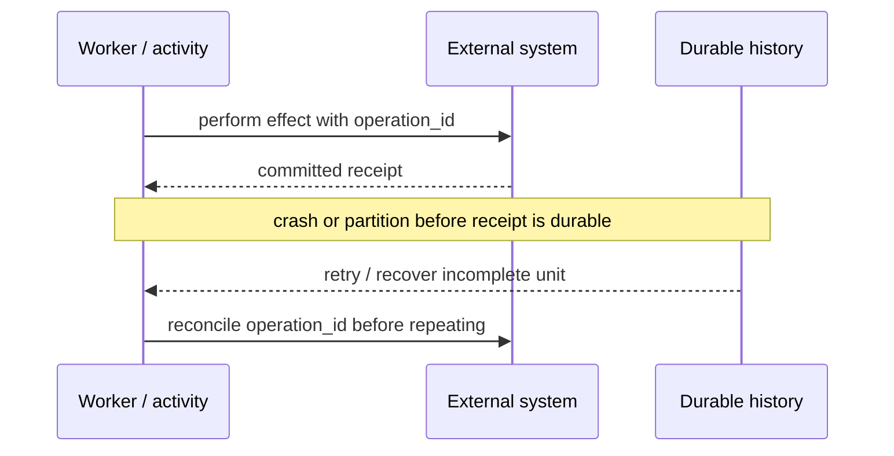

# Durable Agent Workflow Runtimes — Research Packet

**Research date:** 2026-08-31  
**Status:** Research-backed synthesis  
**Scope:** Temporal, Restate, DBOS, Prefect 3, and Dapr Workflow, including current agent integrations  
**Freshness:** Recheck every 30–60 days and on runtime, SDK, storage, or versioning changes

## Research question

Which durable runtime should own a long-lived agent process, and what does each system actually guarantee when workers crash, code changes, an external effect commits ambiguously, a human responds days later, or an operator cancels a run?

## Method and evidence standard

This packet cross-checked current official documentation, runtime and SDK repositories, protocol/architecture material, release notes, integration guides, production case studies, and current issue reproductions. Marketing phrases such as “exactly once” or “always completes” were decomposed into observable boundaries: invocation identity, step dispatch, external effect, result persistence, replay, retry, and cancellation.

Open issues are used as failure-injection leads, not prevalence estimates. Vendor benchmarks and customer numbers are retained only as sizing hypotheses; selection still requires a workload replay on the intended deployment and storage profile.

## Four execution models, not one category

Temporal and Dapr rebuild coordinator state by replaying event history. Restate replays a handler against a journal of SDK operations. DBOS re-invokes a deterministic workflow and substitutes stored step outcomes. Prefect primarily orchestrates flow/task run state and optional persisted results; it is not a transparent deterministic instruction replay engine. These models create different code-change, granularity, storage, and recovery obligations.

## Snapshot comparison

| System | Durable source of truth | Nondeterministic boundary | Long wait | Upgrade strategy | Dominant operational dependency |
|---|---|---|---|---|---|
| Temporal | Server event history | Activity, child workflow, Nexus operation | Durable timers; Signals/Updates | Worker Deployment Versioning, pinning/auto-upgrade, patching, Continue-as-New | Temporal service/Cloud, workers, task queues |
| Restate | Replicated invocation journal plus keyed state | `ctx.run`; service calls and other journaled syscalls | Sleep, durable promise/awakeable, workflow handlers | Immutable deployment pinning; pause/resume on compatible deployment | Restate runtime/Cloud plus user service endpoints |
| DBOS | Postgres workflow/operation tables and step outputs | Step; transaction for database work | Durable sleep, messages, events | Patches or application-version pinning and drain | Postgres; distributed recovery coordination/Conductor |
| Prefect | Orchestration database states plus configured result storage | Task/flow boundary chosen by author | Blocking pause or suspending/rescheduling flow | Versioned deployment config/code artifact discipline; cache/source keys | Prefect API/server/Cloud, workers/infrastructure, result store |
| Dapr Workflow | Event history and inbox in actor state store | Activity or child workflow | Actor-reminder timers; external events; suspend/resume | Workflow versions and patches; Continue-as-New | Dapr sidecars/placement/scheduler, actor-compatible state store, app workers |

## The effect boundary

No runtime can make an arbitrary external API call atomically commit with its own history unless that target participates in the same transaction. The universal failure window remains:

Temporal activities are generally at-least-once and must be idempotent. Restate and DBOS can suppress re-execution after a result is durably recorded, but a `ctx.run`/step can still have committed externally before its result is journaled. Prefect task retries and cache records have the same external-effect caveat. Dapr activities are reminder-driven and can retry. Every effect therefore needs a stable operation ID, target-side idempotency or a lookup, a receipt, and an explicit ambiguous-outcome path.

## Temporal findings

Temporal’s service stores Workflow Event History; workers replay deterministic Workflow code and perform I/O in Activities. Signals deliver asynchronous input, Queries read state without changing it, and Updates provide tracked request/response interaction. Activities need start-to-close/schedule-to-close timeouts and retry classification. Long-running activities need heartbeats both for progress details and timely cancellation delivery.

The current Worker Versioning documentation recommends Worker Deployment Versioning as the default production strategy when versioned deployments are possible. Pinned workflows remain on their starting deployment version; auto-upgrade workflows must remain replay-compatible through patching. Long-lived entity workflows can combine pinning with Continue-as-New to move versions at a controlled boundary. Replay tests against sampled production histories are a release gate.

History is a correctness and capacity resource. Signals, updates, activities, retries, child events, and timers add events. Continue-as-New creates a fresh run/history under the same workflow identity chain; state and unprocessed input must be carried intentionally. Large fan-out should use child trees/batches rather than assuming one history is an unbounded task list.

Python SDK evidence highlights subtle cancellation and concurrency edges: cancellation of non-local activities is delivered through heartbeats, task cancellation does not always cancel an already-started child, and current issues have reproduced nondeterminism around concurrent local activities and cold-start handler ordering. These are version-specific regression fixtures, not a claim that Temporal’s model is broadly nondeterministic.

Sensitive activity/workflow payloads are stored in history. Use a Data Converter/Payload Codec for client-side encryption, minimize payloads, and store large artifacts externally. The workflow sandbox catches many nondeterministic calls but is explicitly not a security sandbox.

Primary evidence: [Temporal Python SDK](https://github.com/temporalio/sdk-python), [Event History](https://github.com/temporalio/documentation/blob/main/docs/encyclopedia/event-history/python.mdx), [Worker Versioning](https://github.com/temporalio/documentation/blob/main/docs/production-deployment/worker-deployments/worker-versioning.mdx), [Temporal server architecture](https://github.com/temporalio/temporal/blob/main/docs/architecture/history-service.md), and [AI security guidance](https://go.temporal.io/platform-hub/ai-engineering/ai-security).

## Restate findings

Restate places a log-first runtime in front of ordinary service handlers. During retry, the SDK re-enters handler code and journaled operations return recorded results. `ctx.run` is the boundary for arbitrary nondeterministic work; Restate service calls, state, timers, and durable promises are journaled syscalls. Native asynchronous combinators must be replaced with SDK-aware deterministic combinators where the SDK requires it.

Restate exposes three useful service shapes: stateless Basic Services, single-writer-per-key Virtual Objects, and once-per-ID Workflows with shared signal/query handlers. A keyed Virtual Object is attractive for an agent inbox or session because writes serialize per key while different keys scale independently. A Workflow fits a finite process whose main handler runs once per ID.

By default, non-terminal failures retry. `TerminalError` and bounded run/handler retry policies are essential for malformed requests, policy denials, exhausted budgets, and permanent provider failures; otherwise an agent can create an infinite cost loop. The default service inactivity timeout can also suspend an unjournaled long call, so model/API calls must be inside `ctx.run` with timeouts tuned to the real latency distribution.

Immutable deployments pin an invocation to the endpoint/version where it started. New calls route to the newest deployment; old endpoints must drain. An affected invocation can be paused and resumed on a new deployment only if the new code is compatible with its existing journal. Restate explicitly advises against day/month-long handlers when keeping old deployments is impractical; split work into shorter invocations/delayed calls.

Self-hosted security needs deliberate ingress/admin/fabric protection. Headers reaching ingress are persisted in the journal, so strip infrastructure credentials. Client-side journal encryption exists but current language support must be checked; the cited Cloud guide documents it for TypeScript. Journal and workflow retention are separate controls.

Primary evidence: [Restate architecture](https://docs.restate.dev/references/architecture), [service types](https://docs.restate.dev/foundations/services), [durable steps](https://docs.restate.dev/develop/ts/durable-steps), [versioning](https://docs.restate.dev/services/versioning), [security](https://docs.restate.dev/server/security), and the [service invocation protocol](https://github.com/restatedev/service-protocol/blob/main/service-invocation-protocol.md).

## DBOS findings

DBOS embeds durable workflows and queues as a library backed by Postgres. It records workflow inputs and outcomes and one output per step. On recovery it calls the workflow again; completed steps return their stored output until execution reaches the first incomplete step. The workflow must call the same steps with the same inputs and order. Randomness, local time, database access, and external I/O belong in steps.

The documented write model is one database write per step plus two per workflow boundary. Payload size directly affects Postgres cost; large model responses and artifacts should be stored externally with references in checkpoints. DBOS reports high single-database throughput, but database topology, connection pressure, step size, retention, and queue contention must be benchmarked locally.

Steps are attempted at least once and should be idempotent. A DBOS transaction can commit application database work and its checkpoint together when they share the transactional boundary, which is stronger than an arbitrary HTTP effect. Workflow IDs act as idempotency keys. Messages sent from a workflow are durably delivered; stream writes from workflows are exactly-once in DBOS’s boundary, while writes from retryable steps may duplicate.

Single-process restart recovery is built in. In a distributed fleet, assigning executor IDs is not enough by itself; interrupted work needs coordinated ownership. The official architecture recommends Conductor for high availability, recovery, observability, management, and retention, or an equivalent self-managed coordinator. Conductor is outside the execution critical path but management reads/actions require a connected executor.

Breaking step-order changes need patch markers or application versioning. With version pinning, old executors must remain until old workflows drain. Current issue history provides strong adoption tests for cancellation-versus-completion races and workflow ID validation because either can affect effect control or recovery identity.

Primary evidence: [DBOS architecture](https://docs.dbos.dev/architecture), [workflow guarantees](https://docs.dbos.dev/python/tutorials/workflow-tutorial), [workflow upgrades](https://docs.dbos.dev/java/tutorials/upgrading-workflows), [recovery](https://docs.dbos.dev/production/workflow-recovery), [communication](https://docs.dbos.dev/python/tutorials/workflow-communication), and [Conductor](https://docs.dbos.dev/production/conductor).

## Prefect findings

Prefect 3 models Python functions as flows and tasks whose server-visible runs transition through states. Tasks provide retries, timeouts, caching, concurrency, and optional transactional/cache semantics. Granularity is explicit: if a whole agent loop is one flow body, a flow retry can restart it; splitting model/tool/effect work into tasks creates more selective retry and observability.

Result persistence is not on by default in the general case and is required for caching and durable reuse. Local default storage does not survive an ephemeral container replacement; distributed deployments need shared object storage or a persistent volume. Prefect’s task cache is an optimization/idempotency mechanism, not target-side effect atomicity. Default `READ_COMMITTED` cache isolation allows concurrent duplicate execution; `SERIALIZABLE` requires an appropriate distributed lock manager.

Prefect transactions coordinate result records and execute rollback/commit hooks. They are application-level compensation semantics, not a distributed ACID transaction over arbitrary APIs. Rollback hooks themselves are side effects and must be safe to retry and observable.

`pause_flow_run` blocks the running process; `suspend_flow_run` reschedules and releases infrastructure, so human waits that may last hours should use suspension. Already-started tasks continue around a pause. Cancellation requires a deployment and a monitoring worker/process that can terminate the recorded infrastructure; unsupported/missing infrastructure identifiers can leave the state marked cancelled without enforcing process termination.

Prefect is therefore strongest when Python/data/ML operations, dynamic mapping, infrastructure work pools, schedules, automations, and operator-visible state are central. It should not be described as transparent replay-equivalent durability unless the exact task/result/idempotency design proves the required effect behavior.

Primary evidence: [flows](https://docs.prefect.io/v3/concepts/flows), [tasks](https://docs.prefect.io/v3/concepts/tasks), [results](https://docs.prefect.io/v3/advanced/results), [caching](https://docs.prefect.io/v3/concepts/caching), [transactions](https://docs.prefect.io/v3/advanced/transactions), [interactive workflows](https://docs.prefect.io/v3/advanced/interactive), and [cancellation](https://docs.prefect.io/v3/advanced/cancel-workflows).

## Dapr Workflow findings

Dapr Workflow runs an event-sourced Durable Task engine inside each Dapr sidecar. Workflow and activity actors store inbox/history/metadata in an actor-compatible state store; the application SDK receives work over gRPC. Workflow code is replayed and must be deterministic, while external I/O belongs in activities.

Actor reminders drive retries and durable timers. External events support human/service input, and child workflows split histories and work. Continue-as-New replaces history and increments a generation, but discards incomplete tasks—including unawaited activities, timers, and children—so a transition must first account for every outstanding unit.

Storage selection changes runtime behavior. Payloads are constrained by the chosen store’s item/batch limits; the official architecture gives a 2 MB Cosmos DB example. Fan-out checkpoint batches can hit transaction limits, histories increase rehydration latency, and completed workflow state persists until retention or purge removes it. There are no global concurrency limits by default, so runaway fan-out can consume a cluster. All workflows and activities registered by one app scale together.

Dapr now documents workflow versions and patches, management APIs for suspend/resume/terminate/rerun/purge, history retention, and concurrency controls. Current release notes and issues demonstrate why exact runtime/SDK/Helm versions need compatibility tests: event-timer reminder leaks, ignored concurrency configuration, sidecar reload failures, and routing regressions have been fixed or tracked recently.

Dapr Agents 1.0 is a separate Python agent framework backed by Dapr Workflow. It can durably wrap LLM/tool work and offers hooks/HITL, but runtime selection should first be based on Dapr’s sidecar, actor-state, placement, security, and operational fit. Dapr 1.18’s history signing/attestation adds tamper evidence; it does not make a false tool result true.

Primary evidence: [workflow architecture](https://docs.dapr.io/developing-applications/building-blocks/workflow/workflow-architecture/), [features](https://docs.dapr.io/developing-applications/building-blocks/workflow/workflow-features-concepts/), [versioning](https://docs.dapr.io/developing-applications/building-blocks/workflow/workflow-versioning/), [management](https://docs.dapr.io/developing-applications/building-blocks/workflow/howto-manage-workflow/), [security](https://docs.dapr.io/concepts/security-concept/), and [Dapr Agents](https://docs.dapr.io/developing-ai/dapr-agents/).

## Cross-runtime acceptance matrix

| Failure/operation | Required proof |
|---|---|
| Crash before external call | Unit resumes without skipping effect |
| Crash after target commit, before local record | Stable operation ID reconciles; no blind duplicate |
| Model rate limit and permanent 4xx | Bounded retry owner; permanent error terminates or becomes model-visible intentionally |
| Human response after redeploy | Exact pending request remains discoverable; input is authenticated and schema/policy revalidated |
| Cancellation during effect | Runtime state and target reality reconciled; late completion cannot silently win |
| Worker/runtime loss | Another compatible worker owns recovery once; stale attempts are fenced or harmless |
| Oldest in-flight run during upgrade | Replay/pin/migrate/drain behavior is proven with stored history |
| History/result growth | Alerts and rollover/retention keep replay latency and storage bounded |
| Large artifact/model output | Durable store contains digest/reference, not an unbounded blob |
| Operator repair | Inspect, pause, retry safe unit, resume, reconcile, compensate, migrate, terminate, and audit |
| UI reconnect | Durable semantic event cursor reconstructs state independently of token stream |
| Sensitive prompt/tool data | Encryption/minimization/retention and UI/CLI access are tested end to end |

## Selection conclusions

- Choose Temporal when a mature cross-language workflow platform, deep histories, worker routing/versioning, and strong operator tooling justify operating or buying a dedicated service.
- Choose Restate when log-first durable services, keyed single-writer objects, service composition, and serverless/container endpoint flexibility fit better than a separate workflow/activity programming split.
- Choose DBOS when library embedding and Postgres-centered operations are the decisive simplification, and the team can own database capacity plus distributed recovery/Conductor decisions.
- Choose Prefect when Python-native data/ML task orchestration, infrastructure provisioning, mapping, schedules, and automations dominate; build effect durability explicitly.
- Choose Dapr Workflow when the organization already wants Dapr’s sidecar/actor/building-block platform and accepts state-store/placement coupling; it is especially natural for a broader Dapr microservice estate.
- Choose none for a short, read-only request. A queue plus an explicit database state machine may be easier to reason about and operate.

## Excluded or downgraded claims

- No vendor’s “exactly once” wording is extended to an arbitrary external side effect.
- Vendor throughput and customer-scale numbers are not comparative benchmarks.
- A framework adapter is not assumed to expose every underlying runtime primitive or guarantee.
- Managed-cloud capabilities are not attributed to the open-source runtime.
- A fixed issue is retained only as a regression test.
- History signing proves integrity of recorded execution, not semantic correctness or authorization.

## Refresh triggers

- Temporal Worker Deployment/Versioning, Update, Nexus, history limit, SDK cancellation, or agent integration changes.
- Restate runtime/service-protocol, encryption-language support, deployment pinning, or invocation repair changes.
- DBOS application versioning, distributed recovery, cancellation, transaction, stream, or Conductor changes.
- Prefect result-persistence defaults, pause/suspend, cancellation, transaction/cache isolation, or worker architecture changes.
- Dapr Workflow versioning, scheduler/reminder, concurrency, history signing, state-store, SDK parity, or Dapr Agents changes.

## Guides supported

- [Selecting a durable runtime for agent workflows](../../comparisons/durable-agent-workflow-runtimes.md)
- [Temporal for agent workflows](../../frameworks/temporal-for-agent-workflows.md)
- [Restate for agent workflows](../../frameworks/restate-for-agent-workflows.md)
- [DBOS for agent workflows](../../frameworks/dbos-for-agent-workflows.md)
- [Prefect for agent workflows](../../frameworks/prefect-for-agent-workflows.md)
- [Dapr Workflow for agent workflows](../../frameworks/dapr-workflow-for-agent-workflows.md)
