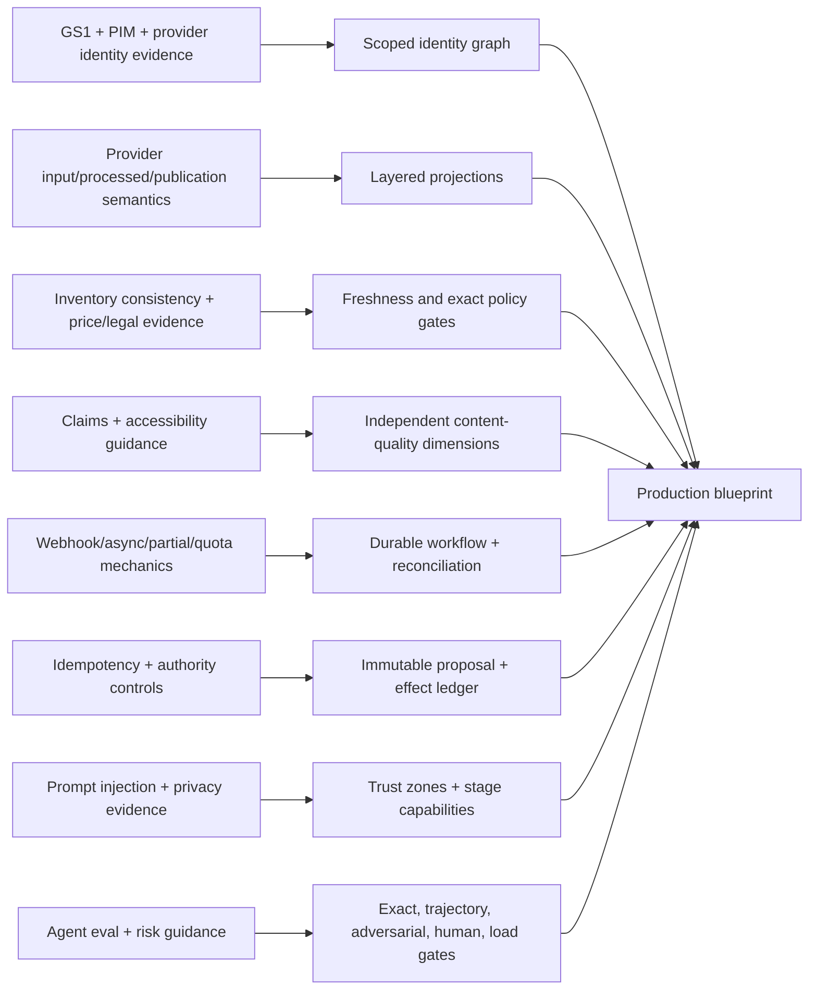

# Research Packet: E-commerce Merchandising and Operations Agent Blueprint

> **Research completed:** 2026-08-31  
> **Derived guide set:** [E-commerce Merchandising and Operations Agent](../../agents/ecommerce-operations-agent/README.md)  
> **Maturity:** research-backed production blueprint, Pass 2 production-depth refinement; provider accounts, editions, product types, jurisdictions, and organizational policies require local validation  
> **Research posture:** primary sources first; current standards, provider APIs, regulator guidance, accessibility material, and production-agent controls were cross-checked  
> **Scope:** product/SKU/variant/catalog identity; offers/listings/channel state; inventory availability evidence; price/promotion guardrails; PIM/OMS/storefront/marketplace integrations; content quality and policy; merchandising recommendations; approved publish/price/promotion effects; returns/conversion observations; reconciliation, rollback, peak scale, and governed evolution

## Executive finding

E-commerce merchandising and operations qualifies as a distinct production-agent category, but the safe implementation is a **commerce control plane with a bounded agent stage**, not an autonomous merchant.

The model can add value in ambiguous classification, exception diagnosis, content drafting, cross-signal synthesis, and recommendation prioritization. It must not become the authority for product identity, inventory, pricing policy, promotion legality, assortment, claims, or live publication. Those remain deterministic services and accountable humans.

Seven source-backed findings drive the architecture:

1. Product, variant, SKU, trade-item, offer, listing, catalog, publication, and market identity are different and provider-scoped; exact identity resolution is a precondition for action.
2. Authoritative, desired, submitted, processed, published, observable, and checkout states are separate. Provider acceptance does not prove a live or correct outcome.
3. Inventory and availability projections can be time-, location-, allocation-, market-, and channel-dependent; this agent can consume evidence but cannot own or manufacture inventory truth.
4. Price and promotion require exact currency, tax, market, catalog, interval, reference-price, and policy semantics. Competitive or conversion signals may support a proposal but cannot authorize a price.
5. PIM completeness and provider validation are necessary but insufficient for factual support, legal claims, localization, accessibility, or customer usefulness.
6. Provider events and APIs are asynchronous, partial, quota-bound, versioned, and mutable. Durable intent, semantic effect identity, `unknown`, read-back, and reconciliation remain application responsibilities.
7. Outcome data is attributed, delayed, confounded, and sometimes privacy-sensitive. It can generate hypotheses only through an offline governed change process.

## Questions investigated

1. Which commerce work genuinely benefits from model-directed reasoning rather than schemas, diffs, schedulers, and dashboards?
2. What boundary separates this category from Marketing Operations, Supply Chain and Logistics, Customer Support, Finance, and Content Editorial?
3. How should product, variant, SKU, GTIN, offer, listing, catalog, publication, market, and provider-account identity be represented?
4. What do current Google Merchant, Amazon SP-API, Shopify, commercetools, and Akeneo interfaces actually guarantee about validation, publication, bulk changes, events, quotas, and processed state?
5. How should availability, money, pricing policy, promotion state, claims, accessibility, returns, and conversion evidence be constrained?
6. How can live content, price, promotion, publication, and withdrawal effects be approved, deduplicated, reconciled, and rolled back safely?
7. What durable state, context, memory, planning, permissions, threat, evaluation, observability, incident, deployment, scaling, and cost controls are required?
8. Which claims remain provider-, jurisdiction-, edition-, or organization-specific and therefore cannot be generalized?

## Research method

The repository's blueprint expansion program, category registry, cross-cutting controls, canonical runtime/security/evaluation guides, and adjacent Marketing Operations, Supply Chain and Logistics, Customer Support, Finance, Procurement, and Content Editorial boundaries were reviewed first.

Internet research then covered:

1. GS1 product-identification and data-model standards;
2. Google Merchant product data, product input/processed state, reports, authentication, quotas, error handling, and concurrent migration guidance;
3. Amazon Listings Items, JSON listings feeds, validation preview, product-type definitions, pricing observations, usage plans, and deprecation/release guidance;
4. Shopify product/variant/catalog/publication/price-list/inventory contracts, mutation/list semantics, webhooks, quotas, bulk operations, security, protected customer data, and returns types;
5. commercetools and Akeneo product-projection, inventory consistency, event, product-model, completeness, and readiness concepts;
6. FTC advertising/deceptive-pricing guidance, EU price-reduction material, W3C accessibility guidance, and PCI boundary guidance;
7. OpenAI, Anthropic, NIST, IETF, W3C/OpenTelemetry, AWS, and repository canonical guidance for agent architecture, context, prompt injection, permissions, idempotency, evaluation, observability, release, and incident response.

Search snippets were used only for discovery. Material mechanics were tied to opened primary/official pages or the repository's cross-cutting synthesis. Vendor marketing claims were not treated as application guarantees. Legal material is included to establish the need for jurisdiction-reviewed policy, not to provide legal advice.

Research was considered saturated for Pass 1 when additional sources stopped changing the category boundary, authority model, core commerce records, effect protocol, major provider caveats, evaluation requirements, or Stage 0–6 path. Saturation is temporary; explicit refresh triggers are part of this packet.

Pass 2 re-opened research around operation-level qualification and practical recovery. Current Google Merchant v1 product/promotion lifecycle, Amazon Listings/Feeds/Notifications and Orders versioning, Shopify list/webhook semantics, commercetools optimistic concurrency/search propagation, Contentful content-version/publish behavior, Algolia asynchronous indexing, EU marketplace/product-safety sources, FTC review guidance and WCAG 2.2 were checked on 2026-08-31. The added guide preserves provider contradictions instead of claiming connector portability. No provider test tenant was available, so documentation findings remain hypotheses to prove at qualification gates Q0–Q6.

## Category promotion record

| Gate | Evidence | Result |
|---|---|---|
| Real-agent fit | Semantic product classification, ambiguous issue diagnosis, evidence-bound content drafting, and cross-signal prioritization involve variable evidence paths | **Pass**, only for measured semantic work; deterministic baseline is mandatory |
| Distinct architecture | Identity graphs, offers/listings, live catalog projections, exact money, availability evidence, channel publication, and provider reconciliation differ from campaigns, fulfillment, support cases, and accounting | **Pass** |
| Buildability | Typed identity/projection/recommendation/proposal/effect records; one durable coordinator; official provider interfaces; test stores/sandboxes/simulators | **Pass with provider-specific gaps** |
| Production depth | Wrong-price/availability risk, destructive bulk semantics, partial async acceptance, suppression, schema drift, peak sale load, and ambiguous commits | **Pass** |
| Evaluation viability | Exact identity/money/target/policy oracles, provider simulators, adversarial fixtures, fault injection, human merch/legal/accessibility review | **Pass** |
| Evidence depth | Current official standards, provider documentation, regulators, web standards, security/eval guidance, and adjacent repository controls | **Pass with jurisdiction/account caveats** |
| Reader value | Compresses recurring catalog, channel, effect, peak, security, and evaluation decisions into one deployable blueprint | **Pass** |

**Promotion decision:** retain and develop category 43, E-commerce merchandising and operations. The blueprint is valuable even where no model is admitted because Stage 0 establishes the correct identity, reconciliation, and authority baseline.

## Boundary and closest overlaps

| Area | E-commerce Operations owns | Neighbor owns | Enforced separation |
|---|---|---|---|
| Marketing Operations | Commerce offer/product readiness and approved channel product state | Audiences, consent, campaign activation, media/send budgets, campaign outcomes | No audience, consent, ad-send, or campaign tools in this registry |
| Supply Chain and Logistics | Consumes versioned availability evidence and flags stale/contradictory channel state | Physical inventory, reservation, allocation, replenishment, fulfillment, returns movement | Inventory writes absent; typed handoff to inventory workflow |
| Customer Support | Consumes de-identified aggregate return/customer-friction observations | Customer identity, case, communication, refund/replacement resolution | No raw case/free-text/customer tools by default |
| Finance | Consumes approved exact price constraints and permitted economics | Accounting truth, cost/margin definition, settlement, tax, close | No ledger/settlement/refund authority; pricing input is signed/versioned |
| Content Editorial | Channel-specific product-field readiness and commerce projection | Source editorial lifecycle, final brand narrative, general content governance | Generated commerce fields remain drafts in editorial/product lifecycle |
| Pricing/legal/product owners | Explains policy result and prepares exact provider projection | Price policy, reference-price/legal interpretation, claims, canonical identity, assortment | Deterministic policy and named approval required before D3 effect |

The category is distinct on registry seams for authoritative objects, external environment, money/publication authority, long-running provider state, and effect recovery.

## Current-version and volatility baseline

| Area | Baseline observed on 2026-08-31 | Consequence |
|---|---|---|
| GS1 Global Data Model | Artifact register exposed v2.17.0 while a general GS1 landing page/search result referenced an older v2.14 release | Pin exact artifact/version; do not trust generic landing-page labels as the runtime contract |
| GS1 Digital Link URI syntax | v1.7.0 was available in the standards reference | Treat as optional identifier/web-link standard; it does not replace internal identity ownership |
| Google Merchant API | v1 documentation and v1beta-to-v1 migration guidance were current; product input and processed product/status remain distinct | Pin API/adapter; monitor migration and deprecation pages; reconcile processed status |
| Google Merchant promotions | v1 insert is whole-resource replacement; provider review/status is asynchronous | Full-payload destructive-semantics tests; separate merchant approval from provider review |
| Google Merchant products | Product input identifier includes content language, feed label, and offer ID; successful insertion does not prove approval/visibility | Include dimensions in identity; read product status and observable state |
| Amazon listings | JSON listings feeds and Listings Items APIs are current; legacy XML/flat-file listing feeds were removed 2025-07-31 | Reject legacy adapter designs; pin current product-type definitions and JSON schema |
| Amazon Orders | Official docs exposed `v2026-01-01` as current with v0 deprecated | Orders stay a minimized read/aggregate boundary; migration and role/sandbox tests are operation-specific |
| Amazon processing | Validation preview and synchronous acceptance are not final listing status; bulk and one-item paths have different limits/lifecycles | Separate effect types, persist feed/job/item state, reconcile every item |
| Shopify Admin GraphQL | Versioned Admin GraphQL schemas; mutation semantics, calculated-cost limits, webhooks, and bulk capabilities vary by API version | Pin dated API version and contract-test list/omission, cost, async, and event behavior |
| Shopify inventory | Current mutation semantics include compare quantity and source-of-truth expectations; idempotency requirements changed in recent versions | Keep mutation excluded from this agent; refresh adjacent inventory integration separately |
| Shopify webhooks | Official guidance states ordering is not guaranteed and delivery cannot be assumed complete | Authenticate/deduplicate quickly; scheduled reconciliation remains mandatory |
| commercetools | Product projections distinguish staged/current; inventory availability can be eventually consistent | Separate draft/live product state and inventory evidence from reservation truth |
| commercetools concurrency/search | Versioned resources return `ConcurrentModification`; search and some aggregate propagation are eventually consistent | Preserve resource version, current/staged/published and search projection as different signals |
| Akeneo | Completeness is configuration-driven; some product-readiness features have edition/rollout limitations | Treat as observation, not universal gate; capability-discover per tenant/edition |
| Contentful CMA | Current resource version is required for optimistic locking; whole-body updates can remove omitted fields; draft/published/delivery states differ | Read-modify-write with version; qualify locale/plan/environment and delivery observation separately |
| Algolia indexing | Index writes are asynchronous and return a task; full replacement is a distinct whole-index operation | Persist task ID, wait and query the derived projection; search never becomes product truth |
| EU marketplace/product safety | DSA trader traceability and GPSR marketplace/product-safety duties were current primary legal sources | Jurisdiction and product-category counsel must translate obligations into effective-dated policy; not legal advice |
| WCAG | WCAG 2.2 remained the current W3C Recommendation baseline checked in this pass | Automated catalog checks are partial; define surface-specific human/assistive-technology evidence |
| OpenTelemetry GenAI | GenAI semantic conventions remain development-stage in the repository research baseline | Pin local telemetry mapping; keep raw content capture off by default |

Every exact quota, schema, scope, region, edition, and policy condition must be rechecked against the target account at design, release, and incident time.

## Evidence-to-decision record

| Claim or decision | Class | Strong source and research date | Conflict or limitation | Blueprint consequence / refresh trigger |
|---|---|---|---|---|
| Product/trade-item identity needs governed allocation and change rules | Standard mechanic | GS1 GTIN Management Standard; accessed 2026-08-31 | GTIN does not replace internal SKU/product/offer identity | Versioned identity graph; ambiguity stop; refresh on GS1 standard revision |
| A layered global/category/region/country product model is useful for interoperable attributes | Standard mechanic | GS1 Global Data Model artifacts; accessed 2026-08-31 | Provider schemas and internal PIM still differ | Versioned mappings with explicit lossy transforms; refresh each artifact release |
| Google product/variant inputs require scoped identifiers and consistent price/availability | Provider mechanic | Google Merchant product data specification; accessed 2026-08-31 | Requirements differ by country/program and evolve | Carry account/language/feed/market dimensions; current spec contract tests |
| Submitted Google product input is not processed/approved/live state | Provider mechanic | Merchant API add/manage products and product compatibility docs; accessed 2026-08-31 | Not all observable layers are exposed synchronously | Separate input/processed/status/observable projections and reconcile |
| Google report conversions can carry attribution semantics, including fractional credit | Provider mechanic | Merchant reports overview/reference; accessed 2026-08-31 | Channel report is not causal or accounting truth | Preserve metric definition/vintage; outcome is observation only |
| Amazon bulk JSON feed and item API differ; legacy listing feeds are removed | Provider mechanic | Listings Items/Feeds docs and removal announcement; accessed 2026-08-31 | Other feed types and eligibility remain account/product dependent | Separate capabilities/effect states; current schema discovery; reject legacy design |
| Amazon validation/acceptance is not final live listing proof | Provider mechanic | Listings API FAQ; accessed 2026-08-31 | Processing/issue timing varies | Preview plus async per-item reconciliation; no success-response completion |
| Marketplace pricing insights can support repricing but do not carry merchant authority | Provider mechanic/inference | Amazon Product Pricing FAQ; accessed 2026-08-31 | Provider describes repricer use cases; business/legal constraints remain merchant-owned | Treat signal as evidence; deterministic pricing policy/human authority stays outside model |
| Shopify product/variant/publication/catalog/price/inventory are separate concepts | Provider mechanic | Shopify Admin GraphQL ProductVariant, PriceList, publication/catalog docs; accessed 2026-08-31 | Exact fields and connections vary by version | Preserve provider-native concepts in adapter; no universal flat product update |
| Shopify list mutation omission can be destructive | Provider mechanic | Shopify `productSet`; accessed 2026-08-31 | Semantics depend on field/mutation/version | Exact adds/changes/clears/deletes and destructive-semantics contract tests |
| Shopify inventory set mutation assumes source-of-truth authority | Provider mechanic | Shopify `inventorySetQuantities`; accessed 2026-08-31 | Adjacent inventory system may legitimately use it | Exclude from this agent; route to inventory owner |
| Webhooks reduce latency but do not guarantee order or completeness | Provider mechanic | Shopify webhook guidance; accessed 2026-08-31 | Delivery/retry details are provider-specific | Durable inbox, authentication, dedupe, source-time handling, scheduled reconciliation |
| PIM completeness is field-presence configuration, not truth/policy/accessibility | Provider mechanic/inference | Akeneo completeness guidance; accessed 2026-08-31 | Readiness/completeness configuration can be valuable | Keep separate quality dimensions and blocking gates |
| Inventory availability projection can lag reservation truth | Provider mechanic | commercetools inventory overview; accessed 2026-08-31 | Exact consistency differs by implementation | Timestamp/version/freshness budget; no agent inventory truth |
| commercetools updates use resource versions and reject version mismatch | Provider mechanic | commercetools general concepts; accessed 2026-08-31 | Background changes can advance versions and search/discount propagation can lag | Version-pin proposals, stop on conflict, and verify customer projection separately |
| Contentful CMA uses optimistic locking and full-body updates can lose omitted fields | Provider mechanic | Contentful CMA overview; accessed 2026-08-31 | Content models, plans, locales, residency, and delivery propagation are tenant-specific | Qualify draft/update/publish operations separately and verify delivery state |
| Algolia indexing operations are asynchronous | Provider mechanic | Algolia asynchronous index operations; accessed 2026-08-31 | SDK, ACL, index/replica, quota and task latency differ | Search is a derived projection; retain task and query postcondition |
| EU consumer marketplaces have trader-traceability and product-safety duties | Regulatory mechanic | EU DSA Regulation 2022/2065 and GPSR Regulation 2023/988; accessed 2026-08-31 | Applicability and required records depend on role, product and jurisdiction | Effective-dated seller/safety gates and legal ownership; no model exception |
| WCAG 2.2 is a current web-accessibility Recommendation | Standard | W3C WCAG 2.2; accessed 2026-08-31 | Conformance scope and law vary; automated checks are incomplete | Accessibility version/scope in policy plus human and assistive-technology evaluation |
| Product claims need truth, non-deception, and support outside provider/model review | Regulatory mechanic/recommendation | FTC advertising guidance; accessed 2026-08-31 | Sector/jurisdiction rules vary | Approved claim registry and human/legal route; refresh on jurisdiction/product category |
| Reference-price rules are jurisdiction-specific | Regulatory mechanic | FTC deceptive-pricing guides; EU price-reduction guidance/CJEU material; accessed 2026-08-31 | Rules/exceptions/national implementation differ | Deterministic jurisdiction-reviewed policy; no global model rule |
| Image text alternatives depend on purpose and context | Web standard guidance | W3C WAI Images Tutorial; accessed 2026-08-31 | Full product-page accessibility extends beyond catalog fields | AI alt text is draft; contextual accessibility review |
| Payment outsourcing does not remove all PCI responsibility | Standards-body guidance | PCI SSC FAQ 1092; accessed 2026-08-31 | PCI scope depends on implementation | Keep card/payment systems and data outside this agent |
| Agent complexity should be added only when measured | Architecture recommendation | Anthropic Building Effective Agents and OpenAI model guidance; accessed 2026-08-31 | General guidance, not commerce-specific | Stage 0 deterministic baseline; one bounded agent by default |
| Tool descriptions need explicit schemas/errors and autonomy boundaries | Provider guidance | OpenAI model guidance; accessed 2026-08-31 | Model-specific details evolve | Version tool bundle; structured outputs; stage capability registry; refresh model/API change |
| Prompt-injection filtering alone is insufficient | Security recommendation | OpenAI prompt-injection architecture article and repository threat guidance; accessed/reviewed 2026-08-31 | No defense guarantees perfect detection | Source-to-sink containment, absent write tools, exact independent authorization |
| Durable workflows do not provide exactly-once external effects | Distributed-systems recommendation | AWS idempotent API guidance and repository cross-cutting controls; accessed/reviewed 2026-08-31 | Downstream support varies | Semantic effect identity, receipts, `unknown`, reconciliation before retry |
| Agent evaluation must inspect state/outcome, trajectory, and repeated stochastic trials | Evaluation recommendation | Anthropic eval guidance, NIST AI RMF/eval-integrity work, repository eval guides; accessed 2026-08-31 | Model/human graders need calibration | Exact critical gates plus semantic/human graders and fault injection |

## Primary source register

### Product identity and interoperability

| Source | Evidence used | Volatility |
|---|---|---|
| [GS1 GTIN Management Standard](https://www.gs1.org/1/gtinrules/en/) | allocation/change logic and stable trade-item identification | Monitor standard revisions |
| [GS1 Global Data Model artifacts](https://ref.gs1.org/standards/gdm/artefacts) | current versioned artifact and layered product attributes | Active releases; pin exact artifact |
| [GS1 Digital Link URI Syntax 1.7.0](https://ref.gs1.org/standards/digital-link/uri-syntax/1.7.0/) | standards-based identification in web URIs | Optional to blueprint; versioned |

### Google Merchant and product search

| Source | Evidence used | Volatility |
|---|---|---|
| [Product data specification](https://support.google.com/merchants/answer/7052112?hl=en-GB) | product/item/variant fields; ID, item group, GTIN, price/availability consistency | High; country/program requirements change |
| [Add and manage products](https://developers.google.com/merchant/api/guides/products/add-manage) | ProductInput, identifier dimensions, refresh behavior, processed status, async upload | High; API lifecycle |
| [Product migration/compatibility](https://developers.google.com/merchant/api/guides/compatibility/products) | submitted ProductInput versus processed read-only Product | High; migration/version changes |
| [Merchant API overview](https://developers.google.com/merchant/api/guides/compatibility/overview) | modular/versioned API and concurrent request direction | High |
| [v1beta to v1 migration](https://developers.google.com/merchant/api/guides/compatibility/migrate-v1beta-v1) | current version migration/deprecation baseline | Immediate refresh after sunset changes |
| [Authentication](https://developers.google.com/merchant/api/guides/quickstart/authentication) | OAuth/service-account mechanisms and broad content scope | High; security/platform policy |
| [Access client accounts](https://developers.google.com/merchant/api/guides/authorization/access-client-accounts) | account relationship/access authorization | High |
| [Quotas and limits](https://developers.google.com/merchant/api/guides/quotas-limits/quotas) | daily/per-minute quota groups and current-account lookup need | High; never hard-code from packet |
| [Error handling](https://developers.google.com/merchant/api/guides/error-handling) | error categories and exponential backoff | High |
| [Reports overview](https://developers.google.com/merchant/api/guides/reports/overview) | product performance reporting and attribution context | High |
| [Product structured data](https://developers.google.com/search/docs/appearance/structured-data/product) | price/availability/product offer representation | High; search feature behavior |
| [Product variants structured data](https://developers.google.com/search/docs/appearance/structured-data/product-variants) | ProductGroup/variant IDs, variant-specific fields and URLs | High |
| [Merchant listing structured data](https://developers.google.com/search/docs/appearance/structured-data/merchant-listing) | Offer, price, availability, shipping/returns signals | High |
| [Promotions specification](https://support.google.com/merchants/answer/2906014?hl=en-GB) | promotion ID/product mapping and provider review | High; program/country variation |
| [Processed products and issues](https://developers.google.com/merchant/api/guides/products/list-products-data-issues) | processing delay, final Product/status/issues, destination state | High; processing and status evolve |
| [Promotions sub-API](https://developers.google.com/merchant/api/guides/promotions/overview) | whole-resource insert, asynchronous review/status and identifier dimensions | High; program/API availability varies |

### Amazon Selling Partner API

| Source | Evidence used | Volatility |
|---|---|---|
| [Listings Items API](https://developer-docs.amazon.com/sp-api/lang-en_EN/docs/listings-items-api) | one-item listing operations, product-type support, marketplace variation | High |
| [Listings feed type values](https://developer-docs.amazon.com/sp-api/lang-US/docs/listings-feed-type-values) | current JSON listings feed and operation semantics | High |
| [Legacy listing feeds removal](https://developer-docs.amazon.com/sp-api/changelog/update-removal-date-of-feeds-api-support-for-xml-and-flat-file-listings-feeds-changed-to-july-31-2025-1) | confirmed 2025-07-31 removal date | Historical decision; monitor successor changes |
| [Feeds API best practices](https://developer-docs.amazon.com/sp-api/lang-US/docs/feeds-api-best-practices) | changed-only submissions, size/frequency guidance | High; quotas/guidance change |
| [Listings API FAQ](https://developer-docs.amazon.com/sp-api/docs/listings-apis-faq) | product-type schema discovery, local validation, validation preview, acceptance limits, bulk behavior | High |
| [Product Pricing FAQ](https://developer-docs.amazon.com/sp-api/docs/pricing-faq) | pricing signals/featured-offer use cases and update path | High |
| [SP-API release notes](https://developer-docs.amazon.com/sp-api/docs/sp-api-release-notes) | schema/API changes and deprecation monitoring | Continuous |
| [Orders API](https://developer-docs.amazon.com/sp-api/docs/orders-api) | current `v2026-01-01` migration/version and read boundary | High; roles, versions and sandbox differ |
| [Notification type values](https://developer-docs.amazon.com/sp-api/docs/notification-type-values) | listing status/issues/quantity event payload versions and incomplete issue coverage | High; subscribe and schema versions evolve |

### Shopify

| Source | Evidence used | Volatility |
|---|---|---|
| [ProductVariant](https://shopify.dev/docs/api/admin-graphql/latest/objects/productvariant) | product/variant/SKU/barcode/inventory/pricing/channel relationships | Versioned quarterly API |
| [`productSet`](https://shopify.dev/docs/api/admin-graphql/latest/mutations/productSet) | scalar versus list omission/replacement semantics | High; contract-test pinned version |
| [`inventorySetQuantities`](https://shopify.dev/docs/api/admin-graphql/latest/mutations/inventorySetQuantities) | source-of-truth and compare-quantity/idempotency semantics | High; excluded authority here |
| [PriceList](https://shopify.dev/docs/api/admin-graphql/latest/objects/pricelist) | context/catalog-bound price overrides | Versioned quarterly API |
| [Webhook fundamentals](https://shopify.dev/docs/apps/build/webhooks) | unordered/non-guaranteed delivery and reconciliation need | High |
| [Webhook verification/delivery](https://shopify.dev/docs/apps/build/webhooks/verify-deliveries) | HMAC, delivery IDs, duplicates, queue/retry handling | High |
| [API limits](https://shopify.dev/docs/api/usage/limits) | calculated cost/app-store buckets, arrays/pagination constraints | High/account-plan dependent |
| [Bulk operations](https://shopify.dev/docs/api/usage/bulk-operations/queries) | asynchronous JSONL reads and current concurrency model | High/version/plan dependent |
| [Security best practices](https://shopify.dev/docs/apps/build/security/following-security-best-practices) | HMAC/session/redirect/official-library controls | High |
| [Protected customer data](https://shopify.dev/docs/apps/launch/protected-customer-data) | minimization/review requirements for customer data | High/policy dependent |
| [Return](https://shopify.dev/docs/api/admin-graphql/latest/queries/return) and [ReturnLineItem](https://shopify.dev/docs/api/admin-graphql/latest/objects/returnlineitem) | return reason and free-text note distinction | Versioned; supports aggregate-only boundary |

### PIM, product projections, and inventory

| Source | Evidence used | Volatility |
|---|---|---|
| [commercetools Product Projections](https://docs.commercetools.com/api/projects/productProjections) | staged/current projections and publication boundary | Active platform API |
| [commercetools general concepts](https://docs.commercetools.com/api/general-concepts) | resource versioning, optimistic concurrency, cohesive updates and eventual propagation | Active platform API |
| [commercetools inventory overview](https://docs.commercetools.com/api/inventory-overview) | availability consistency and reservation distinction | Active platform API |
| [Akeneo product concepts](https://api-prd.akeneo.com/concepts/products.html) | products, product models, variants, edition/version differences | Active API/edition differences |
| [Akeneo available events](https://api.akeneo.com/event-platform/available-events.html) | product/model change/readiness events and event metadata | High/feature rollout dependent |
| [Akeneo completeness](https://help.akeneo.com/v7-your-first-steps-with-akeneo/v7-understand-product-completeness) | configured required-field completeness semantics | Version/configuration dependent |

### CMS, DAM, and search projections

| Source | Evidence used | Volatility |
|---|---|---|
| [Contentful CMA overview](https://www.contentful.com/developers/docs/references/content-management-api/overview/) | optimistic locking, whole-resource update risk, API version header, draft/management boundary | Active platform API/plan/region differences |
| [Contentful entries](https://www.contentful.com/developers/docs/references/content-management-api/entries/) | draft/published versions, entry/locale publishing and optimistic version precondition | Active platform API/plan differences |
| [Algolia asynchronous index operations](https://www.algolia.com/doc/guides/sending-and-managing-data/send-and-update-your-data/in-depth/index-operations-are-asynchronous) | queued indexing task and wait/read-after-write behavior | Active platform and SDK behavior |
| [Algolia replace all records](https://www.algolia.com/doc/libraries/sdk/methods/search/replace-all-objects) | temporary-index whole replacement and task semantics | Active SDK/API; high blast radius |

### Claims, pricing, accessibility, privacy, and payment boundary

| Source | Evidence used | Volatility |
|---|---|---|
| [FTC advertising and marketing](https://www.ftc.gov/business-guidance/advertising-marketing) | truth/non-deception/substantiation foundation | Legal guidance; jurisdiction-specific |
| [FTC Guides Against Deceptive Pricing](https://www.ftc.gov/legal-library/browse/rules/deceptive-pricing) | reference-price/deceptive-pricing risk | Legal guidance; fact-specific |
| [FTC Advertising FAQs](https://www.ftc.gov/business-guidance/resources/advertising-faqs-guide-small-business) | material claims and evidence expectations | Legal guidance; not full sector law |
| [EU price-reduction guidance](https://eur-lex.europa.eu/legal-content/EN/ALL/?uri=CELEX%3A52021XC1229%2806%29) | prior-price framework and exceptions | EU/national implementation varies |
| [CJEU case C-330/23](https://eur-lex.europa.eu/legal-content/EN/TXT/?uri=celex%3A62023CJ0330) | judicial interpretation relevant to announced reductions | Legal counsel required |
| [W3C WAI Images Tutorial](https://www.w3.org/WAI/tutorials/images/) | contextual text-alternative guidance | Living guidance; page updated 2026 |
| [W3C WCAG 2.2](https://www.w3.org/TR/WCAG22/) | current accessibility Recommendation and combined automated/human evaluation need | Standard plus errata/supporting guidance |
| [WCAG 2.2 target size understanding](https://www.w3.org/WAI/WCAG22/Understanding/target-size-minimum.html) | product-page interaction accessibility context | Site UI boundary, not just catalog field |
| [EU Accessibility Act directive](https://eur-lex.europa.eu/eli/dir/2019/882/oj/eng/pdf) | e-commerce accessibility scope evidence | Implementation/jurisdiction/legal review required |
| [PCI SSC FAQ 1092](https://www.pcisecuritystandards.org/faqs/1092/) | outsourcing payment does not remove all responsibility | Exact PCI scope requires assessment |
| [FTC endorsements, influencers, and reviews](https://www.ftc.gov/business-guidance/advertising-marketing/endorsements-influencers-reviews) | review/endorsement authenticity, material connection and manipulation control domain | Legal guidance/rules are jurisdiction and fact specific |
| [EU Digital Services Act](https://eur-lex.europa.eu/eli/reg/2022/2065/oj/eng) | online-marketplace trader traceability | Applicability/role/local enforcement require legal review |
| [EU General Product Safety Regulation](https://eur-lex.europa.eu/eli/reg/2023/988/oj/eng) | online-marketplace product-safety/traceability control domain | Product/operator/jurisdiction-specific legal review |

### Agent architecture, security, evaluation, and operations

| Source | Evidence used | Volatility |
|---|---|---|
| [OpenAI model guidance](https://developers.openai.com/api/docs/guides/latest-model) | explicit autonomy, structured tool descriptions/errors, context monitoring, eval before model changes | High; model/API guidance evolves |
| [OpenAI prompt-injection design](https://openai.com/index/designing-agents-to-resist-prompt-injection/) | source-sink containment and constrained impact | Active research/guidance |
| [Anthropic Building Effective Agents](https://www.anthropic.com/engineering/building-effective-agents) | simplest composable workflow; distinguish workflows/agents | Active guidance |
| [Anthropic context engineering](https://www.anthropic.com/engineering/effective-context-engineering-for-ai-agents) | high-signal context, compaction, notes, isolation trade-offs | Active guidance |
| [Anthropic agent evals](https://www.anthropic.com/engineering/demystifying-evals-for-ai-agents) | outcome/trajectory evaluation, trials, grader mix | Active guidance |
| [NIST AI RMF](https://www.nist.gov/itl/ai-risk-management-framework) | risk governance structure and current revision awareness | AI RMF 1.0 under revision at research date |
| [NIST evaluation integrity article](https://www.nist.gov/caisi/cheating-ai-agent-evaluations) | contamination/grader-gaming risks | Emerging guidance |
| [OAuth 2.0 Security BCP, RFC 9700](https://www.rfc-editor.org/rfc/rfc9700.html) | current OAuth security baseline | Standards track/BCP |
| [OAuth resource indicators, RFC 8707](https://www.rfc-editor.org/rfc/rfc8707.html) | audience/resource-bound access tokens | Provider support varies |
| [AWS retry/idempotency guidance](https://aws.amazon.com/builders-library/making-retries-safe-with-idempotent-APIs/) | semantic idempotency and retry safety | General distributed-systems guidance |

## Findings synthesized across sources

### Identity is a scoped graph

GS1 provides stable trade-item identification rules, but commerce operations still needs internal products, variants, SKU namespaces, offers, seller accounts, markets, catalogs, and provider-native resource IDs. No one key can safely replace the graph. Similarity can aid a reviewer but cannot authorize merge, GTIN reuse, or target selection.

### Provider state has layers

Google's ProductInput/processed product status, Amazon validation/processing, Shopify publication/catalog state, and commercetools staged/current projections all reject a single `active` flag. The architecture therefore keeps authoritative, desired, submitted, processed, published, observable, and checkout-eligible projections separately.

### A write response is a transport fact

Google and Amazon may accept input before later issue/policy processing. Shopify/provider webhooks are not complete ordered truth. A receipt proves only what its documented semantics say. Completion requires provider-native postcondition reads and per-item reconciliation.

### Inventory and price require external authority

commercetools documents availability consistency considerations; Shopify's inventory mutation assumes source-of-truth authority. These support a strict read-only availability boundary. Pricing APIs expose signals and write paths, but business cost, legal, tax, market, reference-price, and commercial strategy remain external constraints. The model can explain, not decide.

### Completeness is not quality

Akeneo completeness is configuration-driven required-field presence. Google/Amazon validation is provider conformance. FTC and W3C guidance introduce factual support and contextual accessibility. The blueprint maintains separate blocking dimensions rather than one weighted score.

### Events plus reconciliation, not events versus reconciliation

Authenticated events reduce detection latency. Duplicate, out-of-order, delayed, and missing delivery, plus provider async processing, require durable inbox handling and periodic reads. Event ingestion and reconciliation solve different problems.

### Native provider semantics must survive abstraction

Amazon feeds versus item operations, Shopify list replacement/cost buckets, and Google product processing cannot be hidden behind a generic `updateProduct`. A common envelope can standardize tenant binding, authority, receipts, and telemetry while adapters expose their native lifecycle and errors.

### Outcome observations need an adoption barrier

Marketplace/shop reports, returns reasons, and conversion signals are delayed, attributed, incomplete, and confounded. They generate hypotheses. Only a reviewed change candidate that passes offline, adversarial, full-bundle, and canary gates can modify behavior.

## Architecture decision records

### ADR-ECOM-001: one durable coordinator with a bounded agent stage

**Decision:** use one durable workflow coordinator; deterministic services handle exact rules, a model handles bounded semantic tasks, and separate approval/effect components own authority and external changes.

**Why:** long-lived approvals, async provider processing, quotas, cancellation, and recovery require durable state. One bounded agent minimizes handoffs and permissions.

**Rejected:** a stateless chatbot, unconstrained ReAct loop, or multi-agent organization by default.

### ADR-ECOM-002: systems of record remain external

**Decision:** PIM/product master owns product identity; inventory/OMS owns availability truth; pricing/promotion service and humans own commercial policy; channels own processed observations; the control plane owns only run/effect evidence.

**Why:** copying volatile commerce truth into agent memory creates drift and unauthorized shadow state.

### ADR-ECOM-003: scoped identity graph and ambiguity stop

**Decision:** represent product, variant, SKU namespace, GTIN, offer, account, market, catalog, listing, and publication bindings with history.

**Why:** provider and GS1 evidence show different scopes/cardinalities. Ambiguity cannot be solved safely by semantic similarity alone.

### ADR-ECOM-004: layered projections

**Decision:** store authoritative, desired, submitted, processed, published, observable, and checkout states independently.

**Why:** current provider APIs explicitly separate inputs and processed/live states; async acceptance is incomplete evidence.

### ADR-ECOM-005: availability evidence and exact money

**Decision:** use freshness-bound versioned availability observations and exact money/promotion contracts. Exclude inventory mutation. Require deterministic pricing/promotion policy output.

**Why:** availability is contextual/eventually consistent; money and price-reduction policy cannot tolerate model-inferred units or jurisdiction.

### ADR-ECOM-006: native adapters inside a common control envelope

**Decision:** standardize tenant, authority, proposal, idempotency, receipt, timeout, and telemetry fields; retain provider-native mutation, batch, partial, quota, schema, and lifecycle semantics.

**Why:** a generic product API hides destructive and recovery-critical behavior.

### ADR-ECOM-007: prepare, authorize, commit, reconcile

**Decision:** D3 effects require immutable proposals, exact expiring approval, commit-time policy/source revalidation, semantic effect identity, narrow commit workers, and read-back.

**Why:** model output is not authorization, workflow “exactly once” cannot span provider effects, and success responses do not prove postconditions.

### ADR-ECOM-008: query-built context and minimal governed memory

**Decision:** build a versioned task packet from current evidence; keep run/effect state durable; admit only reviewed scoped/expiring memory.

**Why:** catalog facts, prices, inventory, policies, and channel states change too quickly for conversational/vector memory.

### ADR-ECOM-009: outcome feedback is offline and governed

**Decision:** aggregate privacy-reviewed observations produce change candidates; no direct online self-learning or outcome-triggered effects.

**Why:** attribution, returns, seasonality, promotions, inventory, and campaigns confound outcomes; silent adaptation breaks release evidence.

### ADR-ECOM-010: scale by tenant/account/market/effect and protect correction lanes

**Decision:** partition quotas and workers around provider failure/credential boundaries; separate analysis, bulk, commit, reconciliation, and emergency lanes.

**Why:** peak merchandising events are bursty, account-throttled, and require correction capacity even when low-priority enrichment is overloaded.

## Tool acceptance decisions

| Tool family | Decision | Conditions |
|---|---|---|
| PIM/product read | Accept D1 | Tenant/field/revision scoped; no source write |
| Inventory/OMS availability read | Accept D1 | Purpose-limited, version/time/market/fulfillment dimensions |
| Inventory quantity/reservation write | Reject | Route to Supply Chain/Inventory workflow |
| Provider product/status/report read | Accept D1 | Account/market bound; normalize with pinned adapter; preserve attribution semantics |
| Provider validation preview/test store | Accept D2 | Immutable proposal; no live publication; receipt/audit |
| Internal product-content draft/task | Accept D2 conditionally | Reversible draft; product/editorial owner and retention |
| Live content/publication/withdrawal | Accept D3 narrowly | Exact approval, commit revalidation, effect ledger, read-back, kill switch |
| Live price/promotion projection | Accept D3 only for already-authorized exact values | No model-selected values/eligibility; pricing/legal policy decision required |
| Bulk live operation | Accept D3 with stricter limits | Immutable target set, full deterministic validation, canary, per-item outcome |
| Customer/support/order/refund/payment | Reject | Neighbor workflow owns it |
| Browser/RPA | Reject by default; exceptional D3 | No supported API, dedicated account, exact approval, tiny canary, UI assertions, read-back |
| Dynamic unreviewed plugin/MCP write | Reject | Must be admitted, pinned, wrapped, contract-tested, and effect-policy controlled |
| Credential/policy/approver/tool-registry mutation | D4 proposal only | Separate administrative control plane |

## Material disagreements and resolved positions

### Provider acceptance versus live success

**Tension:** APIs describe successful insert/submission/acceptance; operators need correct live state.  
**Resolution:** call the transport result `submitted`; require processed-status and observable postcondition verification. Unknown remains explicit.

### PIM completeness versus product readiness

**Tension:** configured completeness is operationally useful; content can still be false, illegal, inaccessible, or rejected.  
**Resolution:** keep completeness as one dimension. Identity, facts, claims, accessibility, localization, provider conformance, and checkout readiness have independent gates.

### Webhooks versus polling

**Tension:** webhooks reduce latency; delivery is not ordered/complete.  
**Resolution:** authenticate/deduplicate events for fast projection updates and run scheduled authoritative/processed reconciliation.

### Competitive pricing insight versus autonomous repricing

**Tension:** marketplaces support repricers and expose competitive signals; the category boundary reserves price policy and high-impact discounts.  
**Resolution:** signals may rank a recommendation. Only the pricing service/human owner supplies exact authorized price; the agent never self-authorizes.

### Provider scope versus application capability

**Tension:** some OAuth/provider scopes combine broad read/write authority.  
**Resolution:** provider least privilege plus a narrower application capability registry, account binding, isolated workers, and effect grants.

### Standardized connector versus provider-native semantics

**Tension:** a unified adapter is easier to call; it can hide list deletion, partial async processing, quota units, and status meanings.  
**Resolution:** unify the safety envelope only; expose native operation types and lifecycle in versioned contracts.

### Availability display versus inventory truth

**Tension:** storefront/marketplace availability is commercially visible; reservation/source projections can differ.  
**Resolution:** display state is an observation. Inventory/OMS remains truth and supplies freshness-bound evidence; checkout contradiction is an incident.

### Conversion/returns optimization versus causal learning

**Tension:** feedback appears to show what works; attribution and reasons are confounded/delayed.  
**Resolution:** generate hypotheses and governed experiments; never directly update production rules or publish effects.

### Multi-agent specialization versus simplicity

**Tension:** catalog, pricing, content, and incidents suggest specialist agents.  
**Resolution:** use stage-specific context/tools under one coordinator. Split only after evaluation proves quality/isolation value and the specialist has narrower authority.

## Rejected designs

| Design | Rejection reason |
|---|---|
| Autonomous commerce manager with broad admin token | Combines untrusted content, probabilistic reasoning, and high-impact price/publication authority |
| Model-owned catalog/vector database as truth | Stale, lossy, difficult to delete, and lacks canonical revision/authority |
| One `product_status` field | Hides submitted/processed/published/observable/checkout differences |
| Generic `updateProduct` connector | Hides native list replacement, async jobs, partial results, schemas, quotas, and postconditions |
| Blind “retry on error” | Duplicates or overwrites ambiguous external effects |
| Webhook-only projection | Cannot guarantee completeness/order/current state |
| Provider validation as legal/content approval | Provider conformance does not prove factual evidence, accessibility, or jurisdictional legality |
| Agent inventory correction | Creates competing inventory truth and oversell risk |
| Autonomous repricing/promotion | Business, legal, margin, tax, and customer-impact authority is missing |
| Raw returns/support notes for model insight | Unnecessary personal/sensitive content and cross-category authority |
| Browser-first automation | Fragile targets, weak idempotency, difficult recovery, excessive account authority |
| Online self-learning from conversion | Confounded feedback can silently change behavior and optimize proxies |
| Always-on multi-agent swarm | Adds handoff, state, cost, latency, and permission failure without demonstrated value |

## Full architecture evidence chain

## Stage evidence requirements

| Stage | Evidence required before promotion |
|---|---|
| 0 — Deterministic baseline | owner/boundary sign-off; identity/projection map; rule quality; manual effect and reconciliation metrics; provider versions |
| 1 — Bounded assistant | semantic value versus baseline; evidence fidelity; ambiguity/refusal; D0/D1-only proof; injection and tenant tests |
| 2 — Controlled MVP | immutable proposal/approval, sandbox/test-store receipts, adapter destructive/partial/schema tests, rollback preview |
| 3 — Reliable v1 | crash/cancellation/duplicate/unknown/partial recovery, webhook convergence, quota/circuit controls, incident drills |
| 4 — Production | critical hard gates, narrow D3 canary, real postcondition proof, on-call/kill switch/rollback sign-off |
| 5 — Peak scale | burst/soak/quota/fairness evidence, reserved correction capacity, coalescing correctness, account/region containment |
| 6 — Governed evolution | full-bundle provenance/eval/canary/rollback for every behavior change; no online self-learning path |

## Research-to-guide traceability

| Evidence theme | Canonical guide |
|---|---|
| Category qualification, seams, authority, deterministic alternative | [01 — Mission, boundaries, and workload fit](../../agents/ecommerce-operations-agent/01-mission-boundaries-and-workload-fit.md) |
| Durable coordinator, components, trust zones, native adapters, provider lifecycle | [02 — Reference architecture, runtime, and integrations](../../agents/ecommerce-operations-agent/02-reference-architecture-runtime-and-integrations.md) |
| GS1/provider identity, variant grouping, layered projections, drift | [03 — Catalog identity, offers, and channel state](../../agents/ecommerce-operations-agent/03-catalog-identity-offers-and-channel-state.md) |
| Availability evidence, exact money, price/promotion authority, merchandising | [04 — Availability, pricing, promotions, and merchandising](../../agents/ecommerce-operations-agent/04-availability-pricing-promotions-and-merchandising.md) |
| Completeness, claims, accessibility, localization, untrusted content, returns/conversion | [05 — Content quality, policy, and outcome signals](../../agents/ecommerce-operations-agent/05-content-quality-policy-and-outcome-signals.md) |
| Tool matrix, prepare/authorize/commit/reconcile, idempotency, recovery | [06 — Tools, effects, reconciliation, and recovery](../../agents/ecommerce-operations-agent/06-tools-effects-reconciliation-and-recovery.md) |
| Durable state, context manifests, bounded planning, compaction, governed memory | [07 — State, context, memory, and planning](../../agents/ecommerce-operations-agent/07-state-context-memory-and-planning.md) |
| Threat model, tenant/credential/approval security, prompt injection, privacy, governance | [08 — Security, privacy, permissions, and governance](../../agents/ecommerce-operations-agent/08-security-privacy-permissions-and-governance.md) |
| Reliability, SLOs, traces, evals, release gates, incidents | [09 — Reliability, observability, evaluation, and incidents](../../agents/ecommerce-operations-agent/09-reliability-observability-evaluation-and-incidents.md) |
| Stage 0–6, peak scale, capacity, quotas, DR, cost, governed evolution | [10 — Deployment, peak scale, cost, and governed evolution](../../agents/ecommerce-operations-agent/10-deployment-peak-scale-cost-and-governed-evolution.md) |
| Operation-level provider qualification, multi-channel partial effects, worked recovery and practice gates | [11 — Qualified adapters and worked commerce flows](../../agents/ecommerce-operations-agent/11-qualified-adapters-and-worked-commerce-flows.md) |

## Known limitations after Pass 2

- No target organization's PIM, OMS, pricing, tax, promotion, legal, brand, IAM, or incident policy was available; typed contracts are blueprints, not deployable policy.
- Provider documentation does not guarantee every account, marketplace, product type, plan, region, or beta feature behaves identically. Capability discovery and sandbox/account tests are mandatory.
- Exact Google Merchant, Amazon, Shopify, and PIM quotas/status propagation can change and may be account-specific. No numeric limit in this packet should be copied into static policy.
- The public GS1 version surfaces showed release-label drift. The blueprint therefore requires exact artifact pinning but does not prescribe an enterprise identifier-governance implementation.
- Legal and accessibility sources establish design constraints, not compliance certification or legal advice. Category/market counsel and accessibility specialists remain required.
- Marketplace/storefront observable/checkout state may not have an official machine-readable endpoint in every channel; synthetic or browser verification introduces separate risk and must be scoped.
- Returns and conversion source semantics vary widely. The packet does not prescribe a universal metric, causal design, or minimum cell size.
- No production benchmark establishes a universal model, token budget, latency, SLO, or autonomy threshold. Those are stage-gated local decisions.
- Browser/RPA and some marketplace UI-only operations remain intentionally underspecified because supported APIs are preferred and terms/security must be reviewed locally.
- The blueprint does not design physical returns, fulfillment, payment, refund, customer communication, accounting, tax calculation, or marketing audience systems.
- Representative adapter manifests are design templates, not proof of qualification. No live Akeneo, commercetools, Shopify, Google Merchant, Amazon, Contentful, Algolia, OMS, pricing, analytics, or notification tenant was available for role, quota, schema, timeout, partial-write, propagation, or postcondition testing.
- Product-safety, restricted-goods, seller-traceability, price/promotion, personalization, brand/IP, reviews, privacy and accessibility material defines control requirements only. Local counsel, compliance, trust/safety, rights owners and accessibility specialists must make deployment decisions.
- No universal rollback exists for a partially active multi-channel price or promotion. Customer exposure, provider review, redemption and local law can make withdrawal or a newly approved correction safer than inversion.

## Refresh plan

| Trigger | Owner(s) | Required refresh |
|---|---|---|
| GS1 GTIN/GDM/Digital Link revision | Product data governance | Identity/mapping contracts and regression corpus |
| Google Merchant API/spec/policy/quota change | Google connector owner | Adapter manifest, schemas, issue/status simulator, contract/load tests |
| Amazon SP-API/product-type/feed/pricing/deprecation change | Amazon connector owner | Capability matrix, JSON schemas, rate/batch/partial tests, migration plan |
| Shopify quarterly API/webhook/limit/security/data-policy change | Shopify connector owner | Pinned version, list/idempotency/cost/event tests, scopes/privacy review |
| PIM/OMS/pricing platform version or ownership change | Domain platform owners | Source/projection/freshness/authority contracts and DR tests |
| Advertising/price-reduction/product/accessibility/privacy/payment law/guidance change | Legal/privacy/accessibility/security | Jurisdiction policy, required approval/evidence, relevant eval cases |
| Model snapshot/API/context/compaction/tool-calling/data-use change | Agent platform owner | Full affected behavior-bundle and privacy/security evaluation |
| New provider, market, category, effect, data source, or tenant class | Category owner + domain/security | Boundary/risk/source research, capability admission, stage gates |
| Incident, near miss, or systematic rejection/suppression | Incident/category/connector owner | Root cause, new case/guardrail/runbook, full affected release evidence |
| Material outcome/evaluator drift | Product/evaluation owner | Dataset/grader integrity review, behavior candidate—not online update |
| Scheduled review | Category owner | Quarterly provider/version scan; annual broad architecture/legal/evidence review, sooner on trigger |

## Research quality checklist

- [x] Repository program, registry, cross-cutting controls, and adjacent boundaries were inspected.
- [x] Current official standards, provider docs, regulator/accessibility guidance, and agent/security/eval sources were researched before writing.
- [x] Provider input, processed, publication, event, quota, batch, and partial-failure mechanics were compared.
- [x] Pass 2 added operation-level PIM/commerce/marketplace/OMS/pricing/CMS/search/analytics/notification qualification and worked multi-channel recovery evidence.
- [x] Product identity, availability, money, promotion, content, outcome, and effect authority were separated.
- [x] Contradictions and provider/jurisdiction limitations are explicit.
- [x] Deterministic alternatives and rejected agent designs are documented.
- [x] Architecture, runtime, tools, state, context, memory, permissions, reliability, evaluation, incidents, scale, cost, and Stage 0–6 are traced to guides.
- [x] Mermaid diagrams explain identity, architecture evidence, and release stages rather than decorating the packet.
- [x] Primary source links and the 2026-08-31 research date are preserved for refresh.
- [ ] Target-organization policy, provider accounts, sandboxes, real data, SLOs, and legal/accessibility decisions still require implementation-time validation.
