# Research Packet: Executive Operations Agent Blueprint

> **Research status:** Complete for the 2026-08-31 blueprint baseline  
> **Research window:** 2026-08-30 to 2026-08-31  
> **Artifact:** [Executive Operations Agent](../../agents/executive-operations-agent/README.md)  
> **Scope:** Zero-to-production-and-scale architecture for inbox, calendar, chat/communications, task, document/e-sign, travel, expense, CRM, meeting, and durable follow-up operations across personal and executive-delegate contexts.

This packet records the evidence behind the blueprint. It separates source facts from design synthesis, names provider differences that cannot be safely abstracted away, and identifies where contract tests, legal review, or production evidence are still required.

## Research questions

1. What autonomy model keeps an operations agent useful without allowing language-model output to become authority?
2. How should human principal, delegate, workload identity, tenant, provider account, and visible send identity be represented?
3. What are the real sync, ID, version, notification, send, task, document, and meeting-artifact semantics of Google Workspace and Microsoft 365?
4. Which provider primitives support idempotency, and where must the system reconcile unknown outcomes?
5. Which work belongs in deterministic workflow code, a model controller, an agent framework, or a durable workflow engine?
6. How should long-lived priorities, objectives, preferences, and follow-up state be stored without turning memory into hidden authority or a private-data warehouse?
7. What security, privacy, payment, recording, tenant-isolation, audit, and operational controls are necessary?
8. Which benchmarks and evaluation methods are useful, and where do they lack external validity for executive operations?
9. What exact identity and version semantics prevent contact, relationship, recurrence, thread, booking, expense, document, effect, and handoff ambiguity?
10. Which operation-level scopes, permissions, IDs, versions, idempotency/concurrency rules, callbacks, rates, restrictions, and prohibited uses must an adapter manifest preserve?
11. What evidence must Stage 0–6 produce for invariant, trajectory, outcome, human-factor, capacity, disaster-recovery, incident, and governed-change claims?

## Method and source selection

Research used current official API documentation, standards, official repositories, security/compliance guidance, and peer-reviewed or primary benchmark publications. Provider behavior was cross-checked across change-notification, synchronization, resource, and write endpoints rather than inferred from marketing overviews.

Sources were selected in this order:

1. provider and standards-body documentation;
2. official repositories and maintained specifications;
3. peer-reviewed papers and benchmark sites/repositories; and
4. maintainer discussions only for limitations not stated in formal documentation.

No live provider integration or contractual/legal review was performed. Exact enterprise behavior remains subject to tenant policy, plan, national cloud, provider rollout, and customer configuration.

Unless a row states otherwise, every source below was last accessed on **2026-08-31**. “Current” means current on that access date, not a timeless guarantee. API version, release channel, account/edition, distribution class, region/cloud, and commercial-contract limits are recorded in the baseline or row annotation. Provider names are qualification examples, not recommendations or endorsements.

## Executive conclusions

```mermaid
flowchart LR
    A[Provider change feeds] --> B[Permission-aware read models]
    B --> C[Minimum source-linked context]
    C --> D[Model produces typed proposal]
    D --> E[Identity, capability, risk, and freshness policy]
    E --> F[Effect-bound approval when required]
    F --> G[Provider-specific commit adapter]
    G --> H[Effect ledger]
    G --> I[Authoritative verification/reconciliation]
    I --> H
    H --> J[Durable objective and follow-up]
```

- A thin single-controller architecture is the best default. It is easier to authorize, test, operate, and audit than a multi-agent organization.
- Webhooks are hints. Cursor/delta synchronization is the convergence mechanism.
- The model may classify, summarize, compare, and propose. Deterministic code resolves identity, enforces capability, binds approvals, checks freshness, commits, and reconciles.
- Per-user delegated OAuth is the default. Application permissions/domain-wide delegation are separately governed enterprise modes with resource scoping and explicit impersonated-subject audit.
- The provider is authoritative for messages, events, tasks, documents, bookings, and artifacts. Local summaries and memory are caches.
- Consequential approval must bind to the exact identity, recipients/attendees/share principals, resource versions, amount/terms, effect digest, and expiration.
- Google and Microsoft expose different ID, cursor, task, notification, and delivery semantics. The adapter layer must preserve them.
- Exactly-once is not a general guarantee. Use provider idempotency primitives where documented and reconcile ambiguous results everywhere else.
- Durable workflows are justified by multi-day waits and crash recovery—not by the presence of an LLM.
- Generic agent benchmarks inform scenario design; only product-specific simulated-provider and contract tests can gate releases.
- Entity identity is typed and provider-scoped. Display names, subjects, URLs, and approximate times are search attributes, not keys; ambiguous records remain separate.
- Exactly seven memory lifetimes are allowed, each with an admission, retention/deletion, poisoning, and evaluation policy. Retrieval indexes and audit/effect records are not extra personalization lifetimes.
- Compaction receipts are restart indexes, not truth. Restart, failover, handoff, and model/provider switch rehydrate identity, ledgers, clocks, provider resources, and unknown effects before a write can resume.
- Provider capability is qualified per operation. Scope, visible actor, ID/version, idempotency, callback recovery, rate/concurrency, restrictions, test evidence, and kill switch are part of the runtime manifest.
- E-sign send is not signature; expense submission is not approval/payment; travel acceptance is not ticketing/fulfillment; chat/mail provider acceptance is not human delivery or reading.

## Decision ledger

| Decision | Selected approach | Evidence and rationale | Rejected/default-not-selected alternative |
|---|---|---|---|
| Autonomy | Capability-by-capability bounded initiative | High-impact tools, prompt injection, and stochastic long-horizon reliability make a global autonomy level unsafe | “Chief of staff” persona with broad write access |
| Planning/execution | Model returns typed proposals; deterministic system commits | Strict schemas reduce shape errors but do not establish authority or truth | Direct model access to send/book/share tools |
| Sync | Durable notification inbox plus delta/cursor/full-sync recovery | Google and Microsoft notifications can be duplicated, delayed, content-free, or dropped | Webhook payload as source of truth |
| Identity | Issuer+subject principal; separate delegate, service actor, tenant, connection, visible identity | OIDC identity semantics and provider delegation differences | Email address or access token as identity |
| OAuth | Delegated per-user by default; incremental scopes | Least privilege and user-bound authority | App-only/domain-wide access for convenience |
| Approval | Canonical effect digest, material preview, expiry, commit-time revalidation | Prevents approval reuse after recipient, price, account, or source drift | Free-text “yes” stored against a conversation |
| Mail send | Draft/approve/send once; acceptance, sent state, and delivery separate | Graph `202` is not delivery; Gmail draft/send lacks general idempotency | Blind retry after timeout |
| Calendar create | Client-keyed create where supported; ETag/version on edits | Google client IDs, Graph `transactionId`, Google `If-Match` | Search by title/time as sole dedupe |
| Task model | Stable internal work item plus provider-native semantics | Google date-only due and Graph permission/ID limitations do not normalize cleanly | Universal task schema that discards provider meaning |
| Memory | Explicit, scoped preferences; source-linked summaries; provider truth | Minimizes privacy risk and stale action | Unbounded conversational/vector memory |
| Runtime | Relational state machine + durable queue first | Simpler operational model; adequate until long waits/compensation become complex | Workflow engine from day one |
| Framework | Provider SDK + thin controller; optional agent SDK/graph only when measured | Frameworks help harness/state, not identity or transaction correctness | Framework-owned policy and persistence |
| Tool interoperability | Narrow adapters; MCP optional behind the same policy/effect boundary | MCP improves interoperability but adds trust/auth/tool-description surface | Raw remote MCP tools with upstream tokens |
| Travel/payment | Research automatically; reprice and itemized approval before booking; tokenized payment | Supplier flows separate search/price/order; PCI boundaries | Agent-held card data or autonomous substitution |
| Meeting capture | Human-at-meeting control under tenant policy/consent | Provider artifact/consent/retention behavior and jurisdictional variability | Default background recording/transcription |
| Evaluation | Deterministic simulated world, provider contract tests, shadow/canary, repeated trials | Exact state/action oracles are required for safety and reliability claims | Chat demos or generic benchmark score only |
| Entity semantics | Typed internal ID plus provider/tenant/account/resource identity and explicit version lineage | Prevents display-name, thread, recurrence, booking, copy/move, and handoff aliasing | Generic string IDs and title/subject/time matching |
| Memory policy | Seven named lifetimes; derived indexes inherit source ACL/retention | Different poisoning, deletion, and recovery properties require separate policies | One vector/conversation memory with implicit promotion |
| Continuity | Loss-aware receipt plus authoritative rehydration and invariant verification | Summaries/checkpoints can omit or misstate effects and authority | Resume from chat summary or model/provider conversation token |
| Provider enablement | Operation-level manifest and qualification gate | Provider products contain operations with different scopes, side effects, limits, and prohibited uses | “Connector installed” or marketplace listing as qualification |
| Relationships | Explicit directory/user statements only; sensitive categories purpose-bound | Frequency/tone/co-attendance are unreliable and privacy-invasive | Model-inferred trust, priority, family, influence, or consent |
| Communications | Channel-specific authorship, consent, opt-out, delivery and rate semantics | Slack/Teams/Twilio differ materially from email and from each other | Universal `send_message` tool |
| Expense | Draft, submit, approve, pay, and ERP sync as separate states | OCR and provider workflow cannot establish business purpose or finance authority | Agent-created purpose and self-approval |
| E-sign | Agent may prepare/send after exact approval; human signs in provider surface | Impersonation/send authority is not legal signing intent | Agent applies signature or treats sent as completed |
| Handoff | Acknowledged single-owner custody with explicit authority ceiling, evidence, and clocks | Prevents duplicate work and authority expansion during manual recovery | Forwarded summary or queue notification as transfer |
| Release | Full behavior-bundle lineage, staged canary, compatible rollback | Model, prompt, context, memory, tool, policy, adapter, and graders jointly determine behavior | Model-only versioning or partial untested rollback |

## Version and production baseline

| Surface | Blueprint baseline | Production stance |
|---|---|---|
| Google Calendar | REST API v3 | Contract-test sync tokens, watches, ETags, event IDs, recurrence, notifications |
| Gmail | REST API v1 | Contract-test history expiration, watch renewal, immutable/business identity, drafts/send |
| Google Drive | REST API v3 | Preserve user/shared-drive change scope, revisions, and ACL context |
| Google Tasks | REST API v1 | Preserve date-only due semantics and assigned-task restrictions |
| Google Meet | REST API v2; selected space features may be v2beta | Do not make beta capabilities production dependencies without separate review |
| Microsoft Graph | v1.0 | Exclude beta endpoints from baseline; probe national-cloud and tenant-policy availability |
| Exchange application access | Application RBAC | Do not start new deployments on legacy Application Access Policies |
| OAuth security | RFC 9700; OIDC Core; RFC 9449/8693 only where supported | PKCE, mix-up defense, audience restriction, sender constraint/token exchange as negotiated capabilities |
| MCP | Stable 2025-11-25 authorization baseline | Treat 2026-07 release candidate and Tasks utility as refresh items, not assumed stable production behavior |
| PCI DSS | v4.0.1 | Keep raw payment credentials and sensitive authentication data outside agent boundary |
| OpenAI | Current Responses/Agents/model guidance retrieved 2026-08-31 | Pin exact model snapshot/deployment, SDK, prompt, tool schema, and behavior in release records |
| Benchmarks | Exact repository/paper version at evaluation time | Pin data/code revision; some original τ-bench tasks are explicitly obsolete |
| Slack | Web API and Events API documentation current 2026-08-31 | Scope, workspace/install identity, app distribution/Marketplace status, method tier, authorship, and event retry behavior are manifest fields |
| Microsoft Teams | Microsoft Graph v1.0; normal message send delegated-user baseline | Application send is migration-only; tenant-wide reads/admin permissions and national-cloud/plan behavior require separate qualification |
| Travel | Amadeus Self-Service/Enterprise contract selected explicitly; Duffel API `v2` if chosen | Supplier/agency/payment/ticketing contracts override generic assumptions; sandbox fidelity and markets vary |
| Expense | Ramp Developer API v1 as a concrete example | OAuth mode, business role, feature access, webhook availability, and finance controls vary; no production write was tested |
| CRM | Salesforce Summer '26/API v67.0 where referenced; HubSpot `2026-03` object APIs where referenced | Org/edition/field security and portal/app distribution alter behavior; change feeds are not transaction logs |
| E-signature | DocuSign eSignature REST/Connect current docs; Acrobat Sign REST v6 current docs | Account plan, certification, OAuth scope modifier, shard/region, impersonation, and webhook entitlements require contract tests |
| Tasks | Google Tasks v1, Graph v1.0 To Do, current Asana API, Todoist API v1 | IDs, due semantics, sync-token lifetimes, event guarantees, scopes, and idempotency remain provider-native |
| Communications | Twilio Messages API `2010-04-01` path and current Messaging Policy | Sender registration, country/channel consent, throughput, quiet hours, template and carrier rules are deployment-specific |
| Observability | OpenTelemetry GenAI semantic conventions as accessed; portions remain developing | Sensitive content attributes are opt-in; internal evidence schema stays versioned independently |

## Provider semantic comparison

| Concern | Google Workspace | Microsoft 365 | Normalized product rule |
|---|---|---|---|
| Notification content | Calendar notifications contain no resource; Gmail provides history metadata | Graph notifications may include resource data depending on mode but can be dropped/retried | Durable enqueue, then API sync; never act from callback body |
| Renewal | Gmail watch within 7 days, recommended daily; Calendar channels expire and do not auto-renew | Subscription lifetime varies by resource; Outlook resources are under seven days | Renewal scheduler with overlap and expiry-margin alerts |
| Sync cursor reset | Calendar invalid token yields `410`; Gmail old history ID yields `404` | Follow `nextLink` to `deltaLink`; recover missed notifications with delta | Transactional cursor/read-model update and bounded full resync |
| Message identity | Message/thread IDs; API search differs from UI | Default IDs can change on move; immutable IDs require request preference | Store provider-native immutable mode and mailbox boundary |
| Mail completion | Draft/send returns a message, but general exactly-once delivery is not established | `sendMail` returns `202` accepted, not delivered | Accepted, sent-state, delivered/bounced are distinct states |
| Calendar create dedupe | Client-generated event ID; collision detection not globally guaranteed | Event `transactionId` prevents redundant create POST | Stable effect-derived key plus fetch/compare verification |
| Calendar concurrency | ETags and `If-Match`, stale write `412` | Resource/version and delta semantics | Commit-time fetch/version check; supersede stale approval |
| Recurrence | “This and following” may require splitting series; exception behavior matters | Series/occurrence identities and calendar-view delta | Preserve recurrence scope; show affected instances |
| Task due | Date only; time portion discarded | Richer date/time fields, but permission and ID-move constraints | Keep internal due kind and provider-specific representation |
| Task application access | Service behavior differs by API/provider rules | To Do task create does not support application permissions | Capability probe; no broad service fallback |
| Documents | User and shared-drive change logs/permissions differ | Drive/site/item and permission context differ | Store viewing principal, container, revision, and ACL provenance |
| Meeting artifacts | Recordings/transcripts are separate; transcript API entries limited and may diverge from edited Doc | Recordings/transcripts depend on Teams policy, OneDrive/SharePoint, and access policies | Treat artifacts as asynchronous, permissioned, versioned, retention-bound evidence |
| Mail delegation | Gmail delegate/send-as rules | Full Access, Send As, Send on Behalf are separate | Preserve visible acting identity and exact provider grant |

## Cross-provider operation findings

The table below records the provider facts that materially changed the design. It is a research summary, not the runtime capability registry.

| Surface/operation | Current primary-source finding | Blueprint consequence | Version or qualification limit |
|---|---|---|---|
| Gmail read/sync/send | History can expire; watch must be renewed; scopes may be restricted; quota is per project and per user/project with method costs; send has no general exactly-once guarantee | Cursor/full-sync recovery, scope review, per-operation cost budget, unknown-send reconciliation | REST v1; Google changed quotas in May 2026 and distinguishes grandfathered/new projects |
| Google Calendar free/busy/events | Narrow free/busy/event scopes exist; client event IDs and ETags help create/update safety; notification delivery has caveats; quota and operational limits coexist | Separate availability read from detail/write; exact recurrence/timezone/notification approval; stable effect key and precondition | REST v3; current scopes/quotas accessed 2026-08-31; tenant/user limits can differ |
| Microsoft Outlook mail/calendar | Graph permission and Exchange mailbox right both matter; Outlook limits are per app+mailbox with four concurrent requests; `sendMail` `202` is acceptance; event `transactionId` supports create dedupe | Preserve visible send right, serialize mailbox work, distinguish acceptance/delivery, use transaction correlation | Graph v1.0; application access must be resource-scoped; national-cloud/tenant policy varies |
| Slack history/events/send | Events retry and have global event IDs; method rate limits are per app/workspace; message send is generally one/second/channel; history rates depend on internal/Marketplace/distribution class; customized authorship has explicit restrictions | Installation/workspace and channel identity, event dedupe, distribution-aware capacity, inciting-user approval, no generic delete/undo promise | Current Slack platform docs; rate/product terms can change and must be checked at release |
| Teams read/change/send | Change subscriptions vary by scope and lifecycle; normal chat/channel send uses delegated permission; application send is for migration; polling can violate terms; Teams send/read limits have app/tenant/resource/user dimensions | Delegated-user default, subscription/delta recovery, no high-frequency polling, multi-dimensional limiter, no log sink | Graph v1.0; tenant-wide subscriptions/admin permissions separately reviewed |
| Duffel create order/booking | Offers expire; create can be synchronous, pending, or asynchronously resolved; accepted create must not be retried; signed at-least-once unordered webhooks retry for 72 hours | Reprice, preserve offer/order/payment distinctions, pending/unknown state, webhook dedupe, no duplicate recovery | API version header `v2`; commercial agency/payment mode and supplier behavior vary |
| Amadeus flight booking | Search, price, create order, manage/cancel and ticket issuance are distinct; Self-Service ticketing/post-booking has consolidator/market limitations | No universal `book`; manifest includes catalog, consolidator, ticket/void/refund path, and manual handoff | Self-Service versus Enterprise must be selected; exact supplier contract controls production |
| Ramp receipt/reimbursement | Separate reimbursement and accounting-sync state machines; receipt upload supports idempotency key; OAuth scopes split reads/writes; default rate/timeout documented | OCR stays proposed; employee/business binding; submit/approve/pay/sync separated; key reuse and finance handoff | Developer API v1; product feature and authorization role required; no live contract test run |
| Salesforce CRM change/update | CDC/Pub/Sub events retain 72 hours and replay IDs are opaque/non-contiguous; REST supports conditional update; Composite can roll back or partially proceed based on configuration | Full crawl/recovery, no sequence arithmetic, version precondition, explicit child outcomes | API v67.0 for Summer '26 references; org object/field security and API allocation vary |
| HubSpot CRM objects/webhooks | Object version `2026-03` documents batch multi-status; distribution/account tier changes limits; webhooks require object scopes and configuration is eventually applied | Input-level effect children, portal/object/field binding, distribution-aware limiter, webhook plus reconciliation | 2026-03/current platform docs; product activation and sensitive-data scopes vary |
| Drive/OneDrive sharing | Google does not support concurrent permission operations on one file; Graph invite can partially succeed and app-only cannot invite new guests; delta returns latest state and duplicates can occur | Serialize ACL writes, per-recipient outcome, distinguish existing/new guest, refresh effective ACL and track by ID | Drive REST v3/Graph v1.0; inherited/site/container permissions and consumer/business variants differ |
| DocuSign envelope send | JWT impersonation needs explicit `signature`+`impersonation` consent; transaction IDs help locate creates for a bounded period; Connect supports HMAC/retries | Separate represented sender from signer, transaction lookup/reconciliation, signed event wake-up, human-only signature | Account plan/consent/certification and Connect configuration vary; transaction ID is not indefinite |
| Acrobat Sign agreement send | OAuth scopes have self/group/account modifiers; agreements process asynchronously; webhooks are preferred; rate limits vary by endpoint/user/plan/system load | Modifier-aware authority, pending state, provider event reconciliation, `Retry-After`, shard/region binding | REST v6/current docs; plan/certification/region and load limits must be qualified |
| Asana task/events | Rate and concurrency are per token; event streams are at-most-once and sync tokens expire; events show current rather than historical object state | OAuth/token partition, fallback crawl, provider-current fetch, no event completeness assumption | Current API; workspace events have different limits/lifetimes from resource events |
| Todoist task/sync | Sync command UUID is idempotent; incremental/full sync limits differ; IDs are opaque strings in current API; webhooks have delivery IDs and retry | Reuse command UUID, preserve ID migration, incremental sync, callback dedupe | API v1; do not carry old numeric-ID assumptions from prior APIs |
| Twilio outbound messaging | Create yields a Message SID and queued/sent/delivered/read states with channel/carrier limitations; status callbacks evolve; consent and opt-out are required by policy; webhook retry exposes an idempotency token | Exact sender/recipient/consent, state machine not boolean, schema-tolerant verified callbacks, spend/throughput and opt-out gates | Messages path `2010-04-01`; country/channel registration and policy/law are deployment-specific |

## Capability-manifest research checklist

For every enabled operation, the implementation owner must turn source findings into executable evidence:

- exact endpoint/method and stable/preview status;
- provider API/SDK version, product plan, tenant/cloud/region, app distribution/certification class;
- delegated/app/service identity mode, represented subject, visible actor, and resource boundary;
- minimum scopes/permissions plus provider-native role; negative least-privilege tests;
- canonical provider ID, move/copy/thread/recurrence behavior, version/ETag/change key, and deletion/tombstone;
- side-effect class, recipients/attendees/signers/travelers, notification/consent, approval fields, and prohibited automation;
- provider/internal idempotency, key retention, concurrency precondition, timeout outcome, verification and reconciliation;
- webhook signature/secret, delivery guarantee/order/dedupe key, subscription lifetime, cursor/replay token, and full recovery;
- rate dimensions, concurrency, batch/payload/retention limits, retry source, cost/billing, and backpressure lane;
- sandbox fidelity, contract tests, failure injection, SLO, incident/support route, kill switch, review date, and source URLs.

Missing evidence keeps the operation disabled. A connector with a successful OAuth exchange is not qualified.

## Source register

### OpenAI model and agent runtime

| Source | Key evidence used | Limitations/notes |
|---|---|---|
| [Responses create reference](https://developers.openai.com/api/reference/cli/resources/responses/methods/create) | Strict function schemas, state/conversation controls, background mode, tool-call limits, usage | API features are not authorization or transaction guarantees |
| [Function calling](https://developers.openai.com/api/docs/guides/function-calling) | Typed tool definitions and structured calling pattern | Schema conformance does not prove semantic correctness |
| [Model guidance](https://developers.openai.com/api/docs/guides/latest-model) | Structured outputs, prompt/tool clarity, context compaction, model prompting practices | Current page evolves; exact snapshot must be pinned |
| [Agents SDK](https://developers.openai.com/api/docs/guides/agents) | Code-first agents, tools, sessions/state, orchestration, guardrails, human review, tracing/evals | SDK does not replace application policy/effect ledger |
| [Background mode](https://developers.openai.com/api/docs/guides/background) | Long-running response execution mode | Does not provide business-workflow durability by itself |
| [Trustworthy third-party evaluations](https://openai.com/index/trustworthy-third-party-evaluations-foundations/) | Harness, tools, budgets, safeguards, elicitation, and validity checks must accompany claims | Broad evaluation guidance, not provider-workflow oracle |

### Google Workspace and identity

| Source | Key evidence used | Limitations/notes |
|---|---|---|
| [Calendar synchronization](https://developers.google.com/workspace/calendar/api/guides/sync) | Full and incremental sync, sync tokens, deleted entries, `410` full-resync requirement | Test per resource/filter configuration |
| [Calendar push notifications](https://developers.google.com/workspace/calendar/api/guides/push) | No resource body, non-sequential message numbers, channel expiration/renewal and race behavior | Notifications are hints, not a complete log |
| [Calendar event insert](https://developers.google.com/workspace/calendar/api/v3/reference/events/insert) | Client-supplied event IDs, format and collision caveats | Client ID prevents only correctly designed duplicate creates |
| [Calendar ETags](https://developers.google.com/workspace/calendar/api/guides/version-resources) | `If-Match`, stale update/delete `412`, conditional retrieval | Provider contract tests still required |
| [Calendar event update](https://developers.google.com/workspace/calendar/api/v3/reference/events/update) | Notification modes and warning that some mail may still send | External-provider behavior remains variable |
| [Calendar event resource](https://developers.google.com/workspace/calendar/api/v3/reference/events) | Conference request ID/status and detailed resource semantics | Large evolving schema; use only fields contract-tested |
| [Calendar recurring events](https://developers.google.com/workspace/calendar/api/guides/recurringevents) | Series/instance handling and splitting “this and following” | Recurrence UX requires provider-specific tests |
| [Calendar invitation behavior](https://developers.google.com/workspace/calendar/api/concepts/inviting-attendees-to-events) | Invitations may not automatically appear until RSVP/known sender depending on settings | Do not promise visibility or acceptance |
| [Calendar reminders and notifications](https://developers.google.com/workspace/calendar/api/concepts/reminders) | Reminder and notification distinction, non-Google attendee reliance on email | User settings alter outcomes |
| [Gmail push notifications](https://developers.google.com/workspace/gmail/api/guides/push) | Watch renewal within seven days, daily recommendation, history IDs, Pub/Sub delivery | Pub/Sub and Gmail quotas/config also apply |
| [Gmail synchronization](https://developers.google.com/workspace/gmail/api/guides/sync) | History IDs can expire, `404` requires full sync | History retention varies |
| [Gmail search filtering](https://developers.google.com/workspace/gmail/api/guides/filtering) | UI/API alias and thread differences; date timezone behavior | Search correctness needs API-level cases |
| [Gmail draft send](https://developers.google.com/workspace/gmail/api/reference/rest/v1/users.drafts/send) | Draft send endpoint and message response | No general exactly-once delivery contract |
| [Gmail create-draft MCP tool](https://developers.google.com/workspace/gmail/api/reference/mcp/tools_list/create_draft) | Provider tool annotation marks operation non-idempotent and documents limitations | Developer Preview; used as supporting metadata, not baseline dependency |
| [Gmail delegate settings](https://developers.google.com/workspace/gmail/api/guides/delegate_settings) | Delegate capability, domain-wide delegation prerequisites, provider limits | Organization policies can narrow behavior |
| [Gmail send-as resource](https://developers.google.com/workspace/gmail/api/reference/rest/v1/users.settings.sendAs) | Aliases, verification, reply-to/SMTP semantics | Must test visible sender outcome |
| [Gmail quota](https://developers.google.com/workspace/gmail/api/reference/quota) | Per-user quota units and backoff considerations | Quotas and limits can change by account/service |
| [Drive change overview](https://developers.google.com/workspace/drive/api/guides/change-overview) | Change logs are scoped and not identical for every user; revisions/changes distinction | Shared-drive behavior must be tested separately |
| [Drive permissions](https://developers.google.com/workspace/drive/api/reference/rest/v3/permissions) | Permission resources and roles | Organization and inherited permissions complicate effective access |
| [Google Tasks resource](https://developers.google.com/workspace/tasks/reference/rest/v1/tasks) | Date-only due field, assigned-task provenance/restrictions, ETag | Task product semantics are not a generic deadline system |
| [Google Tasks insert](https://developers.google.com/workspace/tasks/reference/rest/v1/tasks/insert) | Insert parameters and absence of documented client idempotency key | Reconciliation needed on unknown outcome |
| [Google Meet artifacts](https://developers.google.com/workspace/meet/api/guides/artifacts) | Artifact readiness, recordings/transcripts, Drive storage, transcript lifecycle/divergence | Retention and availability depend on policy/edition |
| [Google OAuth 2.0](https://developers.google.com/identity/protocols/oauth2) | Incremental consent, granted-scope inspection, refresh-token lifecycle | Exact policies vary by app type |
| [Google service-account delegation](https://developers.google.com/identity/protocols/oauth2/service-account) | Domain-wide delegation, admin scopes, explicit impersonated subject, service-account caveats | High-authority enterprise mode only |
| [Workspace API user-data policy](https://developers.google.com/workspace/workspace-api-user-data-developer-policy) | Disclosure, minimization, deletion, Limited Use, restricted-scope obligations | Product/legal review remains necessary |

### Microsoft identity, Graph, Exchange, and Teams

| Source | Key evidence used | Limitations/notes |
|---|---|---|
| [Microsoft permissions and consent](https://learn.microsoft.com/en-us/entra/identity-platform/permissions-consent-overview) | Delegated vs application permissions and authority intersection | Tenant administrators can impose additional policy |
| [App-only access primer](https://learn.microsoft.com/en-us/entra/identity-platform/app-only-access-primer) | App-only admin consent and no signed-in user | Consumer/tenant differences apply |
| [Microsoft consent types](https://learn.microsoft.com/en-us/entra/identity-platform/consent-types-developer) | Incremental/dynamic consent applies to delegated contexts | Static configuration still needed for some scenarios |
| [Graph message delta](https://learn.microsoft.com/en-us/graph/delta-query-messages) | Per-folder delta and opaque next/delta links | Preserve full URLs and folder scope |
| [Graph event delta](https://learn.microsoft.com/en-us/graph/api/event-delta?view=graph-rest-1.0) | Date-range calendar-view delta and removed items | Query capabilities are restricted during delta |
| [Graph event resource](https://learn.microsoft.com/en-us/graph/api/resources/event?view=graph-rest-1.0) | `transactionId` create dedupe field | Behavior requires adapter contract testing |
| [Graph create event](https://learn.microsoft.com/en-us/graph/api/calendar-post-events?view=graph-rest-1.0) | Event creation contract and returned state | Notification/mailbox policy can affect external outcome |
| [Graph sendMail](https://learn.microsoft.com/en-us/graph/api/user-sendmail?view=graph-rest-1.0) | `202 Accepted` is processing acceptance, not delivery | Exchange transport occurs asynchronously |
| [Outlook immutable IDs](https://learn.microsoft.com/en-us/graph/outlook-immutable-id) | Default IDs change on move; immutable-ID request behavior and scope | Archive/export/import and sent-copy timing have caveats |
| [Graph webhook delivery](https://learn.microsoft.com/en-us/graph/change-notifications-delivery-webhooks) | Three-second response expectation, retry/drop behavior, slow endpoints, delta recovery | Subscription lifecycle handling is resource-specific |
| [Graph change notifications overview](https://learn.microsoft.com/en-us/graph/change-notifications-overview) | Resource-specific subscription lifetimes and renewal need | Verify current limits at implementation time |
| [Microsoft To Do create task](https://learn.microsoft.com/en-us/graph/api/todotasklist-post-tasks?view=graph-rest-1.0) | Delegated permission, no application permission, task ETag/ID behavior | Tenant availability/policy may vary |
| [Linked resource](https://learn.microsoft.com/en-us/graph/api/resources/linkedresource?view=graph-rest-1.0) | Provenance/linking semantics for tasks | Not a replacement for internal source evidence |
| [Exchange mailbox permissions](https://learn.microsoft.com/en-us/exchange/recipients-in-exchange-online/manage-permissions-for-recipients) | Full Access, Send As, and Send on Behalf distinctions | Admin propagation and client behavior vary |
| [Exchange Application RBAC](https://learn.microsoft.com/en-us/exchange/permissions-exo/application-rbac) | Resource-scoped application access model | Configuration and testing are operationally significant |
| [Legacy Application Access Policies](https://learn.microsoft.com/en-us/exchange/permissions-exo/application-access-policies) | Replaced by Application RBAC; relevant migration warning | Do not use as new-design baseline |
| [Teams recording](https://learn.microsoft.com/en-us/microsoftteams/meeting-recording) | Explicit recording consent policy and OneDrive/SharePoint storage | Jurisdictional and employment rules remain external |
| [Teams recording/transcription overview](https://learn.microsoft.com/en-us/microsoftteams/recording-transcription-overview) | Artifact policy, storage, permissions, and lifecycle | Licensing/policy differences apply |
| [Graph call transcript](https://learn.microsoft.com/en-us/graph/api/calltranscript-get?view=graph-rest-1.0) | Permissions/access policy and account limitations | Meeting/artifact eligibility varies |
| [Teams send message](https://learn.microsoft.com/en-us/graph/api/chatmessage-post?view=graph-rest-1.0) | Normal channel/chat send least permission is delegated; application permission is migration-only; Teams must not be used as a log | Graph v1.0; account and tenant policy/role still constrain access |
| [Teams message change notifications](https://learn.microsoft.com/en-us/graph/teams-changenotifications-chatmessage) | Chat/channel/tenant subscription shapes, permissions, rich notifications, lifecycle URL requirement for longer subscriptions | Tenant-wide subscriptions are high privilege and require separate qualification |
| [Graph service throttling limits](https://learn.microsoft.com/en-us/graph/throttling-limits) | Outlook app+mailbox rate/concurrency/upload limits; Teams app/tenant/resource/user dimensions and per-resource rates | Specific limits are explicitly subject to change; measure target tenants and leave headroom |
| [Graph drive item delta](https://learn.microsoft.com/en-us/graph/api/driveitem-delta?view=graph-rest-1.0) | Latest-state feed, possible duplicate entries, ID-based tracking, permission-change headers | OneDrive consumer/business and permission-scan behavior differ |
| [Graph drive item invite](https://learn.microsoft.com/en-us/graph/api/driveitem-invite?view=graph-rest-1.0) | Exact file permissions, new-guest app-only restriction, optional notifications, partial success | Effective access also depends on site/container/tenant policy |

### Collaboration and communications

| Source | Key evidence used | Limitations/notes |
|---|---|---|
| [Slack rate limits](https://docs.slack.dev/apis/web-api/rate-limits/) | Method/workspace/app dimensions, `Retry-After`, one-message/second/channel guidance, Events API delivery ceiling | History/replies limits depend on internal versus Marketplace/commercial distribution and installation date; recheck at release |
| [Slack non-Marketplace rate changes](https://docs.slack.dev/changelog/2025/05/29/rate-limit-changes-for-non-marketplace-apps/) | Commercial non-Marketplace history/replies restrictions and internal-app exception | Commercial policy and Marketplace status are manifest fields, not static product facts |
| [Slack Events API](https://docs.slack.dev/apis/events-api/) | Scope-perspectival events, global event ID, retry schedule/headers, authorization/install context, best-effort delays | Event delivery is not a complete resource history; retrieve current state when material |
| [Slack request signing](https://docs.slack.dev/authentication/verifying-requests-from-slack/) | HMAC request verification and replay timestamp | Authenticity does not trust message body instructions |
| [Slack post message](https://docs.slack.dev/reference/methods/chat.postMessage/) | `chat:write`/channel behavior, customized authorship requiring inciting action, impersonated-delete limitation | Workspace policy and token type/membership still apply |
| [Twilio message resource](https://www.twilio.com/docs/messaging/api/message-resource) | Message SID and detailed queued/sent/delivered/undelivered/read states, status callbacks, sender/recipient, queue behavior | Carrier/channel/device support limits delivery/read meaning; callback fields can evolve |
| [Twilio webhook connection overrides](https://www.twilio.com/docs/usage/webhooks/webhooks-connection-overrides) | Bounded retry controls and `I-Twilio-Idempotency-Token` for retry attempts | Product-specific timeout rules can override generic settings |
| [Twilio webhook security](https://www.twilio.com/docs/usage/webhooks/webhooks-security) | Signature verification and warning that parameters can change | Use SDK validation and tolerant parsing; signature does not authorize embedded content |
| [Twilio Messaging Policy](https://www.twilio.com/en-us/legal/messaging-policy) | Sender/subject-specific consent, proof, identification, opt-out, unwanted/bulk and other prohibited actions | Law, carrier, country, sender type, and channel impose additional rules; legal review required |

### Travel, expense, CRM, documents, e-signature, and tasks

| Source | Key evidence used | Limitations/notes |
|---|---|---|
| [Duffel response handling](https://duffel.com/docs/api/overview/response-handling) | Offer expiry, minimum timeout guidance, `200/202` asynchronous creation, definitive `503`, explicit do-not-retry rule for accepted booking creates | API `v2`; agency/payment mode and supplier contract affect exact recovery |
| [Duffel orders](https://duffel.com/docs/api/orders) | Offer/order distinction, instant versus hold, payment status, supplier freshness, available actions, order identity | Airline behavior and account capabilities vary; not a universal booking schema |
| [Duffel webhooks](https://duffel.com/docs/api/webhooks/ping-webhook) | Signed, unordered, at-least-once events, idempotency key, 72-hour retry | Wake-up plus authoritative fetch remains necessary |
| [Duffel test integration](https://duffel.com/docs/api/overview/test-your-integration) | Sandbox scenario for `202` followed by creation failure | Sandbox exercises one provider contract and cannot prove live supplier behavior |
| [Ramp authorization](https://docs.ramp.com/developer-api/v1/authorization/scopes) | OAuth grant modes, granular read/write scopes, authorizing business roles, token lifetimes | Feature/product access and business permissions can narrow OAuth capability |
| [Ramp reimbursements](https://docs.ramp.com/developer-api/v1/reimbursements) | Reimbursement and accounting-sync state machines, webhooks, read/write scopes | Provider workflow is not organization approval authority |
| [Ramp reimbursement API](https://docs.ramp.com/developer-api/v1/api/reimbursements) | Receipt/mileage writes, OCR draft behavior, idempotency key, payment/sync fields | Developer API v1; live production write not contract-tested in this research |
| [Ramp rate limits](https://docs.ramp.com/developer-api/v1/rate-limiting) | Default IP-based rolling limit, 60-second timeout, seed/incremental sync guidance | Higher limits and account behavior can differ; load-test and confirm commercial terms |
| [Salesforce event durability](https://developer.salesforce.com/docs/platform/pub-sub-api/guide/event-message-durability.html) | 72-hour CDC/platform-event retention, opaque non-contiguous replay IDs | Event retention is bounded and does not replace a full data reconciliation path |
| [Salesforce conditional update](https://developer.salesforce.com/docs/atlas.en-us.mobile_sdk.meta/mobile_sdk/ref_rest_apis_update.htm) | `If-Unmodified-Since` conditional update semantics | Mobile SDK reference reflects REST capability; verify the chosen SDK/API version |
| [Salesforce Composite](https://developer.salesforce.com/docs/atlas.en-us.api_rest.meta/api_rest/resources_composite_composite_post.htm) | Dependent subrequests, optional all-or-none behavior, per-child HTTP results, request limits | Not all APIs are supported; transaction behavior depends on request configuration |
| [Salesforce Summer '26 developer guide](https://developer.salesforce.com/blogs/2026/06/the-salesforce-developers-guide-to-the-summer-26-release) | API v67.0 release baseline and migration/security changes | Release blog is a pointer; endpoint contracts still come from versioned references |
| [HubSpot object APIs](https://developers.hubspot.com/docs/api-reference/latest/crm/using-object-apis) | `2026-03` object version, scopes, IDs, batch size, multi-status partial failures, locked/rate errors | Object activation, edition, field sensitivity and portal config vary |
| [HubSpot API limits](https://developers.hubspot.com/docs/developer-tooling/platform/usage-guidelines) | OAuth/private distribution and account-tier limits, rate headers, webhook preference | Limits vary by distribution and subscription; current page modified March 2026 |
| [HubSpot webhook guide](https://developers.hubspot.com/docs/api-reference/legacy/webhooks/guide) | Object-scope requirements and configuration propagation delay | Marked legacy path; selected HubSpot app platform/version must be qualified before use |
| [Google Drive permission create](https://developers.google.com/workspace/drive/api/reference/rest/v3/permissions/create) | Concurrent same-file permission writes unsupported, notification and ownership-transfer side effects, scopes | REST v3; inherited/shared-drive/ownership policy varies |
| [Google Drive scopes](https://developers.google.com/workspace/drive/api/guides/api-specific-auth) | Narrow `drive.file` recommendation and scope verification classifications | App use case and data policy can require verification/security assessment |
| [DocuSign JWT consent](https://www.docusign.com/blog/developers/oauth-jwt-granting-consent) | `signature` plus `impersonation` consent and administrative/individual modes | Account/organization prerequisites and product entitlements vary |
| [DocuSign transaction ID lookup](https://www.docusign.com/blog/developers/common-api-tasks-use-transactionid-to-find-the-envelope-you-created) | Client transaction correlation, seven-day lookup window, webhook-over-polling guidance | Developer article; test exact eSignature REST/account behavior and retention |
| [DocuSign Connect HMAC](https://www.docusign.com/blog/developers/manually-authenticating-hmac-signatures-docusign-connect-webhook-configurations) | HMAC authenticity/integrity for notifications | Connect configuration, plan, retry, and replay require account-specific tests |
| [Acrobat Sign OAuth/scopes](https://opensource.adobe.com/acrobat-sign/developer_guide/gstarted.html) | OAuth `self`/`group`/`account` modifiers, admin requirements, partner certification | Current guide includes legacy examples; REST v6 and selected plan/region are baseline |
| [Acrobat Sign API usage](https://opensource.adobe.com/acrobat-sign/developer_guide/apiusage.html) | Asynchronous document processing, webhook preference, endpoint/user/plan/load throttling and `Retry-After` | Exact thresholds are not universally published and depend on plan/system load |
| [Acrobat Sign webhook APIs](https://opensource.adobe.com/acrobat-sign/developer_guide/webhookapis.html) | Webhook scopes, resource/account configuration, represented-user headers | Last-page update metadata varies; contract-test current production account |
| [Asana rate limits](https://developers.asana.com/docs/rate-limits) | Per-token minute, concurrent read/write, search/job and cost limits; `Retry-After`; webhook preference | Plan/domain and request cost affect behavior |
| [Asana events](https://developers.asana.com/reference/events) | At-most-once delivery, 24-hour/possibly shorter sync-token life, current-state fetch need | Workspace event API documents additional four-hour behavior; qualify the exact event surface |
| [Asana OAuth scopes](https://developers.asana.com/docs/oauth-scopes) | Operation-specific OAuth scopes including webhook management | Scope availability and app distribution must be tested |
| [Todoist API v1](https://developer.todoist.com/api/v1/) | OAuth scopes, opaque ID migration, command UUID idempotency, incremental/full sync and webhook retry/delivery IDs | API v1; prior REST/Sync API assumptions are not safely portable |

### Identity, protocol, security, privacy, and compliance

| Source | Key evidence used | Limitations/notes |
|---|---|---|
| [OAuth 2.0 Security BCP, RFC 9700](https://www.rfc-editor.org/rfc/rfc9700.html) | PKCE, mix-up defenses, audience restriction, sender constraints, deprecated grants | Providers expose different optional protections |
| [DPoP, RFC 9449](https://www.rfc-editor.org/info/rfc9449/) | Sender-constrained proof-of-possession tokens | Does not itself authenticate a user |
| [OAuth Token Exchange, RFC 8693](https://www.rfc-editor.org/info/rfc8693/) | Subject and actor representation/delegation chains | Use only when supported by the authorization system |
| [OpenID Connect Core](https://openid.net/specs/openid-connect-core-1_0.html) | Issuer plus subject identity model | Provider tenant/account IDs still required |
| [MCP authorization, stable 2025-11-25](https://modelcontextprotocol.io/specification/2025-11-25/basic/authorization) | PKCE/resource audience, token-passthrough prohibition, resource-server boundary | MCP server/tool trust still requires separate assessment |
| [MCP Tasks utility](https://modelcontextprotocol.io/specification/2025-11-25/basic/utilities/tasks) | Experimental durable task semantics and auth-context binding | Experimental; not a production foundation here |
| [MCP 2026 release candidate](https://blog.modelcontextprotocol.io/posts/2026-07-28-release-candidate/) | Signals upcoming spec change and need for refresh | Release candidate, not stable baseline |
| [OWASP AI Agent Security](https://cheatsheetseries.owasp.org/cheatsheets/AI_Agent_Security_Cheat_Sheet.html) | Agent-specific threats and layered controls | Guidance, not a certification standard |
| [OWASP MCP Security](https://cheatsheetseries.owasp.org/cheatsheets/MCP_Security_Cheat_Sheet.html) | MCP tool/server trust, authentication, and data-flow risks | Apply alongside provider-specific controls |
| [NIST agent hijacking evaluation](https://www.nist.gov/news-events/news/2025/01/technical-blog-strengthening-ai-agent-hijacking-evaluations) | Indirect prompt injection through email/files/web and need for system-level attack evaluation | Research guidance, not a production control certification |
| [NIST 2026 agent security red teaming](https://www.nist.gov/blogs/caisi-research-blog/insights-ai-agent-security-large-scale-red-teaming-competition) | Updated evidence that external-content agent hijacking remains a live cross-model risk | Published March 2026; threat evidence, not a provider-specific mitigation contract |
| [FBI business email compromise](https://www.fbi.gov/how-we-can-help-you/common-frauds-and-scams/business-email-compromise) | Independent verification of payment/account procedure changes using known contact information | U.S. public guidance; organizations need their own incident/legal process |
| [NIST phishing guidance](https://www.nist.gov/itl/smallbusinesscyber/guidance-topic/phishing) | Verify urgent/action requests using known channels, not message-supplied links/contact data | General guidance; enterprise controls and jurisdictions differ |
| [NIST AI RMF](https://www.nist.gov/itl/ai-risk-management-framework) | Govern/map/measure/manage framing for AI risk | Voluntary framework; needs system-specific controls |
| [NIST GenAI Profile](https://nvlpubs.nist.gov/nistpubs/ai/NIST.AI.600-1.pdf) | Generative-AI risk considerations | Broad profile, not an API implementation guide |
| [NIST Privacy Framework](https://www.nist.gov/privacy-framework) | Privacy risk identification and lifecycle governance | Legal obligations are jurisdiction-specific |
| [PCI DSS v4.0.1 publication](https://blog.pcisecuritystandards.org/just-published-pci-dss-v4-0-1) | Current PCI DSS baseline and retirement of v4.0 | Scope determination requires qualified review |
| [PCI SSC FAQ 1579](https://www.pcisecuritystandards.org/faqs/1579/) | Service providers that can affect CDE security can be in scope | Architecture-specific assessment required |
| [PCI SSC FAQ 1533](https://www.pcisecuritystandards.org/faqs/1533/) | Sensitive authentication data must not be stored after authorization | Supports strict payment-data boundary |

### Runtime, workflows, travel, and evaluation

| Source | Key evidence used | Limitations/notes |
|---|---|---|
| [Anthropic: Building effective agents](https://www.anthropic.com/engineering/building-effective-agents) | Workflow vs agent distinction and simplest-sufficient design | Vendor guidance; architecture remains provider-neutral |
| [LangGraph persistence](https://docs.langchain.com/oss/python/langgraph/persistence) | Checkpoints, threads, human review, fault-tolerant graph state | Framework persistence does not solve external exactly-once |
| [LangGraph interrupts](https://docs.langchain.com/oss/python/langgraph/interrupts) | Resume behavior and idempotency requirement around interrupts | Framework/version-specific; pin release |
| [Temporal documentation](https://docs.temporal.io/) | Durable execution model for crash-resilient long-running workflows | Adds operational complexity and deterministic-workflow constraints |
| [Amadeus API guides](https://developers.amadeus.com/self-service/apis-docs/guides/developer-guides/) | Search, price, order, and management are distinct travel operations | One supplier ecosystem; not a universal travel contract |
| [Amadeus FAQ](https://admin.developers.amadeus.com/self-service/apis-docs/guides/developer-guides/faq/) | Ticketing/consolidator and cancellation limitations | Commercial access and market constraints vary |
| [ToolSandbox paper/site](https://machinelearning.apple.com/research/toolsandbox-stateful-conversational-llm-benchmark) | Stateful, conversational, trajectory-aware tool evaluation | Simulated mobile-style world, not enterprise provider contracts |
| [AssistantBench](https://assistantbench.github.io/) | 214 realistic time-consuming web research tasks | Mostly information gathering, not write safety |
| [AppWorld](https://appworld.dev/) | Controllable multi-app world with many APIs/tasks | Coding-agent interaction differs from this controller |
| [AgentDojo paper](https://proceedings.nips.cc/paper_files/paper/2024/hash/97091a5177d8dc64b1da8bf3e1f6fb54-Abstract-Datasets_and_Benchmarks_Track.html) | 97 realistic tasks and 629 prompt-injection security cases | Requires product-specific extension and pinned version |
| [τ-bench repository](https://github.com/sierra-research/tau-bench) | Repeated-pass reliability; repository warns original tasks are outdated | Use newer pinned generation; leaderboard is not a release gate |
| [OpenTelemetry GenAI attribute registry](https://opentelemetry.io/docs/specs/semconv/registry/attributes/gen-ai/) | Standard model/tool/usage attributes and explicit sensitivity warnings for tool arguments/results | Semantic conventions continue evolving; internal evidence schema must be pinned |
| [OpenTelemetry baggage](https://opentelemetry.io/docs/concepts/signals/baggage/) | Baggage can propagate sensitive data to unintended downstream systems and lacks built-in integrity | Avoid private tenant/user/content baggage; use low-cardinality internal correlations |
| [Google SRE error-budget policy](https://sre.google/workbook/error-budget-policy/) | Predeclared reliability consequences and release freeze when error budget is exhausted | Example policy; capability-specific consequence weighting is required here |
| [Google SRE alerting on SLOs](https://sre.google/workbook/alerting-on-slos/) | User-oriented SLIs and burn-based alerting rather than raw infrastructure alarms | Adapt to low-volume, high-consequence effect workflows |

## Disagreements and unresolved trade-offs

### Workflow versus autonomous agent

**View A:** Natural executive work is open-ended, so a model-directed agent should own the loop.  
**View B:** Most dangerous operations are better expressed as deterministic workflows with model-assisted interpretation.

**Resolution:** Use a model-directed proposal loop only inside a typed, budgeted planning boundary. External effects remain deterministic state transitions. Add agent autonomy only where a fixed path demonstrably fails and the added trajectory passes product-specific evaluation.

### Notifications versus polling/delta

**View A:** Push notifications provide real-time state and avoid polling.  
**View B:** Notifications are lossy/duplicated hints and cannot establish complete state.

**Resolution:** Push wakes the system; provider cursor/delta sync converges it. Scheduled reconciliation detects expired subscriptions and missed callbacks.

### Delegated OAuth versus application authority

**View A:** Per-user delegated access best preserves identity and least privilege.  
**View B:** Executive/enterprise workflows need unattended service access and centralized operation.

**Resolution:** Delegated per-user access is the default. App-only/domain-wide authority is a separate enterprise profile with resource scoping, admin recertification, explicit impersonated-subject audit, and no fallback from a failed user grant.

### Drafts and approvals versus fast assistance

**View A:** Confirmation on every send or invite creates approval fatigue.  
**View B:** External speech and scheduling are relationship commitments and can be hard to undo.

**Resolution:** Start with exact approval. After measured production history, allow narrow preauthorization for stable templates/recipients/reversible effects. New recipients, external domains, sensitive content, changed facts, and high impact always return to approval.

### MCP versus direct provider adapters

**View A:** MCP provides portable discovery and tool integration.  
**View B:** Remote tools enlarge the authentication, semantics, prompt-injection, and supply-chain surface.

**Resolution:** MCP can sit behind the same identity/policy/effect adapter boundary. Do not give the model raw provider MCP tools or pass upstream tokens. Direct SDK/API adapters remain the simplest choice when precise side-effect semantics matter.

### Agent framework versus custom controller

**View A:** SDKs/graphs provide sessions, tracing, handoffs, checkpointing, and review.  
**View B:** Framework abstractions can hide control flow and still do not solve business authority or provider commits.

**Resolution:** Start with a thin controller and use framework components only when they remove measured work. Keep identity, policy, approval, effect ledger, provider adapters, and reconciliation framework-independent.

### Durable engine now versus later

**View A:** Human approvals and follow-up are long-lived, so durable workflow belongs in the initial design.  
**View B:** A relational state machine and queue handle early workflows with less operational burden.

**Resolution:** Design explicit durable states from day one; adopt a workflow engine when multi-day waits, compensation, or restart recovery are complex enough to justify it.

### Memory convenience versus privacy and staleness

**View A:** Broad memory makes the assistant feel personal and proactive.  
**View B:** Executive data is sensitive, changing, and scoped; inferred memory can become stale or cross contexts.

**Resolution:** Store explicit scoped preferences and durable objective/effect facts. Treat summaries/embeddings/inferences as source-linked caches with expiry, ACL, review, and deletion. Memory never grants authority.

### Model confidence versus action policy

**View A:** A high-confidence model could skip confirmation.  
**View B:** Confidence is poorly calibrated for consequence and does not represent authority.

**Resolution:** Never use model confidence as permission. It may decide whether to clarify or seek more evidence; deterministic risk/capability policy decides approval.

### Product connector versus operation qualification

**View A:** Installing a provider connector and completing OAuth is enough to expose all supported tools.  
**View B:** Each operation has different scopes, visible identity, idempotency, versions, rates, callbacks, and prohibited uses.

**Resolution:** Enable only operations with a current executable capability manifest and contract/failure evidence for the target tenant/account class. Product name and OAuth success grant no runtime capability by themselves.

### Checkpoint portability versus authoritative rehydration

**View A:** A serialized framework/model checkpoint can resume a long-running agent across restart or provider switch.  
**View B:** Checkpoints can omit or stale identity, authority, clocks, provider effects, and source versions.

**Resolution:** A loss-aware receipt indexes durable state, but restart/failover/provider switch reloads identity, grants, ledgers, clocks, provider resources, and unknown effects, then recomputes invariants. The resumed system may take only the recorded next safe action or a more conservative one.

### Helpful relationship inference versus privacy

**View A:** Inferring close contacts and preferences from interaction history makes the agent proactive.  
**View B:** Frequency, tone, co-attendance, and private content are noisy and can expose family, health, legal, board, HR, political, or security relationships.

**Resolution:** Durable relationships come only from explicit user/admin statements or an authoritative directory role, with scope, purpose, sensitivity, review, and deletion. Interaction patterns can rank search candidates locally but cannot resolve recipients, priority, trust, consent, or authority.

### Agent completion versus controlled handoff

**View A:** The system should keep trying until every objective completes.  
**View B:** Unknown provider outcomes, legal/financial decisions, supplier limitations, and sensitive relationships need human custody.

**Resolution:** Hand off through an acknowledged single-owner record containing evidence, active clocks, safe/forbidden actions, and an authority ceiling. A handoff is a terminally owned workflow state, not agent failure; it never expands authority.

## Evidence gaps and limitations

- No live Google Workspace, Microsoft 365/Exchange/Teams, Slack, Twilio, Amadeus, Duffel, Ramp, Salesforce, HubSpot, DocuSign, Acrobat Sign, Asana, Todoist, or payment-provider contract suite was run for this research packet.
- Enterprise tenant policy, license, data residency, conditional access, retention, national cloud, and administrative configuration can change documented behavior.
- Travel evidence uses Amadeus as a concrete provider example. Airlines, GDSs, hotels, TMCs, consolidators, and payment providers expose different booking, ticketing, refund, and idempotency contracts.
- This is engineering guidance, not legal advice. Recording, employment, privacy, accessibility, travel, contract, consumer-protection, sanctions, tax, and payment obligations need jurisdiction-specific review.
- API documentation can describe request acceptance without end-user delivery or fulfillment. Mail delivery, invite visibility, attendee response, supplier fulfillment, and refunds remain asynchronous external outcomes.
- Benchmark tasks differ from this product's exact tool contracts, identity model, provider policies, and user population. Scores should not be generalized without custom evaluation.
- Model, SDK, provider, and tool-server behavior can change even when schemas appear compatible. Pin and re-evaluate versions.
- Human confirmation does not eliminate risk; users can misunderstand, rush, or be manipulated by poor approval UX.
- A local read model is necessarily eventually consistent. Each workflow needs a declared freshness tolerance and commit-time provider revalidation.
- Exactly-once cannot be claimed for external operations without a documented provider primitive and verified reconciliation behavior.
- Slack limits and permitted behavior depend on internal/Marketplace/commercial distribution status; CRM, expense, e-sign, and travel APIs depend materially on edition, partner certification, commercial contract, geography, and provider-side configuration.
- Provider documentation sometimes describes API acceptance, retry, or object state without a complete legal/contractual meaning. Signed, paid, reimbursed, refunded, delivered, read, ticketed, consented, and fulfilled require product-specific or human evidence.
- Published rate limits are not capacity promises. Recovery bursts, tenant skew, shared provider quotas, hidden operational limits, and support/manual-review capacity require load tests in the chosen account classes.
- The exact count of adversarial/evaluation cases needed for confidence depends on consequence, stochastic variance, and observed production failures; the stage exercise counts are starting minimums rather than statistical sufficiency claims.

## Refresh triggers

Re-run targeted research and contract tests when any of these occurs:

- Google changes Gmail history/watch lifetime, Calendar sync/watch/event ID/notification behavior, Tasks due semantics, Drive permissions/change feeds, or Meet artifact lifecycle;
- Microsoft changes Graph delta/subscription lifetime, immutable IDs, `transactionId`, mail acceptance, To Do permissions, Teams artifacts, or Exchange Application RBAC;
- a provider SDK/API version is deprecated, a national-cloud endpoint changes, or tenant policy introduces new consent/retention behavior;
- OAuth/OIDC security guidance, sender-constrained-token support, or provider authorization profiles change;
- MCP publishes the stable successor to the 2025-11-25 baseline or changes authorization/tasks/tool trust semantics;
- OpenAI or another model provider changes model snapshots, tool/structured-output behavior, background execution, data-use/retention settings, or SDK APIs;
- the selected travel/payment provider changes offer lifetime, idempotency, ticketing, cancellation, or payment-token contracts;
- Slack changes Marketplace/distribution policy, history/event/send limits, authorship, or token/scope behavior; Teams changes send/polling/subscription/permission rules; or communications providers change consent, sender registration, delivery, callback, or prohibited-use policy;
- an expense, CRM, document, task, or e-sign provider changes object IDs/versions, write idempotency, partial-batch behavior, event replay, OAuth modifiers/scopes, represented-user semantics, plan/certification, or retention;
- OpenTelemetry GenAI semantic conventions stabilize/change, or telemetry exporters alter content capture, baggage propagation, retention, or sampling defaults;
- PCI DSS, card-network, privacy, recording/transcription, employment, or travel regulations/policies change;
- a benchmark repository warns of obsolete tasks, changes its scorer/harness, or a new benchmark better matches operations work;
- a production incident reveals a new effect, identity, privacy, prompt-injection, or recovery failure class;
- human correction/override rates drift materially, reconciliation age grows, or a new provider/account class is onboarded; or
- a new capability moves from read/draft to external write or from approval-bound to preauthorized.

At minimum, review provider and standards baselines quarterly and before every autonomy expansion.

## Traceability to blueprint guides

| Evidence area | Applied in |
|---|---|
| Autonomy, workflow/agent distinction, approvals | [01 — Purpose, operating model, and autonomy](../../agents/executive-operations-agent/01-purpose-operating-model-and-autonomy.md) |
| Runtime, frameworks, model/language choices, provider event plane | [02 — Reference architecture, runtime, and technology](../../agents/executive-operations-agent/02-reference-architecture-runtime-and-technology.md) |
| OAuth/OIDC, delegation, send identity, capability grants | [03 — Identity, authority, and approvals](../../agents/executive-operations-agent/03-identity-authority-and-approvals.md) |
| Provider truth, memory, task provenance, priority, long-running objectives | [04 — State, memory, priorities, and follow-up](../../agents/executive-operations-agent/04-state-memory-priorities-and-follow-up.md) |
| Gmail/Graph mail, Calendar, Tasks, Drive/document semantics | [05 — Inbox, calendar, tasks, and documents](../../agents/executive-operations-agent/05-inbox-calendar-tasks-and-documents.md) |
| Travel, PCI boundary, Meet/Teams artifacts, consent | [06 — Travel, meetings, and high-impact boundaries](../../agents/executive-operations-agent/06-travel-meetings-and-high-impact-boundaries.md) |
| Tool schemas, provider idempotency, effect state, reconciliation | [07 — Tool contracts, idempotency, and reconciliation](../../agents/executive-operations-agent/07-tool-contracts-idempotency-and-reconciliation.md) |
| Prompt injection, tenant isolation, data lifecycle, audit | [08 — Security, privacy, tenancy, and audit](../../agents/executive-operations-agent/08-security-privacy-tenancy-and-audit.md) |
| Harnesses, baselines, release gates, observability, deployment, cost, roadmap | [09 — Evaluation, observability, deployment, and roadmap](../../agents/executive-operations-agent/09-evaluation-observability-deployment-and-roadmap.md) |

The cross-cutting entity/version contract is in guides 03–04; operation manifests and qualification gates are in guide 02; collaboration/CRM/communications and provider workflows are in guide 05; expense/e-sign and high-impact examples are in guide 06; partial effects, cancellation, compensation, unknown outcomes, and handoffs are in guide 07.

## Refresh checklist

- [ ] Re-open every provider source and record current API/version status.
- [ ] Run provider sandbox contract tests for sync, IDs, versions, notifications, creates, and timeouts.
- [ ] Check OAuth consent/scopes and enterprise application-access controls.
- [ ] Review MCP stable version and release-candidate disposition.
- [ ] Re-run model/framework bakeoffs with pinned harness and repeated trials.
- [ ] Update adversarial cases from incidents and current AgentDojo/tool-security research.
- [ ] Revalidate travel/payment and meeting-consent boundaries with provider, legal, security, and compliance owners.
- [ ] Revalidate Slack/Teams/Twilio authorship, consent, polling, webhook, rate, and prohibited-use terms for the app's distribution class.
- [ ] Revalidate expense, CRM, document, e-sign, and task operation manifests against the target plan, tenant, scopes, IDs/versions, partial-write, event, and idempotency behavior.
- [ ] Run restart/model-provider-switch/handoff drills from the loss-aware receipt and compare authoritative provider/ledger state.
- [ ] Run capacity and DR exercises at normal peak plus provider-recovery/full-resync load; verify safety-priority backpressure.
- [ ] Recalculate latency/cost and human-review baselines from current production data.
- [ ] Review the blueprint for duplicated guidance or links to superseded canonical documents.
