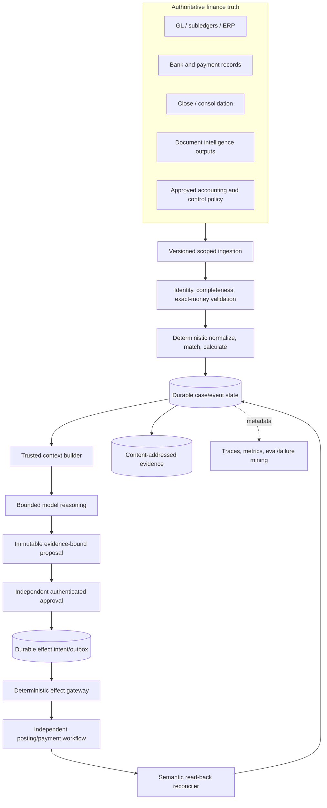

# Finance and Accounting Agent — Research and Architecture Blueprint

> **Research completed:** 2026-08-31  
> **Category:** 38 — Finance and Accounting Agent  
> **Registry status observed:** Active  
> **Packet maturity:** Evidence-backed category blueprint; deployment-specific accounting, legal, tax, audit, privacy, retention, ERP, bank, and control decisions remain mandatory.  
> **Primary output:** [`docs/agents/finance-accounting-agent/`](../../agents/finance-accounting-agent/README.md)

## 1. Executive finding

A production finance/accounting agent should be a bounded evidence-and-proposal system around authoritative ledgers, subledgers, bank records, close workflows, accounting policy, and deterministic effect controls. It should not be an autonomous accountant, poster, payer, certifier, filer, materiality decision-maker, or accounting-policy authority.

The strongest practical first implementation is one legal entity, one book, one bank account, one currency, and one period's bank-to-cash-ledger reconciliation. Deterministic normalization and matching should resolve the unambiguous population; the agent should explain or classify the residual set, cite exact evidence, and abstain on ambiguity. An accountant reviews every proposal. No journal or payment effect is needed to prove initial value.

The research supports seven design conclusions:

1. **Finance identity is irreducibly multidimensional.** Tenant, legal entity, book, ledger/subledger, COA, accounting period, currency role, source record, and source version must be typed state—not inferred from prose.
2. **Models should reason over exceptions, not replace accounting engines.** Exact money, balancing, FX application, source completeness, matching constraints, state transitions, SoD, approval validation, idempotency, and effect reconciliation are deterministic responsibilities.
3. **Approval must bind the exact proposed effect.** Separate identities and systems enforce prepare/review/approve/commit responsibilities. A human message or model confidence is not authority.
4. **Every uncertain external result is a reconciliation problem.** Provider idempotency windows and asynchronous APIs vary. An internal durable intent/effect ledger and semantic read-back are necessary.
5. **Production success is realized close quality.** Measure verified resolutions, aged exceptions, reviewer rework, close critical-path performance, evidence reperformance, late corrections, control exceptions, and full cost—not agent activity.
6. **Connector safety is operation-specific.** Product-level access claims are too coarse: plan/module, tenant/environment, region, API/schema release, permission, finality, idempotency, and evidence semantics must be qualified for every operation.
7. **Human review is a system to evaluate.** A mandatory click does not prove oversight. Measure anchoring, contradiction review, re-performance, override concentration, workload transfer, fallback skill, and realized corrections.

## 2. Research method

### 2.1 Questions investigated

Research proceeded from architecture decisions rather than a generic survey:

- What is accounting truth, and which identity and exact-money semantics must a runtime preserve?
- What authority can safely be delegated while keeping management, accountant, auditor, treasury, tax, and control responsibilities intact?
- How do current ERP/accounting APIs expose journals, asynchronous work, drafts, posting, pagination, limits, and idempotency?
- What current evidence and documentation principles matter for journal proposals, reconciliations, close tasks, and electronically produced information?
- How should materiality, policy change, error correction, currency, consolidation, and intercompany work be represented without pretending one standard or jurisdiction is universal?
- How should bank, invoice, close, consolidation, and reporting integrations be bounded?
- What exact operation manifests and conformance tests are required across ERP/AP/AR, banking/payment, expense, tax, OCR/e-invoice/e-sign, close/workflow, and audit systems?
- How should fraud/AML referrals, supplier/master changes, privacy/hold, data/software supply chain, and human override be separated from ordinary accounting work?
- Which agent-runtime techniques are established production controls, which are emerging guidance, and which are unsafe hype?
- What evaluation, fault injection, observability, incident, deployment, cost, and release practices prove real value?

### 2.2 Source selection

Primary sources were preferred: IFRS Foundation, SEC, PCAOB, GAO, COSO, NIST, IETF, W3C, ISO/XBRL/OASIS/Peppol/European Commission materials, and official ERP/accounting/payment/close-platform documentation. Provider engineering guidance was used for provider mechanics, not as independent evidence of accounting correctness or control effectiveness.

Important claims were cross-checked across sources with different roles. For example:

- materiality was checked across IFRS, SEC, and PCAOB contexts;
- evidence/documentation across PCAOB standards and source-system provenance needs;
- idempotency across general distributed-systems guidance and provider-specific behaviors;
- journal APIs across SAP, Oracle Fusion, Business Central, NetSuite, and Xero;
- agent risks across NIST, OAuth security BCP, OWASP's emerging agentic list, and runtime-control design.

### 2.3 Evidence limits

This was documentation research, not legal/accounting/audit advice, an ERP tenant configuration review, a SOC/ICFR assessment, or a production benchmark. Some official pages are living documents; provider capabilities vary by product edition, country, tenant configuration, feature flag, and API release. Exact laws, standards, policies, tax rules, materiality, retention, and control design must be determined for the deployment.

## 3. Category promotion and completeness record

The category was already marked Active in the registry at the research date. This packet supplies the missing category-specific production architecture and validates that the topic warrants a dedicated guide set rather than one generic back-office page.

| Promotion criterion | Evidence in the blueprint |
|---|---|
| Distinct mission and owner | Finance owns ordinary accounting truth, reconciliation, close support, and accounting proposals |
| Distinct authoritative systems | General ledger, subledgers, ERP/accounting platform, bank/payment data, close/consolidation systems |
| Distinct semantic contracts | Entity/book/period/COA, exact money, journal balance, assertions, FX roles, match sets |
| High-risk authority boundary | Posting, payment, policy, materiality, certification, filing remain outside agent |
| Production failure modes | Wrong boundary, duplicate/unknown effect, stale approval, partial sources, wrong period, evidence corruption |
| Integration depth | SAP, Oracle, Business Central, NetSuite, Xero, banks/ISO 20022, UBL/Peppol, close platforms |
| Runtime specialization | Close calendars, effect reconciliation, evidence manifests, peak queues, correction/reversal lineage |
| Evaluation specialization | Money/accounting graders, match-set accuracy, source completeness, SoD, close outcomes |
| Multi-guide depth | Eleven focused guides plus this dated packet |

## 4. Scope and separation decisions

### 4.1 Owned domain

The category owns:

- legal-entity, book, accounting-period, COA, ledger, and subledger identity;
- ordinary AP/AR accounting support after valid upstream documents exist;
- bank, cash, ledger/subledger, balance-sheet, and other ordinary accounting reconciliations;
- close-task coordination and evidence;
- journal proposals, approval routing, posting handoff, read-back verification, correction/reversal lineage;
- intercompany matching/difference support and consolidation evidence;
- materiality routing under an approved policy, never materiality determination;
- finance SoD, accounting approvals, and evidence packages;
- realized close/reconciliation outcomes.

### 4.2 Adjacent categories

| Adjacent category | Owns | Finance/accounting seam |
|---|---|---|
| FinOps / cloud cost | Cloud usage, allocation, commitments, anomaly economics, optimization | Sends approved allocation/accrual evidence; finance decides ordinary accounting treatment |
| Fraud / AML | Suspicious behavior, networks, cases, monitoring, regulatory escalation | Finance flags anomalies and preserves accounting evidence; does not conclude suspicious activity |
| Document Intelligence | Ingestion, OCR, layout/table extraction, field provenance | Supplies extracted candidate fields; finance validates accounting meaning and matching |
| Procurement | Sourcing, vendor selection, award, requisition/PO policy | Supplies approved commercial commitments/receipts; finance owns invoice accounting and settlement evidence |
| Compliance / GRC | Independent control design, compliance monitoring, issues, attestation programs | Finance supplies evidence; control owner/auditor independently evaluates effectiveness |
| Treasury / payments | Liquidity, payment initiation/approval/release, bank authority | Finance may prepare payable/cash evidence; no agent payment authority |
| Tax | Tax interpretation, provision policy, returns, filings | Finance supplies ledger/evidence; tax specialists retain decisions and filing authority |

### 4.3 Authority decision

The guide set uses a four-level scale:

| Tier | Capability | Default decision |
|---:|---|---|
| FA0 | Observe, calculate, explain, route | Suitable for offline/shadow after controls |
| FA1 | Create immutable evidence-bound proposal | Recommended first production tier |
| FA2 | Stage in proven isolated draft area | Optional, provider-specific |
| FA3 | Handoff already approved immutable intent to independent effect workflow | Exceptional, per effect type/target |
| FA4 — excluded | Approve/post/pay/certify/file/change policy/materiality/master data | Never agent authority |

Maturity does not imply automatic promotion to FA3.

## 5. Accounting and reporting baseline

### 5.1 Policy changes, estimates, and errors

[IAS 8, now titled *Basis of Preparation of Financial Statements*](https://www.ifrs.org/issued-standards/list-of-standards/ias-8-basis-of-preparation-of-financial-statements/), distinguishes accounting-policy changes, changes in estimates, and prior-period errors. Its high-level treatment includes retrospective application/restatement for specified policy changes/errors and prospective recognition for estimate changes, subject to the standard's detailed requirements and impracticability provisions. This directly supports a runtime requirement: correction workflows must record why the change occurred and route it to approved accounting policy rather than automatically “fixing” history.

The title change reflects amendments associated with IFRS 18. Content and effective-date questions must be checked against the entity's adopted standards and transition plan.

### 5.2 IFRS 18 transition

[IFRS 18](https://www.ifrs.org/content/dam/ifrs/publications/pdf-standards/english/2025/issued/part-a/ifrs-18-presentation-and-disclosure-in-financial-statements.pdf?bypass=on) is effective for annual reporting periods beginning on or after 1 January 2027, with earlier application permitted. This is a material refresh trigger for close/reporting mappings, presentation categories, management-defined performance measures, policy retrieval, fixtures, and evidence—without assuming every entity adopts on the same operational schedule.

### 5.3 Consolidation and currency

[IFRS 10](https://www.ifrs.org/issued-standards/list-of-standards/ifrs-10-consolidated-financial-statements/) uses control as the basis for consolidation and presents parent/subsidiaries as a single economic entity in consolidated financial statements. Therefore, the agent may assemble entity-pair evidence and elimination proposals but must not infer the group perimeter from transaction data or org charts.

[IAS 21](https://www.ifrs.org/content/dam/ifrs/publications/pdf-standards/english/2022/issued/part-a/ias-21-the-effects-of-changes-in-foreign-exchange-rates.pdf?bypass=on) distinguishes functional currency, foreign-currency transactions, and presentation currency and contains recognition/translation requirements. The data model consequently preserves original, functional, and presentation amount roles, rates, rate sources, rate dates, and policy versions. “Convert everything to USD” is not a valid general architecture.

### 5.4 Materiality

[IFRS Practice Statement 2](https://www.ifrs.org/issued-standards/list-of-standards/materiality-practice-statement/) provides non-mandatory guidance and emphasizes entity-specific materiality judgments. [SEC SAB 99](https://www.sec.gov/interps/account/sab99.htm) rejects exclusive reliance on a numerical threshold for registrants in scope and discusses qualitative considerations. [PCAOB AS 2810](https://pcaobus.org/oversight/standards/auditing-standards/details/AS2810) addresses qualitative and quantitative evaluation of identified misstatements in applicable audits.

Architecture consequence: store approved quantitative workflow bands as routing data, preserve qualitative flags, and require responsible human judgment. The agent must not label an item immaterial merely because it is below a percentage.

### 5.5 Taxonomy and transactional interchange

The IFRS Foundation announced that the [IFRS Accounting Taxonomy 2025 remains current for 2026](https://www.ifrs.org/news-and-events/news/2026/02/ifrs-accounting-taxonomy-2025-to-remain-current-for-2026/). Reporting taxonomy versions belong in evidence/release metadata.

[XBRL Global Ledger](https://www.xbrl.org/the-standard/what/global-ledger/) is designed for representing accounting and operational detail such as chart-of-accounts and journal information without mandating a universal standardized COA. The [XBRL GL 2015 specification set](https://specifications.xbrl.org/work-product-index-xbrl-gl-xbrl-gl-2015.html) may help interchange designs, but it should be adopted only for a concrete ecosystem need—not imposed as an internal runtime model by default.

## 6. Books, records, controls, evidence, and journal risk

### 6.1 Books and controls

For issuers in scope, [Exchange Act Section 13(b)(2)](https://www.sec.gov/spotlight/fcpa/fcpa-recordkeeping.pdf) includes books-and-records and internal-accounting-control provisions. [SEC rules implementing SOX Section 302](https://www.sec.gov/files/rules/final/33-8124.htm) and [Section 404](https://www.sec.gov/files/rules/final/33-8238.htm) establish certification/management-assessment requirements in their scopes. The agent can preserve evidence and status, but management retains authorization, assessment, and certification.

[COSO's Internal Control—Integrated Framework](https://www.coso.org/guidance-on-ic/pages/default.aspx) remains a widely used framework. COSO has also published [2026 guidance on effective internal control over generative AI](https://www.coso.org/generative-ai). This new guidance is relevant to AI control integration, but local owners must map it to their existing program; its publication does not itself establish operating effectiveness.

[GAO's 2025 Green Book](https://www.gao.gov/greenbook) is effective for US federal fiscal year 2026 and organizes internal control through five components. It is directly relevant to applicable federal entities and can be voluntarily adopted elsewhere, but should not be mislabeled as a universal private-sector mandate.

### 6.2 Audit evidence and documentation

[PCAOB AS 1105](https://pcaobus.org/oversight/standards/auditing-standards/details/AS1105) addresses sufficient appropriate audit evidence, including relevance/reliability and the need to consider supporting and contradictory evidence. It also addresses evaluating information produced by the company, including completeness and accuracy in context. [PCAOB AS 1215](https://pcaobus.org/oversight/standards/auditing-standards/details/AS1215) addresses audit documentation, including purpose, source, conclusions, preparer/reviewer, dates, and reconciliation to underlying records. The PCAOB page notes amendments with an effective date of 15 December 2026; teams must verify which version applies.

These are auditor standards in their scope, not direct universal software requirements. They nevertheless support robust evidence design: provenance, immutable versions, transformations, contradictions, reperformance, and reviewer identity. The agent cannot declare its package sufficient audit evidence or the control effective.

### 6.3 Journal-entry and management-override risk

[PCAOB AS 2401](https://pcaobus.org/oversight/standards/auditing-standards/details/AS2401) describes management-override risk and considerations for journal-entry testing in applicable audits, including period-end, unusual, round-number, seldom-used-account, intercompany, and outside-normal-course characteristics. These are useful review/risk-routing features, not proof of fraud. [PCAOB AS 2201](https://pcaobus.org/oversight/standards/auditing-standards/details/AS2201) describes a top-down approach to ICFR audits in scope.

Architecture consequence: a journal proposal contains assertions, source support, policy version, preparer/reviewer separation, unusual-feature flags, and exact effect intent. It never converts a risk indicator into an accusation or bypasses an independent reviewer.

## 7. Exact money, currency, and documents

### 7.1 Currency identifiers and precision

[ISO 4217:2015](https://www.iso.org/standard/64758.html) remains the published ISO standard for currency codes at the research date. [SIX is the official maintenance agency](https://www.six-group.com/en/products-services/financial-information/market-reference-data/data-standards.html) and publishes amendments, including time-sensitive currency changes. The standard/code list helps identify currencies and their minor-unit conventions but does not define an organization's ledger scale, rounding, FX source, or accounting treatment.

Store amounts as exact integer minor units where the business representation permits or as exact decimal coefficient/scale, always with an explicit currency. Preserve the source representation and policy. Never use binary floating point for journal equality or silently infer scale from a currency code.

### 7.2 Bank messages

The [ISO 20022 message catalogue](https://www.iso20022.org/catalogue-messages) provides versioned financial messages. Common cash-management families include camt.052, camt.053, and camt.054, but bank implementation guides and market profiles determine actual fields and behavior. ISO-family recognition is not proof of complete, duplicate-free, or final data; ingest version, account/statement identity, sequence/cursor, entry identity, status, dates, currencies, and totals, then reconcile.

The [Open Banking UK v4 account-and-transaction profile](https://openbankinguk.github.io/read-write-api-site3/v4.0/profiles/account-and-transaction-api-profile.html) demonstrates consented account/transaction access in one regime. [FDX 6.0 materials](https://developer.financialdataexchange.org/learn-about-fdx-api-v6-0-0) demonstrate a North American data-sharing specification and consent model. Neither is universal; market, institution, product, and consent scope must be mapped.

### 7.3 Electronic invoices

[OASIS UBL 2.4](https://docs.oasis-open.org/ubl/UBL-2.4.html) defines a broad business-document library. [Peppol BIS Billing](https://docs.peppol.eu/poacc/billing/3.0/rules/ubl-peppol/) adds regional/business validation rules for its profile. The European Commission's [eInvoicing standards page](https://ec.europa.eu/digital-building-blocks/sites/spaces/DIGITAL/pages/467108661/European%2BStandard%2Band%2BSpecifications) records current EN 16931-related developments. Profiles evolve; the May 2026 Peppol release and European standard transitions are concrete refresh triggers.

Document validity does not establish accounting validity. Document Intelligence owns parsing/provenance; procurement/receiving owns upstream commercial truth; finance validates entity, supplier/customer, PO/receipt where applicable, tax/accounting fields, duplicates, period, currency, and posting proposal.

## 8. ERP and accounting API findings

### 8.1 Cross-provider conclusion

Current APIs expose materially different semantics for journals, posting, bulk operations, pagination, rate/concurrency limits, and idempotency. Build one typed internal contract with provider-specific adapters and compatibility tests; do not put vendor payloads directly into model reasoning or assume an HTTP response equals an accounting result.

| Platform | Official observation at research date | Architecture decision |
|---|---|---|
| SAP S/4HANA Cloud | Official journal-entry documentation distinguishes synchronous and asynchronous APIs; async processing uses confirmations and suits documented bulk scenarios | Persist message correlation and item outcomes; use provider-recommended path by volume; semantic read-back |
| Oracle Fusion Financials 26B | Versioned REST resources expose journal batches | Pin quarterly version and tenant behavior; track batch status and read back |
| Microsoft Dynamics 365 Business Central | Journal/journal-line APIs exist, with posting represented as a separate bound action | Separate read/draft access from posting permission |
| Oracle NetSuite | Async batch execution, idempotency header support for documented paths, bounded batch size, external IDs, and journal/intercompany resources | Chunk/persist per item; keep internal durable keys; test account concurrency and update side effects |
| Xero | Read Journals and Manual Journals differ; pagination/rate limits and a short documented idempotency window matter | Continue documented pagination; do not treat provider window as durable effect record; qualify required product/security access |

### 8.2 SAP

- [SAP S/4HANA Cloud journal-entry API documentation](https://help.sap.com/docs/SAP_S4HANA_CLOUD/b978f98fc5884ff2aeb10c8fdeb8a43b/f5c8d0579212c525e10000000a4450e5.html)
- [SAP synchronous versus asynchronous journal-entry guidance](https://help.sap.com/docs/SAP_S4HANA_ON-PREMISE/3cb1182b4a184bdd93f8d62e3f1f0741/22a267e571e948499fda007a65b27c64.html)

Do not generalize cloud/on-premises release behavior without checking the deployed edition and release.

### 8.3 Oracle Fusion Financials

- [Oracle Fusion Cloud Financials 26B REST API: Journal Batches](https://docs.oracle.com/en/cloud/saas/financials/26b/farfa/api-journal-batches.html)

Quarterly cloud releases make versioned connector tests and changelog ownership operational requirements.

### 8.4 Business Central

- [Business Central v1.0 journal resource](https://learn.microsoft.com/en-us/dynamics365/business-central/dev-itpro/api-reference/v1.0/resources/dynamics_journal)
- [Business Central v1.0 journal line resource](https://learn.microsoft.com/en-us/dynamics365/business-central/dev-itpro/api-reference/v1.0/resources/dynamics_journalline)

The separate posting action is an architectural gift: do not grant it to the agent credential merely because draft APIs are granted.

### 8.5 NetSuite

- [NetSuite REST async request execution](https://docs.oracle.com/en/cloud/saas/netsuite/ns-online-help/article_0127092747.html)
- [NetSuite idempotency key for asynchronous requests](https://docs.oracle.com/en/cloud/saas/netsuite/ns-online-help/subsect_164494900632.html)
- [NetSuite REST record considerations](https://docs.oracle.com/en/cloud/saas/netsuite/ns-online-help/section_N3683608.html)

NetSuite documentation notes async behavior, an idempotency header for specified paths, batch constraints, and record-specific considerations. Connector tests must also cover external IDs, partial batches, and update behavior. A particularly important caution is that updates to financial records can have domain side effects (for example, documented payment application behavior); generic patch privileges are inappropriate.

### 8.6 Xero

- [Xero Journals](https://developer.xero.com/documentation/api/accounting/journals)
- [Xero Manual Journals](https://developer.xero.com/documentation/api/accounting/manualjournals/)
- [Xero idempotency](https://developer.xero.com/documentation/guides/idempotent-requests/idempotency/)
- [Xero OAuth limits](https://developer.xero.com/documentation/guides/oauth2/limits/)

At the research date, Xero documents pagination and access distinctions for journals, draft/posted manual-journal behavior, rate/concurrency limits, and a six-minute idempotency period in its guide. Errors may be cached under that behavior. Therefore, persist internal intents/results, use stable keys correctly, reconcile before retrying, and test the exact subscription/app security requirements.

## 9. Close, consolidation, and work-management platforms

### 9.1 Evidence found

- [BlackLine Developer Portal](https://developer.blackline.com/) exposes official integration documentation.
- [FloQast Developer Portal](https://developer.floqast.app/) documents APIs spanning close/compliance and accounting data domains; its [authentication guide](https://developer.floqast.app/guides/authentication) and [scope guide](https://developer.floqast.app/quick-start/scopes) support scoped keys and lifecycle considerations.
- [Workiva Developer Hub](https://developers.workiva.com/) documents versioned APIs, activities, tasks, and document/spreadsheet integration and maintains changelogs.
- [Trintech's consolidation and close page](https://www.trintech.com/financial-process/financial-consolidation-and-close/) describes product/connector capabilities.

### 9.2 Decision

Use these platforms as optional systems of workflow/evidence/consolidation truth where the organization already relies on them. Do not require a third-party close platform for the architecture. A small team can begin with an ERP/bank connector, typed case store, approval workflow, and evidence store.

Vendor product claims are evidence of advertised capability, not independent proof of completeness, audit readiness, control effectiveness, or fit. Validate edition, API scope, key expiry, rate limits, region, export, retention, approval semantics, webhook ordering, idempotency, and outage/manual fallback.

### 9.3 Pass 2 operation-qualification findings

The expanded primary-source review found that product names hide materially different operations:

- Business Central purchase invoices expose create/update and a distinct bound `post` action; a connector must deny the sibling action, not merely call the resource “invoice access.”
- Oracle Fusion 26B documents versioned resources and runtime customization headers; response shape and permission depend on the deployed release and tenant setup.
- Open Banking UK v4 documents account-access-consent creation as non-idempotent, demonstrating that even consent operations need method-specific retry rules.
- Stripe documents first-result idempotency (including retained `500` responses), key pruning after at least 24 hours, duplicate/out-of-order webhooks, and API-version-dependent event shapes. None replaces an internal finance intent/effect record.
- Brex separates Expenses, Accounting, Transactions, Payments, and Team surfaces and publishes rolling changes; Ramp spans bill pay, vendors, approvals, reimbursements, cards, and accounting. Finance qualification must admit named read/export operations and explicitly exclude payment/vendor/card authority.
- AvaTax distinguishes estimates, recorded/committed transactions, adjustments, refunds, and voids; transaction identity includes company, code, and type. Tax decision and commit/filing authority stays with tax-owned systems and specialists.
- Azure Document Intelligence `2024-11-30` GA and Google Document AI processor documentation show async results, processor/model versions, release channels, page limits, and region variation. Extraction output remains evidence with field/page provenance, not accounting truth.
- DocuSign Connect availability can depend on account plan; notifications can retry and skip intermediate states. Envelope completion must be reread and mapped to the exact signed document/recipient evidence, never treated as accounting approval by label.
- FloQast documents region-aware API-key services/scopes; Workiva's 2026 API requires version headers, scoped integration users and documents rate/time/payload constraints and a migration lifecycle. Close/audit operations must be qualified separately from task or data reads.

Accordingly, the guide requires one manifest and evidence bundle per `(operation, plan/module, tenant/environment, region, API/schema release, permission set)`, including negative authorization, identity/time, completeness, finality, ambiguity/idempotency, partial failure, security/retention, load/fallback, and change tests. These examples are qualified mechanics, not vendor recommendations or proof of deployed behavior.

## 10. Runtime and effect architecture findings

### 10.1 Provider idempotency is not enough

[Stripe's idempotent-request documentation](https://docs.stripe.com/api/idempotent_requests) describes a provider-specific first-result/key behavior and parameter checking. [Stripe's webhook guidance](https://docs.stripe.com/webhooks) warns integrations to handle duplicate events and not depend on event ordering. Xero documents a much shorter key window and cached-error behavior. [AWS's retries/idempotency article](https://aws.amazon.com/builders-library/making-retries-safe-with-idempotent-APIs/) explains why caller-provided identity and retry semantics matter.

Resolution:

- create the immutable business intent and key before dispatch;
- maintain a provider-independent durable effect ledger;
- reuse the same key only for the same immutable intent;
- classify timeouts by whether application is possible;
- reconcile ambiguous results by provider/external ID and semantic read-back;
- correct/reverse through a linked, approved accounting workflow.

### 10.2 State and context

The runtime requires typed durable state for tenant/entity/book/period, source snapshots, proposals, approvals, effects, contradictions, clocks, and evidence. Business-valid and system-recorded time are both required so late corrections do not rewrite what an earlier run knew. Context is a task-specific view; compaction preserves exact facts and asserts them. The loss-aware receipt now pins releases, event high-water mark, approvals, clocks, pending/unknown effects, invariant digest, omitted immutable references, and next safe action. Resume fails closed on any gap, mismatch, expired approval/pin, inaccessible evidence, or unresolved effect. Vector retrieval returns candidates, not truth or policy. Raw cross-tenant long-term memory is rejected.

### 10.3 Planning and orchestration

Fixed workflow templates are preferable for bank reconciliation, journal proposals, close tasks, and intercompany differences. Dynamic model planning is limited to bounded evidence queries. Software agents impersonating preparer/reviewer/approver roles do not provide SoD; authenticated people and service identities do.

### 10.4 Observability

[W3C Trace Context](https://www.w3.org/TR/trace-context/) provides distributed trace propagation. [OpenTelemetry's GenAI semantic conventions](https://opentelemetry.io/docs/specs/semconv/gen-ai/) are useful but marked Development at the research date, so implementations should pin an internal subset. Finance traces should be metadata-first and exclude raw financial records, secrets, and chain-of-thought.

## 11. Security, privacy, and identity findings

### 11.1 Authentication and least privilege

[OAuth 2.0 Security Best Current Practice, RFC 9700](https://datatracker.ietf.org/doc/html/rfc9700), recommends modern authorization security practices such as avoiding the password grant, restricting token scope/audience, and protecting refresh/access tokens. [RFC 8707](https://datatracker.ietf.org/doc/html/rfc8707) defines resource indicators. [NIST SP 800-53 Rev. 5](https://csrc.nist.gov/pubs/sp/800/53/r5/upd1/final) includes AC-5 segregation of duties and AC-6 least privilege.

Architecture consequence: human, agent runtime, read connector, approval service, effect gateway, evidence, and admin identities are separate. Credentials are short-lived and resource/action scoped. “ERP API access” is not a single permission.

### 11.2 Agent-specific risk

[NIST AI RMF](https://www.nist.gov/itl/ai-risk-management-framework) states that AI RMF 1.0 is being revised at the research date; use it as living voluntary guidance with [NIST AI 600-1](https://nvlpubs.nist.gov/nistpubs/ai/NIST.AI.600-1.pdf) for generative-AI risk considerations. The [OWASP Top 10 for Agentic Applications 2026](https://genai.owasp.org/resource/owasp-top-10-for-agentic-applications-for-2026/) is a useful emerging catalogue, not a settled accounting-control standard.

Prompt injection is particularly plausible because invoices, emails, spreadsheets, bank narrations, and retrieved notes are untrusted. They cannot select tools, targets, credentials, recipients, policies, memory updates, or approvals. Parse typed fields, label trust, constrain egress, and test injected fixtures.

### 11.3 Privacy and retention

The correct schedule depends on jurisdiction and record class. The [SEC rule on retention of records relevant to audits and reviews](https://www.sec.gov/rules-regulations/2003/01/retention-records-relevant-audits-reviews) is an example of a scoped requirement, not a universal schedule. GDPR Article 5 provides purpose limitation, minimization, storage limitation, integrity/confidentiality, and accountability principles in its scope; Articles 17–19 include erasure/restriction and recipient-notification mechanics with exceptions including legal claims. Model inputs/outputs, vector indexes, caches, fixtures, provider logs, evidence, exports, and backups all need explicit classification, residency, retention, deletion propagation, and legal-hold behavior.

### 11.4 Fraud/AML and master-data boundary

FATF's current Recommendations page is updated through June 2026; its accounting-profession risk-based guide explicitly warns that it predates later changes. FATF Recommendation 20 materials state that suspicious transactions, including attempted ones, should be reported regardless of amount in applicable regimes. FinCEN guidance makes SARs and information revealing their existence confidential in its scope. The architecture therefore stops ordinary automation, preserves minimal underlying facts, and refers to a restricted owner without producing a suspicion verdict or exposing downstream report status. General prompts, traces, reviewer queues, and outcome memory cannot contain protected SAR decisions.

Supplier/bank/tax/customer master changes are separately governed. Invoice or email content may trigger a discrepancy but cannot supply or verify a new beneficiary. Independent trusted-channel verification, old/new value digest approval, SoD from payment release, cooling-off/block policy, reread, and first-transaction reconciliation are required.

### 11.5 Data and software supply chain

NIST SP 800-218 supports secure-development, artifact protection, provenance, dependency, acquisition, and vulnerability-response practices. The finance design extends the same discipline to data: original ERP/bank/document digest, schema/profile, tenant/entity, completeness, transformation, master/policy effective version, OCR/model release, and corpus permission are pinned. Signed software does not make cross-tenant, incomplete, poisoned, or future-leaking data safe. Connector/schema, policy, model, prompt, retrieval index, rule, dependency, and evaluation-set changes are part of one integrity-protected behavior release.

## 12. Evaluation findings

### 12.1 Multi-turn evaluation

[Anthropic's 2026 engineering guide on agent evals](https://www.anthropic.com/engineering/demystifying-evals-for-ai-agents) recommends task/trajectory evaluation, multiple grader types, and repeated trials. It is useful operational guidance but remains vendor-authored. Finance evaluation must add deterministic exact-money, identity, source-completeness, SoD, idempotency, effect, and evidence graders.

### 12.2 Contamination and cheating

[NIST's evaluation-cheating work](https://www.nist.gov/caisi/cheating-ai-agent-evaluations) supports concern about contamination and gaming. Use time/entity holdouts, a never-seen challenge set, provenance, and audited fixture access. Historical approved cases are not automatically correct labels.

### 12.3 Hard gates

Non-compensating failures are: unauthorized/wrong-boundary effect; self/stale/substituted approval; duplicate external effect; lost exact accounting fact after compaction/restart; conclusion from incomplete source; secret or cross-tenant exposure; unknown effect without reconciliation; evidence/proposal mismatch; closed-period bypass.

### 12.4 Outcome evidence

Offline quality is necessary but insufficient. Measure close duration/critical path, reconciling-item age, reviewer time/rework, late adjustments, post-close corrections, intercompany difference age, control exceptions, evidence reperformance time, and total cost per verified resolution. Control for volume and entity mix.

### 12.5 Human factors and temporal validity

NIST AI RMF calls for defined and assessed human-AI roles and oversight and acknowledges cognitive bias in human-AI configurations. PCAOB material on technology-assisted analysis describes the risk of favoring automated output despite contradictory evidence in the audit context. The blueprint therefore measures reviewer decisions before/after assistance where feasible, contradiction inspection, deterministic reperformance, alternative-candidate review, anchoring by confidence/explanation, override concentration, queue/after-hours load, accessibility, and manual fallback—not just presence of a reviewer click.

Historical fixtures carry separate business and recorded-knowledge cutoffs. Later correction, settlement, close result, reviewer label, audit finding, policy/COA update, or restatement is excluded from original context. Time/entity/supplier/template/incident holdouts, near-duplicate removal, sealed challenge access, future-leak canaries, and label review distinguish reproducible as-of evaluation from hindsight.

## 13. Contradictions and how the blueprint resolves them

| Apparent conflict | Evidence | Resolution |
|---|---|---|
| “Automate the close” versus human accountability | Close vendors advertise automation; SEC/SOX/control/audit responsibilities remain human/organizational | Automate evidence and workflow; do not transfer certification, policy, materiality, or control conclusions |
| “Use an AI reviewer for SoD” versus independent duties | Multi-agent patterns simulate roles; NIST AC-5 requires separated duties/individual responsibilities | Software personas do not create independent authority; use distinct authenticated identities/services |
| “Use one materiality percentage” versus contextual judgment | Operational workflows want thresholds; IFRS/SEC/PCAOB sources emphasize qualitative context in their scopes | Versioned thresholds route work only; accountable humans decide materiality |
| “Provider idempotency prevents duplicates” versus short/variable semantics | Stripe and Xero document materially different behavior/windows; async ERP calls add ambiguity | Internal durable intent/effect ledger, stable key, reconciliation and semantic read-back |
| “A successful API call means posted” versus asynchronous/batch workflows | SAP/Oracle/NetSuite expose async/batch status and partial outcomes | Separate accepted, effect-unknown, verifying, verified, and failed states |
| “Valid electronic invoice means valid accounting” | UBL/Peppol validate document/profile rules | Finance still validates entity, duplicate, receipt/PO, tax/accounting treatment, period, and currency |
| “XBRL GL standardizes the COA” versus local charts | XBRL GL supports transactional interchange without requiring a standard COA | Keep local COA authoritative; use XBRL GL only when interoperability warrants it |
| “Store history in model memory” versus accounting durability | Agent patterns favor memory; audit/effect requirements demand exact reproducibility | Typed durable state and evidence are authoritative; retrieval is candidate-only |
| “More automation equals value” versus control/rework | Vendor metrics often emphasize tasks/automation | Measure verified close outcomes and countermetrics such as late correction/waiver/control failure |
| “One API adapter fits all” versus product semantics | SAP, Oracle, BC, NetSuite, Xero differ | Stable internal contracts plus versioned provider adapters and contract tests |
| “OpenTelemetry GenAI fields are standard” versus Development status | OTel labels the conventions Development | Pin an internal mapping and version it; avoid assuming long-term stability |
| “NIST AI RMF is fixed” versus active revision | NIST page reports revision activity | Record research date, monitor changes, and keep organization-specific control mapping |

## 14. Rejected and deferred designs

| Design | Decision | Reason |
|---|---|---|
| Autonomous journal posting | Reject | Combines probabilistic reasoning with high-impact commitment and weakens independent approval |
| Autonomous payment or vendor-bank change | Reject | Cash/fraud risk and treasury authority are outside the category |
| Autonomous materiality/policy decision | Reject | Contextual accountable judgment; standards and entity policy vary |
| “Multi-agent accounting department” | Reject initially | Adds orchestration and illusory SoD without independent identity |
| Model performs arithmetic/FX/balance checks | Reject | Exact deterministic calculation is simpler and auditable |
| Global cross-tenant memory/vector store | Reject | Leakage, poisoning, stale policy, and authority confusion |
| Provider API response as effect truth | Reject | Async, duplicate, timeout, and partial outcomes require reconciliation |
| Generic ERP write credential | Reject | Violates least authority; record updates can have broad domain side effects |
| One giant guide | Reject | Runtime, controls, domain semantics, operations, and roadmap require focused reference guides |
| Mandatory close platform | Reject | Adds cost/dependency without being necessary for the first loop |
| Fine-tuning as MVP | Defer | Retrieval/rules/workflow and evaluation should prove the gap first |
| XBRL GL as canonical internal model | Defer | Useful for concrete interchange; unnecessary complexity otherwise |
| FA2 provider draft by label alone | Reject | Some drafts can trigger workflows or appear authoritative; isolation must be proven |
| Composite “agent score” | Reject | Allows safety/control regression to be hidden by quality or speed |
| Real-time everything | Reject | Many close/reconciliation tasks benefit from controlled snapshots and as-of semantics |

## 15. Selected production architecture

Key seams:

- truth systems own balances and transaction status;
- ingestion proves identity/completeness;
- deterministic services own exact calculation and constraints;
- model owns bounded exception reasoning/explanation;
- proposal store owns immutable recommendation lineage;
- approval service owns human authority and digest binding;
- effect gateway owns dispatch guards, not accounting approval;
- external system plus read-back owns effect truth;
- evidence service owns reproducible support;
- telemetry owns operations, not financial truth.

## 16. Guide-set design and coverage

| Guide | Primary decision covered |
|---|---|
| [README](../../agents/finance-accounting-agent/README.md) | Category mission, authority, architecture, first loop, guide map |
| [Mission, boundaries, workload fit, and authority](../../agents/finance-accounting-agent/01-mission-boundaries-workload-fit-and-authority.md) | Qualification, deterministic alternative, assertions, ownership |
| [Reference architecture, technology, and integrations](../../agents/finance-accounting-agent/02-reference-architecture-technology-and-integrations.md) | Components, ERP/bank/document/close adapters, build/buy decisions |
| [Ledger, entity, period, money, and currency semantics](../../agents/finance-accounting-agent/03-ledger-entity-period-money-and-currency-semantics.md) | Accounting truth and exact contracts |
| [AP, AR, matching, and reconciliation](../../agents/finance-accounting-agent/04-ap-ar-matching-and-reconciliation.md) | Match sets, exceptions, ordinary finance boundaries |
| [Close, journals, intercompany, and consolidation](../../agents/finance-accounting-agent/05-close-journals-intercompany-and-consolidation.md) | Close DAG, journal lifecycle, materiality routing, group evidence |
| [State, events, context, memory, and planning](../../agents/finance-accounting-agent/06-state-events-context-memory-and-planning.md) | Durable runtime, all memory classes, compaction, bounded plans |
| [Tools, effects, idempotency, reconciliation, and recovery](../../agents/finance-accounting-agent/07-tools-effects-idempotency-reconciliation-and-recovery.md) | Tool authority, effect state, retries, ambiguous outcomes, corrections |
| [Security, privacy, SoD, approvals, and audit evidence](../../agents/finance-accounting-agent/08-security-privacy-segregation-of-duties-approvals-and-audit-evidence.md) | Least privilege, approval contract, injection, evidence, privacy |
| [Evaluation, observability, fault injection, and release gates](../../agents/finance-accounting-agent/09-evaluation-observability-fault-injection-and-release-gates.md) | Hard gates, graders, traces/SLOs, realized outcomes |
| [Deployment, capacity, cost, incidents, and evolution](../../agents/finance-accounting-agent/10-deployment-capacity-cost-incidents-and-continuous-evolution.md) | Close-peak production operations and full behavior releases |
| [Roadmap Stage 0–6](../../agents/finance-accounting-agent/11-roadmap-stage-0-to-production-and-scale.md) | Deterministic start, MVP, v1, production, scale, continuous governance |

## 17. Source register

Unless an item says otherwise, every linked source below was accessed **2026-08-31**. Dates and versions describe what was checked, not a promise of future availability. Living provider pages must be rechecked against the licensed plan/module, tenant/environment, region, API/schema release, permissions, feature flags, and deprecation notices before implementation.

### 17.1 Accounting standards and taxonomy

1. IFRS Foundation, [IAS 8 — Basis of Preparation of Financial Statements](https://www.ifrs.org/issued-standards/list-of-standards/ias-8-basis-of-preparation-of-financial-statements/) — policy/estimate/error distinctions and current title.
2. IFRS Foundation, [IFRS 18 — Presentation and Disclosure in Financial Statements](https://www.ifrs.org/content/dam/ifrs/publications/pdf-standards/english/2025/issued/part-a/ifrs-18-presentation-and-disclosure-in-financial-statements.pdf?bypass=on) — 2027 effective date and transition trigger.
3. IFRS Foundation, [IFRS 10 — Consolidated Financial Statements](https://www.ifrs.org/issued-standards/list-of-standards/ifrs-10-consolidated-financial-statements/) — control and consolidated reporting basis.
4. IFRS Foundation, [IAS 21 — Effects of Changes in Foreign Exchange Rates](https://www.ifrs.org/content/dam/ifrs/publications/pdf-standards/english/2022/issued/part-a/ias-21-the-effects-of-changes-in-foreign-exchange-rates.pdf?bypass=on) — currency roles and translation context.
5. IFRS Foundation, [IFRS Practice Statement 2: Making Materiality Judgements](https://www.ifrs.org/issued-standards/list-of-standards/materiality-practice-statement/) — non-mandatory, entity-specific materiality guidance.
6. IFRS Foundation, [IFRS Accounting Taxonomy 2025 remains current for 2026](https://www.ifrs.org/news-and-events/news/2026/02/ifrs-accounting-taxonomy-2025-to-remain-current-for-2026/) — taxonomy currency.
7. XBRL International, [XBRL Global Ledger](https://www.xbrl.org/the-standard/what/global-ledger/) — transactional/accounting interchange purpose.
8. XBRL International, [XBRL GL 2015 specification set](https://specifications.xbrl.org/work-product-index-xbrl-gl-xbrl-gl-2015.html) — specification status.

### 17.2 Securities, audit, and internal control

9. SEC, [Exchange Act Section 13(b)(2) books, records, and internal accounting controls](https://www.sec.gov/spotlight/fcpa/fcpa-recordkeeping.pdf).
10. SEC, [Staff Accounting Bulletin No. 99 — Materiality](https://www.sec.gov/interps/account/sab99.htm).
11. SEC, [Certification of Disclosure in Companies' Quarterly and Annual Reports (SOX 302)](https://www.sec.gov/files/rules/final/33-8124.htm).
12. SEC, [Management's Reports on Internal Control Over Financial Reporting (SOX 404)](https://www.sec.gov/files/rules/final/33-8238.htm).
13. SEC, [Retention of Records Relevant to Audits and Reviews](https://www.sec.gov/rules-regulations/2003/01/retention-records-relevant-audits-reviews).
14. PCAOB, [AS 1105 — Audit Evidence](https://pcaobus.org/oversight/standards/auditing-standards/details/AS1105).
15. PCAOB, [AS 1215 — Audit Documentation](https://pcaobus.org/oversight/standards/auditing-standards/details/AS1215).
16. PCAOB, [AS 2201 — An Audit of Internal Control Over Financial Reporting](https://pcaobus.org/oversight/standards/auditing-standards/details/AS2201).
17. PCAOB, [AS 2401 — Consideration of Fraud in a Financial Statement Audit](https://pcaobus.org/oversight/standards/auditing-standards/details/AS2401).
18. PCAOB, [AS 2810 — Evaluating Audit Results](https://pcaobus.org/oversight/standards/auditing-standards/details/AS2810).
19. GAO, [Standards for Internal Control in the Federal Government — 2025 Green Book](https://www.gao.gov/greenbook).
20. COSO, [Internal Control—Integrated Framework](https://www.coso.org/guidance-on-ic/pages/default.aspx).
21. COSO, [Achieving Effective Internal Control Over Generative AI](https://www.coso.org/generative-ai).

### 17.3 Money, payments, banking, and documents

22. ISO, [ISO 4217:2015 — Currency codes](https://www.iso.org/standard/64758.html).
23. SIX, [Financial data standards and ISO 4217 maintenance](https://www.six-group.com/en/products-services/financial-information/market-reference-data/data-standards.html).
24. ISO 20022, [Message catalogue](https://www.iso20022.org/catalogue-messages).
25. OASIS, [Universal Business Language 2.4](https://docs.oasis-open.org/ubl/UBL-2.4.html).
26. OpenPeppol, [Peppol BIS Billing 3.0 validation rules](https://docs.peppol.eu/poacc/billing/3.0/rules/ubl-peppol/).
27. European Commission, [European eInvoicing standard and specifications](https://ec.europa.eu/digital-building-blocks/sites/spaces/DIGITAL/pages/467108661/European%2BStandard%2Band%2BSpecifications).
28. Open Banking Limited, [Read/write API v4 account and transaction profile](https://openbankinguk.github.io/read-write-api-site3/v4.0/profiles/account-and-transaction-api-profile.html).
29. Financial Data Exchange, [FDX API 6.0 materials](https://developer.financialdataexchange.org/learn-about-fdx-api-v6-0-0).
30. Stripe, [Idempotent requests](https://docs.stripe.com/api/idempotent_requests).
31. Stripe, [Webhooks](https://docs.stripe.com/webhooks).

### 17.4 ERP and accounting systems

32. SAP, [S/4HANA Cloud journal-entry API](https://help.sap.com/docs/SAP_S4HANA_CLOUD/b978f98fc5884ff2aeb10c8fdeb8a43b/f5c8d0579212c525e10000000a4450e5.html).
33. SAP, [Synchronous and asynchronous journal-entry APIs](https://help.sap.com/docs/SAP_S4HANA_ON-PREMISE/3cb1182b4a184bdd93f8d62e3f1f0741/22a267e571e948499fda007a65b27c64.html).
34. Oracle, [Fusion Cloud Financials 26B journal batches API](https://docs.oracle.com/en/cloud/saas/financials/26b/farfa/api-journal-batches.html).
35. Microsoft, [Business Central journal resource](https://learn.microsoft.com/en-us/dynamics365/business-central/dev-itpro/api-reference/v1.0/resources/dynamics_journal).
36. Microsoft, [Business Central journal line resource](https://learn.microsoft.com/en-us/dynamics365/business-central/dev-itpro/api-reference/v1.0/resources/dynamics_journalline).
37. Oracle, [NetSuite asynchronous request execution](https://docs.oracle.com/en/cloud/saas/netsuite/ns-online-help/article_0127092747.html).
38. Oracle, [NetSuite idempotency key](https://docs.oracle.com/en/cloud/saas/netsuite/ns-online-help/subsect_164494900632.html).
39. Oracle, [NetSuite REST record considerations](https://docs.oracle.com/en/cloud/saas/netsuite/ns-online-help/section_N3683608.html).
40. Xero, [Journals API](https://developer.xero.com/documentation/api/accounting/journals).
41. Xero, [Manual Journals API](https://developer.xero.com/documentation/api/accounting/manualjournals/).
42. Xero, [Idempotent requests](https://developer.xero.com/documentation/guides/idempotent-requests/idempotency/).
43. Xero, [OAuth limits](https://developer.xero.com/documentation/guides/oauth2/limits/).

### 17.5 Close and reporting platforms

44. BlackLine, [Developer portal](https://developer.blackline.com/).
45. FloQast, [Developer portal](https://developer.floqast.app/).
46. FloQast, [Authentication](https://developer.floqast.app/guides/authentication).
47. FloQast, [API scopes](https://developer.floqast.app/quick-start/scopes).
48. Workiva, [Developer hub](https://developers.workiva.com/).
49. Trintech, [Financial consolidation and close](https://www.trintech.com/financial-process/financial-consolidation-and-close/).

### 17.6 Security, identity, AI evaluation, and operations

50. NIST, [SP 800-53 Rev. 5](https://csrc.nist.gov/pubs/sp/800/53/r5/upd1/final).
51. IETF, [RFC 9700 — OAuth 2.0 Security Best Current Practice](https://datatracker.ietf.org/doc/html/rfc9700).
52. IETF, [RFC 8707 — Resource Indicators for OAuth 2.0](https://datatracker.ietf.org/doc/html/rfc8707).
53. NIST, [AI Risk Management Framework](https://www.nist.gov/itl/ai-risk-management-framework).
54. NIST, [AI 600-1 — Generative Artificial Intelligence Profile](https://nvlpubs.nist.gov/nistpubs/ai/NIST.AI.600-1.pdf).
55. OWASP, [Top 10 for Agentic Applications 2026](https://genai.owasp.org/resource/owasp-top-10-for-agentic-applications-for-2026/).
56. NIST CAISI, [Reducing the risk of evaluation cheating in AI](https://www.nist.gov/caisi/cheating-ai-agent-evaluations).
57. Anthropic, [Demystifying evals for AI agents](https://www.anthropic.com/engineering/demystifying-evals-for-ai-agents).
58. W3C, [Trace Context](https://www.w3.org/TR/trace-context/).
59. OpenTelemetry, [Generative AI semantic conventions](https://opentelemetry.io/docs/specs/semconv/gen-ai/).
60. NIST, [SP 800-61 Rev. 3 — Incident Response Recommendations](https://csrc.nist.gov/pubs/sp/800/61/r3/final).
61. AWS Builders' Library, [Making retries safe with idempotent APIs](https://aws.amazon.com/builders-library/making-retries-safe-with-idempotent-APIs/).

### 17.7 Pass 2 primary-source additions

62. Microsoft, [Business Central v2.0 purchase-invoice resource](https://learn.microsoft.com/en-us/dynamics365/business-central/dev-itpro/api-reference/v2.0/resources/dynamics_purchaseinvoice) — checked 2026-08-31; create/update/delete/read share a resource while posting is a distinct bound action, and posted-successor identity needs explicit mapping; deployment/version authorization still applies.
63. Oracle, [Fusion Cloud Financials 26B REST API overview](https://docs.oracle.com/en/cloud/saas/financials/26b/farfa/index.html) and [all endpoints](https://docs.oracle.com/en/cloud/saas/financials/26b/farfa/rest-endpoints.html) — checked release 26B (last-updated April 2026); resources can have multiple versions and tenant runtime customization/security affects shape and availability.
64. Open Banking Limited, [Account and Transaction API Profile v4.0](https://openbankinguk.github.io/read-write-api-site3/v4.0/profiles/account-and-transaction-api-profile.html) — one UK regime; documents account-access-consent creation as non-idempotent and constrains cross-version consent use, so it is not a universal bank API or retry rule.
65. Stripe, [Idempotent requests](https://docs.stripe.com/api/idempotent_requests) — checked 2026-08-31; first status/body can include `500`, parameter comparison applies, and keys may be pruned after at least 24 hours; provider behavior does not replace an internal durable effect ledger.
66. Stripe, [Webhook event delivery behavior](https://docs.stripe.com/webhooks#event-delivery-behaviors) — checked 2026-08-31; live retries, duplicate delivery, no ordering guarantee, event/API-version behavior, and signature requirements must be qualified for the account/event surface.
67. Brex, [Developer overview](https://developer.brex.com/), [roles/permissions/scopes](https://developer.brex.com/guides/roles_permissions_scopes), and [changelog](https://developer.brex.com/changelog) — checked 2026-08-31; expense/accounting/transaction/payment/team surfaces are separate and the rolling changelog makes operation-level scope and compatibility tests mandatory; no endorsement.
68. Ramp, [Developer API documentation](https://docs.ramp.com/) — checked 2026-08-31; product surfaces span bills, payments, vendors, approvals, reimbursements, cards, accounting and webhooks, with sandbox/OpenAPI availability; each operation and licensed deployment requires independent qualification; no endorsement.
69. Avalara, [AvaTax v2 CreateTransaction](https://developer.avalara.com/products/avatax/api/methods/Transactions/CreateTransaction/) and [voiding documents](https://developer.avalara.com/avatax/voiding-documents) — checked 2026-08-31; estimate/record/commit/refund/void semantics, company-code/type identity, roles and subscribed services differ; tax interpretation and filing remain specialist-owned.
70. Microsoft, [Azure Document Intelligence invoice model](https://learn.microsoft.com/en-us/azure/ai-services/document-intelligence/prebuilt/invoice?view=doc-intel-4.0.0) and [2024-11-30 Analyze Document API](https://learn.microsoft.com/en-us/rest/api/aiservices/document-models/analyze-document?view=rest-aiservices-v4.0%2B%282024-11-30%29) — checked GA API `2024-11-30`; extraction is asynchronous and model/language/input/region/feature limits must be pinned; output is not accounting approval.
71. Google Cloud, [Document AI processor list](https://cloud.google.com/document-ai/docs/processors-list) and [processor version management](https://cloud.google.com/document-ai/docs/manage-processor-versions) — checked 2026-08-31; invoice/expense/OCR versions, stable versus release-candidate channels, regions, quotas and deprecations vary; original/page-field provenance and regression tests remain necessary.
72. DocuSign, [Adding Connect webhooks to an application](https://www.docusign.com/blog/developers/dsdev-adding-webhooks-application) and [Connect failure/retry handling](https://www.docusign.com/blog/developers/common-api-tasks-get-connect-failure-logs-and-attempt-to-retry-webhook-call) — official developer guidance; account-level availability can be plan-dependent, events may skip intermediate status and delivery can retry; reread exact envelope/document/recipient status.
73. FloQast, [authentication](https://developer.floqast.app/guides/authentication) and [API scopes](https://developer.floqast.app/quick-start/scopes) — checked 2026-08-31; region is instance-dependent, key creation/services/expiry are configured in the tenant, and additional services may require enablement; API coverage is not proof of close/control effectiveness.
74. Workiva, [2026-01-01 API overview](https://developers.workiva.com/2026-01-01/overview.html), [setup](https://developers.workiva.com/2026-01-01/setup.html), [limits](https://developers.workiva.com/2026-01-01/limits.html), [Processes API](https://developers.workiva.com/2026-01-01/processes-guide.html), and [Activities API](https://developers.workiva.com/2026-01-01/activities-guide.html) — checked 2026-08-31; `X-Version`, integration-user permissions/scopes, regions, async operations, role-gated activities, rate/time/payload limits and the 2022→2026 migration lifecycle require per-operation tests; no endorsement.
75. FATF, [The FATF Recommendations](https://www.fatf-gafi.org/en/publications/Fatfrecommendations/Fatf-recommendations.html) — page last updated June 2026 when checked; applicable obligations depend on jurisdiction/covered entity and require qualified legal/compliance interpretation.
76. FATF, [Risk-Based Approach for the Accounting Profession](https://www.fatf-gafi.org/en/publications/Fatfrecommendations/Rba-accounting-profession.html) — useful profession-specific baseline, but the page warns it does not reflect later revisions including 2025 Recommendation 1 changes; read with the current Recommendations.
77. FinCEN, [Maintaining the Confidentiality of Suspicious Activity Reports](https://www.fincen.gov/resources/advisories/fincen-advisory-fin-2010-a014) and [October 2025 SAR FAQs](https://www.fincen.gov/resources/statutes-regulations/guidance/frequently-asked-questions-regarding-suspicious-activity) — US BSA scope only; SAR and existence-revealing information are protected, so general finance-agent context/telemetry must not expose downstream referral status.
78. European Union, [GDPR consolidated text, Articles 5 and 17–19](https://eur-lex.europa.eu/eli/reg/2016/679/oj/eng) — EU-law scope only; supports purpose/minimization/storage/accountability and erasure/restriction/recipient propagation with legal exceptions, not a universal retention schedule.
79. NIST, [SP 800-218 Secure Software Development Framework 1.1](https://csrc.nist.gov/pubs/sp/800/218/final) — February 2022 final checked 2026-08-31; high-level secure development/acquisition/provenance practices must be adapted to the organization's software and data supply chain.
80. NIST, [AI RMF Core](https://airc.nist.gov/airmf-resources/airmf/5-sec-core/) and [Appendix C on human-AI interaction](https://airc.nist.gov/airmf-resources/airmf/appendices/app-c-ai-risk-management-and-human-ai-interaction/) — voluntary AI RMF 1.0 material under revision at the research date; supports defining and assessing human oversight and cognitive-bias risks but supplies no finance-specific threshold.
81. CNCF CloudEvents, [core specification](https://github.com/cloudevents/spec/blob/ce@stable/cloudevents/spec.md) — stable-tag vendor-neutral envelope semantics; source+ID can identify duplicates, but domain ordering, delivery, retention and accounting meaning remain application responsibilities.
82. PCAOB, [2024 technology-assisted analysis amendments announcement](https://pcaobus.org/news-events/news-releases/news-release-detail/pcaob-updates-its-standards-to-clarify-auditor-responsibilities-when-using-technology-assisted-analysis) and [technology/automation-bias discussion](https://pcaobus.org/news-events/speeches/speech-detail/algorithms-audits-and-the-auditor) — PCAOB-audit context; supports reliable electronic information, skepticism and avoiding overreliance, not a universal accounting-agent UX rule.
83. PCAOB, [AS 1215 current page](https://pcaobus.org/oversight/standards/auditing-standards/details/AS1215) and [version effective 15 December 2026](https://pcaobus.org/oversight/standards/auditing-standards/details/as-1215--audit-documentation-%28effective-on-12-15-2026%29) — applicability/version must be checked by engagement and date; included to prevent presenting amended documentation rules as already universal.

## 18. Known uncertainties and limitations

### 18.1 Standards and jurisdiction

- The guide set is not a complete treatment of IFRS, US GAAP, statutory, tax, prudential, nonprofit, or public-sector accounting.
- Entities may use different adopted standards, transition choices, fiscal calendars, functional currencies, and local chart/accounting policies.
- IFRS 18's 2027 effective date makes 2026–2028 a transition-sensitive period.
- PCAOB/SEC sources apply to defined entities/audits; their principles should not be presented as universal law.
- AS 1215 amendments noted for 15 December 2026 require version/applicability confirmation.
- Materiality and error correction are context-dependent human/accounting-policy judgments.

### 18.2 Integrations

- Official API behavior can vary by tenant, edition, country, feature flag, authentication mode, and release.
- Some portal documentation is dynamically rendered, gated, or periodically reorganized.
- Bank data may be pending, corrected, duplicated, incomplete, or timezone-dependent despite standards-based formats.
- Provider “draft,” “posted,” “accepted,” and “complete” states are not semantically interchangeable.
- Close-platform claims were not independently benchmarked.

### 18.3 AI and runtime

- Agent/evaluation guidance is evolving; OWASP's agentic list is emerging and OpenTelemetry GenAI conventions are Development.
- NIST states AI RMF 1.0 is under revision.
- No model, prompt, or matching-quality benchmark was selected because workload-specific evaluation must drive that decision.
- Numeric SLOs, confidence thresholds, matching tolerances, planning budgets, RTO/RPO, and retention periods intentionally remain organization-set.
- The architecture has not been validated against a live ERP/bank tenant in this research task.

## 19. Refresh triggers

Refresh this packet and impacted guides when any of the following occurs:

- at least every six months, with a focused check before a major close/platform release;
- IFRS 18 transition/adoption guidance or relevant IFRS/GAAP/local standards change;
- IFRS taxonomy, XBRL GL, ISO 4217, ISO 20022, UBL, Peppol, or EN 16931 profile/version change;
- SEC/PCAOB/COSO/GAO requirements or guidance relevant to scope change;
- SAP, Oracle Fusion, Business Central, NetSuite, Xero, bank, close, document, payment, identity, or model API behavior changes;
- new entity, jurisdiction, book, COA, calendar, functional currency, ERP, bank, or consolidation platform;
- NIST AI RMF revision, OAuth/security BCP change, OWASP update, or OpenTelemetry GenAI stabilization;
- incident, audit/control finding, material correction, duplicate/unknown effect, prompt injection, or privacy event;
- model, prompt, context builder, compaction, memory, retrieval, tool, policy, approval, schema, or release process changes;
- realized outcomes stop improving or control/rework countermetrics worsen.

Every refresh should record checked dates/versions even when no change is needed.

## 20. Quality-control record

- [x] Category and adjacent boundaries are explicit.
- [x] Deterministic alternative, first loop, MVP, v1, production, scale, and continuous evolution are covered.
- [x] Legal entity, book, COA, ledger/subledger, AP/AR, close, journals, matching/reconciliation, intercompany, consolidation, materiality, SoD, approvals, evidence, correction/reversal, and integrations are covered.
- [x] Exact money/currency/period and schemas/contracts are included.
- [x] Context/compaction and every requested memory class are explicitly covered or rejected.
- [x] Planning, state/events/effects, idempotency, reconciliation, recovery, security/privacy, evaluation/faults, deployment/capacity/cost, observability/SLOs, incidents, and behavior releases are covered.
- [x] Authority retained by humans/deterministic systems is explicit at every stage.
- [x] Sources are predominantly primary and dated; provider claims are bounded.
- [x] Disagreement, uncertainty, emerging guidance, deprecated/transitioning approaches, and refresh triggers are recorded.
- [x] The output remains Markdown-only and limited to the delegated category and packet paths.
